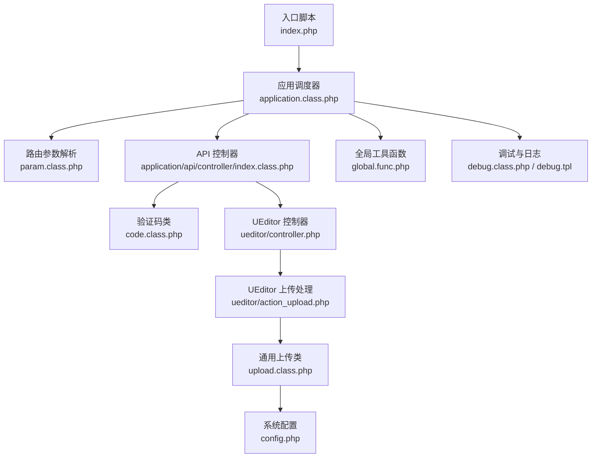
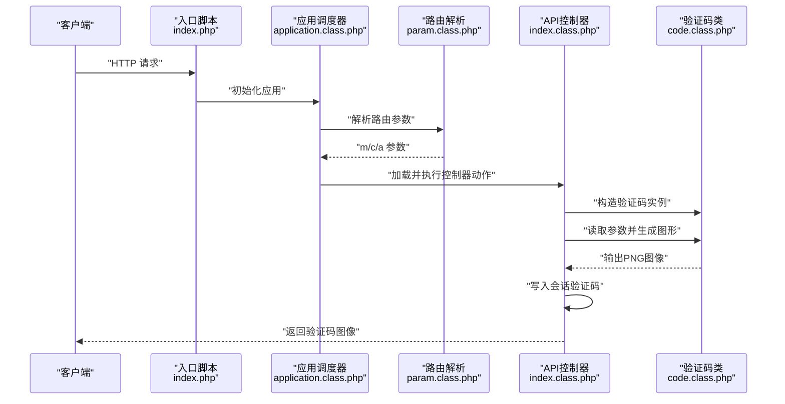
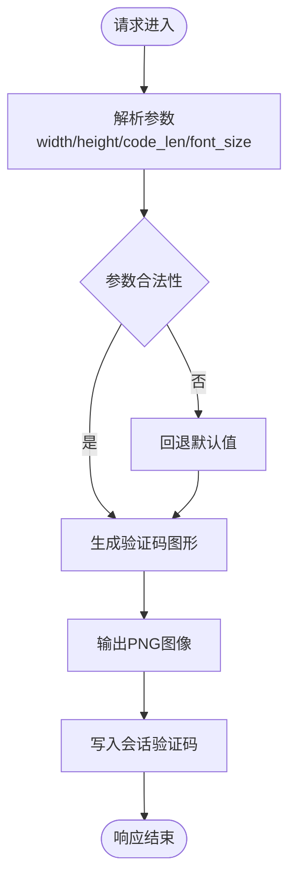
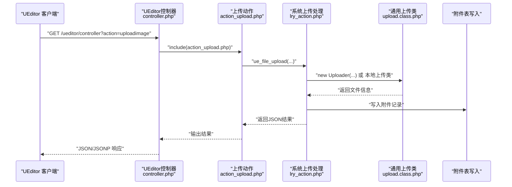
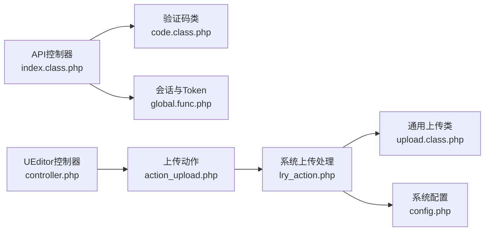

# API接口

<cite>
**本文引用的文件**
- [index.php](file://index.php)
- [application/api/controller/index.class.php](file://application/api/controller/index.class.php)
- [ryphp/core/class/code.class.php](file://ryphp/core/class/code.class.php)
- [common/static/plugin/ueditor/php/controller.php](file://common/static/plugin/ueditor/php/controller.php)
- [common/static/plugin/ueditor/php/action_upload.php](file://common/static/plugin/ueditor/php/action_upload.php)
- [common/static/plugin/ueditor/php/lry_action.php](file://common/static/plugin/ueditor/php/lry_action.php)
- [ryphp/core/class/upload.class.php](file://ryphp/core/class/upload.class.php)
- [common/config/config.php](file://common/config/config.php)
- [ryphp/core/class/application.class.php](file://ryphp/core/class/application.class.php)
- [ryphp/core/class/param.class.php](file://ryphp/core/class/param.class.php)
- [ryphp/core/function/global.func.php](file://ryphp/core/function/global.func.php)
- [ryphp/core/class/debug.class.php](file://ryphp/core/class/debug.class.php)
- [ryphp/core/message/debug.tpl](file://ryphp/core/message/debug.tpl)
- [ryphp/core/class/form.class.php](file://ryphp/core/class/form.class.php)
</cite>

## 目录
1. [简介](#简介)
2. [项目结构](#项目结构)
3. [核心组件](#核心组件)
4. [架构总览](#架构总览)
5. [详细组件分析](#详细组件分析)
6. [依赖关系分析](#依赖关系分析)
7. [性能考虑](#性能考虑)
8. [故障排查指南](#故障排查指南)
9. [结论](#结论)
10. [附录](#附录)

## 简介
本文件面向第三方开发者与集成商，系统化梳理 LRYBlog 的 API 接口设计与实现，重点覆盖如下方面：
- API 设计原则与 RESTful 架构落地
- 验证码生成接口（GD 库、图形生成、会话管理）
- 文件上传处理接口（UEditor 集成、文件校验与存储）
- 安全机制（请求验证、防 CSRF、数据过滤）
- 版本管理与向后兼容策略
- 请求示例、响应格式与错误码说明
- 限流策略、性能监控与日志记录
- 客户端集成指南与 SDK 使用建议

## 项目结构
LRYBlog 采用 MVC 分层与模块化组织，API 控制器位于 application/api/controller，核心框架位于 ryp hp/core，前端富文本编辑器 UEditor 位于 common/static/plugin/ueditor。

**图表来源**
- [index.php](file://index.php#L1-L18)
- [ryphp/core/class/application.class.php](file://ryphp/core/class/application.class.php#L1-L67)
- [ryphp/core/class/param.class.php](file://ryphp/core/class/param.class.php#L63-L99)
- [application/api/controller/index.class.php](file://application/api/controller/index.class.php#L1-L22)
- [ryphp/core/class/code.class.php](file://ryphp/core/class/code.class.php#L1-L175)
- [common/static/plugin/ueditor/php/controller.php](file://common/static/plugin/ueditor/php/controller.php#L1-L68)
- [common/static/plugin/ueditor/php/action_upload.php](file://common/static/plugin/ueditor/php/action_upload.php#L1-L65)
- [ryphp/core/class/upload.class.php](file://ryphp/core/class/upload.class.php#L1-L241)
- [common/config/config.php](file://common/config/config.php#L1-L88)
- [ryphp/core/function/global.func.php](file://ryphp/core/function/global.func.php#L256-L326)
- [ryphp/core/class/debug.class.php](file://ryphp/core/class/debug.class.php#L1-L147)
- [ryphp/core/message/debug.tpl](file://ryphp/core/message/debug.tpl#L1-L74)

**章节来源**
- [index.php](file://index.php#L1-L18)
- [ryphp/core/class/application.class.php](file://ryphp/core/class/application.class.php#L1-L67)
- [ryphp/core/class/param.class.php](file://ryphp/core/class/param.class.php#L63-L99)

## 核心组件
- 应用入口与路由
  - 入口脚本负责常量定义与框架初始化，并交由应用调度器完成模块/控制器/动作解析与执行。
  - 路由参数解析支持 PATH_INFO 模式，将 URL 路径映射为 m/c/a 参数。
- API 控制器
  - 当前暴露验证码接口，支持宽高、字体大小、验证码长度等参数动态配置，并将结果写入会话。
- 验证码服务
  - 基于 GD 库生成 PNG 图形，内置背景网格、噪点与随机倾斜文字，输出图像并返回验证码字符串。
- UEditor 集成
  - 提供统一的上传控制器，根据 action 参数分发到对应处理逻辑；结合系统配置动态调整允许类型与大小。
- 通用上传类
  - 统一处理文件类型、大小、目标目录与移动，提供错误码与错误消息。
- 安全与工具
  - 会话安全启动、Token 生成与校验、请求方法判断、安全过滤、HTTPS 判断等。
- 调试与日志
  - 统一错误捕获、致命错误处理、异常捕获与调试面板输出。

**章节来源**
- [application/api/controller/index.class.php](file://application/api/controller/index.class.php#L1-L22)
- [ryphp/core/class/code.class.php](file://ryphp/core/class/code.class.php#L1-L175)
- [common/static/plugin/ueditor/php/controller.php](file://common/static/plugin/ueditor/php/controller.php#L1-L68)
- [common/static/plugin/ueditor/php/action_upload.php](file://common/static/plugin/ueditor/php/action_upload.php#L1-L65)
- [ryphp/core/class/upload.class.php](file://ryphp/core/class/upload.class.php#L1-L241)
- [ryphp/core/function/global.func.php](file://ryphp/core/function/global.func.php#L256-L326)
- [ryphp/core/class/debug.class.php](file://ryphp/core/class/debug.class.php#L1-L147)

## 架构总览
LRYBlog API 采用“入口脚本 → 应用调度器 → 路由解析 → 控制器 → 业务类”的链路，API 控制器通过系统类加载器调用验证码与上传相关组件，UEditor 上传流程通过独立控制器桥接到系统上传处理逻辑。

**图表来源**
- [index.php](file://index.php#L1-L18)
- [ryphp/core/class/application.class.php](file://ryphp/core/class/application.class.php#L1-L67)
- [ryphp/core/class/param.class.php](file://ryphp/core/class/param.class.php#L63-L99)
- [application/api/controller/index.class.php](file://application/api/controller/index.class.php#L1-L22)
- [ryphp/core/class/code.class.php](file://ryphp/core/class/code.class.php#L1-L175)

## 详细组件分析

### 验证码生成接口
- 接口定位
  - 控制器动作：api/index/code
  - 功能：动态生成验证码图形并写入会话，供后续表单校验使用。
- 参数与行为
  - 支持宽(width)、高(height)、长度(code_len)、字体大小(font_size)等参数，具备边界校验与默认值回退。
  - 生成图形后输出 PNG，随后将验证码字符串写入会话。
- 安全要点
  - 会话以 HttpOnly 启动，降低 XSS 风险。
  - 验证码区分大小写，建议配合 Token 与请求来源校验。
- 可视化流程

**图表来源**
- [application/api/controller/index.class.php](file://application/api/controller/index.class.php#L6-L17)
- [ryphp/core/class/code.class.php](file://ryphp/core/class/code.class.php#L56-L87)
- [ryphp/core/function/global.func.php](file://ryphp/core/function/global.func.php#L1693-L1731)

**章节来源**
- [application/api/controller/index.class.php](file://application/api/controller/index.class.php#L1-L22)
- [ryphp/core/class/code.class.php](file://ryphp/core/class/code.class.php#L1-L175)
- [ryphp/core/function/global.func.php](file://ryphp/core/function/global.func.php#L1693-L1731)

### 文件上传处理接口（UEditor 集成）
- 接口定位
  - UEditor 控制器：/common/static/plugin/ueditor/php/controller.php
  - 动作：根据 action 参数分发到上传、列出、抓取等处理逻辑。
- 上传流程
  - 依据 action 选择配置：图片、涂鸦、视频、文件。
  - 调用上传处理函数，写入附件表并可选打水印。
  - 返回标准 JSON 结果，支持 JSONP 回调参数。
- 存储与校验
  - 上传类型与大小由系统配置动态注入。
  - 通用上传类负责类型检查、大小限制、目录创建与文件移动。
- 可视化流程

**图表来源**
- [common/static/plugin/ueditor/php/controller.php](file://common/static/plugin/ueditor/php/controller.php#L20-L55)
- [common/static/plugin/ueditor/php/action_upload.php](file://common/static/plugin/ueditor/php/action_upload.php#L13-L64)
- [common/static/plugin/ueditor/php/lry_action.php](file://common/static/plugin/ueditor/php/lry_action.php#L206-L257)
- [ryphp/core/class/upload.class.php](file://ryphp/core/class/upload.class.php#L1-L241)

**章节来源**
- [common/static/plugin/ueditor/php/controller.php](file://common/static/plugin/ueditor/php/controller.php#L1-L68)
- [common/static/plugin/ueditor/php/action_upload.php](file://common/static/plugin/ueditor/php/action_upload.php#L1-L65)
- [common/static/plugin/ueditor/php/lry_action.php](file://common/static/plugin/ueditor/php/lry_action.php#L1-L258)
- [ryphp/core/class/upload.class.php](file://ryphp/core/class/upload.class.php#L1-L241)

### API 安全机制
- 会话与 CSRF
  - 会话以 HttpOnly 启动，降低 XSS；提供 Token 生成与校验函数，建议在表单与 API 请求中使用。
- 请求验证
  - 提供 is_get/is_post/is_put/is_ajax 等辅助函数，便于在控制器中进行请求方法与来源判断。
- 数据过滤
  - 提供安全过滤函数，对常见危险字符与 HTML 标签进行转义与剔除。
- HTTPS 判断
  - 综合多源判断当前请求是否为 HTTPS，便于强制安全传输或重定向。

**章节来源**
- [ryphp/core/function/global.func.php](file://ryphp/core/function/global.func.php#L256-L326)
- [ryphp/core/function/global.func.php](file://ryphp/core/function/global.func.php#L487-L516)
- [ryphp/core/function/global.func.php](file://ryphp/core/function/global.func.php#L1693-L1731)

### API 版本管理与兼容
- 当前仓库未发现显式的 API 版本号或版本化路由策略。
- 建议策略（概念性说明）：
  - 在 URL 中引入版本前缀（如 /api/v1/...），或通过 Accept 头协商版本。
  - 保持向后兼容：新增字段以可选形式出现，变更字段保留旧语义或提供迁移指引。
  - 通过文档与变更日志明确破坏性变更范围与过渡期。

[本节为概念性说明，不直接分析具体文件，故无“章节来源”]

## 依赖关系分析
- 控制器依赖
  - API 控制器依赖验证码类与会话管理。
  - UEditor 控制器依赖上传动作与系统上传处理。
- 上传链路
  - 上传动作依赖系统上传处理，后者根据配置选择本地上传类或第三方云存储类。
- 安全与工具
  - 全局函数提供请求判断、安全过滤与会话 Token 管理，贯穿控制器与上传处理。

**图表来源**
- [application/api/controller/index.class.php](file://application/api/controller/index.class.php#L1-L22)
- [ryphp/core/class/code.class.php](file://ryphp/core/class/code.class.php#L1-L175)
- [ryphp/core/function/global.func.php](file://ryphp/core/function/global.func.php#L1693-L1731)
- [common/static/plugin/ueditor/php/controller.php](file://common/static/plugin/ueditor/php/controller.php#L1-L68)
- [common/static/plugin/ueditor/php/action_upload.php](file://common/static/plugin/ueditor/php/action_upload.php#L1-L65)
- [common/static/plugin/ueditor/php/lry_action.php](file://common/static/plugin/ueditor/php/lry_action.php#L1-L258)
- [ryphp/core/class/upload.class.php](file://ryphp/core/class/upload.class.php#L1-L241)
- [common/config/config.php](file://common/config/config.php#L1-L88)

**章节来源**
- [ryphp/core/class/application.class.php](file://ryphp/core/class/application.class.php#L1-L67)
- [ryphp/core/class/param.class.php](file://ryphp/core/class/param.class.php#L63-L99)

## 性能考虑
- 图形验证码
  - GD 库生成 PNG，建议控制宽高与噪点密度，避免过大尺寸导致 CPU 与内存压力。
- 上传处理
  - 严格限制文件大小与类型，启用目录分片（按日期）减少单目录文件过多。
  - 可选水印处理应在上传后异步执行，避免阻塞主流程。
- 调试与日志
  - 开启调试模式会增加内存与输出开销，生产环境建议关闭或限制展示范围。
  - 统一日志记录有助于定位性能瓶颈。

[本节提供一般性建议，不直接分析具体文件，故无“章节来源”]

## 故障排查指南
- 验证码接口
  - 若返回空白或报错，检查 GD 扩展是否启用以及字体文件是否存在。
  - 确认会话已正确启动且 Cookie HttpOnly 生效。
- 上传接口
  - 若返回“类型不允许”，检查系统配置中的允许类型与大小限制。
  - 若目录创建失败，检查上传目录权限与可写性。
- 调试与日志
  - 生产环境遇到异常可查看错误日志；调试模式下可在页面底部看到运行信息与 SQL 执行情况。

**章节来源**
- [ryphp/core/class/code.class.php](file://ryphp/core/class/code.class.php#L46-L50)
- [ryphp/core/function/global.func.php](file://ryphp/core/function/global.func.php#L1693-L1731)
- [ryphp/core/class/upload.class.php](file://ryphp/core/class/upload.class.php#L81-L94)
- [ryphp/core/class/debug.class.php](file://ryphp/core/class/debug.class.php#L46-L112)
- [ryphp/core/message/debug.tpl](file://ryphp/core/message/debug.tpl#L1-L74)

## 结论
LRYBlog 的 API 已具备基础的验证码与文件上传能力，结合 UEditor 实现富文本场景下的媒体管理。建议在现有基础上完善版本化路由、统一错误码与响应规范、强化限流与监控，并持续优化上传与图形生成的性能与安全性。

[本节为总结性内容，不直接分析具体文件，故无“章节来源”]

## 附录

### 接口定义与示例

- 验证码接口
  - 方法与路径：GET /api/index/code
  - 查询参数：
    - width：整数，默认 100，范围 10~500
    - height：整数，默认 35，范围 10~300
    - code_len：整数，默认 4，范围 2~8
    - font_size：整数，影响文字渲染
  - 响应：PNG 图像
  - 会话：生成的验证码字符串写入会话，供后续校验使用
  - 示例请求：GET /api/index/code?width=120&height=40&code_len=4
  - 注意：建议配合 Token 与来源校验，避免被自动化脚本滥用

- UEditor 上传接口
  - 方法与路径：GET /common/static/plugin/ueditor/php/controller.php?action=uploadimage|uploadscrawl|uploadvideo|uploadfile
  - 请求参数：
    - action：上传动作类型
    - callback：可选 JSONP 回调名
  - 响应：JSON 或 JSONP
  - 示例请求：GET /common/static/plugin/ueditor/php/controller.php?action=uploadimage
  - 返回字段（示例）：state、url、title、original、type、size

**章节来源**
- [application/api/controller/index.class.php](file://application/api/controller/index.class.php#L6-L17)
- [ryphp/core/class/code.class.php](file://ryphp/core/class/code.class.php#L160-L165)
- [common/static/plugin/ueditor/php/controller.php](file://common/static/plugin/ueditor/php/controller.php#L8-L68)
- [common/static/plugin/ueditor/php/action_upload.php](file://common/static/plugin/ueditor/php/action_upload.php#L13-L64)

### 响应格式与错误码
- 通用响应结构（建议）
  - 成功：{"code": 200, "message": "success", "data": {...}}
  - 失败：{"code": 400/401/403/429/500, "message": "...", "data": null}
- 错误码建议
  - 400：参数错误/请求非法
  - 401：未认证/会话失效
  - 403：禁止访问/权限不足
  - 429：请求过于频繁（限流）
  - 500：服务器内部错误
- UEditor 返回
  - state：SUCCESS/失败原因
  - url/title/original/type/size：文件信息

**章节来源**
- [common/static/plugin/ueditor/php/action_upload.php](file://common/static/plugin/ueditor/php/action_upload.php#L52-L64)
- [common/static/plugin/ueditor/php/lry_action.php](file://common/static/plugin/ueditor/php/lry_action.php#L206-L257)

### 安全与合规建议
- 强制 HTTPS：通过 is_ssl 判断当前连接是否安全，必要时重定向或拒绝。
- CSRF 防护：使用 Token 生成与校验，配合 SameSite Cookie 与来源校验。
- 输入过滤：对所有外部输入执行安全过滤，避免注入与 XSS。
- 速率限制：对验证码刷新与上传接口实施限流，防止暴力破解与资源滥用。

**章节来源**
- [ryphp/core/function/global.func.php](file://ryphp/core/function/global.func.php#L256-L281)
- [ryphp/core/function/global.func.php](file://ryphp/core/function/global.func.php#L1693-L1731)
- [ryphp/core/function/global.func.php](file://ryphp/core/function/global.func.php#L487-L516)

### 客户端集成指南
- 验证码
  - 在表单中嵌入验证码图片标签，点击更换图片时追加查询参数以避免缓存。
  - 提交表单时携带 Token 与验证码值。
- UEditor
  - 在页面中引入 UEditor JS 并配置服务端控制器地址。
  - 上传按钮与编辑器联动，提交后读取返回的 url 作为资源引用。

**章节来源**
- [ryphp/core/class/form.class.php](file://ryphp/core/class/form.class.php#L143-L145)
- [common/static/plugin/ueditor/php/controller.php](file://common/static/plugin/ueditor/php/controller.php#L1-L68)