# 分类页面系统

<cite>
**本文档引用的文件**
- [category_article.html](file://application/index/view/rongyao/category_article.html)
- [category_page.html](file://application/index/view/rongyao/category_page.html)
- [config.php](file://application/index/view/rongyao/config.php)
- [category.class.php](file://application/lry_admin_center/controller/category.class.php)
- [common.class.php](file://application/lry_admin_center/controller/common.class.php)
- [system.func.php](file://common/function/system.func.php)
- [tree.class.php](file://ryphp/core/class/tree.class.php)
- [cache_file.class.php](file://ryphp/core/class/cache_file.class.php)
- [cache_factory.class.php](file://ryphp/core/class/cache_factory.class.php)
</cite>

## 目录
1. [引言](#引言)
2. [项目结构](#项目结构)
3. [核心组件](#核心组件)
4. [架构总览](#架构总览)
5. [详细组件分析](#详细组件分析)
6. [依赖关系分析](#依赖关系分析)
7. [性能考虑](#性能考虑)
8. [故障排除指南](#故障排除指南)
9. [结论](#结论)
10. [附录](#附录)

## 引言
本文件系统性梳理博客系统的分类页面实现，重点围绕以下目标展开：
- 分类文章页面 category_article.html 的实现原理：分类ID获取、文章列表筛选、分类信息显示
- 分类页面模板 category_page.html 的结构设计：分类树形结构展示与子分类递归显示
- 分类数据获取流程：父分类筛选、子分类查询、层级关系处理
- 分类URL生成规则与SEO友好结构
- 分类页面缓存机制与性能优化策略
- 面包屑导航与当前位置指示
- 权限控制与访问限制
- 自定义扩展方法与主题适配指南

## 项目结构
分类页面系统由前端模板、后台控制器、通用函数库与缓存工厂组成，采用“模板驱动 + 控制器调度 + 缓存优化”的架构。

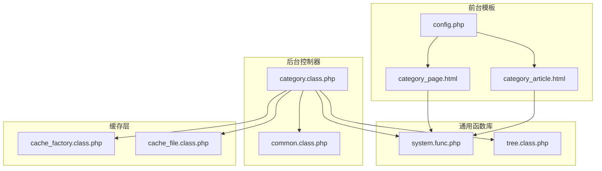

**图表来源**
- [category_article.html](file://application/index/view/rongyao/category_article.html#L1-L53)
- [category_page.html](file://application/index/view/rongyao/category_page.html#L1-L59)
- [config.php](file://application/index/view/rongyao/config.php#L1-L29)
- [category.class.php](file://application/lry_admin_center/controller/category.class.php#L1-L580)
- [common.class.php](file://application/lry_admin_center/controller/common.class.php#L1-L153)
- [system.func.php](file://common/function/system.func.php#L486-L505)
- [tree.class.php](file://ryphp/core/class/tree.class.php#L1-L484)
- [cache_factory.class.php](file://ryphp/core/class/cache_factory.class.php#L1-L84)
- [cache_file.class.php](file://ryphp/core/class/cache_file.class.php#L1-L130)

**章节来源**
- [category_article.html](file://application/index/view/rongyao/category_article.html#L1-L53)
- [category_page.html](file://application/index/view/rongyao/category_page.html#L1-L59)
- [config.php](file://application/index/view/rongyao/config.php#L1-L29)
- [category.class.php](file://application/lry_admin_center/controller/category.class.php#L1-L580)
- [common.class.php](file://application/lry_admin_center/controller/common.class.php#L1-L153)
- [system.func.php](file://common/function/system.func.php#L486-L505)
- [tree.class.php](file://ryphp/core/class/tree.class.php#L1-L484)
- [cache_factory.class.php](file://ryphp/core/class/cache_factory.class.php#L1-L84)
- [cache_file.class.php](file://ryphp/core/class/cache_file.class.php#L1-L130)

## 核心组件
- 分类文章模板：负责渲染分类下的子分类标题、副标题、入口链接及文章列表区块
- 分类页面模板：负责渲染分类页头部横幅、面包屑导航、右侧侧边栏与内容区域
- 分类控制器：负责分类管理、URL生成、缓存清理、模板选择与树形结构生成
- 通用函数库：提供分类信息获取、URL生成、位置导航、路由映射与缓存接口
- 树形类：提供通用树形结构生成、子级查询与模板解析能力
- 缓存工厂与文件缓存：提供统一缓存接口与文件持久化缓存能力

**章节来源**
- [category_article.html](file://application/index/view/rongyao/category_article.html#L24-L48)
- [category_page.html](file://application/index/view/rongyao/category_page.html#L51-L57)
- [category.class.php](file://application/lry_admin_center/controller/category.class.php#L27-L134)
- [system.func.php](file://common/function/system.func.php#L631-L689)
- [tree.class.php](file://ryphp/core/class/tree.class.php#L61-L194)
- [cache_factory.class.php](file://ryphp/core/class/cache_factory.class.php#L36-L82)
- [cache_file.class.php](file://ryphp/core/class/cache_file.class.php#L17-L46)

## 架构总览
分类页面系统从前端模板到后台控制器，再到通用函数库与缓存层形成闭环。分类控制器通过通用函数库获取分类数据与生成URL，利用树形类生成树形结构，结合缓存工厂与文件缓存实现高效读写。

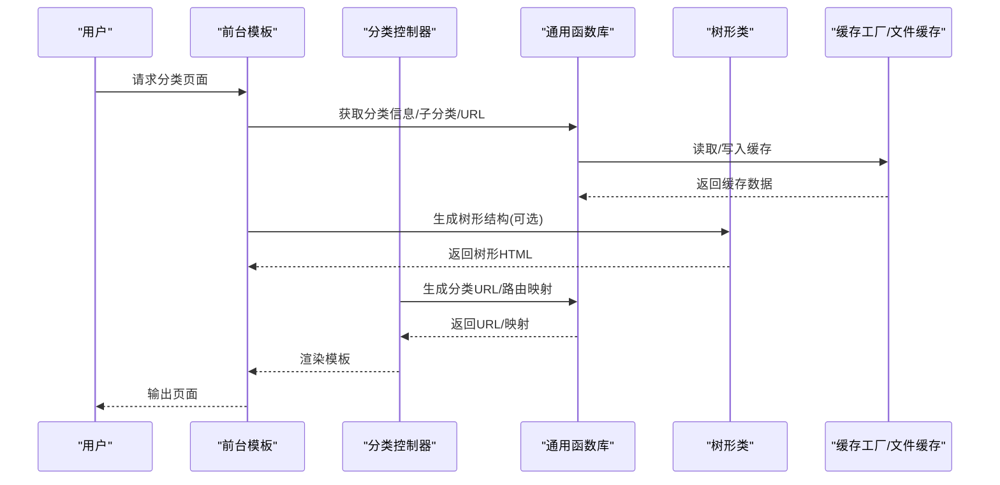

**图表来源**
- [category_article.html](file://application/index/view/rongyao/category_article.html#L24-L48)
- [category_page.html](file://application/index/view/rongyao/category_page.html#L51-L57)
- [category.class.php](file://application/lry_admin_center/controller/category.class.php#L548-L555)
- [system.func.php](file://common/function/system.func.php#L486-L505)
- [tree.class.php](file://ryphp/core/class/tree.class.php#L149-L194)
- [cache_factory.class.php](file://ryphp/core/class/cache_factory.class.php#L77-L82)
- [cache_file.class.php](file://ryphp/core/class/cache_file.class.php#L17-L46)

## 详细组件分析

### 分类文章页面 category_article.html 实现原理
- 分类ID获取：模板通过内置函数获取当前分类ID并传递给子函数
- 文章列表筛选：使用列表标签按分类ID筛选文章，限制数量并输出缩略图、标题与点击量
- 分类信息显示：遍历子分类，输出子分类标题、副标题与入口链接

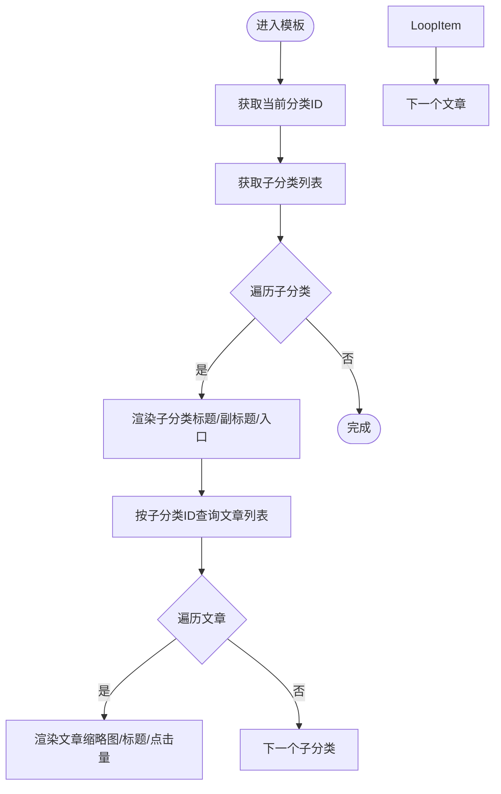

**图表来源**
- [category_article.html](file://application/index/view/rongyao/category_article.html#L24-L48)

**章节来源**
- [category_article.html](file://application/index/view/rongyao/category_article.html#L24-L48)

### 分类页面模板 category_page.html 结构设计
- 头部横幅：根据分类图片动态注入背景样式
- 面包屑导航：输出首页、父分类与当前分类的链接
- 内容区域：输出分类页内容占位符，便于模板扩展
- 右侧侧边栏：包含关于作者或站点信息的模块

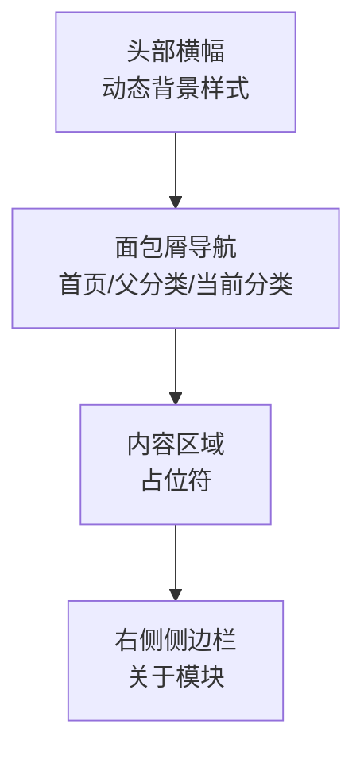

**图表来源**
- [category_page.html](file://application/index/view/rongyao/category_page.html#L34-L58)

**章节来源**
- [category_page.html](file://application/index/view/rongyao/category_page.html#L34-L58)

### 分类数据获取流程
- 父分类筛选：通过分类ID获取父级路径，用于面包屑与导航
- 子分类查询：遍历分类表，筛选parentid匹配的子分类
- 层级关系处理：利用arrparentid与arrchildid维护祖先与子孙关系，支持树形结构生成

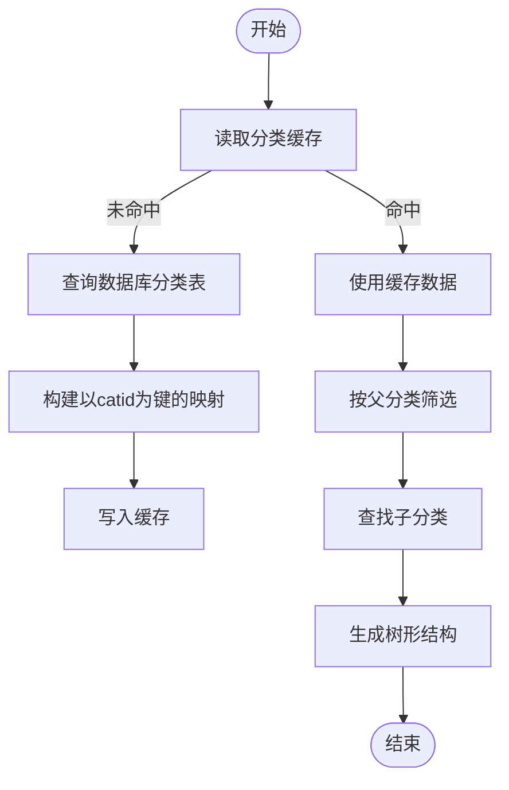

**图表来源**
- [system.func.php](file://common/function/system.func.php#L631-L656)
- [tree.class.php](file://ryphp/core/class/tree.class.php#L61-L194)

**章节来源**
- [system.func.php](file://common/function/system.func.php#L631-L689)
- [tree.class.php](file://ryphp/core/class/tree.class.php#L61-L194)

### 分类URL生成规则与SEO友好结构
- URL模式：根据系统配置与站点域名生成分类URL
- 路由映射：将分类目录映射到列表页与详情页路由，支持列表分页与内容详情
- SEO优化：模板中输出标题、关键词与描述，配合静态资源预加载与延迟加载

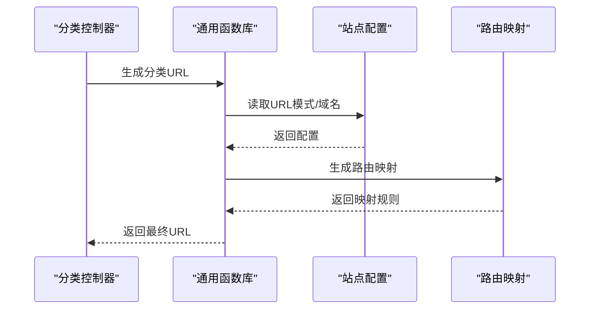

**图表来源**
- [category.class.php](file://application/lry_admin_center/controller/category.class.php#L548-L555)
- [system.func.php](file://common/function/system.func.php#L486-L505)

**章节来源**
- [category.class.php](file://application/lry_admin_center/controller/category.class.php#L548-L555)
- [system.func.php](file://common/function/system.func.php#L486-L505)

### 分类页面缓存机制与性能优化
- 缓存策略：分类信息与路由映射分别缓存，避免重复查询
- 文件缓存：统一通过缓存工厂与文件缓存类实现持久化
- 性能优化：树形类内部缓存子级查询结果，减少重复计算；模板资源预加载与延迟加载降低首屏阻塞

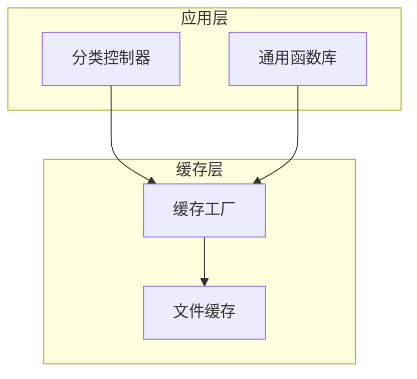

**图表来源**
- [cache_factory.class.php](file://ryphp/core/class/cache_factory.class.php#L36-L82)
- [cache_file.class.php](file://ryphp/core/class/cache_file.class.php#L17-L46)
- [category.class.php](file://application/lry_admin_center/controller/category.class.php#L463-L468)

**章节来源**
- [cache_factory.class.php](file://ryphp/core/class/cache_factory.class.php#L36-L82)
- [cache_file.class.php](file://ryphp/core/class/cache_file.class.php#L17-L46)
- [category.class.php](file://application/lry_admin_center/controller/category.class.php#L463-L468)

### 面包屑导航与当前位置指示
- 位置生成：根据分类的arrparentid拆分父级路径，逐级生成链接
- 显示控制：支持移动端与PC端差异化显示，可选择是否包含自身

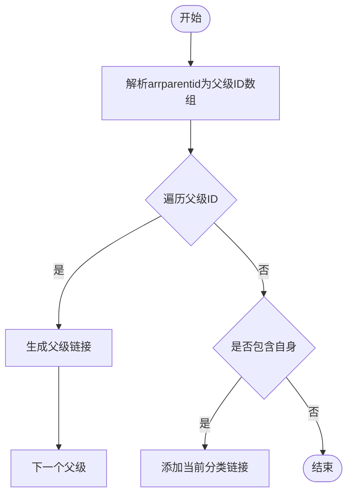

**图表来源**
- [system.func.php](file://common/function/system.func.php#L691-L719)

**章节来源**
- [system.func.php](file://common/function/system.func.php#L691-L719)

### 权限控制与访问限制
- 登录校验：后台统一检查管理员登录状态与会话一致性
- 权限校验：基于角色与动作授权，防止越权访问
- IP限制：支持后台禁止IP名单校验
- Token校验：防CSRF与跨站请求伪造

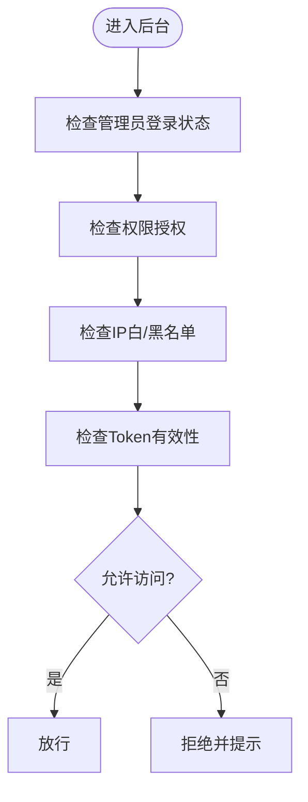

**图表来源**
- [common.class.php](file://application/lry_admin_center/controller/common.class.php#L32-L131)

**章节来源**
- [common.class.php](file://application/lry_admin_center/controller/common.class.php#L32-L131)

### 自定义扩展方法与主题适配指南
- 模板命名规范：频道页模板命名遵循 category_[模型别名].html 或 category_[模型别名]_*.html
- 主题配置：通过主题配置文件声明可用模板集合，便于后台选择
- 模板选择：后台控制器根据模型别名动态扫描并返回可用模板列表

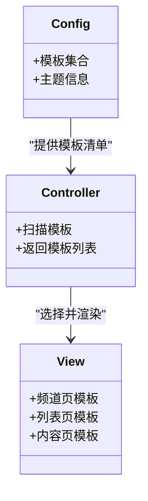

**图表来源**
- [config.php](file://application/index/view/rongyao/config.php#L8-L26)
- [category.class.php](file://application/lry_admin_center/controller/category.class.php#L509-L545)

**章节来源**
- [config.php](file://application/index/view/rongyao/config.php#L8-L26)
- [category.class.php](file://application/lry_admin_center/controller/category.class.php#L509-L545)

## 依赖关系分析
- 分类控制器依赖通用函数库进行分类信息获取、URL生成与路由映射
- 树形类为分类列表与下拉选择提供通用树形结构生成能力
- 缓存工厂与文件缓存为系统提供统一的缓存接口与持久化能力
- 前台模板依赖通用函数库输出SEO元数据与面包屑导航

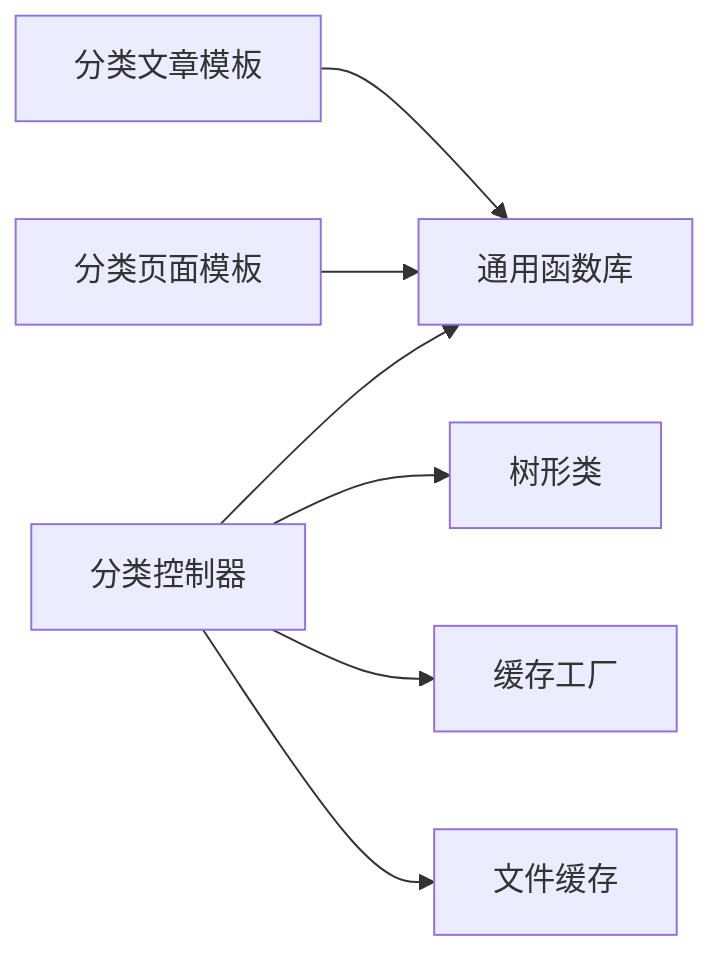

**图表来源**
- [category.class.php](file://application/lry_admin_center/controller/category.class.php#L64-L114)
- [system.func.php](file://common/function/system.func.php#L631-L656)
- [tree.class.php](file://ryphp/core/class/tree.class.php#L61-L194)
- [cache_factory.class.php](file://ryphp/core/class/cache_factory.class.php#L36-L82)
- [cache_file.class.php](file://ryphp/core/class/cache_file.class.php#L17-L46)
- [category_article.html](file://application/index/view/rongyao/category_article.html#L24-L48)
- [category_page.html](file://application/index/view/rongyao/category_page.html#L51-L57)

**章节来源**
- [category.class.php](file://application/lry_admin_center/controller/category.class.php#L64-L114)
- [system.func.php](file://common/function/system.func.php#L631-L656)
- [tree.class.php](file://ryphp/core/class/tree.class.php#L61-L194)
- [cache_factory.class.php](file://ryphp/core/class/cache_factory.class.php#L36-L82)
- [cache_file.class.php](file://ryphp/core/class/cache_file.class.php#L17-L46)
- [category_article.html](file://application/index/view/rongyao/category_article.html#L24-L48)
- [category_page.html](file://application/index/view/rongyao/category_page.html#L51-L57)

## 性能考虑
- 缓存命中：分类信息与路由映射缓存显著降低数据库压力
- 树形查询优化：树形类内部缓存子级查询，避免重复遍历
- 模板资源优化：关键CSS/JS预加载，非关键脚本延迟加载，缩短首屏渲染时间
- URL生成：统一通过函数库生成，避免重复逻辑与错误

## 故障排除指南
- 分类缓存异常：清理分类信息与路由映射缓存后重试
- URL无法访问：检查站点域名与URL模式配置，确认路由映射是否正确
- 权限不足：确认后台登录状态、角色权限与Token有效性
- 模板未生效：核对模板命名规范与主题配置文件中的模板集合

**章节来源**
- [category.class.php](file://application/lry_admin_center/controller/category.class.php#L463-L468)
- [common.class.php](file://application/lry_admin_center/controller/common.class.php#L32-L131)
- [config.php](file://application/index/view/rongyao/config.php#L8-L26)

## 结论
分类页面系统通过模板驱动、控制器调度与缓存优化实现了高性能、可扩展的分类展示能力。前台模板专注于展示，后台控制器负责数据与URL生成，通用函数库与树形类提供底层支撑，缓存工厂与文件缓存确保系统稳定高效运行。同时，完善的权限控制与SEO优化使系统具备良好的安全性与可发现性。

## 附录
- 模板命名建议：遵循 category_[模型别名]_*.html 规范，便于后台自动识别
- 主题适配：通过主题配置文件声明模板集合，确保后台可选择对应模板
- URL规则：根据站点域名与URL模式生成，支持SEO友好路径