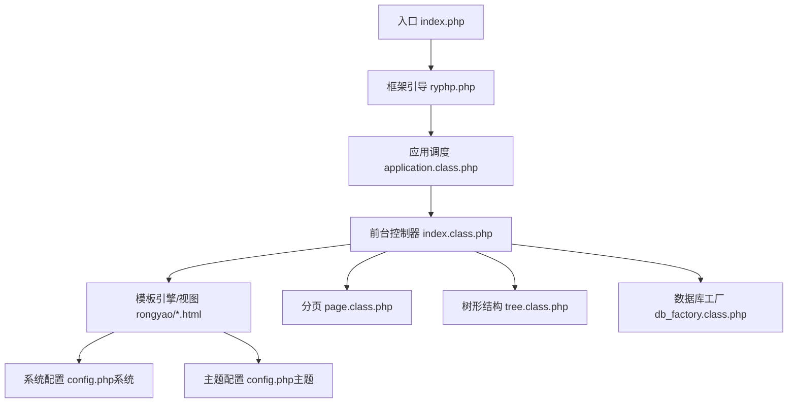
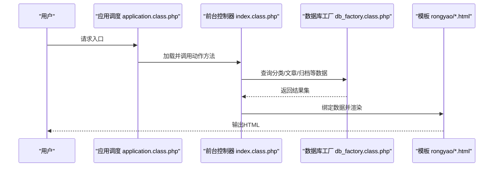
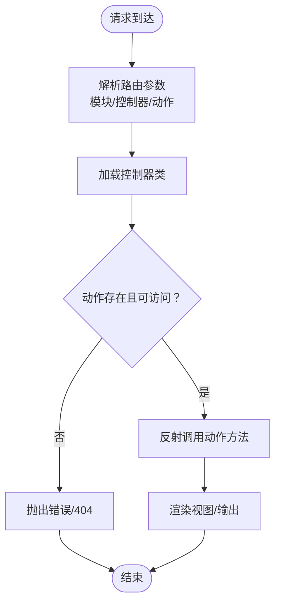
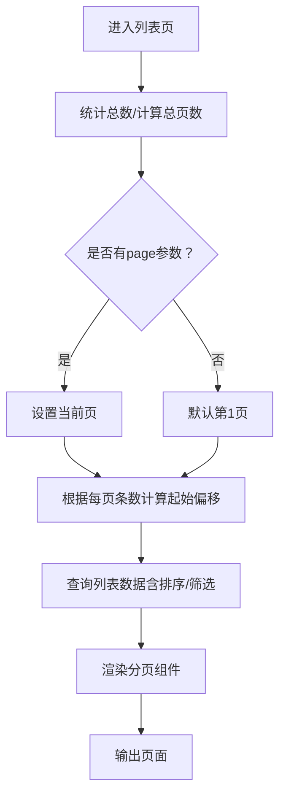
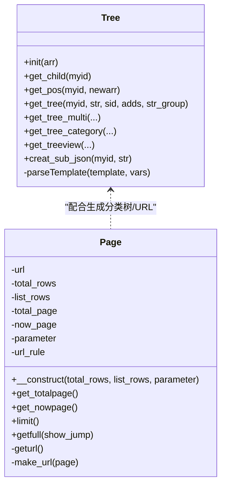
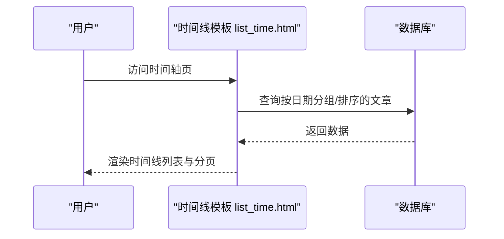
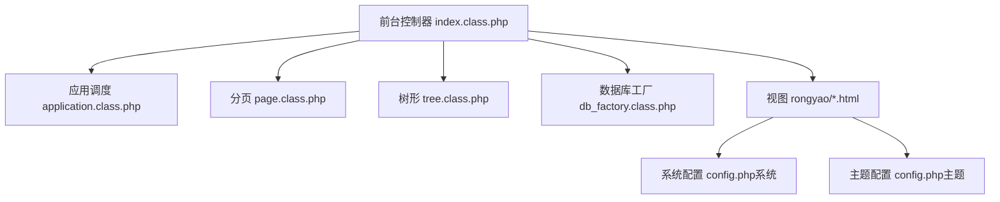

# 前台展示模块

<cite>
**本文引用的文件**
- [index.php](file://index.php)
- [ryphp.php](file://ryphp/ryphp.php)
- [application.class.php](file://ryphp/core/class/application.class.php)
- [db_factory.class.php](file://ryphp/core/class/db_factory.class.php)
- [page.class.php](file://ryphp/core/class/page.class.php)
- [tree.class.php](file://ryphp/core/class/tree.class.php)
- [config.php（系统配置）](file://common/config/config.php)
- [index.class.php（前台控制器）](file://application/index/controller/index.class.php)
- [config.php（主题配置）](file://application/index/view/rongyao/config.php)
- [list_article.html（列表模板）](file://application/index/view/rongyao/list_article.html)
- [show_article.html（内容页模板）](file://application/index/view/rongyao/show_article.html)
- [category_article.html（分类模板）](file://application/index/view/rongyao/category_article.html)
- [list_time.html（时间线模板）](file://application/index/view/rongyao/list_time.html)
</cite>

## 目录
1. [简介](#简介)
2. [项目结构](#项目结构)
3. [核心组件](#核心组件)
4. [架构总览](#架构总览)
5. [详细组件分析](#详细组件分析)
6. [依赖关系分析](#依赖关系分析)
7. [性能考量](#性能考量)
8. [故障排查指南](#故障排查指南)
9. [结论](#结论)
10. [附录](#附录)

## 简介
本文件面向LRYBlog前台展示模块，系统性梳理其架构设计、控制器-模型-视图职责分工、文章展示逻辑（列表、分页、排序）、分类页面实现（树形结构、筛选、URL生成）、时间轴归档、模板配置体系（主题切换、样式定制、响应式）、导航与搜索、SEO优化（URL重写、Meta管理、robots配置），并提供扩展与自定义开发建议。

## 项目结构
前台模块位于 application/index 目录，采用 MVC 分层：
- 控制器：application/index/controller/index.class.php
- 模型：application/index/model（未在本节展开，使用D函数访问）
- 视图：application/index/view/rongyao（主题目录）

入口文件 index.php 引导框架启动，并定义 URL 模式常量，随后调用框架初始化。

图表来源
- [index.php](file://index.php#L1-L18)
- [ryphp.php](file://ryphp/ryphp.php#L83-L202)
- [application.class.php](file://ryphp/core/class/application.class.php#L24-L65)
- [index.class.php](file://application/index/controller/index.class.php#L1-L18)
- [page.class.php](file://ryphp/core/class/page.class.php#L26-L50)
- [tree.class.php](file://ryphp/core/class/tree.class.php#L61-L66)
- [db_factory.class.php](file://ryphp/core/class/db_factory.class.php#L11-L34)
- [config.php（系统配置）](file://common/config/config.php#L1-L88)
- [config.php（主题配置）](file://application/index/view/rongyao/config.php#L1-L29)

章节来源
- [index.php](file://index.php#L1-L18)
- [ryphp.php](file://ryphp/ryphp.php#L83-L202)
- [application.class.php](file://ryphp/core/class/application.class.php#L24-L65)
- [config.php（系统配置）](file://common/config/config.php#L1-L88)

## 核心组件
- 框架入口与引导
  - index.php 定义调试与根路径常量，引入框架入口文件并设置 URL 模式。
  - ryphp.php 定义全局常量（站点URL、静态资源URL、时区等），加载系统函数与类，提供类加载与控制器/模型加载能力。
- 应用调度
  - application.class.php 负责路由参数解析（模块、控制器、方法）、控制器加载与反射调用、错误处理与致命错误捕获。
- 数据访问
  - db_factory.class.php 根据系统配置选择数据库驱动（pdo/mysql/mysqli），统一构造数据库连接实例。
- 分页组件
  - page.class.php 提供分页URL生成、页码计算、上一页/下一页/首页/尾页/跳转等UI片段，支持伪静态后缀与自定义参数保留。
- 树形结构
  - tree.class.php 提供通用树形结构生成（父子关系、层级缩进、JSON子级等），内置缓存优化，支持分类树渲染。
- 主题与模板
  - 主题配置 config.php（主题）声明主题元信息与模板映射（分类、列表、内容页模板）。
  - 列表/内容/分类/时间线模板通过 m:include、m:lists、U()、get_* 系列函数进行组合，实现导航、侧边栏、分页、标签、评论等模块化渲染。

章节来源
- [index.php](file://index.php#L1-L18)
- [ryphp.php](file://ryphp/ryphp.php#L83-L202)
- [application.class.php](file://ryphp/core/class/application.class.php#L24-L65)
- [db_factory.class.php](file://ryphp/core/class/db_factory.class.php#L11-L34)
- [page.class.php](file://ryphp/core/class/page.class.php#L26-L50)
- [tree.class.php](file://ryphp/core/class/tree.class.php#L61-L66)
- [config.php（主题配置）](file://application/index/view/rongyao/config.php#L1-L29)

## 架构总览
前台模块遵循 MVC 模式：
- 控制器负责接收请求、组装数据、选择模板；
- 模型通过 D() 或 db_factory 访问数据库；
- 视图通过模板语法渲染页面，结合分页与树形组件。

图表来源
- [application.class.php](file://ryphp/core/class/application.class.php#L24-L40)
- [index.class.php](file://application/index/controller/index.class.php#L14-L17)
- [db_factory.class.php](file://ryphp/core/class/db_factory.class.php#L38-L49)
- [list_article.html](file://application/index/view/rongyao/list_article.html#L54-L73)

## 详细组件分析

### 控制器与路由
- 路由参数
  - application.class.php 解析模块、控制器、动作参数，确保动作可访问且不以下划线开头。
- 前台控制器
  - index.class.php 当前提供一个演示动作，从分类表读取并输出数据；实际前台应在此基础上扩展列表、详情、分类、时间轴等动作。

图表来源
- [application.class.php](file://ryphp/core/class/application.class.php#L14-L40)
- [index.class.php](file://application/index/controller/index.class.php#L14-L17)

章节来源
- [application.class.php](file://ryphp/core/class/application.class.php#L14-L40)
- [index.class.php](file://application/index/controller/index.class.php#L1-L18)

### 文章展示逻辑（列表、分页、排序）
- 列表数据
  - 模板中使用 m:lists 标签进行列表渲染，支持字段选择、分类筛选、排序、分页参数注入。
- 分页组件
  - page.class.php 计算总页数、当前页、URL规则（伪静态/普通URL），生成首页/上一页/页码/下一页/尾页/跳转等片段。
  - 支持自定义每页条数与Cookie记忆。
- 排序规则
  - 模板中可直接指定 order 参数（如 RAND()），控制器可按需传递排序策略。

图表来源
- [page.class.php](file://ryphp/core/class/page.class.php#L26-L50)
- [page.class.php](file://ryphp/core/class/page.class.php#L101-L152)
- [list_article.html](file://application/index/view/rongyao/list_article.html#L54-L73)

章节来源
- [page.class.php](file://ryphp/core/class/page.class.php#L26-L50)
- [page.class.php](file://ryphp/core/class/page.class.php#L101-L152)
- [list_article.html](file://application/index/view/rongyao/list_article.html#L54-L73)

### 分类页面实现（树形结构、筛选、URL）
- 树形结构
  - tree.class.php 提供 get_child、get_pos、get_tree 等方法，支持分类父子关系构建与层级渲染。
- 分类筛选
  - 模板中通过 m:lists 的 catid 参数实现按分类筛选；支持子分类聚合展示。
- URL生成
  - 模板中使用 U() 函数生成URL，page.class.php 支持伪静态后缀与参数保留，保证URL一致性。

图表来源
- [tree.class.php](file://ryphp/core/class/tree.class.php#L61-L66)
- [tree.class.php](file://ryphp/core/class/tree.class.php#L97-L116)
- [tree.class.php](file://ryphp/core/class/tree.class.php#L149-L194)
- [page.class.php](file://ryphp/core/class/page.class.php#L26-L50)
- [page.class.php](file://ryphp/core/class/page.class.php#L172-L200)

章节来源
- [tree.class.php](file://ryphp/core/class/tree.class.php#L61-L66)
- [tree.class.php](file://ryphp/core/class/tree.class.php#L97-L116)
- [tree.class.php](file://ryphp/core/class/tree.class.php#L149-L194)
- [category_article.html](file://application/index/view/rongyao/category_article.html#L24-L46)

### 时间轴展示（按时间归档、日期筛选）
- 模板实现
  - list_time.html 通过 m:lists 按分类与分页列出文章标题与日期，形成时间线列表。
- URL与筛选
  - 模板中可结合 U() 与日期参数实现按年月筛选，page.class.php 支持伪静态后缀与参数保留。

图表来源
- [list_time.html](file://application/index/view/rongyao/list_time.html#L40-L48)
- [page.class.php](file://ryphp/core/class/page.class.php#L172-L200)

章节来源
- [list_time.html](file://application/index/view/rongyao/list_time.html#L40-L48)
- [page.class.php](file://ryphp/core/class/page.class.php#L172-L200)

### 模板配置系统（主题切换、样式定制、响应式）
- 主题切换
  - 系统配置 config.php 中 site_theme 指定默认主题目录；模板中通过 {C('site_theme')} 注入当前主题路径。
- 模板映射
  - 主题配置 config.php（主题）声明分类/列表/内容页模板映射，便于后台或模板作者维护。
- 样式与响应式
  - 模板中引入主样式与响应式样式，按需延迟加载非关键资源，提升首屏性能。

图表来源
- [config.php（系统配置）](file://common/config/config.php#L9-L11)
- [config.php（主题配置）](file://application/index/view/rongyao/config.php#L1-L29)
- [list_article.html](file://application/index/view/rongyao/list_article.html#L10-L16)

章节来源
- [config.php（系统配置）](file://common/config/config.php#L9-L11)
- [config.php（主题配置）](file://application/index/view/rongyao/config.php#L1-L29)
- [list_article.html](file://application/index/view/rongyao/list_article.html#L10-L16)

### 导航、面包屑与搜索
- 导航与面包屑
  - 模板中使用 get_location()/get_catname()/get_category() 等辅助函数生成当前位置与面包屑。
- 搜索
  - 模板中通过 U() 生成标签/归档等搜索入口链接，支持在前台进行标签与时间筛选。

章节来源
- [list_article.html](file://application/index/view/rongyao/list_article.html#L51-L51)
- [show_article.html](file://application/index/view/rongyao/show_article.html#L82-L88)
- [list_time.html](file://application/index/view/rongyao/list_time.html#L42-L42)

### SEO优化（URL重写、Meta标签、robots）
- URL重写与伪静态
  - 系统配置 url_html_suffix 定义伪静态后缀；page.class.php 在 _list_url 中生成带后缀的分页URL，支持参数保留。
- Meta标签
  - 模板头部包含 seo_title、keywords、description 等Meta标签，便于搜索引擎收录。
- robots配置
  - 仓库未提供 robots.txt，建议在网站根目录添加robots.txt以规范爬虫行为。

章节来源
- [config.php（系统配置）](file://common/config/config.php#L10-L11)
- [page.class.php](file://ryphp/core/class/page.class.php#L172-L200)
- [list_article.html](file://application/index/view/rongyao/list_article.html#L5-L7)

## 依赖关系分析
- 控制器依赖
  - 控制器依赖 application.class.php 的路由与调度、page.class.php 的分页、tree.class.php 的树形结构、db_factory.class.php 的数据库访问。
- 视图依赖
  - 视图依赖模板语法（m:include、m:lists、U()、get_*）与系统/主题配置。

图表来源
- [index.class.php](file://application/index/controller/index.class.php#L14-L17)
- [application.class.php](file://ryphp/core/class/application.class.php#L24-L40)
- [page.class.php](file://ryphp/core/class/page.class.php#L26-L50)
- [tree.class.php](file://ryphp/core/class/tree.class.php#L61-L66)
- [db_factory.class.php](file://ryphp/core/class/db_factory.class.php#L11-L34)
- [config.php（系统配置）](file://common/config/config.php#L1-L88)
- [config.php（主题配置）](file://application/index/view/rongyao/config.php#L1-L29)

章节来源
- [index.class.php](file://application/index/controller/index.class.php#L14-L17)
- [application.class.php](file://ryphp/core/class/application.class.php#L24-L40)
- [page.class.php](file://ryphp/core/class/page.class.php#L26-L50)
- [tree.class.php](file://ryphp/core/class/tree.class.php#L61-L66)
- [db_factory.class.php](file://ryphp/core/class/db_factory.class.php#L11-L34)
- [config.php（系统配置）](file://common/config/config.php#L1-L88)
- [config.php（主题配置）](file://application/index/view/rongyao/config.php#L1-L29)

## 性能考量
- 分页与URL
  - page.class.php 支持伪静态后缀与参数保留，减少重复查询与URL拼接成本。
- 树形结构缓存
  - tree.class.php 内置缓存数组，降低父子查询与层级遍历的重复计算。
- 模板资源加载
  - 模板采用关键资源预加载与非关键资源延迟加载策略，改善首屏体验。

章节来源
- [page.class.php](file://ryphp/core/class/page.class.php#L172-L200)
- [tree.class.php](file://ryphp/core/class/tree.class.php#L46-L46)
- [list_article.html](file://application/index/view/rongyao/list_article.html#L18-L29)

## 故障排查指南
- 404/控制器不存在
  - application.class.php 在控制器或动作缺失时触发 halt，检查路由参数与控制器文件是否存在。
- 数据库连接异常
  - db_factory.class.php 根据配置选择驱动，确认数据库主机、账号、密码、字符集与表前缀正确。
- 分页URL异常
  - page.class.php 在伪静态模式下生成带后缀的分页URL，检查 url_html_suffix 与 LIST_URL 常量设置。

章节来源
- [application.class.php](file://ryphp/core/class/application.class.php#L52-L64)
- [application.class.php](file://ryphp/core/class/application.class.php#L108-L115)
- [db_factory.class.php](file://ryphp/core/class/db_factory.class.php#L14-L31)
- [config.php（系统配置）](file://common/config/config.php#L10-L11)
- [page.class.php](file://ryphp/core/class/page.class.php#L172-L200)

## 结论
前台展示模块以 MVC 为核心，结合分页、树形结构与模板系统，实现了分类、列表、内容页与时间轴等典型场景。通过系统与主题配置，具备良好的可扩展性与SEO基础。建议后续完善控制器动作、补充SEO与robots配置，并持续优化模板加载与数据查询性能。

## 附录
- 扩展与自定义建议
  - 新增控制器动作：在 application/index/controller 下新增类与动作方法，遵循现有命名与参数约定。
  - 自定义模板：基于主题配置的模板映射，新增/替换 rongyao/*.html 并在系统配置中启用。
  - SEO增强：补充 robots.txt、sitemap.xml 与结构化数据；在模板中完善关键词与描述。
  - 性能优化：利用 page.class.php 的分页缓存与 tree.class.php 的缓存机制，减少重复查询。