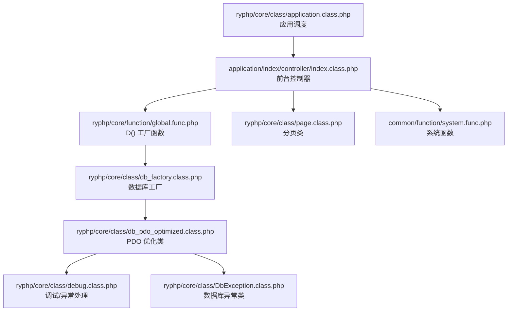
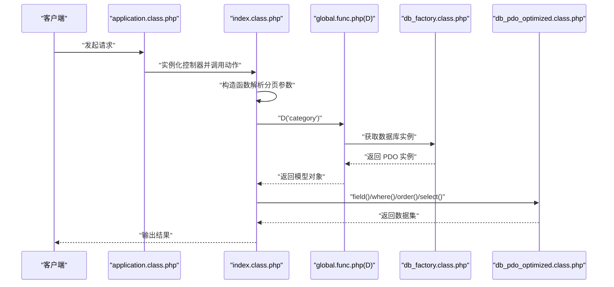
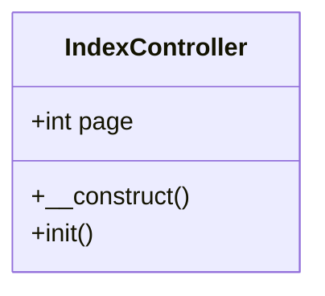
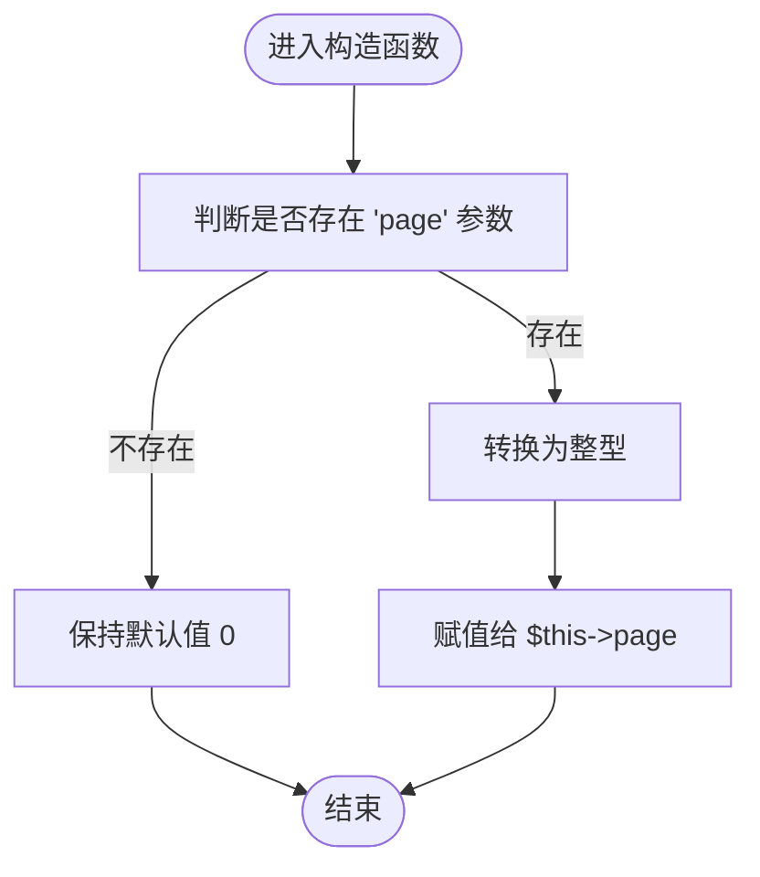
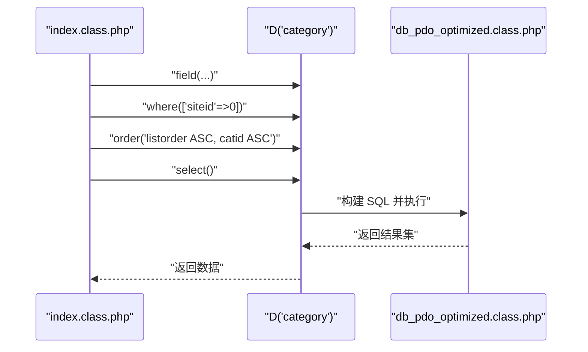
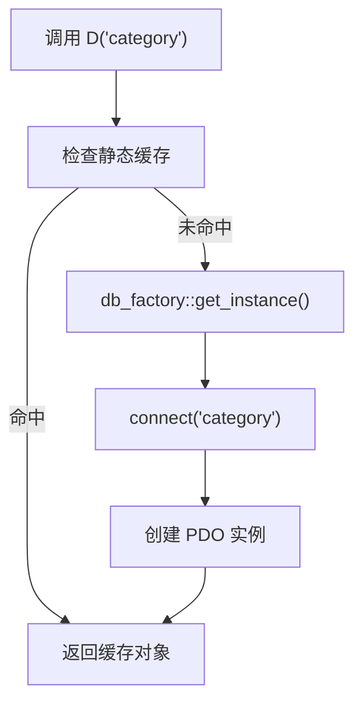
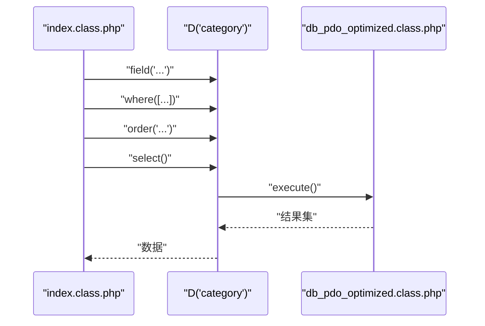
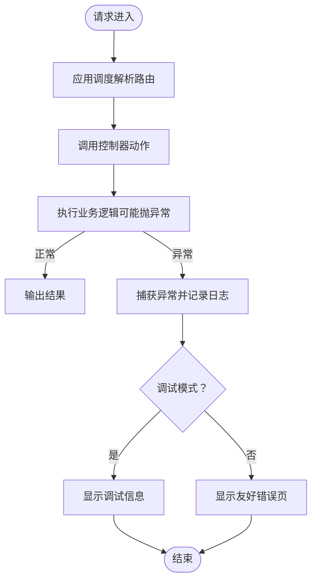
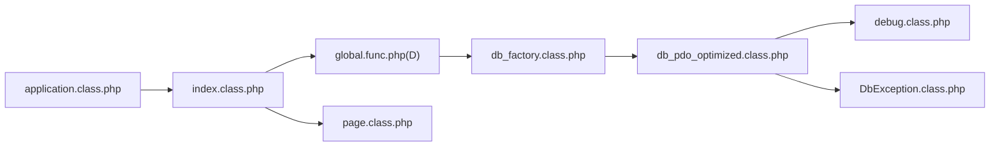

# 前台控制器

<cite>
**本文引用的文件**
- [application/index/controller/index.class.php](file://application/index/controller/index.class.php)
- [ryphp/core/function/global.func.php](file://ryphp/core/function/global.func.php)
- [ryphp/core/class/page.class.php](file://ryphp/core/class/page.class.php)
- [ryphp/core/class/db_factory.class.php](file://ryphp/core/class/db_factory.class.php)
- [ryphp/core/class/db_pdo_optimized.class.php](file://ryphp/core/class/db_pdo_optimized.class.php)
- [ryphp/core/class/application.class.php](file://ryphp/core/class/application.class.php)
- [ryphp/core/class/debug.class.php](file://ryphp/core/class/debug.class.php)
- [ryphp/core/class/DbException.class.php](file://ryphp/core/class/DbException.class.php)
- [common/function/system.func.php](file://common/function/system.func.php)
</cite>

## 目录
1. [引言](#引言)
2. [项目结构](#项目结构)
3. [核心组件](#核心组件)
4. [架构总览](#架构总览)
5. [详细组件分析](#详细组件分析)
6. [依赖关系分析](#依赖关系分析)
7. [性能考量](#性能考量)
8. [故障排查指南](#故障排查指南)
9. [结论](#结论)
10. [附录](#附录)

## 引言
本文件面向“前台控制器”的设计与实现，聚焦于 application/index/controller/index.class.php 控制器的构造函数与 init() 方法，系统性解析其分页参数处理、分类数据获取、字段映射与排序规则、D() 函数的数据访问模式、控制器与模型层的交互流程，并给出错误处理与异常捕获的最佳实践及扩展指南。

## 项目结构
前台控制器位于应用模块 index 的 controller 目录下，配合全局函数与数据库抽象层共同完成数据访问与视图渲染的控制职责。关键文件与职责概览：
- 控制器：application/index/controller/index.class.php
- 全局函数：ryphp/core/function/global.func.php（含 D() 工厂函数）
- 分页类：ryphp/core/class/page.class.php（通用分页工具）
- 数据库工厂：ryphp/core/class/db_factory.class.php（按配置选择具体驱动）
- PDO 优化类：ryphp/core/class/db_pdo_optimized.class.php（SQL 执行、异常处理）
- 应用调度：ryphp/core/class/application.class.php（路由与动作分发）
- 调试与异常：ryphp/core/class/debug.class.php、ryphp/core/class/DbException.class.php
- 系统函数：common/function/system.func.php（常用业务辅助）

图表来源
- [application/index/controller/index.class.php](file://application/index/controller/index.class.php#L1-L18)
- [ryphp/core/function/global.func.php](file://ryphp/core/function/global.func.php#L100-L108)
- [ryphp/core/class/db_factory.class.php](file://ryphp/core/class/db_factory.class.php#L11-L49)
- [ryphp/core/class/db_pdo_optimized.class.php](file://ryphp/core/class/db_pdo_optimized.class.php#L74-L119)
- [ryphp/core/class/page.class.php](file://ryphp/core/class/page.class.php#L26-L37)
- [ryphp/core/class/application.class.php](file://ryphp/core/class/application.class.php#L24-L40)
- [ryphp/core/class/debug.class.php](file://ryphp/core/class/debug.class.php#L46-L83)
- [ryphp/core/class/DbException.class.php](file://ryphp/core/class/DbException.class.php#L10-L36)
- [common/function/system.func.php](file://common/function/system.func.php#L631-L644)

章节来源
- [application/index/controller/index.class.php](file://application/index/controller/index.class.php#L1-L18)
- [ryphp/core/class/application.class.php](file://ryphp/core/class/application.class.php#L24-L40)

## 核心组件
- 前台控制器类：负责接收请求、初始化数据、执行业务逻辑并输出结果。
- D() 工厂函数：根据表名返回数据库操作对象，内部通过 db_factory 选择具体驱动。
- 数据库工厂：依据配置动态加载 mysql/mysqli/pdo 等驱动类。
- PDO 优化类：封装 SQL 执行、预处理绑定、异常抛出与调试日志。
- 分页类：提供分页总数计算、当前页解析、URL 生成、分页导航等能力。
- 应用调度：解析路由、定位控制器与动作，统一错误处理与调试输出。
- 调试与异常：统一致命错误、普通错误、异常捕获与友好提示。

章节来源
- [ryphp/core/function/global.func.php](file://ryphp/core/function/global.func.php#L100-L108)
- [ryphp/core/class/db_factory.class.php](file://ryphp/core/class/db_factory.class.php#L11-L49)
- [ryphp/core/class/db_pdo_optimized.class.php](file://ryphp/core/class/db_pdo_optimized.class.php#L74-L119)
- [ryphp/core/class/page.class.php](file://ryphp/core/class/page.class.php#L26-L37)
- [ryphp/core/class/application.class.php](file://ryphp/core/class/application.class.php#L24-L40)
- [ryphp/core/class/debug.class.php](file://ryphp/core/class/debug.class.php#L46-L83)
- [ryphp/core/class/DbException.class.php](file://ryphp/core/class/DbException.class.php#L10-L36)

## 架构总览
前台控制器在应用调度的统一入口下运行，通过 D() 获取数据库对象，执行链路如下：
- 应用调度解析路由，实例化控制器并调用动作方法。
- 控制器构造函数读取并安全转换分页参数 page。
- 控制器 init() 方法使用 D() 访问模型，执行字段映射与排序，返回数据集合。
- 分页类提供分页参数与 URL 生成，供控制器在列表场景复用。
- 数据库层采用 PDO 预处理与异常封装，确保 SQL 安全与错误可控。
- 调试与异常层统一处理致命错误、普通错误与数据库异常。

图表来源
- [ryphp/core/class/application.class.php](file://ryphp/core/class/application.class.php#L24-L40)
- [application/index/controller/index.class.php](file://application/index/controller/index.class.php#L9-L17)
- [ryphp/core/function/global.func.php](file://ryphp/core/function/global.func.php#L100-L108)
- [ryphp/core/class/db_factory.class.php](file://ryphp/core/class/db_factory.class.php#L38-L49)
- [ryphp/core/class/db_pdo_optimized.class.php](file://ryphp/core/class/db_pdo_optimized.class.php#L180-L200)

## 详细组件分析

### 控制器类结构与职责
- 类名：index（位于 application/index/controller/index.class.php）
- 成员变量：page（整型，保存当前页码）
- 构造函数：从 $_GET['page'] 安全转换为整型，赋值给 $this->page
- init() 方法：演示性地从 category 表读取分类数据，进行字段映射与排序

图表来源
- [application/index/controller/index.class.php](file://application/index/controller/index.class.php#L4-L17)

章节来源
- [application/index/controller/index.class.php](file://application/index/controller/index.class.php#L4-L17)

### 构造函数中的分页参数处理机制
- 输入来源：$_GET['page']
- 处理策略：存在即转换为整型，否则保持默认值（未显式赋值时为 0）
- 安全性：通过 intval() 将非数值输入归一化为整数，避免注入与越界风险
- 可扩展性：可在构造函数中加入范围校验（如最小值 1、最大值 total_page）以增强健壮性

图表来源
- [application/index/controller/index.class.php](file://application/index/controller/index.class.php#L9-L12)

章节来源
- [application/index/controller/index.class.php](file://application/index/controller/index.class.php#L9-L12)

### init() 方法的核心功能
- 数据访问：通过 D('category') 获取模型对象
- 字段映射：使用 field() 对列进行别名映射（如 catid 映射为 id，catname 映射为 name 等）
- 查询条件：where() 设置 siteid=0 的筛选
- 排序规则：order() 指定 listorder ASC, catid ASC 的稳定排序
- 结果输出：select() 返回数据集；当前代码包含 var_dump() 用于演示

图表来源
- [application/index/controller/index.class.php](file://application/index/controller/index.class.php#L14-L17)
- [ryphp/core/function/global.func.php](file://ryphp/core/function/global.func.php#L100-L108)
- [ryphp/core/class/db_pdo_optimized.class.php](file://ryphp/core/class/db_pdo_optimized.class.php#L180-L200)

章节来源
- [application/index/controller/index.class.php](file://application/index/controller/index.class.php#L14-L17)

### D() 函数的使用方式与数据访问模式
- 设计目的：为不同表名提供统一的数据库操作对象，隐藏底层驱动差异
- 调用流程：
  - D($tablename) -> db_factory::get_instance() -> connect($tablename)
  - db_factory 根据配置选择具体驱动类（mysql/mysqli/pdo），并返回对应实例
  - PDO 优化类封装 SQL 执行、预处理绑定、异常抛出与调试日志
- 访问模式：链式调用（field/where/order/select）形成查询构建器风格

图表来源
- [ryphp/core/function/global.func.php](file://ryphp/core/function/global.func.php#L100-L108)
- [ryphp/core/class/db_factory.class.php](file://ryphp/core/class/db_factory.class.php#L11-L49)
- [ryphp/core/class/db_pdo_optimized.class.php](file://ryphp/core/class/db_pdo_optimized.class.php#L74-L119)

章节来源
- [ryphp/core/function/global.func.php](file://ryphp/core/function/global.func.php#L100-L108)
- [ryphp/core/class/db_factory.class.php](file://ryphp/core/class/db_factory.class.php#L38-L49)
- [ryphp/core/class/db_pdo_optimized.class.php](file://ryphp/core/class/db_pdo_optimized.class.php#L180-L200)

### 控制器与模型层的交互模式
- 参数传递：控制器通过 D() 返回的对象调用链式方法，传入查询条件与排序规则
- 数据返回：select() 返回结果集，供控制器后续处理（如模板渲染）
- 交互边界：控制器不直接拼接 SQL，而是通过模型对象的链式 API 构建查询，降低耦合度

图表来源
- [application/index/controller/index.class.php](file://application/index/controller/index.class.php#L14-L17)
- [ryphp/core/class/db_pdo_optimized.class.php](file://ryphp/core/class/db_pdo_optimized.class.php#L180-L200)

章节来源
- [application/index/controller/index.class.php](file://application/index/controller/index.class.php#L14-L17)

### 错误处理与异常捕获最佳实践
- 致命错误：注册 shutdown 回调，捕获最后错误并按调试模式输出或写入日志
- 普通错误：set_error_handler 捕获 PHP 错误，按级别输出彩色提示
- 数据库异常：PDO 层抛出自定义 DbException，统一由调试层接管
- 建议实践：
  - 在控制器中使用 try/catch 包裹关键数据库操作
  - 对外部输入（如 page）进行范围校验与默认值处理
  - 在生产环境关闭调试输出，统一记录错误日志并返回友好的错误页面

图表来源
- [ryphp/core/class/application.class.php](file://ryphp/core/class/application.class.php#L24-L40)
- [ryphp/core/class/debug.class.php](file://ryphp/core/class/debug.class.php#L46-L83)
- [ryphp/core/class/DbException.class.php](file://ryphp/core/class/DbException.class.php#L10-L36)

章节来源
- [ryphp/core/class/application.class.php](file://ryphp/core/class/application.class.php#L24-L40)
- [ryphp/core/class/debug.class.php](file://ryphp/core/class/debug.class.php#L46-L83)
- [ryphp/core/class/DbException.class.php](file://ryphp/core/class/DbException.class.php#L10-L36)

### 扩展指南：新增功能与修改建议
- 新增列表分页功能
  - 在控制器中引入分页类：new page(total_rows, list_rows, $_GET)
  - 在查询前计算 limit 起始偏移与条数，结合 D() 的 limit() 或原生 SQL
  - 生成分页链接并传入视图
- 新增分类筛选与排序
  - 在 where() 中追加更多条件（如 parentid、cattype 等）
  - 在 order() 中支持动态排序字段与方向（基于 $_GET['sort'] 与 $_GET['dir']）
- 安全与健壮性
  - 对 page 参数进行范围校验（最小 1，最大 total_page）
  - 对用户输入进行白名单校验与默认值兜底
- 性能优化
  - 对高频查询使用缓存（参考系统函数中的缓存辅助）
  - 合理使用索引与 LIMIT，避免全表扫描

章节来源
- [ryphp/core/class/page.class.php](file://ryphp/core/class/page.class.php#L26-L37)
- [common/function/system.func.php](file://common/function/system.func.php#L631-L644)

## 依赖关系分析
- 控制器依赖 D() 工厂函数与数据库工厂，间接依赖 PDO 优化类
- 分页类独立于控制器，但可被控制器复用
- 应用调度负责路由与动作分发，贯穿控制器生命周期
- 调试与异常层贯穿所有数据访问路径，保障错误可控

图表来源
- [application/index/controller/index.class.php](file://application/index/controller/index.class.php#L1-L18)
- [ryphp/core/function/global.func.php](file://ryphp/core/function/global.func.php#L100-L108)
- [ryphp/core/class/db_factory.class.php](file://ryphp/core/class/db_factory.class.php#L11-L49)
- [ryphp/core/class/db_pdo_optimized.class.php](file://ryphp/core/class/db_pdo_optimized.class.php#L74-L119)
- [ryphp/core/class/page.class.php](file://ryphp/core/class/page.class.php#L26-L37)
- [ryphp/core/class/application.class.php](file://ryphp/core/class/application.class.php#L24-L40)
- [ryphp/core/class/debug.class.php](file://ryphp/core/class/debug.class.php#L46-L83)
- [ryphp/core/class/DbException.class.php](file://ryphp/core/class/DbException.class.php#L10-L36)

章节来源
- [application/index/controller/index.class.php](file://application/index/controller/index.class.php#L1-L18)
- [ryphp/core/class/application.class.php](file://ryphp/core/class/application.class.php#L24-L40)

## 性能考量
- 查询优化：合理使用索引（如 listorder、catid、siteid），避免不必要的排序与大结果集
- 缓存策略：对分类树等静态数据使用缓存（参考系统函数中的缓存辅助）
- 分页性能：避免 deep pagination（超大 page 值），建议限制最大页码并引导用户使用筛选
- SQL 安全：使用预处理绑定，避免拼接 SQL 导致的性能与安全问题

## 故障排查指南
- 页面无数据或排序异常
  - 检查 where 条件与排序字段是否正确
  - 确认字段映射别名是否与模板一致
- 分页参数无效
  - 确认 page 是否在构造函数中被正确解析与赋值
  - 检查分页类的 URL 规则与参数传递
- 数据库报错
  - 查看调试输出或错误日志，确认 SQL 与异常类型
  - 检查 PDO 配置与连接参数

章节来源
- [ryphp/core/class/debug.class.php](file://ryphp/core/class/debug.class.php#L46-L83)
- [ryphp/core/class/db_pdo_optimized.class.php](file://ryphp/core/class/db_pdo_optimized.class.php#L488-L505)

## 结论
前台控制器通过简洁的构造函数与 init() 方法，展示了从请求参数到数据访问再到结果输出的完整流程。借助 D() 工厂与 PDO 抽象层，实现了跨驱动的一致访问体验；配合分页类与统一的错误处理机制，保证了功能扩展与稳定性。建议在实际开发中进一步完善参数校验、缓存与性能优化，并遵循统一的异常处理规范。

## 附录
- 相关系统函数参考：分类缓存与查询辅助（get_category）
- 配置与路由：应用调度负责路由解析与动作分发

章节来源
- [common/function/system.func.php](file://common/function/system.func.php#L631-L644)
- [ryphp/core/class/application.class.php](file://ryphp/core/class/application.class.php#L24-L40)