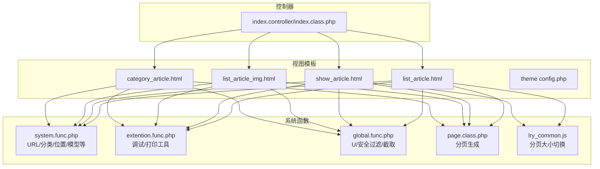
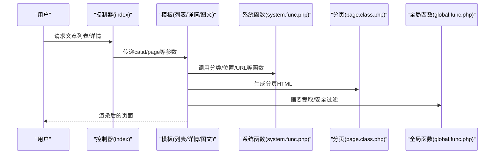
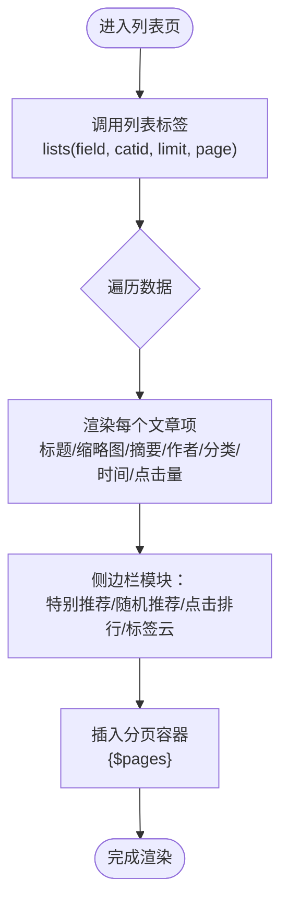
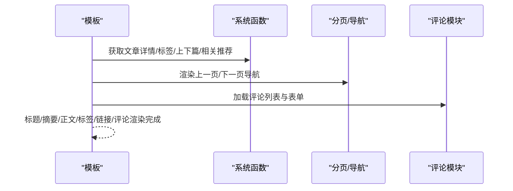
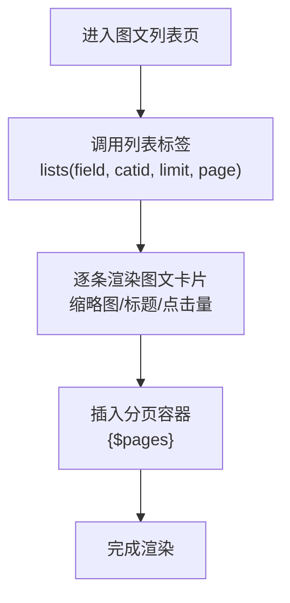
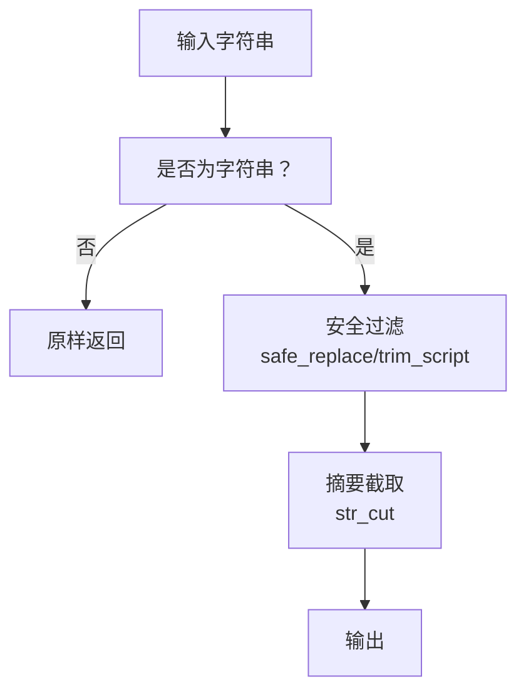
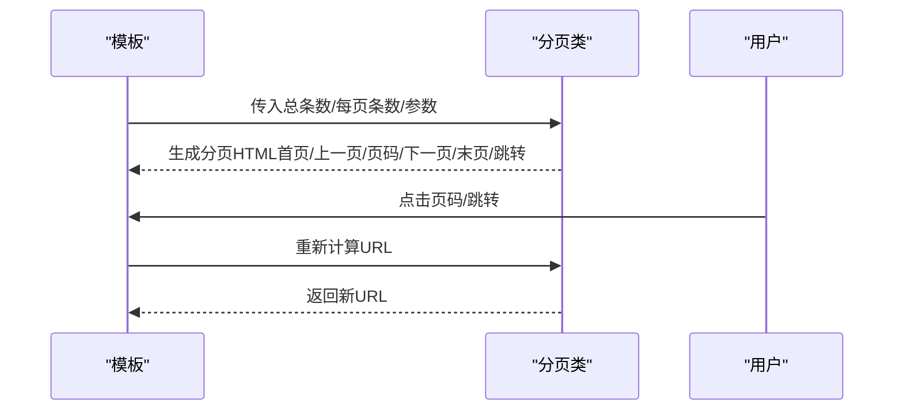
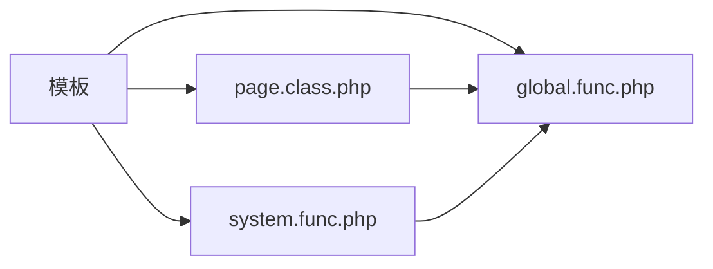

# 文章展示功能

<cite>
**本文引用的文件**
- [application/index/view/rongyao/list_article.html](file://application/index/view/rongyao/list_article.html)
- [application/index/view/rongyao/show_article.html](file://application/index/view/rongyao/show_article.html)
- [application/index/view/rongyao/list_article_img.html](file://application/index/view/rongyao/list_article_img.html)
- [application/index/view/rongyao/category_article.html](file://application/index/view/rongyao/category_article.html)
- [application/index/view/rongyao/config.php](file://application/index/view/rongyao/config.php)
- [common/function/system.func.php](file://common/function/system.func.php)
- [common/function/extention.func.php](file://common/function/extention.func.php)
- [ryphp/core/class/page.class.php](file://ryphp/core/class/page.class.php)
- [ryphp/core/function/global.func.php](file://ryphp/core/function/global.func.php)
- [common/static/js/lry_common.js](file://common/static/js/lry_common.js)
- [application/index/controller/index.class.php](file://application/index/controller/index.class.php)
</cite>

## 目录
1. [简介](#简介)
2. [项目结构](#项目结构)
3. [核心组件](#核心组件)
4. [架构总览](#架构总览)
5. [详细组件分析](#详细组件分析)
6. [依赖关系分析](#依赖关系分析)
7. [性能考量](#性能考量)
8. [故障排查指南](#故障排查指南)
9. [结论](#结论)
10. [附录](#附录)

## 简介
本文件面向“文章展示功能”的实现与使用，覆盖以下方面：
- 文章列表页、详情页、图文列表页的模板结构与数据绑定
- 文章数据获取流程（分类筛选、状态过滤、排序规则）
- 文章摘要截取、HTML内容清理与安全过滤
- 分页导航与上一页/下一页链接生成机制
- 点击量统计与缓存策略
- 自定义扩展方法与性能优化建议

## 项目结构
围绕文章展示的核心文件主要位于应用视图层与系统函数库之间，形成“模板 + 标签函数 + 分页 + 工具函数”的协作模式。

图表来源
- [application/index/view/rongyao/list_article.html](file://application/index/view/rongyao/list_article.html#L1-L150)
- [application/index/view/rongyao/show_article.html](file://application/index/view/rongyao/show_article.html#L1-L518)
- [application/index/view/rongyao/list_article_img.html](file://application/index/view/rongyao/list_article_img.html#L1-L55)
- [application/index/view/rongyao/category_article.html](file://application/index/view/rongyao/category_article.html#L1-L53)
- [application/index/view/rongyao/config.php](file://application/index/view/rongyao/config.php#L1-L29)
- [common/function/system.func.php](file://common/function/system.func.php#L631-L719)
- [common/function/extention.func.php](file://common/function/extention.func.php#L1-L95)
- [ryphp/core/class/page.class.php](file://ryphp/core/class/page.class.php#L1-L202)
- [ryphp/core/function/global.func.php](file://ryphp/core/function/global.func.php#L487-L717)
- [common/static/js/lry_common.js](file://common/static/js/lry_common.js#L272-L283)
- [application/index/controller/index.class.php](file://application/index/controller/index.class.php#L1-L18)

章节来源
- [application/index/view/rongyao/config.php](file://application/index/view/rongyao/config.php#L1-L29)

## 核心组件
- 列表页模板：负责文章列表渲染、摘要截取、侧边栏推荐、分页挂载点
- 详情页模板：负责文章正文、作者/时间/点击量、标签、原文链接、上下篇导航、相关推荐、评论区
- 图文列表页模板：强调缩略图与标题的图文卡片布局
- 系统函数：提供URL生成、分类/模型/位置解析、内容截取、安全过滤等
- 分页类：负责分页URL生成、首页/末页/上一页/下一页、页码列表、跳转输入框
- 工具脚本：提供分页大小切换、HTML实体转义等

章节来源
- [application/index/view/rongyao/list_article.html](file://application/index/view/rongyao/list_article.html#L54-L73)
- [application/index/view/rongyao/show_article.html](file://application/index/view/rongyao/show_article.html#L55-L69)
- [application/index/view/rongyao/list_article_img.html](file://application/index/view/rongyao/list_article_img.html#L41-L51)
- [common/function/system.func.php](file://common/function/system.func.php#L631-L719)
- [ryphp/core/class/page.class.php](file://ryphp/core/class/page.class.php#L149-L152)
- [ryphp/core/function/global.func.php](file://ryphp/core/function/global.func.php#L487-L717)
- [common/static/js/lry_common.js](file://common/static/js/lry_common.js#L272-L283)

## 架构总览
文章展示的前端渲染由模板与标签函数共同完成，数据流大致如下：
- 控制器接收请求并传递基础参数（如catid、page等）
- 模板通过标签函数调用系统函数获取数据（列表、分类、位置、URL等）
- 分页类根据总数与每页条数生成分页HTML
- 安全与内容处理函数对摘要、正文、标签等进行截取与清理

图表来源
- [application/index/controller/index.class.php](file://application/index/controller/index.class.php#L1-L18)
- [application/index/view/rongyao/list_article.html](file://application/index/view/rongyao/list_article.html#L54-L73)
- [application/index/view/rongyao/show_article.html](file://application/index/view/rongyao/show_article.html#L55-L69)
- [application/index/view/rongyao/list_article_img.html](file://application/index/view/rongyao/list_article_img.html#L41-L51)
- [common/function/system.func.php](file://common/function/system.func.php#L631-L719)
- [ryphp/core/class/page.class.php](file://ryphp/core/class/page.class.php#L149-L152)
- [ryphp/core/function/global.func.php](file://ryphp/core/function/global.func.php#L645-L696)

## 详细组件分析

### 文章列表页 list_article.html
- 模板职责
  - 列表渲染：标题、缩略图、摘要、作者、分类、发布时间、点击量
  - 侧边栏：特别推荐、随机推荐、点击排行、标签云
  - 分页挂载：在容器中插入分页HTML
- 数据绑定
  - 列表标签：lists，字段包含title/url/thumb/catid/description/inputtime/nickname/click
  - 分页变量：{$pages}
  - SEO与头部资源：{$seo_title}/{$keywords}/{$description}，预加载与延迟加载脚本
- 模板特性
  - 使用条件样式背景图（分类封面图）
  - 使用str_cut进行标题摘要截断
  - 使用date对时间戳格式化

图表来源
- [application/index/view/rongyao/list_article.html](file://application/index/view/rongyao/list_article.html#L54-L73)
- [application/index/view/rongyao/list_article.html](file://application/index/view/rongyao/list_article.html#L81-L125)

章节来源
- [application/index/view/rongyao/list_article.html](file://application/index/view/rongyao/list_article.html#L54-L73)
- [application/index/view/rongyao/list_article.html](file://application/index/view/rongyao/list_article.html#L81-L125)

### 文章详情页 show_article.html
- 模板职责
  - 文章正文与摘要展示
  - 作者信息、发布时间、点击量
  - 标签展示与原文链接（可选）
  - 上一篇/下一篇导航
  - 相关推荐
  - 评论区（列表与表单）
- 数据绑定
  - 标题、描述、内容、作者昵称、更新时间、点击量、URL、标签、上下篇、相关文章
  - 评论列表与表单，支持验证码
- 模板特性
  - 使用str_cut截断标题
  - 使用nl2br换行处理
  - 原文链接复制功能与访问按钮
  - 标签点击统计占位与动画样式

图表来源
- [application/index/view/rongyao/show_article.html](file://application/index/view/rongyao/show_article.html#L55-L69)
- [application/index/view/rongyao/show_article.html](file://application/index/view/rongyao/show_article.html#L78-L88)
- [application/index/view/rongyao/show_article.html](file://application/index/view/rongyao/show_article.html#L169-L178)
- [application/index/view/rongyao/show_article.html](file://application/index/view/rongyao/show_article.html#L183-L198)
- [application/index/view/rongyao/show_article.html](file://application/index/view/rongyao/show_article.html#L202-L208)

章节来源
- [application/index/view/rongyao/show_article.html](file://application/index/view/rongyao/show_article.html#L55-L69)
- [application/index/view/rongyao/show_article.html](file://application/index/view/rongyao/show_article.html#L78-L88)
- [application/index/view/rongyao/show_article.html](file://application/index/view/rongyao/show_article.html#L169-L178)
- [application/index/view/rongyao/show_article.html](file://application/index/view/rongyao/show_article.html#L183-L198)
- [application/index/view/rongyao/show_article.html](file://application/index/view/rongyao/show_article.html#L202-L208)

### 图文列表页 list_article_img.html
- 模板职责
  - 以图文卡片形式展示文章标题与点击量
  - 适用于强调视觉呈现的场景
- 数据绑定
  - 列表标签：lists(field, catid, limit, page)
  - 分页挂载：{$pages}
- 特殊处理
  - 若分类设置了封面图，动态注入背景样式

图表来源
- [application/index/view/rongyao/list_article_img.html](file://application/index/view/rongyao/list_article_img.html#L41-L51)
- [application/index/view/rongyao/list_article_img.html](file://application/index/view/rongyao/list_article_img.html#L19-L30)

章节来源
- [application/index/view/rongyao/list_article_img.html](file://application/index/view/rongyao/list_article_img.html#L41-L51)
- [application/index/view/rongyao/list_article_img.html](file://application/index/view/rongyao/list_article_img.html#L19-L30)

### 分类频道页 category_article.html
- 模板职责
  - 展示某分类及其子分类下的文章片段
- 数据绑定
  - 子分类遍历与文章列表标签
  - 分页挂载：{$pages}

章节来源
- [application/index/view/rongyao/category_article.html](file://application/index/view/rongyao/category_article.html#L24-L48)

### 文章数据获取流程（分类筛选、状态过滤、排序规则）
- 分类筛选
  - 列表标签lists支持catid参数，实现按分类筛选
  - 系统函数get_category提供分类信息与父子关系
- 状态过滤
  - 模板中未显式出现状态字段过滤，通常由后台模型/权限控制
- 排序规则
  - 列表页通过order参数控制排序（如RAND()）
  - 点击排行通过hits标签获取
- URL与位置
  - get_content_url生成内容页URL
  - get_location生成面包屑位置

章节来源
- [application/index/view/rongyao/list_article.html](file://application/index/view/rongyao/list_article.html#L54-L73)
- [application/index/view/rongyao/list_article.html](file://application/index/view/rongyao/list_article.html#L117-L125)
- [common/function/system.func.php](file://common/function/system.func.php#L631-L719)
- [common/function/system.func.php](file://common/function/system.func.php#L65-L74)

### 文章摘要截取、HTML内容清理与安全过滤
- 摘要截取
  - str_cut函数提供UTF-8/GBK双模式截取，避免半字截断
- HTML内容清理
  - trim_script函数对script/iframe/frame标签与javascript:进行转义与替换
  - safe_replace函数移除潜在危险字符与特殊符号
- 模板中的使用
  - 标题截断：str_cut(title, length)
  - 评论内容换行：nl2br(content)

图表来源
- [ryphp/core/function/global.func.php](file://ryphp/core/function/global.func.php#L487-L516)
- [ryphp/core/function/global.func.php](file://ryphp/core/function/global.func.php#L705-L717)
- [ryphp/core/function/global.func.php](file://ryphp/core/function/global.func.php#L645-L696)

章节来源
- [ryphp/core/function/global.func.php](file://ryphp/core/function/global.func.php#L487-L516)
- [ryphp/core/function/global.func.php](file://ryphp/core/function/global.func.php#L705-L717)
- [ryphp/core/function/global.func.php](file://ryphp/core/function/global.func.php#L645-L696)

### 分页导航、上一页下一页链接生成机制
- 分页类page
  - 计算总页数、当前页、起始偏移与LIMIT
  - 生成首页/上一页/页码列表/下一页/末页/跳转输入框
  - 支持URL规则与静态后缀
- 模板挂载
  - 列表页与图文列表页在容器中插入{$pages}
- 前端交互
  - lry_page_size通过JS切换每页条数并重定向

图表来源
- [ryphp/core/class/page.class.php](file://ryphp/core/class/page.class.php#L26-L50)
- [ryphp/core/class/page.class.php](file://ryphp/core/class/page.class.php#L149-L152)
- [ryphp/core/class/page.class.php](file://ryphp/core/class/page.class.php#L172-L200)
- [common/static/js/lry_common.js](file://common/static/js/lry_common.js#L272-L283)

章节来源
- [ryphp/core/class/page.class.php](file://ryphp/core/class/page.class.php#L26-L50)
- [ryphp/core/class/page.class.php](file://ryphp/core/class/page.class.php#L149-L152)
- [ryphp/core/class/page.class.php](file://ryphp/core/class/page.class.php#L172-L200)
- [common/static/js/lry_common.js](file://common/static/js/lry_common.js#L272-L283)

### 点击量统计与缓存策略
- 点击量统计
  - 列表页与详情页均展示点击量字段，通常由后台或模型字段提供
- 缓存策略
  - 系统函数中广泛使用缓存（如栏目信息、站点配置、关键词链接等）
  - 建议对热点文章列表、热门排行、标签云等进行缓存，降低数据库压力

章节来源
- [application/index/view/rongyao/list_article.html](file://application/index/view/rongyao/list_article.html#L64-L66)
- [application/index/view/rongyao/show_article.html](file://application/index/view/rongyao/show_article.html#L61-L62)
- [common/function/system.func.php](file://common/function/system.func.php#L455-L469)
- [common/function/system.func.php](file://common/function/system.func.php#L595-L656)

### 自定义扩展方法与性能优化建议
- 自定义扩展
  - 在extention.func.php中新增打印/调试辅助函数，便于开发调试
  - 通过模板标签函数扩展更多数据源（如专题、归档等）
- 性能优化
  - 列表分页：合理设置每页条数，使用分页类的page_size与cookie记忆
  - 缓存：对分类树、模型信息、关键词链接等进行缓存
  - 内容处理：在模板中尽量使用str_cut与nl2br，避免重复处理
  - 资源加载：利用模板中的预加载与延迟加载策略，提升首屏体验

章节来源
- [common/function/extention.func.php](file://common/function/extention.func.php#L1-L95)
- [ryphp/core/class/page.class.php](file://ryphp/core/class/page.class.php#L106-L115)
- [common/function/system.func.php](file://common/function/system.func.php#L455-L469)

## 依赖关系分析
- 模板依赖系统函数提供的分类、URL、位置、模型等能力
- 分页类依赖URL生成函数与路由规则
- 安全与内容处理函数贯穿于摘要截取与正文渲染

图表来源
- [application/index/view/rongyao/list_article.html](file://application/index/view/rongyao/list_article.html#L54-L73)
- [application/index/view/rongyao/show_article.html](file://application/index/view/rongyao/show_article.html#L55-L69)
- [common/function/system.func.php](file://common/function/system.func.php#L631-L719)
- [ryphp/core/class/page.class.php](file://ryphp/core/class/page.class.php#L149-L152)
- [ryphp/core/function/global.func.php](file://ryphp/core/function/global.func.php#L645-L696)

章节来源
- [common/function/system.func.php](file://common/function/system.func.php#L631-L719)
- [ryphp/core/class/page.class.php](file://ryphp/core/class/page.class.php#L149-L152)
- [ryphp/core/function/global.func.php](file://ryphp/core/function/global.func.php#L645-L696)

## 性能考量
- 分页与缓存
  - 使用分页类的getfull与page_size，结合cookie记忆每页条数
  - 对高频查询（如栏目树、站点配置）启用缓存
- 内容处理
  - 摘要截取与换行处理在模板层完成，避免重复计算
- 资源加载
  - 列表页与详情页模板采用关键资源预加载与非关键资源延迟加载策略

## 故障排查指南
- 分页链接异常
  - 检查分页类的URL规则与后缀配置，确认LIST_URL与page_prefix
- 摘要截断异常
  - 确认str_cut的编码参数与长度设置
- 安全过滤失效
  - 检查trim_script与safe_replace是否正确应用到输入与输出
- 模板变量缺失
  - 确认模板中使用的变量（如$pages、$catid、$modelid）是否由控制器或标签函数正确提供

章节来源
- [ryphp/core/class/page.class.php](file://ryphp/core/class/page.class.php#L172-L200)
- [ryphp/core/function/global.func.php](file://ryphp/core/function/global.func.php#L645-L696)
- [ryphp/core/function/global.func.php](file://ryphp/core/function/global.func.php#L487-L516)
- [ryphp/core/function/global.func.php](file://ryphp/core/function/global.func.php#L705-L717)

## 结论
本文档梳理了文章展示功能的模板结构、数据绑定、分页机制、安全与内容处理、缓存策略与扩展优化方法。通过模板与系统函数的协同，实现了灵活、可扩展且具备良好性能的文章列表与详情展示能力。

## 附录
- 主题配置：主题名称、作者、版本及模板映射
- 控制器入口：接收page参数并初始化

章节来源
- [application/index/view/rongyao/config.php](file://application/index/view/rongyao/config.php#L1-L29)
- [application/index/controller/index.class.php](file://application/index/controller/index.class.php#L1-L18)