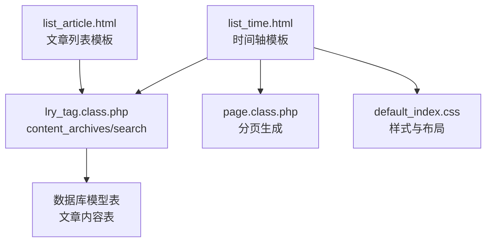
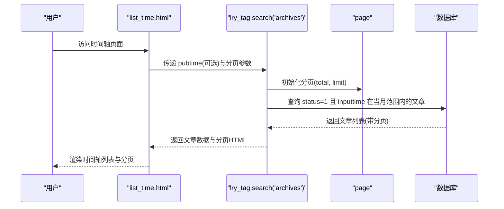
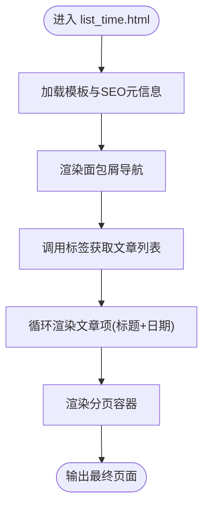
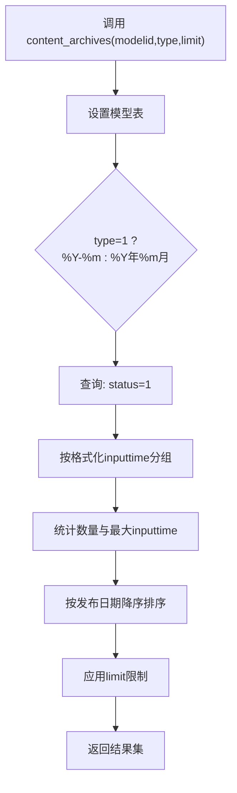
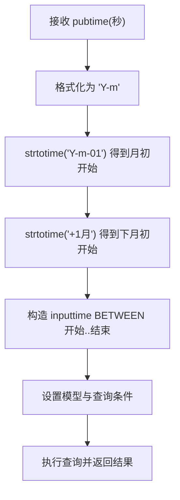
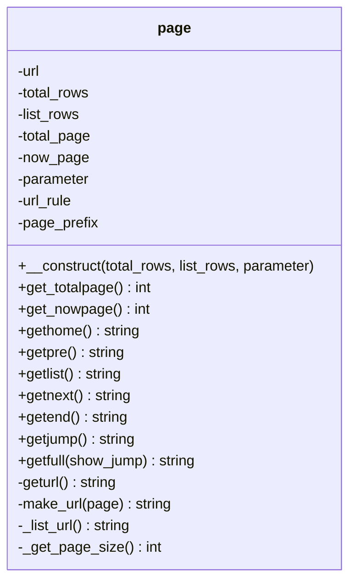
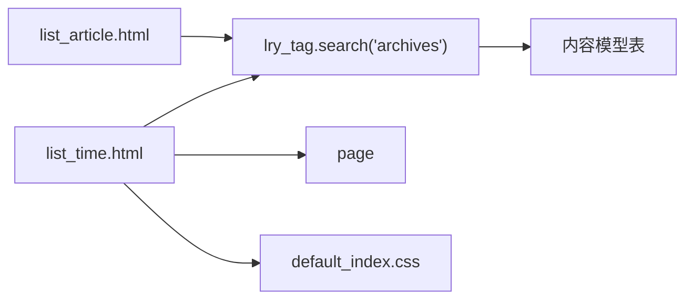
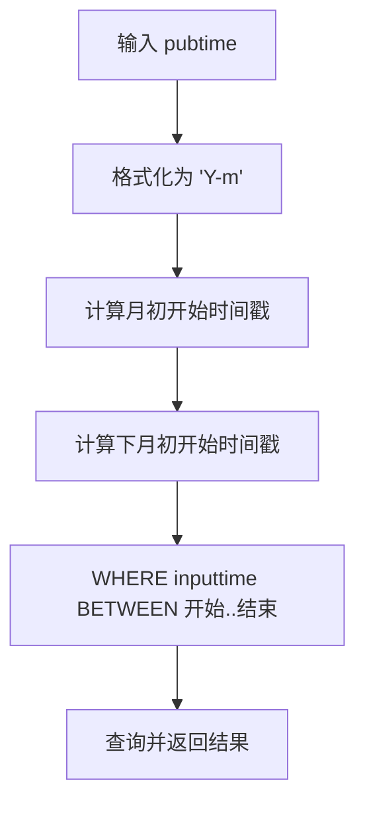

# 时间轴展示

<cite>
**本文引用的文件**
- [application/index/view/rongyao/list_time.html](file://application/index/view/rongyao/list_time.html)
- [ryphp/core/class/lry_tag.class.php](file://ryphp/core/class/lry_tag.class.php)
- [ryphp/core/class/page.class.php](file://ryphp/core/class/page.class.php)
- [application/index/view/rongyao/list_article.html](file://application/index/view/rongyao/list_article.html)
- [common/static/css/default_index.css](file://common/static/css/default_index.css)
- [ryphp/core/class/cache_factory.class.php](file://ryphp/core/class/cache_factory.class.php)
</cite>

## 目录
1. [简介](#简介)
2. [项目结构](#项目结构)
3. [核心组件](#核心组件)
4. [架构总览](#架构总览)
5. [详细组件分析](#详细组件分析)
6. [依赖分析](#依赖分析)
7. [性能考虑](#性能考虑)
8. [故障排查指南](#故障排查指南)
9. [结论](#结论)
10. [附录](#附录)

## 简介
本文件系统性阐述博客系统中“时间轴展示”功能的实现机制与使用方式，重点围绕模板 list_time.html 的时间线渲染、按年份与月份归档的文章列表、数据获取逻辑（发布时间筛选、年份提取、月份分组）、页面导航结构（年份选择器与月份切换）、与文章列表的数据一致性保障、分页处理与大数据量优化策略、SEO 优化（时间戳与结构化数据标记）、缓存机制与性能监控，以及可扩展的变体（如季度展示、标签时间轴）。

## 项目结构
时间轴功能由前端模板与后端标签/分页/模型层协同完成：
- 前端模板：负责展示与交互（list_time.html）
- 标签引擎：提供内容归档与搜索归档能力（lry_tag.class.php）
- 分页组件：提供分页 URL 与分页导航（page.class.php）
- 文章列表模板：提供通用文章列表与归档入口（list_article.html）
- 样式：基础布局与响应式适配（default_index.css）

图表来源
- [application/index/view/rongyao/list_time.html](file://application/index/view/rongyao/list_time.html#L38-L48)
- [ryphp/core/class/lry_tag.class.php](file://ryphp/core/class/lry_tag.class.php#L344-L353)
- [ryphp/core/class/page.class.php](file://ryphp/core/class/page.class.php#L26-L50)
- [application/index/view/rongyao/list_article.html](file://application/index/view/rongyao/list_article.html#L136-L146)
- [common/static/css/default_index.css](file://common/static/css/default_index.css#L1-L134)

章节来源
- [application/index/view/rongyao/list_time.html](file://application/index/view/rongyao/list_time.html#L1-L50)
- [ryphp/core/class/lry_tag.class.php](file://ryphp/core/class/lry_tag.class.php#L344-L353)
- [ryphp/core/class/page.class.php](file://ryphp/core/class/page.class.php#L26-L50)
- [application/index/view/rongyao/list_article.html](file://application/index/view/rongyao/list_article.html#L136-L146)
- [common/static/css/default_index.css](file://common/static/css/default_index.css#L1-L134)

## 核心组件
- 时间轴模板 list_time.html：负责渲染按日期倒序的文章列表，并提供分页容器与导航面包屑。
- 归档标签 content_archives：从内容模型中按年-月或年-月格式进行统计与分组，返回发布月份与数量。
- 搜索归档 search/archives：根据传入的 pubtime（Unix 时间戳）筛选当月内容，支持分页。
- 分页组件 page：计算总页数、当前页、URL 规则、分页导航 HTML。
- 文章列表模板 list_article.html：提供通用文章列表与归档入口，便于理解“时间轴”与“归档”的关系。

章节来源
- [application/index/view/rongyao/list_time.html](file://application/index/view/rongyao/list_time.html#L38-L48)
- [ryphp/core/class/lry_tag.class.php](file://ryphp/core/class/lry_tag.class.php#L344-L353)
- [ryphp/core/class/lry_tag.class.php](file://ryphp/core/class/lry_tag.class.php#L428-L445)
- [ryphp/core/class/page.class.php](file://ryphp/core/class/page.class.php#L26-L50)
- [application/index/view/rongyao/list_article.html](file://application/index/view/rongyao/list_article.html#L136-L146)

## 架构总览
时间轴页面的请求-渲染流程如下：

图表来源
- [application/index/view/rongyao/list_time.html](file://application/index/view/rongyao/list_time.html#L38-L48)
- [ryphp/core/class/lry_tag.class.php](file://ryphp/core/class/lry_tag.class.php#L428-L445)
- [ryphp/core/class/page.class.php](file://ryphp/core/class/page.class.php#L26-L50)

## 详细组件分析

### 组件A：时间轴模板 list_time.html
- 页面结构
  - 头部包含 SEO 元信息与主题样式
  - 导航面包屑显示当前位置
  - 主体包含时间轴容器与分页容器
- 列表渲染
  - 使用标签循环输出文章标题与发布日期
  - 发布时间通过本地时间格式化显示
- 分页集成
  - 分页容器内输出分页 HTML 片段
- 交互与样式
  - 引入 jQuery 与若干动画脚本
  - 样式文件来自主题目录

图表来源
- [application/index/view/rongyao/list_time.html](file://application/index/view/rongyao/list_time.html#L3-L16)
- [application/index/view/rongyao/list_time.html](file://application/index/view/rongyao/list_time.html#L37-L49)

章节来源
- [application/index/view/rongyao/list_time.html](file://application/index/view/rongyao/list_time.html#L1-L50)

### 组件B：归档标签 content_archives
- 功能概述
  - 按模型与类型（年-月格式）对已发布内容进行分组统计
  - 输出每个分组的发布时间、数量与最大输入时间
- 关键逻辑
  - 格式化字段：按 %Y-%m 或 %Y年%m月 输出
  - 过滤条件：status=1
  - 分组与排序：GROUP BY 发布时间格式，ORDER BY 发布时间 DESC
  - 限制条数：limit 控制输出分组数量

图表来源
- [ryphp/core/class/lry_tag.class.php](file://ryphp/core/class/lry_tag.class.php#L344-L353)

章节来源
- [ryphp/core/class/lry_tag.class.php](file://ryphp/core/class/lry_tag.class.php#L344-L353)

### 组件C：搜索归档 search/archives
- 功能概述
  - 根据传入的 pubtime（Unix 时间戳）推导出当月起止时间
  - 查询该月范围内已发布的内容，支持分页
- 关键逻辑
  - 输入时间戳解析为年-月字符串
  - 计算当月开始与结束时间戳
  - WHERE 条件：inputtime BETWEEN 开始与结束
  - 分页：total 计算后实例化分页组件，limit 传入查询

图表来源
- [ryphp/core/class/lry_tag.class.php](file://ryphp/core/class/lry_tag.class.php#L428-L445)

章节来源
- [ryphp/core/class/lry_tag.class.php](file://ryphp/core/class/lry_tag.class.php#L428-L445)

### 组件D：分页组件 page
- 功能概述
  - 计算总页数、当前页、URL 规则、分页导航 HTML
  - 支持 Cookie 记录每页条数、URL 规则（静态化）与跳转输入框
- 关键逻辑
  - 构造函数：初始化 total_rows、list_rows、now_page
  - URL 生成：支持路由规则或自定义规则
  - 导航生成：首页/上一页/页码列表/下一页/尾页/跳转

图表来源
- [ryphp/core/class/page.class.php](file://ryphp/core/class/page.class.php#L14-L202)

章节来源
- [ryphp/core/class/page.class.php](file://ryphp/core/class/page.class.php#L26-L50)
- [ryphp/core/class/page.class.php](file://ryphp/core/class/page.class.php#L117-L136)
- [ryphp/core/class/page.class.php](file://ryphp/core/class/page.class.php#L155-L166)
- [ryphp/core/class/page.class.php](file://ryphp/core/class/page.class.php#L172-L200)

### 组件E：文章列表模板 list_article.html
- 功能概述
  - 提供文章列表、点击排行、标签云等模块
  - 包含“文章归档”注释块，展示了归档入口的标签调用方式
- 与时间轴的关系
  - 归档入口可跳转至按月筛选的搜索归档页面，形成“时间轴”与“归档”的闭环

章节来源
- [application/index/view/rongyao/list_article.html](file://application/index/view/rongyao/list_article.html#L136-L146)

### 组件F：样式与布局 default_index.css
- 功能概述
  - 提供基础布局、响应式适配与模块化样式
  - 与时间轴模板配合，确保在不同设备上的可读性与美观度

章节来源
- [common/static/css/default_index.css](file://common/static/css/default_index.css#L1-L134)

## 依赖分析
- 模板依赖
  - list_time.html 依赖标签引擎提供的文章列表与分页能力
  - 归档入口依赖 search/archives 的时间筛选逻辑
- 数据依赖
  - 归档标签依赖内容模型表的 inputtime 字段与 status 状态
  - 分页组件依赖 total_rows 与 list_rows 的正确计算
- 外部依赖
  - 样式与脚本资源来自主题目录，需确保路径与版本一致

图表来源
- [application/index/view/rongyao/list_time.html](file://application/index/view/rongyao/list_time.html#L38-L48)
- [ryphp/core/class/lry_tag.class.php](file://ryphp/core/class/lry_tag.class.php#L428-L445)
- [ryphp/core/class/page.class.php](file://ryphp/core/class/page.class.php#L26-L50)
- [application/index/view/rongyao/list_article.html](file://application/index/view/rongyao/list_article.html#L136-L146)
- [common/static/css/default_index.css](file://common/static/css/default_index.css#L1-L134)

## 性能考虑
- 数据库层面
  - 归档统计使用 GROUP BY 与 COUNT，建议在 inputtime 上建立索引以提升分组效率
  - 搜索归档的 BETWEEN 查询应确保 inputtime 有索引，避免全表扫描
- 分页与缓存
  - 分页组件支持 Cookie 记录每页条数，减少频繁切换带来的请求波动
  - 可结合缓存工厂（cache_factory）对热点归档结果进行缓存，降低数据库压力
- 前端优化
  - 模板中对关键脚本采用预加载与延迟加载策略，改善首屏体验
- 大数据量策略
  - 合理设置 limit 与分页大小，避免一次性加载过多数据
  - 对高频访问的月份归档结果进行短期缓存，结合缓存失效策略

章节来源
- [ryphp/core/class/cache_factory.class.php](file://ryphp/core/class/cache_factory.class.php#L1-L34)
- [ryphp/core/class/page.class.php](file://ryphp/core/class/page.class.php#L155-L166)
- [application/index/view/rongyao/list_article.html](file://application/index/view/rongyao/list_article.html#L1-L34)

## 故障排查指南
- 归档为空或不准确
  - 检查文章状态是否为已发布（status=1）
  - 检查 inputtime 字段是否正确写入与索引是否存在
- 分页异常
  - 确认 total_rows 是否正确传入，当前页参数 page 是否有效
  - 检查 URL 规则与 page_prefix 配置是否匹配
- 时间轴日期显示异常
  - 检查模板中的日期格式化逻辑与服务器时区设置
- 归档入口无法跳转
  - 确认 search/archives 的 pubtime 参数是否正确传递与解析

章节来源
- [ryphp/core/class/lry_tag.class.php](file://ryphp/core/class/lry_tag.class.php#L428-L445)
- [ryphp/core/class/page.class.php](file://ryphp/core/class/page.class.php#L26-L50)

## 结论
时间轴展示功能通过模板与标签引擎的协作，实现了按月归档的文章列表渲染与分页导航。其核心在于：
- 归档标签对 inputtime 的分组统计与排序
- 搜索归档对当月内容的精确筛选
- 分页组件对 URL 与导航的统一管理
- 模板与样式的协同，确保良好的用户体验

在实际部署中，建议结合缓存与索引策略，持续监控热点归档的访问与数据库负载，以获得更优的性能表现。

## 附录

### A. 时间轴数据获取逻辑（步骤化）
- 输入：可选 pubtime（Unix 秒）
- 步骤：
  1) 解析 pubtime 为年-月字符串
  2) 计算当月开始与结束时间戳
  3) 查询 inputtime 在该范围内的已发布内容
  4) 应用分页并返回结果

图表来源
- [ryphp/core/class/lry_tag.class.php](file://ryphp/core/class/lry_tag.class.php#L428-L445)

### B. SEO 优化要点
- 时间戳处理
  - 使用标准 Unix 时间戳作为归档筛选依据，确保跨时区一致性
- 结构化数据
  - 可在模板中为文章列表添加结构化标记（如 Article Schema），提升搜索引擎理解度
- 元信息
  - 模板已包含标题、关键词与描述，建议按页面动态生成以增强相关性

章节来源
- [application/index/view/rongyao/list_time.html](file://application/index/view/rongyao/list_time.html#L4-L8)
- [ryphp/core/class/lry_tag.class.php](file://ryphp/core/class/lry_tag.class.php#L428-L445)

### C. 缓存机制与性能监控
- 缓存策略
  - 使用缓存工厂选择合适的缓存实现（文件/Redis/Memcache）
  - 对高频月份归档结果进行短期缓存，结合失效策略
- 性能监控
  - 记录数据库查询耗时与命中率
  - 监控分页请求分布，识别热点月份与低效查询

章节来源
- [ryphp/core/class/cache_factory.class.php](file://ryphp/core/class/cache_factory.class.php#L1-L34)
- [ryphp/core/class/page.class.php](file://ryphp/core/class/page.class.php#L155-L166)

### D. 自定义扩展方法
- 季度展示
  - 修改归档标签的格式化字段为 %Y-Q1、%Y-Q2 等，按季度分组统计
- 标签时间轴
  - 基于标签内容表（tag_content）与内容模型联表，按标签维度生成时间轴
- 年度汇总
  - 将格式化字段改为 %Y，实现年度维度的归档列表

章节来源
- [ryphp/core/class/lry_tag.class.php](file://ryphp/core/class/lry_tag.class.php#L344-L353)
- [application/index/view/rongyao/list_article.html](file://application/index/view/rongyao/list_article.html#L129-L133)