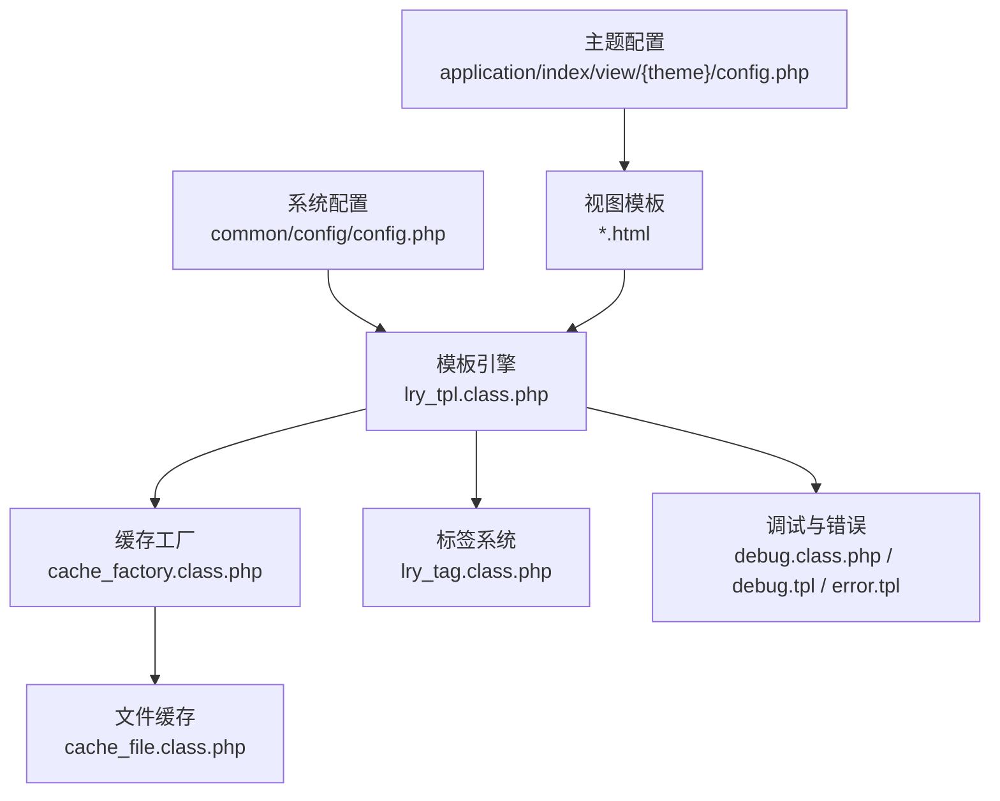
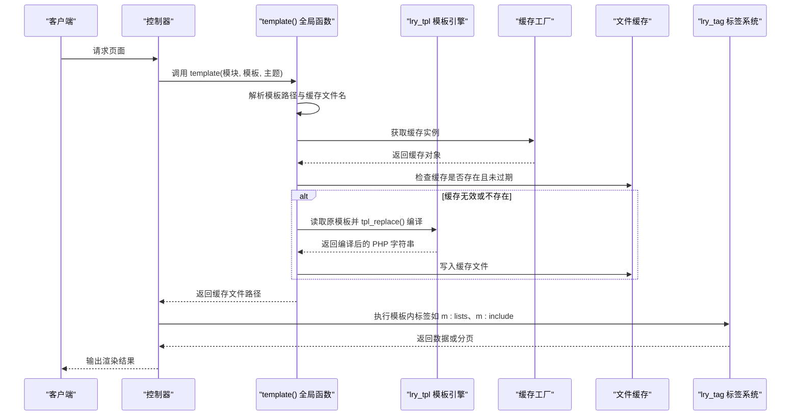
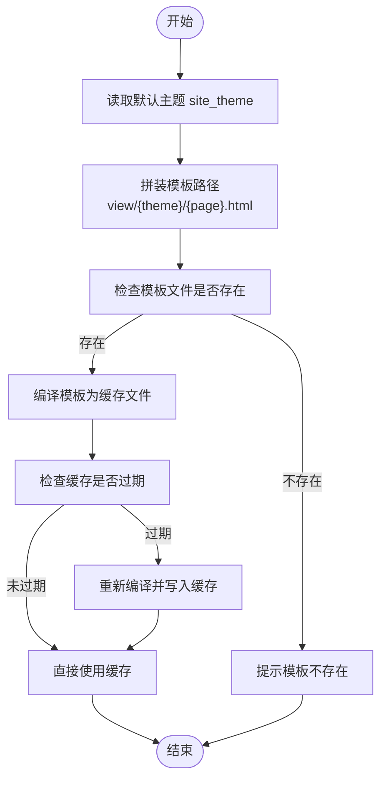
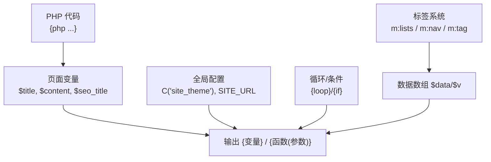
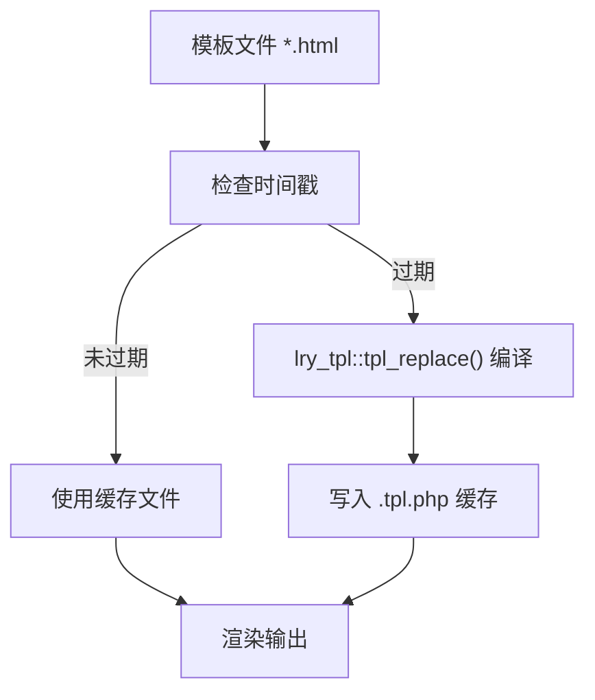
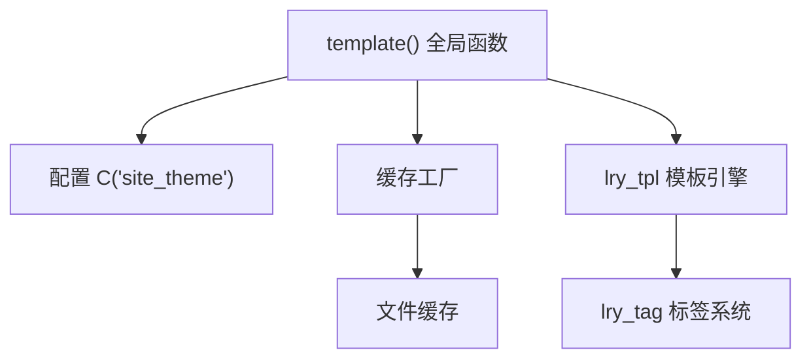

# 模板系统配置

<cite>
**本文引用的文件**
- [config.php](file://common/config/config.php)
- [config.php](file://application/index/view/rongyao/config.php)
- [lry_tpl.class.php](file://ryphp/core/class/lry_tpl.class.php)
- [global.func.php](file://ryphp/core/function/global.func.php)
- [cache_factory.class.php](file://ryphp/core/class/cache_factory.class.php)
- [cache_file.class.php](file://ryphp/core/class/cache_file.class.php)
- [lry_tag.class.php](file://ryphp/core/class/lry_tag.class.php)
- [category.class.php](file://application/lry_admin_center/controller/category.class.php)
- [category_article.html](file://application/index/view/rongyao/category_article.html)
- [show_article.html](file://application/index/view/rongyao/show_article.html)
- [debug.class.php](file://ryphp/core/class/debug.class.php)
- [debug.tpl](file://ryphp/core/message/debug.tpl)
- [error.tpl](file://ryphp/core/message/error.tpl)
</cite>

## 目录
1. [简介](#简介)
2. [项目结构](#项目结构)
3. [核心组件](#核心组件)
4. [架构总览](#架构总览)
5. [详细组件分析](#详细组件分析)
6. [依赖分析](#依赖分析)
7. [性能考虑](#性能考虑)
8. [故障排查指南](#故障排查指南)
9. [结论](#结论)
10. [附录](#附录)

## 简介
本文件聚焦于模板系统的配置与实现，围绕以下目标展开：
- 深入解析 common/config/config.php 中的模板相关配置项与主题设置机制
- 说明模板路径配置、主题切换逻辑与模板继承关系
- 阐述模板变量的定义与使用（全局变量、页面变量、动态变量）
- 解释模板缓存机制与编译流程（缓存文件生成与更新策略）
- 提供模板调试模式启用方法与错误处理机制
- 给出模板性能优化建议（预编译、缓存策略、压缩处理）
- 说明模板安全机制（XSS 防护与模板注入防范）
- 提供自定义模板开发指南（命名规范、文件组织与最佳实践）

## 项目结构
模板系统由“配置层”“模板引擎层”“缓存层”“标签系统层”“视图层”“调试与错误展示层”组成。关键文件分布如下：
- 配置层：common/config/config.php（系统配置）、application/index/view/{theme}/config.php（主题配置）
- 模板引擎层：ryphp/core/class/lry_tpl.class.php（模板标签解析与编译）
- 缓存层：ryphp/core/class/cache_factory.class.php（缓存工厂）、ryphp/core/class/cache_file.class.php（文件缓存实现）
- 标签系统层：ryphp/core/class/lry_tag.class.php（内置标签集合）
- 视图层：application/index/view/{theme}/{page}.html（模板文件）
- 调试与错误展示层：ryphp/core/class/debug.class.php、ryphp/core/message/debug.tpl、ryphp/core/message/error.tpl

**图表来源**
- [config.php](file://common/config/config.php#L1-L88)
- [config.php](file://application/index/view/rongyao/config.php#L1-L29)
- [lry_tpl.class.php](file://ryphp/core/class/lry_tpl.class.php#L1-L134)
- [cache_factory.class.php](file://ryphp/core/class/cache_factory.class.php#L1-L84)
- [cache_file.class.php](file://ryphp/core/class/cache_file.class.php#L1-L130)
- [lry_tag.class.php](file://ryphp/core/class/lry_tag.class.php#L1-L492)
- [debug.class.php](file://ryphp/core/class/debug.class.php#L43-L147)

**章节来源**
- [config.php](file://common/config/config.php#L1-L88)
- [config.php](file://application/index/view/rongyao/config.php#L1-L29)

## 核心组件
- 系统配置（common/config/config.php）
  - 主题设置：site_theme 指定默认主题目录
  - 缓存配置：cache_type、file_config、redis_config、memcache_config
  - 其他模板相关开关：edit_template（是否允许在线编辑模板）
- 主题配置（application/index/view/{theme}/config.php）
  - 定义分类模板、列表模板、内容页模板映射
- 模板引擎（lry_tpl.class.php）
  - 将模板标签语法转换为 PHP 代码，支持 include、php、if/else、loop、函数调用等
- 缓存工厂与文件缓存（cache_factory.class.php、cache_file.class.php）
  - 工厂按 cache_type 选择具体缓存实现；文件缓存负责缓存文件的读写、过期与清理
- 标签系统（lry_tag.class.php）
  - 提供 lists、pages、nav、link、tag、relation、comment_list 等标签，支持分页与缓存
- 视图模板（application/index/view/{theme}/*.html）
  - 包含模板语法（如 {m:include}、{m:lists}、{php}、{loop}、{if}）与变量使用
- 调试与错误（debug.class.php、debug.tpl、error.tpl）
  - 调试模式下展示运行信息、SQL、请求参数；错误时展示统一错误页

**章节来源**
- [config.php](file://common/config/config.php#L9-L87)
- [config.php](file://application/index/view/rongyao/config.php#L2-L29)
- [lry_tpl.class.php](file://ryphp/core/class/lry_tpl.class.php#L10-L134)
- [cache_factory.class.php](file://ryphp/core/class/cache_factory.class.php#L36-L82)
- [cache_file.class.php](file://ryphp/core/class/cache_file.class.php#L17-L128)
- [lry_tag.class.php](file://ryphp/core/class/lry_tag.class.php#L18-L492)
- [debug.class.php](file://ryphp/core/class/debug.class.php#L43-L147)

## 架构总览
模板系统从“模板调用”开始，经过“编译与缓存”，最终在“标签系统”与“变量上下文”中渲染输出。

**图表来源**
- [global.func.php](file://ryphp/core/function/global.func.php#L1527-L1556)
- [lry_tpl.class.php](file://ryphp/core/class/lry_tpl.class.php#L31-L59)
- [cache_factory.class.php](file://ryphp/core/class/cache_factory.class.php#L77-L82)
- [cache_file.class.php](file://ryphp/core/class/cache_file.class.php#L17-L46)
- [lry_tag.class.php](file://ryphp/core/class/lry_tag.class.php#L18-L65)

## 详细组件分析

### 模板路径配置与主题切换
- 默认主题：common/config/config.php 中的 site_theme 指定默认主题目录（如 rongyao）
- 主题配置：application/index/view/{theme}/config.php 定义模板映射（分类、列表、内容页）
- 模板调用：template() 函数根据模块、模板名与主题生成缓存文件名，并在首次或模板变更时触发编译
- 主题切换：后台控制器在选择模板时，基于当前站点主题与模板类型（category/list/show）扫描对应主题目录下的 *.html 文件，并结合主题配置进行匹配

**图表来源**
- [config.php](file://common/config/config.php#L9-L11)
- [global.func.php](file://ryphp/core/function/global.func.php#L1527-L1556)
- [category.class.php](file://application/lry_admin_center/controller/category.class.php#L511-L533)

**章节来源**
- [config.php](file://common/config/config.php#L9-L11)
- [config.php](file://application/index/view/rongyao/config.php#L2-L29)
- [global.func.php](file://ryphp/core/function/global.func.php#L1527-L1556)
- [category.class.php](file://application/lry_admin_center/controller/category.class.php#L511-L533)

### 模板继承与包含机制
- 模板包含：模板语法 {m:include 模块, 模板} 被 lry_tpl::tpl_replace() 替换为 PHP include 调用
- 继承关系：通过在子模板中引入公共头部/底部（如 header/footer），形成“父模板”与“子模板”的关系
- 实例参考：rongyao 主题的 category_article.html 与 show_article.html 均通过 {m:include} 引入公共头部与底部

**章节来源**
- [lry_tpl.class.php](file://ryphp/core/class/lry_tpl.class.php#L32-L33)
- [category_article.html](file://application/index/view/rongyao/category_article.html#L21-L53)
- [show_article.html](file://application/index/view/rongyao/show_article.html#L50-L518)

### 模板变量体系
- 全局变量
  - 通过 C('key') 获取系统配置（如 C('site_theme')）
  - 通过全局函数与常量（如 SITE_URL、STATIC_URL）传递系统级信息
- 页面变量
  - 控制器向模板传递的数据（如 $title、$content、$seo_title 等）
  - 模板中使用 {变量名} 或 {函数(参数)} 形式输出
- 动态变量
  - 模板内 PHP 代码：{php ...} 可执行 PHP 逻辑并赋值给变量
  - 循环与条件：{loop}、{if}、{else}、{elseif}、{/if} 控制输出
- 标签变量
  - m:lists、m:nav、m:link、m:tag 等标签返回数据数组，模板通过 $data/$v 使用

**图表来源**
- [category_article.html](file://application/index/view/rongyao/category_article.html#L24-L46)
- [show_article.html](file://application/index/view/rongyao/show_article.html#L78-L90)
- [lry_tpl.class.php](file://ryphp/core/class/lry_tpl.class.php#L46-L55)

**章节来源**
- [category_article.html](file://application/index/view/rongyao/category_article.html#L24-L46)
- [show_article.html](file://application/index/view/rongyao/show_article.html#L78-L90)
- [lry_tpl.class.php](file://ryphp/core/class/lry_tpl.class.php#L31-L59)

### 模板缓存机制与编译流程
- 编译触发：template() 在缓存文件不存在或模板文件更新时间晚于缓存文件时触发编译
- 编译过程：lry_tpl::tpl_replace() 将模板标签转换为 PHP 代码，写入 .tpl.php 缓存文件
- 缓存存储：cache_factory 根据 cache_type 选择缓存实现；默认 file 模式下由 cache_file 管理缓存文件的读写、过期与清理
- 更新策略：基于模板文件与缓存文件的时间戳比较；支持 flush 清空全部缓存

**图表来源**
- [global.func.php](file://ryphp/core/function/global.func.php#L1527-L1556)
- [lry_tpl.class.php](file://ryphp/core/class/lry_tpl.class.php#L31-L59)
- [cache_factory.class.php](file://ryphp/core/class/cache_factory.class.php#L39-L59)
- [cache_file.class.php](file://ryphp/core/class/cache_file.class.php#L17-L46)

**章节来源**
- [global.func.php](file://ryphp/core/function/global.func.php#L1527-L1556)
- [lry_tpl.class.php](file://ryphp/core/class/lry_tpl.class.php#L31-L59)
- [cache_factory.class.php](file://ryphp/core/class/cache_factory.class.php#L36-L82)
- [cache_file.class.php](file://ryphp/core/class/cache_file.class.php#L17-L128)

### 模板调试模式与错误处理
- 调试模式：RYPHP_DEBUG 开启后，debug.class.php 捕获错误与致命错误，渲染 debug.tpl 展示运行信息、SQL、请求参数
- 错误页：非调试模式下，错误通过统一的 error.tpl 展示，避免泄露敏感信息
- 日志记录：调试模式下可输出详细错误信息，非调试模式下写入错误日志并提示用户

**章节来源**
- [debug.class.php](file://ryphp/core/class/debug.class.php#L43-L147)
- [debug.tpl](file://ryphp/core/message/debug.tpl#L1-L75)
- [error.tpl](file://ryphp/core/message/error.tpl#L1-L179)

### 模板安全机制
- XSS 防护：模板中输出变量时应配合过滤函数（如 htmlspecialchars 等，具体调用由业务层决定）
- 模板注入防范：模板语法被严格解析为 PHP 代码，避免直接执行任意 PHP；标签参数通过 arr_to_html 转义与序列化，降低注入风险
- 配置安全：edit_template 关闭在线编辑模板，减少模板层面的安全隐患

**章节来源**
- [lry_tpl.class.php](file://ryphp/core/class/lry_tpl.class.php#L111-L132)
- [config.php](file://common/config/config.php#L84-L85)

### 自定义模板开发指南
- 命名规范
  - 模板文件命名：{page}.html（如 category_article.html、show_article.html）
  - 主题目录：application/index/view/{theme}/
- 文件组织
  - 公共部分：header.html、footer.html
  - 页面模板：按功能划分（分类、列表、内容页）
  - 主题配置：在主题根目录提供 config.php，声明模板映射
- 最佳实践
  - 使用 {m:include} 组织公共结构
  - 使用 {m:lists}、{m:nav} 等标签获取数据，避免在模板中编写复杂逻辑
  - 合理使用 {php} 注入必要逻辑，但保持简洁
  - 为关键资源使用预加载与延迟加载策略（参考 show_article.html 的资源加载方式）

**章节来源**
- [config.php](file://application/index/view/rongyao/config.php#L2-L29)
- [category_article.html](file://application/index/view/rongyao/category_article.html#L21-L53)
- [show_article.html](file://application/index/view/rongyao/show_article.html#L16-L43)

## 依赖分析
- 模板调用依赖配置与缓存工厂：template() 依赖 C('site_theme') 与缓存工厂选择具体缓存实现
- 模板引擎依赖标签系统：模板内的 m: 标签由 lry_tag 解析并返回数据
- 缓存层解耦：cache_factory 通过 switch(cache_type) 选择不同缓存实现，便于扩展

**图表来源**
- [global.func.php](file://ryphp/core/function/global.func.php#L1527-L1556)
- [cache_factory.class.php](file://ryphp/core/class/cache_factory.class.php#L36-L82)
- [cache_file.class.php](file://ryphp/core/class/cache_file.class.php#L1-L130)
- [lry_tpl.class.php](file://ryphp/core/class/lry_tpl.class.php#L62-L92)
- [lry_tag.class.php](file://ryphp/core/class/lry_tag.class.php#L18-L65)

**章节来源**
- [global.func.php](file://ryphp/core/function/global.func.php#L1527-L1556)
- [cache_factory.class.php](file://ryphp/core/class/cache_factory.class.php#L36-L82)
- [lry_tpl.class.php](file://ryphp/core/class/lry_tpl.class.php#L62-L92)
- [lry_tag.class.php](file://ryphp/core/class/lry_tag.class.php#L18-L65)

## 性能考虑
- 预编译与缓存
  - 启用缓存后，模板仅在首次或模板变更时编译，后续直接使用缓存文件
  - 使用 cache_type=file 并合理设置 file_config.mode（可执行文件模式提升加载速度）
- 缓存策略
  - 对热点标签（如 m:lists、m:nav）可结合 getcache/setcache 实现标签级缓存
  - 定期清理过期缓存，避免磁盘膨胀
- 压缩处理
  - 生产环境建议对静态资源进行压缩与合并（CSS/JS），减少网络传输
  - 模板中按需加载资源，避免阻塞首屏渲染

**章节来源**
- [config.php](file://common/config/config.php#L39-L66)
- [cache_file.class.php](file://ryphp/core/class/cache_file.class.php#L103-L128)
- [lry_tag.class.php](file://ryphp/core/class/lry_tag.class.php#L76-L91)

## 故障排查指南
- 模板不存在
  - 现象：提示模板不存在
  - 排查：确认模板路径与主题配置一致；检查模板文件是否存在
- 缓存未更新
  - 现象：页面未反映最新改动
  - 排查：删除缓存文件或调用 flush 清空缓存；确认模板文件时间戳已更新
- 调试模式启用
  - 开启：RYPHP_DEBUG；查看 debug.tpl 展示的运行信息、SQL、请求参数
  - 关闭：非调试模式下错误将写入日志并显示通用错误页
- 标签报错
  - 现象：m:lists 等标签返回空或报错
  - 排查：检查标签参数（如 catid、modelid、limit）是否正确；确认数据源可用

**章节来源**
- [global.func.php](file://ryphp/core/function/global.func.php#L1527-L1556)
- [debug.class.php](file://ryphp/core/class/debug.class.php#L43-L147)
- [debug.tpl](file://ryphp/core/message/debug.tpl#L1-L75)
- [error.tpl](file://ryphp/core/message/error.tpl#L1-L179)

## 结论
本模板系统通过清晰的配置层、严格的模板引擎与缓存机制、完善的标签系统与调试/错误处理，实现了主题化、可扩展、高性能的模板渲染能力。开发者应遵循命名规范与最佳实践，合理利用缓存与调试工具，确保模板在生产环境中的稳定性与安全性。

## 附录
- 关键配置项速览
  - 主题：site_theme
  - 缓存：cache_type、file_config、redis_config、memcache_config
  - 模板编辑：edit_template
- 关键函数与类
  - template()：模板调用与缓存管理
  - lry_tpl::tpl_replace()：模板标签编译
  - cache_factory/get_cache_instances()：缓存实例获取
  - lry_tag：内置标签集合