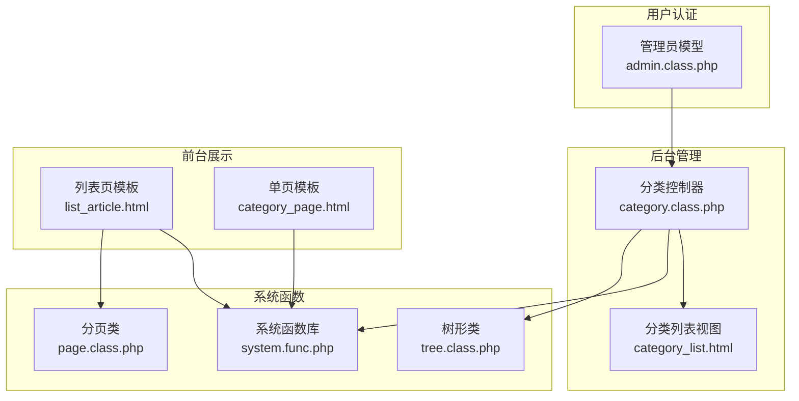
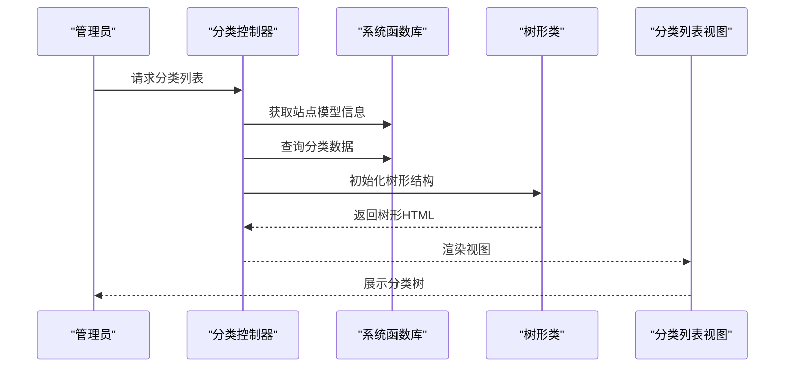
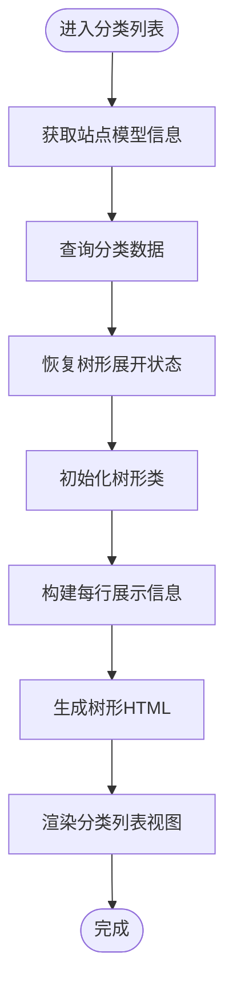
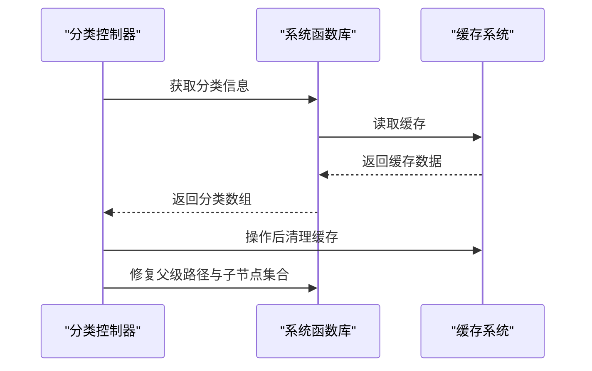
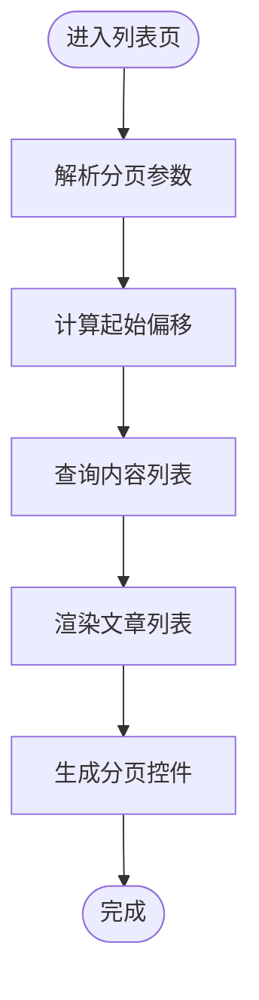
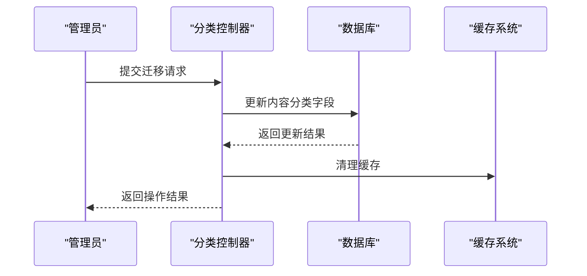
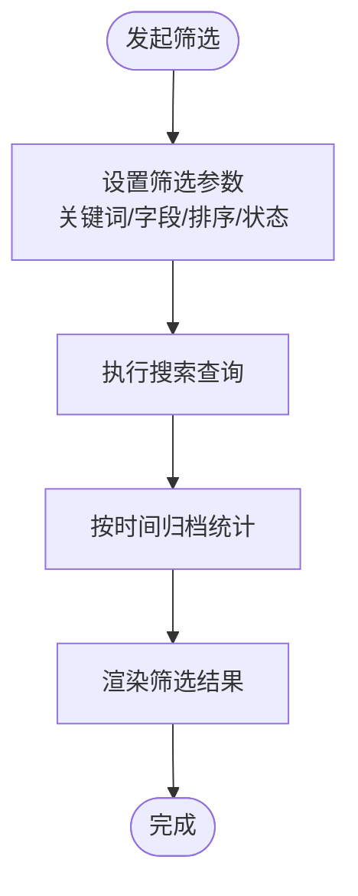
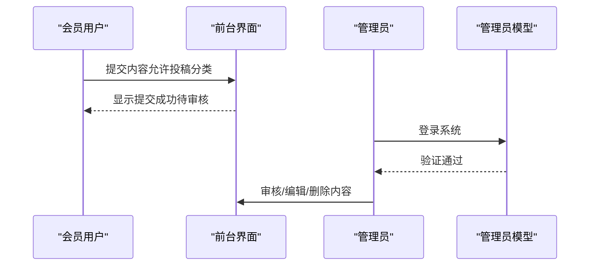
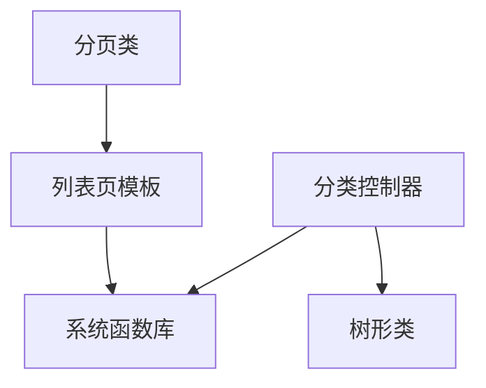

# 分类内容关联管理

<cite>
**本文档引用的文件**
- [category.class.php](file://application/lry_admin_center/controller/category.class.php)
- [category1.class.php](file://application/lry_admin_center/controller/category1.class.php)
- [category_list.html](file://application/lry_admin_center/view/category_list.html)
- [list_article.html](file://application/index/view/rongyao/list_article.html)
- [category_page.html](file://application/index/view/rongyao/category_page.html)
- [system.func.php](file://common/function/system.func.php)
- [page.class.php](file://ryphp/core/class/page.class.php)
- [tree.class.php](file://ryphp/core/class/tree.class.php)
- [admin.class.php](file://application/lry_admin_center/model/admin.class.php)
- [index.class.php](file://application/index/controller/index.class.php)
</cite>

## 目录
1. [引言](#引言)
2. [项目结构](#项目结构)
3. [核心组件](#核心组件)
4. [架构总览](#架构总览)
5. [详细组件分析](#详细组件分析)
6. [依赖关系分析](#依赖关系分析)
7. [性能考虑](#性能考虑)
8. [故障排除指南](#故障排除指南)
9. [结论](#结论)
10. [附录](#附录)

## 引言
本文件面向内容管理者与开发者，系统性阐述 LRYBlog 的分类内容关联管理功能。重点涵盖：
- 分类与内容模型的对应关系
- 分类文章数量统计与缓存更新机制
- 分类文章列表显示逻辑（分页与排序）
- 内容迁移（批量移动内容到其他分类）
- 分类内容的搜索与筛选（按时间、作者、状态）
- 内容发布权限控制（会员发布与管理员审核）
- 最佳实践与效率提升方案

## 项目结构
围绕分类内容关联管理的核心目录与文件如下：
- 后台控制器：分类管理控制器位于后台中心模块，负责分类的增删改查、模板选择、缓存清理与树形结构渲染。
- 前台视图：频道页、列表页、单页模板分别对应不同展示形态。
- 系统函数：提供分类信息缓存、站点模型信息、URL 生成等基础能力。
- 分页与树形组件：分页类负责分页参数与页码生成；树形类负责分类树渲染。

**图表来源**
- [category.class.php:1-580](file://application/lry_admin_center/controller/category.class.php#L1-L580)
- [category_list.html:1-116](file://application/lry_admin_center/view/category_list.html#L1-L116)
- [list_article.html:1-150](file://application/index/view/rongyao/list_article.html#L1-L150)
- [category_page.html:1-59](file://application/index/view/rongyao/category_page.html#L1-L59)
- [system.func.php:59-656](file://common/function/system.func.php#L59-L656)
- [tree.class.php:25-200](file://ryphp/core/class/tree.class.php#L25-L200)
- [page.class.php:91-136](file://ryphp/core/class/page.class.php#L91-L136)
- [admin.class.php:1-96](file://application/lry_admin_center/model/admin.class.php#L1-L96)

**章节来源**
- [category.class.php:1-580](file://application/lry_admin_center/controller/category.class.php#L1-L580)
- [category_list.html:1-116](file://application/lry_admin_center/view/category_list.html#L1-L116)
- [list_article.html:1-150](file://application/index/view/rongyao/list_article.html#L1-L150)
- [category_page.html:1-59](file://application/index/view/rongyao/category_page.html#L1-L59)
- [system.func.php:59-656](file://common/function/system.func.php#L59-L656)
- [tree.class.php:25-200](file://ryphp/core/class/tree.class.php#L25-L200)
- [page.class.php:91-136](file://ryphp/core/class/page.class.php#L91-L136)
- [admin.class.php:1-96](file://application/lry_admin_center/model/admin.class.php#L1-L96)

## 核心组件
- 分类控制器：负责分类列表、添加、编辑、删除、排序、模板选择、URL 生成、缓存清理与树形渲染。
- 分类树形渲染：基于树形类生成分类树 HTML，支持展开/收起状态持久化。
- 分类信息缓存：通过系统函数提供的缓存机制，避免重复查询数据库。
- 分页组件：负责分页参数计算、页码生成与 URL 构造。
- 前台模板：列表页、单页模板根据分类信息与内容模型渲染页面。

**章节来源**
- [category.class.php:15-134](file://application/lry_admin_center/controller/category.class.php#L15-L134)
- [tree.class.php:149-194](file://ryphp/core/class/tree.class.php#L149-L194)
- [system.func.php:631-656](file://common/function/system.func.php#L631-L656)
- [page.class.php:91-136](file://ryphp/core/class/page.class.php#L91-L136)

## 架构总览
分类内容关联管理涉及后台分类维护与前台内容展示两大层面：
- 后台：分类控制器通过系统函数获取分类信息与模型信息，结合树形类渲染分类树，并在操作后清理相关缓存。
- 前台：列表页模板通过标签调用内容列表，分页类提供分页参数，系统函数提供 URL 与 SEO 等辅助能力。

**图表来源**
- [category.class.php:27-134](file://application/lry_admin_center/controller/category.class.php#L27-L134)
- [system.func.php:119-128](file://common/function/system.func.php#L119-L128)
- [tree.class.php:61-66](file://ryphp/core/class/tree.class.php#L61-L66)

**章节来源**
- [category.class.php:27-134](file://application/lry_admin_center/controller/category.class.php#L27-L134)
- [system.func.php:119-128](file://common/function/system.func.php#L119-L128)
- [tree.class.php:61-66](file://ryphp/core/class/tree.class.php#L61-L66)

## 详细组件分析

### 组件A：分类列表与树形渲染
- 功能要点
  - 获取站点模型信息并建立模型ID到名称的映射。
  - 基于 Cookie 恢复分类树的展开/收起状态。
  - 查询当前站点分类数据，构建每项的展示信息（链接、图标、操作按钮等）。
  - 使用树形类生成树形 HTML，并渲染到分类列表视图。
- 关键流程
  - 读取 Cookie 中的展开状态，计算需要隐藏的子节点集合。
  - 初始化树形类，设置图标与缩进，遍历分类数据生成树形结构。
  - 渲染视图并输出最终 HTML。

**图表来源**
- [category.class.php:27-134](file://application/lry_admin_center/controller/category.class.php#L27-L134)
- [category_list.html:75-114](file://application/lry_admin_center/view/category_list.html#L75-L114)

**章节来源**
- [category.class.php:27-134](file://application/lry_admin_center/controller/category.class.php#L27-L134)
- [category_list.html:75-114](file://application/lry_admin_center/view/category_list.html#L75-L114)

### 组件B：分类文章数量统计与缓存更新
- 统计机制
  - 分类信息通过系统函数缓存，避免频繁查询数据库。
  - 分类树渲染时，根据展开状态动态隐藏子节点，提升交互体验。
- 缓存更新
  - 在分类添加、编辑、删除、排序等操作后，清理相关缓存（分类信息、站点映射等）。
  - 修复父级路径与子节点集合，确保树形结构一致性。

**图表来源**
- [system.func.php:631-656](file://common/function/system.func.php#L631-L656)
- [category.class.php:463-492](file://application/lry_admin_center/controller/category.class.php#L463-L492)

**章节来源**
- [system.func.php:631-656](file://common/function/system.func.php#L631-L656)
- [category.class.php:463-492](file://application/lry_admin_center/controller/category.class.php#L463-L492)

### 组件C：分类文章列表显示逻辑（分页与排序）
- 列表页模板
  - 使用标签调用内容列表，支持字段选择、数量限制、分页参数等。
- 分页参数
  - 分页类提供起始偏移、每页数量、URL 构造与页码生成。
  - 支持页码大小选择与当前页高亮。

**图表来源**
- [list_article.html:54](file://application/index/view/rongyao/list_article.html#L54)
- [page.class.php:91-136](file://ryphp/core/class/page.class.php#L91-L136)

**章节来源**
- [list_article.html:54](file://application/index/view/rongyao/list_article.html#L54)
- [page.class.php:91-136](file://ryphp/core/class/page.class.php#L91-L136)

### 组件D：内容迁移（批量移动到其他分类）
- 迁移流程
  - 在分类控制器中，通过更新内容记录的分类字段实现迁移。
  - 迁移后清理相关缓存，确保前端展示正确。
- 权限控制
  - 管理员具备迁移权限；会员投稿需经管理员审核。

**图表来源**
- [category.class.php:344-428](file://application/lry_admin_center/controller/category.class.php#L344-L428)

**章节来源**
- [category.class.php:344-428](file://application/lry_admin_center/controller/category.class.php#L344-L428)

### 组件E：分类内容的搜索与筛选（时间、作者、状态）
- 搜索标签
  - 系统提供搜索标签，支持按关键词、字段、排序、限制等参数筛选内容。
- 归档标签
  - 提供内容归档标签，按月份统计内容数量，便于时间维度筛选。
- 状态筛选
  - 列表查询时可按状态过滤，确保仅展示已审核内容。

**图表来源**
- [system.func.php:360-368](file://common/function/system.func.php#L360-L368)
- [system.func.php:344-353](file://common/function/system.func.php#L344-L353)

**章节来源**
- [system.func.php:360-368](file://common/function/system.func.php#L360-L368)
- [system.func.php:344-353](file://common/function/system.func.php#L344-L353)

### 组件F：内容发布权限控制（会员发布与管理员审核）
- 会员发布
  - 分类可配置“允许投稿”，仅允许在该分类下投稿。
- 管理员审核
  - 管理员登录后可对内容进行审核、编辑、删除等操作。
- 登录流程
  - 管理员模型负责校验用户名、密码、账户锁定与登录日志记录。

**图表来源**
- [category.class.php:105-107](file://application/lry_admin_center/controller/category.class.php#L105-L107)
- [admin.class.php:4-27](file://application/lry_admin_center/model/admin.class.php#L4-L27)

**章节来源**
- [category.class.php:105-107](file://application/lry_admin_center/controller/category.class.php#L105-L107)
- [admin.class.php:4-27](file://application/lry_admin_center/model/admin.class.php#L4-L27)

## 依赖关系分析
- 控制器依赖系统函数与树形类，用于获取模型信息、查询分类数据与渲染树形结构。
- 前台模板依赖系统函数提供的 URL 生成、SEO 辅助与内容列表标签。
- 分页类独立提供分页参数与页码生成，与模板配合实现分页展示。

**图表来源**
- [category.class.php:27-134](file://application/lry_admin_center/controller/category.class.php#L27-L134)
- [system.func.php:631-656](file://common/function/system.func.php#L631-L656)
- [tree.class.php:149-194](file://ryphp/core/class/tree.class.php#L149-L194)
- [list_article.html:54](file://application/index/view/rongyao/list_article.html#L54)
- [page.class.php:91-136](file://ryphp/core/class/page.class.php#L91-L136)

**章节来源**
- [category.class.php:27-134](file://application/lry_admin_center/controller/category.class.php#L27-L134)
- [system.func.php:631-656](file://common/function/system.func.php#L631-L656)
- [tree.class.php:149-194](file://ryphp/core/class/tree.class.php#L149-L194)
- [list_article.html:54](file://application/index/view/rongyao/list_article.html#L54)
- [page.class.php:91-136](file://ryphp/core/class/page.class.php#L91-L136)

## 性能考虑
- 缓存策略
  - 分类信息与站点映射采用文件缓存，减少数据库查询压力。
  - 操作后及时清理缓存，确保数据一致性。
- 树形渲染优化
  - 树形类内置缓存机制，提升子节点查询性能。
- 分页优化
  - 分页类提供起始偏移与页码生成，避免一次性加载大量数据。

[本节为通用性能建议，无需特定文件引用]

## 故障排除指南
- 分类树展开/收起异常
  - 检查 Cookie 中的展开状态是否正确写入与读取。
  - 确认分类树渲染时的隐藏逻辑与状态切换脚本。
- 缓存未更新导致显示异常
  - 在分类添加、编辑、删除、排序后，确认缓存清理逻辑是否执行。
  - 检查父级路径修复与子节点集合更新是否正确。
- 分页参数错误
  - 检查分页类的起始偏移与页码生成逻辑，确保与模板参数一致。

**章节来源**
- [category_list.html:75-114](file://application/lry_admin_center/view/category_list.html#L75-L114)
- [category.class.php:463-492](file://application/lry_admin_center/controller/category.class.php#L463-L492)
- [page.class.php:91-136](file://ryphp/core/class/page.class.php#L91-L136)

## 结论
LRYBlog 的分类内容关联管理通过“后台分类维护 + 前台模板渲染”的架构实现了灵活的分类体系与高效的内容展示。借助缓存与树形渲染优化，系统在大数据量下仍能保持良好的响应性能。管理员可通过权限控制与审核流程保障内容质量，同时利用搜索与筛选功能提升内容管理效率。

[本节为总结性内容，无需特定文件引用]

## 附录
- 最佳实践与效率提升方案
  - 合理使用缓存：在分类信息与站点映射层面充分利用缓存，减少数据库压力。
  - 优化树形渲染：在后台列表中合理使用展开/收起状态，降低 DOM 渲染负担。
  - 分页策略：根据内容规模调整每页数量，提升列表加载速度。
  - 权限与审核：严格控制“允许投稿”开关，确保内容质量；管理员定期审核待审内容。
  - 搜索与筛选：结合关键词、时间、状态等多维筛选，快速定位目标内容。

[本节为通用建议，无需特定文件引用]