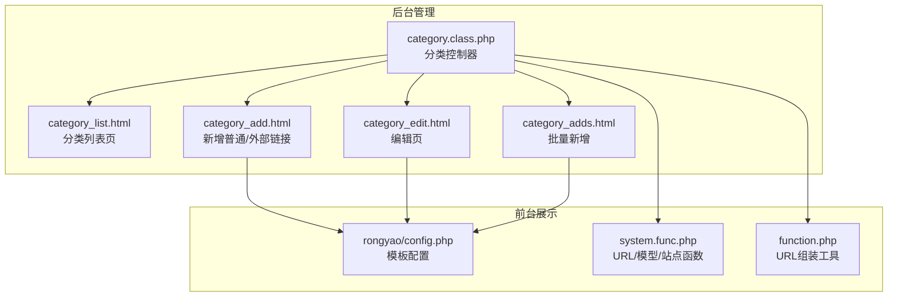
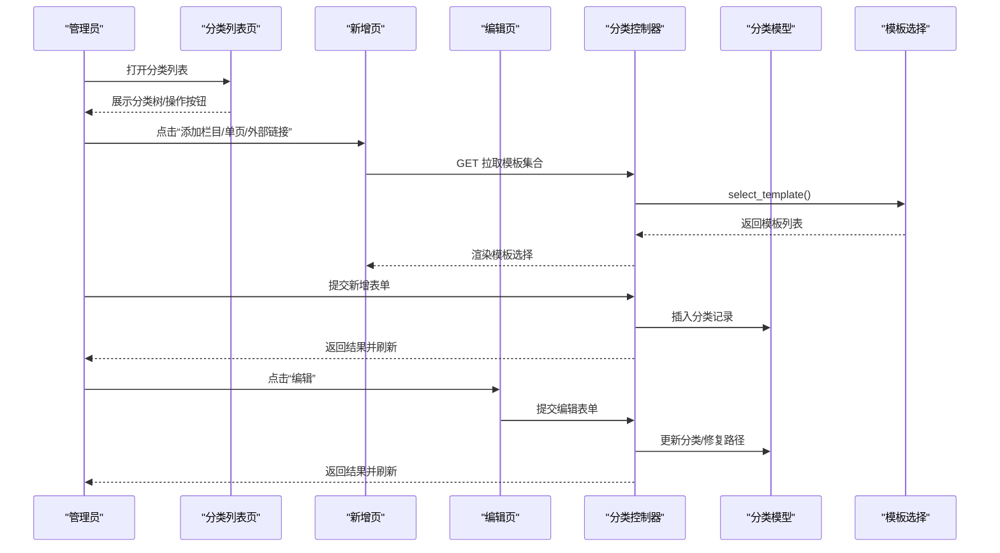
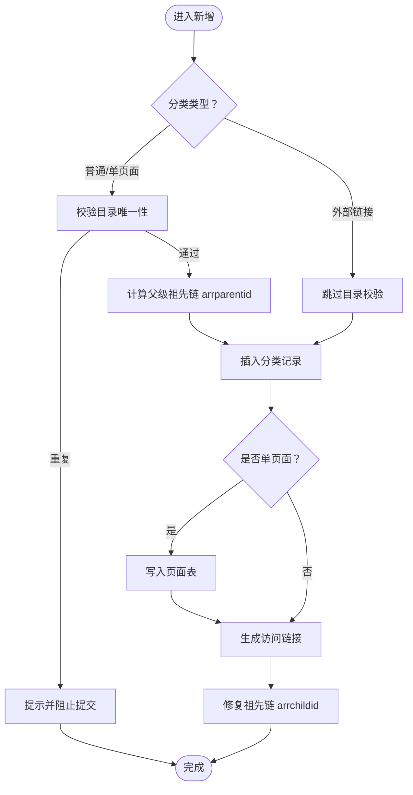
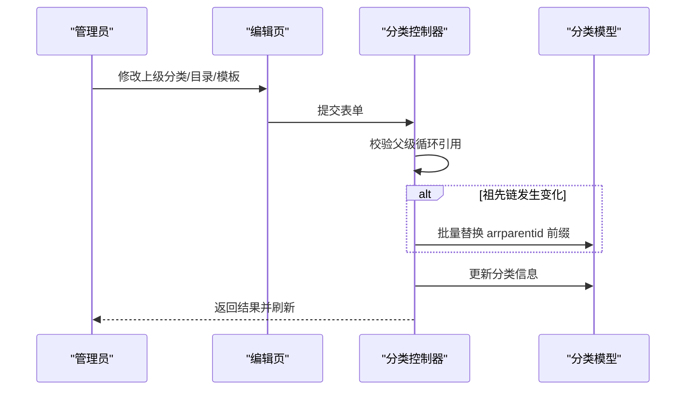
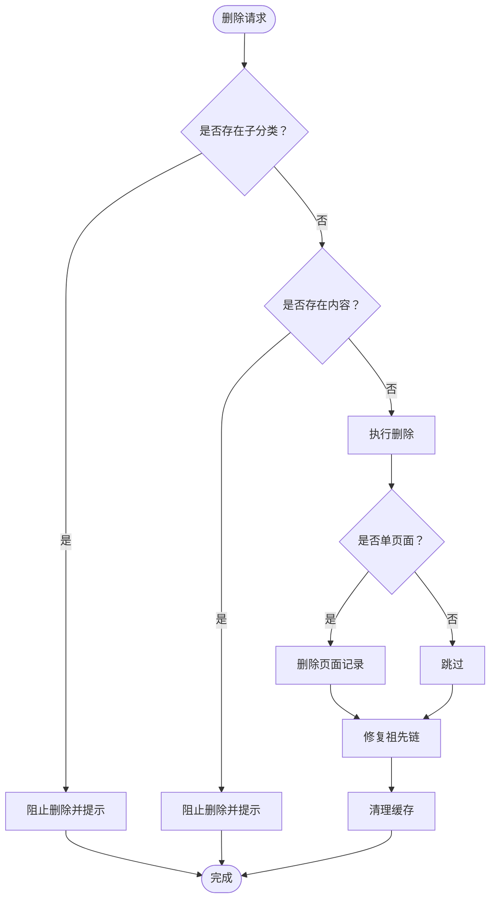
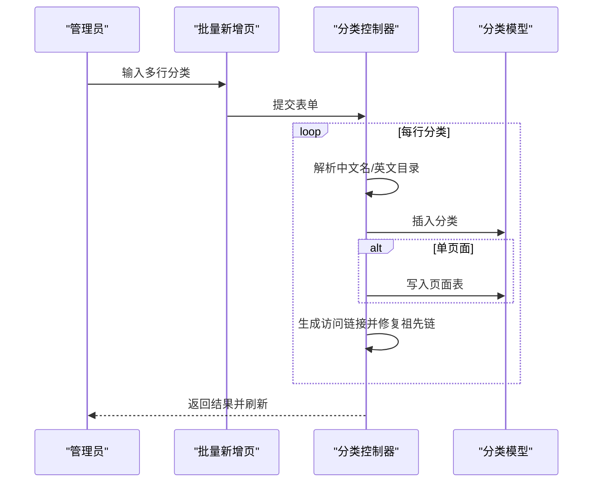
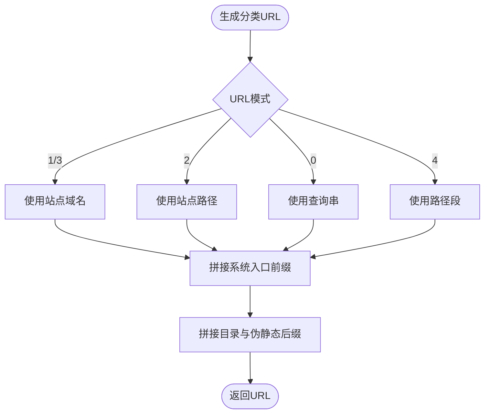
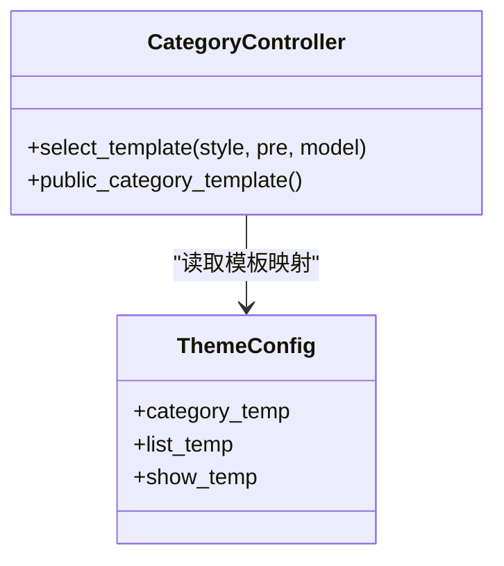
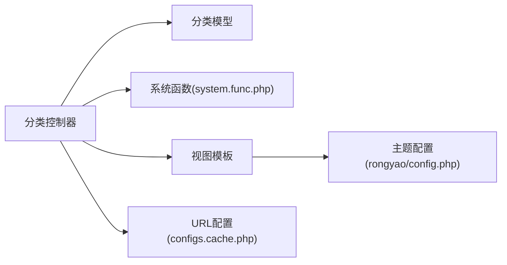

# 分类基本操作

<cite>
**本文引用的文件**
- [application/lry_admin_center/controller/category.class.php](file://application/lry_admin_center/controller/category.class.php)
- [application/lry_admin_center/view/category_list.html](file://application/lry_admin_center/view/category_list.html)
- [application/lry_admin_center/view/category_add.html](file://application/lry_admin_center/view/category_add.html)
- [application/lry_admin_center/view/category_edit.html](file://application/lry_admin_center/view/category_edit.html)
- [application/lry_admin_center/view/category_adds.html](file://application/lry_admin_center/view/category_adds.html)
- [application/index/view/rongyao/config.php](file://application/index/view/rongyao/config.php)
- [application/lry_admin_center/common/function/function.php](file://application/lry_admin_center/common/function/function.php)
- [common/function/system.func.php](file://common/function/system.func.php)
- [cache/cache_file/configs.cache.php](file://cache/cache_file/configs.cache.php)
</cite>

## 目录
1. [简介](#简介)
2. [项目结构](#项目结构)
3. [核心组件](#核心组件)
4. [架构概览](#架构概览)
5. [详细组件分析](#详细组件分析)
6. [依赖关系分析](#依赖关系分析)
7. [性能考量](#性能考量)
8. [故障排查指南](#故障排查指南)
9. [结论](#结论)
10. [附录](#附录)

## 简介
本技术文档围绕 LRYBlog 的分类基本操作功能，系统梳理了分类的创建、编辑、删除、批量添加、URL 生成规则以及模板选择机制。文档面向管理员与开发者，既提供操作指南，也给出代码级的实现细节与可视化图示，帮助快速理解与高效运维。

## 项目结构
分类功能主要由后台控制器、视图模板与系统函数组成：
- 控制器：负责接收请求、执行业务逻辑（创建/编辑/删除/批量添加）、调用模型与缓存清理。
- 视图：提供分类列表、新增、编辑、批量新增页面，以及模板选择与校验。
- 系统函数：提供 URL 生成、站点与模型信息获取、缓存读写等通用能力。
- 主题配置：定义频道页、列表页、内容页模板集合。

图表来源
- [application/lry_admin_center/controller/category.class.php:1-580](file://application/lry_admin_center/controller/category.class.php#L1-L580)
- [application/lry_admin_center/view/category_list.html:1-116](file://application/lry_admin_center/view/category_list.html#L1-L116)
- [application/lry_admin_center/view/category_add.html:1-329](file://application/lry_admin_center/view/category_add.html#L1-L329)
- [application/lry_admin_center/view/category_edit.html:1-308](file://application/lry_admin_center/view/category_edit.html#L1-L308)
- [application/lry_admin_center/view/category_adds.html:1-237](file://application/lry_admin_center/view/category_adds.html#L1-L237)
- [application/index/view/rongyao/config.php:1-29](file://application/index/view/rongyao/config.php#L1-L29)
- [application/lry_admin_center/common/function/function.php:1-162](file://application/lry_admin_center/common/function/function.php#L1-L162)
- [common/function/system.func.php:60-259](file://common/function/system.func.php#L60-L259)

章节来源
- [application/lry_admin_center/controller/category.class.php:1-580](file://application/lry_admin_center/controller/category.class.php#L1-L580)
- [application/lry_admin_center/view/category_list.html:1-116](file://application/lry_admin_center/view/category_list.html#L1-L116)

## 核心组件
- 分类控制器：提供分类列表、新增、编辑、删除、批量新增、排序、模板选择接口等。
- 分类视图：包含列表页、新增页（普通/单页面/外部链接）、编辑页、批量新增页。
- 模板选择：按模型动态加载频道页/列表页/内容页模板集合。
- URL 生成：依据站点配置与 URL 模式生成分类访问链接。
- 安全检查：删除前检查子分类与内容关联，避免误删。

章节来源
- [application/lry_admin_center/controller/category.class.php:15-580](file://application/lry_admin_center/controller/category.class.php#L15-L580)
- [application/lry_admin_center/view/category_list.html:1-116](file://application/lry_admin_center/view/category_list.html#L1-L116)
- [application/lry_admin_center/view/category_add.html:1-329](file://application/lry_admin_center/view/category_add.html#L1-L329)
- [application/lry_admin_center/view/category_edit.html:1-308](file://application/lry_admin_center/view/category_edit.html#L1-L308)
- [application/lry_admin_center/view/category_adds.html:1-237](file://application/lry_admin_center/view/category_adds.html#L1-L237)
- [application/index/view/rongyao/config.php:1-29](file://application/index/view/rongyao/config.php#L1-L29)

## 架构概览
分类操作采用 MVC 结构：控制器处理用户请求，调用模型与系统函数，渲染视图模板。模板通过 AJAX 动态拉取模板集合，支持按模型切换。

图表来源
- [application/lry_admin_center/view/category_list.html:1-116](file://application/lry_admin_center/view/category_list.html#L1-L116)
- [application/lry_admin_center/view/category_add.html:1-329](file://application/lry_admin_center/view/category_add.html#L1-L329)
- [application/lry_admin_center/view/category_edit.html:1-308](file://application/lry_admin_center/view/category_edit.html#L1-L308)
- [application/lry_admin_center/controller/category.class.php:144-428](file://application/lry_admin_center/controller/category.class.php#L144-L428)
- [application/lry_admin_center/controller/category.class.php:511-545](file://application/lry_admin_center/controller/category.class.php#L511-L545)

## 详细组件分析

### 创建流程（普通分类/单页面/外部链接）
- 普通分类与单页面：在本系统内生成真实访问链接，需校验目录唯一性；单页面还会同步写入页面表。
- 外部链接：不生成真实链接，仅保存外部地址。
- 父分类路径：根据父级 arrparentid 拼接形成完整祖先链；顶级分类祖先链为 0。
- URL 生成：依据站点域名与 URL 模式决定前缀与后缀；支持伪静态后缀配置。
- 模板选择：按所选模型动态加载频道页/列表页/内容页模板集合。

图表来源
- [application/lry_admin_center/controller/category.class.php:144-278](file://application/lry_admin_center/controller/category.class.php#L144-L278)
- [application/lry_admin_center/controller/category.class.php:548-555](file://application/lry_admin_center/controller/category.class.php#L548-L555)
- [application/lry_admin_center/view/category_add.html:1-329](file://application/lry_admin_center/view/category_add.html#L1-L329)

章节来源
- [application/lry_admin_center/controller/category.class.php:144-278](file://application/lry_admin_center/controller/category.class.php#L144-L278)
- [application/lry_admin_center/view/category_add.html:1-329](file://application/lry_admin_center/view/category_add.html#L1-L329)

### 编辑功能（信息修改/父分类变更/分类移动）
- 信息修改：支持模型、上级分类、名称、目录、模板、SEO、域名、排序、投稿权限等。
- 父分类变更：若新父级为旧父级祖先链的一部分，将拒绝移动；否则批量更新该分支下所有节点的祖先链。
- URL 重新生成：当启用域名或目录变更时，重新计算访问链接。
- 模板选择：按当前模型动态加载模板集合。

图表来源
- [application/lry_admin_center/controller/category.class.php:344-428](file://application/lry_admin_center/controller/category.class.php#L344-L428)
- [application/lry_admin_center/view/category_edit.html:1-308](file://application/lry_admin_center/view/category_edit.html#L1-L308)

章节来源
- [application/lry_admin_center/controller/category.class.php:344-428](file://application/lry_admin_center/controller/category.class.php#L344-L428)
- [application/lry_admin_center/view/category_edit.html:1-308](file://application/lry_admin_center/view/category_edit.html#L1-L308)

### 删除安全检查机制
- 子分类检查：若存在子分类，禁止删除。
- 内容关联检查：若分类下存在内容，禁止删除。
- 删除后处理：同步删除单页面记录（如适用）、修复祖先链、清理缓存。

图表来源
- [application/lry_admin_center/controller/category.class.php:435-453](file://application/lry_admin_center/controller/category.class.php#L435-L453)

章节来源
- [application/lry_admin_center/controller/category.class.php:435-453](file://application/lry_admin_center/controller/category.class.php#L435-L453)

### 批量分类添加
- 输入格式：每行一个分类，支持“中文名|英文目录”，未提供英文目录时自动生成拼音。
- 批量处理：逐条插入，单页面类型同步写入页面表，统一生成访问链接并修复祖先链。
- 模板选择：按所选模型加载模板集合。

图表来源
- [application/lry_admin_center/view/category_adds.html:1-237](file://application/lry_admin_center/view/category_adds.html#L1-L237)
- [application/lry_admin_center/controller/category.class.php:281-342](file://application/lry_admin_center/controller/category.class.php#L281-L342)

章节来源
- [application/lry_admin_center/view/category_adds.html:1-237](file://application/lry_admin_center/view/category_adds.html#L1-L237)
- [application/lry_admin_center/controller/category.class.php:281-342](file://application/lry_admin_center/controller/category.class.php#L281-L342)

### 分类URL生成规则
- 基于站点配置与 URL 模式：
  - URL 模式 1/3：使用站点域名 + 系统入口前缀（如 index.php?s=）+ 目录 + 后缀。
  - URL 模式 2：使用站点路径 + 系统入口前缀 + 目录 + 后缀。
  - URL 模式 0/4：使用 index.php + 查询串或路径段 + 后缀。
- 伪静态后缀：由系统配置提供，默认 .html。
- 域名绑定：若绑定域名，则直接使用域名作为前缀。

图表来源
- [application/lry_admin_center/controller/category.class.php:548-555](file://application/lry_admin_center/controller/category.class.php#L548-L555)
- [application/lry_admin_center/common/function/function.php:3-28](file://application/lry_admin_center/common/function/function.php#L3-L28)
- [common/function/system.func.php:60-74](file://common/function/system.func.php#L60-L74)
- [cache/cache_file/configs.cache.php:1-82](file://cache/cache_file/configs.cache.php#L1-L82)

章节来源
- [application/lry_admin_center/controller/category.class.php:548-555](file://application/lry_admin_center/controller/category.class.php#L548-L555)
- [application/lry_admin_center/common/function/function.php:3-28](file://application/lry_admin_center/common/function/function.php#L3-L28)
- [common/function/system.func.php:60-74](file://common/function/system.func.php#L60-L74)
- [cache/cache_file/configs.cache.php:1-82](file://cache/cache_file/configs.cache.php#L1-L82)

### 分类模板选择
- 模板来源：根据当前站点主题与模型别名，扫描对应命名规则的模板文件。
- 模板映射：主题配置文件提供模板显示名称与文件名映射。
- 动态加载：AJAX 请求控制器接口，返回模板集合，前端渲染下拉框。

图表来源
- [application/lry_admin_center/controller/category.class.php:509-545](file://application/lry_admin_center/controller/category.class.php#L509-L545)
- [application/index/view/rongyao/config.php:1-29](file://application/index/view/rongyao/config.php#L1-L29)

章节来源
- [application/lry_admin_center/controller/category.class.php:509-545](file://application/lry_admin_center/controller/category.class.php#L509-L545)
- [application/index/view/rongyao/config.php:1-29](file://application/index/view/rongyao/config.php#L1-L29)

## 依赖关系分析
- 控制器依赖：
  - 分类模型：执行 CRUD 与路径修复。
  - 系统函数：URL 生成、站点/模型信息获取、缓存管理。
  - 视图模板：渲染页面与模板选择。
- 视图依赖：
  - 主题配置：模板集合与显示名称。
  - 控制器接口：模板选择与提交处理。
- 配置依赖：
  - URL 模式与伪静态后缀影响 URL 生成。
  - 站点主题决定模板扫描路径。

图表来源
- [application/lry_admin_center/controller/category.class.php:1-580](file://application/lry_admin_center/controller/category.class.php#L1-L580)
- [common/function/system.func.php:60-259](file://common/function/system.func.php#L60-L259)
- [application/index/view/rongyao/config.php:1-29](file://application/index/view/rongyao/config.php#L1-L29)
- [cache/cache_file/configs.cache.php:1-82](file://cache/cache_file/configs.cache.php#L1-L82)

章节来源
- [application/lry_admin_center/controller/category.class.php:1-580](file://application/lry_admin_center/controller/category.class.php#L1-L580)
- [common/function/system.func.php:60-259](file://common/function/system.func.php#L60-L259)
- [application/index/view/rongyao/config.php:1-29](file://application/index/view/rongyao/config.php#L1-L29)
- [cache/cache_file/configs.cache.php:1-82](file://cache/cache_file/configs.cache.php#L1-L82)

## 性能考量
- 树形渲染：列表页通过树形类生成 HTML，建议控制层级深度与节点数量，避免一次性渲染过多节点导致卡顿。
- 缓存策略：新增/编辑/删除后清理分类相关缓存，确保模板与链接一致性。
- 批量操作：批量新增时逐条处理，注意数据库事务与异常回滚，避免部分成功。
- URL 生成：URL 组装逻辑简单，但需结合伪静态与域名配置，减少不必要的字符串拼接。

## 故障排查指南
- 新增失败（目录重复）：检查同站点下是否存在相同目录名，修改后重试。
- 编辑失败（父级循环引用）：将分类移动到其子级或自身会导致拒绝，调整父级为合法祖先链。
- 删除失败（存在子分类/内容）：先删除子分类或转移内容，再执行删除。
- 模板未显示：确认主题目录下存在符合命名规则的模板文件，且主题配置中存在映射项。
- URL 异常：核对 URL 模式与伪静态后缀配置，确保域名绑定正确。

章节来源
- [application/lry_admin_center/controller/category.class.php:150-234](file://application/lry_admin_center/controller/category.class.php#L150-L234)
- [application/lry_admin_center/controller/category.class.php:360-395](file://application/lry_admin_center/controller/category.class.php#L360-L395)
- [application/lry_admin_center/controller/category.class.php:435-453](file://application/lry_admin_center/controller/category.class.php#L435-L453)
- [application/lry_admin_center/view/category_add.html:272-304](file://application/lry_admin_center/view/category_add.html#L272-L304)
- [application/lry_admin_center/view/category_edit.html:251-283](file://application/lry_admin_center/view/category_edit.html#L251-L283)

## 结论
LRYBlog 的分类基本操作具备完善的创建、编辑、删除与批量添加能力，配合灵活的模板选择与可配置的 URL 生成规则，满足多站点、多模型场景下的内容组织需求。通过严格的父级路径修复与安全检查机制，保障了分类树的完整性与数据安全。建议在生产环境中合理设置 URL 模式与伪静态后缀，并定期清理缓存以确保最佳性能与一致性。

## 附录
- 管理员操作要点
  - 新增：优先选择模型与上级分类，填写目录与模板，单页面会自动创建页面记录。
  - 编辑：谨慎变更父级，避免循环引用；域名变更会重新生成访问链接。
  - 删除：务必先清理子分类与内容，避免误删。
  - 批量新增：使用“中文名|英文目录”格式，未提供英文目录时自动生成拼音。
- 开发者参考
  - 模板选择：通过控制器接口动态加载模板集合，前端渲染下拉框。
  - URL 生成：遵循 URL 模式与伪静态后缀配置，支持域名绑定。
  - 路径修复：移动分类或批量新增后，调用修复逻辑确保祖先链正确。