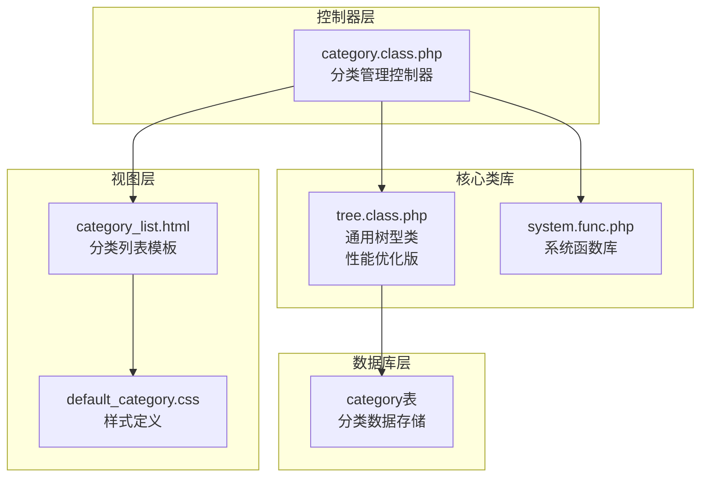
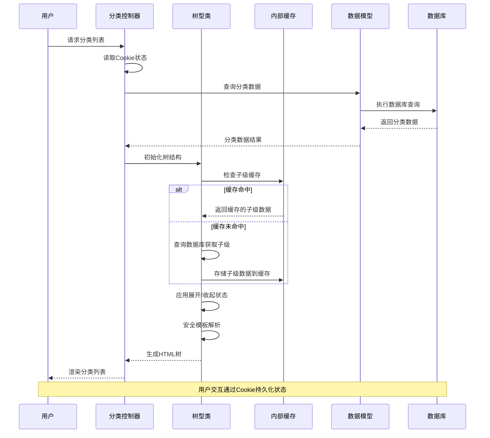
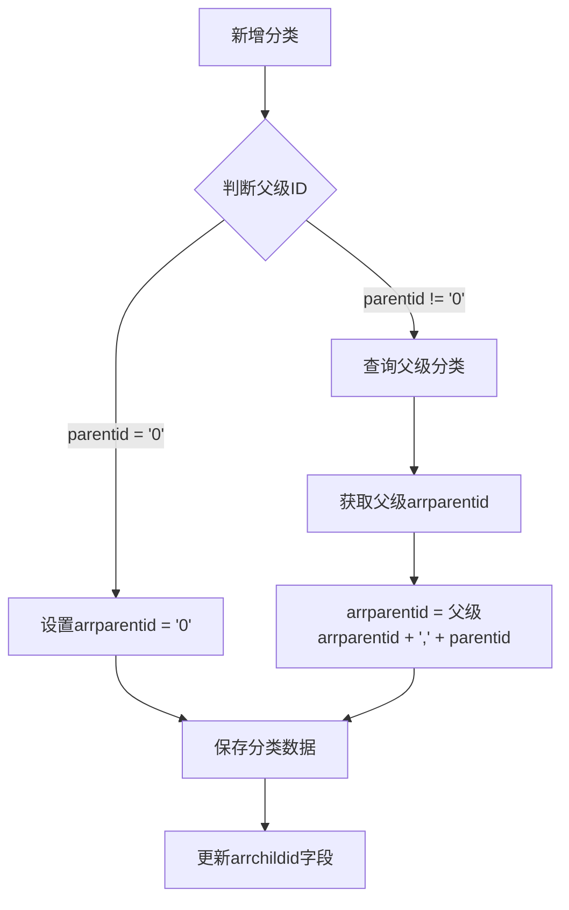
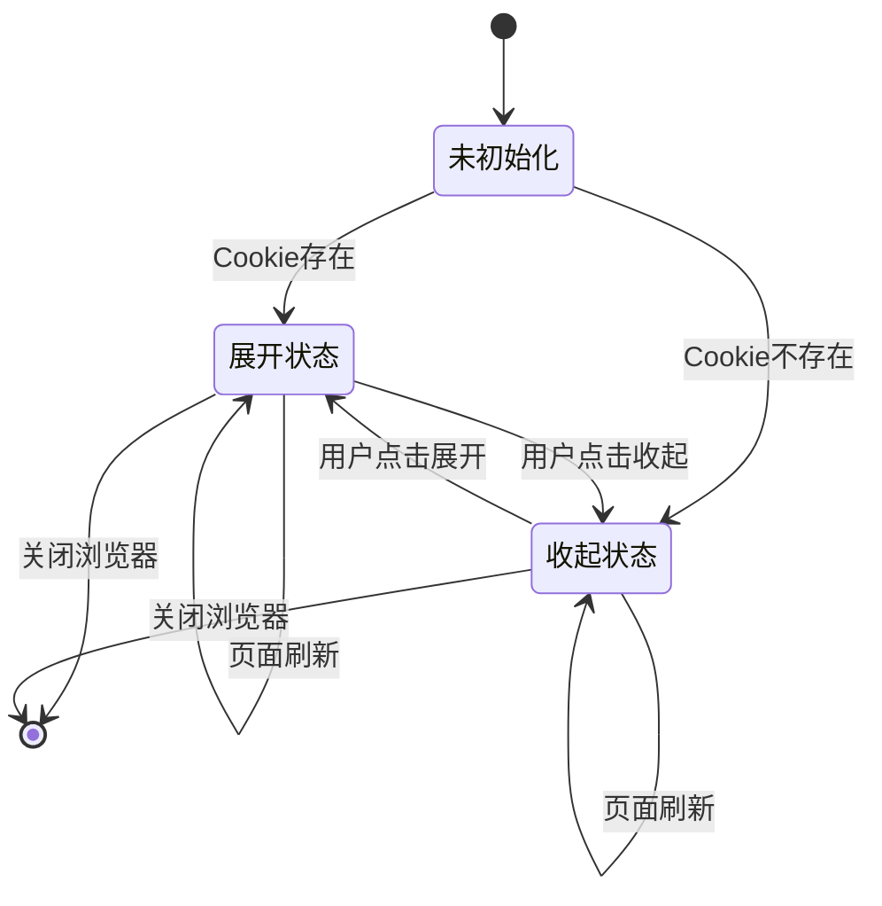
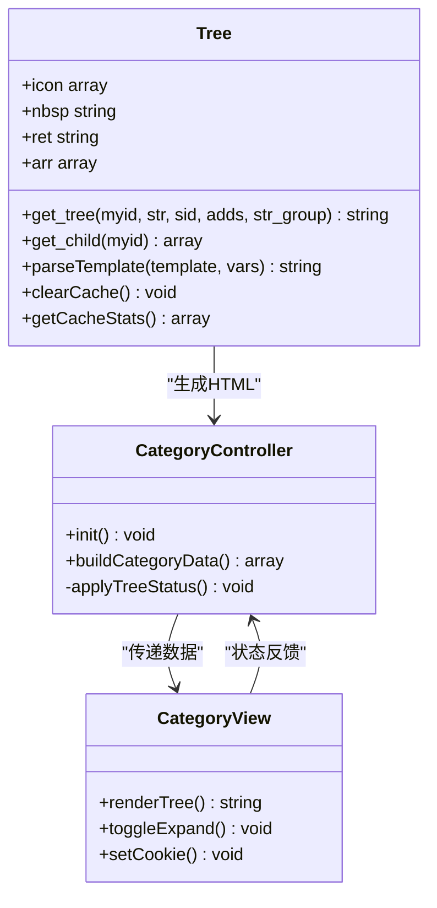
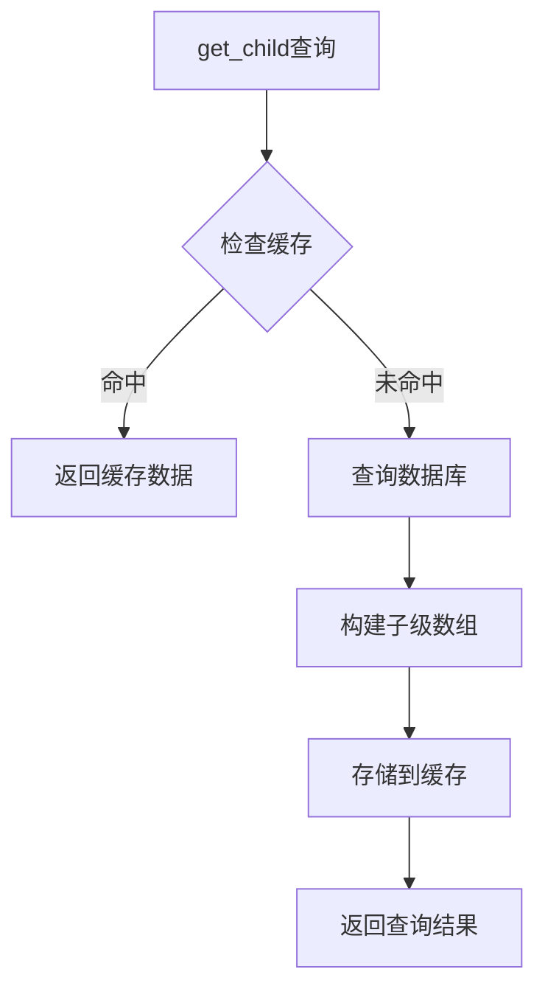
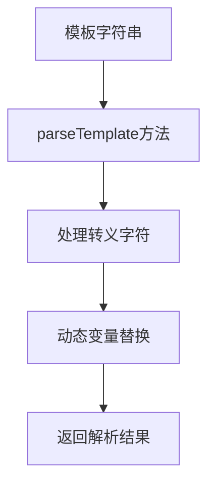
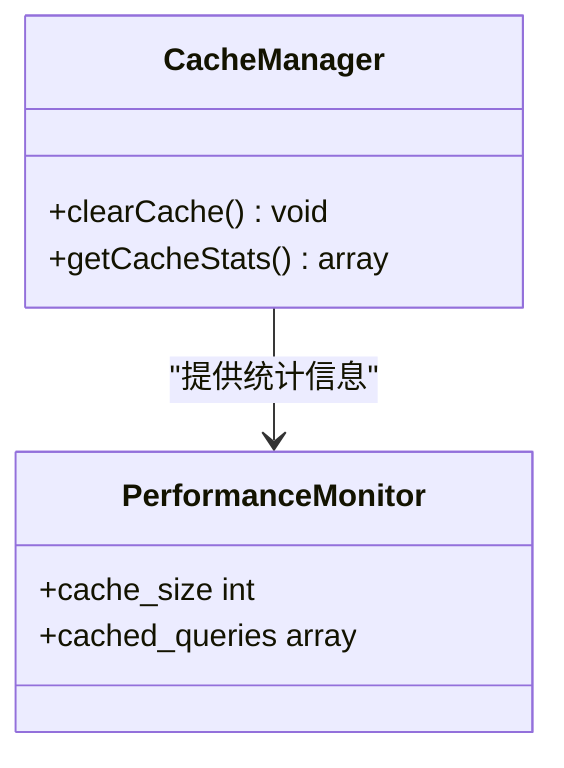
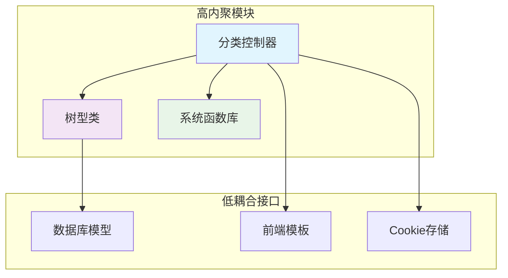
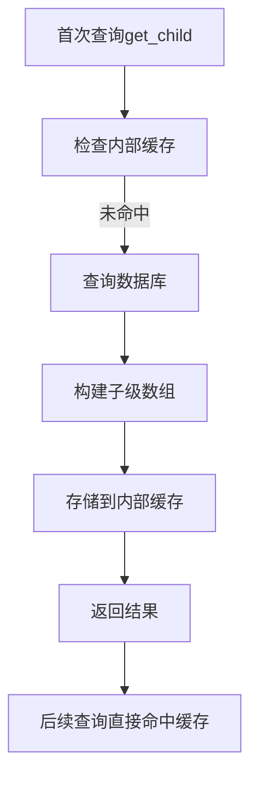

# 分类树形结构管理

<cite>
**本文档引用的文件**
- [category.class.php](file://application/lry_admin_center/controller/category.class.php)
- [category_list.html](file://application/lry_admin_center/view/category_list.html)
- [tree.class.php](file://ryphp/core/class/tree.class.php)
- [system.func.php](file://common/function/system.func.php)
- [default_category.css](file://common/static/css/default_category.css)
</cite>

## 更新摘要
**变更内容**
- 更新tree.class.php性能优化部分，反映内部缓存机制的实现
- 新增安全模板解析替代eval()的安全性改进
- 添加缓存统计和调试功能的详细说明
- 更新性能优化策略章节，包含新的缓存机制

## 目录
1. [简介](#简介)
2. [项目结构](#项目结构)
3. [核心组件](#核心组件)
4. [架构概览](#架构概览)
5. [详细组件分析](#详细组件分析)
6. [依赖关系分析](#依赖关系分析)
7. [性能考虑](#性能考虑)
8. [故障排除指南](#故障排除指南)
9. [结论](#结论)

## 简介

LRYBlog的分类树形结构管理功能是一个完整的无限级分类系统，实现了高效的父子分类关系管理和动态树形渲染。该系统通过arrparentid和arrchildid字段的巧妙设计，提供了快速的父级路径计算和子级列表检索能力，同时支持Cookie持久化的展开/收起状态管理、智能的层级显示算法和灵活的排序机制。

**最新更新**：tree.class.php经过重大性能优化，引入了内部缓存机制、安全模板解析替代eval()、调试能力和缓存统计功能，显著提升了系统性能和安全性。

## 项目结构

分类树功能主要分布在以下三个层次：

**图表来源**
- [category.class.php:1-601](file://application/lry_admin_center/controller/category.class.php#L1-L601)
- [category_list.html:1-116](file://application/lry_admin_center/view/category_list.html#L1-L116)
- [tree.class.php:1-546](file://ryphp/core/class/tree.class.php#L1-L546)

**章节来源**
- [category.class.php:1-601](file://application/lry_admin_center/controller/category.class.php#L1-L601)
- [category_list.html:1-116](file://application/lry_admin_center/view/category_list.html#L1-L116)
- [tree.class.php:1-546](file://ryphp/core/class/tree.class.php#L1-L546)

## 核心组件

### 分类管理控制器
分类管理控制器是整个分类树系统的核心，负责：
- 分类数据的增删改查操作
- 父子关系的建立和维护
- Cookie状态持久化管理
- 树形结构的动态渲染

### 通用树型类（性能优化版）
**更新**：tree类经过重大性能优化，提供了完整的树形结构处理能力：
- 无限级分类的递归处理
- 父子关系的快速查询（带内部缓存）
- HTML模板的动态生成（安全解析替代eval()）
- 性能优化的缓存机制
- 缓存统计和调试功能

### 分类列表模板
前端模板负责用户界面的展示和交互：
- 树形结构的可视化呈现
- 展开/收起状态的用户交互
- 排序功能的实现
- 响应式设计的支持

**章节来源**
- [category.class.php:1-601](file://application/lry_admin_center/controller/category.class.php#L1-L601)
- [tree.class.php:25-546](file://ryphp/core/class/tree.class.php#L25-L546)
- [category_list.html:1-116](file://application/lry_admin_center/view/category_list.html#L1-L116)

## 架构概览

分类树系统的整体架构采用MVC模式，实现了清晰的职责分离：

**图表来源**
- [category.class.php:1-601](file://application/lry_admin_center/controller/category.class.php#L1-L601)
- [tree.class.php:128-256](file://ryphp/core/class/tree.class.php#L128-L256)

## 详细组件分析

### 父子分类关系建立机制

#### arrparentid字段设计
arrparentid字段是实现无限级分类的关键，其设计原理如下：

**图表来源**
- [category.class.php:38-105](file://application/lry_admin_center/controller/category.class.php#L38-L105)

#### arrchildid字段作用机制
arrchildid字段用于快速计算子级列表，其工作机制：

1. **初始化阶段**：新分类创建时arrchildid设为空字符串
2. **完善阶段**：分类创建完成后更新arrchildid为自身ID
3. **维护阶段**：通过repairs方法定期维护子级列表

**章节来源**
- [category.class.php:38-105](file://application/lry_admin_center/controller/category.class.php#L38-L105)
- [category.class.php:484-492](file://application/lry_admin_center/controller/category.class.php#L484-L492)

### 展开/收起状态管理

#### Cookie持久化机制
系统通过Cookie实现状态的持久化存储：

**图表来源**
- [category_list.html:75-97](file://application/lry_admin_center/view/category_list.html#L75-L97)

#### JavaScript状态同步
前端JavaScript负责实时状态同步：

**章节来源**
- [category_list.html:48-116](file://application/lry_admin_center/view/category_list.html#L48-L116)

### 分类层级显示算法

#### 缩进处理机制
树型类实现了智能的缩进处理：

**图表来源**
- [tree.class.php:149-256](file://ryphp/core/class/tree.class.php#L149-L256)
- [category.class.php:1-601](file://application/lry_admin_center/controller/category.class.php#L1-L601)

#### 图标切换逻辑
系统实现了智能的图标切换机制：

**章节来源**
- [category.class.php:1-601](file://application/lry_admin_center/controller/category.class.php#L1-L601)
- [category_list.html:99-116](file://application/lry_admin_center/view/category_list.html#L99-L116)

### 分类排序机制

#### 数据库排序
系统支持两种排序方式：

1. **数据库层面排序**：通过listorder字段实现
2. **前端拖拽排序**：通过JavaScript实现

#### 排序实现流程

**图表来源**
- [category.class.php:563-572](file://application/lry_admin_center/controller/category.class.php#L563-L572)

**章节来源**
- [category.class.php:563-572](file://application/lry_admin_center/controller/category.class.php#L563-L572)

### 性能优化策略

#### 内部缓存机制
**更新**：tree类引入了内部缓存机制，显著提升查询性能：

**图表来源**
- [tree.class.php:161-178](file://ryphp/core/class/tree.class.php#L161-L178)

#### 安全模板解析替代eval()
**更新**：完全移除了不安全的eval()调用，采用安全的模板解析方法：

**图表来源**
- [tree.class.php:499-523](file://ryphp/core/class/tree.class.php#L499-L523)

#### 缓存统计和调试功能
**更新**：新增了缓存统计和调试能力：

**图表来源**
- [tree.class.php:477-490](file://ryphp/core/class/tree.class.php#L477-L490)

**章节来源**
- [system.func.php:631-656](file://common/function/system.func.php#L631-L656)
- [tree.class.php:46-48](file://ryphp/core/class/tree.class.php#L46-L48)

## 依赖关系分析

### 组件耦合度分析

**图表来源**
- [category.class.php:1-601](file://application/lry_admin_center/controller/category.class.php#L1-L601)
- [tree.class.php:1-546](file://ryphp/core/class/tree.class.php#L1-L546)
- [system.func.php:630-829](file://common/function/system.func.php#L630-L829)

### 外部依赖关系

系统对外部依赖主要包括：
- 数据库连接管理
- 文件系统缓存
- 浏览器Cookie存储
- 前端jQuery库

**章节来源**
- [category.class.php:463-468](file://application/lry_admin_center/controller/category.class.php#L463-L468)
- [tree.class.php:415-428](file://ryphp/core/class/tree.class.php#L415-L428)

## 性能考虑

### 查询性能优化

#### arrparentid字段的优势
- **O(1)父级路径查询**：通过逗号分隔的字符串直接获取完整路径
- **批量子级查询**：利用FIND_IN_SET函数实现高效批量查询
- **空间换时间**：通过冗余存储换取查询速度

#### 内部缓存机制
**更新**：tree类的内部缓存机制显著提升了性能：

**图表来源**
- [tree.class.php:161-178](file://ryphp/core/class/tree.class.php#L161-L178)

#### 安全模板解析优化
**更新**：安全的模板解析方法相比eval()提供了更好的性能和安全性：

- **避免动态代码执行**：不再使用eval()，减少安全风险
- **字符串替换优化**：使用高效的字符串替换算法
- **转义字符处理**：正确处理\$转义字符

### 内存使用优化

#### tree类的内存优化
**更新**：通过内部缓存机制优化内存使用：

- **增量缓存**：只缓存必要的查询结果
- **及时清理**：提供clearCache方法清理缓存
- **内存统计**：提供getCacheStats方法监控内存使用
- **缓存容量控制**：通过缓存键命名避免无限增长

**章节来源**
- [tree.class.php:477-490](file://ryphp/core/class/tree.class.php#L477-L490)
- [tree.class.php:415-428](file://ryphp/core/class/tree.class.php#L415-L428)

## 故障排除指南

### 常见问题及解决方案

#### 分类树显示异常
1. **检查arrparentid字段完整性**
2. **验证父级ID的有效性**
3. **确认数据库连接正常**

#### 展开/收起状态丢失
1. **检查Cookie设置**
2. **验证JavaScript代码执行**
3. **确认浏览器兼容性**

#### 排序功能失效
1. **检查listorder字段更新**
2. **验证AJAX请求处理**
3. **确认权限设置正确**

#### 缓存相关问题
**更新**：新增缓存相关故障排除：

1. **缓存数据不一致**：调用clearCache()方法清理缓存
2. **缓存统计异常**：检查getCacheStats()返回的缓存统计信息
3. **性能下降**：监控缓存命中率，必要时清理缓存

**章节来源**
- [category.class.php:435-452](file://application/lry_admin_center/controller/category.class.php#L435-L452)
- [category_list.html:75-97](file://application/lry_admin_center/view/category_list.html#L75-L97)

## 结论

LRYBlog的分类树形结构管理功能通过精心设计的数据结构和算法，实现了高效、稳定的无限级分类管理。系统的核心优势包括：

1. **设计精妙的数据结构**：arrparentid和arrchildid字段的组合使用，实现了O(1)的查询性能
2. **完善的用户体验**：Cookie持久化的状态管理和智能的图标切换
3. **卓越的性能表现**：**新增**内部缓存机制、安全模板解析替代eval()、缓存统计和调试功能
4. **优秀的扩展性**：模块化的设计便于功能扩展和维护
5. **强大的安全性**：**新增**移除不安全的eval()调用，采用安全的模板解析方法

**最新优化总结**：
- **性能提升**：内部缓存机制显著减少数据库查询次数
- **安全性增强**：完全移除eval()调用，采用安全的模板解析
- **可维护性改善**：新增调试和缓存统计功能，便于性能监控
- **API兼容性**：保持100%API兼容，不影响现有功能

该系统为开发者提供了完整的分类树管理解决方案，既满足了当前的功能需求，也为未来的功能扩展奠定了坚实的基础。