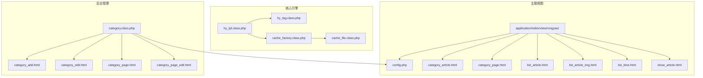
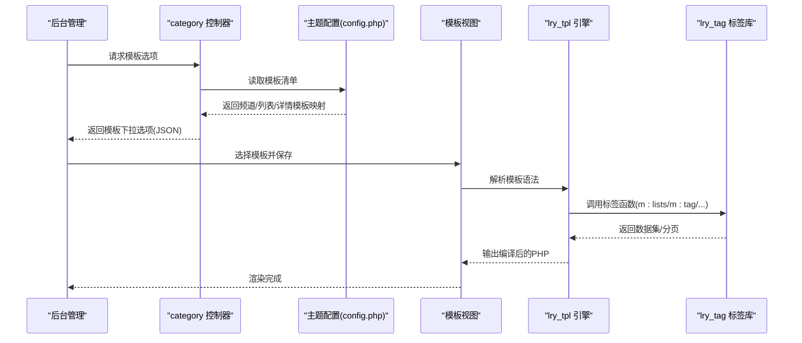
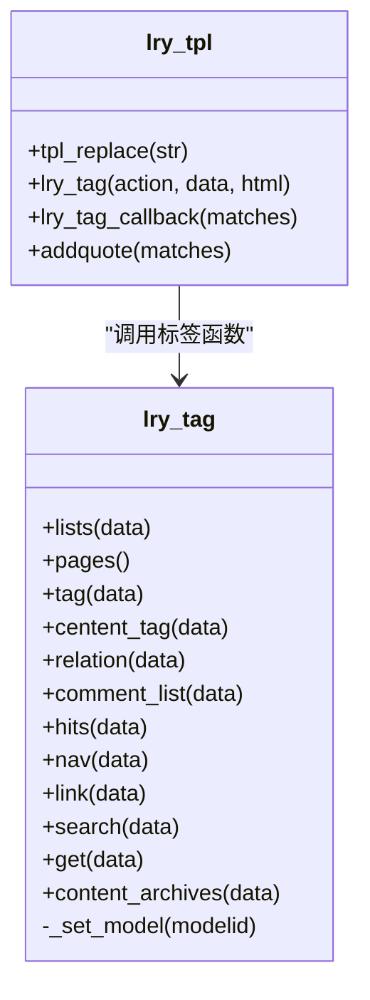
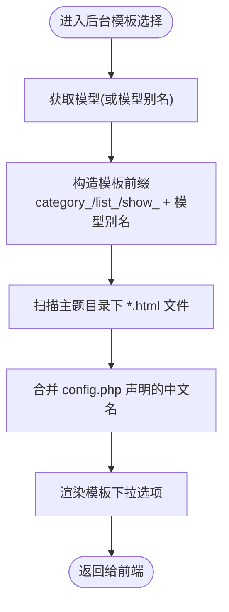
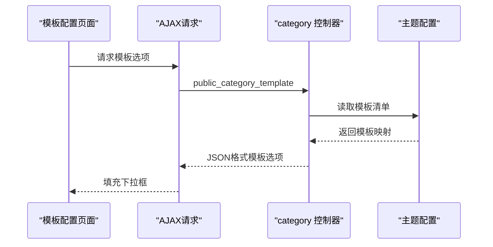
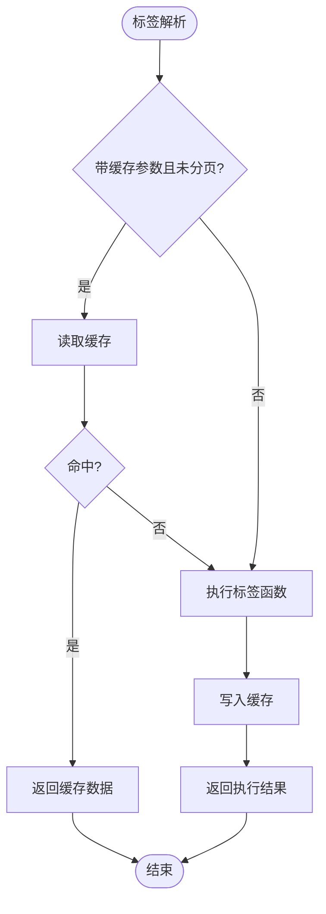
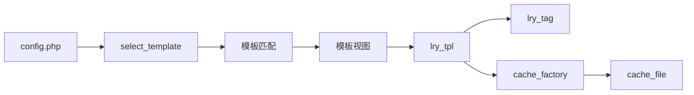

# 分类模板配置

<cite>
**本文引用的文件**
- [config.php](file://application/index/view/rongyao/config.php)
- [category_article.html](file://application/index/view/rongyao/category_article.html)
- [category_page.html](file://application/index/view/rongyao/category_page.html)
- [list_article.html](file://application/index/view/rongyao/list_article.html)
- [list_article_img.html](file://application/index/view/rongyao/list_article_img.html)
- [list_time.html](file://application/index/view/rongyao/list_time.html)
- [show_article.html](file://application/index/view/rongyao/show_article.html)
- [lry_tpl.class.php](file://ryphp/core/class/lry_tpl.class.php)
- [lry_tag.class.php](file://ryphp/core/class/lry_tag.class.php)
- [category.class.php](file://application/lry_admin_center/controller/category.class.php)
- [category_add.html](file://application/lry_admin_center/view/category_add.html)
- [category_edit.html](file://application/lry_admin_center/view/category_edit.html)
- [category_page.html](file://application/lry_admin_center/view/category_page.html)
- [category_page_edit.html](file://application/lry_admin_center/view/category_page_edit.html)
- [system.func.php](file://common/function/system.func.php)
- [cache_factory.class.php](file://ryphp/core/class/cache_factory.class.php)
- [cache_file.class.php](file://ryphp/core/class/cache_file.class.php)
</cite>

## 目录
1. [引言](#引言)
2. [项目结构](#项目结构)
3. [核心组件](#核心组件)
4. [架构总览](#架构总览)
5. [详细组件分析](#详细组件分析)
6. [依赖关系分析](#依赖关系分析)
7. [性能考量](#性能考量)
8. [故障排查指南](#故障排查指南)
9. [结论](#结论)
10. [附录](#附录)

## 引言
本技术文档围绕 LRYBlog 的“分类模板配置”能力，系统阐述频道页模板、列表页模板与详情页模板的分离设计与实现机制；详解模板文件的命名规范与查找规则（按模型类型自动匹配模板文件）；说明模板配置选项（自定义模板选择、模板继承与覆盖）；介绍模板变量系统（分类信息、SEO 设置、自定义字段渲染）；解释模板缓存机制与性能优化策略；并提供模板开发指南与定制扩展方案。

## 项目结构
LRYBlog 的模板体系位于应用层的视图目录中，主题以“rongyao”为例，包含三类模板集合：频道页模板、列表页模板、详情页模板。模板引擎由核心类 lry_tpl 提供，标签系统由 lry_tag 提供，后台管理通过 category 控制器提供模板选择与配置接口。

**图表来源**
- [config.php:1-29](file://application/index/view/rongyao/config.php#L1-L29)
- [category_article.html:1-53](file://application/index/view/rongyao/category_article.html#L1-L53)
- [category_page.html:1-59](file://application/index/view/rongyao/category_page.html#L1-L59)
- [list_article.html:1-150](file://application/index/view/rongyao/list_article.html#L1-L150)
- [list_article_img.html:1-55](file://application/index/view/rongyao/list_article_img.html#L1-L55)
- [list_time.html:1-50](file://application/index/view/rongyao/list_time.html#L1-L50)
- [show_article.html:1-518](file://application/index/view/rongyao/show_article.html#L1-L518)
- [lry_tpl.class.php:1-134](file://ryphp/core/class/lry_tpl.class.php#L1-L134)
- [lry_tag.class.php:1-492](file://ryphp/core/class/lry_tag.class.php#L1-L492)
- [category.class.php:1-580](file://application/lry_admin_center/controller/category.class.php#L1-L580)
- [category_add.html:229-265](file://application/lry_admin_center/view/category_add.html#L229-L265)
- [category_edit.html:114-142](file://application/lry_admin_center/view/category_edit.html#L114-L142)
- [category_page.html:69-100](file://application/lry_admin_center/view/category_page.html#L69-L100)
- [category_page_edit.html:69-97](file://application/lry_admin_center/view/category_page_edit.html#L69-L97)
- [cache_factory.class.php:1-84](file://ryphp/core/class/cache_factory.class.php#L1-L84)
- [cache_file.class.php:61-130](file://ryphp/core/class/cache_file.class.php#L61-L130)

**章节来源**
- [config.php:1-29](file://application/index/view/rongyao/config.php#L1-L29)
- [category.class.php:499-545](file://application/lry_admin_center/controller/category.class.php#L499-L545)

## 核心组件
- 模板引擎与标签系统
  - lry_tpl：负责模板标签解析（如 m:include、m:lists、m:tag 等），将模板语法转换为 PHP 代码，并支持缓存标签的缓存生成。
  - lry_tag：提供内容列表、分页、标签、评论、归档等标签函数，支撑模板中的动态数据渲染。
- 主题配置与模板发现
  - 主题 config.php：声明当前主题可用的频道页、列表页、详情页模板清单，键名为模板文件名（不含扩展名），值为模板中文名称。
  - 后台控制器 select_template：按模型类型自动匹配模板文件（如 article 对应 list_article.html、show_article.html 等），并结合 config.php 的声明进行展示。
- 后台模板配置界面
  - category_add.html、category_edit.html、category_page.html、category_page_edit.html：提供模板选择下拉框，动态填充频道页/列表页/详情页模板选项。
- SEO 与 URL 工具
  - system.func.php：提供站点 SEO、内容 URL 等工具函数，确保模板中输出的 SEO 与链接正确。

**章节来源**
- [lry_tpl.class.php:31-92](file://ryphp/core/class/lry_tpl.class.php#L31-L92)
- [lry_tag.class.php:18-65](file://ryphp/core/class/lry_tag.class.php#L18-L65)
- [config.php:8-26](file://application/index/view/rongyao/config.php#L8-L26)
- [category.class.php:511-545](file://application/lry_admin_center/controller/category.class.php#L511-L545)
- [category_add.html:229-265](file://application/lry_admin_center/view/category_add.html#L229-L265)
- [category_edit.html:114-142](file://application/lry_admin_center/view/category_edit.html#L114-L142)
- [system.func.php:46-74](file://common/function/system.func.php#L46-L74)

## 架构总览
模板系统遵循“主题配置 + 自动匹配 + 标签渲染 + 缓存”的架构模式。用户在后台为分类选择模板，系统根据模型类型与模板前缀自动匹配具体模板文件；模板中通过 m:xxx 标签调用 lry_tag 的标签函数，实现数据查询与分页；lry_tpl 将模板语法编译为 PHP 并执行，最终输出 HTML。

**图表来源**
- [category.class.php:499-545](file://application/lry_admin_center/controller/category.class.php#L499-L545)
- [config.php:8-26](file://application/index/view/rongyao/config.php#L8-L26)
- [lry_tpl.class.php:62-92](file://ryphp/core/class/lry_tpl.class.php#L62-L92)
- [lry_tag.class.php:18-65](file://ryphp/core/class/lry_tag.class.php#L18-L65)

## 详细组件分析

### 组件A：模板引擎与标签系统
- 模板语法解析
  - include、php、if/else/elseif、for、loop、变量输出、对象属性访问等语法均被 lry_tpl 转换为 PHP 代码。
  - m:xxx 标签通过回调统一交由 lry_tag::lry_tag 处理，支持 cache、page、return 等参数。
- 标签函数能力
  - lists：支持按模型/栏目/条件查询，支持分页与排序。
  - pages：生成分页 HTML。
  - tag/centent_tag/relation：标签云、内容关联、相关推荐。
  - comment_list：评论列表与分页。
  - hits/nav/link/search/get 等：丰富的内容与导航标签。
- 缓存机制
  - lry_tpl::lry_tag_callback 支持为标签生成缓存键，若带 cache 参数且未启用分页，则在标签执行前后进行缓存读写。

**图表来源**
- [lry_tpl.class.php:31-92](file://ryphp/core/class/lry_tpl.class.php#L31-L92)
- [lry_tag.class.php:18-65](file://ryphp/core/class/lry_tag.class.php#L18-L65)

**章节来源**
- [lry_tpl.class.php:31-92](file://ryphp/core/class/lry_tpl.class.php#L31-L92)
- [lry_tag.class.php:18-65](file://ryphp/core/class/lry_tag.class.php#L18-L65)

### 组件B：主题配置与模板发现
- 主题配置
  - config.php 中分别声明 category_temp、list_temp、show_temp 三类模板映射，键为模板文件名（不含扩展名），值为中文说明。
- 模板发现与匹配
  - select_template：根据站点主题与模型（或模型别名）构造模板前缀（如 category_article、list_article、show_article），扫描主题目录下匹配的 *.html 文件，结合 config.php 的映射生成下拉选项。
- 模板命名规范
  - 频道页：category_{模型别名}.html 或 category_{模型别名}_*.html
  - 列表页：list_{模型别名}.html 或 list_{模型别名}_*.html
  - 详情页：show_{模型别名}.html 或 show_{模型别名}_*.html

**图表来源**
- [category.class.php:511-545](file://application/lry_admin_center/controller/category.class.php#L511-L545)
- [config.php:8-26](file://application/index/view/rongyao/config.php#L8-L26)

**章节来源**
- [config.php:8-26](file://application/index/view/rongyao/config.php#L8-L26)
- [category.class.php:511-545](file://application/lry_admin_center/controller/category.class.php#L511-L545)

### 组件C：后台模板配置界面
- 模板选择下拉
  - category_add.html、category_edit.html、category_page.html、category_page_edit.html 中的 JS 动态填充频道页/列表页/详情页模板选项，支持“不使用模板”的空选项。
- SEO 与元信息
  - 单页面与普通分类均提供 SEO 标题、关键词、描述等输入项，便于模板中渲染。

**图表来源**
- [category_add.html:229-265](file://application/lry_admin_center/view/category_add.html#L229-L265)
- [category_edit.html:114-142](file://application/lry_admin_center/view/category_edit.html#L114-L142)
- [category.class.php:499-509](file://application/lry_admin_center/controller/category.class.php#L499-L509)

**章节来源**
- [category_add.html:229-265](file://application/lry_admin_center/view/category_add.html#L229-L265)
- [category_edit.html:114-142](file://application/lry_admin_center/view/category_edit.html#L114-L142)
- [category_page.html:69-100](file://application/lry_admin_center/view/category_page.html#L69-L100)
- [category_page_edit.html:69-97](file://application/lry_admin_center/view/category_page_edit.html#L69-L97)
- [category.class.php:499-509](file://application/lry_admin_center/controller/category.class.php#L499-L509)

### 组件D：模板变量系统与渲染
- 分类信息
  - 模板中可通过函数获取分类标题、副标题、封面图、链接等信息，用于频道页与列表页头部展示。
- SEO 设置
  - 模板中使用 seo_title、keywords、description 等变量，结合 system.func.php 的 SEO 工具函数生成站点/页面级 SEO。
- 自定义字段
  - 模板中可直接输出模型字段（如 title、url、thumb、description、inputtime、nickname、click 等），由 lry_tag 的 lists 等标签提供数据源。

**章节来源**
- [category_article.html:5-7](file://application/index/view/rongyao/category_article.html#L5-L7)
- [category_page.html:5-7](file://application/index/view/rongyao/category_page.html#L5-L7)
- [list_article.html:5-7](file://application/index/view/rongyao/list_article.html#L5-L7)
- [show_article.html:5-7](file://application/index/view/rongyao/show_article.html#L5-L7)
- [system.func.php:46-74](file://common/function/system.func.php#L46-L74)

### 组件E：模板缓存机制与性能优化
- 标签级缓存
  - lry_tpl::lry_tag_callback 支持为标签生成缓存键，当标签带有 cache 参数且未启用分页时，先尝试读取缓存，命中则直接返回，未命中则执行标签逻辑并将结果写入缓存。
- 缓存工厂与文件缓存
  - cache_factory：根据配置选择缓存实现（file/redis/memcache），默认 file。
  - cache_file：提供缓存文件的读写、清理、存在性检测等基础能力。
- 性能建议
  - 对高频标签（如热门推荐、标签云）合理设置 cache 参数。
  - 列表页分页使用 page 参数，避免一次性加载大量数据。
  - 图片懒加载与关键资源预加载策略已在模板中体现。

**图表来源**
- [lry_tpl.class.php:76-91](file://ryphp/core/class/lry_tpl.class.php#L76-L91)
- [cache_factory.class.php:36-82](file://ryphp/core/class/cache_factory.class.php#L36-L82)
- [cache_file.class.php:61-130](file://ryphp/core/class/cache_file.class.php#L61-L130)

**章节来源**
- [lry_tpl.class.php:76-91](file://ryphp/core/class/lry_tpl.class.php#L76-L91)
- [cache_factory.class.php:36-82](file://ryphp/core/class/cache_factory.class.php#L36-L82)
- [cache_file.class.php:61-130](file://ryphp/core/class/cache_file.class.php#L61-L130)

### 组件F：模板开发指南
- 模板语法要点
  - 变量输出：使用模板变量（如 $title、$keywords）。
  - 条件与循环：if/else/elseif、loop 循环。
  - 标签调用：m:lists、m:tag、m:relation、m:comment_list、m:hits 等。
  - include：m:include 引入公共模块。
- 模板命名与组织
  - 遵循“category_、list_、show_ + 模型别名”的命名规范，便于自动匹配。
  - 将通用头部/底部拆分为独立模块，通过 include 组合。
- SEO 与链接
  - 使用 SEO 变量与 system.func.php 提供的 URL 工具函数，确保页面 SEO 与链接正确。
- 性能优化实践
  - 对热点标签设置 cache。
  - 列表页使用分页，控制每页数量。
  - 合理使用图片懒加载与关键资源预加载。

**章节来源**
- [category_article.html:24-46](file://application/index/view/rongyao/category_article.html#L24-L46)
- [list_article.html:54-70](file://application/index/view/rongyao/list_article.html#L54-L70)
- [show_article.html:202-209](file://application/index/view/rongyao/show_article.html#L202-L209)
- [system.func.php:46-74](file://common/function/system.func.php#L46-L74)

## 依赖关系分析
- 主题配置依赖
  - 主题 config.php 为模板发现提供“模板名 -> 中文说明”的映射。
- 控制器依赖
  - category 控制器依赖 select_template 实现模板自动匹配与下拉选项生成。
- 引擎与标签依赖
  - lry_tpl 依赖 lry_tag 执行标签函数；标签函数依赖模型数据与分页类。
- 缓存依赖
  - lry_tpl 的标签缓存依赖 cache_factory 与 cache_file。

**图表来源**
- [config.php:8-26](file://application/index/view/rongyao/config.php#L8-L26)
- [category.class.php:511-545](file://application/lry_admin_center/controller/category.class.php#L511-L545)
- [lry_tpl.class.php:62-92](file://ryphp/core/class/lry_tpl.class.php#L62-L92)
- [lry_tag.class.php:18-65](file://ryphp/core/class/lry_tag.class.php#L18-L65)
- [cache_factory.class.php:36-82](file://ryphp/core/class/cache_factory.class.php#L36-L82)
- [cache_file.class.php:61-130](file://ryphp/core/class/cache_file.class.php#L61-L130)

**章节来源**
- [category.class.php:511-545](file://application/lry_admin_center/controller/category.class.php#L511-L545)
- [lry_tpl.class.php:62-92](file://ryphp/core/class/lry_tpl.class.php#L62-L92)
- [lry_tag.class.php:18-65](file://ryphp/core/class/lry_tag.class.php#L18-L65)

## 性能考量
- 标签缓存
  - 对高频标签设置 cache 参数，减少数据库压力。
- 分页与限制
  - 列表页使用 page 参数与 limit 控制数据规模。
- 资源加载
  - 模板中采用关键资源预加载与非关键资源延迟加载策略，提升首屏性能。
- 缓存清理
  - 后台维护中提供缓存清理入口，确保模板变更生效。

[本节为通用性能指导，无需特定文件引用]

## 故障排查指南
- 模板未生效
  - 检查主题 config.php 是否声明对应模板；确认模板文件命名符合“category_/list_/show_ + 模型别名”的规范。
- 模板选项为空
  - 检查 select_template 的模板扫描逻辑与主题目录权限；确认站点主题配置正确。
- 标签无数据
  - 检查标签参数（如 modelid、catid、limit、page）是否正确；确认模型数据存在。
- 缓存异常
  - 检查 cache_type 配置与缓存目录权限；必要时执行缓存清理。

**章节来源**
- [category.class.php:511-545](file://application/lry_admin_center/controller/category.class.php#L511-L545)
- [lry_tpl.class.php:76-91](file://ryphp/core/class/lry_tpl.class.php#L76-L91)
- [cache_factory.class.php:36-82](file://ryphp/core/class/cache_factory.class.php#L36-L82)
- [cache_file.class.php:61-130](file://ryphp/core/class/cache_file.class.php#L61-L130)

## 结论
LRYBlog 的分类模板系统通过“主题配置 + 自动匹配 + 标签渲染 + 缓存”的设计，实现了频道页、列表页与详情页的清晰分离与灵活定制。后台提供直观的模板选择界面，结合强大的标签系统与缓存机制，既满足模板开发的灵活性，又保障运行性能。开发者可依据命名规范与模板语法快速扩展与优化模板。

## 附录
- 模板文件清单（按主题）
  - 频道页模板：category_article.html、category_page.html
  - 列表页模板：list_article.html、list_article_img.html、list_time.html
  - 详情页模板：show_article.html
- 关键函数参考
  - get_site_seo、get_content_url 等 SEO/URL 工具函数，便于在模板中统一生成 SEO 与链接。

**章节来源**
- [config.php:8-26](file://application/index/view/rongyao/config.php#L8-L26)
- [system.func.php:46-74](file://common/function/system.func.php#L46-L74)