# 分类管理

<cite>
**本文引用的文件**
- [category.class.php](file://application/lry_admin_center/controller/category.class.php)
- [category1.class.php](file://application/lry_admin_center/controller/category1.class.php)
- [category_list.html](file://application/lry_admin_center/view/category_list.html)
- [category_add.html](file://application/lry_admin_center/view/category_add.html)
- [category_adds.html](file://application/lry_admin_center/view/category_adds.html)
- [category_edit.html](file://application/lry_admin_center/view/category_edit.html)
- [category_link.html](file://application/lry_admin_center/view/category_link.html)
- [category_link_edit.html](file://application/lry_admin_center/view/category_link_edit.html)
- [category_page.html](file://application/lry_admin_center/view/category_page.html)
- [category_page_edit.html](file://application/lry_admin_center/view/category_page_edit.html)
- [tree.class.php](file://ryphp/core/class/tree.class.php)
</cite>

## 更新摘要
**变更内容**
- 增强了分类树状态管理功能，新增基于Cookie的分类展开/收起状态持久化机制
- 改进了分类树的可视化反馈和用户交互体验
- 优化了分类树的性能表现和用户体验

## 目录
1. [简介](#简介)
2. [项目结构](#项目结构)
3. [核心组件](#核心组件)
4. [架构总览](#架构总览)
5. [详细组件分析](#详细组件分析)
6. [依赖分析](#依赖分析)
7. [性能考虑](#性能考虑)
8. [故障排查指南](#故障排查指南)
9. [结论](#结论)
10. [附录](#附录)

## 简介
本技术文档围绕 LRYBlog 的分类管理功能，系统梳理分类的创建、编辑、删除、层级管理、与文章的关联、排序、页面自定义、批量操作、链接管理、缓存与性能优化，以及面向管理员的操作指南与最佳实践。文档以控制器、视图模板与通用树形类为核心，结合前端交互与后端数据流，帮助读者快速掌握分类体系的设计与运维。

**更新** 本次更新重点介绍了增强的分类树状态管理功能，包括基于Cookie的状态持久化机制，显著提升了用户的交互体验和操作效率。

## 项目结构
分类管理涉及后台控制器、视图模板与通用树形类，形成"控制器-模板-树形类"的协作结构：
- 控制器层：负责业务流程、参数校验、数据持久化与缓存清理
- 视图层：提供分类列表、添加/编辑、批量添加、链接与单页等页面
- 树形类：提供通用树形结构渲染能力，支持分类树的层级展示与展开/收起

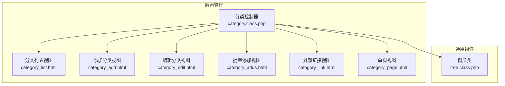

**图表来源**
- [category.class.php:1-606](file://application/lry_admin_center/controller/category.class.php#L1-L606)
- [category_list.html:1-116](file://application/lry_admin_center/view/category_list.html#L1-L116)
- [category_add.html:1-329](file://application/lry_admin_center/view/category_add.html#L1-L329)
- [category_edit.html:1-308](file://application/lry_admin_center/view/category_edit.html#L1-L308)
- [category_adds.html:1-237](file://application/lry_admin_center/view/category_adds.html#L1-L237)
- [category_link.html:1-125](file://application/lry_admin_center/view/category_link.html#L1-L125)
- [category_page.html:1-211](file://application/lry_admin_center/view/category_page.html#L1-L211)
- [tree.class.php:1-484](file://ryphp/core/class/tree.class.php#L1-L484)

**章节来源**
- [category.class.php:1-606](file://application/lry_admin_center/controller/category.class.php#L1-L606)
- [category_list.html:1-116](file://application/lry_admin_center/view/category_list.html#L1-L116)
- [tree.class.php:1-484](file://ryphp/core/class/tree.class.php#L1-L484)

## 核心组件
- 分类控制器：提供分类列表、添加、批量添加、编辑、删除、排序、模板选择等完整功能入口
- 树形类：提供通用树形结构渲染、缓存优化、模板安全解析等能力
- 视图模板：提供分类列表、添加/编辑、批量添加、外部链接、单页等页面，配合前端交互实现展开/收起、排序、模板选择等功能

**章节来源**
- [category.class.php:1-606](file://application/lry_admin_center/controller/category.class.php#L1-L606)
- [tree.class.php:1-484](file://ryphp/core/class/tree.class.php#L1-L484)

## 架构总览
分类管理采用 MVC 架构：
- 控制器接收请求，组装数据，调用模型与树形类
- 视图模板渲染页面，前端 JS 与 Cookie 协作实现树形展开/收起与排序
- 树形类负责将扁平数组转换为树形结构，支持多级层级渲染

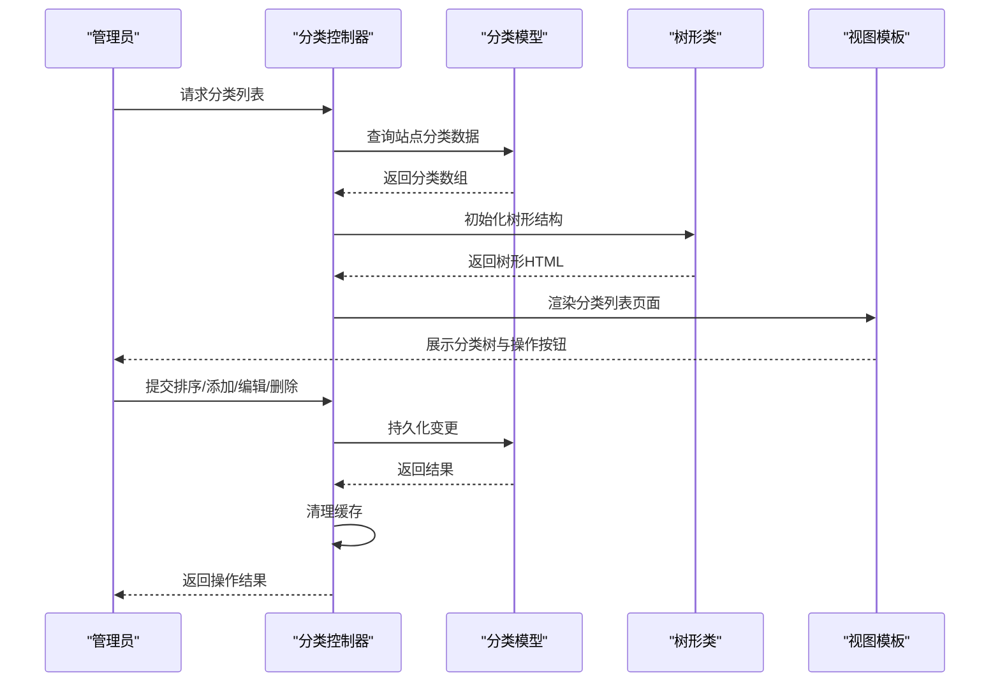

**图表来源**
- [category.class.php:27-160](file://application/lry_admin_center/controller/category.class.php#L27-L160)
- [category.class.php:170-304](file://application/lry_admin_center/controller/category.class.php#L170-L304)
- [category.class.php:370-454](file://application/lry_admin_center/controller/category.class.php#L370-L454)
- [category.class.php:461-479](file://application/lry_admin_center/controller/category.class.php#L461-L479)
- [category.class.php:589-598](file://application/lry_admin_center/controller/category.class.php#L589-L598)
- [tree.class.php:61-194](file://ryphp/core/class/tree.class.php#L61-L194)

## 详细组件分析

### 分类列表与树形展示
- 列表初始化：读取站点分类，按排序与ID升序排列；为每个分类构造链接、图标、操作按钮、状态开关等字段
- 树形渲染：使用树形类生成树形HTML，支持展开/收起状态记忆（通过 Cookie）
- 展开/收起：前端通过点击图标切换子节点显示，并将状态写入 Cookie；页面顶部提供一键展开/收起按钮

**更新** 新增了基于Cookie的状态持久化机制，用户可以在不同页面间保持分类树的展开/收起状态。

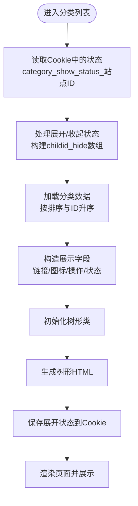

**图表来源**
- [category.class.php:34-89](file://application/lry_admin_center/controller/category.class.php#L34-L89)
- [category_list.html:75-113](file://application/lry_admin_center/view/category_list.html#L75-L113)
- [tree.class.php:61-194](file://ryphp/core/class/tree.class.php#L61-L194)

**章节来源**
- [category.class.php:27-160](file://application/lry_admin_center/controller/category.class.php#L27-L160)
- [category_list.html:1-116](file://application/lry_admin_center/view/category_list.html#L1-L116)

### 分类创建与层级关系
- 创建流程：支持普通分类、单页、外部链接三种类型；根据父级分类计算 arrparentid，生成 arrchildid；生成访问链接 pclink；必要时向单页表插入记录
- 父子关系：arrparentid 记录祖先路径，arrchildid 记录子孙集合；移动父级时批量更新子树路径
- 目录唯一性：同站点下 catdir 唯一；外部链接类型无需生成目录

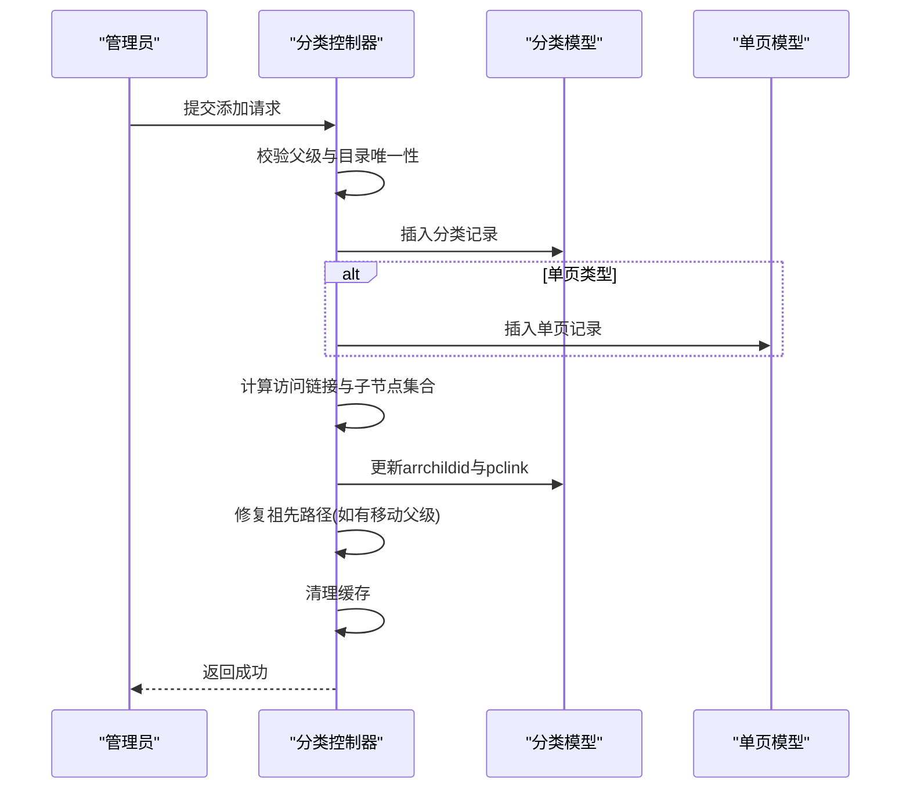

**图表来源**
- [category.class.php:170-304](file://application/lry_admin_center/controller/category.class.php#L170-L304)
- [category.class.php:489-494](file://application/lry_admin_center/controller/category.class.php#L489-L494)

**章节来源**
- [category.class.php:170-304](file://application/lry_admin_center/controller/category.class.php#L170-L304)
- [category_add.html:1-329](file://application/lry_admin_center/view/category_add.html#L1-L329)
- [category_page.html:1-211](file://application/lry_admin_center/view/category_page.html#L1-L211)
- [category_link.html:1-125](file://application/lry_admin_center/view/category_link.html#L1-L125)

### 分类编辑与移动
- 编辑流程：支持修改父级、目录、模板、SEO、域名等；当父级变更时，批量更新子树的 arrparentid 路径
- 安全校验：禁止将分类移动到自身或其子孙节点
- 访问链接：非外部链接类型根据域名与目录生成访问链接

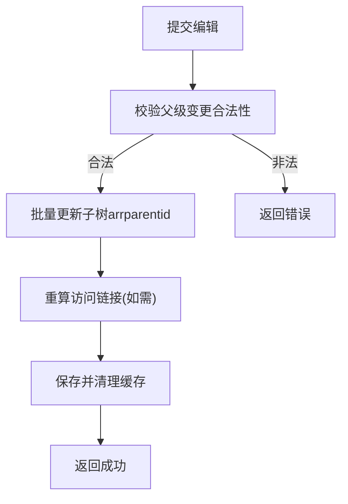

**图表来源**
- [category.class.php:370-454](file://application/lry_admin_center/controller/category.class.php#L370-L454)

**章节来源**
- [category.class.php:370-454](file://application/lry_admin_center/controller/category.class.php#L370-L454)
- [category_edit.html:1-308](file://application/lry_admin_center/view/category_edit.html#L1-L308)
- [category_page_edit.html:1-213](file://application/lry_admin_center/view/category_page_edit.html#L1-L213)
- [category_link_edit.html:1-127](file://application/lry_admin_center/view/category_link_edit.html#L1-L127)

### 分类删除与数据完整性
- 删除前置条件：必须无子分类、无内容；否则拒绝删除
- 删除流程：删除分类记录；若为单页类型，同步删除单页记录；修复祖先节点的 arrchildid；清理缓存

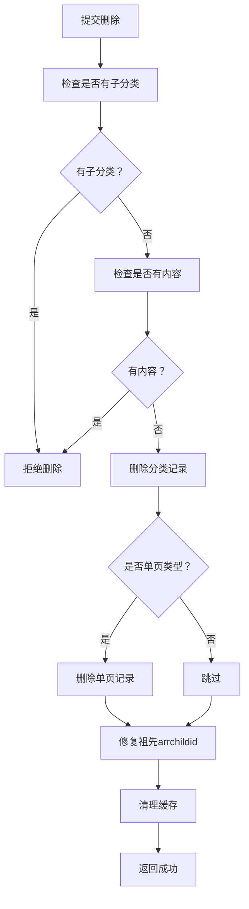

**图表来源**
- [category.class.php:461-479](file://application/lry_admin_center/controller/category.class.php#L461-L479)
- [category.class.php:489-494](file://application/lry_admin_center/controller/category.class.php#L489-L494)

**章节来源**
- [category.class.php:461-479](file://application/lry_admin_center/controller/category.class.php#L461-L479)

### 分类排序与批量操作
- 手动排序：列表页支持直接修改排序值并提交保存
- 批量添加：支持一次提交多行分类名称与英文目录，自动补全英文名
- 批量删除：可结合前端勾选实现批量删除（需在控制器中扩展）

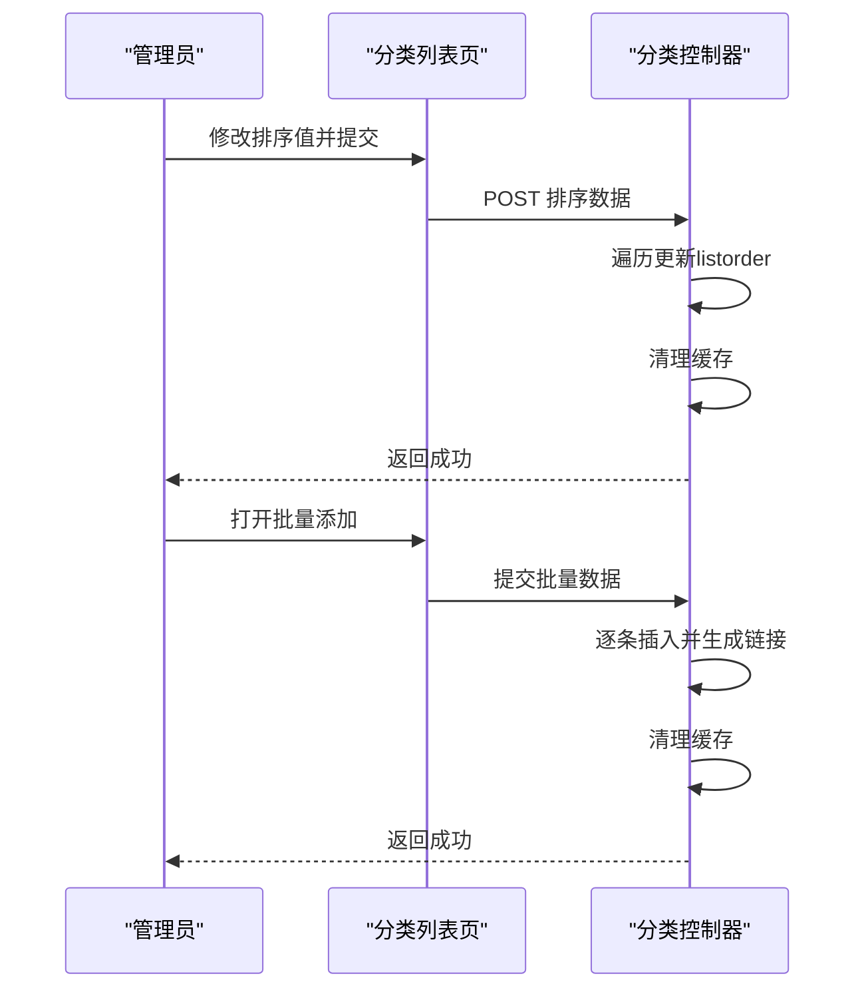

**图表来源**
- [category.class.php:589-598](file://application/lry_admin_center/controller/category.class.php#L589-L598)
- [category_adds.html:308-333](file://application/lry_admin_center/view/category_adds.html#L308-L333)

**章节来源**
- [category.class.php:589-598](file://application/lry_admin_center/controller/category.class.php#L589-L598)
- [category_adds.html:1-237](file://application/lry_admin_center/view/category_adds.html#L1-L237)

### 分类模板选择与页面元数据
- 模板选择：根据模型别名动态匹配模板文件，支持频道页、列表页、内容页模板
- 页面元数据：支持 SEO 标题、关键词、描述、英文标题、副标题、移动端名称、绑定域名、排序、导航显示、允许投稿等配置
- 单页与外部链接：单页类型仅需选择单页模板；外部链接类型仅需填写链接地址与打开方式

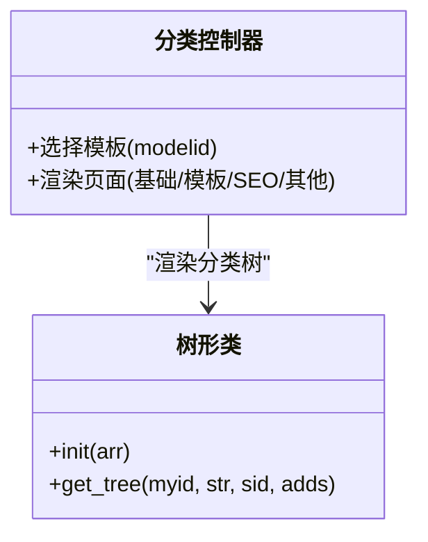

**图表来源**
- [category.class.php:525-535](file://application/lry_admin_center/controller/category.class.php#L525-L535)
- [category_add.html:69-180](file://application/lry_admin_center/view/category_add.html#L69-L180)
- [category_page.html:53-123](file://application/lry_admin_center/view/category_page.html#L53-L123)
- [category_link.html:8-77](file://application/lry_admin_center/view/category_link.html#L8-L77)

**章节来源**
- [category.class.php:525-535](file://application/lry_admin_center/controller/category.class.php#L525-L535)
- [category_add.html:1-329](file://application/lry_admin_center/view/category_add.html#L1-L329)
- [category_page.html:1-211](file://application/lry_admin_center/view/category_page.html#L1-L211)
- [category_link.html:1-125](file://application/lry_admin_center/view/category_link.html#L1-L125)

### 分类与文章的关联管理
- 关联机制：分类与文章通过模型表关联（普通分类与文章模型），单页分类与单页表关联
- 文章数量统计：可通过查询 all_content 表按 catid 统计文章数量（在控制器中可扩展）
- 文章列表显示：根据分类模板与模型别名渲染列表页与内容页

说明：当前仓库未提供分类文章数量统计的具体实现代码片段，可在控制器中扩展相应查询逻辑以实现统计与显示。

**章节来源**
- [category.class.php:468](file://application/lry_admin_center/controller/category.class.php#L468)
- [category_add.html:69-180](file://application/lry_admin_center/view/category_add.html#L69-L180)

### 分类链接管理（外部链接）
- 外部链接类型：仅需填写名称、链接地址、打开方式、导航显示等
- 编辑外部链接：支持修改链接地址与打开方式
- 访问链接：直接使用 pclink 字段作为访问地址

**章节来源**
- [category_link.html:1-125](file://application/lry_admin_center/view/category_link.html#L1-L125)
- [category_link_edit.html:1-127](file://application/lry_admin_center/view/category_link_edit.html#L1-L127)

### 分类缓存机制与性能优化
- 缓存清理：每次分类变更后清理分类相关信息缓存，确保前端展示一致性
- 树形类优化：内部缓存子节点查询结果，减少重复计算；模板解析采用安全替换，避免 eval 风险
- 展开状态持久化：通过 Cookie 记忆树形展开/收起状态，减少重复计算与网络请求

**更新** 新增了基于Cookie的状态持久化机制，显著提升了用户体验和操作效率。

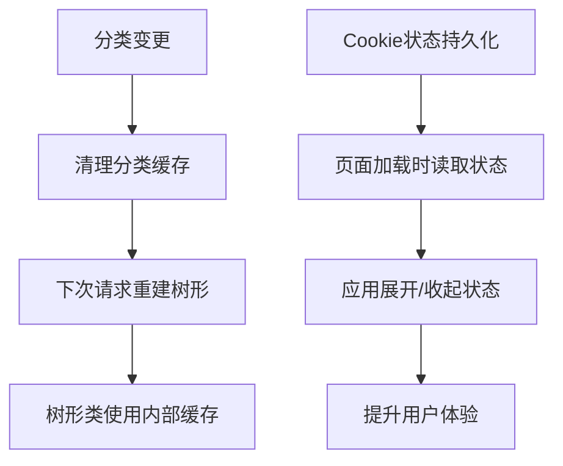

**图表来源**
- [category.class.php:489-494](file://application/lry_admin_center/controller/category.class.php#L489-L494)
- [category_list.html:48-81](file://application/lry_admin_center/view/category_list.html#L48-L81)
- [tree.class.php:46-47](file://ryphp/core/class/tree.class.php#L46-L47)
- [tree.class.php:97-116](file://ryphp/core/class/tree.class.php#L97-L116)

**章节来源**
- [category.class.php:489-494](file://application/lry_admin_center/controller/category.class.php#L489-L494)
- [category_list.html:48-81](file://application/lry_admin_center/view/category_list.html#L48-L81)
- [tree.class.php:1-484](file://ryphp/core/class/tree.class.php#L1-L484)

### 分类树状态管理与交互体验

**更新** 新增了完整的分类树状态管理功能，包括基于Cookie的状态持久化和改进的用户交互体验。

#### 状态管理机制
- Cookie存储：使用 `category_show_status_<?php echo self::$siteid;?>` 格式存储分类状态
- 状态编码：1表示收起，2表示展开
- 数据结构：JSON格式存储每个分类的展开/收起状态

#### 用户交互增强
- 图标反馈：展开状态显示向下箭头（&#xe653;），收起状态显示向右箭头（&#xe652;）
- 一键操作：页面顶部提供一键展开/收起所有分类的功能
- 实时保存：每次状态变更都会立即保存到Cookie中

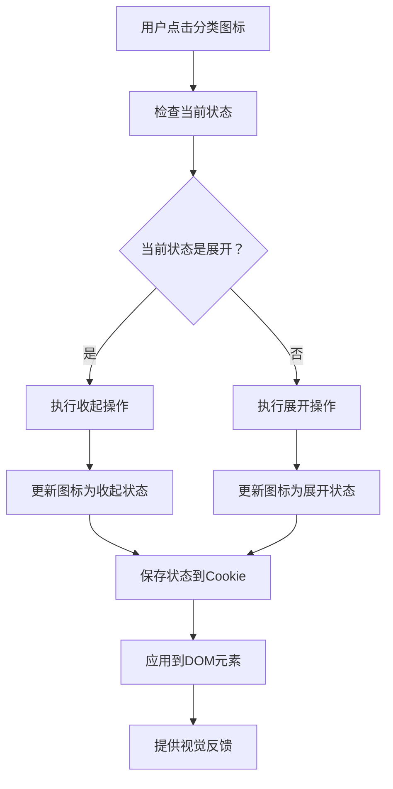

**图表来源**
- [category.class.php:39-54](file://application/lry_admin_center/controller/category.class.php#L39-L54)
- [category_list.html:99-113](file://application/lry_admin_center/view/category_list.html#L99-L113)
- [category_list.html:83-97](file://application/lry_admin_center/view/category_list.html#L83-L97)

**章节来源**
- [category.class.php:39-54](file://application/lry_admin_center/controller/category.class.php#L39-L54)
- [category_list.html:99-113](file://application/lry_admin_center/view/category_list.html#L99-L113)
- [category_list.html:83-97](file://application/lry_admin_center/view/category_list.html#L83-L97)

## 依赖分析
- 控制器依赖树形类：用于生成树形 HTML
- 控制器依赖模型：读取与写入分类数据，必要时写入单页数据
- 视图依赖控制器：传递分类数据与模板选择结果
- 树形类独立：提供通用树形渲染能力，支持缓存与安全模板解析

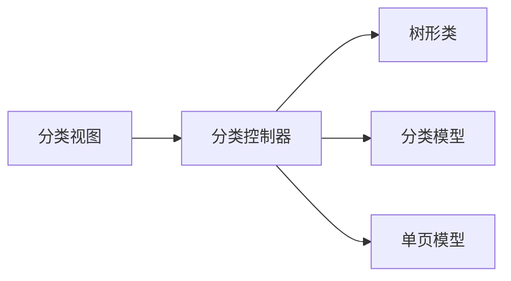

**图表来源**
- [category.class.php:1-606](file://application/lry_admin_center/controller/category.class.php#L1-L606)
- [tree.class.php:1-484](file://ryphp/core/class/tree.class.php#L1-L484)

**章节来源**
- [category.class.php:1-606](file://application/lry_admin_center/controller/category.class.php#L1-L606)
- [tree.class.php:1-484](file://ryphp/core/class/tree.class.php#L1-L484)

## 性能考虑
- 树形类缓存：利用内部缓存减少子节点查询次数，建议在高并发场景下配合外部缓存策略
- 模板解析：采用安全替换替代 eval，避免注入风险并提升稳定性
- 展开状态持久化：通过 Cookie 减少服务端计算，提升用户体验
- 批量操作：批量添加与批量删除建议在控制器中进行事务封装与批量处理，降低数据库压力

**更新** 新增了基于Cookie的状态持久化机制，通过客户端存储减少了服务端的状态计算需求，进一步提升了系统的整体性能。

## 故障排查指南
- 无法删除分类：检查是否存在子分类或内容；根据提示先删除子分类或转移内容
- 无法移动父级：禁止将分类移动到自身或其子孙节点；请重新选择父级
- 模板未生效：确认模板文件命名与模型别名匹配；检查模板选择是否正确
- 展开状态异常：检查 Cookie 是否正常写入；尝试刷新页面或清除浏览器缓存
- 排序无效：确认提交的排序值是否正确；检查列表页排序表单是否完整提交

**更新** 新增了分类树状态相关的故障排查项：
- Cookie状态丢失：检查浏览器是否禁用了Cookie功能
- 状态不同步：确认多个标签页间的Cookie同步情况
- 性能问题：检查Cookie大小是否过大影响页面加载速度

**章节来源**
- [category.class.php:461-479](file://application/lry_admin_center/controller/category.class.php#L461-L479)
- [category.class.php:387](file://application/lry_admin_center/controller/category.class.php#L387)
- [category_list.html:75-113](file://application/lry_admin_center/view/category_list.html#L75-L113)

## 结论
LRYBlog 的分类管理以控制器为中心，结合树形类与视图模板，实现了完整的分类生命周期管理：创建、编辑、删除、层级管理、排序、模板选择与页面元数据设置。通过 Cookie 记忆与缓存清理保障了用户体验与数据一致性。

**更新** 新增强化的分类树状态管理功能，通过基于Cookie的状态持久化机制，显著提升了用户的交互体验和操作效率。这一改进不仅保持了原有的功能完整性，还通过智能的状态管理机制为用户提供了更加流畅和一致的使用体验。

建议在生产环境中配合外部缓存与事务处理，进一步提升性能与可靠性。

## 附录
- 管理员操作清单
  - 创建分类：选择模型、父级、类型（普通/单页/外部链接）、填写目录与模板
  - 编辑分类：修改父级、目录、模板、SEO、域名等；注意父级变更会批量更新子树路径
  - 删除分类：确保无子分类与内容；单页类型会同步删除单页记录
  - 排序：在列表页直接修改排序值并提交
  - 批量添加：按"名称|英文目录"格式批量提交
  - 外部链接：仅需填写名称与链接地址
  - 模板选择：根据模型别名自动匹配模板文件
  - 状态管理：利用Cookie保持分类树的展开/收起状态，提升操作效率

**更新** 新增了状态管理相关的操作说明，帮助管理员更好地理解和使用增强的分类树功能。