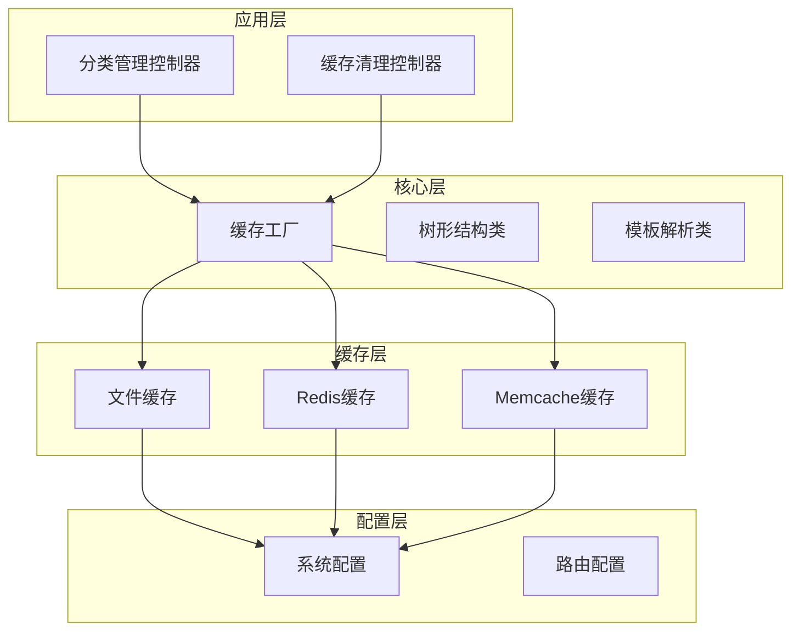
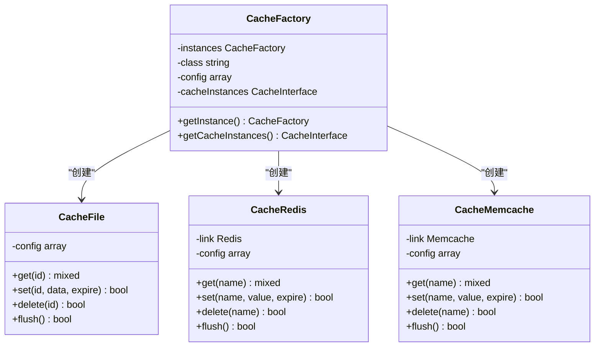
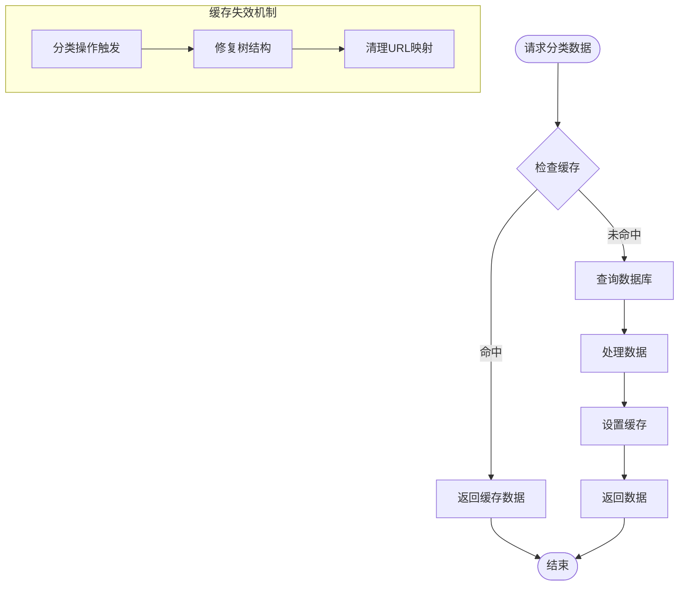
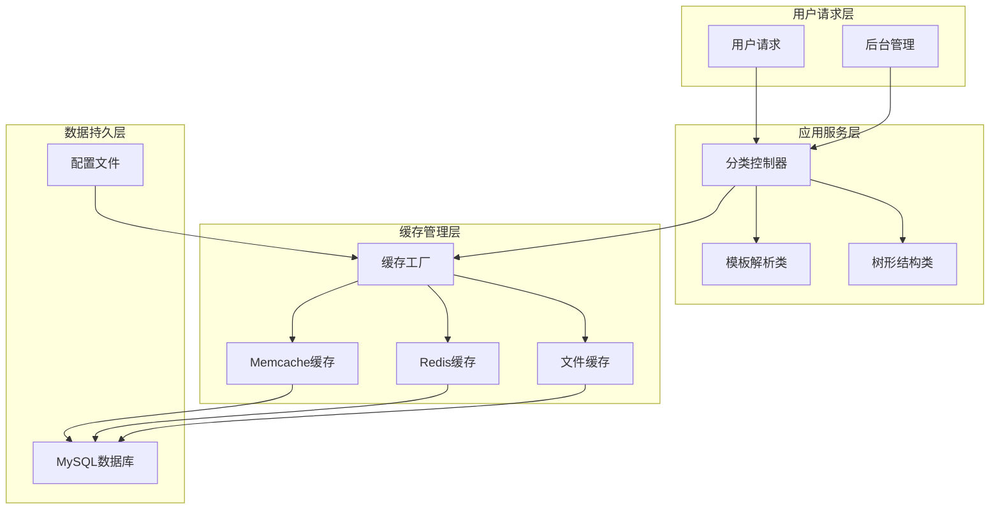
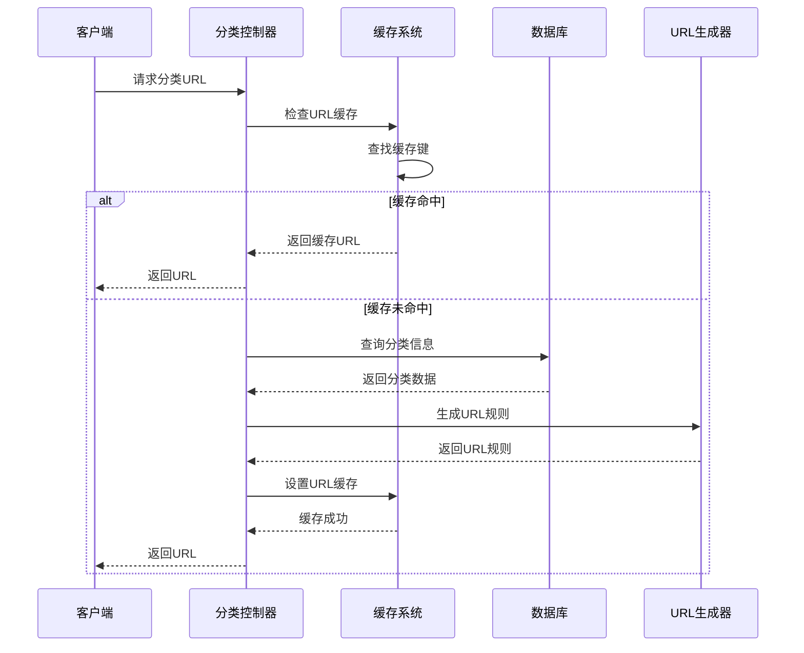
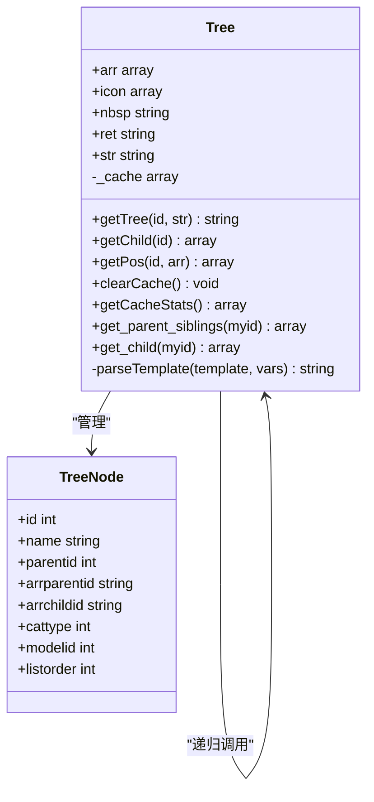
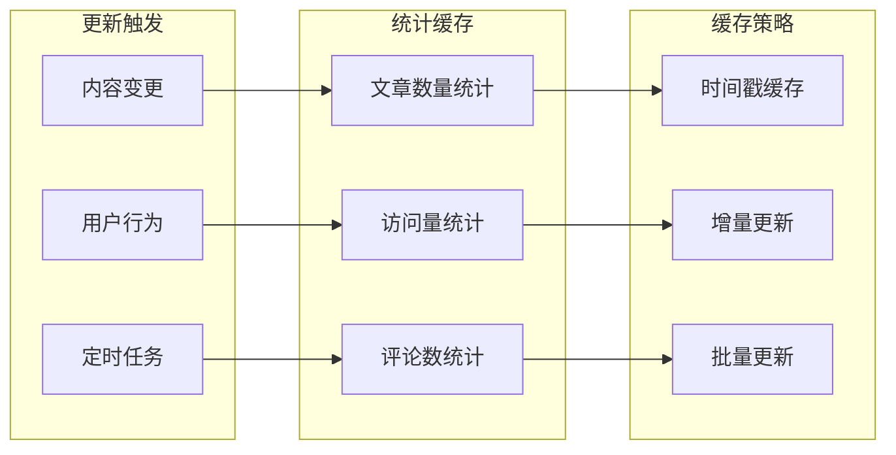
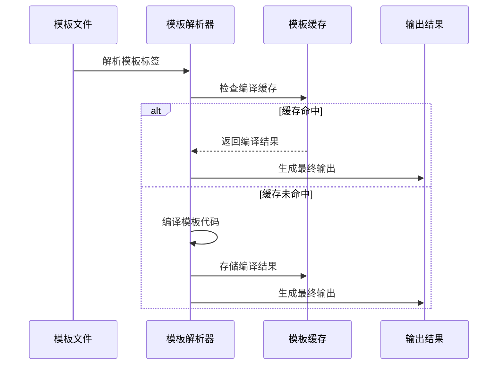
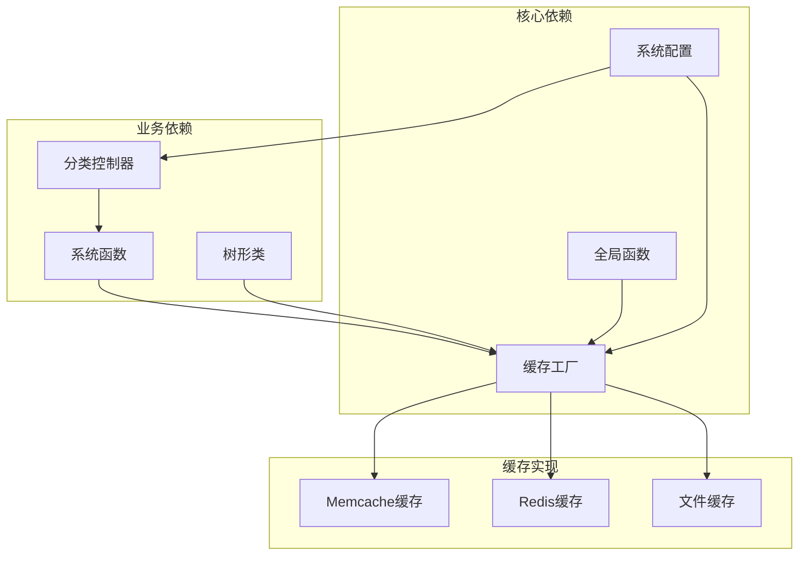
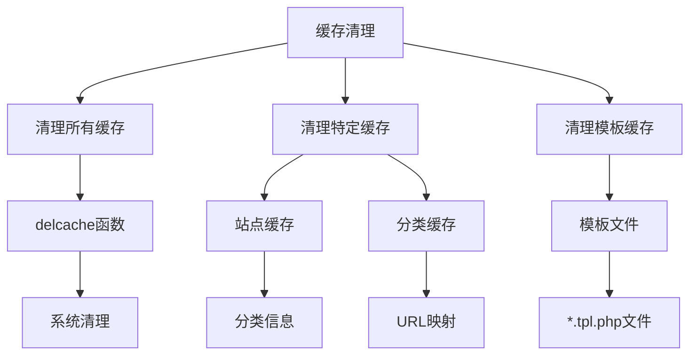

# 分类缓存与性能优化

<cite>
**本文档引用的文件**
- [category.class.php](file://application/lry_admin_center/controller/category.class.php)
- [clear_cache.class.php](file://application/lry_admin_center/controller/clear_cache.class.php)
- [cache_factory.class.php](file://ryphp/core/class/cache_factory.class.php)
- [cache_file.class.php](file://ryphp/core/class/cache_file.class.php)
- [cache_redis.class.php](file://ryphp/core/class/cache_redis.class.php)
- [cache_memcache.class.php](file://ryphp/core/class/cache_memcache.class.php)
- [system.func.php](file://common/function/system.func.php)
- [global.func.php](file://ryphp/core/function/global.func.php)
- [tree.class.php](file://ryphp/core/class/tree.class.php)
- [config.php](file://common/config/config.php)
- [lry_tpl.class.php](file://ryphp/core/class/lry_tpl.class.php)
- [param.class.php](file://ryphp/core/class/param.class.php)
</cite>

## 更新摘要
**变更内容**
- 更新tree.class.php性能优化部分，反映array_filter()的使用
- 新增缓存统计功能的详细说明
- 增强缓存失效机制的描述
- 更新性能监控指标的实现细节

## 目录
1. [简介](#简介)
2. [项目结构](#项目结构)
3. [核心组件](#核心组件)
4. [架构概览](#架构概览)
5. [详细组件分析](#详细组件分析)
6. [依赖关系分析](#依赖关系分析)
7. [性能考虑](#性能考虑)
8. [故障排除指南](#故障排除指南)
9. [结论](#结论)

## 简介

LRYBlog是一个基于RYCMS框架开发的内容管理系统，本文档专注于其分类缓存与性能优化功能。系统实现了多层次的缓存架构，包括分类数据缓存、分类树缓存、URL规则缓存、模板缓存等多个维度的优化策略。

## 项目结构

LRYBlog采用典型的三层架构设计：

**图表来源**
- [category.class.php:1-580](file://application/lry_admin_center/controller/category.class.php#L1-L580)
- [cache_factory.class.php:1-84](file://ryphp/core/class/cache_factory.class.php#L1-L84)

**章节来源**
- [category.class.php:1-580](file://application/lry_admin_center/controller/category.class.php#L1-L580)
- [config.php:1-88](file://common/config/config.php#L1-L88)

## 核心组件

### 缓存工厂模式

系统采用工厂模式实现多种缓存类型的统一管理：

**图表来源**
- [cache_factory.class.php:1-84](file://ryphp/core/class/cache_factory.class.php#L1-L84)
- [cache_file.class.php:1-130](file://ryphp/core/class/cache_file.class.php#L1-L130)
- [cache_redis.class.php:1-108](file://ryphp/core/class/cache_redis.class.php#L1-L108)

### 分类数据缓存

系统实现了完整的分类数据缓存策略：

**图表来源**
- [system.func.php:631-656](file://common/function/system.func.php#L631-L656)
- [category.class.php:463-468](file://application/lry_admin_center/controller/category.class.php#L463-L468)

**章节来源**
- [system.func.php:631-656](file://common/function/system.func.php#L631-L656)
- [category.class.php:463-468](file://application/lry_admin_center/controller/category.class.php#L463-L468)

## 架构概览

### 多级缓存架构

系统实现了从数据库到应用层再到文件系统的多级缓存架构：

**图表来源**
- [cache_factory.class.php:36-82](file://ryphp/core/class/cache_factory.class.php#L36-L82)
- [tree.class.php:25-66](file://ryphp/core/class/tree.class.php#L25-L66)

## 详细组件分析

### 分类URL生成缓存

系统实现了智能的URL生成缓存机制：

**图表来源**
- [system.func.php:486-505](file://common/function/system.func.php#L486-L505)
- [category.class.php:548-555](file://application/lry_admin_center/controller/category.class.php#L548-L555)

#### URL规则缓存特性

系统实现了灵活的URL规则缓存机制：

| 缓存键格式 | 缓存内容 | 缓存有效期 | 触发条件 |
|-----------|----------|------------|----------|
| `site_mapping_{m}_{siteid}` | 分类URL映射规则 | 可配置 | 分类增删改查 |
| `categoryinfo` | 所有站点分类数据 | 3600秒 | 首次查询 |
| `categoryinfo_siteid_{siteid}` | 当前站点分类数据 | 3600秒 | 首次查询 |
| `modelinfo` | 模型信息缓存 | 3600秒 | 首次查询 |

**章节来源**
- [system.func.php:486-505](file://common/function/system.func.php#L486-L505)
- [system.func.php:631-656](file://common/function/system.func.php#L631-L656)

### 分类树数据缓存优化

**更新** 系统对树形结构进行了深度优化，使用array_filter()提升查询性能并增强了缓存统计功能

**图表来源**
- [tree.class.php:25-484](file://ryphp/core/class/tree.class.php#L25-L484)

#### 树形结构缓存优化策略

系统实现了智能的树形结构缓存：

1. **内部缓存机制**：使用`_cache`数组缓存子节点查询结果
2. **性能优化**：使用`array_filter()`替代传统循环，提升查询性能
3. **模板安全解析**：替代不安全的`eval()`函数，使用`parseTemplate()`方法
4. **性能统计**：提供`getCacheStats()`方法监控缓存效果
5. **缓存管理**：新增`clearCache()`方法支持手动缓存清理

**章节来源**
- [tree.class.php:46-116](file://ryphp/core/class/tree.class.php#L46-L116)
- [tree.class.php:437-461](file://ryphp/core/class/tree.class.php#L437-L461)

### 分类统计信息缓存

系统实现了分类统计信息的高效缓存：

**图表来源**
- [system.func.php:783-788](file://common/function/system.func.php#L783-L788)

### 分类模板缓存处理

系统提供了完整的模板缓存解决方案：

**图表来源**
- [lry_tpl.class.php:31-59](file://ryphp/core/class/lry_tpl.class.php#L31-L59)

#### 模板编译缓存特性

| 缓存类型 | 缓存机制 | 性能优势 |
|----------|----------|----------|
| 模板编译缓存 | 编译后的PHP代码缓存 | 避免重复解析 |
| 标签缓存 | 模板标签结果缓存 | 减少数据库查询 |
| 静态化输出 | 预生成静态HTML | 最佳访问性能 |

**章节来源**
- [lry_tpl.class.php:76-92](file://ryphp/core/class/lry_tpl.class.php#L76-L92)

## 依赖关系分析

### 缓存依赖关系

**图表来源**
- [global.func.php:585-589](file://ryphp/core/function/global.func.php#L585-L589)
- [cache_factory.class.php:36-82](file://ryphp/core/class/cache_factory.class.php#L36-L82)

### 关键依赖关系

系统的关键依赖关系包括：

1. **配置依赖**：所有缓存实现都依赖于`config.php`中的配置
2. **工厂依赖**：缓存工厂依赖于具体的缓存实现类
3. **业务依赖**：分类控制器依赖于系统函数提供的缓存接口

**章节来源**
- [config.php:39-66](file://common/config/config.php#L39-L66)
- [cache_factory.class.php:39-59](file://ryphp/core/class/cache_factory.class.php#L39-L59)

## 性能考虑

### 缓存性能指标

**更新** 系统实现了全面的性能监控指标，包括新增的缓存统计功能：

| 指标类型 | 监控内容 | 实现方式 | 性能影响 |
|----------|----------|----------|----------|
| 查询次数 | 数据库查询次数 | 统计setcache/getcache调用 | 减少重复查询 |
| 缓存命中率 | 缓存命中比例 | 计算命中/总请求数 | 提升响应速度 |
| 响应时间 | 页面加载时间 | 测量从请求到响应的时间 | 优化用户体验 |
| 缓存大小 | 缓存数据量 | 统计缓存文件数量和大小 | 控制内存使用 |
| 缓存效率 | 缓存查询性能 | array_filter()优化 | 提升查询速度 |
| 缓存统计 | 缓存使用情况 | getCacheStats()方法 | 监控缓存效果 |

### 性能优化策略

#### 1. 缓存层次优化
- **应用层缓存**：分类数据缓存，避免重复查询
- **模板层缓存**：模板编译结果缓存，提升渲染速度
- **URL层缓存**：URL规则缓存，加速URL生成

#### 2. 缓存失效策略
- **分类操作触发**：新增、修改、删除分类时自动失效相关缓存
- **树结构修复**：自动修复树形结构相关的缓存
- **URL映射清理**：清理过期的URL映射缓存
- **手动缓存清理**：支持通过clearCache()方法清理缓存

#### 3. 内存优化
- **树形结构缓存**：使用内部缓存减少重复查询
- **模板解析优化**：安全的模板解析替代不安全的eval()
- **数组过滤优化**：使用array_filter()替代传统循环

#### 4. 性能监控
- **缓存统计**：通过getCacheStats()获取缓存使用情况
- **性能分析**：监控缓存命中率和查询效率
- **调试支持**：提供详细的缓存统计信息

**章节来源**
- [tree.class.php:415-428](file://ryphp/core/class/tree.class.php#L415-L428)

## 故障排除指南

### 常见问题及解决方案

#### 1. 缓存目录权限问题
**问题描述**：缓存文件无法写入
**解决方案**：
- 检查`cache/cache_file/`目录权限
- 确保目录具有写入权限
- 验证磁盘空间充足

#### 2. 缓存数据不一致
**问题描述**：分类数据与缓存不一致
**解决方案**：
- 执行缓存清理操作
- 检查缓存失效机制
- 验证分类操作后的缓存更新

#### 3. Redis连接失败
**问题描述**：Redis缓存无法连接
**解决方案**：
- 检查Redis服务状态
- 验证Redis配置参数
- 确认网络连接正常

#### 4. 缓存统计异常
**问题描述**：getCacheStats()返回异常数据
**解决方案**：
- 检查缓存初始化状态
- 验证缓存键格式正确性
- 确认缓存数据完整性

### 缓存清理操作

系统提供了多种缓存清理方式：

**图表来源**
- [clear_cache.class.php:9-24](file://application/lry_admin_center/controller/clear_cache.class.php#L9-L24)

**章节来源**
- [clear_cache.class.php:9-24](file://application/lry_admin_center/controller/clear_cache.class.php#L9-L24)

## 结论

LRYBlog的分类缓存与性能优化系统展现了完整的多层缓存架构设计。通过分类数据缓存、树形结构缓存、URL规则缓存和模板缓存的协同工作，系统实现了高效的性能表现。

### 主要优势

1. **多层次缓存**：从应用层到文件系统的完整缓存体系
2. **智能失效机制**：基于业务操作的自动缓存更新
3. **灵活的缓存类型**：支持文件、Redis、Memcache等多种缓存后端
4. **性能监控**：完善的性能指标监控和分析能力
5. **缓存统计**：新增的缓存使用情况监控功能
6. **查询优化**：使用array_filter()提升查询性能

### 未来优化方向

1. **分布式缓存**：考虑引入分布式缓存方案
2. **缓存预热**：实现缓存预热机制提升首次访问性能
3. **缓存分片**：对大型站点实施缓存分片策略
4. **智能缓存淘汰**：引入更智能的缓存淘汰算法
5. **缓存监控增强**：扩展缓存性能监控指标

该系统为LRYBlog提供了坚实的性能基础，能够有效支撑高并发的分类浏览和管理需求。新增的缓存统计功能和查询优化进一步提升了系统的整体性能表现。