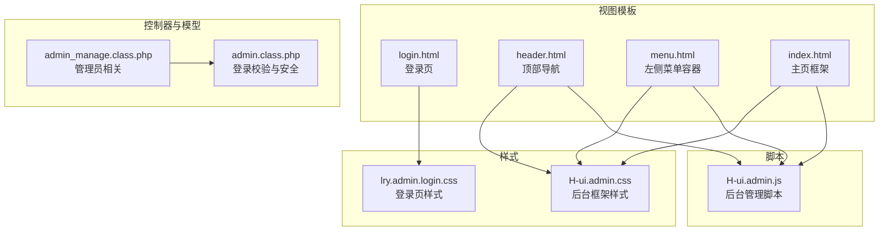
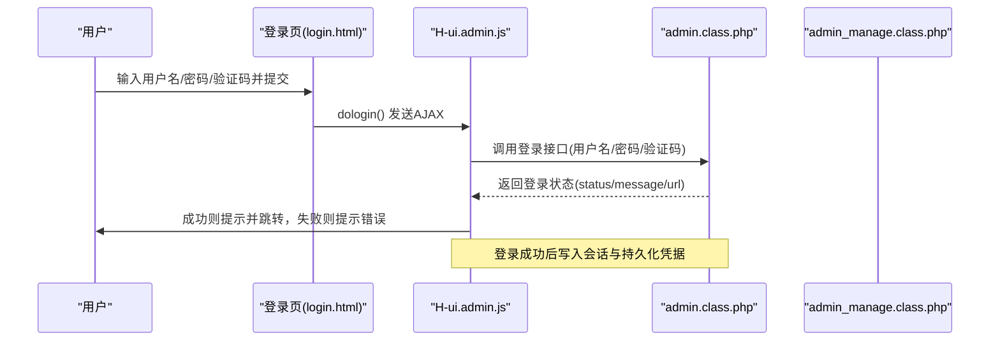
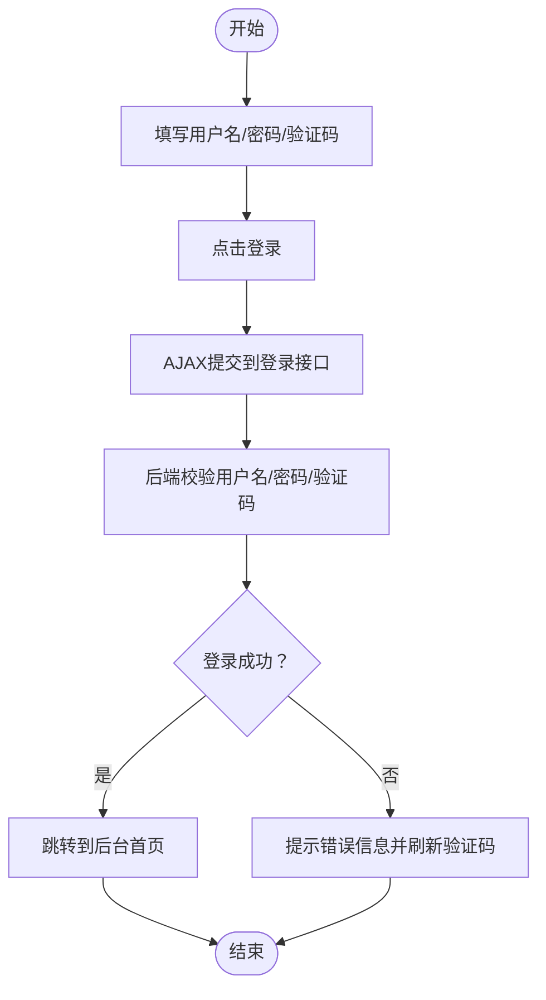
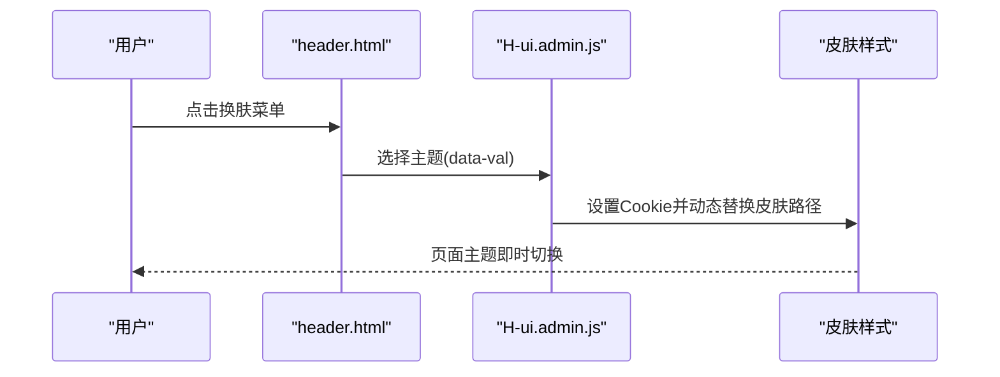
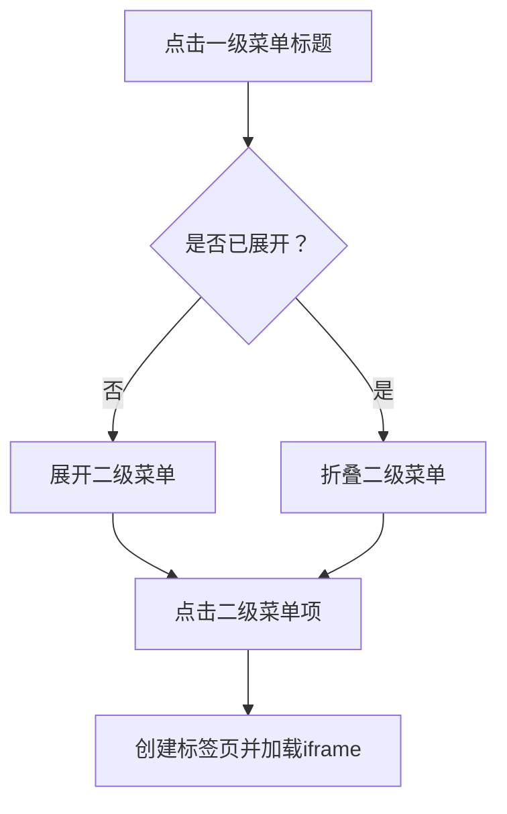
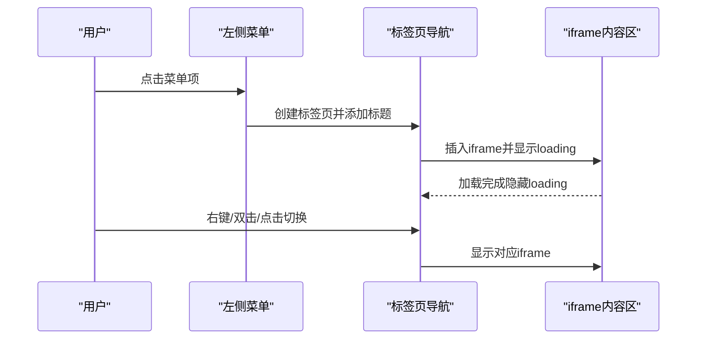
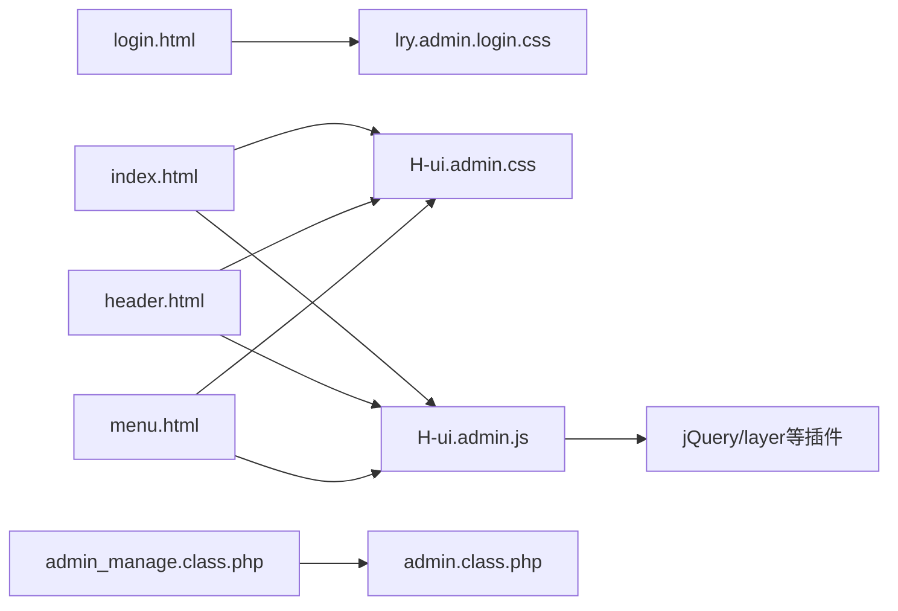

# 后台界面

<cite>
**本文引用的文件**
- [application/lry_admin_center/view/login.html](file://application/lry_admin_center/view/login.html)
- [application/lry_admin_center/view/header.html](file://application/lry_admin_center/view/header.html)
- [application/lry_admin_center/view/menu.html](file://application/lry_admin_center/view/menu.html)
- [application/lry_admin_center/view/index.html](file://application/lry_admin_center/view/index.html)
- [common/static/lry_admin_center/lry_admin/css/lry.admin.login.css](file://common/static/lry_admin_center/lry_admin/css/lry.admin.login.css)
- [common/static/lry_admin_center/lry_admin/css/H-ui.admin.css](file://common/static/lry_admin_center/lry_admin/css/H-ui.admin.css)
- [common/static/lry_admin_center/lry_admin/js/H-ui.admin.js](file://common/static/lry_admin_center/lry_admin/js/H-ui.admin.js)
- [application/lry_admin_center/model/admin.class.php](file://application/lry_admin_center/model/admin.class.php)
- [application/lry_admin_center/controller/admin_manage.class.php](file://application/lry_admin_center/controller/admin_manage.class.php)
</cite>

## 目录
1. [简介](#简介)
2. [项目结构](#项目结构)
3. [核心组件](#核心组件)
4. [架构总览](#架构总览)
5. [详细组件分析](#详细组件分析)
6. [依赖关系分析](#依赖关系分析)
7. [性能考量](#性能考量)
8. [故障排查指南](#故障排查指南)
9. [结论](#结论)
10. [附录](#附录)

## 简介
本文件面向LRYBlog后台界面的使用者与维护者，提供从布局到交互、从登录流程到菜单体系、从响应式适配到个性化设置的完整使用说明与最佳实践。重点覆盖：
- 后台整体布局与导航结构：顶部导航栏、左侧菜单、主内容区域与标签页导航
- 登录界面设计与使用：用户名/密码输入、验证码校验、登录结果反馈
- 菜单系统组织：一级菜单与二级菜单的展开/折叠机制
- 面包屑导航的作用与位置
- 快捷操作与工具栏：刷新、搜索、帮助、清除缓存、锁屏/解锁
- 个性化设置：主题切换、布局定制
- 响应式设计：在移动端与平板端的适配策略
- 后台操作最佳实践与效率提升技巧

## 项目结构
后台界面由视图模板、样式表与脚本三部分组成，配合控制器与模型实现登录与菜单渲染。关键文件分布如下：
- 视图模板：登录页、头部导航、左侧菜单、主页框架与标签页
- 样式表：登录页样式、后台框架样式（含菜单、标签页、面包屑、响应式）
- 脚本：后台管理脚本（菜单、标签页、换肤、弹窗、响应式处理）
- 控制器与模型：管理员信息编辑、密码修改、登录校验与安全策略

**图表来源**
- [application/lry_admin_center/view/login.html:1-98](file://application/lry_admin_center/view/login.html#L1-L98)
- [application/lry_admin_center/view/header.html:1-51](file://application/lry_admin_center/view/header.html#L1-L51)
- [application/lry_admin_center/view/menu.html:1-8](file://application/lry_admin_center/view/menu.html#L1-L8)
- [application/lry_admin_center/view/index.html:1-112](file://application/lry_admin_center/view/index.html#L1-L112)
- [common/static/lry_admin_center/lry_admin/css/lry.admin.login.css:1-57](file://common/static/lry_admin_center/lry_admin/css/lry.admin.login.css#L1-L57)
- [common/static/lry_admin_center/lry_admin/css/H-ui.admin.css:1-116](file://common/static/lry_admin_center/lry_admin/css/H-ui.admin.css#L1-L116)
- [common/static/lry_admin_center/lry_admin/js/H-ui.admin.js:1-280](file://common/static/lry_admin_center/lry_admin/js/H-ui.admin.js#L1-L280)
- [application/lry_admin_center/controller/admin_manage.class.php:1-105](file://application/lry_admin_center/controller/admin_manage.class.php#L1-L105)
- [application/lry_admin_center/model/admin.class.php:1-96](file://application/lry_admin_center/model/admin.class.php#L1-L96)

**章节来源**
- [application/lry_admin_center/view/login.html:1-98](file://application/lry_admin_center/view/login.html#L1-L98)
- [application/lry_admin_center/view/header.html:1-51](file://application/lry_admin_center/view/header.html#L1-L51)
- [application/lry_admin_center/view/menu.html:1-8](file://application/lry_admin_center/view/menu.html#L1-L8)
- [application/lry_admin_center/view/index.html:1-112](file://application/lry_admin_center/view/index.html#L1-L112)
- [common/static/lry_admin_center/lry_admin/css/lry.admin.login.css:1-57](file://common/static/lry_admin_center/lry_admin/css/lry.admin.login.css#L1-L57)
- [common/static/lry_admin_center/lry_admin/css/H-ui.admin.css:1-116](file://common/static/lry_admin_center/lry_admin/css/H-ui.admin.css#L1-L116)
- [common/static/lry_admin_center/lry_admin/js/H-ui.admin.js:1-280](file://common/static/lry_admin_center/lry_admin/js/H-ui.admin.js#L1-L280)
- [application/lry_admin_center/controller/admin_manage.class.php:1-105](file://application/lry_admin_center/controller/admin_manage.class.php#L1-L105)
- [application/lry_admin_center/model/admin.class.php:1-96](file://application/lry_admin_center/model/admin.class.php#L1-L96)

## 核心组件
- 登录页与登录流程
  - 输入项：用户名、密码、验证码
  - 行为：点击切换验证码、提交登录、AJAX返回状态并跳转或提示
  - 安全：后端对用户名存在性、密码正确性、账户锁定阈值进行校验
- 顶部导航栏
  - 功能：站点切换、站点首页、会员中心、消息提醒、用户下拉菜单、换肤
  - 交互：用户头像下拉菜单可修改资料、修改密码、关于系统、退出；支持清除缓存与锁屏
- 左侧菜单
  - 结构：一级菜单与二级菜单，支持展开/折叠
  - 交互：移动端自动收起，点击菜单项触发标签页打开
- 主内容区域与标签页
  - 标签页导航：多标签页承载不同子页面，支持左右滚动、右键菜单、双击关闭
  - 加载动画：iframe加载时显示loading
- 响应式与布局
  - 桌面端：左侧菜单固定，右侧内容自适应
  - 移动端：左侧菜单隐藏，顶部导航提供菜单开关；标签页固定在顶部

**章节来源**
- [application/lry_admin_center/view/login.html:14-95](file://application/lry_admin_center/view/login.html#L14-L95)
- [application/lry_admin_center/view/header.html:1-51](file://application/lry_admin_center/view/header.html#L1-L51)
- [application/lry_admin_center/view/index.html:20-42](file://application/lry_admin_center/view/index.html#L20-L42)
- [common/static/lry_admin_center/lry_admin/css/H-ui.admin.css:8-116](file://common/static/lry_admin_center/lry_admin/css/H-ui.admin.css#L8-L116)
- [common/static/lry_admin_center/lry_admin/js/H-ui.admin.js:1-280](file://common/static/lry_admin_center/lry_admin/js/H-ui.admin.js#L1-L280)
- [application/lry_admin_center/model/admin.class.php:1-96](file://application/lry_admin_center/model/admin.class.php#L1-L96)

## 架构总览
后台界面采用“模板视图 + 样式 + 脚本”的前端分层，结合控制器与模型完成数据与业务逻辑处理。

**图表来源**
- [application/lry_admin_center/view/login.html:57-95](file://application/lry_admin_center/view/login.html#L57-L95)
- [common/static/lry_admin_center/lry_admin/js/H-ui.admin.js:169-197](file://common/static/lry_admin_center/lry_admin/js/H-ui.admin.js#L169-L197)
- [application/lry_admin_center/model/admin.class.php:4-27](file://application/lry_admin_center/model/admin.class.php#L4-L27)

**章节来源**
- [application/lry_admin_center/view/login.html:14-95](file://application/lry_admin_center/view/login.html#L14-L95)
- [common/static/lry_admin_center/lry_admin/js/H-ui.admin.js:169-197](file://common/static/lry_admin_center/lry_admin/js/H-ui.admin.js#L169-L197)
- [application/lry_admin_center/model/admin.class.php:4-27](file://application/lry_admin_center/model/admin.class.php#L4-L27)

## 详细组件分析

### 登录界面
- 设计要点
  - 登录表单包含用户名、密码、验证码输入框，验证码支持点击刷新
  - 提交按钮触发登录流程，使用AJAX异步提交，避免整页刷新
  - 登录成功后根据返回URL跳转，失败则提示错误并清空验证码输入
- 使用步骤
  - 在用户名输入框输入账号，在密码框输入密码
  - 如需更换验证码，点击验证码图片以刷新
  - 点击“登录”按钮提交，等待提示后进入后台
- 安全与提示
  - 前端对必填字段进行即时校验并提示
  - 后端对用户名存在性、密码正确性、账户锁定阈值进行严格校验，并记录登录日志

**图表来源**
- [application/lry_admin_center/view/login.html:57-95](file://application/lry_admin_center/view/login.html#L57-L95)
- [application/lry_admin_center/model/admin.class.php:4-27](file://application/lry_admin_center/model/admin.class.php#L4-L27)

**章节来源**
- [application/lry_admin_center/view/login.html:14-95](file://application/lry_admin_center/view/login.html#L14-L95)
- [application/lry_admin_center/model/admin.class.php:4-27](file://application/lry_admin_center/model/admin.class.php#L4-L27)

### 顶部导航栏
- 组成与功能
  - 站点选择：支持在多个站点间切换，切换后刷新页面
  - 导航链接：站点首页、会员中心
  - 用户面板：锁屏、清除缓存、消息提醒徽标、用户下拉菜单（修改资料、修改密码、关于系统、退出）
  - 换肤：支持多套主题（默认/蓝色/绿色/红色/黄色/橙色）
- 使用建议
  - 使用“清除缓存”保持后台运行稳定
  - 使用“锁屏”离开座位时保护后台
  - 通过“关于系统”查看版本与信息

**图表来源**
- [application/lry_admin_center/view/header.html:36-45](file://application/lry_admin_center/view/header.html#L36-L45)
- [common/static/lry_admin_center/lry_admin/js/H-ui.admin.js:269-279](file://common/static/lry_admin_center/lry_admin/js/H-ui.admin.js#L269-L279)

**章节来源**
- [application/lry_admin_center/view/header.html:1-51](file://application/lry_admin_center/view/header.html#L1-L51)
- [common/static/lry_admin_center/lry_admin/js/H-ui.admin.js:269-279](file://common/static/lry_admin_center/lry_admin/js/H-ui.admin.js#L269-L279)

### 左侧菜单系统
- 结构
  - 一级菜单：主导航入口
  - 二级菜单：子功能集合，支持展开/折叠
- 展开/折叠机制
  - 桌面端：点击一级菜单标题展开/折叠其二级菜单
  - 移动端：点击菜单项后自动收起菜单，避免遮挡
- 交互细节
  - 当前选中菜单高亮
  - 点击菜单项通过标签页打开对应页面

**图表来源**
- [common/static/lry_admin_center/lry_admin/css/H-ui.admin.css:38-59](file://common/static/lry_admin_center/lry_admin/css/H-ui.admin.css#L38-L59)
- [common/static/lry_admin_center/lry_admin/js/H-ui.admin.js:214-221](file://common/static/lry_admin_center/lry_admin/js/H-ui.admin.js#L214-L221)

**章节来源**
- [common/static/lry_admin_center/lry_admin/css/H-ui.admin.css:38-59](file://common/static/lry_admin_center/lry_admin/css/H-ui.admin.css#L38-L59)
- [common/static/lry_admin_center/lry_admin/js/H-ui.admin.js:214-221](file://common/static/lry_admin_center/lry_admin/js/H-ui.admin.js#L214-L221)

### 主内容区域与标签页导航
- 标签页导航
  - 支持左右滚动、右键菜单（关闭当前/关闭全部）、双击关闭
  - 标签页标题来自菜单项的data-title属性
- 加载与切换
  - 打开新标签页时显示loading，iframe加载完成后隐藏
  - 切换标签页时仅显示对应iframe
- 右键菜单
  - 支持对标签页进行关闭操作

**图表来源**
- [application/lry_admin_center/view/index.html:20-42](file://application/lry_admin_center/view/index.html#L20-L42)
- [common/static/lry_admin_center/lry_admin/js/H-ui.admin.js:80-129](file://common/static/lry_admin_center/lry_admin/js/H-ui.admin.js#L80-L129)

**章节来源**
- [application/lry_admin_center/view/index.html:20-42](file://application/lry_admin_center/view/index.html#L20-L42)
- [common/static/lry_admin_center/lry_admin/js/H-ui.admin.js:80-129](file://common/static/lry_admin_center/lry_admin/js/H-ui.admin.js#L80-L129)

### 面包屑导航
- 作用
  - 显示当前页面在系统中的层级位置，便于快速定位与返回
- 位置
  - 在后台框架中位于主要内容区域上方，随页面切换更新
- 使用建议
  - 通过面包屑快速回到上一级或首页

**章节来源**
- [common/static/lry_admin_center/lry_admin/css/H-ui.admin.css:74-79](file://common/static/lry_admin_center/lry_admin/css/H-ui.admin.css#L74-L79)

### 快捷操作与工具栏
- 常用功能
  - 刷新：清除缓存，清理系统缓存以恢复稳定
  - 搜索：在管理员列表等页面支持按多种条件检索
  - 帮助：通过“论坛支持”获取技术支持
- 典型场景
  - 修改资料/密码：通过用户下拉菜单打开弹窗进行修改
  - 关于系统：查看系统版本与信息

**章节来源**
- [application/lry_admin_center/view/index.html:52-109](file://application/lry_admin_center/view/index.html#L52-L109)
- [application/lry_admin_center/view/header.html:21-35](file://application/lry_admin_center/view/header.html#L21-L35)
- [application/lry_admin_center/controller/admin_manage.class.php:49-104](file://application/lry_admin_center/controller/admin_manage.class.php#L49-L104)

### 个性化设置
- 主题切换
  - 通过顶部“换肤”菜单选择主题，页面即时切换
  - 主题样式存储在皮肤目录，脚本通过Cookie持久化
- 字体大小与布局
  - 默认使用统一字号与布局，如需调整可在自定义样式中扩展
- 布局定制
  - 桌面端：左侧菜单固定；移动端：菜单折叠，标签页固定在顶部

**章节来源**
- [application/lry_admin_center/view/header.html:36-45](file://application/lry_admin_center/view/header.html#L36-L45)
- [common/static/lry_admin_center/lry_admin/js/H-ui.admin.js:269-279](file://common/static/lry_admin_center/lry_admin/js/H-ui.admin.js#L269-L279)
- [common/static/lry_admin_center/lry_admin/css/H-ui.admin.css:18-93](file://common/static/lry_admin_center/lry_admin/css/H-ui.admin.css#L18-L93)

### 响应式设计
- 桌面端
  - 左侧菜单固定宽度，右侧内容自适应；标签页固定在顶部
- 移动端/平板端
  - 左侧菜单默认隐藏，顶部提供菜单开关
  - 菜单项点击后自动收起，保证内容可视区域最大化
  - 标签页固定在顶部，支持左右滚动查看更多标签

**章节来源**
- [common/static/lry_admin_center/lry_admin/css/H-ui.admin.css:18-93](file://common/static/lry_admin_center/lry_admin/css/H-ui.admin.css#L18-L93)
- [common/static/lry_admin_center/lry_admin/js/H-ui.admin.js:25-31](file://common/static/lry_admin_center/lry_admin/js/H-ui.admin.js#L25-L31)

## 依赖关系分析
- 视图模板依赖样式与脚本
  - 登录页依赖登录样式与通用脚本库
  - 后台框架依赖后台样式与后台脚本
- 脚本依赖
  - 后台脚本依赖jQuery与layer等插件
  - 菜单与标签页功能相互协作
- 控制器与模型
  - 管理员相关操作由控制器处理，登录校验与安全策略由模型实现

**图表来源**
- [application/lry_admin_center/view/login.html:1-98](file://application/lry_admin_center/view/login.html#L1-L98)
- [application/lry_admin_center/view/index.html:1-112](file://application/lry_admin_center/view/index.html#L1-L112)
- [application/lry_admin_center/view/header.html:1-51](file://application/lry_admin_center/view/header.html#L1-L51)
- [application/lry_admin_center/view/menu.html:1-8](file://application/lry_admin_center/view/menu.html#L1-L8)
- [common/static/lry_admin_center/lry_admin/css/lry.admin.login.css:1-57](file://common/static/lry_admin_center/lry_admin/css/lry.admin.login.css#L1-L57)
- [common/static/lry_admin_center/lry_admin/css/H-ui.admin.css:1-116](file://common/static/lry_admin_center/lry_admin/css/H-ui.admin.css#L1-L116)
- [common/static/lry_admin_center/lry_admin/js/H-ui.admin.js:1-280](file://common/static/lry_admin_center/lry_admin/js/H-ui.admin.js#L1-L280)
- [application/lry_admin_center/controller/admin_manage.class.php:1-105](file://application/lry_admin_center/controller/admin_manage.class.php#L1-L105)
- [application/lry_admin_center/model/admin.class.php:1-96](file://application/lry_admin_center/model/admin.class.php#L1-L96)

**章节来源**
- [common/static/lry_admin_center/lry_admin/js/H-ui.admin.js:1-280](file://common/static/lry_admin_center/lry_admin/js/H-ui.admin.js#L1-L280)
- [application/lry_admin_center/controller/admin_manage.class.php:1-105](file://application/lry_admin_center/controller/admin_manage.class.php#L1-L105)
- [application/lry_admin_center/model/admin.class.php:1-96](file://application/lry_admin_center/model/admin.class.php#L1-L96)

## 性能考量
- 资源加载
  - 合理合并与压缩CSS/JS，减少HTTP请求数
  - 图片资源使用合适的尺寸与格式，避免大图占用带宽
- 交互优化
  - 标签页懒加载iframe，仅在激活时加载
  - 避免频繁刷新页面，使用AJAX与局部更新
- 缓存策略
  - 使用“清除缓存”功能定期清理系统缓存，保持后台响应速度
- 响应式优化
  - 移动端优先，减少DOM层级，提高触摸交互的流畅度

## 故障排查指南
- 登录失败
  - 检查用户名/密码/验证码是否正确
  - 查看是否有账户锁定提示（多次错误导致临时锁定）
  - 清除浏览器缓存后重试
- 菜单无法展开/折叠
  - 确认浏览器支持与脚本正常加载
  - 尝试刷新页面或禁用广告拦截插件
- 标签页异常
  - 若某标签页长时间无响应，尝试关闭后重新打开
  - 使用“关闭全部”后重新进入功能模块
- 换肤无效
  - 检查Cookie是否被禁用
  - 刷新页面后再次选择主题

**章节来源**
- [application/lry_admin_center/model/admin.class.php:40-65](file://application/lry_admin_center/model/admin.class.php#L40-L65)
- [application/lry_admin_center/view/index.html:52-109](file://application/lry_admin_center/view/index.html#L52-L109)
- [common/static/lry_admin_center/lry_admin/js/H-ui.admin.js:269-279](file://common/static/lry_admin_center/lry_admin/js/H-ui.admin.js#L269-L279)

## 结论
LRYBlog后台界面以清晰的布局与完善的交互为核心，结合响应式设计与主题切换能力，既满足桌面端高效操作，也兼顾移动端使用体验。通过合理的菜单组织、标签页导航与快捷工具，用户可以快速完成日常管理工作。建议在实际使用中遵循本文提供的最佳实践，以获得更稳定、高效的后台管理体验。

## 附录
- 快速操作清单
  - 登录：输入用户名/密码/验证码，点击登录
  - 切换站点：顶部“站点选择”下拉菜单
  - 清除缓存：顶部“清除缓存”
  - 锁屏/解锁：顶部“锁屏”，输入密码解锁
  - 换肤：顶部“换肤”菜单
  - 菜单：点击左侧菜单项，移动端点击后自动收起
  - 标签页：右键关闭当前/全部，双击关闭，左右滚动查看更多