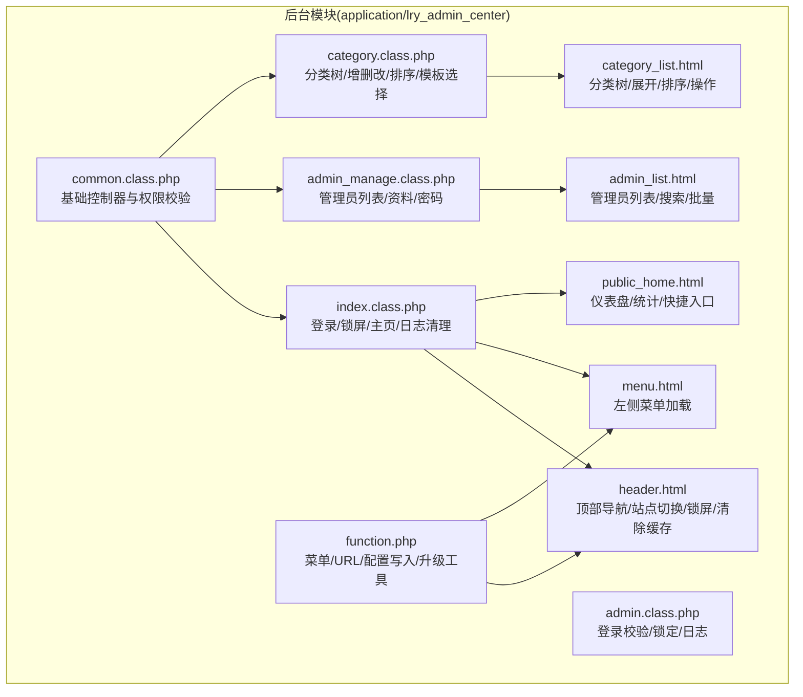
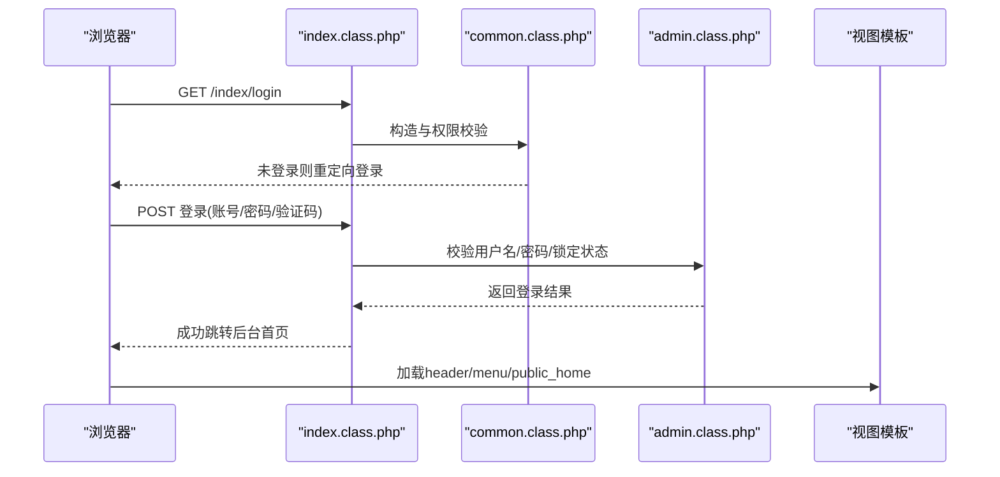
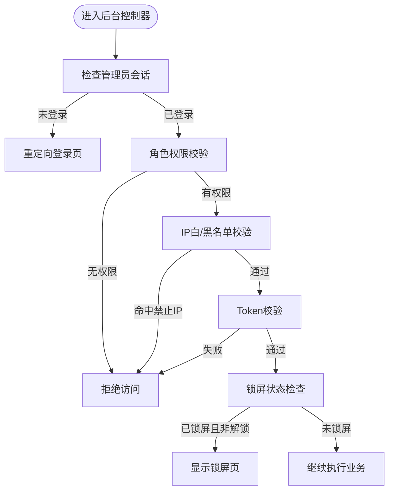
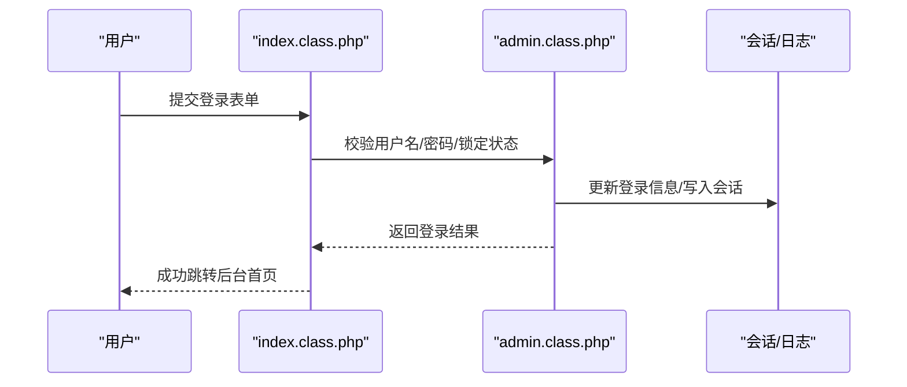
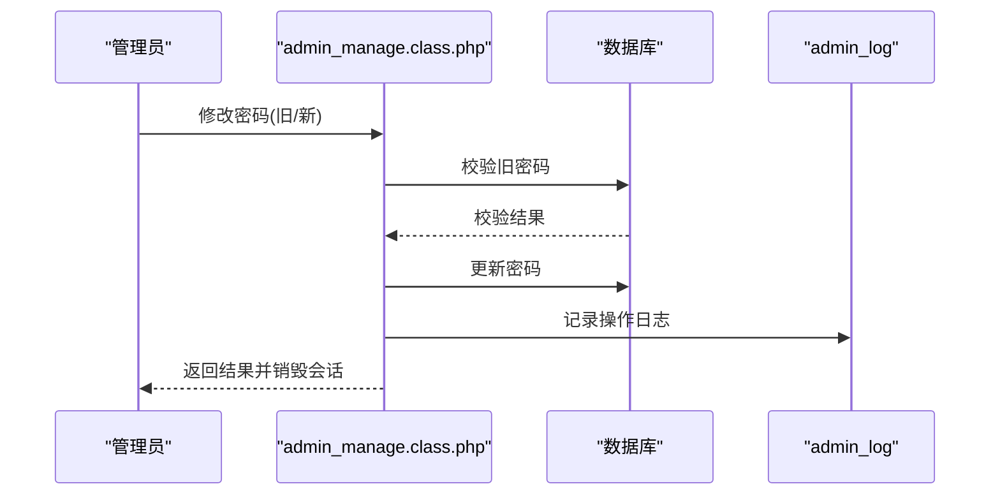
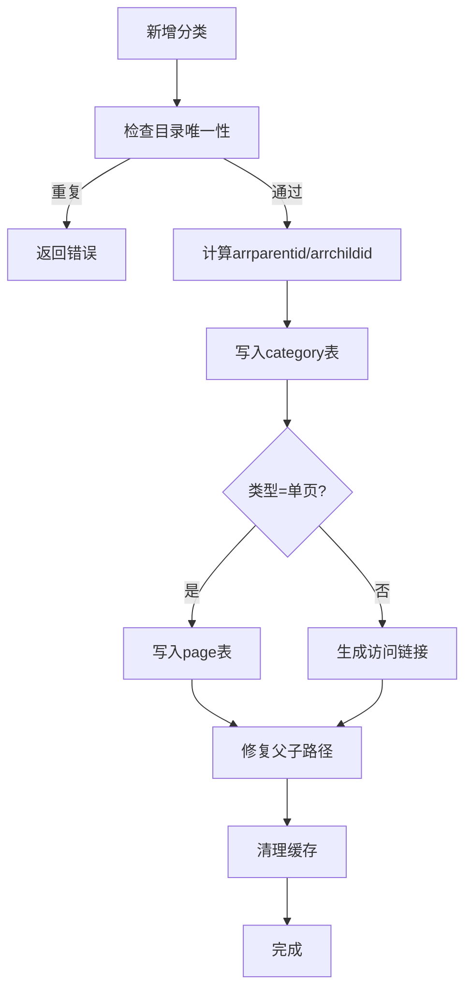
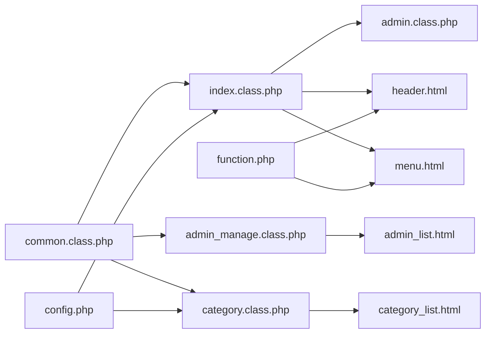

# 后台管理模块

<cite>
**本文引用的文件**
- [application/lry_admin_center/controller/common.class.php](file://application/lry_admin_center/controller/common.class.php)
- [application/lry_admin_center/controller/index.class.php](file://application/lry_admin_center/controller/index.class.php)
- [application/lry_admin_center/controller/admin_manage.class.php](file://application/lry_admin_center/controller/admin_manage.class.php)
- [application/lry_admin_center/controller/category.class.php](file://application/lry_admin_center/controller/category.class.php)
- [application/lry_admin_center/model/admin.class.php](file://application/lry_admin_center/model/admin.class.php)
- [application/lry_admin_center/common/function/function.php](file://application/lry_admin_center/common/function/function.php)
- [application/lry_admin_center/view/header.html](file://application/lry_admin_center/view/header.html)
- [application/lry_admin_center/view/menu.html](file://application/lry_admin_center/view/menu.html)
- [application/lry_admin_center/view/admin_list.html](file://application/lry_admin_center/view/admin_list.html)
- [application/lry_admin_center/view/category_list.html](file://application/lry_admin_center/view/category_list.html)
- [application/lry_admin_center/view/public_home.html](file://application/lry_admin_center/view/public_home.html)
- [common/config/config.php](file://common/config/config.php)
</cite>

## 目录
1. [简介](#简介)
2. [项目结构](#项目结构)
3. [核心组件](#核心组件)
4. [架构总览](#架构总览)
5. [详细组件分析](#详细组件分析)
6. [依赖关系分析](#依赖关系分析)
7. [性能考虑](#性能考虑)
8. [故障排查指南](#故障排查指南)
9. [结论](#结论)
10. [附录](#附录)

## 简介
本文件面向系统管理员与内容编辑者，系统性梳理 LRYBlog 后台管理模块的架构与实现，覆盖管理员权限体系、角色与访问控制、文章与分类管理、系统配置、用户管理、后台界面使用、安全与审计等主题。文档以“代码级可视化”为主，辅以流程图与类图，帮助读者快速定位实现细节与最佳实践。

## 项目结构
后台模块位于 application/lry_admin_center 目录，采用 MVC 分层组织：
- 控制器层：controller 下各 class 负责处理后台请求、权限校验与页面渲染
- 模型层：model 下的 admin 类封装管理员登录与安全逻辑
- 视图层：view 下的 HTML 模板负责页面展示与交互
- 公共函数：common/function/function.php 提供菜单、URL 构造、配置写入等通用能力
- 配置：common/config/config.php 提供系统、数据库、缓存、Cookie、上传等全局配置

图表来源
- [application/lry_admin_center/controller/common.class.php](file://application/lry_admin_center/controller/common.class.php#L1-L153)
- [application/lry_admin_center/controller/index.class.php](file://application/lry_admin_center/controller/index.class.php#L1-L162)
- [application/lry_admin_center/controller/admin_manage.class.php](file://application/lry_admin_center/controller/admin_manage.class.php#L1-L105)
- [application/lry_admin_center/controller/category.class.php](file://application/lry_admin_center/controller/category.class.php#L1-L580)
- [application/lry_admin_center/model/admin.class.php](file://application/lry_admin_center/model/admin.class.php#L1-L96)
- [application/lry_admin_center/common/function/function.php](file://application/lry_admin_center/common/function/function.php#L1-L162)
- [application/lry_admin_center/view/header.html](file://application/lry_admin_center/view/header.html#L1-L51)
- [application/lry_admin_center/view/menu.html](file://application/lry_admin_center/view/menu.html#L1-L8)
- [application/lry_admin_center/view/admin_list.html](file://application/lry_admin_center/view/admin_list.html#L1-L138)
- [application/lry_admin_center/view/category_list.html](file://application/lry_admin_center/view/category_list.html#L1-L116)
- [application/lry_admin_center/view/public_home.html](file://application/lry_admin_center/view/public_home.html#L1-L249)

章节来源
- [application/lry_admin_center/controller/common.class.php](file://application/lry_admin_center/controller/common.class.php#L1-L153)
- [application/lry_admin_center/common/function/function.php](file://application/lry_admin_center/common/function/function.php#L1-L162)

## 核心组件
- 基础控制器 common：统一注入站点ID与IP、管理员会话校验、权限判定、IP白/黑名单、Token校验、锁屏保护、后台日志记录
- 登录与主页 index：登录/登出、锁屏/解锁、主页统计、错误日志清理
- 管理员管理 admin_manage：管理员列表、搜索筛选、批量变更角色、个人资料与密码修改
- 分类管理 category：分类树渲染、增删改、批量添加、排序、模板选择、域名绑定、父子路径修复
- 管理员模型 admin：登录校验、失败次数与临时锁定、成功登录信息更新、登录日志记录
- 公共函数 function：菜单生成、URL构造、配置文件写入、升级包下载/解压
- 视图模板：header/menu/admin_list/category_list/public_home 等

章节来源
- [application/lry_admin_center/controller/common.class.php](file://application/lry_admin_center/controller/common.class.php#L1-L153)
- [application/lry_admin_center/controller/index.class.php](file://application/lry_admin_center/controller/index.class.php#L1-L162)
- [application/lry_admin_center/controller/admin_manage.class.php](file://application/lry_admin_center/controller/admin_manage.class.php#L1-L105)
- [application/lry_admin_center/controller/category.class.php](file://application/lry_admin_center/controller/category.class.php#L1-L580)
- [application/lry_admin_center/model/admin.class.php](file://application/lry_admin_center/model/admin.class.php#L1-L96)
- [application/lry_admin_center/common/function/function.php](file://application/lry_admin_center/common/function/function.php#L1-L162)
- [application/lry_admin_center/view/header.html](file://application/lry_admin_center/view/header.html#L1-L51)
- [application/lry_admin_center/view/menu.html](file://application/lry_admin_center/view/menu.html#L1-L8)
- [application/lry_admin_center/view/admin_list.html](file://application/lry_admin_center/view/admin_list.html#L1-L138)
- [application/lry_admin_center/view/category_list.html](file://application/lry_admin_center/view/category_list.html#L1-L116)
- [application/lry_admin_center/view/public_home.html](file://application/lry_admin_center/view/public_home.html#L1-L249)

## 架构总览
后台采用“基础控制器 + 功能控制器 + 视图模板 + 公共函数”的分层架构，配合统一的权限与安全校验，形成闭环的后台访问控制。

图表来源
- [application/lry_admin_center/controller/index.class.php](file://application/lry_admin_center/controller/index.class.php#L19-L38)
- [application/lry_admin_center/controller/common.class.php](file://application/lry_admin_center/controller/common.class.php#L32-L50)
- [application/lry_admin_center/model/admin.class.php](file://application/lry_admin_center/model/admin.class.php#L4-L27)
- [application/lry_admin_center/view/header.html](file://application/lry_admin_center/view/header.html#L1-L51)
- [application/lry_admin_center/view/public_home.html](file://application/lry_admin_center/view/public_home.html#L1-L249)

## 详细组件分析

### 权限与安全控制（common）
- 会话与管理员校验：未登录或会话异常时重定向登录；iframe 强制跳转
- 权限判定：超级管理员放行；非公开接口按角色权限表校验
- IP 白/黑名单：支持按配置禁止特定IP访问
- Token 校验：POST 请求需携带与会话一致的CSRF Token
- 锁屏保护：启用锁屏后仅允许解锁/公共接口访问
- 日志记录：后台操作日志按配置开关记录

图表来源
- [application/lry_admin_center/controller/common.class.php](file://application/lry_admin_center/controller/common.class.php#L32-L131)

章节来源
- [application/lry_admin_center/controller/common.class.php](file://application/lry_admin_center/controller/common.class.php#L1-L153)

### 登录与主页（index）
- 登录：验证码校验、用户名/密码格式校验、登录模型校验、成功写入会话与Cookie
- 锁屏/解锁：临时锁屏，解锁需再次输入密码
- 主页：统计内容/模块/会员/管理员数量，展示快捷入口与系统信息
- 日志清理：仅超级管理员可执行，记录清理动作

图表来源
- [application/lry_admin_center/controller/index.class.php](file://application/lry_admin_center/controller/index.class.php#L19-L38)
- [application/lry_admin_center/model/admin.class.php](file://application/lry_admin_center/model/admin.class.php#L67-L95)

章节来源
- [application/lry_admin_center/controller/index.class.php](file://application/lry_admin_center/controller/index.class.php#L1-L162)
- [application/lry_admin_center/model/admin.class.php](file://application/lry_admin_center/model/admin.class.php#L1-L96)

### 管理员管理（admin_manage）
- 列表：支持按角色、时间区间、多种字段搜索；分页与排序
- 批量：变更角色（AJAX提交）
- 个人资料：修改真实姓名/昵称/邮箱
- 密码：旧密码校验、新密码格式校验、更新后记录日志并强制退出

图表来源
- [application/lry_admin_center/controller/admin_manage.class.php](file://application/lry_admin_center/controller/admin_manage.class.php#L70-L104)

章节来源
- [application/lry_admin_center/controller/admin_manage.class.php](file://application/lry_admin_center/controller/admin_manage.class.php#L1-L105)
- [application/lry_admin_center/view/admin_list.html](file://application/lry_admin_center/view/admin_list.html#L1-L138)

### 分类管理（category）
- 分类树：基于 Cookie 展开/收起状态；渲染“增加子类/编辑/删除”等操作
- 新增：支持普通栏目/单页/外部链接；自动生成 arrparentid/arrchildid；生成访问链接；单页同步写入 page 表
- 批量：按换行分隔的多行名称批量创建
- 编辑：支持移动父类（批量修复 arrparentid 路径）、域名绑定、模板选择
- 删除：禁止删除有子类或有内容的分类
- 排序：批量更新 listorder
- 模板选择：按模型动态列出可用模板

图表来源
- [application/lry_admin_center/controller/category.class.php](file://application/lry_admin_center/controller/category.class.php#L144-L234)

章节来源
- [application/lry_admin_center/controller/category.class.php](file://application/lry_admin_center/controller/category.class.php#L1-L580)
- [application/lry_admin_center/view/category_list.html](file://application/lry_admin_center/view/category_list.html#L1-L116)

### 系统配置管理
- 数据库配置：类型、主机、端口、库名、用户名、密码、字符集、表前缀
- 路由配置：默认路由、映射开关与规则
- Cookie 配置：域、路径、TTL、前缀、安全与HttpOnly
- 缓存配置：file/redis/memcache 三类配置项
- 上传与水印：上传类型、目录、水印开关与位置
- 其他：是否允许在线执行SQL、在线编辑模板、后台验证码开关

章节来源
- [common/config/config.php](file://common/config/config.php#L1-L88)

### 用户管理（管理员账户）
- 账户安全：登录失败计数与分级锁定（5次、8次、12次不同冻结时长）
- 登录日志：记录登录时间/IP/密码/结果/原因
- 会话与Cookie：登录成功写入会话与持久化Cookie
- 个人资料与密码：支持修改资料与密码，密码更新后强制退出并记录日志

章节来源
- [application/lry_admin_center/model/admin.class.php](file://application/lry_admin_center/model/admin.class.php#L1-L96)
- [application/lry_admin_center/controller/admin_manage.class.php](file://application/lry_admin_center/controller/admin_manage.class.php#L49-L104)

### 后台界面使用指南
- 顶部导航：站点切换、论坛支持、清除缓存、锁屏、修改资料/密码/关于系统、退出
- 左侧菜单：按角色动态生成，支持点击打开新标签页
- 管理员列表：支持按角色、时间、多种字段搜索；批量变更角色
- 分类管理：支持添加普通/单页/外部链接、批量添加、树形展开/收起、排序、模板选择
- 主页仪表盘：快捷入口、统计信息、登录日志、系统信息与安全提示

章节来源
- [application/lry_admin_center/view/header.html](file://application/lry_admin_center/view/header.html#L1-L51)
- [application/lry_admin_center/view/menu.html](file://application/lry_admin_center/view/menu.html#L1-L8)
- [application/lry_admin_center/view/admin_list.html](file://application/lry_admin_center/view/admin_list.html#L1-L138)
- [application/lry_admin_center/view/category_list.html](file://application/lry_admin_center/view/category_list.html#L1-L116)
- [application/lry_admin_center/view/public_home.html](file://application/lry_admin_center/view/public_home.html#L1-L249)

## 依赖关系分析
- 控制器依赖基础控制器 common 进行统一校验
- 管理员登录依赖 admin 模型进行校验与日志
- 视图依赖公共函数生成菜单与URL
- 分类管理依赖树形类与模板选择逻辑
- 配置集中于 config.php，被多处读取与按需写入

图表来源
- [application/lry_admin_center/controller/common.class.php](file://application/lry_admin_center/controller/common.class.php#L1-L153)
- [application/lry_admin_center/controller/index.class.php](file://application/lry_admin_center/controller/index.class.php#L1-L162)
- [application/lry_admin_center/controller/admin_manage.class.php](file://application/lry_admin_center/controller/admin_manage.class.php#L1-L105)
- [application/lry_admin_center/controller/category.class.php](file://application/lry_admin_center/controller/category.class.php#L1-L580)
- [application/lry_admin_center/model/admin.class.php](file://application/lry_admin_center/model/admin.class.php#L1-L96)
- [application/lry_admin_center/common/function/function.php](file://application/lry_admin_center/common/function/function.php#L1-L162)
- [application/lry_admin_center/view/header.html](file://application/lry_admin_center/view/header.html#L1-L51)
- [application/lry_admin_center/view/menu.html](file://application/lry_admin_center/view/menu.html#L1-L8)
- [application/lry_admin_center/view/admin_list.html](file://application/lry_admin_center/view/admin_list.html#L1-L138)
- [application/lry_admin_center/view/category_list.html](file://application/lry_admin_center/view/category_list.html#L1-L116)
- [common/config/config.php](file://common/config/config.php#L1-L88)

## 性能考虑
- 分类树渲染：通过 Cookie 记录展开状态，减少重复计算
- 菜单缓存：按角色缓存菜单HTML，降低数据库查询
- 批量操作：管理员列表支持批量变更角色，减少多次请求
- 缓存策略：支持 file/redis/memcache，建议生产环境使用分布式缓存
- 日志记录：后台操作日志可按配置开关，避免不必要的I/O

## 故障排查指南
- 登录失败过多被锁定：查看登录日志与失败计数，等待冻结期结束或联系超级管理员
- 无法访问后台：检查IP白/黑名单配置、Token是否正确传递、会话是否过期
- 分类树无法展开/折叠：确认Cookie写入成功，检查JavaScript错误
- 管理员列表搜索无效：确认搜索条件与时间范围格式正确
- 日志清理失败：确认当前为超级管理员，且错误日志文件存在且可写

章节来源
- [application/lry_admin_center/model/admin.class.php](file://application/lry_admin_center/model/admin.class.php#L40-L65)
- [application/lry_admin_center/controller/common.class.php](file://application/lry_admin_center/controller/common.class.php#L86-L131)
- [application/lry_admin_center/view/public_home.html](file://application/lry_admin_center/view/public_home.html#L226-L244)

## 结论
后台管理模块以 common 为基础控制器，结合 admin 模型与公共函数，实现了完善的权限控制、安全校验与日志审计。分类与管理员管理功能覆盖了常见的内容运营需求，配合清晰的界面与快捷入口，适合系统管理员与内容编辑者高效协作。

## 附录
- 快捷入口与常用操作
  - 登录/锁屏/解锁/退出
  - 管理员列表与批量变更角色
  - 分类树管理与模板选择
  - 主页仪表盘与系统信息
- 安全建议
  - 定期清理错误日志
  - 严格控制后台访问IP
  - 使用强密码并定期轮换
  - 开启HTTPS与安全Cookie属性