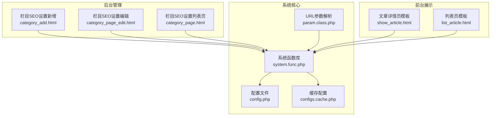
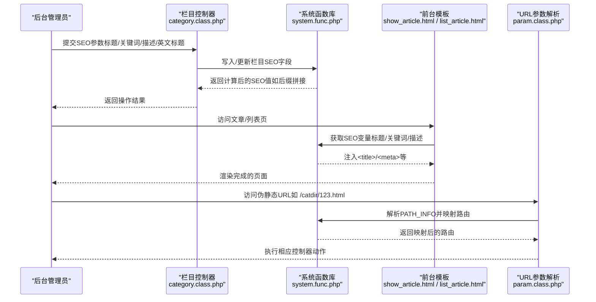
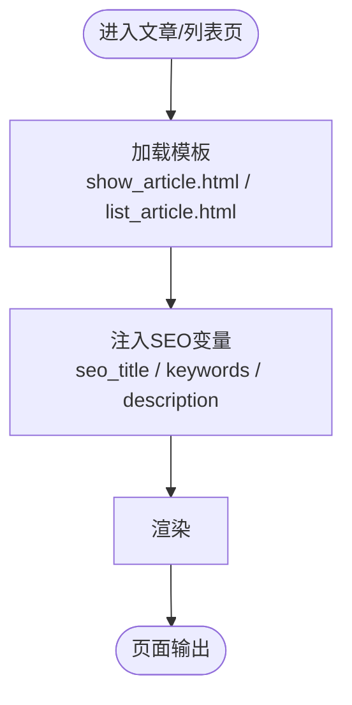
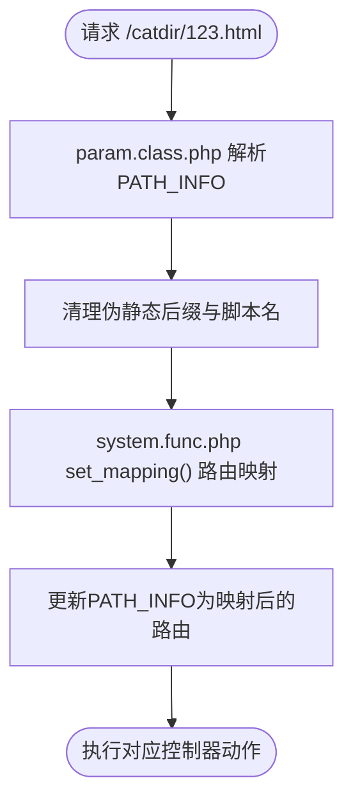
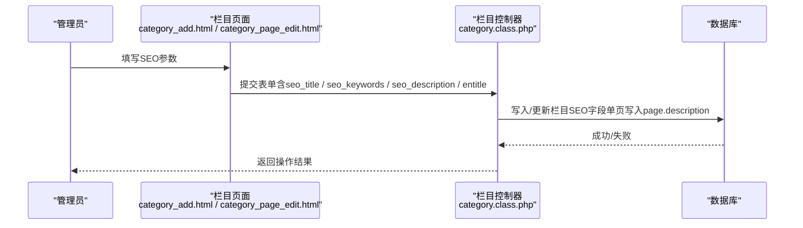
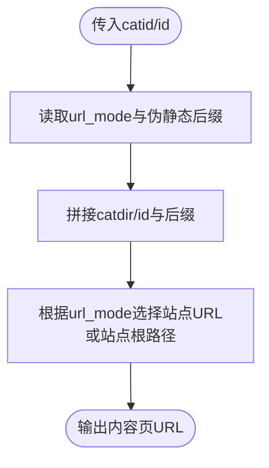
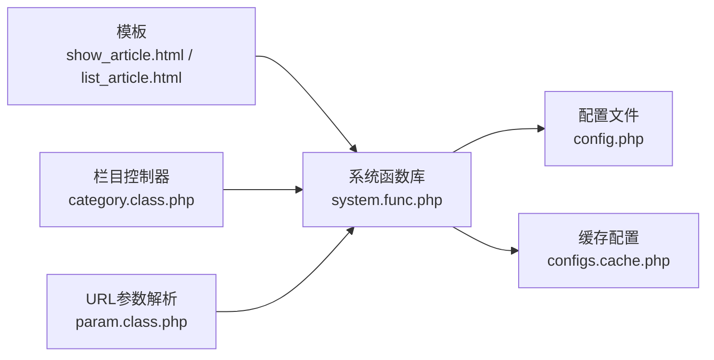

# 文章SEO优化

<cite>
**本文引用的文件**
- [README.md](file://README.md)
- [系统函数库：system.func.php](file://common/function/system.func.php)
- [配置文件：config.php](file://common/config/config.php)
- [缓存配置：configs.cache.php](file://cache/cache_file/configs.cache.php)
- [文章详情页模板：show_article.html](file://application/index/view/rongyao/show_article.html)
- [列表页模板：list_article.html](file://application/index/view/rongyao/list_article.html)
- [栏目SEO设置（新增）：category_add.html](file://application/lry_admin_center/view/category_add.html)
- [栏目SEO设置（编辑）：category_page_edit.html](file://application/lry_admin_center/view/category_page_edit.html)
- [栏目SEO设置（列表页）：category_page.html](file://application/lry_admin_center/view/category_page.html)
- [URL参数解析：param.class.php](file://ryphp/core/class/param.class.php)
- [路由映射：system.func.php](file://common/function/system.func.php)
- [安装检测（URL重写）：index.php](file://application/install/index.php)
- [后台首页：public_home.html](file://application/lry_admin_center/view/public_home.html)
</cite>

## 目录
1. [引言](#引言)
2. [项目结构](#项目结构)
3. [核心组件](#核心组件)
4. [架构总览](#架构总览)
5. [详细组件分析](#详细组件分析)
6. [依赖关系分析](#依赖关系分析)
7. [性能考量](#性能考量)
8. [故障排查指南](#故障排查指南)
9. [结论](#结论)
10. [附录](#附录)

## 引言
本文件面向LRYBlog管理员与开发者，系统化梳理文章SEO优化功能的技术实现与最佳实践。内容涵盖SEO基础概念、文章SEO参数配置（标题、Meta描述、关键词、URL美化）、URL重写与路由映射、robots.txt与爬虫抓取建议、SEO效果监控与分析方法，以及常见问题与解决方案。文档以仓库现有代码为依据，避免臆测，确保可落地实施。

## 项目结构
LRYBlog采用分层架构：前台模板负责页面输出（含SEO元信息注入），后台控制器负责SEO参数录入与持久化，系统函数库负责SEO计算与URL生成，路由与URL重写由核心类与配置共同实现。

**图表来源**
- [文章详情页模板：show_article.html](file://application/index/view/rongyao/show_article.html)
- [列表页模板：list_article.html](file://application/index/view/rongyao/list_article.html)
- [栏目SEO设置（新增）：category_add.html](file://application/lry_admin_center/view/category_add.html)
- [栏目SEO设置（编辑）：category_page_edit.html](file://application/lry_admin_center/view/category_page_edit.html)
- [栏目SEO设置（列表页）：category_page.html](file://application/lry_admin_center/view/category_page.html)
- [系统函数库：system.func.php](file://common/function/system.func.php)
- [配置文件：config.php](file://common/config/config.php)
- [缓存配置：configs.cache.php](file://cache/cache_file/configs.cache.php)
- [URL参数解析：param.class.php](file://ryphp/core/class/param.class.php)

**章节来源**
- [README.md:1-6](file://README.md#L1-L6)
- [系统函数库：system.func.php:42-74](file://common/function/system.func.php#L42-L74)
- [配置文件：config.php:10-11](file://common/config/config.php#L10-L11)
- [缓存配置：configs.cache.php:14,56-65](file://cache/cache_file/configs.cache.php#L14,L56-L65)
- [文章详情页模板：show_article.html:5-7](file://application/index/view/rongyao/show_article.html#L5-L7)
- [列表页模板：list_article.html:5-7](file://application/index/view/rongyao/list_article.html#L5-L7)
- [URL参数解析：param.class.php:98-151](file://ryphp/core/class/param.class.php#L98-L151)

## 核心组件
- SEO元信息注入：前台模板通过变量注入页面<title>、<meta name="keywords">、<meta name="description">，实现标题与摘要的动态输出。
- SEO参数采集：后台栏目管理界面提供SEO标题、关键词、描述等输入项，支持单页与普通栏目。
- SEO计算与拼接：系统函数库提供站点SEO后缀、站点级SEO合并、内容页URL生成等能力。
- URL重写与路由：通过配置与核心类实现PATH_INFO解析、路由映射与URL伪静态后缀控制。
- 配置中心：系统配置与缓存配置共同决定URL模式、伪静态后缀、SEO后缀等行为。

**章节来源**
- [系统函数库：system.func.php:42-74](file://common/function/system.func.php#L42-L74)
- [系统函数库：system.func.php:486-505](file://common/function/system.func.php#L486-L505)
- [配置文件：config.php:10-11](file://common/config/config.php#L10-L11)
- [缓存配置：configs.cache.php:14,56-65](file://cache/cache_file/configs.cache.php#L14,L56-L65)
- [文章详情页模板：show_article.html:5-7](file://application/index/view/rongyao/show_article.html#L5-L7)
- [列表页模板：list_article.html:5-7](file://application/index/view/rongyao/list_article.html#L5-L7)
- [栏目SEO设置（新增）：category_add.html:121-151](file://application/lry_admin_center/view/category_add.html#L121-L151)
- [栏目SEO设置（编辑）：category_page_edit.html:72-97](file://application/lry_admin_center/view/category_page_edit.html#L72-L97)
- [栏目SEO设置（列表页）：category_page.html:69-100](file://application/lry_admin_center/view/category_page.html#L69-L100)

## 架构总览
下图展示SEO相关的关键交互：后台录入→系统函数计算→模板注入→URL重写与路由→最终页面呈现。

**图表来源**
- [系统函数库：system.func.php:42-74](file://common/function/system.func.php#L42-L74)
- [系统函数库：system.func.php:486-505](file://common/function/system.func.php#L486-L505)
- [文章详情页模板：show_article.html:5-7](file://application/index/view/rongyao/show_article.html#L5-L7)
- [列表页模板：list_article.html:5-7](file://application/index/view/rongyao/list_article.html#L5-L7)
- [URL参数解析：param.class.php:98-151](file://ryphp/core/class/param.class.php#L98-L151)

## 详细组件分析

### 组件A：SEO元信息注入与参数
- 页面注入：文章与列表模板通过变量注入<title>、<meta name="keywords">、<meta name="description">，实现标题与摘要的动态输出。
- 参数来源：后台栏目管理界面提供SEO标题、关键词、描述等字段；部分栏目支持英文标题（用于URL或标题增强）。
- 站点级SEO：系统函数提供站点SEO后缀与合并逻辑，便于统一风格。

**图表来源**
- [文章详情页模板：show_article.html:5-7](file://application/index/view/rongyao/show_article.html#L5-L7)
- [列表页模板：list_article.html:5-7](file://application/index/view/rongyao/list_article.html#L5-L7)

**章节来源**
- [文章详情页模板：show_article.html:5-7](file://application/index/view/rongyao/show_article.html#L5-L7)
- [列表页模板：list_article.html:5-7](file://application/index/view/rongyao/list_article.html#L5-L7)
- [系统函数库：system.func.php:42-57](file://common/function/system.func.php#L42-L57)
- [栏目SEO设置（新增）：category_add.html:121-151](file://application/lry_admin_center/view/category_add.html#L121-L151)
- [栏目SEO设置（编辑）：category_page_edit.html:72-97](file://application/lry_admin_center/view/category_page_edit.html#L72-L97)
- [栏目SEO设置（列表页）：category_page.html:69-100](file://application/lry_admin_center/view/category_page.html#L69-L100)

### 组件B：URL重写与路由映射
- URL模式：系统配置提供url_mode，影响内容页URL生成与伪静态后缀。
- 伪静态后缀：由配置文件控制，默认为.html。
- PATH_INFO解析：核心类负责提取并清理PATH_INFO，去除伪静态后缀与脚本名。
- 路由映射：系统函数根据栏目映射规则与自定义路由规则，将PATH_INFO重写为控制器动作。

**图表来源**
- [URL参数解析：param.class.php:98-151](file://ryphp/core/class/param.class.php#L98-L151)
- [系统函数库：system.func.php:486-505](file://common/function/system.func.php#L486-L505)
- [配置文件：config.php:10](file://common/config/config.php#L10)

**章节来源**
- [配置文件：config.php:10](file://common/config/config.php#L10)
- [系统函数库：system.func.php:65-74](file://common/function/system.func.php#L65-L74)
- [系统函数库：system.func.php:486-505](file://common/function/system.func.php#L486-L505)
- [URL参数解析：param.class.php:98-151](file://ryphp/core/class/param.class.php#L98-L151)

### 组件C：SEO参数采集与持久化
- 录入入口：后台栏目新增/编辑页面提供SEO标题、关键词、描述、英文标题等字段。
- 写入逻辑：控制器接收表单，对单页栏目写入page表的description字段；普通栏目更新category表SEO字段。
- 缓存与生效：系统函数库与缓存配置共同保障SEO参数的读取与渲染。

**图表来源**
- [栏目SEO设置（新增）：category_add.html:121-151](file://application/lry_admin_center/view/category_add.html#L121-L151)
- [栏目SEO设置（编辑）：category_page_edit.html:72-97](file://application/lry_admin_center/view/category_page_edit.html#L72-L97)
- [系统函数库：system.func.php:42-57](file://common/function/system.func.php#L42-L57)

**章节来源**
- [栏目SEO设置（新增）：category_add.html:121-151](file://application/lry_admin_center/view/category_add.html#L121-L151)
- [栏目SEO设置（编辑）：category_page_edit.html:72-97](file://application/lry_admin_center/view/category_page_edit.html#L72-L97)
- [系统函数库：system.func.php:20-28](file://common/function/system.func.php#L20-L28)
- [系统函数库：system.func.php:42-57](file://common/function/system.func.php#L42-L57)

### 组件D：URL生成与内容页链接
- 内容页URL：系统函数根据url_mode与catdir、id生成内容页URL，支持伪静态后缀。
- URL模式：配置项url_mode决定生成相对路径或绝对路径，结合站点URL或站点根路径。

**图表来源**
- [系统函数库：system.func.php:65-74](file://common/function/system.func.php#L65-L74)
- [配置文件：config.php:10](file://common/config/config.php#L10)
- [缓存配置：configs.cache.php:14](file://cache/cache_file/configs.cache.php#L14)

**章节来源**
- [系统函数库：system.func.php:65-74](file://common/function/system.func.php#L65-L74)
- [配置文件：config.php:10](file://common/config/config.php#L10)
- [缓存配置：configs.cache.php:14](file://cache/cache_file/configs.cache.php#L14)

## 依赖关系分析
- 模板依赖系统函数：模板通过变量注入SEO信息，依赖系统函数提供的SEO计算与URL生成。
- 控制器依赖系统函数：后台控制器在写入SEO参数时依赖系统函数的SEO后缀与站点信息。
- 路由依赖配置与系统函数：URL重写与路由映射依赖配置文件与系统函数的映射规则。

**图表来源**
- [系统函数库：system.func.php:42-74](file://common/function/system.func.php#L42-L74)
- [系统函数库：system.func.php:486-505](file://common/function/system.func.php#L486-L505)
- [配置文件：config.php:10](file://common/config/config.php#L10)
- [缓存配置：configs.cache.php:14,56-65](file://cache/cache_file/configs.cache.php#L14,L56-L65)
- [URL参数解析：param.class.php:98-151](file://ryphp/core/class/param.class.php#L98-L151)

**章节来源**
- [系统函数库：system.func.php:42-74](file://common/function/system.func.php#L42-L74)
- [系统函数库：system.func.php:486-505](file://common/function/system.func.php#L486-L505)
- [配置文件：config.php:10](file://common/config/config.php#L10)
- [缓存配置：configs.cache.php:14,56-65](file://cache/cache_file/configs.cache.php#L14,L56-L65)
- [URL参数解析：param.class.php:98-151](file://ryphp/core/class/param.class.php#L98-L151)

## 性能考量
- 缓存策略：系统函数库与缓存配置文件共同提供配置与映射的缓存，降低每次请求的数据库压力。
- 模板渲染：模板仅在必要处进行变量注入，避免重复计算。
- URL生成：URL生成逻辑简单直接，依赖配置与少量函数调用，性能开销可控。

**章节来源**
- [系统函数库：system.func.php:455-469](file://common/function/system.func.php#L455-L469)
- [缓存配置：configs.cache.php:1-82](file://cache/cache_file/configs.cache.php#L1-L82)

## 故障排查指南
- URL重写未生效
  - 检查安装阶段的URL重写模块状态，确保服务器已启用重写模块。
  - 确认配置文件中的url_mode与伪静态后缀设置符合预期。
  - 核对PATH_INFO解析与路由映射是否正确执行。

- SEO参数未生效
  - 确认后台栏目页面已正确填写SEO标题、关键词、描述。
  - 检查模板是否正确注入变量，确保<title>与<meta>标签正常输出。
  - 查看缓存配置是否过期或异常。

- 内容页URL异常
  - 检查系统函数的URL生成逻辑与配置项url_mode。
  - 确认catdir与id是否正确传递至URL生成函数。

**章节来源**
- [安装检测（URL重写）：index.php:89-94](file://application/install/index.php#L89-L94)
- [配置文件：config.php:10](file://common/config/config.php#L10)
- [系统函数库：system.func.php:65-74](file://common/function/system.func.php#L65-L74)
- [URL参数解析：param.class.php:98-151](file://ryphp/core/class/param.class.php#L98-L151)

## 结论
LRYBlog的SEO优化围绕“参数采集—系统计算—模板注入—URL重写”的闭环展开。通过后台SEO参数录入、系统函数的SEO后缀与URL生成、模板的动态注入，以及路由与伪静态的配合，实现了较为完善的SEO基础能力。建议管理员在后台完善每个栏目的SEO参数，并结合URL重写与伪静态配置，持续优化页面的搜索引擎可见性。

## 附录
- SEO最佳实践（基于仓库能力的建议）
  - 标题优化：在后台为每个栏目设置明确的SEO标题，长度控制在合理范围内；利用系统函数的站点SEO后缀统一风格。
  - Meta描述：为栏目与文章设置简洁、准确的描述，突出核心价值与关键词。
  - 关键词配置：在后台为栏目配置关键词，避免过度堆砌；结合内容自然融入。
  - URL美化：启用伪静态与合适的url_mode，确保URL清晰、稳定、易读。
  - 内部链接：通过模板与路由生成规范的列表与详情URL，提升爬虫抓取效率。
  - robots与爬虫：结合后台首页与系统配置，确保robots.txt与爬虫抓取规则合理。
  - 效果监控：结合后台首页的系统信息与环境检测，关注服务器状态与更新提示，及时调整SEO策略。

**章节来源**
- [系统函数库：system.func.php:42-57](file://common/function/system.func.php#L42-L57)
- [系统函数库：system.func.php:65-74](file://common/function/system.func.php#L65-L74)
- [后台首页：public_home.html:146-208](file://application/lry_admin_center/view/public_home.html#L146-L208)