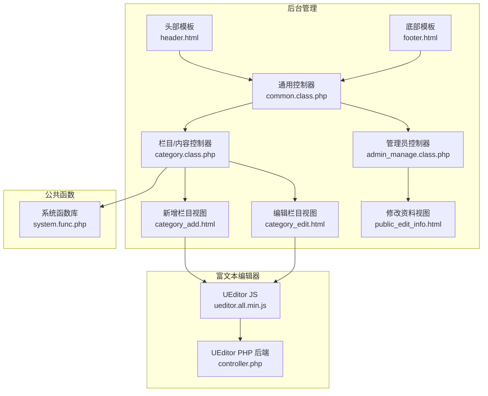
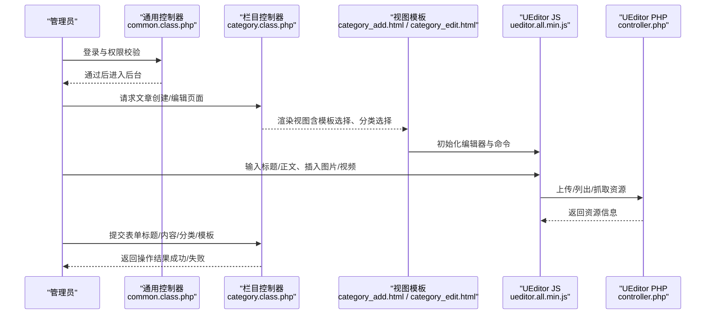
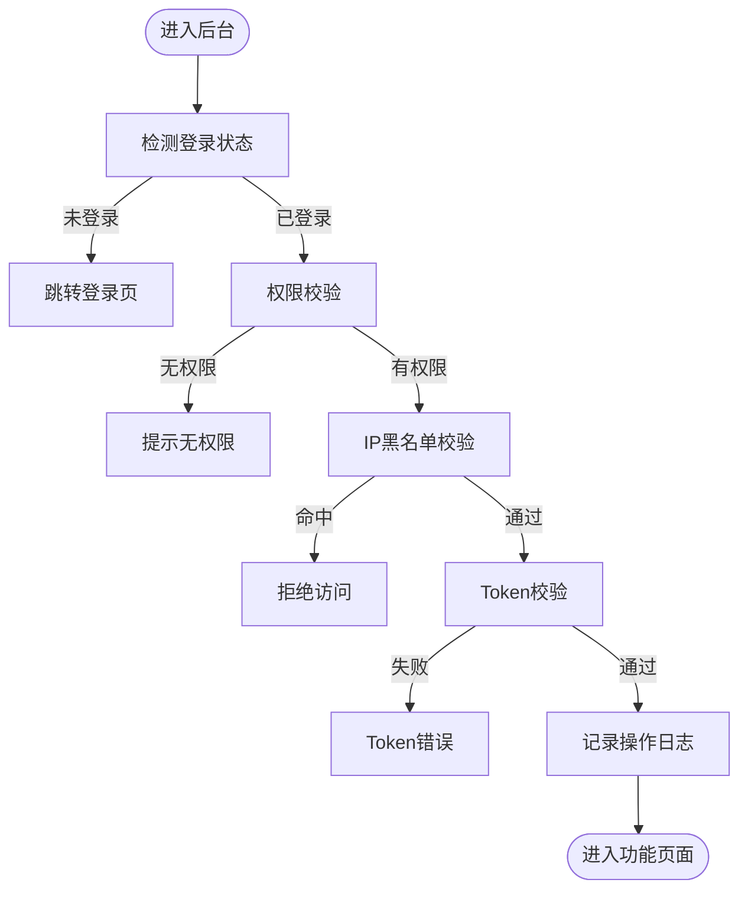
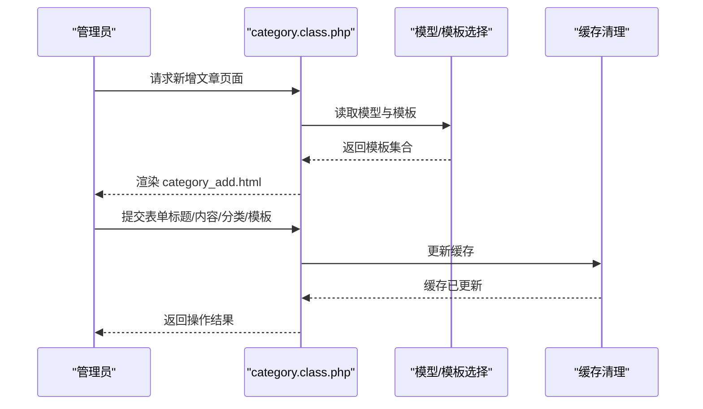
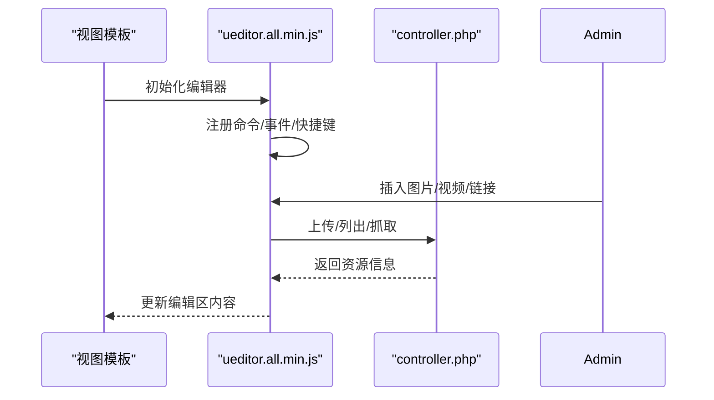
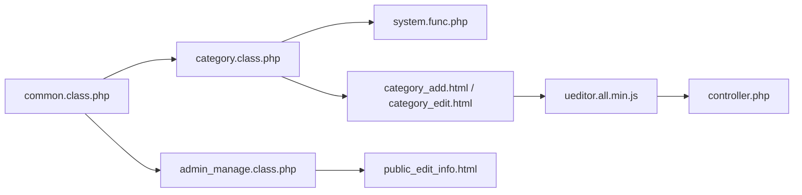

# 文章创建与编辑

<cite>
**本文引用的文件**   
- [common.class.php](file://application/lry_admin_center/controller/common.class.php)
- [admin_manage.class.php](file://application/lry_admin_center/controller/admin_manage.class.php)
- [category.class.php](file://application/lry_admin_center/controller/category.class.php)
- [category_add.html](file://application/lry_admin_center/view/category_add.html)
- [category_edit.html](file://application/lry_admin_center/view/category_edit.html)
- [public_edit_info.html](file://application/lry_admin_center/view/public_edit_info.html)
- [header.html](file://application/lry_admin_center/view/header.html)
- [footer.html](file://application/lry_admin_center/view/footer.html)
- [system.func.php](file://common/function/system.func.php)
- [ueditor.all.min.js](file://common/static/plugin/ueditor/ueditor.all.min.js)
- [controller.php](file://common/static/plugin/ueditor/php/controller.php)
</cite>

## 目录
1. [引言](#引言)
2. [项目结构](#项目结构)
3. [核心组件](#核心组件)
4. [架构总览](#架构总览)
5. [详细组件分析](#详细组件分析)
6. [依赖关系分析](#依赖关系分析)
7. [性能考虑](#性能考虑)
8. [故障排查指南](#故障排查指南)
9. [结论](#结论)
10. [附录](#附录)

## 引言
本技术文档围绕 LRYBlog 内容管理系统的“文章创建与编辑”能力，系统性梳理从前端编辑器到后端控制器、模板视图与富文本上传的完整流程。重点覆盖以下方面：
- 文章创建流程：标题输入、内容编辑、分类选择、标签添加等基础操作
- 富文本编辑器 UEditor 的使用：工具栏、图片上传、多媒体插入、内容格式化
- 草稿保存机制：自动保存与手动保存策略
- 内容格式化：段落、字体、链接等编辑功能
- 预览机制：编辑态预览与最终发布
- 错误处理与数据校验：权限、参数、上传、模板选择等
- 实操指引：结合模板与控制器，帮助管理员快速上手

## 项目结构
LRYBlog 采用 MVC 架构，后台管理位于 application/lry_admin_center，前端编辑器位于 common/static/plugin/ueditor。核心入口与路由由通用控制器 common.class.php 统一鉴权与拦截，文章相关页面通过 category_* 视图与控制器协作完成。

**图表来源**
- [common.class.php:1-153](file://application/lry_admin_center/controller/common.class.php#L1-L153)
- [category.class.php:1-580](file://application/lry_admin_center/controller/category.class.php#L1-L580)
- [admin_manage.class.php:1-105](file://application/lry_admin_center/controller/admin_manage.class.php#L1-L105)
- [category_add.html:1-329](file://application/lry_admin_center/view/category_add.html#L1-L329)
- [category_edit.html:1-308](file://application/lry_admin_center/view/category_edit.html#L1-L308)
- [public_edit_info.html:1-50](file://application/lry_admin_center/view/public_edit_info.html#L1-L50)
- [header.html:1-51](file://application/lry_admin_center/view/header.html#L1-L51)
- [footer.html:1-6](file://application/lry_admin_center/view/footer.html#L1-L6)
- [system.func.php:1-800](file://common/function/system.func.php#L1-L800)
- [ueditor.all.min.js:1-10](file://common/static/plugin/ueditor/ueditor.all.min.js#L1-L10)
- [controller.php:1-68](file://common/static/plugin/ueditor/php/controller.php#L1-L68)

**章节来源**
- [common.class.php:1-153](file://application/lry_admin_center/controller/common.class.php#L1-L153)
- [category.class.php:1-580](file://application/lry_admin_center/controller/category.class.php#L1-L580)
- [category_add.html:1-329](file://application/lry_admin_center/view/category_add.html#L1-L329)
- [category_edit.html:1-308](file://application/lry_admin_center/view/category_edit.html#L1-L308)
- [public_edit_info.html:1-50](file://application/lry_admin_center/view/public_edit_info.html#L1-L50)
- [header.html:1-51](file://application/lry_admin_center/view/header.html#L1-L51)
- [footer.html:1-6](file://application/lry_admin_center/view/footer.html#L1-L6)
- [system.func.php:1-800](file://common/function/system.func.php#L1-L800)
- [ueditor.all.min.js:1-10](file://common/static/plugin/ueditor/ueditor.all.min.js#L1-L10)
- [controller.php:1-68](file://common/static/plugin/ueditor/php/controller.php#L1-L68)

## 核心组件
- 通用控制器 common：统一鉴权、权限校验、Token 校验、日志记录、锁屏与跨域来源检查等，确保后台安全与稳定。
- 栏目/内容控制器 category：负责文章模型下的栏目管理、模板选择、URL 生成、缓存维护等；同时承载“添加内容/编辑内容”的入口与交互。
- 管理员控制器 admin_manage：提供“修改资料/修改密码”等个人中心功能，配合权限控制与数据校验。
- UEditor 富文本编辑器：前端 JS 初始化与命令执行，后端 PHP 控制器处理上传、列出、抓取等动作。
- 系统函数库 system.func：提供站点信息、模型信息、URL 生成、分类选择等通用能力，支撑视图与控制器。

**章节来源**
- [common.class.php:1-153](file://application/lry_admin_center/controller/common.class.php#L1-L153)
- [category.class.php:1-580](file://application/lry_admin_center/controller/category.class.php#L1-L580)
- [admin_manage.class.php:1-105](file://application/lry_admin_center/controller/admin_manage.class.php#L1-L105)
- [system.func.php:1-800](file://common/function/system.func.php#L1-L800)
- [ueditor.all.min.js:1-10](file://common/static/plugin/ueditor/ueditor.all.min.js#L1-L10)
- [controller.php:1-68](file://common/static/plugin/ueditor/php/controller.php#L1-L68)

## 架构总览
后台管理通过 common 控制器进行统一鉴权与安全拦截，随后由 category 控制器处理文章相关页面与操作；UEditor 前端脚本与 PHP 后端控制器协同完成富文本编辑与资源上传；system.func 提供底层支撑。

**图表来源**
- [common.class.php:1-153](file://application/lry_admin_center/controller/common.class.php#L1-L153)
- [category.class.php:1-580](file://application/lry_admin_center/controller/category.class.php#L1-L580)
- [category_add.html:1-329](file://application/lry_admin_center/view/category_add.html#L1-L329)
- [category_edit.html:1-308](file://application/lry_admin_center/view/category_edit.html#L1-L308)
- [ueditor.all.min.js:1-10](file://common/static/plugin/ueditor/ueditor.all.min.js#L1-L10)
- [controller.php:1-68](file://common/static/plugin/ueditor/php/controller.php#L1-L68)

## 详细组件分析

### 通用控制器：权限与安全
- 登录检测与跳转：iframe 嵌套检测、顶层窗口跳转、强制退出
- 权限判断：基于路由与角色的细粒度授权
- IP 黑名单：禁止登录 IP 校验
- Token 校验：POST 请求防 CSRF
- 日志记录：后台操作日志
- 锁屏与来源校验：防止跨站来源攻击

**图表来源**
- [common.class.php:32-131](file://application/lry_admin_center/controller/common.class.php#L32-L131)

**章节来源**
- [common.class.php:1-153](file://application/lry_admin_center/controller/common.class.php#L1-L153)

### 栏目/内容控制器：文章创建与编辑
- 栏目管理：新增/编辑/删除、模板选择、URL 生成、缓存维护
- 模型与模板：根据模型别名动态匹配模板集合
- URL 生成：支持多种 URL 模式与域名绑定
- 数据校验：目录唯一性、模板完整性、域名格式等

**图表来源**
- [category.class.php:144-278](file://application/lry_admin_center/controller/category.class.php#L144-L278)
- [category_add.html:1-329](file://application/lry_admin_center/view/category_add.html#L1-L329)
- [category_edit.html:1-308](file://application/lry_admin_center/view/category_edit.html#L1-L308)

**章节来源**
- [category.class.php:1-580](file://application/lry_admin_center/controller/category.class.php#L1-L580)
- [category_add.html:1-329](file://application/lry_admin_center/view/category_add.html#L1-L329)
- [category_edit.html:1-308](file://application/lry_admin_center/view/category_edit.html#L1-L308)

### 富文本编辑器：UEditor
- 初始化与命令：编辑器实例化、事件绑定、快捷键、内容同步
- 工具栏与格式化：段落、字体、链接、图片、视频等常用功能
- 上传与资源管理：图片/视频/文件上传、列出、抓取远程资源
- 输出与过滤：HTML 解析、输出规则、输入规则、本地存储偏好

**图表来源**
- [ueditor.all.min.js:1-10](file://common/static/plugin/ueditor/ueditor.all.min.js#L1-L10)
- [controller.php:20-55](file://common/static/plugin/ueditor/php/controller.php#L20-L55)

**章节来源**
- [ueditor.all.min.js:1-10](file://common/static/plugin/ueditor/ueditor.all.min.js#L1-L10)
- [controller.php:1-68](file://common/static/plugin/ueditor/php/controller.php#L1-L68)

### 系统函数库：支撑能力
- 站点与模型：站点 URL、SEO、模型信息、默认模型
- URL 生成：内容页 URL、移动端 URL、标签 URL
- 分类选择：select_category 生成下拉树、禁用规则
- 附件与下载：远程图片下载、附件关联更新
- 缓存与映射：站点映射、分类缓存、URL 规则

**章节来源**
- [system.func.php:1-800](file://common/function/system.func.php#L1-L800)

### 视图模板：文章创建与编辑界面
- 新增/编辑栏目视图：包含模型选择、分类选择、模板选择、SEO 设置、域名绑定等
- 头部/底部模板：统一导航、用户菜单、皮肤切换、消息提醒
- 修改资料视图：AJAX 提交、邮箱格式校验、返回消息

**章节来源**
- [category_add.html:1-329](file://application/lry_admin_center/view/category_add.html#L1-L329)
- [category_edit.html:1-308](file://application/lry_admin_center/view/category_edit.html#L1-L308)
- [header.html:1-51](file://application/lry_admin_center/view/header.html#L1-L51)
- [footer.html:1-6](file://application/lry_admin_center/view/footer.html#L1-L6)
- [public_edit_info.html:1-50](file://application/lry_admin_center/view/public_edit_info.html#L1-L50)

## 依赖关系分析
- common 控制器为所有后台功能提供统一安全层，避免绕过
- category 控制器依赖 system.func 的模型与 URL 生成能力
- 视图模板依赖 jQuery、Layer、H-ui 等前端库与 UEditor
- UEditor 后端控制器依赖系统配置与上传类型处理

**图表来源**
- [common.class.php:1-153](file://application/lry_admin_center/controller/common.class.php#L1-L153)
- [category.class.php:1-580](file://application/lry_admin_center/controller/category.class.php#L1-L580)
- [system.func.php:1-800](file://common/function/system.func.php#L1-L800)
- [category_add.html:1-329](file://application/lry_admin_center/view/category_add.html#L1-L329)
- [category_edit.html:1-308](file://application/lry_admin_center/view/category_edit.html#L1-L308)
- [public_edit_info.html:1-50](file://application/lry_admin_center/view/public_edit_info.html#L1-L50)
- [ueditor.all.min.js:1-10](file://common/static/plugin/ueditor/ueditor.all.min.js#L1-L10)
- [controller.php:1-68](file://common/static/plugin/ueditor/php/controller.php#L1-L68)

**章节来源**
- [common.class.php:1-153](file://application/lry_admin_center/controller/common.class.php#L1-L153)
- [category.class.php:1-580](file://application/lry_admin_center/controller/category.class.php#L1-L580)
- [system.func.php:1-800](file://common/function/system.func.php#L1-L800)
- [category_add.html:1-329](file://application/lry_admin_center/view/category_add.html#L1-L329)
- [category_edit.html:1-308](file://application/lry_admin_center/view/category_edit.html#L1-L308)
- [public_edit_info.html:1-50](file://application/lry_admin_center/view/public_edit_info.html#L1-L50)
- [ueditor.all.min.js:1-10](file://common/static/plugin/ueditor/ueditor.all.min.js#L1-L10)
- [controller.php:1-68](file://common/static/plugin/ueditor/php/controller.php#L1-L68)

## 性能考虑
- 缓存策略：分类信息、站点映射、配置项均采用文件缓存，降低数据库压力
- 模板选择：按模型别名动态匹配模板，避免硬编码路径
- URL 生成：根据站点与模式生成，减少重复计算
- 上传限制：后端根据系统配置限制文件大小与类型，避免异常资源占用

[本节为通用建议，无需特定文件引用]

## 故障排查指南
- 登录与权限问题
  - 现象：无法进入后台或提示无权限
  - 排查：确认登录状态、角色权限、Token 是否正确
  - 参考：[common.class.php:32-131](file://application/lry_admin_center/controller/common.class.php#L32-L131)
- 栏目创建失败
  - 现象：提交后提示“该栏目已存在/模板未选择/域名格式错误”
  - 排查：检查目录唯一性、模板完整性、域名格式
  - 参考：[category.class.php:150-234](file://application/lry_admin_center/controller/category.class.php#L150-L234)，[category_add.html:267-321](file://application/lry_admin_center/view/category_add.html#L267-L321)
- 富文本上传异常
  - 现象：图片/视频上传失败或返回错误
  - 排查：检查上传类型、大小限制、后端 action 配置
  - 参考：[controller.php:14-18](file://common/static/plugin/ueditor/php/controller.php#L14-L18)，[controller.php:20-55](file://common/static/plugin/ueditor/php/controller.php#L20-L55)
- 预览与发布
  - 现象：编辑后预览不一致或发布后链接异常
  - 排查：核对 URL 模式、域名绑定、缓存是否刷新
  - 参考：[system.func.php:65-74](file://common/function/system.func.php#L65-L74)，[category.class.php:463-468](file://application/lry_admin_center/controller/category.class.php#L463-L468)

**章节来源**
- [common.class.php:1-153](file://application/lry_admin_center/controller/common.class.php#L1-L153)
- [category.class.php:1-580](file://application/lry_admin_center/controller/category.class.php#L1-L580)
- [category_add.html:1-329](file://application/lry_admin_center/view/category_add.html#L1-L329)
- [controller.php:1-68](file://common/static/plugin/ueditor/php/controller.php#L1-L68)
- [system.func.php:1-800](file://common/function/system.func.php#L1-L800)

## 结论
LRYBlog 的文章创建与编辑体系以安全可控为核心，通过统一的后台安全层、灵活的栏目与模板管理、完善的富文本编辑与上传能力，以及系统化的缓存与 URL 生成机制，为管理员提供了高效稳定的写作与发布体验。遵循本文档的操作与排障指引，可快速掌握文章创建与编辑的关键流程与最佳实践。

[本节为总结，无需特定文件引用]

## 附录
- 操作截图建议
  - 登录与后台首页：[header.html:1-51](file://application/lry_admin_center/view/header.html#L1-L51)
  - 新增文章页面：[category_add.html:1-329](file://application/lry_admin_center/view/category_add.html#L1-L329)
  - 编辑文章页面：[category_edit.html:1-308](file://application/lry_admin_center/view/category_edit.html#L1-L308)
  - 修改资料页面：[public_edit_info.html:1-50](file://application/lry_admin_center/view/public_edit_info.html#L1-L50)
- 关键代码片段路径
  - UEditor 初始化与命令：[ueditor.all.min.js:1-10](file://common/static/plugin/ueditor/ueditor.all.min.js#L1-L10)
  - UEditor 后端控制器：[controller.php:1-68](file://common/static/plugin/ueditor/php/controller.php#L1-L68)
  - 栏目新增逻辑：[category.class.php:144-278](file://application/lry_admin_center/controller/category.class.php#L144-L278)
  - 栏目编辑逻辑：[category.class.php:344-428](file://application/lry_admin_center/controller/category.class.php#L344-L428)
  - 修改资料提交：[admin_manage.class.php:49-64](file://application/lry_admin_center/controller/admin_manage.class.php#L49-L64)