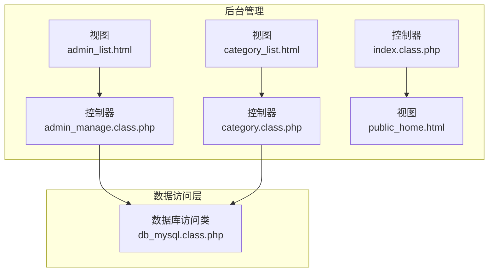
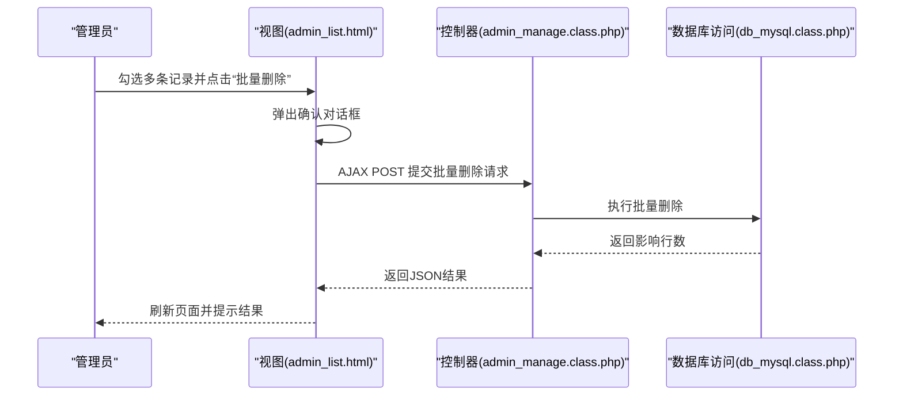
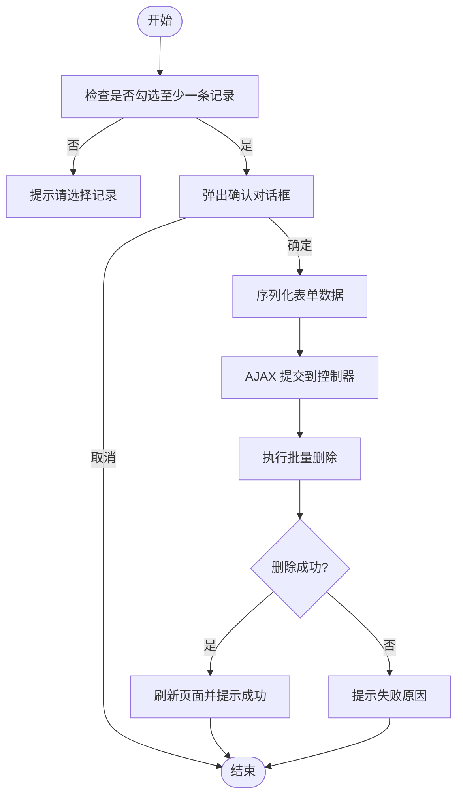
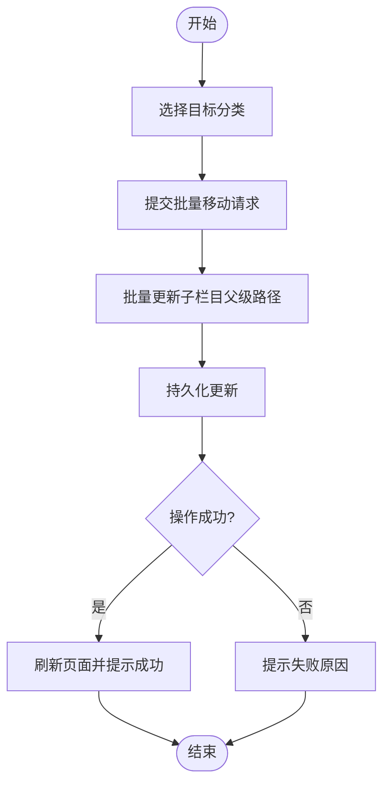
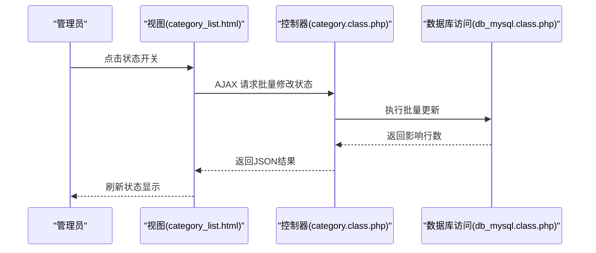
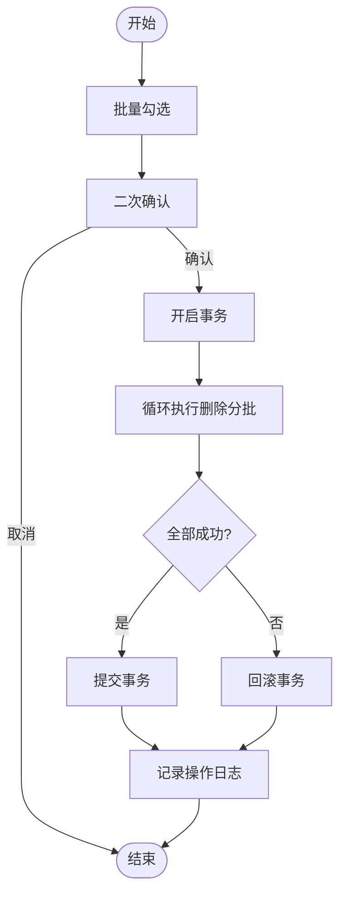
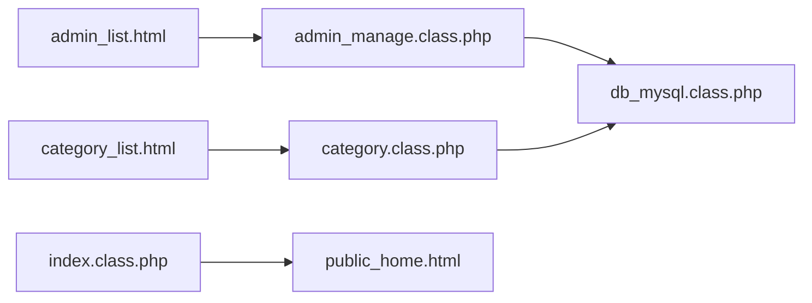

# 文章批量操作

<cite>
**本文引用的文件**
- [application/lry_admin_center/controller/admin_manage.class.php](file://application/lry_admin_center/controller/admin_manage.class.php)
- [application/lry_admin_center/view/admin_list.html](file://application/lry_admin_center/view/admin_list.html)
- [application/lry_admin_center/controller/index.class.php](file://application/lry_admin_center/controller/index.class.php)
- [application/lry_admin_center/view/category_list.html](file://application/lry_admin_center/view/category_list.html)
- [application/lry_admin_center/controller/category.class.php](file://application/lry_admin_center/controller/category.class.php)
- [ryphp/core/class/db_mysql.class.php](file://ryphp/core/class/db_mysql.class.php)
- [application/lry_admin_center/view/public_home.html](file://application/lry_admin_center/view/public_home.html)
</cite>

## 目录
1. [简介](#简介)
2. [项目结构](#项目结构)
3. [核心组件](#核心组件)
4. [架构总览](#架构总览)
5. [详细组件分析](#详细组件分析)
6. [依赖关系分析](#依赖关系分析)
7. [性能考虑](#性能考虑)
8. [故障排查指南](#故障排查指南)
9. [结论](#结论)
10. [附录](#附录)

## 简介
本技术文档围绕 LRYBlog 的“文章批量操作”能力展开，重点覆盖以下方面：
- 批量操作的适用场景与价值：提升内容管理效率、降低重复劳动、统一维护口径。
- 批量删除：批量选择、确认对话框、删除确认与回滚思路。
- 批量移动分类：分类选择、批量转移、关联更新策略。
- 批量状态修改：批量发布、批量下架、批量审核等状态变更。
- 安全机制：权限校验、操作确认、日志记录。
- 性能优化：大数据量处理、内存管理、操作超时控制。
- 实战场景与最佳实践：帮助管理员高效管理大量文章。

说明：当前仓库未直接提供“文章内容”的批量管理控制器与视图文件。本文以现有“管理员列表”和“栏目管理”中的批量操作实现为参考，给出可复用的架构设计与流程规范，并对“文章内容”批量操作提出可落地的实施方案与注意事项。

## 项目结构
LRYBlog 后台采用 MVC 架构，批量操作相关能力主要分布在：
- 控制器层：后台管理控制器（如管理员管理、栏目管理）承载批量操作入口与业务逻辑。
- 视图层：HTML 模板中包含批量操作 UI（勾选、确认弹窗、AJAX 提交）。
- 数据访问层：数据库访问类提供批量插入、批量删除、批量更新等底层支持。
- 公共工具与安全：登录鉴权、验证码、日志记录等保障批量操作安全。

**图表来源**
- [application/lry_admin_center/controller/admin_manage.class.php:11-44](file://application/lry_admin_center/controller/admin_manage.class.php#L11-L44)
- [application/lry_admin_center/view/admin_list.html:40-135](file://application/lry_admin_center/view/admin_list.html#L40-L135)
- [application/lry_admin_center/controller/category.class.php:359-453](file://application/lry_admin_center/controller/category.class.php#L359-L453)
- [application/lry_admin_center/view/category_list.html:16-43](file://application/lry_admin_center/view/category_list.html#L16-L43)
- [ryphp/core/class/db_mysql.class.php:290-379](file://ryphp/core/class/db_mysql.class.php#L290-L379)
- [application/lry_admin_center/controller/index.class.php:19-38](file://application/lry_admin_center/controller/index.class.php#L19-L38)
- [application/lry_admin_center/view/public_home.html:25-54](file://application/lry_admin_center/view/public_home.html#L25-L54)

**章节来源**
- [application/lry_admin_center/controller/admin_manage.class.php:11-44](file://application/lry_admin_center/controller/admin_manage.class.php#L11-L44)
- [application/lry_admin_center/view/admin_list.html:40-135](file://application/lry_admin_center/view/admin_list.html#L40-L135)
- [application/lry_admin_center/controller/category.class.php:359-453](file://application/lry_admin_center/controller/category.class.php#L359-L453)
- [application/lry_admin_center/view/category_list.html:16-43](file://application/lry_admin_center/view/category_list.html#L16-L43)
- [ryphp/core/class/db_mysql.class.php:290-379](file://ryphp/core/class/db_mysql.class.php#L290-L379)
- [application/lry_admin_center/controller/index.class.php:19-38](file://application/lry_admin_center/controller/index.class.php#L19-L38)
- [application/lry_admin_center/view/public_home.html:25-54](file://application/lry_admin_center/view/public_home.html#L25-L54)

## 核心组件
- 批量删除（管理员列表）
  - 勾选多条记录，弹出确认对话框，AJAX 提交批量删除请求，成功后刷新页面。
  - 参考：[批量删除脚本与确认弹窗:106-135](file://application/lry_admin_center/view/admin_list.html#L106-L135)，[提交处理入口:11-44](file://application/lry_admin_center/controller/admin_manage.class.php#L11-L44)。

- 批量移动分类（栏目管理）
  - 勾选多条记录，弹出目标分类选择框，提交后执行批量转移与关联更新。
  - 参考：[批量移动脚本与提交:106-135](file://application/lry_admin_center/view/admin_list.html#L106-L135)，[批量更新子栏目路径逻辑:359-428](file://application/lry_admin_center/controller/category.class.php#L359-L428)。

- 批量状态修改（栏目管理）
  - 通过点击状态开关批量修改显示状态、允许投稿等字段。
  - 参考：[状态切换调用:75-81](file://application/lry_admin_center/view/category_list.html#L75-L81)，[状态字段渲染:102-109](file://application/lry_admin_center/controller/category.class.php#L102-L109)。

- 数据库批量能力
  - 支持批量插入、批量删除、批量更新，便于实现高性能批量操作。
  - 参考：[批量插入:290-317](file://ryphp/core/class/db_mysql.class.php#L290-L317)，[批量删除:320-347](file://ryphp/core/class/db_mysql.class.php#L320-L347)，[批量更新:350-379](file://ryphp/core/class/db_mysql.class.php#L350-L379)。

**章节来源**
- [application/lry_admin_center/view/admin_list.html:106-135](file://application/lry_admin_center/view/admin_list.html#L106-L135)
- [application/lry_admin_center/controller/admin_manage.class.php:11-44](file://application/lry_admin_center/controller/admin_manage.class.php#L11-L44)
- [application/lry_admin_center/view/category_list.html:75-81](file://application/lry_admin_center/view/category_list.html#L75-L81)
- [application/lry_admin_center/controller/category.class.php:102-109](file://application/lry_admin_center/controller/category.class.php#L102-L109)
- [ryphp/core/class/db_mysql.class.php:290-379](file://ryphp/core/class/db_mysql.class.php#L290-L379)

## 架构总览
下图展示了“批量删除”在管理员列表中的端到端流程：前端勾选、弹窗确认、AJAX 提交、控制器处理、数据库操作与响应反馈。

**图表来源**
- [application/lry_admin_center/view/admin_list.html:106-135](file://application/lry_admin_center/view/admin_list.html#L106-L135)
- [application/lry_admin_center/controller/admin_manage.class.php:11-44](file://application/lry_admin_center/controller/admin_manage.class.php#L11-L44)
- [ryphp/core/class/db_mysql.class.php:320-347](file://ryphp/core/class/db_mysql.class.php#L320-L347)

## 详细组件分析

### 批量删除（管理员列表）
- 勾选与提交
  - 视图中提供全选与逐项勾选，提交时序列化表单数据。
  - 参考：[批量删除脚本:106-135](file://application/lry_admin_center/view/admin_list.html#L106-L135)，[表单序列化与AJAX提交:117-133](file://application/lry_admin_center/view/admin_list.html#L117-L133)。
- 控制器处理
  - 控制器接收批量 ID，构造删除条件，调用数据库访问类执行删除。
  - 参考：[控制器入口与分页查询:11-44](file://application/lry_admin_center/controller/admin_manage.class.php#L11-L44)，[批量删除底层实现:320-347](file://ryphp/core/class/db_mysql.class.php#L320-L347)。
- 确认与回滚
  - 建议在控制器侧增加二次确认（如二次弹窗或令牌校验），并在事务型存储引擎上使用事务包裹，失败时回滚。
  - 参考：[批量删除脚本中的确认弹窗:106-135](file://application/lry_admin_center/view/admin_list.html#L106-L135)。

**图表来源**
- [application/lry_admin_center/view/admin_list.html:106-135](file://application/lry_admin_center/view/admin_list.html#L106-L135)
- [application/lry_admin_center/controller/admin_manage.class.php:11-44](file://application/lry_admin_center/controller/admin_manage.class.php#L11-L44)
- [ryphp/core/class/db_mysql.class.php:320-347](file://ryphp/core/class/db_mysql.class.php#L320-L347)

**章节来源**
- [application/lry_admin_center/view/admin_list.html:106-135](file://application/lry_admin_center/view/admin_list.html#L106-L135)
- [application/lry_admin_center/controller/admin_manage.class.php:11-44](file://application/lry_admin_center/controller/admin_manage.class.php#L11-L44)
- [ryphp/core/class/db_mysql.class.php:320-347](file://ryphp/core/class/db_mysql.class.php#L320-L347)

### 批量移动分类（栏目管理）
- 分类选择与提交
  - 视图提供目标分类选择框，提交后通过 AJAX 将所选记录批量移动到新分类。
  - 参考：[批量移动脚本:106-135](file://application/lry_admin_center/view/admin_list.html#L106-L135)。
- 关联更新与路径修复
  - 当父分类变更时，需要批量更新所有子栏目的父级路径字段，确保整棵树的路径连续正确。
  - 参考：[批量更新子栏目路径逻辑:359-428](file://application/lry_admin_center/controller/category.class.php#L359-L428)。

**图表来源**
- [application/lry_admin_center/view/admin_list.html:106-135](file://application/lry_admin_center/view/admin_list.html#L106-L135)
- [application/lry_admin_center/controller/category.class.php:359-428](file://application/lry_admin_center/controller/category.class.php#L359-L428)

**章节来源**
- [application/lry_admin_center/view/admin_list.html:106-135](file://application/lry_admin_center/view/admin_list.html#L106-L135)
- [application/lry_admin_center/controller/category.class.php:359-428](file://application/lry_admin_center/controller/category.class.php#L359-L428)

### 批量状态修改（栏目管理）
- 状态切换
  - 通过点击状态开关批量修改显示状态、允许投稿等字段，适合快速批量发布/下架/审核。
  - 参考：[状态切换调用:75-81](file://application/lry_admin_center/view/category_list.html#L75-L81)，[状态字段渲染:102-109](file://application/lry_admin_center/controller/category.class.php#L102-L109)。
- 批量更新
  - 使用数据库批量更新接口一次性修改多个记录的状态字段。
  - 参考：[批量更新接口:350-379](file://ryphp/core/class/db_mysql.class.php#L350-L379)。

**图表来源**
- [application/lry_admin_center/view/category_list.html:75-81](file://application/lry_admin_center/view/category_list.html#L75-L81)
- [application/lry_admin_center/controller/category.class.php:102-109](file://application/lry_admin_center/controller/category.class.php#L102-L109)
- [ryphp/core/class/db_mysql.class.php:350-379](file://ryphp/core/class/db_mysql.class.php#L350-L379)

**章节来源**
- [application/lry_admin_center/view/category_list.html:75-81](file://application/lry_admin_center/view/category_list.html#L75-L81)
- [application/lry_admin_center/controller/category.class.php:102-109](file://application/lry_admin_center/controller/category.class.php#L102-L109)
- [ryphp/core/class/db_mysql.class.php:350-379](file://ryphp/core/class/db_mysql.class.php#L350-L379)

### 批量删除（概念性流程）
- 适用场景：清理过期内容、批量迁移、批量归档。
- 流程要点：二次确认、事务包裹、失败回滚、日志记录。
- 大数据量处理：分批删除、索引优化、避免长事务。

[本图为概念性流程，无需图表来源]

## 依赖关系分析
- 视图依赖控制器：批量操作的交互由视图触发，控制器负责业务处理。
- 控制器依赖数据访问层：批量操作最终落到数据库访问类提供的批量接口。
- 登录与权限：后台登录与权限控制由公共控制器与视图首页体现，批量操作应在登录态下进行。
- 日志记录：批量操作应记录管理员操作日志，便于审计与回溯。

**图表来源**
- [application/lry_admin_center/view/admin_list.html:40-135](file://application/lry_admin_center/view/admin_list.html#L40-L135)
- [application/lry_admin_center/controller/admin_manage.class.php:11-44](file://application/lry_admin_center/controller/admin_manage.class.php#L11-L44)
- [application/lry_admin_center/view/category_list.html:16-43](file://application/lry_admin_center/view/category_list.html#L16-L43)
- [application/lry_admin_center/controller/category.class.php:359-453](file://application/lry_admin_center/controller/category.class.php#L359-L453)
- [ryphp/core/class/db_mysql.class.php:290-379](file://ryphp/core/class/db_mysql.class.php#L290-L379)
- [application/lry_admin_center/controller/index.class.php:19-38](file://application/lry_admin_center/controller/index.class.php#L19-L38)
- [application/lry_admin_center/view/public_home.html:25-54](file://application/lry_admin_center/view/public_home.html#L25-L54)

**章节来源**
- [application/lry_admin_center/view/admin_list.html:40-135](file://application/lry_admin_center/view/admin_list.html#L40-L135)
- [application/lry_admin_center/controller/admin_manage.class.php:11-44](file://application/lry_admin_center/controller/admin_manage.class.php#L11-L44)
- [application/lry_admin_center/view/category_list.html:16-43](file://application/lry_admin_center/view/category_list.html#L16-L43)
- [application/lry_admin_center/controller/category.class.php:359-453](file://application/lry_admin_center/controller/category.class.php#L359-L453)
- [ryphp/core/class/db_mysql.class.php:290-379](file://ryphp/core/class/db_mysql.class.php#L290-L379)
- [application/lry_admin_center/controller/index.class.php:19-38](file://application/lry_admin_center/controller/index.class.php#L19-L38)
- [application/lry_admin_center/view/public_home.html:25-54](file://application/lry_admin_center/view/public_home.html#L25-L54)

## 性能考虑
- 大数据量处理
  - 分批处理：将大批量操作拆分为若干小批次，避免长时间占用数据库连接。
  - 索引优化：确保批量操作涉及的字段（如主键、状态、分类 ID）具备合适索引。
  - 非阻塞：前端采用异步提交与进度提示，避免页面卡顿。
- 内存管理
  - 批量更新/删除时避免一次性加载过多数据到内存，优先使用游标或分页方式。
- 操作超时控制
  - 设置合理的 AJAX 超时时间与重试策略，失败时提示用户并记录日志。
- 事务与回滚
  - 对关键批量操作使用事务包裹，失败即回滚，减少脏数据风险。

[本节为通用性能建议，无需章节来源]

## 故障排查指南
- 权限不足
  - 确认管理员已登录且具备相应权限；登录与权限控制由公共控制器与首页视图体现。
  - 参考：[登录处理:19-38](file://application/lry_admin_center/controller/index.class.php#L19-L38)，[首页统计入口:25-54](file://application/lry_admin_center/view/public_home.html#L25-L54)。
- 操作未生效
  - 检查前端是否正确序列化表单数据并提交；查看浏览器网络面板与后端日志。
  - 参考：[批量删除脚本:106-135](file://application/lry_admin_center/view/admin_list.html#L106-L135)。
- 数据异常
  - 批量删除/移动后出现数据不一致，检查数据库事务与回滚逻辑，必要时手动修复。
  - 参考：[批量删除底层实现:320-347](file://ryphp/core/class/db_mysql.class.php#L320-L347)，[批量更新底层实现:350-379](file://ryphp/core/class/db_mysql.class.php#L350-L379)。

**章节来源**
- [application/lry_admin_center/controller/index.class.php:19-38](file://application/lry_admin_center/controller/index.class.php#L19-L38)
- [application/lry_admin_center/view/public_home.html:25-54](file://application/lry_admin_center/view/public_home.html#L25-L54)
- [application/lry_admin_center/view/admin_list.html:106-135](file://application/lry_admin_center/view/admin_list.html#L106-L135)
- [ryphp/core/class/db_mysql.class.php:320-379](file://ryphp/core/class/db_mysql.class.php#L320-L379)

## 结论
- 批量操作是提升内容管理效率的关键手段，应结合“勾选 + 确认 + 异步提交 + 底层批量接口”形成闭环。
- 安全与稳定是批量操作的核心要求：权限校验、二次确认、日志记录、事务回滚缺一不可。
- 面向“文章内容”的批量操作，可在现有“管理员列表”和“栏目管理”的批量实现基础上，扩展对应控制器与视图，遵循相同的架构与安全规范。

[本节为总结性内容，无需章节来源]

## 附录
- 最佳实践清单
  - 每次批量操作前进行二次确认，避免误删误改。
  - 大批量操作建议在低峰时段执行，并设置分批与超时控制。
  - 记录批量操作日志，包含操作人、时间、影响范围与结果。
  - 对关键批量操作使用事务包裹，失败立即回滚。
  - 保持前端交互友好，提供进度提示与错误反馈。

[本节为通用建议，无需章节来源]