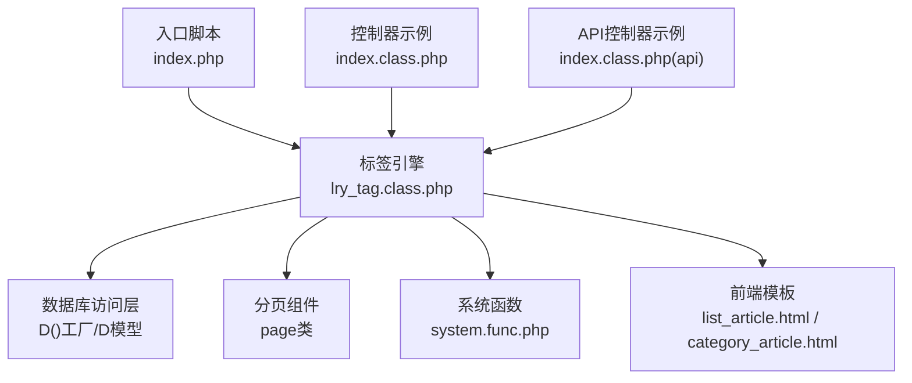
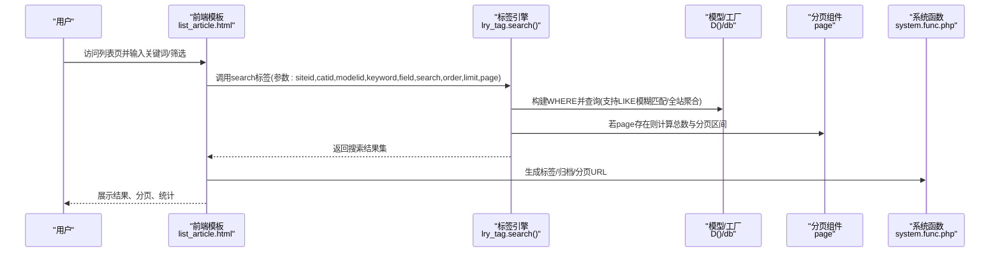
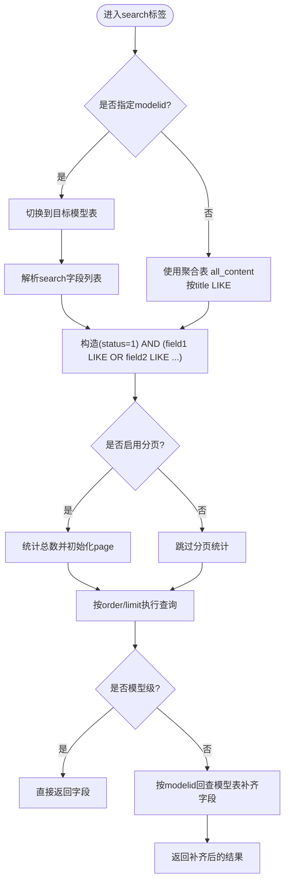
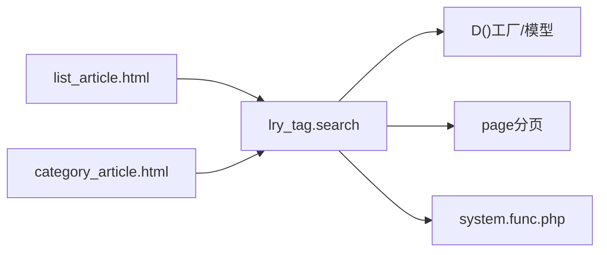

# 文章搜索与筛选

<cite>
**本文引用的文件**
- [index.php](file://index.php)
- [lry_tag.class.php](file://ryphp/core/class/lry_tag.class.php)
- [system.func.php](file://common/function/system.func.php)
- [list_article.html](file://application/index/view/rongyao/list_article.html)
- [category_article.html](file://application/index/view/rongyao/category_article.html)
- [index.class.php](file://application/index/controller/index.class.php)
- [index.class.php(api)](file://application/api/controller/index.class.php)
</cite>

## 目录
1. [简介](#简介)
2. [项目结构](#项目结构)
3. [核心组件](#核心组件)
4. [架构总览](#架构总览)
5. [详细组件分析](#详细组件分析)
6. [依赖关系分析](#依赖关系分析)
7. [性能考量](#性能考量)
8. [故障排除指南](#故障排除指南)
9. [结论](#结论)
10. [附录](#附录)

## 简介
本文件面向LRYBlog的文章搜索与筛选功能，系统性梳理从请求入口、标签引擎、数据模型到前端展示的完整链路，覆盖全文检索、模糊匹配、精确查找、多维度过滤、组合条件、分页与排序、结果统计等能力，并给出性能优化与运维排障建议，帮助管理员高效使用搜索工具。

## 项目结构
围绕搜索功能的关键位置如下：
- 应用入口与路由初始化：index.php
- 搜索标签引擎：ryphp/core/class/lry_tag.class.php
- 系统函数与URL生成：common/function/system.func.php
- 前端列表模板：application/index/view/rongyao/list_article.html
- 分类列表模板：application/index/view/rongyao/category_article.html
- 控制器示例：application/index/controller/index.class.php
- API控制器示例：application/api/controller/index.class.php

图表来源
- [index.php:1-18](file://index.php#L1-L18)
- [lry_tag.class.php:1-492](file://ryphp/core/class/lry_tag.class.php#L1-L492)
- [system.func.php:240-250](file://common/function/system.func.php#L240-L250)
- [list_article.html:1-150](file://application/index/view/rongyao/list_article.html#L1-L150)
- [category_article.html:1-53](file://application/index/view/rongyao/category_article.html#L1-L53)
- [index.class.php:1-18](file://application/index/controller/index.class.php#L1-L18)
- [index.class.php(api):1-22](file://application/api/controller/index.class.php#L1-L22)

章节来源
- [index.php:1-18](file://index.php#L1-L18)
- [lry_tag.class.php:1-492](file://ryphp/core/class/lry_tag.class.php#L1-L492)
- [system.func.php:240-250](file://common/function/system.func.php#L240-L250)
- [list_article.html:1-150](file://application/index/view/rongyao/list_article.html#L1-L150)
- [category_article.html:1-53](file://application/index/view/rongyao/category_article.html#L1-L53)
- [index.class.php:1-18](file://application/index/controller/index.class.php#L1-L18)
- [index.class.php(api):1-22](file://application/api/controller/index.class.php#L1-L22)

## 核心组件
- 搜索标签引擎：提供统一的search标签接口，支持站点级、模型级、分类级、关键词、字段、排序、分页等参数化查询。
- 数据模型与工厂：通过D()工厂与具体模型交互，支持全站聚合表(all_content)与按模型拆分的表。
- 分页组件：基于总数计算分页区间，支持列表页分页展示。
- 系统函数：提供URL生成、分类选择、标签链接等辅助能力。
- 前端模板：负责渲染搜索结果、分页控件、标签云、归档链接等。

章节来源
- [lry_tag.class.php:356-450](file://ryphp/core/class/lry_tag.class.php#L356-L450)
- [system.func.php:240-250](file://common/function/system.func.php#L240-L250)

## 架构总览
搜索请求自入口脚本进入，经由标签引擎解析参数，构建WHERE条件，执行查询并返回结果；若启用分页，则结合page类计算总条数与分页区间；最终由模板渲染结果与分页控件。

图表来源
- [lry_tag.class.php:356-450](file://ryphp/core/class/lry_tag.class.php#L356-L450)
- [system.func.php:240-250](file://common/function/system.func.php#L240-L250)
- [list_article.html:1-150](file://application/index/view/rongyao/list_article.html#L1-L150)

## 详细组件分析

### 搜索标签引擎（lry_tag.search）
- 功能要点
  - 支持站点级(siteid)、分类级(catid)、模型级(modelid)、关键词(keyword)、字段(field)、搜索字段(search，默认title)、排序(order)、分页(page)、限制(limit)等参数。
  - 模型级搜索：对多个字段进行OR连接的LIKE模糊匹配，过滤状态(status=1)，可限定分类子节点。
  - 全站搜索：当未指定modelid时，使用聚合表(all_content)按title LIKE进行模糊匹配。
  - 分页：当传入page参数时，先统计总数，再计算分页区间。
  - 结果回填：模型级直接返回字段；全站搜索需按modelid回查对应模型表以补齐字段。
  - 其他动作：支持tag与archives两类动作（非本文重点）。

- 参数与行为
  - siteid：站点标识，用于全站搜索时限定站点。
  - catid：分类ID，支持父子关系展开为IN集合。
  - modelid：模型ID，0表示全站搜索，非0表示模型级搜索。
  - keyword：关键词，用于LIKE模糊匹配。
  - search：逗号分隔的字段名列表，如"title,description"，将对这些字段做OR LIKE拼接。
  - order/limit：排序与每页条数。
  - page：是否启用分页，启用时计算总数与分页区间。

- 查询流程（模型级）

图表来源
- [lry_tag.class.php:360-408](file://ryphp/core/class/lry_tag.class.php#L360-L408)

章节来源
- [lry_tag.class.php:356-450](file://ryphp/core/class/lry_tag.class.php#L356-L450)

### 前端模板与展示
- 列表页模板
  - 使用标签引擎的lists标签渲染列表，同时在侧边栏提供标签云与归档链接，便于二次筛选。
  - 分页控件通过标签引擎的pages输出。
- 分类列表模板
  - 展示子分类下的文章列表，配合分页与排序。

章节来源
- [list_article.html:54-76](file://application/index/view/rongyao/list_article.html#L54-L76)
- [list_article.html:127-146](file://application/index/view/rongyao/list_article.html#L127-L146)
- [category_article.html:36-48](file://application/index/view/rongyao/category_article.html#L36-L48)

### URL与链接生成
- 标签链接生成：通过系统函数生成tag搜索URL，便于点击直达标签文章列表。
- 归档链接生成：通过系统函数生成按月归档的URL，便于按时间范围筛选。

章节来源
- [system.func.php:244-250](file://common/function/system.func.php#L244-L250)

### 控制器与入口
- 应用入口：index.php负责常量定义与应用初始化。
- 控制器示例：index.controller.index与index.controller.api展示了不同入口的控制器组织方式，搜索功能主要由标签引擎完成。

章节来源
- [index.php:1-18](file://index.php#L1-L18)
- [index.class.php:1-18](file://application/index/controller/index.class.php#L1-L18)
- [index.class.php(api):1-22](file://application/api/controller/index.class.php#L1-L22)

## 依赖关系分析
- 搜索标签引擎依赖
  - 数据访问：D()工厂与具体模型，支持模型切换与聚合表查询。
  - 分页：page类用于总数统计与区间计算。
  - 系统函数：URL生成、分类信息获取等。
- 前端模板依赖
  - 模板语法调用标签引擎，渲染结果与分页控件。
  - 侧边栏标签云与归档链接依赖系统函数生成URL。

图表来源
- [lry_tag.class.php:356-450](file://ryphp/core/class/lry_tag.class.php#L356-L450)
- [system.func.php:240-250](file://common/function/system.func.php#L240-L250)
- [list_article.html:1-150](file://application/index/view/rongyao/list_article.html#L1-L150)
- [category_article.html:1-53](file://application/index/view/rongyao/category_article.html#L1-L53)

## 性能考量
- 索引与查询优化
  - 模型级搜索：对多个字段进行OR LIKE拼接，可能触发全表扫描。建议在高频字段上建立合适索引，并评估是否可通过全文索引或专用搜索引擎替代。
  - 全站搜索：使用聚合表进行title LIKE，同样存在全表扫描风险。建议对聚合表的关键字段建立索引，或引入外部搜索引擎（如Elasticsearch）。
- 分页与统计
  - 启用分页时先统计总数(total)，对大数据量尤为耗时。建议在统计前增加必要条件（如分类、状态）以缩小扫描范围。
- 缓存策略
  - 对热门关键词、热门分类、热门标签的搜索结果进行短期缓存，降低重复查询压力。
  - 对归档与标签云等静态或低频更新的数据进行缓存。
- 结果回填
  - 全站搜索回填字段涉及跨模型查询，建议对热点文章ID建立内存缓存，减少重复查询。

[本节为通用性能建议，无需特定文件引用]

## 故障排除指南
- 搜索无结果
  - 检查关键词是否过短或包含特殊字符，确认status=1与catid条件是否正确。
  - 若使用模型级搜索，确认search字段列表与实际字段一致。
- 分页异常
  - 确认page参数传递与total统计逻辑，检查limit与order是否合理。
- URL无法跳转
  - 检查system.func.php中URL生成函数是否正确，确保路由与参数传递无误。
- 模板渲染问题
  - 确认模板中调用的标签参数与标签引擎期望一致，检查分页控件与结果循环是否正确。

章节来源
- [lry_tag.class.php:356-450](file://ryphp/core/class/lry_tag.class.php#L356-L450)
- [system.func.php:240-250](file://common/function/system.func.php#L240-L250)
- [list_article.html:54-76](file://application/index/view/rongyao/list_article.html#L54-L76)

## 结论
LRYBlog的搜索功能以标签引擎为核心，通过参数化查询实现站点级、模型级、分类级与关键词的灵活组合，辅以分页与URL生成，满足基础的全文检索与多维度过滤需求。针对性能瓶颈，建议在索引、缓存与查询路径上持续优化，并在必要时引入外部搜索引擎以获得更佳体验。

[本节为总结性内容，无需特定文件引用]

## 附录

### 搜索参数速查
- siteid：站点标识（全站搜索时使用）
- catid：分类ID（支持父子展开）
- modelid：模型ID（0为全站搜索，非0为模型级搜索）
- keyword：关键词（用于LIKE模糊匹配）
- search：逗号分隔的字段列表（默认title）
- field：返回字段（默认*）
- order：排序（默认id DESC）
- limit：每页条数（默认20）
- page：是否启用分页（启用时自动统计总数）

章节来源
- [lry_tag.class.php:360-368](file://ryphp/core/class/lry_tag.class.php#L360-L368)