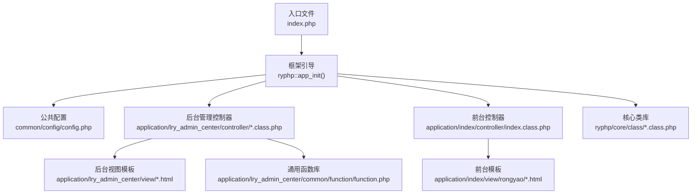
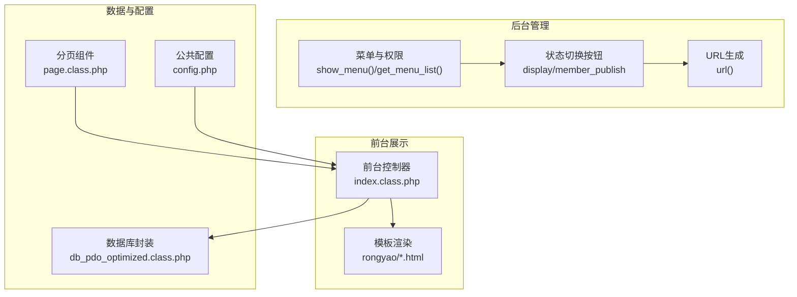
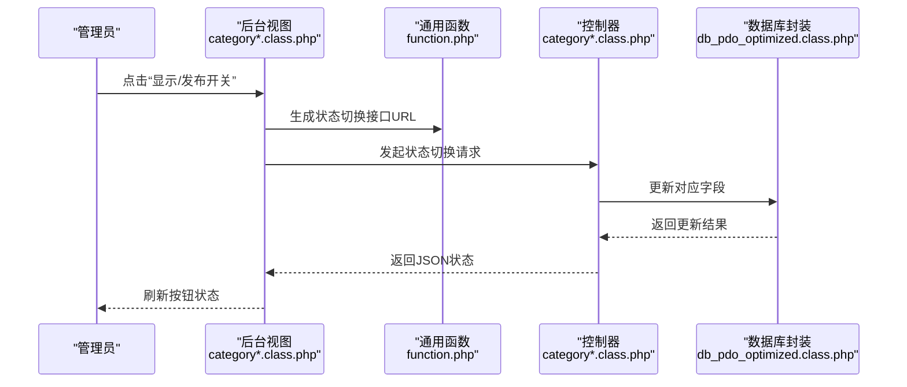
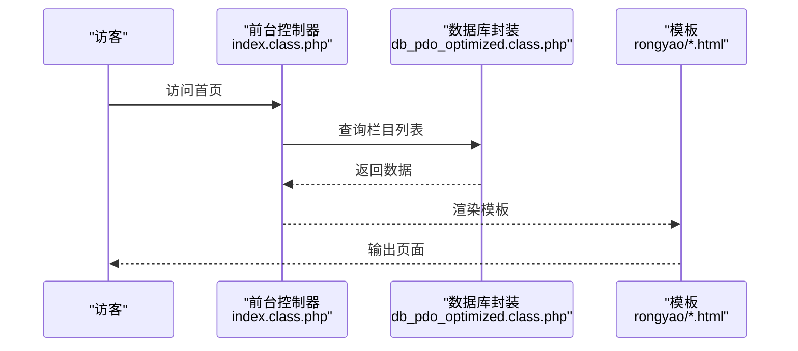
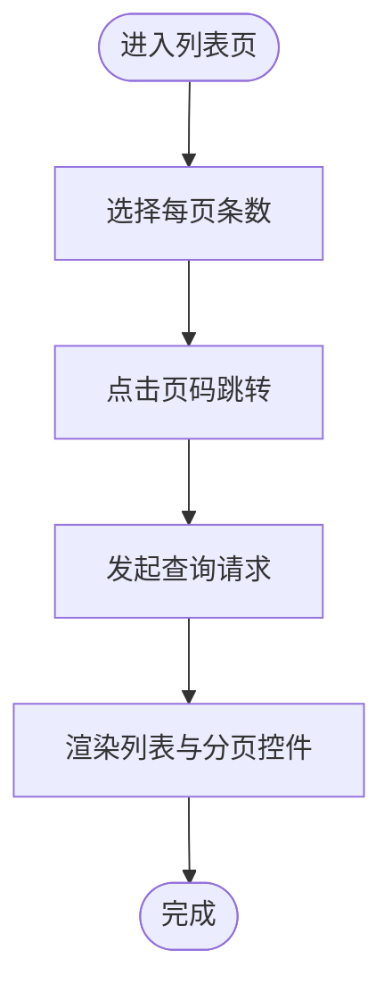
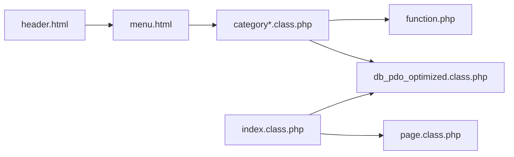
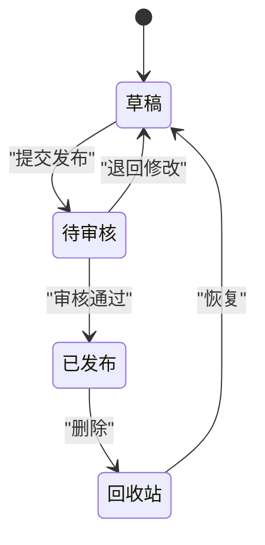
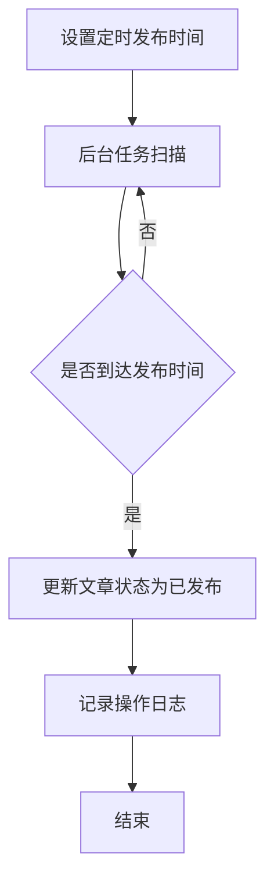
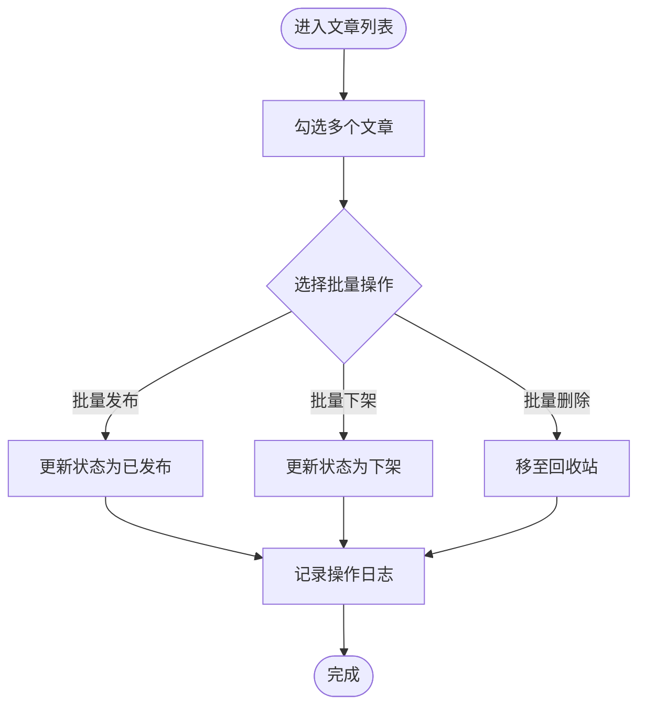

# 文章状态管理

<cite>
**本文引用的文件**
- [index.php](file://index.php)
- [config.php](file://common/config/config.php)
- [function.php](file://application/lry_admin_center/common/function/function.php)
- [header.html](file://application/lry_admin_center/view/header.html)
- [menu.html](file://application/lry_admin_center/view/menu.html)
- [index.class.php](file://application/index/controller/index.class.php)
- [category.class.php](file://application/lry_admin_center/controller/category.class.php)
- [category1.class.php](file://application/lry_admin_center/controller/category1.class.php)
- [page.class.php](file://ryphp/core/class/page.class.php)
- [db_pdo_optimized.class.php](file://ryphp/core/class/db_pdo_optimized.class.php)
</cite>

## 目录
1. [引言](#引言)
2. [项目结构](#项目结构)
3. [核心组件](#核心组件)
4. [架构总览](#架构总览)
5. [详细组件分析](#详细组件分析)
6. [依赖关系分析](#依赖关系分析)
7. [性能考量](#性能考量)
8. [故障排查指南](#故障排查指南)
9. [结论](#结论)
10. [附录](#附录)

## 引言
本技术文档围绕 LRYBlog 的“文章状态管理”能力进行系统性梳理与说明，重点覆盖以下方面：
- 文章状态的生命周期与含义：草稿、已发布、待审核、回收站等状态的定义与用途
- 状态转换机制：触发条件、权限控制、操作记录
- 定时发布：发布时间设置、自动发布机制与状态更新流程
- 批量状态管理：批量发布、批量下架、批量删除等
- 前台展示影响：状态过滤与显示规则
- 最佳实践与常见问题解决方案
- 状态流转图与操作示例

说明：当前仓库中未发现与“文章状态”直接对应的专用数据表或模型文件；状态管理在后台界面中以“栏目显示/发布开关”形式出现，但未见“文章状态”字段或定时发布任务调度实现。因此，本文在“状态管理”层面基于现有界面与通用 CMS 实践进行抽象说明，并在“定时发布”“批量管理”等环节给出可落地的实现建议与流程图。

## 项目结构
LRYBlog 采用 MVC 架构，入口文件负责应用初始化，配置集中于公共配置文件，后台管理通过控制器与视图模板协作，前台通过独立控制器提供基础接口。

图表来源
- [index.php:1-18](file://index.php#L1-L18)
- [config.php:1-88](file://common/config/config.php#L1-L88)
- [index.class.php:1-18](file://application/index/controller/index.class.php#L1-L18)
- [function.php:1-162](file://application/lry_admin_center/common/function/function.php#L1-L162)

章节来源
- [index.php:1-18](file://index.php#L1-L18)
- [config.php:1-88](file://common/config/config.php#L1-L88)
- [index.class.php:1-18](file://application/index/controller/index.class.php#L1-L18)
- [function.php:1-162](file://application/lry_admin_center/common/function/function.php#L1-L162)

## 核心组件
- 应用入口与初始化：负责加载框架内核并启动应用
- 公共配置：数据库、缓存、队列、URL 模型等全局参数
- 后台管理控制器：承载菜单、权限、状态切换等后台功能
- 前台控制器：提供基础接口与数据查询能力
- 通用函数库：URL 生成、菜单渲染、配置写入等工具方法
- 分页组件：列表分页与页面大小选择
- 数据库访问优化类：错误处理与 SQL 执行封装

章节来源
- [index.php:1-18](file://index.php#L1-L18)
- [config.php:1-88](file://common/config/config.php#L1-L88)
- [category.class.php:102-109](file://application/lry_admin_center/controller/category.class.php#L102-L109)
- [category1.class.php:64-67](file://application/lry_admin_center/controller/category1.class.php#L64-L67)
- [index.class.php:14-17](file://application/index/controller/index.class.php#L14-L17)
- [page.class.php:91-136](file://ryphp/core/class/page.class.php#L91-L136)
- [db_pdo_optimized.class.php:224-272](file://ryphp/core/class/db_pdo_optimized.class.php#L224-L272)

## 架构总览
后台状态管理通过“栏目显示/发布开关”在界面层体现，结合权限与菜单系统实现细粒度控制；前台通过控制器暴露数据查询接口，供模板渲染使用。

图表来源
- [function.php:55-80](file://application/lry_admin_center/common/function/function.php#L55-L80)
- [category.class.php:102-109](file://application/lry_admin_center/controller/category.class.php#L102-L109)
- [category1.class.php:64-67](file://application/lry_admin_center/controller/category1.class.php#L64-L67)
- [index.class.php:14-17](file://application/index/controller/index.class.php#L14-L17)
- [page.class.php:91-136](file://ryphp/core/class/page.class.php#L91-L136)
- [db_pdo_optimized.class.php:224-272](file://ryphp/core/class/db_pdo_optimized.class.php#L224-L272)
- [config.php:1-88](file://common/config/config.php#L1-L88)

## 详细组件分析

### 后台状态切换与菜单渲染
- 状态切换按钮：界面中通过“显示/发布开关”呈现，点击后调用统一的状态切换接口，实现“是/否”的快速切换
- 菜单渲染：后台菜单按角色权限动态生成，确保不同角色看到不同的功能入口
- URL 生成：统一的 URL 生成函数支持多种 URL 模式，便于前后端交互

图表来源
- [category.class.php:102-109](file://application/lry_admin_center/controller/category.class.php#L102-L109)
- [category1.class.php:64-67](file://application/lry_admin_center/controller/category1.class.php#L64-L67)
- [function.php:3-28](file://application/lry_admin_center/common/function/function.php#L3-L28)
- [db_pdo_optimized.class.php:224-272](file://ryphp/core/class/db_pdo_optimized.class.php#L224-L272)

章节来源
- [category.class.php:102-109](file://application/lry_admin_center/controller/category.class.php#L102-L109)
- [category1.class.php:64-67](file://application/lry_admin_center/controller/category1.class.php#L64-L67)
- [function.php:35-80](file://application/lry_admin_center/common/function/function.php#L35-L80)

### 前台数据查询与展示
- 前台控制器提供基础接口，可查询栏目列表等数据
- 视图模板通过变量渲染页面，支持主题切换与样式定制

图表来源
- [index.class.php:14-17](file://application/index/controller/index.class.php#L14-L17)
- [db_pdo_optimized.class.php:224-272](file://ryphp/core/class/db_pdo_optimized.class.php#L224-L272)

章节来源
- [index.class.php:14-17](file://application/index/controller/index.class.php#L14-L17)

### 分页与页面大小选择
- 分页组件支持页面大小切换与页码导航，提升后台列表浏览体验

图表来源
- [page.class.php:91-136](file://ryphp/core/class/page.class.php#L91-L136)

章节来源
- [page.class.php:91-136](file://ryphp/core/class/page.class.php#L91-L136)

## 依赖关系分析
- 控制器依赖通用函数库进行 URL 生成与菜单渲染
- 控制器依赖数据库封装类进行数据访问与错误处理
- 前台控制器依赖数据库封装类与模板引擎进行数据渲染
- 分页组件与控制器配合，提供列表分页能力

图表来源
- [category.class.php:102-109](file://application/lry_admin_center/controller/category.class.php#L102-L109)
- [category1.class.php:64-67](file://application/lry_admin_center/controller/category1.class.php#L64-L67)
- [function.php:3-28](file://application/lry_admin_center/common/function/function.php#L3-L28)
- [index.class.php:14-17](file://application/index/controller/index.class.php#L14-L17)
- [page.class.php:91-136](file://ryphp/core/class/page.class.php#L91-L136)
- [header.html:1-51](file://application/lry_admin_center/view/header.html#L1-L51)
- [menu.html:1-8](file://application/lry_admin_center/view/menu.html#L1-L8)

章节来源
- [category.class.php:102-109](file://application/lry_admin_center/controller/category.class.php#L102-L109)
- [category1.class.php:64-67](file://application/lry_admin_center/controller/category1.class.php#L64-L67)
- [function.php:3-28](file://application/lry_admin_center/common/function/function.php#L3-L28)
- [index.class.php:14-17](file://application/index/controller/index.class.php#L14-L17)
- [page.class.php:91-136](file://ryphp/core/class/page.class.php#L91-L136)
- [header.html:1-51](file://application/lry_admin_center/view/header.html#L1-L51)
- [menu.html:1-8](file://application/lry_admin_center/view/menu.html#L1-L8)

## 性能考量
- 使用分页组件限制单页数据量，避免一次性加载过多数据
- 统一 URL 生成策略减少重复逻辑，降低前端与后端耦合
- 数据库访问通过封装类统一处理异常，避免错误传播导致性能下降

## 故障排查指南
- 数据库错误：当 SQL 执行失败时，封装类会记录错误并返回 JSON 或抛出错误页面，便于定位问题
- 权限不足：菜单按角色动态生成，若某功能不可见，请确认当前登录角色是否具备相应权限
- URL 模式：根据部署环境调整 URL 模式配置，确保后台与前台链接正常

章节来源
- [db_pdo_optimized.class.php:224-272](file://ryphp/core/class/db_pdo_optimized.class.php#L224-L272)
- [function.php:35-80](file://application/lry_admin_center/common/function/function.php#L35-L80)
- [config.php:23-30](file://common/config/config.php#L23-L30)

## 结论
- 当前仓库中未发现“文章状态”专用字段或定时发布任务实现
- 后台通过“栏目显示/发布开关”提供状态切换能力，结合菜单与权限系统实现细粒度控制
- 建议在后续版本中补充“文章状态”字段与定时发布机制，并完善批量状态管理与前台状态过滤

## 附录

### 文章状态生命周期与转换（建议实现）
- 状态定义
  - 草稿：仅作者可见，未对外发布
  - 已发布：对外公开展示
  - 待审核：提交后等待审核
  - 回收站：删除后的临时存储，支持恢复
- 状态转换
  - 草稿 → 待审核：提交发布
  - 待审核 → 已发布：审核通过
  - 待审核 → 草稿：退回修改
  - 已发布 → 回收站：删除
  - 回收站 → 草稿：恢复
- 权限控制
  - 提交/审核/删除等操作需区分角色与权限
- 操作记录
  - 记录每次状态变更的时间、操作人、原因等

### 定时发布（建议实现）
- 发布时间设置：在文章编辑时设置定时发布时间
- 自动发布机制：后台任务扫描待发布文章，到达时间后自动更新状态
- 状态更新流程：检查定时时间、更新状态、记录日志

### 批量状态管理（建议实现）
- 批量发布：选择多篇文章，一键发布
- 批量下架：选择多篇文章，一键下架
- 批量删除：选择多篇文章，移至回收站
- 操作流程：勾选文章 → 选择批量操作 → 确认执行 → 更新状态并记录日志

### 前台展示影响（建议实现）
- 状态过滤：前台仅展示“已发布”状态的文章
- 显示规则：根据用户权限决定是否显示草稿或待审核文章
- 主题适配：模板根据状态渲染不同样式或提示