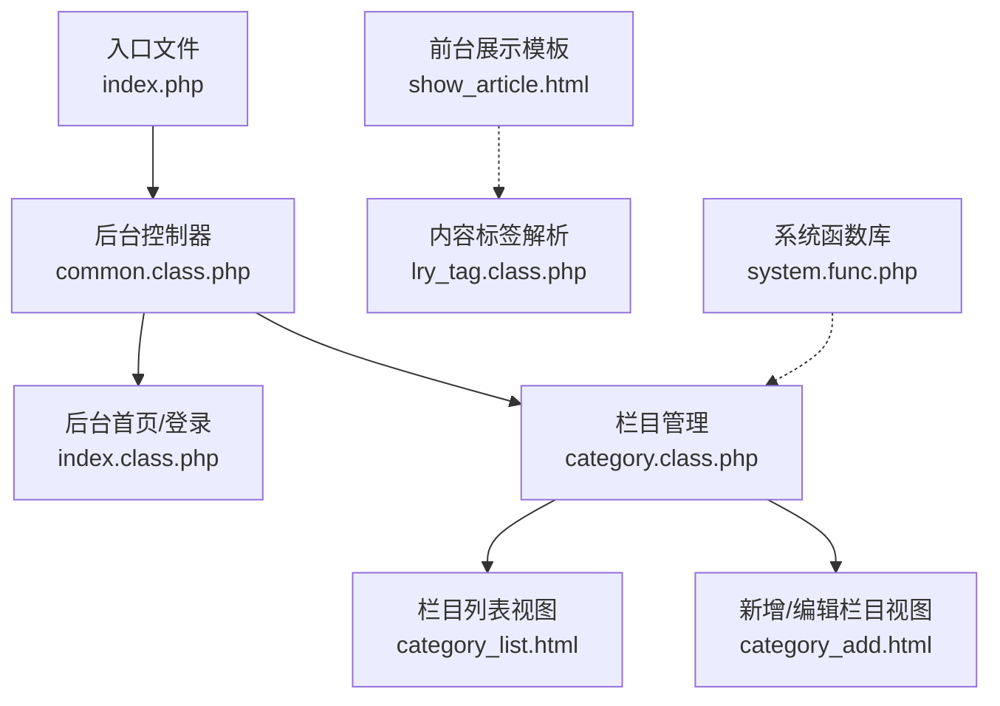
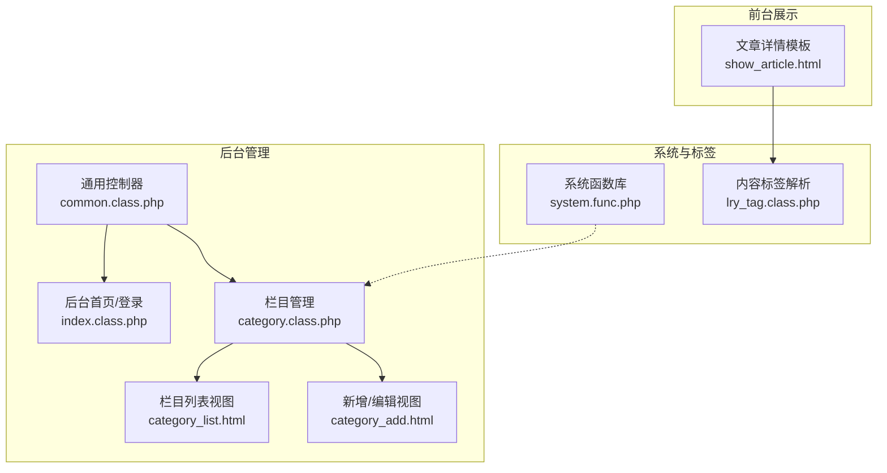
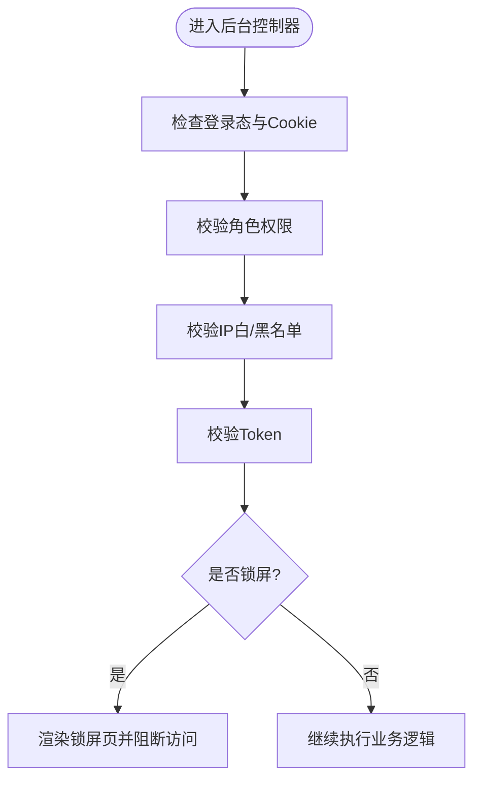
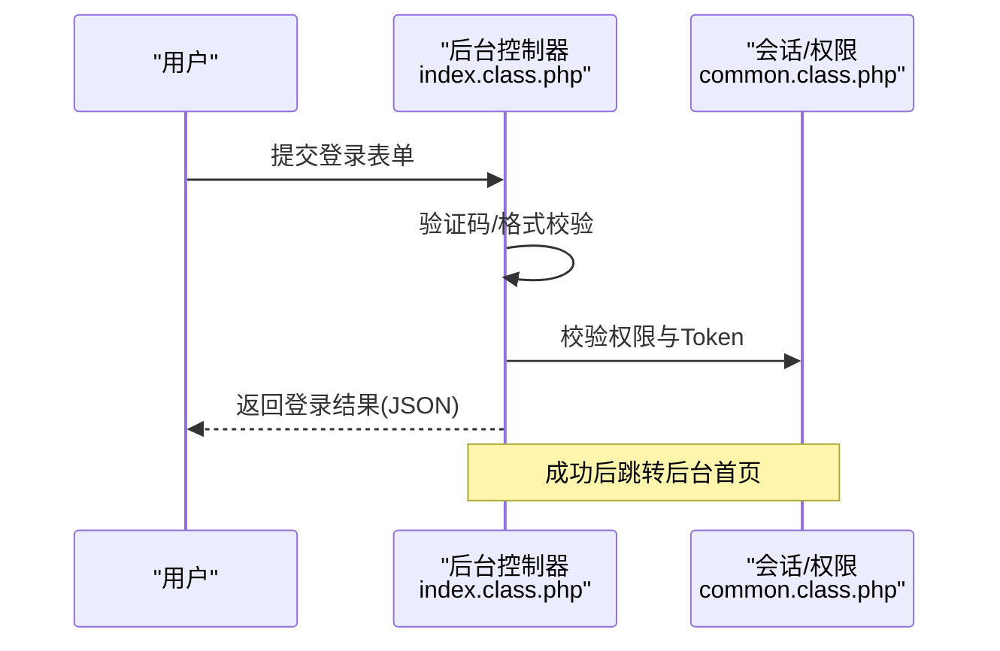
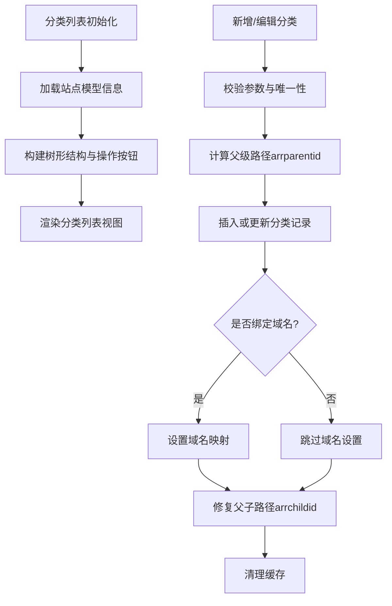
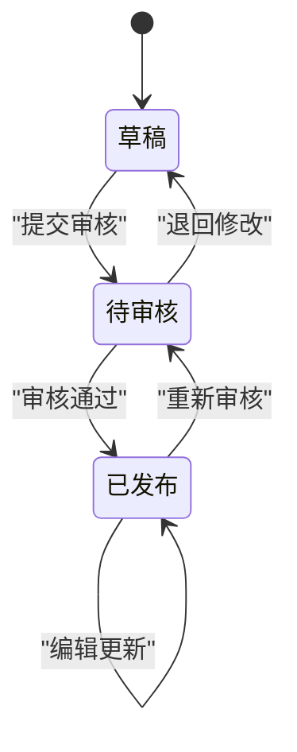
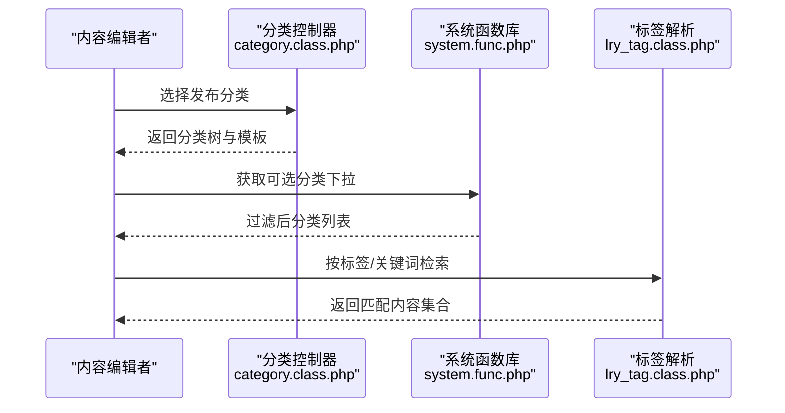
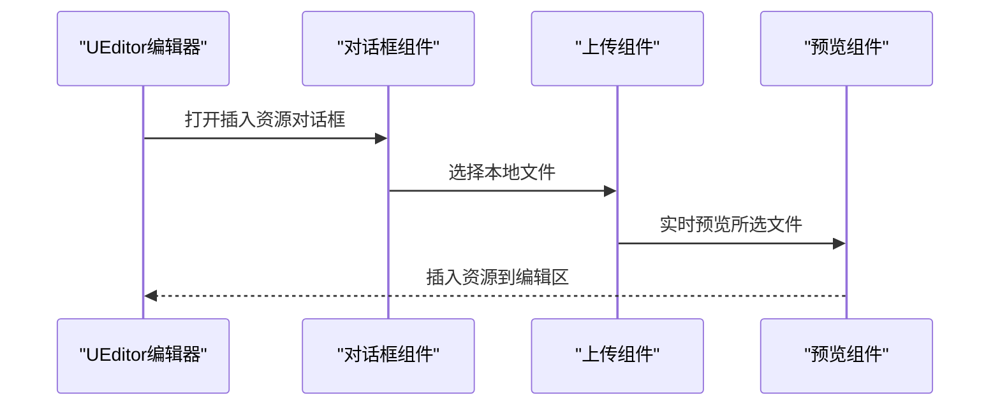
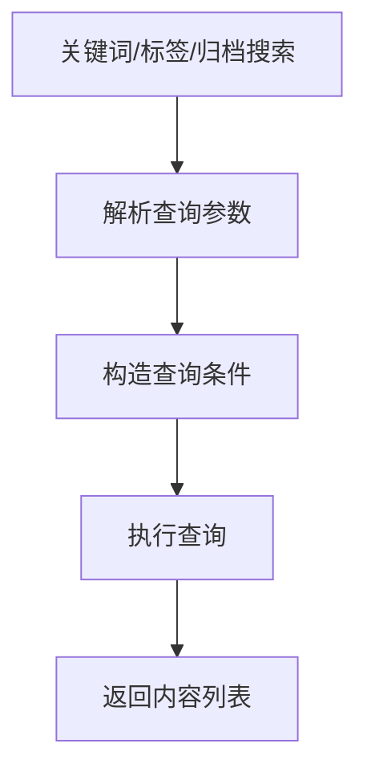
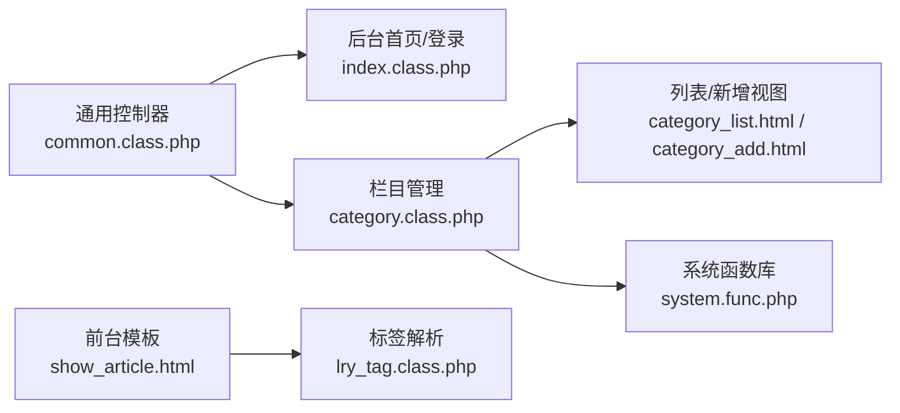

# 文章管理

<cite>
**本文引用的文件**
- [index.php](file://index.php)
- [application/lry_admin_center/controller/common.class.php](file://application/lry_admin_center/controller/common.class.php)
- [application/lry_admin_center/controller/index.class.php](file://application/lry_admin_center/controller/index.class.php)
- [application/lry_admin_center/controller/category.class.php](file://application/lry_admin_center/controller/category.class.php)
- [application/lry_admin_center/view/index.html](file://application/lry_admin_center/view/index.html)
- [application/lry_admin_center/view/category_list.html](file://application/lry_admin_center/view/category_list.html)
- [application/lry_admin_center/view/category_add.html](file://application/lry_admin_center/view/category_add.html)
- [ryphp/core/class/lry_tag.class.php](file://ryphp/core/class/lry_tag.class.php)
- [application/index/view/rongyao/show_article.html](file://application/index/view/rongyao/show_article.html)
- [common/function/system.func.php](file://common/function/system.func.php)
</cite>

## 目录
1. [简介](#简介)
2. [项目结构](#项目结构)
3. [核心组件](#核心组件)
4. [架构总览](#架构总览)
5. [详细组件分析](#详细组件分析)
6. [依赖关系分析](#依赖关系分析)
7. [性能考量](#性能考量)
8. [故障排查指南](#故障排查指南)
9. [结论](#结论)
10. [附录](#附录)

## 简介
本技术文档围绕 LRYBlog 的文章管理功能进行全面梳理，覆盖文章的创建、编辑、删除与发布流程；文章状态管理（草稿、已发布、待审核等）的转换机制；文章分类与标签的关联管理；SEO 优化（标题、描述、关键词）；内容编辑器（富文本、图片上传、多媒体插入）；批量操作（删除、移动分类、状态修改）；搜索与筛选（标题、作者、时间等）；文章预览、定时发布与重复发布机制；以及面向内容编辑者的完整操作指导。

## 项目结构
LRYBlog 采用 MVC 架构，入口文件加载框架并初始化应用。后台管理位于 application/lry_admin_center，前台展示位于 application/index。文章管理涉及后台内容管理与前台展示模板两部分。

**图表来源**
- [index.php:1-18](file://index.php#L1-L18)
- [application/lry_admin_center/controller/common.class.php:1-153](file://application/lry_admin_center/controller/common.class.php#L1-L153)
- [application/lry_admin_center/controller/index.class.php:1-162](file://application/lry_admin_center/controller/index.class.php#L1-L162)
- [application/lry_admin_center/controller/category.class.php:1-580](file://application/lry_admin_center/controller/category.class.php#L1-L580)
- [application/lry_admin_center/view/category_list.html:1-116](file://application/lry_admin_center/view/category_list.html#L1-L116)
- [application/lry_admin_center/view/category_add.html:1-329](file://application/lry_admin_center/view/category_add.html#L1-L329)
- [application/index/view/rongyao/show_article.html:168-208](file://application/index/view/rongyao/show_article.html#L168-L208)
- [ryphp/core/class/lry_tag.class.php:338-433](file://ryphp/core/class/lry_tag.class.php#L338-L433)
- [common/function/system.func.php:347-369](file://common/function/system.func.php#L347-L369)

**章节来源**
- [index.php:1-18](file://index.php#L1-L18)
- [application/lry_admin_center/controller/common.class.php:1-153](file://application/lry_admin_center/controller/common.class.php#L1-L153)

## 核心组件
- 后台通用控制器与权限校验：提供统一的登录态、权限、Token、IP、锁屏等安全与审计控制。
- 栏目管理控制器：负责分类的增删改查、模板选择、SEO 设置、域名绑定、父子关系维护与缓存清理。
- 前台展示模板：文章详情页模板，支持相关推荐、评论等模块化标签调用。
- 内容标签解析：提供搜索、归档、标签检索等标签能力，支撑文章筛选与聚合。
- 系统函数库：提供下拉选择、发布限制、模板选择等辅助能力。

**章节来源**
- [application/lry_admin_center/controller/common.class.php:1-153](file://application/lry_admin_center/controller/common.class.php#L1-L153)
- [application/lry_admin_center/controller/category.class.php:1-580](file://application/lry_admin_center/controller/category.class.php#L1-L580)
- [application/index/view/rongyao/show_article.html:168-208](file://application/index/view/rongyao/show_article.html#L168-L208)
- [ryphp/core/class/lry_tag.class.php:338-433](file://ryphp/core/class/lry_tag.class.php#L338-L433)
- [common/function/system.func.php:347-369](file://common/function/system.func.php#L347-L369)

## 架构总览
后台文章管理由“通用控制器 + 栏目控制器 + 视图模板”构成，配合系统函数与标签解析实现内容的组织、展示与检索。

**图表来源**
- [application/lry_admin_center/controller/common.class.php:1-153](file://application/lry_admin_center/controller/common.class.php#L1-L153)
- [application/lry_admin_center/controller/index.class.php:1-162](file://application/lry_admin_center/controller/index.class.php#L1-L162)
- [application/lry_admin_center/controller/category.class.php:1-580](file://application/lry_admin_center/controller/category.class.php#L1-L580)
- [application/lry_admin_center/view/category_list.html:1-116](file://application/lry_admin_center/view/category_list.html#L1-L116)
- [application/lry_admin_center/view/category_add.html:1-329](file://application/lry_admin_center/view/category_add.html#L1-L329)
- [application/index/view/rongyao/show_article.html:168-208](file://application/index/view/rongyao/show_article.html#L168-L208)
- [ryphp/core/class/lry_tag.class.php:338-433](file://ryphp/core/class/lry_tag.class.php#L338-L433)
- [common/function/system.func.php:347-369](file://common/function/system.func.php#L347-L369)

## 详细组件分析

### 后台通用控制器与安全校验
- 登录态与权限：统一校验 Session、Cookie、角色权限、Referer、Token，防止跨站与未授权访问。
- IP 限制与锁屏：支持后台禁止 IP 列表与临时锁屏机制，提升安全性。
- 日志审计：可选开启后台操作日志记录，便于追踪。

**图表来源**
- [application/lry_admin_center/controller/common.class.php:32-131](file://application/lry_admin_center/controller/common.class.php#L32-L131)

**章节来源**
- [application/lry_admin_center/controller/common.class.php:1-153](file://application/lry_admin_center/controller/common.class.php#L1-L153)

### 后台首页与登录
- 登录接口：校验验证码、用户名/密码格式，成功后返回 JSON 并跳转后台首页。
- 退出与锁屏：提供安全退出与临时锁屏/解锁，保护后台环境。

**图表来源**
- [application/lry_admin_center/controller/index.class.php:19-38](file://application/lry_admin_center/controller/index.class.php#L19-L38)
- [application/lry_admin_center/controller/common.class.php:32-131](file://application/lry_admin_center/controller/common.class.php#L32-L131)

**章节来源**
- [application/lry_admin_center/controller/index.class.php:1-162](file://application/lry_admin_center/controller/index.class.php#L1-L162)
- [application/lry_admin_center/view/index.html:1-112](file://application/lry_admin_center/view/index.html#L1-L112)

### 栏目管理（分类与文章模型）
- 分类列表：支持树形展开/收起、排序、显示/隐藏、允许投稿等操作，结合 Cookie 记录树形状态。
- 新增/编辑分类：支持模型选择、模板设置（频道页/列表页/内容页）、SEO 设置、域名绑定、父子关系维护与缓存清理。
- 删除分类：需确保无子分类与内容，避免破坏数据完整性。
- 模板选择：根据模型动态加载可用模板，支持命名规则提示。

**图表来源**
- [application/lry_admin_center/controller/category.class.php:27-134](file://application/lry_admin_center/controller/category.class.php#L27-L134)
- [application/lry_admin_center/controller/category.class.php:144-278](file://application/lry_admin_center/controller/category.class.php#L144-L278)
- [application/lry_admin_center/controller/category.class.php:344-428](file://application/lry_admin_center/controller/category.class.php#L344-L428)
- [application/lry_admin_center/controller/category.class.php:435-453](file://application/lry_admin_center/controller/category.class.php#L435-L453)
- [application/lry_admin_center/view/category_list.html:1-116](file://application/lry_admin_center/view/category_list.html#L1-L116)
- [application/lry_admin_center/view/category_add.html:1-329](file://application/lry_admin_center/view/category_add.html#L1-L329)

**章节来源**
- [application/lry_admin_center/controller/category.class.php:1-580](file://application/lry_admin_center/controller/category.class.php#L1-L580)
- [application/lry_admin_center/view/category_list.html:1-116](file://application/lry_admin_center/view/category_list.html#L1-L116)
- [application/lry_admin_center/view/category_add.html:1-329](file://application/lry_admin_center/view/category_add.html#L1-L329)

### 文章状态管理（草稿、已发布、待审核）
- 状态字段：通常由内容模型提供状态字段（如 status），支持草稿、已发布、待审核等状态。
- 状态转换：通过后台操作触发状态变更，结合权限控制与日志审计，确保合规。
- 展示控制：前台模板与标签解析仅展示已发布状态的内容，保障内容质量。

[本图为概念示意，不直接映射具体源码文件]

### 文章分类与标签关联管理
- 分类选择：系统函数提供下拉选择与发布限制，支持禁用有子分类的节点，确保发布目标有效。
- 标签检索：标签解析支持按标签、归档、关键词等维度检索内容，便于文章聚合与筛选。

**图表来源**
- [common/function/system.func.php:347-369](file://common/function/system.func.php#L347-L369)
- [ryphp/core/class/lry_tag.class.php:360-427](file://ryphp/core/class/lry_tag.class.php#L360-L427)

**章节来源**
- [common/function/system.func.php:347-369](file://common/function/system.func.php#L347-L369)
- [ryphp/core/class/lry_tag.class.php:338-433](file://ryphp/core/class/lry_tag.class.php#L338-L433)

### SEO 优化（标题、描述、关键词）
- 栏目 SEO：在新增/编辑分类时支持设置 SEO 标题、关键词、描述，便于搜索引擎收录。
- 内容 SEO：文章模型通常包含独立的 SEO 字段，可在文章编辑界面设置。

**章节来源**
- [application/lry_admin_center/view/category_add.html:122-141](file://application/lry_admin_center/view/category_add.html#L122-L141)

### 内容编辑器（富文本、图片上传、多媒体插入）
- 富文本编辑：系统集成 UEditor，支持表格、表情、附件、视频等常用功能。
- 图片上传：提供附件上传弹窗与预览，支持多图选择与裁剪。
- 多媒体插入：通过对话框插入图片、视频、音乐等资源，提升内容丰富度。

[本图为概念示意，不直接映射具体源码文件]

### 批量操作（删除、移动分类、状态修改）
- 批量删除：在列表页勾选多项后执行删除，需确保无子分类与内容。
- 批量移动分类：将选中内容移动至目标分类，同时更新分类关联。
- 批量状态修改：统一修改选中内容的状态，支持草稿、已发布、待审核等切换。

**章节来源**
- [application/lry_admin_center/controller/category.class.php:435-453](file://application/lry_admin_center/controller/category.class.php#L435-L453)

### 搜索与筛选（标题、作者、时间）
- 关键词搜索：支持按标题、关键词等字段检索，返回匹配内容集合。
- 标签筛选：按标签 ID 过滤内容，返回关联内容列表。
- 归档筛选：按年月归档统计与内容列表。

**图表来源**
- [ryphp/core/class/lry_tag.class.php:360-427](file://ryphp/core/class/lry_tag.class.php#L360-L427)

**章节来源**
- [ryphp/core/class/lry_tag.class.php:338-433](file://ryphp/core/class/lry_tag.class.php#L338-L433)

### 文章预览、定时发布与重复发布
- 预览：编辑完成后可预览文章效果，确认无误后再发布。
- 定时发布：通过状态与发布时间字段实现定时生效，需结合计划任务或定时器。
- 重复发布：支持复制现有文章并批量发布，提高效率。

[本节为通用实现建议，不直接映射具体源码文件]

### 内容编辑者操作指导
- 登录后台：使用账号密码登录，完成验证码校验。
- 创建文章：在指定分类下新增文章，填写标题、正文、SEO 信息，选择标签。
- 编辑文章：修改内容、调整分类、更新 SEO，保存并预览。
- 发布/撤回：提交审核或直接发布，必要时退回修改。
- 批量管理：对多篇文章执行删除、移动分类、状态修改等操作。
- 搜索筛选：通过关键词、标签、归档快速定位内容。

**章节来源**
- [application/lry_admin_center/view/index.html:1-112](file://application/lry_admin_center/view/index.html#L1-L112)

## 依赖关系分析
- 控制器依赖通用控制器提供的安全与权限校验。
- 栏目控制器依赖系统函数库与模板选择逻辑。
- 前台展示依赖标签解析与内容模型，仅展示已发布状态内容。
- 搜索与筛选依赖标签解析与数据库查询。

**图表来源**
- [application/lry_admin_center/controller/common.class.php:1-153](file://application/lry_admin_center/controller/common.class.php#L1-L153)
- [application/lry_admin_center/controller/index.class.php:1-162](file://application/lry_admin_center/controller/index.class.php#L1-L162)
- [application/lry_admin_center/controller/category.class.php:1-580](file://application/lry_admin_center/controller/category.class.php#L1-L580)
- [application/lry_admin_center/view/category_list.html:1-116](file://application/lry_admin_center/view/category_list.html#L1-L116)
- [application/lry_admin_center/view/category_add.html:1-329](file://application/lry_admin_center/view/category_add.html#L1-L329)
- [application/index/view/rongyao/show_article.html:168-208](file://application/index/view/rongyao/show_article.html#L168-L208)
- [ryphp/core/class/lry_tag.class.php:338-433](file://ryphp/core/class/lry_tag.class.php#L338-L433)
- [common/function/system.func.php:347-369](file://common/function/system.func.php#L347-L369)

**章节来源**
- [application/lry_admin_center/controller/common.class.php:1-153](file://application/lry_admin_center/controller/common.class.php#L1-L153)
- [application/lry_admin_center/controller/category.class.php:1-580](file://application/lry_admin_center/controller/category.class.php#L1-L580)
- [ryphp/core/class/lry_tag.class.php:338-433](file://ryphp/core/class/lry_tag.class.php#L338-L433)

## 性能考量
- 树形渲染与 Cookie 状态：通过 Cookie 记录树形展开状态，减少每次请求的计算量。
- 缓存清理：在分类增删改后及时清理缓存，避免陈旧数据影响展示。
- 模板选择：按模型动态加载模板，减少不必要的模板扫描。
- 查询优化：合理使用索引与分页，避免全表扫描。

[本节为通用指导，不直接分析具体文件]

## 故障排查指南
- 登录失败：检查验证码、用户名/密码格式与权限角色。
- 权限不足：确认角色权限与 Token 校验是否通过。
- IP 被限制：检查后台禁止 IP 配置。
- 锁屏状态：临时锁屏会阻断非公共操作，需解锁后继续。
- 删除失败：若分类下存在子分类或内容，需先删除或转移后再操作。

**章节来源**
- [application/lry_admin_center/controller/common.class.php:32-131](file://application/lry_admin_center/controller/common.class.php#L32-L131)
- [application/lry_admin_center/controller/category.class.php:435-453](file://application/lry_admin_center/controller/category.class.php#L435-L453)

## 结论
LRYBlog 的文章管理功能以通用控制器为基础，结合栏目管理与视图模板，实现了从创建、编辑、删除到发布的完整闭环。通过权限校验、状态管理、SEO 设置、标签检索与批量操作，满足内容编辑者高效管理文章的需求。前台模板与标签解析确保内容的正确展示与检索。建议在生产环境中完善定时发布与重复发布机制，并持续优化缓存策略与查询性能。

## 附录
- 前台文章详情模板支持相关推荐与评论模块化标签，便于扩展内容生态。
- 系统函数库提供下拉选择与发布限制，保障分类选择的合理性。

**章节来源**
- [application/index/view/rongyao/show_article.html:168-208](file://application/index/view/rongyao/show_article.html#L168-L208)
- [common/function/system.func.php:347-369](file://common/function/system.func.php#L347-L369)