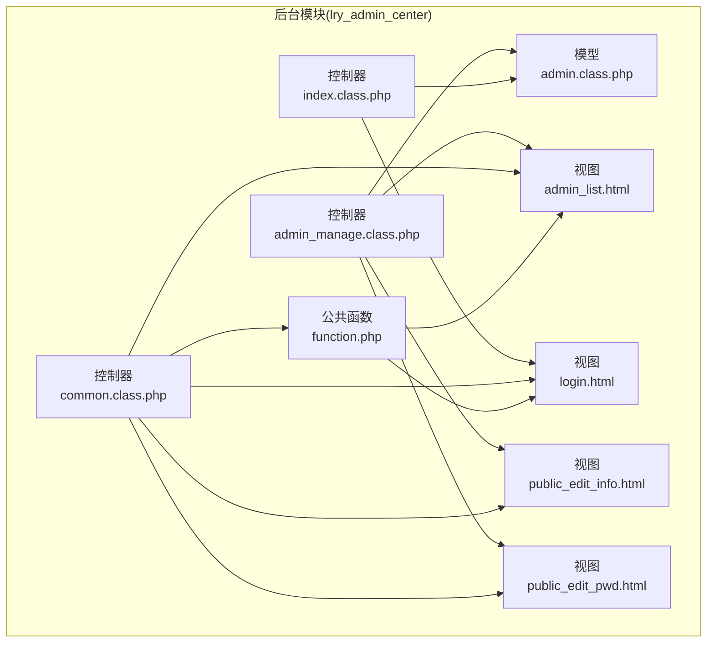
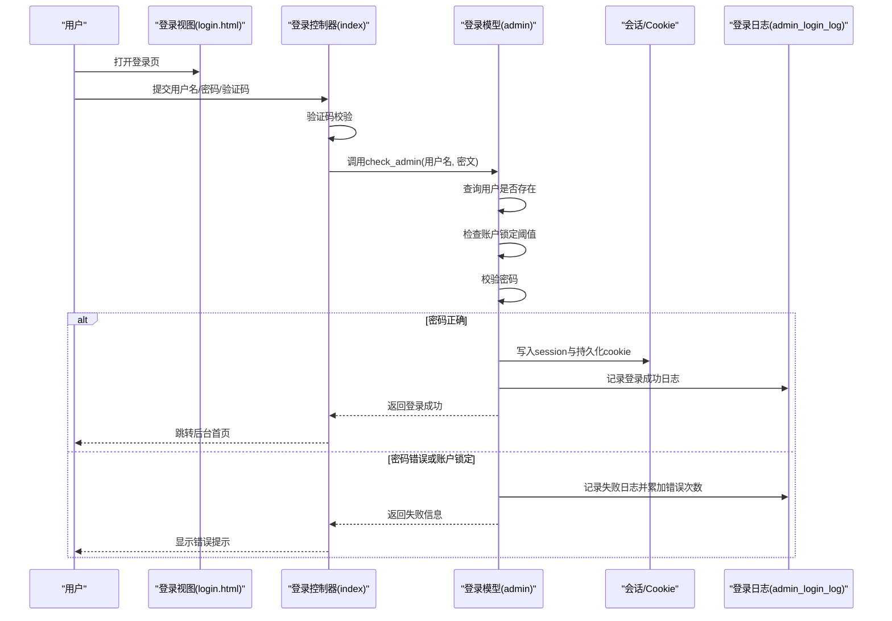
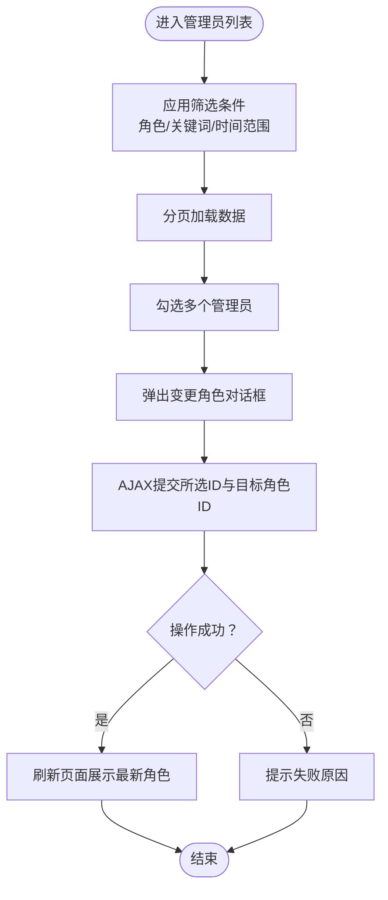
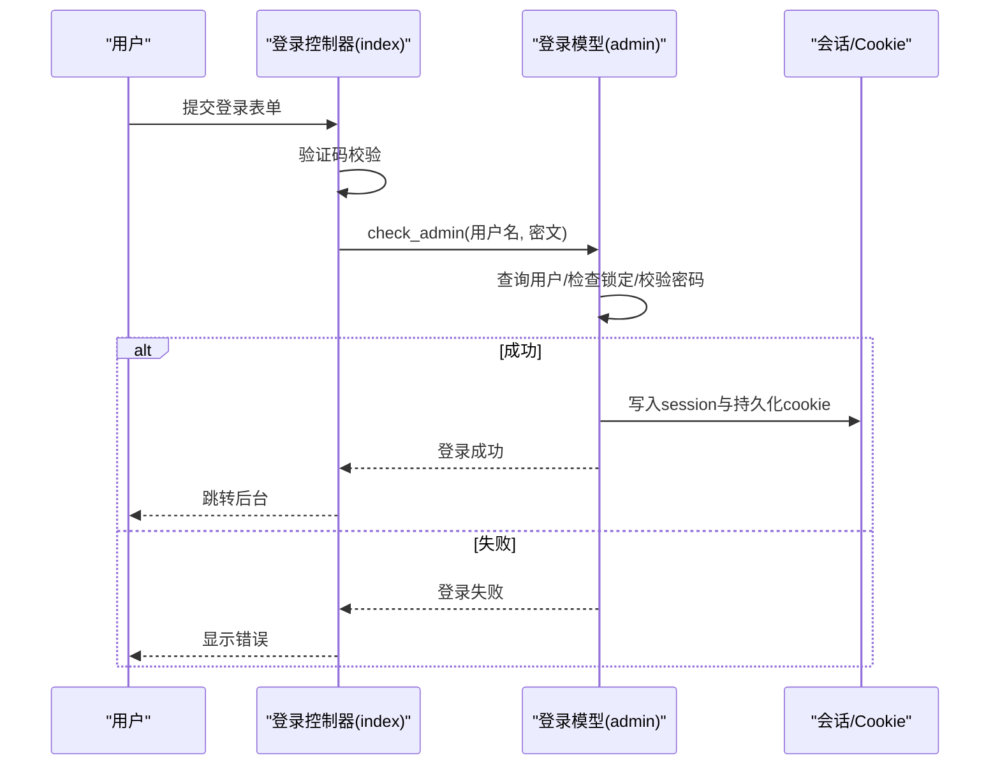
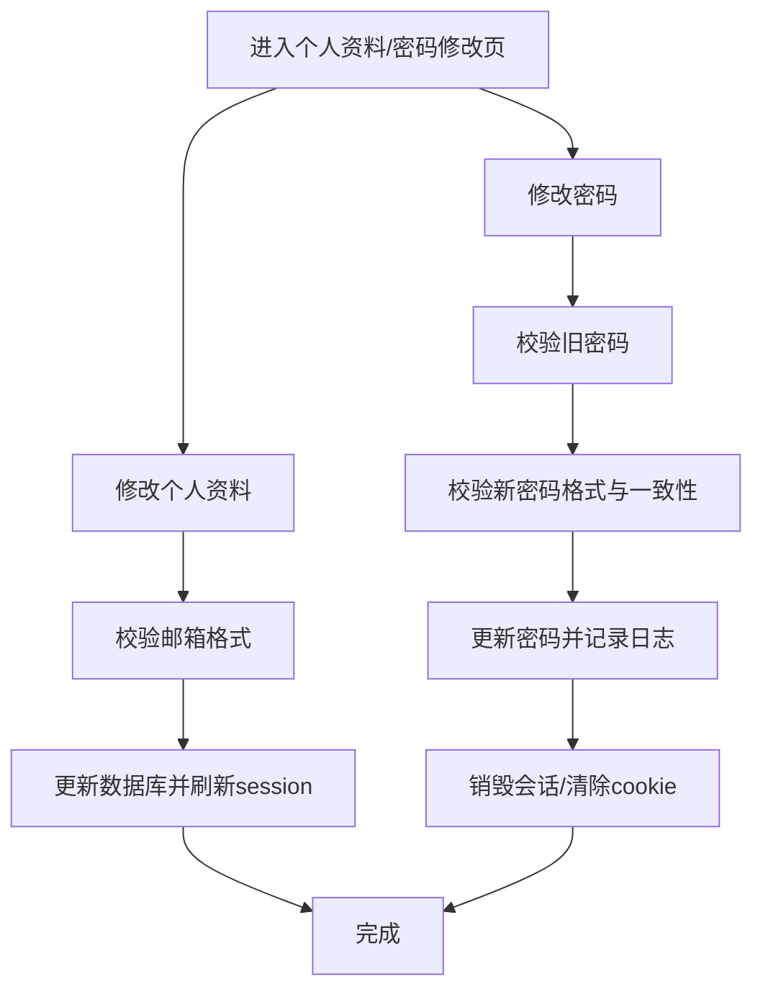
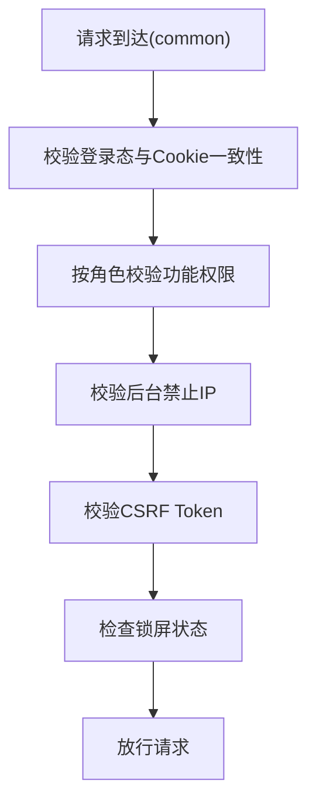
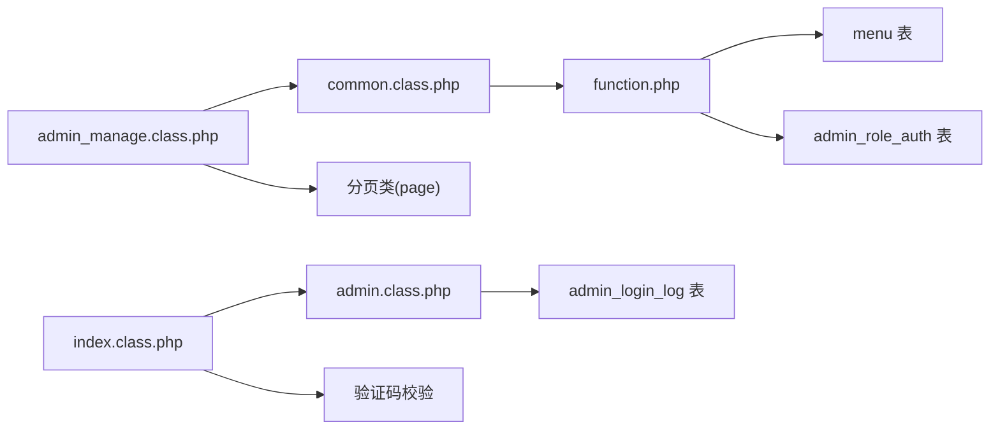

# 管理员管理

<cite>
**本文引用的文件**
- [application/lry_admin_center/controller/admin_manage.class.php](file://application/lry_admin_center/controller/admin_manage.class.php)
- [application/lry_admin_center/model/admin.class.php](file://application/lry_admin_center/model/admin.class.php)
- [application/lry_admin_center/controller/common.class.php](file://application/lry_admin_center/controller/common.class.php)
- [application/lry_admin_center/controller/index.class.php](file://application/lry_admin_center/controller/index.class.php)
- [application/lry_admin_center/view/admin_list.html](file://application/lry_admin_center/view/admin_list.html)
- [application/lry_admin_center/view/login.html](file://application/lry_admin_center/view/login.html)
- [application/lry_admin_center/view/public_edit_info.html](file://application/lry_admin_center/view/public_edit_info.html)
- [application/lry_admin_center/view/public_edit_pwd.html](file://application/lry_admin_center/view/public_edit_pwd.html)
- [application/lry_admin_center/view/header.html](file://application/lry_admin_center/view/header.html)
- [application/lry_admin_center/view/menu.html](file://application/lry_admin_center/view/menu.html)
- [application/lry_admin_center/common/function/function.php](file://application/lry_admin_center/common/function/function.php)
</cite>

## 目录
1. [简介](#简介)
2. [项目结构](#项目结构)
3. [核心组件](#核心组件)
4. [架构总览](#架构总览)
5. [详细组件分析](#详细组件分析)
6. [依赖关系分析](#依赖关系分析)
7. [性能考量](#性能考量)
8. [故障排查指南](#故障排查指南)
9. [结论](#结论)
10. [附录](#附录)

## 简介
本技术文档面向LRYBlog系统管理员，系统性阐述后台管理员管理功能的设计与实现，覆盖管理员账户的创建、编辑、删除与权限分配；角色体系（超级管理员与普通管理员）；登录验证流程（含密码存储与会话管理）；个人信息与密码修改；批量操作（批量角色变更）；权限控制（菜单与功能权限）；以及操作日志与审计能力。文档同时提供操作指南与最佳实践，帮助管理员高效、安全地使用系统。

## 项目结构
LRYBlog后台采用模块化控制器-模型-视图三层结构，管理员相关功能集中在lry_admin_center模块：
- 控制器：负责业务流程编排与参数处理
- 模型：封装数据访问与业务逻辑（如登录校验）
- 视图：渲染页面与交互（含登录页、管理员列表、个人资料与密码修改页）
- 公共函数：菜单生成、权限过滤、配置读写等

图表来源
- [application/lry_admin_center/controller/admin_manage.class.php:1-105](file://application/lry_admin_center/controller/admin_manage.class.php#L1-L105)
- [application/lry_admin_center/controller/index.class.php:1-162](file://application/lry_admin_center/controller/index.class.php#L1-L162)
- [application/lry_admin_center/controller/common.class.php:1-153](file://application/lry_admin_center/controller/common.class.php#L1-L153)
- [application/lry_admin_center/model/admin.class.php:1-96](file://application/lry_admin_center/model/admin.class.php#L1-L96)
- [application/lry_admin_center/view/admin_list.html:1-138](file://application/lry_admin_center/view/admin_list.html#L1-L138)
- [application/lry_admin_center/view/login.html:1-98](file://application/lry_admin_center/view/login.html#L1-L98)
- [application/lry_admin_center/view/public_edit_info.html:1-50](file://application/lry_admin_center/view/public_edit_info.html#L1-L50)
- [application/lry_admin_center/view/public_edit_pwd.html:1-113](file://application/lry_admin_center/view/public_edit_pwd.html#L1-L113)
- [application/lry_admin_center/common/function/function.php:1-162](file://application/lry_admin_center/common/function/function.php#L1-L162)

章节来源
- [application/lry_admin_center/controller/admin_manage.class.php:1-105](file://application/lry_admin_center/controller/admin_manage.class.php#L1-L105)
- [application/lry_admin_center/controller/index.class.php:1-162](file://application/lry_admin_center/controller/index.class.php#L1-L162)
- [application/lry_admin_center/controller/common.class.php:1-153](file://application/lry_admin_center/controller/common.class.php#L1-L153)
- [application/lry_admin_center/model/admin.class.php:1-96](file://application/lry_admin_center/model/admin.class.php#L1-L96)
- [application/lry_admin_center/view/admin_list.html:1-138](file://application/lry_admin_center/view/admin_list.html#L1-L138)
- [application/lry_admin_center/view/login.html:1-98](file://application/lry_admin_center/view/login.html#L1-L98)
- [application/lry_admin_center/view/public_edit_info.html:1-50](file://application/lry_admin_center/view/public_edit_info.html#L1-L50)
- [application/lry_admin_center/view/public_edit_pwd.html:1-113](file://application/lry_admin_center/view/public_edit_pwd.html#L1-L113)
- [application/lry_admin_center/common/function/function.php:1-162](file://application/lry_admin_center/common/function/function.php#L1-L162)

## 核心组件
- 管理员控制器（admin_manage）：负责管理员列表查询、筛选、批量角色变更等管理操作入口。
- 登录控制器（index）：负责登录表单提交、验证码校验、调用模型进行登录校验、登出、锁屏/解锁等。
- 登录模型（admin）：封装登录校验、账户锁定策略、登录成功/失败后的会话与日志处理。
- 通用中间件（common）：统一鉴权、IP限制、Token校验、日志记录、锁屏保护等。
- 公共函数（function）：菜单生成与权限过滤、配置文件写入、文件下载与解压等。
- 视图模板：登录页、管理员列表、个人资料与密码修改页等。

章节来源
- [application/lry_admin_center/controller/admin_manage.class.php:1-105](file://application/lry_admin_center/controller/admin_manage.class.php#L1-L105)
- [application/lry_admin_center/controller/index.class.php:1-162](file://application/lry_admin_center/controller/index.class.php#L1-L162)
- [application/lry_admin_center/model/admin.class.php:1-96](file://application/lry_admin_center/model/admin.class.php#L1-L96)
- [application/lry_admin_center/controller/common.class.php:1-153](file://application/lry_admin_center/controller/common.class.php#L1-L153)
- [application/lry_admin_center/common/function/function.php:1-162](file://application/lry_admin_center/common/function/function.php#L1-L162)

## 架构总览
后台管理员管理遵循“控制器-模型-视图”分层，配合通用中间件完成鉴权与安全控制。登录流程通过模型层完成密码校验与会话建立，菜单与权限由公共函数按角色动态生成与过滤。

图表来源
- [application/lry_admin_center/view/login.html:1-98](file://application/lry_admin_center/view/login.html#L1-L98)
- [application/lry_admin_center/controller/index.class.php:19-38](file://application/lry_admin_center/controller/index.class.php#L19-L38)
- [application/lry_admin_center/model/admin.class.php:4-95](file://application/lry_admin_center/model/admin.class.php#L4-L95)

章节来源
- [application/lry_admin_center/view/login.html:1-98](file://application/lry_admin_center/view/login.html#L1-L98)
- [application/lry_admin_center/controller/index.class.php:19-38](file://application/lry_admin_center/controller/index.class.php#L19-L38)
- [application/lry_admin_center/model/admin.class.php:4-95](file://application/lry_admin_center/model/admin.class.php#L4-L95)

## 详细组件分析

### 管理员列表与批量角色变更
- 列表查询：支持按角色、用户名/邮箱/真实姓名/添加人、添加时间范围等条件筛选；支持按多字段排序。
- 分页与角色下拉：每页固定数量，角色下拉用于快速筛选。
- 批量角色变更：勾选多个管理员，统一变更角色，前端通过AJAX提交，后端返回结果并刷新页面。

图表来源
- [application/lry_admin_center/view/admin_list.html:32-136](file://application/lry_admin_center/view/admin_list.html#L32-L136)
- [application/lry_admin_center/controller/admin_manage.class.php:11-44](file://application/lry_admin_center/controller/admin_manage.class.php#L11-L44)

章节来源
- [application/lry_admin_center/view/admin_list.html:32-136](file://application/lry_admin_center/view/admin_list.html#L32-L136)
- [application/lry_admin_center/controller/admin_manage.class.php:11-44](file://application/lry_admin_center/controller/admin_manage.class.php#L11-L44)

### 登录验证与会话管理
- 登录控制器：接收POST参数，校验验证码格式，调用模型进行登录校验，成功则返回跳转地址。
- 登录模型：查询用户、检查账户锁定阈值（多次失败后临时锁定）、校验密码；成功写入session与持久化cookie，记录登录日志；失败累加错误计数并记录失败日志。
- 会话与Cookie：登录成功后设置管理员标识、角色ID、随机token、锁屏标记，并写入持久化cookie以便跨会话保持登录态。
- 登出：销毁session与cookie，提示安全退出。
- 锁屏/解锁：支持锁屏并在非公开动作下拦截访问；解锁需再次输入当前密码进行二次校验。

图表来源
- [application/lry_admin_center/controller/index.class.php:19-38](file://application/lry_admin_center/controller/index.class.php#L19-L38)
- [application/lry_admin_center/model/admin.class.php:4-95](file://application/lry_admin_center/model/admin.class.php#L4-L95)
- [application/lry_admin_center/view/login.html:14-94](file://application/lry_admin_center/view/login.html#L14-L94)

章节来源
- [application/lry_admin_center/controller/index.class.php:19-38](file://application/lry_admin_center/controller/index.class.php#L19-L38)
- [application/lry_admin_center/model/admin.class.php:4-95](file://application/lry_admin_center/model/admin.class.php#L4-L95)
- [application/lry_admin_center/view/login.html:14-94](file://application/lry_admin_center/view/login.html#L14-L94)

### 个人信息与密码修改
- 个人信息修改：仅允许修改昵称、邮箱、真实姓名；提交后更新并刷新session中的admininfo，确保下次展示即时生效。
- 密码修改：需提供旧密码校验，新密码格式校验，确认两次输入一致；成功后插入操作日志（若开启），销毁当前会话并清除cookie，要求重新登录。

图表来源
- [application/lry_admin_center/view/public_edit_info.html:7-47](file://application/lry_admin_center/view/public_edit_info.html#L7-L47)
- [application/lry_admin_center/view/public_edit_pwd.html:78-110](file://application/lry_admin_center/view/public_edit_pwd.html#L78-L110)
- [application/lry_admin_center/controller/admin_manage.class.php:49-104](file://application/lry_admin_center/controller/admin_manage.class.php#L49-L104)

章节来源
- [application/lry_admin_center/view/public_edit_info.html:7-47](file://application/lry_admin_center/view/public_edit_info.html#L7-L47)
- [application/lry_admin_center/view/public_edit_pwd.html:78-110](file://application/lry_admin_center/view/public_edit_pwd.html#L78-L110)
- [application/lry_admin_center/controller/admin_manage.class.php:49-104](file://application/lry_admin_center/controller/admin_manage.class.php#L49-L104)

### 权限控制与菜单系统
- 角色与权限：角色ID为1为超级管理员，拥有全部权限；其他角色通过admin_role_auth表授权具体功能（模块/控制器/动作）。
- 菜单生成：根据角色过滤菜单项，仅显示有权限的菜单；菜单缓存按角色缓存，避免重复查询。
- 中间件校验：所有后台请求在common中间件中统一校验登录态、IP白/黑名单、Token防CSRF、锁屏状态与权限。

图表来源
- [application/lry_admin_center/controller/common.class.php:32-131](file://application/lry_admin_center/controller/common.class.php#L32-L131)
- [application/lry_admin_center/common/function/function.php:35-80](file://application/lry_admin_center/common/function/function.php#L35-L80)

章节来源
- [application/lry_admin_center/controller/common.class.php:32-131](file://application/lry_admin_center/controller/common.class.php#L32-L131)
- [application/lry_admin_center/common/function/function.php:35-80](file://application/lry_admin_center/common/function/function.php#L35-L80)

### 操作日志与审计
- 日志记录：当开启admin_log配置时，除部分列表/初始化动作外，其余请求均记录模块、控制器、管理员、查询串、时间与IP。
- 登录日志：登录模型独立记录每次登录尝试（成功/失败）及原因，便于追踪异常登录行为。
- 审计建议：定期查看登录日志与管理日志，关注异常时间段、来源IP与频繁失败尝试。

章节来源
- [application/lry_admin_center/controller/common.class.php:69-82](file://application/lry_admin_center/controller/common.class.php#L69-L82)
- [application/lry_admin_center/model/admin.class.php:29-38](file://application/lry_admin_center/model/admin.class.php#L29-L38)

## 依赖关系分析
- 控制器依赖：admin_manage依赖common中间件与分页类；index依赖admin模型与验证码校验；common依赖公共函数与配置读取。
- 模型依赖：admin模型依赖admin_login_log与admin表；菜单生成依赖menu、admin_role_priv与admin_role_auth。
- 视图依赖：各页面依赖对应控制器提供的数据与路由生成函数。

图表来源
- [application/lry_admin_center/controller/admin_manage.class.php:4-5](file://application/lry_admin_center/controller/admin_manage.class.php#L4-L5)
- [application/lry_admin_center/controller/index.class.php](file://application/lry_admin_center/controller/index.class.php#L3)
- [application/lry_admin_center/controller/common.class.php:1-19](file://application/lry_admin_center/controller/common.class.php#L1-L19)
- [application/lry_admin_center/model/admin.class.php:1-9](file://application/lry_admin_center/model/admin.class.php#L1-L9)
- [application/lry_admin_center/common/function/function.php:35-52](file://application/lry_admin_center/common/function/function.php#L35-L52)

章节来源
- [application/lry_admin_center/controller/admin_manage.class.php:4-5](file://application/lry_admin_center/controller/admin_manage.class.php#L4-L5)
- [application/lry_admin_center/controller/index.class.php](file://application/lry_admin_center/controller/index.class.php#L3)
- [application/lry_admin_center/controller/common.class.php:1-19](file://application/lry_admin_center/controller/common.class.php#L1-L19)
- [application/lry_admin_center/model/admin.class.php:1-9](file://application/lry_admin_center/model/admin.class.php#L1-L9)
- [application/lry_admin_center/common/function/function.php:35-52](file://application/lry_admin_center/common/function/function.php#L35-L52)

## 性能考量
- 菜单缓存：按角色缓存菜单HTML，减少重复查询与拼装开销。
- 分页查询：列表页使用分页类限制单页数据量，降低数据库压力。
- 登录失败锁定：基于错误次数与时间窗口的分级锁定，降低暴力破解风险。
- 建议：对高频查询的菜单与角色表建立合适索引；合理设置分页大小与筛选条件，避免全表扫描。

## 故障排查指南
- 登录失败
  - 检查验证码是否正确；确认用户名/密码格式；查看登录日志定位失败原因。
  - 若提示“尝试次数过多”，等待锁定时间结束后再试。
- 无法访问后台
  - 检查是否已登录且session与cookie一致；确认未被后台禁止IP策略拦截；核对CSRF Token是否有效。
- 修改密码后无法登录
  - 密码修改成功后会销毁当前会话并清除cookie，需重新登录；确认新密码符合长度与字符要求。
- 菜单缺失或权限不足
  - 确认角色ID为1或已在admin_role_auth中授予相应功能权限；清理菜单缓存后重试。

章节来源
- [application/lry_admin_center/controller/index.class.php:19-38](file://application/lry_admin_center/controller/index.class.php#L19-L38)
- [application/lry_admin_center/model/admin.class.php:40-65](file://application/lry_admin_center/model/admin.class.php#L40-L65)
- [application/lry_admin_center/controller/common.class.php:32-131](file://application/lry_admin_center/controller/common.class.php#L32-L131)
- [application/lry_admin_center/common/function/function.php:56-80](file://application/lry_admin_center/common/function/function.php#L56-L80)

## 结论
LRYBlog后台管理员管理功能以清晰的分层架构与严格的中间件控制为基础，实现了从登录、权限、菜单到操作审计的完整闭环。通过角色与功能权限分离、菜单按角色缓存、登录失败锁定与日志记录，系统在可用性与安全性之间取得良好平衡。管理员可据此规范操作，结合日志与审计能力提升运维效率与安全水平。

## 附录
- 操作指南与最佳实践
  - 创建/编辑/删除管理员：通过管理员列表页进行，注意批量操作前先勾选目标记录。
  - 修改个人信息：仅修改昵称、邮箱、真实姓名，修改后重新登录生效。
  - 修改密码：务必提供旧密码并满足新密码强度要求，完成后需重新登录。
  - 批量角色变更：在列表页勾选多个管理员，统一变更角色后刷新页面确认。
  - 安全建议：启用并定期检查登录日志与管理日志；为超级管理员设置高强度密码；避免在公共设备上长时间保持登录态；定期清理不必要的后台访问IP白名单。