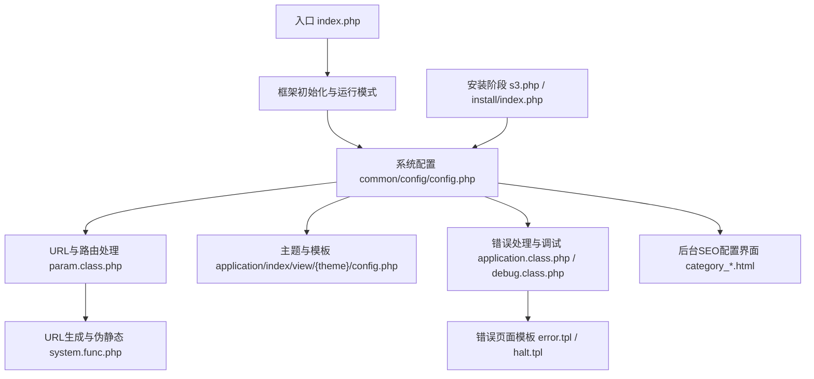
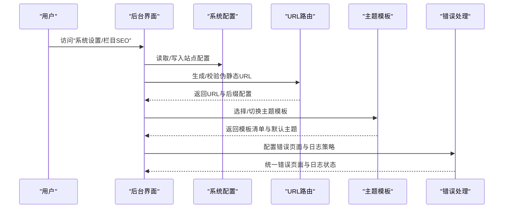
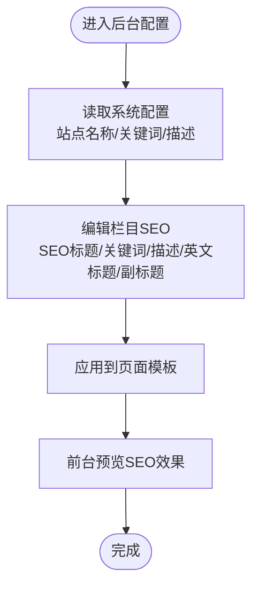
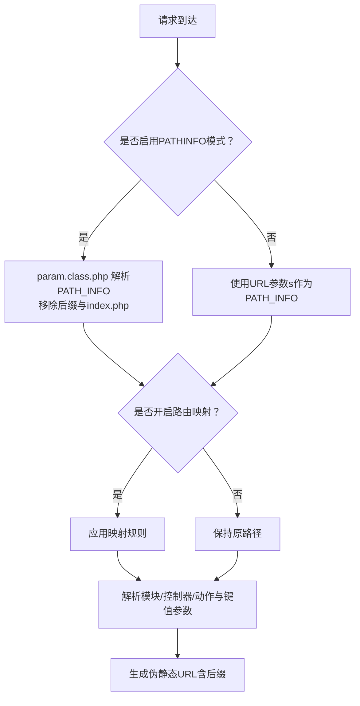
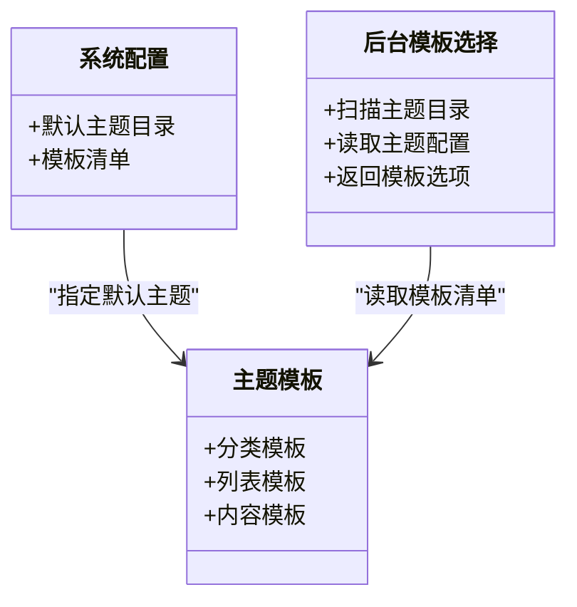
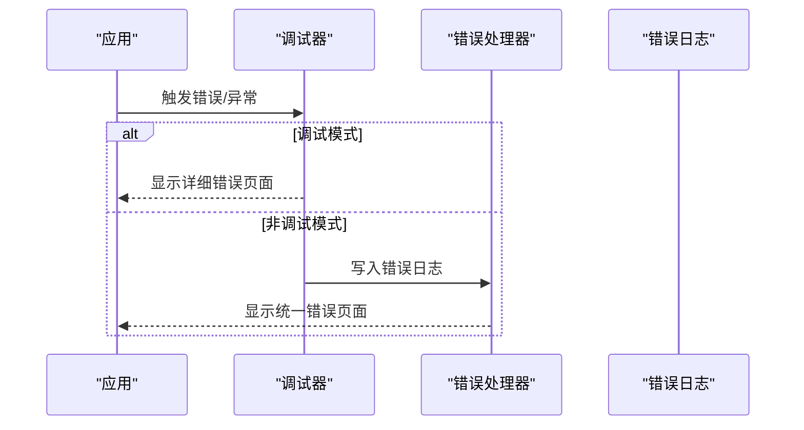
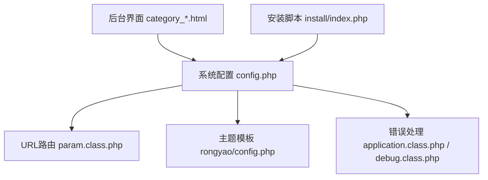

# 基础站点配置

<cite>
**本文引用的文件**
- [common/config/config.php](file://common/config/config.php)
- [application/index/view/rongyao/config.php](file://application/index/view/rongyao/config.php)
- [index.php](file://index.php)
- [ryphp/core/class/param.class.php](file://ryphp/core/class/param.class.php)
- [common/function/system.func.php](file://common/function/system.func.php)
- [ryphp/core/class/application.class.php](file://ryphp/core/class/application.class.php)
- [ryphp/core/message/error.tpl](file://ryphp/core/message/error.tpl)
- [ryphp/core/message/halt.tpl](file://ryphp/core/message/halt.tpl)
- [ryphp/core/class/debug.class.php](file://ryphp/core/class/debug.class.php)
- [application/lry_admin_center/view/category_add.html](file://application/lry_admin_center/view/category_add.html)
- [application/lry_admin_center/view/category_page.html](file://application/lry_admin_center/view/category_page.html)
- [application/lry_admin_center/view/category_page_edit.html](file://application/lry_admin_center/view/category_page_edit.html)
- [application/lry_admin_center/view/meta.html](file://application/lry_admin_center/view/meta.html)
- [application/lry_admin_center/view/public_home.html](file://application/lry_admin_center/view/public_home.html)
- [application/install/index.php](file://application/install/index.php)
- [application/install/templates/s3.php](file://application/install/templates/s3.php)
</cite>

## 目录
1. [引言](#引言)
2. [项目结构](#项目结构)
3. [核心组件](#核心组件)
4. [架构总览](#架构总览)
5. [详细组件分析](#详细组件分析)
6. [依赖关系分析](#依赖关系分析)
7. [性能考量](#性能考量)
8. [故障排查指南](#故障排查指南)
9. [结论](#结论)
10. [附录](#附录)

## 引言
本技术文档围绕 LRYBlog 的“基础站点配置”功能展开，聚焦以下方面：
- 站点基本信息与 SEO 设置（站点名称、描述、关键词等）
- URL 伪静态配置（HTML 后缀、PATHINFO 模式、Nginx 兼容）
- 主题配置（默认主题、主题切换、主题文件结构）
- 错误处理配置（错误页面、错误日志、调试模式）
- 系统密钥配置（auth_key 的作用与安全建议）
- 配置修改步骤与最佳实践，确保系统稳定运行

## 项目结构
LRYBlog 采用“框架内核 + 应用层 + 主题视图 + 后台管理”的分层组织方式。与“基础站点配置”直接相关的文件主要分布在：
- 系统配置：common/config/config.php
- 入口与运行模式：index.php
- URL 路由与伪静态：ryphp/core/class/param.class.php、common/function/system.func.php
- 错误处理与调试：ryphp/core/class/application.class.php、ryphp/core/message/*、ryphp/core/class/debug.class.php
- 主题与模板：application/index/view/{主题}/config.php
- 后台 SEO 配置界面：application/lry_admin_center/view/*.html
- 安装阶段的站点信息采集：application/install/templates/s3.php、application/install/index.php

**图表来源**
- [index.php:1-18](file://index.php#L1-L18)
- [common/config/config.php:1-88](file://common/config/config.php#L1-L88)
- [ryphp/core/class/param.class.php:63-195](file://ryphp/core/class/param.class.php#L63-L195)
- [common/function/system.func.php:1-200](file://common/function/system.func.php#L1-L200)
- [ryphp/core/class/application.class.php:62-118](file://ryphp/core/class/application.class.php#L62-L118)
- [ryphp/core/message/error.tpl:1-179](file://ryphp/core/message/error.tpl#L1-L179)
- [ryphp/core/message/halt.tpl:1-223](file://ryphp/core/message/halt.tpl#L1-L223)
- [ryphp/core/class/debug.class.php:1-147](file://ryphp/core/class/debug.class.php#L1-L147)
- [application/index/view/rongyao/config.php:1-29](file://application/index/view/rongyao/config.php#L1-L29)
- [application/lry_admin_center/view/category_add.html:121-151](file://application/lry_admin_center/view/category_add.html#L121-L151)
- [application/install/templates/s3.php:93-113](file://application/install/templates/s3.php#L93-L113)

**章节来源**
- [index.php:1-18](file://index.php#L1-L18)
- [common/config/config.php:1-88](file://common/config/config.php#L1-L88)

## 核心组件
- 系统配置中心：集中存放站点密钥、错误处理、URL 伪静态、主题、数据库、缓存、语言、上传、队列等全局配置。
- URL 与路由处理器：负责解析 PATHINFO、去除 HTML 后缀、应用路由映射、生成伪静态 URL。
- 主题与模板：定义主题目录、模板清单（分类/列表/内容页），支持按站点维度切换主题。
- 错误处理与调试：在调试模式下展示详细错误，在非调试模式下输出统一错误页面并记录日志。
- 后台 SEO 配置界面：提供站点 SEO 标题、关键词、描述等字段，支持英文标题、副标题等扩展。

**章节来源**
- [common/config/config.php:1-88](file://common/config/config.php#L1-L88)
- [ryphp/core/class/param.class.php:63-195](file://ryphp/core/class/param.class.php#L63-L195)
- [application/index/view/rongyao/config.php:1-29](file://application/index/view/rongyao/config.php#L1-L29)
- [ryphp/core/class/application.class.php:62-118](file://ryphp/core/class/application.class.php#L62-L118)
- [ryphp/core/class/debug.class.php:1-147](file://ryphp/core/class/debug.class.php#L1-L147)
- [application/lry_admin_center/view/category_add.html:121-151](file://application/lry_admin_center/view/category_add.html#L121-L151)

## 架构总览
下图展示了“基础站点配置”在系统中的关键交互：

**图表来源**
- [common/config/config.php:1-88](file://common/config/config.php#L1-L88)
- [ryphp/core/class/param.class.php:63-195](file://ryphp/core/class/param.class.php#L63-L195)
- [application/index/view/rongyao/config.php:1-29](file://application/index/view/rongyao/config.php#L1-L29)
- [ryphp/core/class/application.class.php:62-118](file://ryphp/core/class/application.class.php#L62-L118)

## 详细组件分析

### 站点基本信息与 SEO 配置
- 站点名称、描述、关键词等 SEO 相关设置在系统配置中集中管理，同时后台提供“栏目SEO”界面，支持为不同栏目设置独立的 SEO 标题、关键词、描述、英文标题与副标题。
- 系统还提供生成站点 SEO 的辅助函数，用于在页面头部动态注入 SEO 标签。

**图表来源**
- [common/config/config.php:1-88](file://common/config/config.php#L1-L88)
- [application/lry_admin_center/view/category_add.html:121-151](file://application/lry_admin_center/view/category_add.html#L121-L151)
- [application/lry_admin_center/view/category_page.html:69-100](file://application/lry_admin_center/view/category_page.html#L69-L100)
- [application/lry_admin_center/view/category_page_edit.html:69-97](file://application/lry_admin_center/view/category_page_edit.html#L69-L97)
- [common/function/system.func.php:42-57](file://common/function/system.func.php#L42-L57)

**章节来源**
- [common/config/config.php:1-88](file://common/config/config.php#L1-L88)
- [application/lry_admin_center/view/category_add.html:121-151](file://application/lry_admin_center/view/category_add.html#L121-L151)
- [application/lry_admin_center/view/category_page.html:69-100](file://application/lry_admin_center/view/category_page.html#L69-L100)
- [application/lry_admin_center/view/category_page_edit.html:69-97](file://application/lry_admin_center/view/category_page_edit.html#L69-L97)
- [common/function/system.func.php:42-57](file://common/function/system.func.php#L42-L57)

### URL 伪静态配置
- HTML 后缀：通过配置项设置伪静态后缀，默认为“.html”，用于生成带后缀的 URL。
- PATHINFO 模式：当 Nginx 不支持 PATHINFO 时，可通过配置项启用系统内置支持；同时路由处理器会移除后缀与“index.php”，并解析模块/控制器/动作与额外键值对。
- 路由映射：支持开启路由映射，将旧路径映射为新路径，便于迁移与 SEO 优化。
- URL 生成：根据站点 URL 模式与配置，生成相对或绝对路径的伪静态链接。

**图表来源**
- [common/config/config.php:10-11](file://common/config/config.php#L10-L11)
- [ryphp/core/class/param.class.php:63-195](file://ryphp/core/class/param.class.php#L63-L195)
- [common/function/system.func.php:65-74](file://common/function/system.func.php#L65-L74)

**章节来源**
- [common/config/config.php:10-11](file://common/config/config.php#L10-L11)
- [ryphp/core/class/param.class.php:63-195](file://ryphp/core/class/param.class.php#L63-L195)
- [common/function/system.func.php:65-74](file://common/function/system.func.php#L65-L74)

### 主题配置
- 默认主题：通过配置项指定默认主题目录（如 rongyao）。
- 主题切换：后台可按站点维度切换主题，模板选择逻辑会扫描主题目录下的模板文件并结合主题配置文件返回可用模板清单。
- 主题文件结构：主题目录包含分类/列表/内容页模板清单，便于在后台为不同模型选择对应模板。

**图表来源**
- [common/config/config.php:9](file://common/config/config.php#L9)
- [application/index/view/rongyao/config.php:1-29](file://application/index/view/rongyao/config.php#L1-L29)
- [application/lry_admin_center/controller/category.class.php:511-533](file://application/lry_admin_center/controller/category.class.php#L511-L533)

**章节来源**
- [common/config/config.php:9](file://common/config/config.php#L9)
- [application/index/view/rongyao/config.php:1-29](file://application/index/view/rongyao/config.php#L1-L29)
- [application/lry_admin_center/controller/category.class.php:511-533](file://application/lry_admin_center/controller/category.class.php#L511-L533)

### 错误处理配置
- 错误页面：非调试模式下，系统会显示统一错误页面（可自定义路径），并根据配置决定是否记录错误日志。
- 错误日志：在非调试模式下，系统会将错误信息写入日志文件，便于排查。
- 调试模式：调试模式下，系统会输出详细错误信息与堆栈，便于开发定位问题。
- 统一错误页面：系统提供统一的错误页面模板，保证用户体验一致。

**图表来源**
- [common/config/config.php:7-8](file://common/config/config.php#L7-L8)
- [ryphp/core/class/debug.class.php:75-112](file://ryphp/core/class/debug.class.php#L75-L112)
- [ryphp/core/class/application.class.php:108-115](file://ryphp/core/class/application.class.php#L108-L115)
- [ryphp/core/message/error.tpl:1-179](file://ryphp/core/message/error.tpl#L1-L179)
- [ryphp/core/message/halt.tpl:1-223](file://ryphp/core/message/halt.tpl#L1-L223)

**章节来源**
- [common/config/config.php:7-8](file://common/config/config.php#L7-L8)
- [ryphp/core/class/debug.class.php:75-112](file://ryphp/core/class/debug.class.php#L75-L112)
- [ryphp/core/class/application.class.php:108-115](file://ryphp/core/class/application.class.php#L108-L115)
- [ryphp/core/message/error.tpl:1-179](file://ryphp/core/message/error.tpl#L1-L179)
- [ryphp/core/message/halt.tpl:1-223](file://ryphp/core/message/halt.tpl#L1-L223)

### 系统密钥配置（auth_key）
- 作用：系统密钥用于加密、签名等安全场景，保障会话、Cookie、接口通信等的安全性。
- 安全性：应定期更换，避免硬编码泄露；在安装阶段会随机生成并写入配置文件。
- 配置位置：系统配置文件中提供 auth_key 项，安装脚本会覆盖默认值。

**章节来源**
- [common/config/config.php:6](file://common/config/config.php#L6)
- [application/install/index.php:321-344](file://application/install/index.php#L321-L344)

## 依赖关系分析
- 系统配置是各模块的“根配置”，URL 路由、主题模板、错误处理均依赖其配置项。
- 后台界面通过读取系统配置与主题配置，动态渲染模板选择与 SEO 输入项。
- 安装阶段会写入站点信息与密钥，后续运行期以配置文件为准。

**图表来源**
- [common/config/config.php:1-88](file://common/config/config.php#L1-L88)
- [ryphp/core/class/param.class.php:63-195](file://ryphp/core/class/param.class.php#L63-L195)
- [application/index/view/rongyao/config.php:1-29](file://application/index/view/rongyao/config.php#L1-L29)
- [ryphp/core/class/application.class.php:62-118](file://ryphp/core/class/application.class.php#L62-L118)
- [ryphp/core/class/debug.class.php:1-147](file://ryphp/core/class/debug.class.php#L1-L147)
- [application/lry_admin_center/view/category_add.html:121-151](file://application/lry_admin_center/view/category_add.html#L121-L151)
- [application/install/index.php:321-344](file://application/install/index.php#L321-L344)

**章节来源**
- [common/config/config.php:1-88](file://common/config/config.php#L1-L88)
- [ryphp/core/class/param.class.php:63-195](file://ryphp/core/class/param.class.php#L63-L195)
- [application/index/view/rongyao/config.php:1-29](file://application/index/view/rongyao/config.php#L1-L29)
- [ryphp/core/class/application.class.php:62-118](file://ryphp/core/class/application.class.php#L62-L118)
- [ryphp/core/class/debug.class.php:1-147](file://ryphp/core/class/debug.class.php#L1-L147)
- [application/lry_admin_center/view/category_add.html:121-151](file://application/lry_admin_center/view/category_add.html#L121-L151)
- [application/install/index.php:321-344](file://application/install/index.php#L321-L344)

## 性能考量
- URL 伪静态后缀与路由映射会增加少量解析成本，建议在生产环境开启缓存与合理的路由规则，避免过度复杂的映射。
- 错误日志写入磁盘会产生 I/O 开销，建议在高并发场景下合理控制日志级别与轮转策略。
- 主题模板数量与渲染复杂度会影响页面加载速度，建议精简模板与静态资源，启用压缩与 CDN。

## 故障排查指南
- 错误页面无法显示或显示异常：检查错误页面配置与调试模式开关，确认模板文件存在且可读。
- 伪静态链接无效：确认 HTML 后缀配置、PATHINFO 模式开关与服务器重写规则一致；检查路由映射是否正确。
- 主题切换无效：确认主题目录存在且模板清单配置正确；检查后台模板选择逻辑是否读取到主题配置。
- 安装后无法访问后台：检查安装锁文件与站点信息配置，确保安装流程已完成且配置文件可写。

**章节来源**
- [common/config/config.php:7-11](file://common/config/config.php#L7-L11)
- [ryphp/core/class/application.class.php:108-115](file://ryphp/core/class/application.class.php#L108-L115)
- [ryphp/core/class/debug.class.php:75-112](file://ryphp/core/class/debug.class.php#L75-L112)
- [application/lry_admin_center/view/public_home.html:175-190](file://application/lry_admin_center/view/public_home.html#L175-L190)

## 结论
通过对“基础站点配置”的全面梳理，可以清晰地看到系统在配置中心、URL 伪静态、主题模板、错误处理与密钥安全等方面的实现方式。遵循本文的最佳实践与配置步骤，可有效提升站点的 SEO 表现、运行稳定性与维护效率。

## 附录

### 配置修改步骤与最佳实践
- 修改站点基本信息与 SEO
  - 在系统配置中设置站点名称、关键词、描述等基础信息。
  - 在后台“栏目SEO”界面为具体栏目设置独立的 SEO 标题、关键词、描述等。
  - 使用系统提供的 SEO 辅助函数在页面头部注入 SEO 标签。
  - 参考路径：[common/config/config.php:1-88](file://common/config/config.php#L1-L88)、[application/lry_admin_center/view/category_*.html:121-151](file://application/lry_admin_center/view/category_add.html#L121-L151)

- 配置 URL 伪静态
  - 设置 HTML 后缀与 PATHINFO 模式，确保与服务器重写规则一致。
  - 如需迁移旧链接，开启路由映射并配置映射规则。
  - 参考路径：[common/config/config.php:10-11](file://common/config/config.php#L10-L11)、[ryphp/core/class/param.class.php:63-195](file://ryphp/core/class/param.class.php#L63-L195)、[common/function/system.func.php:65-74](file://common/function/system.func.php#L65-L74)

- 配置主题
  - 在系统配置中设置默认主题目录。
  - 在后台按站点维度切换主题，并选择合适的分类/列表/内容模板。
  - 参考路径：[common/config/config.php:9](file://common/config/config.php#L9)、[application/index/view/rongyao/config.php:1-29](file://application/index/view/rongyao/config.php#L1-L29)、[application/lry_admin_center/controller/category.class.php:511-533](file://application/lry_admin_center/controller/category.class.php#L511-L533)

- 配置错误处理
  - 调试模式下查看详细错误，非调试模式下统一错误页面与日志记录。
  - 参考路径：[common/config/config.php:7-8](file://common/config/config.php#L7-L8)、[ryphp/core/class/application.class.php:108-115](file://ryphp/core/class/application.class.php#L108-L115)、[ryphp/core/class/debug.class.php:75-112](file://ryphp/core/class/debug.class.php#L75-L112)

- 配置系统密钥
  - 安装阶段自动生成并写入 auth_key；生产环境定期更换并妥善保管。
  - 参考路径：[application/install/index.php:321-344](file://application/install/index.php#L321-L344)、[common/config/config.php:6](file://common/config/config.php#L6)

- 安装阶段站点信息采集
  - 安装向导提供站点名称、域名等输入项，便于初始配置。
  - 参考路径：[application/install/templates/s3.php:93-113](file://application/install/templates/s3.php#L93-L113)