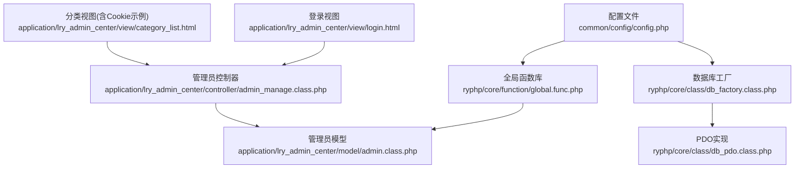
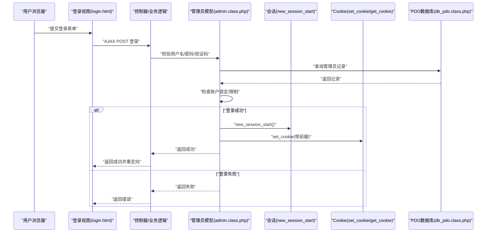
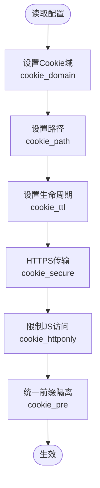
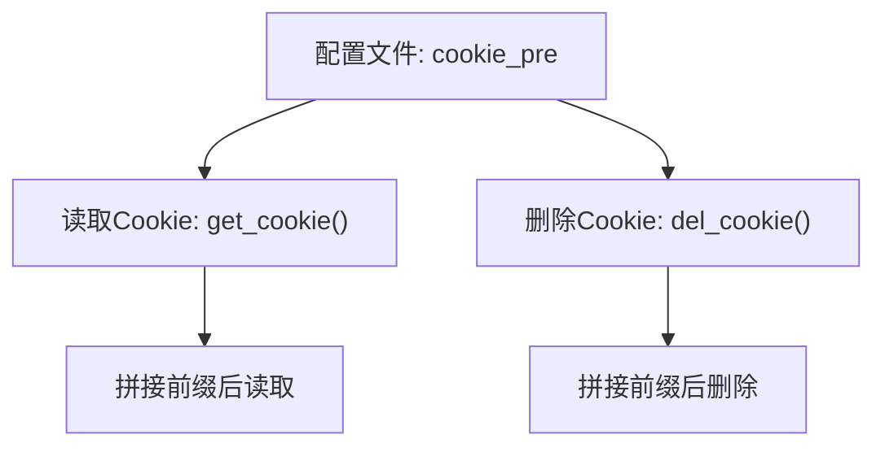
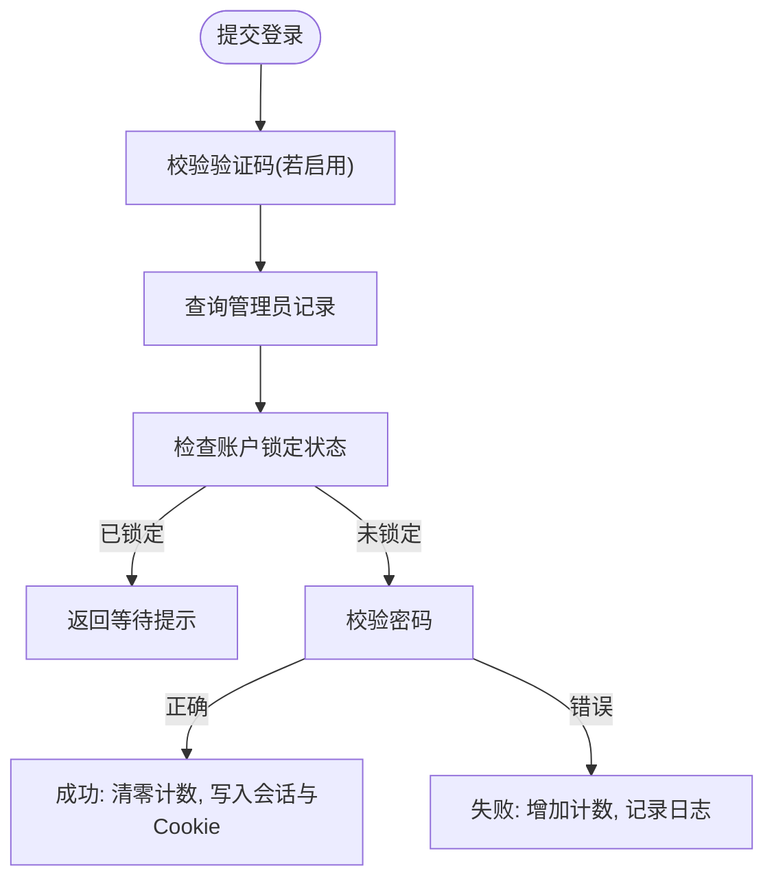
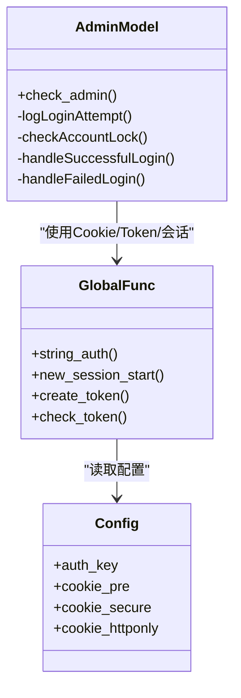
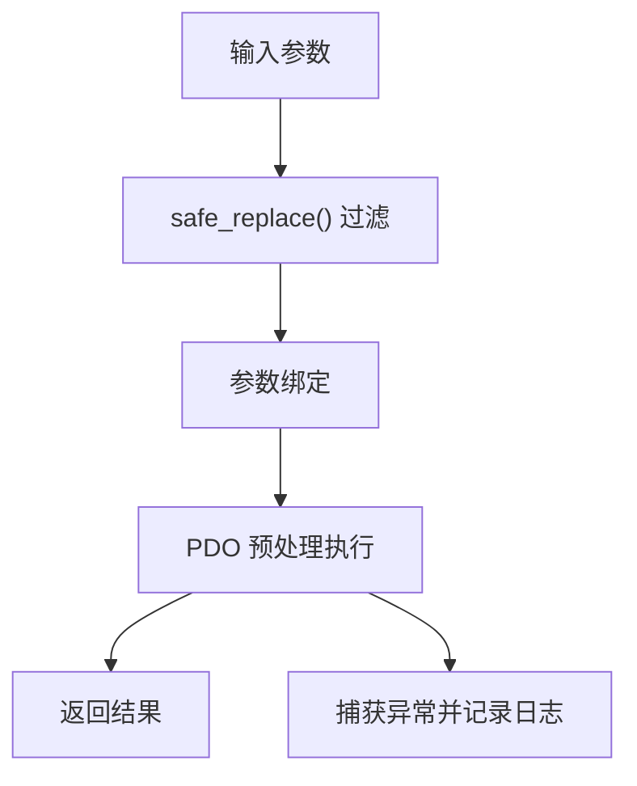
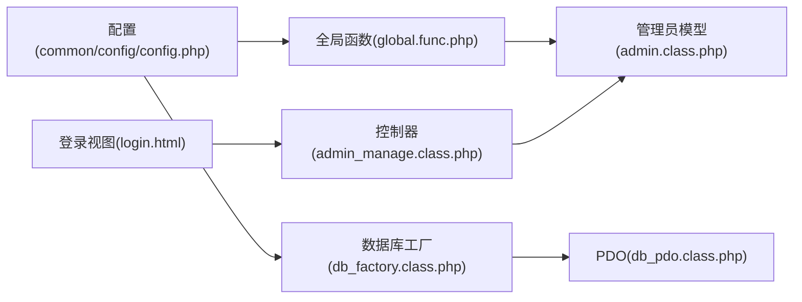

# 安全配置

<cite>
**本文引用的文件**
- [common/config/config.php](file://common/config/config.php)
- [ryphp/core/function/global.func.php](file://ryphp/core/function/global.func.php)
- [ryphp/core/class/db_pdo.class.php](file://ryphp/core/class/db_pdo.class.php)
- [ryphp/core/class/db_factory.class.php](file://ryphp/core/class/db_factory.class.php)
- [application/lry_admin_center/model/admin.class.php](file://application/lry_admin_center/model/admin.class.php)
- [application/lry_admin_center/view/login.html](file://application/lry_admin_center/view/login.html)
- [application/lry_admin_center/view/category_list.html](file://application/lry_admin_center/view/category_list.html)
- [application/lry_admin_center/controller/admin_manage.class.php](file://application/lry_admin_center/controller/admin_manage.class.php)
- [common/static/plugin/ueditor/php/lry_action.php](file://common/static/plugin/ueditor/php/lry_action.php)
- [application/install/index.php](file://application/install/index.php)
- [ryphp/core/message/error.tpl](file://ryphp/core/message/error.tpl)
</cite>

## 目录
1. [简介](#简介)
2. [项目结构](#项目结构)
3. [核心组件](#核心组件)
4. [架构总览](#架构总览)
5. [详细组件分析](#详细组件分析)
6. [依赖关系分析](#依赖关系分析)
7. [性能考量](#性能考量)
8. [故障排查指南](#故障排查指南)
9. [结论](#结论)
10. [附录](#附录)

## 简介
本文件面向LRYBlog的安全配置，围绕Cookie安全、多系统Cookie隔离、管理员登录安全、系统密钥与加密、SQL注入与XSS防护、HTTPS与安全头、以及安全审计与日志监控等方面，提供基于源码的深入解读与最佳实践建议。读者无需深厚的编程背景，也能据此完成生产环境下的安全加固。

## 项目结构
与安全配置直接相关的关键模块分布如下：
- 配置层：系统密钥、Cookie、数据库、路由等集中于配置文件
- 全局函数层：Cookie读写、Token、加密解密、安全过滤、HTTPS判断等
- 数据访问层：PDO封装、参数绑定、预处理、错误处理
- 控制器与模型层：管理员登录流程、验证码、登录限制与防暴力破解
- 视图层：登录页、前端Cookie设置示例
- 安装脚本：首次安装时随机生成auth_key

**图表来源**
- [common/config/config.php:1-88](file://common/config/config.php#L1-L88)
- [ryphp/core/function/global.func.php:1393-1731](file://ryphp/core/function/global.func.php#L1393-L1731)
- [ryphp/core/class/db_factory.class.php:11-50](file://ryphp/core/class/db_factory.class.php#L11-L50)
- [ryphp/core/class/db_pdo.class.php:10-646](file://ryphp/core/class/db_pdo.class.php#L10-L646)
- [application/lry_admin_center/model/admin.class.php:1-96](file://application/lry_admin_center/model/admin.class.php#L1-L96)
- [application/lry_admin_center/controller/admin_manage.class.php:1-105](file://application/lry_admin_center/controller/admin_manage.class.php#L1-L105)
- [application/lry_admin_center/view/login.html:1-97](file://application/lry_admin_center/view/login.html#L1-L97)
- [application/lry_admin_center/view/category_list.html:48-81](file://application/lry_admin_center/view/category_list.html#L48-L81)

**章节来源**
- [common/config/config.php:1-88](file://common/config/config.php#L1-L88)
- [ryphp/core/function/global.func.php:1393-1731](file://ryphp/core/function/global.func.php#L1393-L1731)
- [ryphp/core/class/db_factory.class.php:11-50](file://ryphp/core/class/db_factory.class.php#L11-L50)
- [ryphp/core/class/db_pdo.class.php:10-646](file://ryphp/core/class/db_pdo.class.php#L10-L646)
- [application/lry_admin_center/model/admin.class.php:1-96](file://application/lry_admin_center/model/admin.class.php#L1-L96)
- [application/lry_admin_center/controller/admin_manage.class.php:1-105](file://application/lry_admin_center/controller/admin_manage.class.php#L1-L105)
- [application/lry_admin_center/view/login.html:1-97](file://application/lry_admin_center/view/login.html#L1-L97)
- [application/lry_admin_center/view/category_list.html:48-81](file://application/lry_admin_center/view/category_list.html#L48-L81)

## 核心组件
- Cookie安全配置：作用域、路径、生命周期、传输安全、HttpOnly、SameSite
- Cookie前缀隔离：多系统部署时的Cookie隔离策略
- 管理员登录安全：验证码开关、登录限制、防暴力破解
- 系统密钥与加密：auth_key、加密算法、Token机制
- SQL注入防护：PDO预处理、参数绑定、安全过滤
- XSS防护：输入过滤、HTML转义
- HTTPS与安全头：HTTPS检测、安全头建议
- 安全审计与日志：错误日志、登录日志、审计事件

**章节来源**
- [common/config/config.php:31-38](file://common/config/config.php#L31-L38)
- [ryphp/core/function/global.func.php:1393-1432](file://ryphp/core/function/global.func.php#L1393-L1432)
- [ryphp/core/function/global.func.php:1693-1731](file://ryphp/core/function/global.func.php#L1693-L1731)
- [ryphp/core/function/global.func.php:487-516](file://ryphp/core/function/global.func.php#L487-L516)
- [ryphp/core/class/db_pdo.class.php:10-646](file://ryphp/core/class/db_pdo.class.php#L10-L646)
- [application/lry_admin_center/model/admin.class.php:1-96](file://application/lry_admin_center/model/admin.class.php#L1-L96)
- [application/lry_admin_center/view/login.html:24-28](file://application/lry_admin_center/view/login.html#L24-L28)

## 架构总览
下图展示从用户登录到会话建立、Cookie与Token使用的整体流程，以及与数据库访问、安全过滤、HTTPS检测的关系。

**图表来源**
- [application/lry_admin_center/view/login.html:14-95](file://application/lry_admin_center/view/login.html#L14-L95)
- [application/lry_admin_center/model/admin.class.php:4-96](file://application/lry_admin_center/model/admin.class.php#L4-L96)
- [ryphp/core/function/global.func.php:1693-1707](file://ryphp/core/function/global.func.php#L1693-L1707)
- [ryphp/core/function/global.func.php:1393-1432](file://ryphp/core/function/global.func.php#L1393-L1432)
- [ryphp/core/class/db_pdo.class.php:10-646](file://ryphp/core/class/db_pdo.class.php#L10-L646)

## 详细组件分析

### Cookie安全配置
- 作用域与路径
  - 作用域：通过配置项控制Cookie域范围，避免跨子域污染
  - 路径：默认根路径，限制Cookie可见范围
- 生命周期
  - TTL为0表示随会话；可按需设置过期时间
- 传输安全
  - Secure标志：仅在HTTPS下传输
  - HttpOnly：禁止JavaScript读取，降低XSS窃取风险
  - SameSite：推荐设置为Lax或Strict，缓解CSRF
- 前缀隔离
  - 通过统一前缀区分不同系统实例，避免同域下Cookie冲突

**图表来源**
- [common/config/config.php:31-38](file://common/config/config.php#L31-L38)

**章节来源**
- [common/config/config.php:31-38](file://common/config/config.php#L31-L38)
- [ryphp/core/function/global.func.php:1393-1432](file://ryphp/core/function/global.func.php#L1393-L1432)

### Cookie前缀配置与多系统隔离
- 系统默认前缀为固定值，多系统部署时应修改该前缀，确保各实例Cookie互不干扰
- 前缀在读取/删除Cookie时统一加上，保证一致性

**图表来源**
- [common/config/config.php:35](file://common/config/config.php#L35)
- [ryphp/core/function/global.func.php:1393-1432](file://ryphp/core/function/global.func.php#L1393-L1432)

**章节来源**
- [common/config/config.php:35](file://common/config/config.php#L35)
- [ryphp/core/function/global.func.php:1393-1432](file://ryphp/core/function/global.func.php#L1393-L1432)

### 管理员登录安全配置
- 验证码开关
  - 配置项控制是否启用验证码
  - 登录页提供验证码图片与输入框
- 登录限制与防暴力破解
  - 失败次数阈值与递增锁定时间阶梯
  - 最近一次失败时间窗口内禁止登录
  - 登录成功清零失败计数

**图表来源**
- [application/lry_admin_center/view/login.html:24-28](file://application/lry_admin_center/view/login.html#L24-L28)
- [application/lry_admin_center/model/admin.class.php:1-96](file://application/lry_admin_center/model/admin.class.php#L1-L96)
- [common/config/config.php:85](file://common/config/config.php#L85)

**章节来源**
- [application/lry_admin_center/view/login.html:24-28](file://application/lry_admin_center/view/login.html#L24-L28)
- [application/lry_admin_center/model/admin.class.php:1-96](file://application/lry_admin_center/model/admin.class.php#L1-L96)
- [common/config/config.php:85](file://common/config/config.php#L85)

### 系统密钥与加密机制
- auth_key
  - 作为加密/解密的密钥材料之一
  - 安装时可随机生成，建议生产环境手动替换为强随机值
- 加密算法
  - 使用对称加密函数，结合auth_key与配置项生成密钥派生
  - Token机制配合HttpOnly会话，提升CSRF防护
- 会话安全
  - 强制HttpOnly会话，启动前对异常Cookie进行清理

**图表来源**
- [ryphp/core/function/global.func.php:1141-1180](file://ryphp/core/function/global.func.php#L1141-L1180)
- [ryphp/core/function/global.func.php:1693-1731](file://ryphp/core/function/global.func.php#L1693-L1731)
- [common/config/config.php:6](file://common/config/config.php#L6)
- [application/lry_admin_center/model/admin.class.php:1-96](file://application/lry_admin_center/model/admin.class.php#L1-L96)

**章节来源**
- [common/config/config.php:6](file://common/config/config.php#L6)
- [ryphp/core/function/global.func.php:1141-1180](file://ryphp/core/function/global.func.php#L1141-L1180)
- [ryphp/core/function/global.func.php:1693-1731](file://ryphp/core/function/global.func.php#L1693-L1731)
- [application/install/index.php:321-344](file://application/install/index.php#L321-L344)

### SQL注入防护配置
- PDO预处理与参数绑定
  - 所有动态SQL通过预处理语句执行，绑定参数，杜绝拼接
  - 严格区分where条件与bind参数，避免二次注入
- 安全过滤
  - 输入过滤函数移除危险字符并进行HTML转义
- 错误处理
  - 开发模式下输出详细错误，生产模式写入日志并友好提示

**图表来源**
- [ryphp/core/class/db_pdo.class.php:100-124](file://ryphp/core/class/db_pdo.class.php#L100-L124)
- [ryphp/core/function/global.func.php:487-516](file://ryphp/core/function/global.func.php#L487-L516)
- [ryphp/core/class/db_factory.class.php:38-49](file://ryphp/core/class/db_factory.class.php#L38-L49)

**章节来源**
- [ryphp/core/class/db_pdo.class.php:100-124](file://ryphp/core/class/db_pdo.class.php#L100-L124)
- [ryphp/core/function/global.func.php:487-516](file://ryphp/core/function/global.func.php#L487-L516)
- [ryphp/core/class/db_factory.class.php:38-49](file://ryphp/core/class/db_factory.class.php#L38-L49)

### XSS攻击防护设置
- 输入过滤
  - 移除URL编码与特殊字符，对尖括号进行HTML转义
- 输出安全
  - 模板渲染时遵循最小暴露原则，避免在HTML属性中直接拼接不可信数据
- 建议
  - 配合Content-Security-Policy与X-Content-Type-Options等安全头进一步强化

**章节来源**
- [ryphp/core/function/global.func.php:487-516](file://ryphp/core/function/global.func.php#L487-L516)

### HTTPS配置与安全头设置
- HTTPS检测
  - 提供多维度的HTTPS判断函数，兼容反向代理场景
- 安全头建议
  - HSTS、X-Frame-Options、X-Content-Type-Options、Referrer-Policy、Permissions-Policy等
  - Cookie Secure与SameSite=Lax/Strict配合使用
- 生产环境
  - 强制HTTPS，关闭明文端口；合理设置Cookie Secure与HttpOnly

**章节来源**
- [common/static/plugin/ueditor/php/lry_action.php:141-158](file://common/static/plugin/ueditor/php/lry_action.php#L141-L158)
- [ryphp/core/function/global.func.php:268-281](file://ryphp/core/function/global.func.php#L268-L281)
- [common/config/config.php:36](file://common/config/config.php#L36)

### 安全审计与日志监控最佳实践
- 登录日志
  - 记录用户名、IP、时间、结果与原因，用于追踪异常登录
- 错误日志
  - 非调试模式下统一写入错误日志，避免敏感信息泄露
- 审计事件
  - 密码修改、关键配置变更等操作建议记录审计日志并落盘

**章节来源**
- [application/lry_admin_center/model/admin.class.php:29-38](file://application/lry_admin_center/model/admin.class.php#L29-L38)
- [ryphp/core/message/error.tpl:1-179](file://ryphp/core/message/error.tpl#L1-L179)
- [application/lry_admin_center/controller/admin_manage.class.php:70-104](file://application/lry_admin_center/controller/admin_manage.class.php#L70-L104)

## 依赖关系分析
- 配置依赖
  - 全局函数与模型均依赖配置项（auth_key、cookie_*、admin_login_code等）
- 数据访问依赖
  - 工厂类根据配置选择具体数据库实现，PDO实现负责预处理与错误处理
- 登录流程依赖
  - 视图触发控制器，控制器调用模型，模型使用全局函数与数据库

**图表来源**
- [common/config/config.php:1-88](file://common/config/config.php#L1-L88)
- [ryphp/core/function/global.func.php:1393-1731](file://ryphp/core/function/global.func.php#L1393-L1731)
- [ryphp/core/class/db_factory.class.php:11-50](file://ryphp/core/class/db_factory.class.php#L11-L50)
- [ryphp/core/class/db_pdo.class.php:10-646](file://ryphp/core/class/db_pdo.class.php#L10-L646)
- [application/lry_admin_center/model/admin.class.php:1-96](file://application/lry_admin_center/model/admin.class.php#L1-L96)
- [application/lry_admin_center/controller/admin_manage.class.php:1-105](file://application/lry_admin_center/controller/admin_manage.class.php#L1-L105)
- [application/lry_admin_center/view/login.html:1-97](file://application/lry_admin_center/view/login.html#L1-L97)

**章节来源**
- [common/config/config.php:1-88](file://common/config/config.php#L1-L88)
- [ryphp/core/function/global.func.php:1393-1731](file://ryphp/core/function/global.func.php#L1393-L1731)
- [ryphp/core/class/db_factory.class.php:11-50](file://ryphp/core/class/db_factory.class.php#L11-L50)
- [ryphp/core/class/db_pdo.class.php:10-646](file://ryphp/core/class/db_pdo.class.php#L10-L646)
- [application/lry_admin_center/model/admin.class.php:1-96](file://application/lry_admin_center/model/admin.class.php#L1-L96)
- [application/lry_admin_center/controller/admin_manage.class.php:1-105](file://application/lry_admin_center/controller/admin_manage.class.php#L1-L105)
- [application/lry_admin_center/view/login.html:1-97](file://application/lry_admin_center/view/login.html#L1-L97)

## 性能考量
- Cookie与会话
  - 合理设置Cookie TTL与路径，减少不必要的网络传输
  - 会话HttpOnly与Token配合，避免频繁读写Cookie带来的开销
- 数据库访问
  - 使用PDO预处理与参数绑定，减少SQL解析与编译成本
  - 合理索引与查询条件，避免全表扫描
- 日志与审计
  - 错误日志异步写入，避免阻塞请求
  - 登录日志与审计事件按需落盘，定期归档

## 故障排查指南
- 登录失败/被锁定
  - 检查验证码开关与输入是否正确
  - 查看最近失败时间窗口是否仍在锁定期内
  - 确认管理员记录的错误次数与锁定阈值
- Cookie无法读取
  - 检查Cookie域、路径、Secure与SameSite设置
  - 确认前端是否正确拼接前缀
- HTTPS相关问题
  - 使用HTTPS检测函数确认当前协议
  - 检查反代转发头是否正确传递
- 数据库报错
  - 开启调试查看详细SQL与错误信息
  - 检查PDO参数与预处理绑定是否正确

**章节来源**
- [application/lry_admin_center/model/admin.class.php:40-65](file://application/lry_admin_center/model/admin.class.php#L40-L65)
- [ryphp/core/function/global.func.php:1393-1432](file://ryphp/core/function/global.func.php#L1393-L1432)
- [common/static/plugin/ueditor/php/lry_action.php:141-158](file://common/static/plugin/ueditor/php/lry_action.php#L141-L158)
- [ryphp/core/class/db_pdo.class.php:191-227](file://ryphp/core/class/db_pdo.class.php#L191-L227)

## 结论
通过对Cookie安全、登录安全、系统密钥与加密、SQL注入与XSS防护、HTTPS与安全头、以及安全审计与日志监控的系统性梳理，LRYBlog具备了较为完善的安全基线。建议在生产环境中：
- 明确HTTPS与安全头策略，强制Cookie Secure与HttpOnly
- 为多系统部署配置独立Cookie前缀
- 启用验证码与登录限制，结合日志审计持续监控
- 使用PDO预处理与输入过滤，保持最小权限与最小暴露原则

## 附录
- 安装时auth_key生成参考：[application/install/index.php:321-344](file://application/install/index.php#L321-L344)
- 前端Cookie设置示例（SameSite/Lax）：[application/lry_admin_center/view/category_list.html:48-81](file://application/lry_admin_center/view/category_list.html#L48-L81)