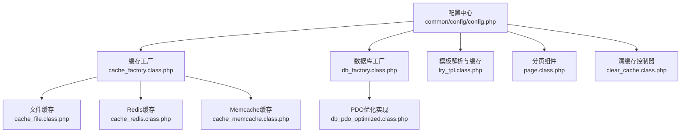
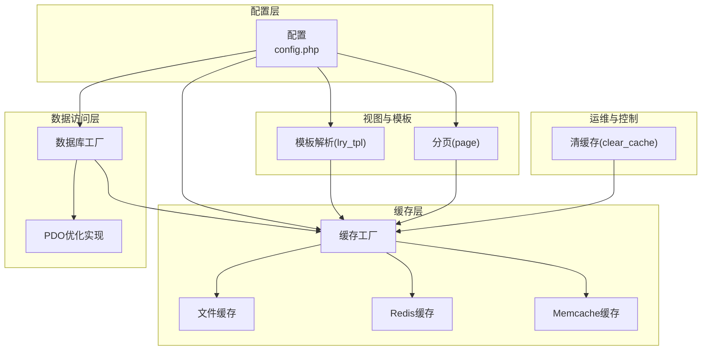
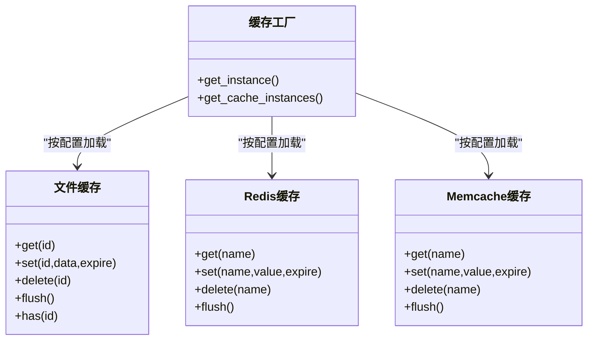
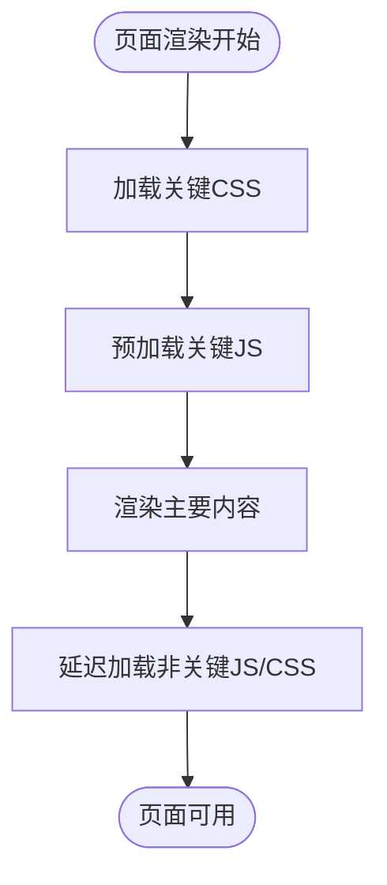
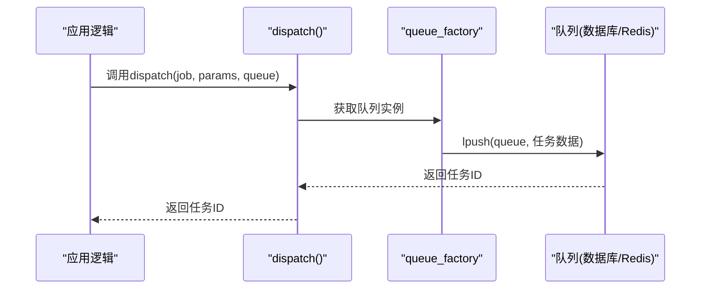
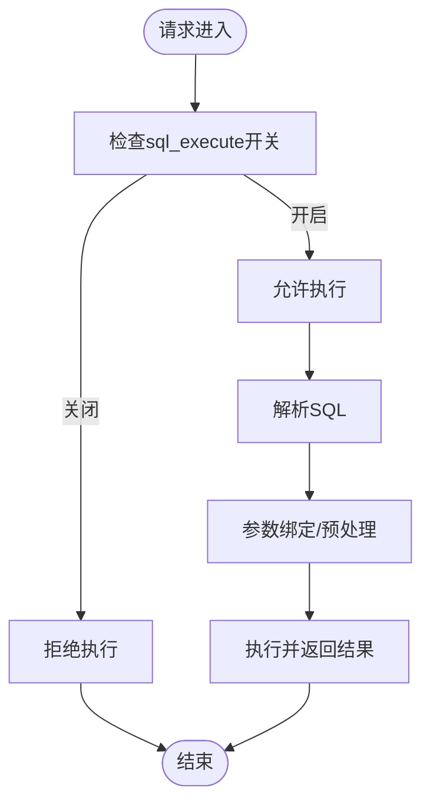
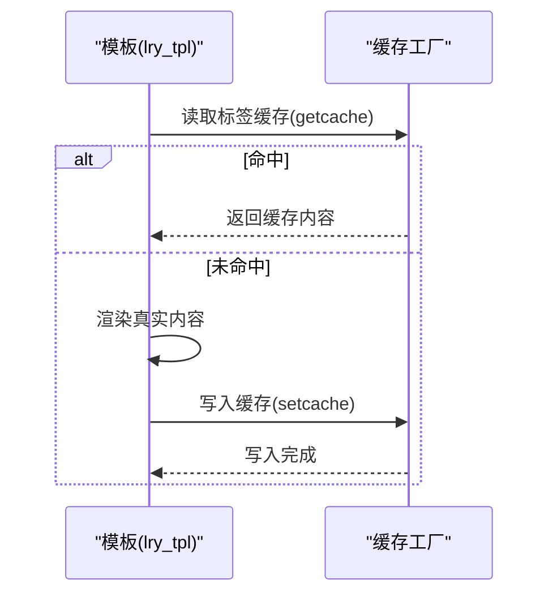
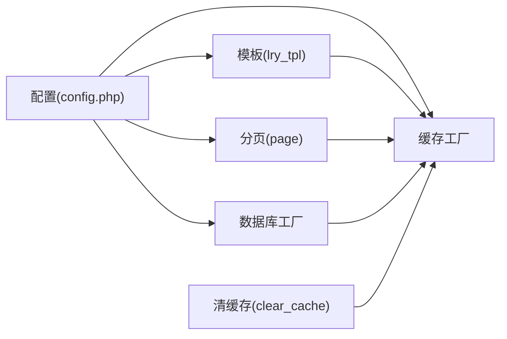

# 性能配置

<cite>
**本文引用的文件**
- [common/config/config.php](file://common/config/config.php)
- [ryphp/core/class/cache_factory.class.php](file://ryphp/core/class/cache_factory.class.php)
- [ryphp/core/class/cache_file.class.php](file://ryphp/core/class/cache_file.class.php)
- [ryphp/core/class/cache_redis.class.php](file://ryphp/core/class/cache_redis.class.php)
- [ryphp/core/class/cache_memcache.class.php](file://ryphp/core/class/cache_memcache.class.php)
- [ryphp/core/class/db_factory.class.php](file://ryphp/core/class/db_factory.class.php)
- [ryphp/core/class/db_pdo_optimized.class.php](file://ryphp/core/class/db_pdo_optimized.class.php)
- [ryphp/core/class/page.class.php](file://ryphp/core/class/page.class.php)
- [ryphp/core/class/lry_tpl.class.php](file://ryphp/core/class/lry_tpl.class.php)
- [ryphp/core/function/global.func.php](file://ryphp/core/function/global.func.php)
- [application/lry_admin_center/controller/clear_cache.class.php](file://application/lry_admin_center/controller/clear_cache.class.php)
- [application/index/view/rongyao/show_article.html](file://application/index/view/rongyao/show_article.html)
- [application/index/view/rongyao/category_page.html](file://application/index/view/rongyao/category_page.html)
- [application/index/view/rongyao/list_article.html](file://application/index/view/rongyao/list_article.html)
</cite>

## 目录
1. [简介](#简介)
2. [项目结构](#项目结构)
3. [核心组件](#核心组件)
4. [架构总览](#架构总览)
5. [详细组件分析](#详细组件分析)
6. [依赖关系分析](#依赖关系分析)
7. [性能考量与优化建议](#性能考量与优化建议)
8. [故障排查指南](#故障排查指南)
9. [结论](#结论)
10. [附录](#附录)

## 简介
本文件面向LRYBlog的性能配置与优化，围绕以下主题展开：缓存策略（页面缓存、数据缓存、模板缓存）、压缩与静态资源优化、CDN配置思路、队列配置（数据库队列与Redis队列）、SQL执行安全控制、性能监控与调优建议，以及不同负载下的最佳实践。文档以仓库现有实现为基础，结合代码结构与配置项进行系统性梳理，并提供可视化图示帮助理解。

## 项目结构
LRYBlog采用模块化的MVC结构，核心框架位于ryphp目录，应用层在application目录，公共配置在common/config中。与性能相关的关键点包括：
- 配置集中于common/config/config.php，涵盖缓存、队列、数据库、上传等
- 缓存子系统通过工厂类按配置动态选择file/redis/memcache实现
- 数据库子系统通过工厂类按配置选择mysql/mysqli/pdo实现
- 模板系统支持标签级缓存，配合缓存工厂实现
- 分页组件支持伪静态与分页URL生成，影响页面缓存命中率
- 后台提供清缓存接口，便于运维快速清理

**图表来源**
- [common/config/config.php:1-88](file://common/config/config.php#L1-L88)
- [ryphp/core/class/cache_factory.class.php:1-84](file://ryphp/core/class/cache_factory.class.php#L1-L84)
- [ryphp/core/class/cache_file.class.php:1-130](file://ryphp/core/class/cache_file.class.php#L1-L130)
- [ryphp/core/class/cache_redis.class.php:1-108](file://ryphp/core/class/cache_redis.class.php#L1-L108)
- [ryphp/core/class/cache_memcache.class.php](file://ryphp/core/class/cache_memcache.class.php)
- [ryphp/core/class/db_factory.class.php:1-50](file://ryphp/core/class/db_factory.class.php#L1-L50)
- [ryphp/core/class/db_pdo_optimized.class.php:1-767](file://ryphp/core/class/db_pdo_optimized.class.php#L1-L767)
- [ryphp/core/class/lry_tpl.class.php:1-134](file://ryphp/core/class/lry_tpl.class.php#L1-L134)
- [ryphp/core/class/page.class.php:1-202](file://ryphp/core/class/page.class.php#L1-L202)
- [application/lry_admin_center/controller/clear_cache.class.php:1-25](file://application/lry_admin_center/controller/clear_cache.class.php#L1-L25)

**章节来源**
- [common/config/config.php:1-88](file://common/config/config.php#L1-L88)
- [ryphp/core/class/cache_factory.class.php:1-84](file://ryphp/core/class/cache_factory.class.php#L1-L84)
- [ryphp/core/class/db_factory.class.php:1-50](file://ryphp/core/class/db_factory.class.php#L1-L50)

## 核心组件
- 缓存配置与工厂
  - 配置项：cache_type、file_config、redis_config、memcache_config
  - 工厂根据cache_type动态加载对应缓存实现
- 数据库配置与工厂
  - 配置项：db_type、db_host、db_name、db_user、db_pwd、db_port、db_charset、db_prefix
  - 工厂根据db_type加载mysql/mysqli/pdo实现
- 模板与标签缓存
  - lry_tpl支持标签级cache属性，结合getcache/setcache实现
- 分页与URL
  - page类支持伪静态后缀、分页前缀、列表URL生成，影响页面缓存命中
- 清缓存
  - 后台控制器提供清缓存接口，清理模板缓存与通用缓存

**章节来源**
- [common/config/config.php:39-87](file://common/config/config.php#L39-L87)
- [ryphp/core/class/cache_factory.class.php:36-82](file://ryphp/core/class/cache_factory.class.php#L36-L82)
- [ryphp/core/class/db_factory.class.php:11-49](file://ryphp/core/class/db_factory.class.php#L11-L49)
- [ryphp/core/class/lry_tpl.class.php:70-92](file://ryphp/core/class/lry_tpl.class.php#L70-L92)
- [ryphp/core/class/page.class.php:26-200](file://ryphp/core/class/page.class.php#L26-L200)
- [application/lry_admin_center/controller/clear_cache.class.php:9-24](file://application/lry_admin_center/controller/clear_cache.class.php#L9-L24)

## 架构总览
下图展示了性能相关组件之间的交互关系，重点体现缓存、数据库、模板与分页如何协同提升性能。

**图表来源**
- [common/config/config.php:1-88](file://common/config/config.php#L1-L88)
- [ryphp/core/class/cache_factory.class.php:1-84](file://ryphp/core/class/cache_factory.class.php#L1-L84)
- [ryphp/core/class/db_factory.class.php:1-50](file://ryphp/core/class/db_factory.class.php#L1-L50)
- [ryphp/core/class/lry_tpl.class.php:1-134](file://ryphp/core/class/lry_tpl.class.php#L1-L134)
- [ryphp/core/class/page.class.php:1-202](file://ryphp/core/class/page.class.php#L1-L202)
- [application/lry_admin_center/controller/clear_cache.class.php:1-25](file://application/lry_admin_center/controller/clear_cache.class.php#L1-L25)

## 详细组件分析

### 缓存策略配置
- 文件缓存
  - 特点：基于文件系统，适合小规模部署；支持序列化与可执行数组两种存储模式
  - 关键配置：cache_dir、suffix、mode
  - 使用场景：开发环境、低并发、无Redis/Memcache时的备选
- Redis缓存
  - 特点：高性能内存KV存储，支持过期、持久化连接、命名空间前缀
  - 关键配置：host、port、password、select、timeout、expire、persistent、prefix
  - 使用场景：高并发、需要跨实例共享缓存
- Memcache缓存
  - 特点：轻量级内存缓存，语法与Redis类似
  - 关键配置：host、port、timeout、expire、persistent、prefix
  - 使用场景：对Redis依赖度不高的环境

**图表来源**
- [ryphp/core/class/cache_factory.class.php:36-82](file://ryphp/core/class/cache_factory.class.php#L36-L82)
- [ryphp/core/class/cache_file.class.php:17-128](file://ryphp/core/class/cache_file.class.php#L17-L128)
- [ryphp/core/class/cache_redis.class.php:60-105](file://ryphp/core/class/cache_redis.class.php#L60-L105)
- [ryphp/core/class/cache_memcache.class.php:57-90](file://ryphp/core/class/cache_memcache.class.php#L57-L90)

**章节来源**
- [common/config/config.php:39-66](file://common/config/config.php#L39-L66)
- [ryphp/core/class/cache_factory.class.php:36-82](file://ryphp/core/class/cache_factory.class.php#L36-L82)
- [ryphp/core/class/cache_file.class.php:17-128](file://ryphp/core/class/cache_file.class.php#L17-L128)
- [ryphp/core/class/cache_redis.class.php:60-105](file://ryphp/core/class/cache_redis.class.php#L60-L105)
- [ryphp/core/class/cache_memcache.class.php:57-90](file://ryphp/core/class/cache_memcache.class.php#L57-L90)

### 压缩与静态资源优化
- 页面内资源加载策略
  - 关键CSS与关键JS优先加载，非关键资源延迟加载
  - 使用<link rel="preload">预加载关键资源
- 压缩与缓存
  - 代码未直接提供Gzip压缩开关；可在Web服务器层启用（如Nginx/Apache）以获得静态资源压缩收益
  - 建议对CSS/JS进行合并与版本戳（timestamp）避免缓存穿透
- 模板缓存
  - lry_tpl支持标签级cache属性，减少重复渲染开销

**图表来源**
- [application/index/view/rongyao/show_article.html:9-30](file://application/index/view/rongyao/show_article.html#L9-L30)
- [application/index/view/rongyao/category_page.html:9-30](file://application/index/view/rongyao/category_page.html#L9-L30)
- [application/index/view/rongyao/list_article.html:9-34](file://application/index/view/rongyao/list_article.html#L9-L34)
- [ryphp/core/class/lry_tpl.class.php:76-91](file://ryphp/core/class/lry_tpl.class.php#L76-L91)

**章节来源**
- [application/index/view/rongyao/show_article.html:9-30](file://application/index/view/rongyao/show_article.html#L9-L30)
- [application/index/view/rongyao/category_page.html:9-30](file://application/index/view/rongyao/category_page.html#L9-L30)
- [application/index/view/rongyao/list_article.html:9-34](file://application/index/view/rongyao/list_article.html#L9-L34)
- [ryphp/core/class/lry_tpl.class.php:76-91](file://ryphp/core/class/lry_tpl.class.php#L76-L91)

### CDN配置思路
- 静态资源CDN
  - 将CSS/JS/Image等静态资源指向CDN域名，降低源站带宽压力
  - 建议为不同资源类型设置独立TTL，热点资源短TTL、冷资源长TTL
- 图片CDN
  - 可结合上传类型配置（如七牛、阿里云、腾讯云），实现图片直传与CDN回源
  - 对图片进行懒加载与尺寸适配，减少首屏阻塞
- 注意事项
  - CDN缓存一致性：更新资源时采用版本戳或目录滚动策略
  - 回源策略：合理设置回源头与缓存键，避免污染

[本节为概念性说明，无需代码来源]

### 队列配置（数据库队列与Redis队列）
- 队列驱动
  - 配置项：queue_connection（database/redis），queue_name
- 任务下发
  - 全局函数dispatch用于封装任务对象并推送到队列
- 使用场景
  - 数据库队列：轻量异步任务（如日志、通知）
  - Redis队列：高并发、需要可靠性的任务（需配套消费者）

**图表来源**
- [ryphp/core/function/global.func.php:1565-1581](file://ryphp/core/function/global.func.php#L1565-L1581)
- [common/config/config.php:68-70](file://common/config/config.php#L68-L70)

**章节来源**
- [common/config/config.php:68-70](file://common/config/config.php#L68-L70)
- [ryphp/core/function/global.func.php:1565-1581](file://ryphp/core/function/global.func.php#L1565-L1581)

### SQL执行安全控制
- 在线SQL执行
  - 配置项：sql_execute（默认关闭）
  - 安全建议：生产环境保持关闭，仅在维护窗口或受控环境下开启
- 数据库连接与优化
  - 工厂按配置选择PDO/MySQLi/MySQL实现
  - PDO优化实现启用严格参数绑定、预处理、错误模式等，降低注入风险与提升稳定性

**图表来源**
- [common/config/config.php:83](file://common/config/config.php#L83)
- [ryphp/core/class/db_factory.class.php:14-31](file://ryphp/core/class/db_factory.class.php#L14-L31)
- [ryphp/core/class/db_pdo_optimized.class.php:180-208](file://ryphp/core/class/db_pdo_optimized.class.php#L180-L208)

**章节来源**
- [common/config/config.php:83](file://common/config/config.php#L83)
- [ryphp/core/class/db_factory.class.php:14-31](file://ryphp/core/class/db_factory.class.php#L14-L31)
- [ryphp/core/class/db_pdo_optimized.class.php:180-208](file://ryphp/core/class/db_pdo_optimized.class.php#L180-L208)

### 模板缓存与页面缓存
- 模板缓存
  - lry_tpl支持标签级cache属性，通过getcache/setcache实现
  - 适用于高频但不频繁变化的内容片段
- 页面缓存
  - 建议结合分页组件与伪静态后缀，生成稳定URL，提高缓存命中
  - 后台提供清缓存接口，便于在内容更新后刷新缓存

**图表来源**
- [ryphp/core/class/lry_tpl.class.php:76-91](file://ryphp/core/class/lry_tpl.class.php#L76-L91)
- [ryphp/core/class/cache_factory.class.php:77-82](file://ryphp/core/class/cache_factory.class.php#L77-L82)

**章节来源**
- [ryphp/core/class/lry_tpl.class.php:76-91](file://ryphp/core/class/lry_tpl.class.php#L76-L91)
- [ryphp/core/class/page.class.php:26-200](file://ryphp/core/class/page.class.php#L26-L200)
- [application/lry_admin_center/controller/clear_cache.class.php:9-24](file://application/lry_admin_center/controller/clear_cache.class.php#L9-L24)

## 依赖关系分析
- 配置到实现的依赖
  - config.php决定cache_type/db_type/queue_connection等关键行为
  - 工厂类按配置加载具体实现类
- 模块间耦合
  - lry_tpl依赖缓存工厂实现标签缓存
  - page类依赖配置生成伪静态URL，间接影响缓存命中
  - 清缓存控制器依赖缓存工厂与文件系统

**图表来源**
- [common/config/config.php:1-88](file://common/config/config.php#L1-L88)
- [ryphp/core/class/cache_factory.class.php:1-84](file://ryphp/core/class/cache_factory.class.php#L1-L84)
- [ryphp/core/class/db_factory.class.php:1-50](file://ryphp/core/class/db_factory.class.php#L1-L50)
- [ryphp/core/class/lry_tpl.class.php:1-134](file://ryphp/core/class/lry_tpl.class.php#L1-L134)
- [ryphp/core/class/page.class.php:1-202](file://ryphp/core/class/page.class.php#L1-L202)
- [application/lry_admin_center/controller/clear_cache.class.php:1-25](file://application/lry_admin_center/controller/clear_cache.class.php#L1-L25)

**章节来源**
- [common/config/config.php:1-88](file://common/config/config.php#L1-L88)
- [ryphp/core/class/cache_factory.class.php:1-84](file://ryphp/core/class/cache_factory.class.php#L1-L84)
- [ryphp/core/class/db_factory.class.php:1-50](file://ryphp/core/class/db_factory.class.php#L1-L50)
- [ryphp/core/class/lry_tpl.class.php:1-134](file://ryphp/core/class/lry_tpl.class.php#L1-L134)
- [ryphp/core/class/page.class.php:1-202](file://ryphp/core/class/page.class.php#L1-L202)
- [application/lry_admin_center/controller/clear_cache.class.php:1-25](file://application/lry_admin_center/controller/clear_cache.class.php#L1-L25)

## 性能考量与优化建议
- 缓存策略
  - 高并发场景优先Redis；低并发可考虑文件缓存
  - 合理设置缓存过期时间，热点数据短TTL，静态数据长TTL
  - 模板标签cache属性用于热点片段，避免重复渲染
- 数据库优化
  - 使用PDO优化实现，启用预处理与严格错误模式
  - 为高频查询建立索引，避免全表扫描
  - 控制单次查询数据量，结合分页组件limit
- 静态资源优化
  - 启用服务器端Gzip/HTTP压缩
  - 使用CDN分发静态资源，设置合理TTL
  - 关键资源预加载，非关键资源延迟加载
- 队列与异步
  - 高并发场景使用Redis队列，确保消息可靠性
  - 数据库队列适合轻量异步任务
- 安全与监控
  - 生产环境关闭在线SQL执行
  - 结合日志与慢查询分析工具定位瓶颈
  - 不同负载下调整缓存过期与队列并发

[本节为通用指导，无需代码来源]

## 故障排查指南
- 缓存无法写入
  - 检查缓存目录权限与磁盘空间（文件缓存）
  - 检查Redis/Memcache服务连通性与认证配置
- 模板缓存未生效
  - 确认模板标签是否设置cache属性
  - 清理缓存后重试
- 分页URL异常
  - 检查url_html_suffix与page前缀配置
  - 确认伪静态规则与服务器配置一致
- 清缓存无效
  - 确认cache目录可写
  - 检查模板缓存文件是否被删除

**章节来源**
- [application/lry_admin_center/controller/clear_cache.class.php:9-24](file://application/lry_admin_center/controller/clear_cache.class.php#L9-L24)
- [ryphp/core/class/cache_file.class.php:40-46](file://ryphp/core/class/cache_file.class.php#L40-L46)
- [ryphp/core/class/cache_redis.class.php:30-51](file://ryphp/core/class/cache_redis.class.php#L30-L51)
- [ryphp/core/class/page.class.php:39-200](file://ryphp/core/class/page.class.php#L39-L200)

## 结论
LRYBlog的性能配置以配置为中心，通过缓存工厂、数据库工厂与模板系统形成清晰的性能优化路径。结合合理的缓存策略、静态资源优化、CDN与队列配置，以及严格的SQL执行安全控制，可在不同负载下获得稳定且高效的运行表现。建议在生产环境中优先采用Redis缓存与CDN加速，并持续通过监控与日志进行性能调优。

## 附录
- 配置项速览
  - 缓存：cache_type、file_config、redis_config、memcache_config
  - 数据库：db_type、db_host、db_name、db_user、db_pwd、db_port、db_charset、db_prefix
  - 队列：queue_connection、queue_name
  - 其他：sql_execute、edit_template、upload_type、upload_file、watermark_*、url_html_suffix、site_theme
- 最佳实践清单
  - 高并发：Redis缓存 + CDN + 预加载 + 延迟加载
  - 中低并发：文件缓存 + 服务器Gzip + 合理TTL
  - 安全：关闭在线SQL执行，严格参数绑定，最小权限原则
  - 可观测性：慢查询日志、缓存命中率、队列积压监控

**章节来源**
- [common/config/config.php:1-88](file://common/config/config.php#L1-L88)