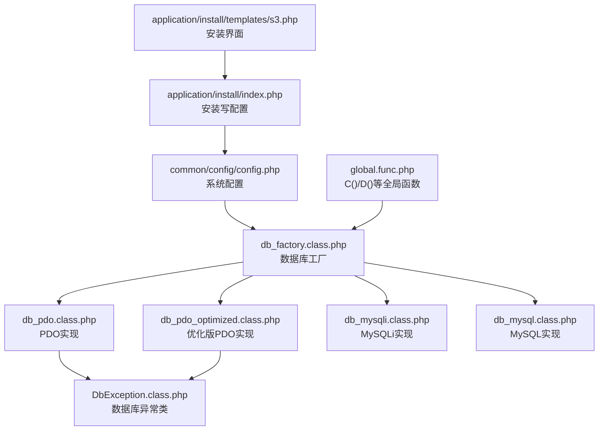
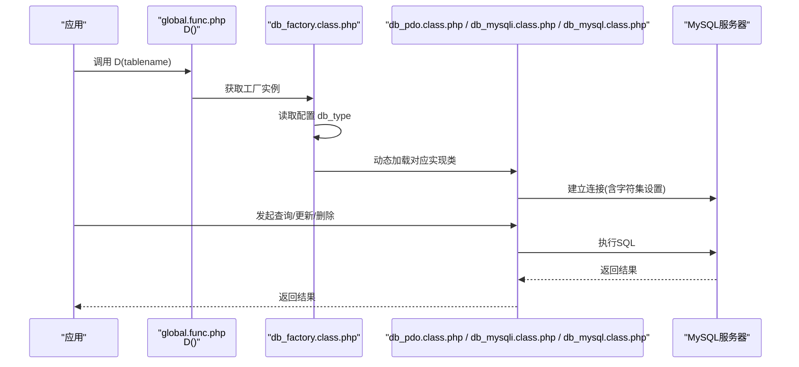
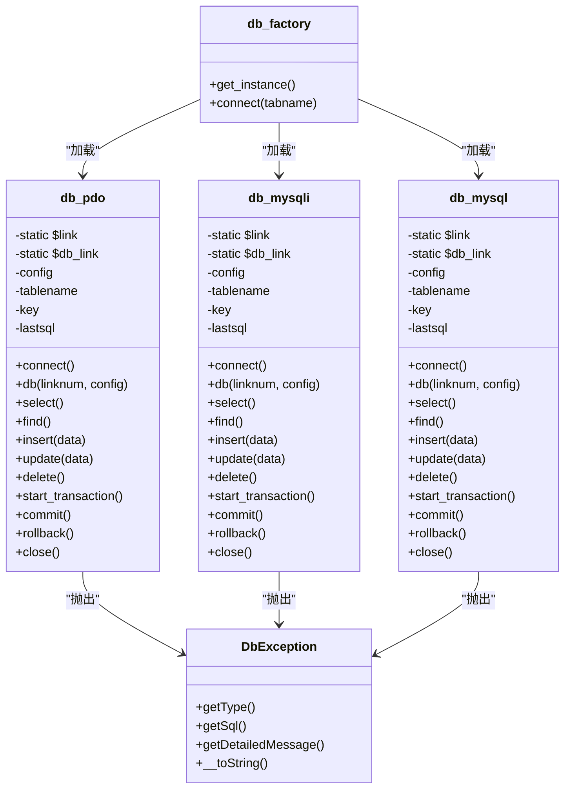
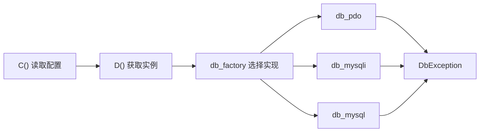

# 数据库配置

<cite>
**本文引用的文件列表**
- [common/config/config.php](file://common/config/config.php)
- [ryphp/core/class/db_factory.class.php](file://ryphp/core/class/db_factory.class.php)
- [ryphp/core/class/db_pdo.class.php](file://ryphp/core/class/db_pdo.class.php)
- [ryphp/core/class/db_pdo_optimized.class.php](file://ryphp/core/class/db_pdo_optimized.class.php)
- [ryphp/core/class/db_mysqli.class.php](file://ryphp/core/class/db_mysqli.class.php)
- [ryphp/core/class/db_mysql.class.php](file://ryphp/core/class/db_mysql.class.php)
- [ryphp/core/class/DbException.class.php](file://ryphp/core/class/DbException.class.php)
- [ryphp/core/function/global.func.php](file://ryphp/core/function/global.func.php)
- [application/install/index.php](file://application/install/index.php)
- [application/install/templates/s3.php](file://application/install/templates/s3.php)
</cite>

## 目录
1. [简介](#简介)
2. [项目结构](#项目结构)
3. [核心组件](#核心组件)
4. [架构总览](#架构总览)
5. [详细组件分析](#详细组件分析)
6. [依赖关系分析](#依赖关系分析)
7. [性能考量](#性能考量)
8. [故障排查指南](#故障排查指南)
9. [结论](#结论)
10. [附录](#附录)

## 简介
本文件面向LRYBlog数据库配置功能，系统性梳理数据库类型选择（PDO、MySQLi、MySQL）、连接参数配置、字符集与中文支持、表前缀策略、连接池与性能优化，以及不同环境下的最佳实践配置方案。文档以仓库现有实现为依据，结合安装流程与配置文件，给出可落地的配置指导与排障建议。

## 项目结构
围绕数据库配置的关键文件与职责如下：
- 全局配置入口：common/config/config.php
- 数据库工厂：ryphp/core/class/db_factory.class.php
- 数据库实现：PDO、MySQLi、MySQL三类实现类
- 安装流程与配置写入：application/install/index.php、application/install/templates/s3.php
- 全局函数：C()配置读取、D()数据库对象获取等

图表来源
- [common/config/config.php:13-21](file://common/config/config.php#L13-L21)
- [ryphp/core/class/db_factory.class.php:11-34](file://ryphp/core/class/db_factory.class.php#L11-L34)
- [ryphp/core/class/db_pdo.class.php:10-646](file://ryphp/core/class/db_pdo.class.php#L10-L646)
- [ryphp/core/class/db_pdo_optimized.class.php:13-767](file://ryphp/core/class/db_pdo_optimized.class.php#L13-L767)
- [ryphp/core/class/db_mysqli.class.php:10-660](file://ryphp/core/class/db_mysqli.class.php#L10-L660)
- [ryphp/core/class/db_mysql.class.php:10-667](file://ryphp/core/class/db_mysql.class.php#L10-L667)
- [ryphp/core/class/DbException.class.php:10-73](file://ryphp/core/class/DbException.class.php#L10-L73)
- [ryphp/core/function/global.func.php:4-26](file://ryphp/core/function/global.func.php#L4-L26)
- [application/install/index.php:150-193](file://application/install/index.php#L150-L193)
- [application/install/templates/s3.php:31-69](file://application/install/templates/s3.php#L31-L69)

章节来源
- [common/config/config.php:13-21](file://common/config/config.php#L13-L21)
- [ryphp/core/class/db_factory.class.php:11-34](file://ryphp/core/class/db_factory.class.php#L11-L34)
- [ryphp/core/function/global.func.php:4-26](file://ryphp/core/function/global.func.php#L4-L26)

## 核心组件
- 数据库类型选择
  - 支持类型：pdo、mysqli、mysql
  - 默认类型：pdo
  - 工厂根据配置动态加载对应实现类
- 连接参数
  - db_host、db_name、db_user、db_pwd、db_port、db_charset、db_prefix
- 字符集与中文支持
  - 默认字符集：utf8
  - PDO/MySQLi实现显式设置字符集；MySQL实现通过SET names设置
- 表前缀
  - 默认前缀：rycms_
  - 所有表名拼接时统一加上前缀
- 连接池
  - 实现类内部维护静态连接池，支持多连接号复用
- 异常处理
  - 统一抛出DbException，便于捕获与定位

章节来源
- [common/config/config.php:13-21](file://common/config/config.php#L13-L21)
- [ryphp/core/class/db_factory.class.php:14-31](file://ryphp/core/class/db_factory.class.php#L14-L31)
- [ryphp/core/class/db_pdo.class.php:32-46](file://ryphp/core/class/db_pdo.class.php#L32-L46)
- [ryphp/core/class/db_mysqli.class.php:36-46](file://ryphp/core/class/db_mysqli.class.php#L36-L46)
- [ryphp/core/class/db_mysql.class.php:36-49](file://ryphp/core/class/db_mysql.class.php#L36-L49)
- [ryphp/core/class/db_pdo_optimized.class.php:87-96](file://ryphp/core/class/db_pdo_optimized.class.php#L87-L96)

## 架构总览
数据库配置与访问的整体流程：
- 应用通过D()获取数据库实例
- 工厂根据配置选择具体实现类
- 实现类建立连接、执行SQL、返回结果
- 异常统一由DbException处理

图表来源
- [ryphp/core/function/global.func.php:100-108](file://ryphp/core/function/global.func.php#L100-L108)
- [ryphp/core/class/db_factory.class.php:11-34](file://ryphp/core/class/db_factory.class.php#L11-L34)
- [ryphp/core/class/db_pdo.class.php:32-46](file://ryphp/core/class/db_pdo.class.php#L32-L46)
- [ryphp/core/class/db_mysqli.class.php:36-46](file://ryphp/core/class/db_mysqli.class.php#L36-L46)
- [ryphp/core/class/db_mysql.class.php:36-49](file://ryphp/core/class/db_mysql.class.php#L36-L49)

## 详细组件分析

### 数据库类型选择与适用场景
- PDO
  - 特点：跨数据库抽象、预处理语句、异常模式可控、连接池支持
  - 适用：通用Web应用、需要跨数据库兼容或复杂SQL场景
  - 实现：db_pdo.class.php与db_pdo_optimized.class.php
- MySQLi
  - 特点：面向对象接口、原生MySQL特性支持、字符集设置便捷
  - 适用：纯MySQL环境、对MySQL特性有强需求
  - 实现：db_mysqli.class.php
- MySQL（已废弃）
  - 特点：旧式过程式接口，已不推荐使用
  - 适用：历史遗留系统迁移期
  - 实现：db_mysql.class.php

章节来源
- [common/config/config.php:14](file://common/config/config.php#L14)
- [ryphp/core/class/db_factory.class.php:14-31](file://ryphp/core/class/db_factory.class.php#L14-L31)
- [ryphp/core/class/db_pdo.class.php:10-646](file://ryphp/core/class/db_pdo.class.php#L10-L646)
- [ryphp/core/class/db_mysqli.class.php:10-660](file://ryphp/core/class/db_mysqli.class.php#L10-L660)
- [ryphp/core/class/db_mysql.class.php:10-667](file://ryphp/core/class/db_mysql.class.php#L10-L667)

### 连接参数配置
- 关键参数
  - db_host：服务器地址
  - db_name：数据库名
  - db_user：用户名
  - db_pwd：密码
  - db_port：端口
  - db_charset：字符集
  - db_prefix：表前缀
- 默认值
  - db_type：pdo
  - db_host：127.0.0.1
  - db_name：rycms
  - db_user：root
  - db_pwd：lrysql01.
  - db_port：3306
  - db_charset：utf8
  - db_prefix：rycms_

章节来源
- [common/config/config.php:13-21](file://common/config/config.php#L13-L21)

### 字符集与中文支持
- PDO实现
  - 通过DNS参数设置charset
  - 预处理语句防止注入，提升安全性
- MySQLi实现
  - set_charset设置字符集
  - 选项MYSQLI_OPT_INT_AND_FLOAT_NATIVE启用原生数值类型
- MySQL实现
  - 通过SET names设置字符集
- 建议
  - 生产环境优先使用utf8mb4以更好支持emoji与多字节字符
  - 确保数据库、表、字段字符集一致

章节来源
- [ryphp/core/class/db_pdo.class.php:32-46](file://ryphp/core/class/db_pdo.class.php#L32-L46)
- [ryphp/core/class/db_mysqli.class.php:36-46](file://ryphp/core/class/db_mysqli.class.php#L36-L46)
- [ryphp/core/class/db_mysql.class.php:36-49](file://ryphp/core/class/db_mysql.class.php#L36-L49)

### 表前缀配置与命名规范
- 表前缀默认rycms_
- 所有表名拼接时统一加上前缀，避免多系统冲突
- 安装界面默认提供前缀输入框，便于多站点部署

章节来源
- [common/config/config.php:21](file://common/config/config.php#L21)
- [ryphp/core/class/db_pdo.class.php:64-67](file://ryphp/core/class/db_pdo.class.php#L64-L67)
- [ryphp/core/class/db_mysqli.class.php:83-86](file://ryphp/core/class/db_mysqli.class.php#L83-L86)
- [ryphp/core/class/db_mysql.class.php:82-89](file://ryphp/core/class/db_mysql.class.php#L82-L89)
- [application/install/templates/s3.php:66-69](file://application/install/templates/s3.php#L66-L69)

### 连接池与多连接号
- 实现类内部维护静态连接池，支持db(0,...)、db(1,...)等多连接号
- 切换连接时复用已存在的连接，减少重复握手
- 优化版PDO实现还提供事务状态跟踪

章节来源
- [ryphp/core/class/db_pdo.class.php:12-14](file://ryphp/core/class/db_pdo.class.php#L12-L14)
- [ryphp/core/class/db_mysqli.class.php:12-14](file://ryphp/core/class/db_mysqli.class.php#L12-L14)
- [ryphp/core/class/db_mysql.class.php:12-14](file://ryphp/core/class/db_mysql.class.php#L12-L14)
- [ryphp/core/class/db_pdo_optimized.class.php:19-25](file://ryphp/core/class/db_pdo_optimized.class.php#L19-L25)

### 安装流程中的配置写入
- 安装页提供数据库类型、主机、端口、用户名、密码、库名、表前缀等输入
- 安装脚本校验数据库连通性与字符集，必要时创建数据库
- 最终将用户输入写入common/config/config.php

章节来源
- [application/install/templates/s3.php:31-69](file://application/install/templates/s3.php#L31-L69)
- [application/install/index.php:150-193](file://application/install/index.php#L150-L193)
- [application/install/index.php:321-335](file://application/install/index.php#L321-L335)

### 类关系图（代码级）

图表来源
- [ryphp/core/class/db_factory.class.php:2-34](file://ryphp/core/class/db_factory.class.php#L2-L34)
- [ryphp/core/class/db_pdo.class.php:10-646](file://ryphp/core/class/db_pdo.class.php#L10-L646)
- [ryphp/core/class/db_mysqli.class.php:10-660](file://ryphp/core/class/db_mysqli.class.php#L10-L660)
- [ryphp/core/class/db_mysql.class.php:10-667](file://ryphp/core/class/db_mysql.class.php#L10-L667)
- [ryphp/core/class/DbException.class.php:10-73](file://ryphp/core/class/DbException.class.php#L10-L73)

## 依赖关系分析
- 配置读取
  - C()从common/config/config.php读取系统配置
- 实例获取
  - D()通过db_factory获取数据库实例
- 实现选择
  - db_factory根据db_type选择具体实现类
- 异常处理
  - 所有实现类在连接/执行失败时抛出DbException

图表来源
- [ryphp/core/function/global.func.php:4-26](file://ryphp/core/function/global.func.php#L4-L26)
- [ryphp/core/function/global.func.php:100-108](file://ryphp/core/function/global.func.php#L100-L108)
- [ryphp/core/class/db_factory.class.php:11-34](file://ryphp/core/class/db_factory.class.php#L11-L34)
- [ryphp/core/class/DbException.class.php:10-73](file://ryphp/core/class/DbException.class.php#L10-L73)

章节来源
- [ryphp/core/function/global.func.php:4-26](file://ryphp/core/function/global.func.php#L4-L26)
- [ryphp/core/function/global.func.php:100-108](file://ryphp/core/function/global.func.php#L100-L108)
- [ryphp/core/class/db_factory.class.php:11-34](file://ryphp/core/class/db_factory.class.php#L11-L34)
- [ryphp/core/class/DbException.class.php:10-73](file://ryphp/core/class/DbException.class.php#L10-L73)

## 性能考量
- 连接池
  - 多连接号复用，减少握手开销
- 预处理语句
  - PDO/MySQLi均支持预处理，降低SQL注入风险并提升执行效率
- 字符集设置
  - 在连接建立阶段即设置字符集，避免后续转换损耗
- 事务
  - 提供事务封装，减少多次往返
- 建议
  - 生产环境启用持久化连接（如需要），并结合连接池管理
  - 对高频查询使用索引与分页
  - 使用慢查询日志与监控工具定位瓶颈

[本节为通用性能建议，无需特定文件引用]

## 故障排查指南
- 连接失败
  - 检查db_host/db_port/db_name/db_user/db_pwd是否正确
  - 确认MySQL服务运行与网络可达
  - 查看DbException异常类型与SQL上下文
- 字符集乱码
  - 确认db_charset与数据库/表/字段字符集一致
  - 建议使用utf8mb4
- 表前缀冲突
  - 修改db_prefix避免与其他系统重复
- 事务问题
  - 确保在事务块内正确提交或回滚
- 安装阶段
  - 安装脚本会尝试创建数据库并设置字符集，若失败查看错误信息

章节来源
- [ryphp/core/class/DbException.class.php:10-73](file://ryphp/core/class/DbException.class.php#L10-L73)
- [application/install/index.php:150-193](file://application/install/index.php#L150-L193)

## 结论
LRYBlog提供了完善的数据库配置与访问层，支持多种数据库实现与连接池机制。通过统一的配置入口与工厂模式，开发者可在不同环境下灵活切换数据库类型，并借助字符集、表前缀与异常处理保障稳定性与可维护性。建议在生产环境中采用PDO或MySQLi，并结合连接池、预处理语句与事务管理提升性能与安全性。

[本节为总结性内容，无需特定文件引用]

## 附录

### 不同环境下的配置示例
- 本地开发
  - db_host：127.0.0.1
  - db_port：3306
  - db_name：rycms
  - db_user：root
  - db_pwd：lrysql01.
  - db_charset：utf8
  - db_prefix：rycms_
- 测试环境
  - db_host：127.0.0.1 或内网IP
  - db_port：3306
  - db_name：rycms_test
  - db_user：test_user
  - db_pwd：test_password
  - db_charset：utf8mb4
  - db_prefix：rycms_test_
- 生产环境
  - db_host：生产数据库IP/域名
  - db_port：3306
  - db_name：rycms_prod
  - db_user：prod_user
  - db_pwd：prod_password
  - db_charset：utf8mb4
  - db_prefix：rycms_prod_
  - 建议：启用只读账号、限制IP访问、开启SSL连接

章节来源
- [common/config/config.php:13-21](file://common/config/config.php#L13-L21)
- [application/install/templates/s3.php:31-69](file://application/install/templates/s3.php#L31-L69)