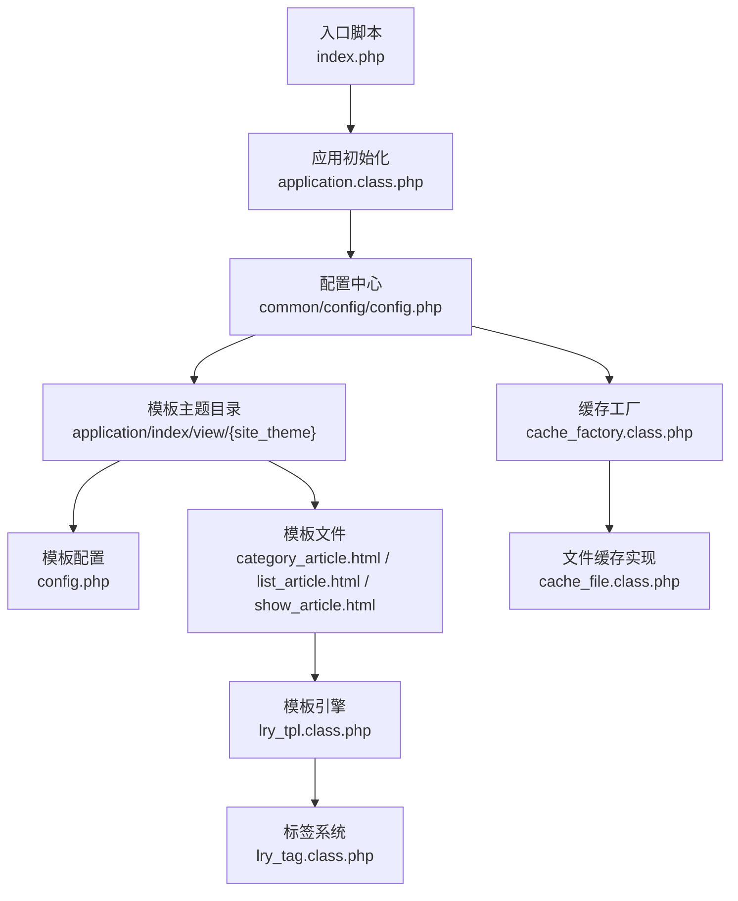
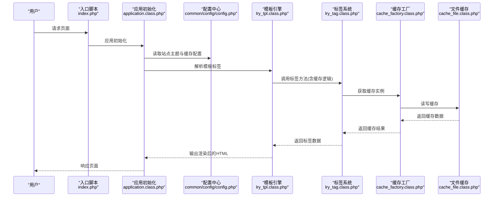
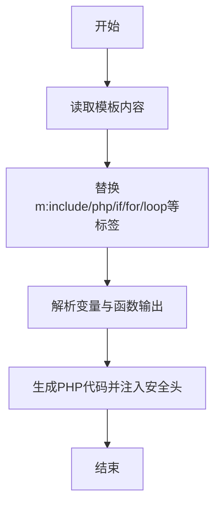
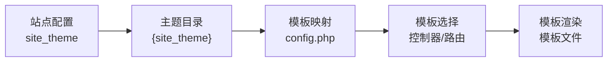
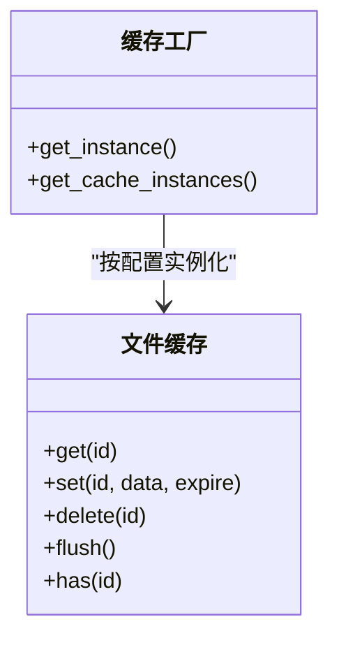
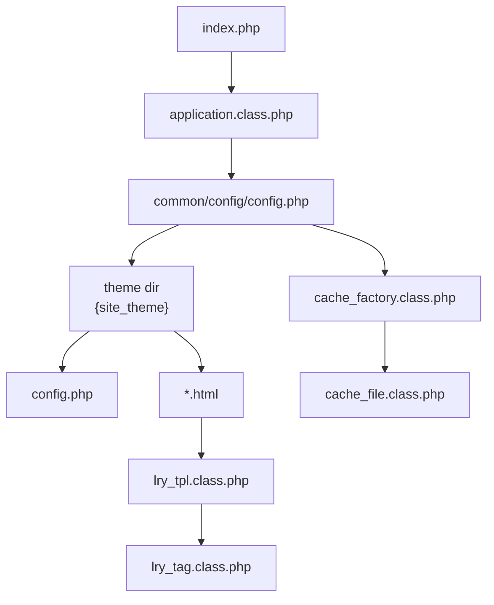
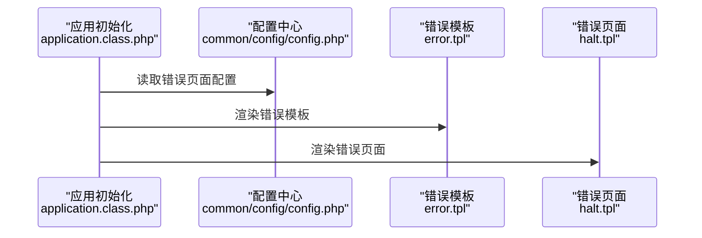

# 模板配置

<cite>
**本文引用的文件**
- [index.php](file://index.php)
- [application/index/view/rongyao/config.php](file://application/index/view/rongyao/config.php)
- [application/index/view/rongyao/category_article.html](file://application/index/view/rongyao/category_article.html)
- [application/index/view/rongyao/list_article.html](file://application/index/view/rongyao/list_article.html)
- [application/index/view/rongyao/show_article.html](file://application/index/view/rongyao/show_article.html)
- [ryphp/core/class/lry_tpl.class.php](file://ryphp/core/class/lry_tpl.class.php)
- [ryphp/core/class/lry_tag.class.php](file://ryphp/core/class/lry_tag.class.php)
- [ryphp/core/class/cache_file.class.php](file://ryphp/core/class/cache_file.class.php)
- [ryphp/core/class/cache_factory.class.php](file://ryphp/core/class/cache_factory.class.php)
- [common/config/config.php](file://common/config/config.php)
- [ryphp/core/class/application.class.php](file://ryphp/core/class/application.class.php)
- [ryphp/core/message/error.tpl](file://ryphp/core/message/error.tpl)
- [ryphp/core/message/halt.tpl](file://ryphp/core/message/halt.tpl)
</cite>

## 目录
1. [简介](#简介)
2. [项目结构](#项目结构)
3. [核心组件](#核心组件)
4. [架构总览](#架构总览)
5. [组件详解](#组件详解)
6. [依赖关系分析](#依赖关系分析)
7. [性能与缓存策略](#性能与缓存策略)
8. [故障排查指南](#故障排查指南)
9. [结论](#结论)
10. [附录](#附录)

## 简介
本文件面向LRYBlog模板配置功能，系统性梳理模板系统架构、模板引擎工作原理、模板文件结构、默认模板配置与切换机制、模板参数与标签体系、模板缓存策略、移动端与响应式支持，以及模板定制开发与性能优化最佳实践。目标是帮助开发者在不深入源码的前提下，快速理解并高效配置与扩展模板系统。

## 项目结构
LRYBlog模板系统围绕“主题目录 + 模板文件 + 模板引擎 + 标签系统 + 缓存工厂”的结构组织，入口脚本初始化应用，配置文件决定默认主题与缓存类型，模板文件通过自定义标签与函数实现数据渲染，标签类负责数据聚合与分页，缓存工厂按配置选择具体缓存实现。

**图表来源**
- [index.php:1-18](file://index.php#L1-L18)
- [application/class.php:24-40](file://ryphp/core/class/application.class.php#L24-L40)
- [common/config/config.php:9](file://common/config/config.php#L9)
- [application/index/view/rongyao/config.php:1-29](file://application/index/view/rongyao/config.php#L1-L29)
- [ryphp/core/class/lry_tpl.class.php:10-59](file://ryphp/core/class/lry_tpl.class.php#L10-L59)
- [ryphp/core/class/lry_tag.class.php:10-130](file://ryphp/core/class/lry_tag.class.php#L10-L130)
- [ryphp/core/class/cache_factory.class.php:36-82](file://ryphp/core/class/cache_factory.class.php#L36-L82)
- [ryphp/core/class/cache_file.class.php:2-130](file://ryphp/core/class/cache_file.class.php#L2-L130)

**章节来源**
- [index.php:10-18](file://index.php#L10-L18)
- [common/config/config.php:9](file://common/config/config.php#L9)

## 核心组件
- 模板引擎：负责将模板中的自定义标签与语法转换为可执行的PHP代码，并输出最终HTML。
- 标签系统：提供内容列表、分页、导航、标签、评论、搜索等常用业务标签，支持缓存与分页。
- 缓存工厂：依据配置动态选择缓存实现（文件/Redis/Memcache），统一对外接口。
- 文件缓存：基于文件系统的缓存实现，支持过期控制与序列化/可执行文件两种存储模式。
- 主题配置：声明主题元信息与模板映射，决定分类/列表/内容页模板的选择。
- 模板文件：承载视图结构与标签，结合站点配置实现响应式与移动端适配。

**章节来源**
- [ryphp/core/class/lry_tpl.class.php:10-134](file://ryphp/core/class/lry_tpl.class.php#L10-L134)
- [ryphp/core/class/lry_tag.class.php:10-492](file://ryphp/core/class/lry_tag.class.php#L10-L492)
- [ryphp/core/class/cache_factory.class.php:36-82](file://ryphp/core/class/cache_factory.class.php#L36-L82)
- [ryphp/core/class/cache_file.class.php:2-130](file://ryphp/core/class/cache_file.class.php#L2-L130)
- [application/index/view/rongyao/config.php:1-29](file://application/index/view/rongyao/config.php#L1-L29)

## 架构总览
模板系统从入口脚本开始，经由应用初始化与路由分发，定位到控制器动作后，根据当前主题与模板映射选择对应模板文件；模板引擎解析模板标签，标签系统提供数据与分页；最终通过缓存工厂与文件缓存实现模板与标签数据的持久化与加速。

**图表来源**
- [index.php:10-18](file://index.php#L10-L18)
- [application/class.php:24-40](file://ryphp/core/class/application.class.php#L24-L40)
- [common/config/config.php:9](file://common/config/config.php#L9)
- [ryphp/core/class/lry_tpl.class.php:62-92](file://ryphp/core/class/lry_tpl.class.php#L62-L92)
- [ryphp/core/class/lry_tag.class.php:18-65](file://ryphp/core/class/lry_tag.class.php#L18-L65)
- [ryphp/core/class/cache_factory.class.php:77-82](file://ryphp/core/class/cache_factory.class.php#L77-L82)
- [ryphp/core/class/cache_file.class.php:17-46](file://ryphp/core/class/cache_file.class.php#L17-L46)

## 组件详解

### 模板引擎工作原理
- 标签识别与替换：模板引擎通过正则匹配模板标签，将m:include、php、if/else/elseif、for/loop、变量输出、函数调用等转换为PHP代码片段。
- 标签回调：m:开头的标签交由标签系统处理，支持cache、page、return等参数，实现标签级缓存与分页。
- 变量输出：支持$变量、常量、对象属性链式输出，自动转义与引号处理。
- 安全头：在生成的PHP代码前注入权限校验头，防止直接访问缓存文件。

**图表来源**
- [ryphp/core/class/lry_tpl.class.php:31-59](file://ryphp/core/class/lry_tpl.class.php#L31-L59)
- [ryphp/core/class/lry_tpl.class.php:62-92](file://ryphp/core/class/lry_tpl.class.php#L62-L92)

**章节来源**
- [ryphp/core/class/lry_tpl.class.php:10-134](file://ryphp/core/class/lry_tpl.class.php#L10-L134)

### 默认模板配置与切换机制
- 默认主题：站点配置中通过“site_theme”指定默认主题目录名。
- 模板映射：主题目录下的config.php声明分类/列表/内容页可用模板及其描述，供后台选择。
- 切换流程：控制器根据当前请求与内容模型，选择对应模板文件进行渲染；模板文件内通过m:include引入公共头部与尾部，实现模块化复用。

**图表来源**
- [common/config/config.php:9](file://common/config/config.php#L9)
- [application/index/view/rongyao/config.php:1-29](file://application/index/view/rongyao/config.php#L1-L29)

**章节来源**
- [common/config/config.php:9](file://common/config/config.php#L9)
- [application/index/view/rongyao/config.php:1-29](file://application/index/view/rongyao/config.php#L1-L29)

### 模板参数配置与继承机制
- 参数传递：模板文件通过变量与函数接收控制器/模型提供的数据，如SEO标题、关键词、描述、栏目信息等。
- 继承与复用：模板文件通过m:include实现头部与尾部的复用，减少重复代码，便于统一风格与维护。
- 响应式与移动端：模板文件内包含viewport元信息与移动端样式资源，结合延迟加载与预加载策略提升移动端体验。

**章节来源**
- [application/index/view/rongyao/category_article.html:1-53](file://application/index/view/rongyao/category_article.html#L1-L53)
- [application/index/view/rongyao/list_article.html:1-150](file://application/index/view/rongyao/list_article.html#L1-L150)
- [application/index/view/rongyao/show_article.html:1-518](file://application/index/view/rongyao/show_article.html#L1-L518)

### 模板缓存配置与策略
- 缓存类型：支持file、redis、memcache三种类型，通过配置项“cache_type”与相应配置段选择。
- 文件缓存：文件缓存实现提供get/set/delete/flush能力，支持过期时间与两种存储模式（序列化/可执行数组）。
- 标签缓存：模板引擎在解析m:标签时，若带cache参数且未启用分页，则自动构建缓存键并调用缓存写入，提升标签数据渲染效率。

**图表来源**
- [ryphp/core/class/cache_factory.class.php:36-82](file://ryphp/core/class/cache_factory.class.php#L36-L82)
- [ryphp/core/class/cache_file.class.php:17-128](file://ryphp/core/class/cache_file.class.php#L17-L128)

**章节来源**
- [common/config/config.php:39-66](file://common/config/config.php#L39-L66)
- [ryphp/core/class/cache_factory.class.php:36-82](file://ryphp/core/class/cache_factory.class.php#L36-L82)
- [ryphp/core/class/cache_file.class.php:2-130](file://ryphp/core/class/cache_file.class.php#L2-L130)
- [ryphp/core/class/lry_tpl.class.php:76-91](file://ryphp/core/class/lry_tpl.class.php#L76-L91)

### 移动端模板与响应式设计
- 视口与样式：模板文件统一设置viewport，引入移动端基础样式与延迟加载策略，优化首屏与移动端性能。
- 资源管理：关键资源预加载，非关键资源延迟加载，减少移动端网络与渲染压力。
- 响应式资源：在文章详情页模板中，通过条件判断与延迟加载方式引入响应式样式与交互脚本，确保不同设备体验一致。

**章节来源**
- [application/index/view/rongyao/list_article.html:8-34](file://application/index/view/rongyao/list_article.html#L8-L34)
- [application/index/view/rongyao/show_article.html:13-43](file://application/index/view/rongyao/show_article.html#L13-L43)

### 模板定制开发指南
- 模板标签使用：模板中广泛使用m:标签（如m:lists、m:nav、m:tag等）与php原生语法（if/loop等），并支持变量输出与函数调用。
- 自定义模板创建：在主题目录下新增模板文件，于config.php中注册模板映射，即可在后台或控制器中选择使用。
- SEO与元信息：模板文件中通过变量输出SEO标题、关键词与描述，确保搜索引擎友好。
- 公共模块：通过m:include引入header/footer等公共模块，保持风格一致与维护成本可控。

**章节来源**
- [application/index/view/rongyao/category_article.html:21-53](file://application/index/view/rongyao/category_article.html#L21-L53)
- [application/index/view/rongyao/list_article.html:54-76](file://application/index/view/rongyao/list_article.html#L54-L76)
- [application/index/view/rongyao/show_article.html:50-384](file://application/index/view/rongyao/show_article.html#L50-L384)
- [application/index/view/rongyao/config.php:1-29](file://application/index/view/rongyao/config.php#L1-L29)

## 依赖关系分析
- 入口脚本依赖应用初始化类完成路由与控制器加载。
- 应用初始化依赖配置中心读取主题与缓存配置。
- 模板引擎依赖标签系统实现标签解析与数据获取。
- 标签系统依赖缓存工厂与文件缓存实现数据缓存。
- 模板文件依赖站点配置与主题目录结构。

**图表来源**
- [index.php:10-18](file://index.php#L10-L18)
- [application/class.php:24-40](file://ryphp/core/class/application.class.php#L24-L40)
- [common/config/config.php:9](file://common/config/config.php#L9)
- [application/index/view/rongyao/config.php:1-29](file://application/index/view/rongyao/config.php#L1-L29)
- [ryphp/core/class/lry_tpl.class.php:62-92](file://ryphp/core/class/lry_tpl.class.php#L62-L92)
- [ryphp/core/class/lry_tag.class.php:18-65](file://ryphp/core/class/lry_tag.class.php#L18-L65)
- [ryphp/core/class/cache_factory.class.php:36-82](file://ryphp/core/class/cache_factory.class.php#L36-L82)
- [ryphp/core/class/cache_file.class.php:17-46](file://ryphp/core/class/cache_file.class.php#L17-L46)

**章节来源**
- [index.php:10-18](file://index.php#L10-L18)
- [ryphp/core/class/application.class.php:24-40](file://ryphp/core/class/application.class.php#L24-L40)
- [common/config/config.php:9](file://common/config/config.php#L9)

## 性能与缓存策略
- 标签级缓存：当m:标签带有cache参数且未启用分页时，模板引擎会生成缓存键并写入缓存，显著降低重复查询与渲染成本。
- 文件缓存模式：文件缓存支持两种存储模式，可按场景选择序列化或可执行数组，兼顾可读性与加载性能。
- 资源优化：模板文件采用关键资源预加载与非关键资源延迟加载策略，配合响应式样式与移动端资源，提升整体加载速度。
- 缓存清理：提供flush接口清理全部缓存，便于开发调试与版本升级后清理陈旧缓存。

**章节来源**
- [ryphp/core/class/lry_tpl.class.php:76-91](file://ryphp/core/class/lry_tpl.class.php#L76-L91)
- [ryphp/core/class/cache_file.class.php:61-73](file://ryphp/core/class/cache_file.class.php#L61-L73)
- [application/index/view/rongyao/list_article.html:18-30](file://application/index/view/rongyao/list_article.html#L18-L30)
- [application/index/view/rongyao/show_article.html:23-43](file://application/index/view/rongyao/show_article.html#L23-L43)

## 故障排查指南
- 错误页面：非调试模式下，系统根据配置选择错误页面；若未找到指定页面则回退至内置错误模板。
- 致命错误：应用层捕获致命错误并渲染错误模板，展示错误类型、信息与详细内容。
- 控制台消息：在调试模式下，应用初始化会注册错误与异常处理器，便于定位问题。

**图表来源**
- [ryphp/core/class/application.class.php:108-115](file://ryphp/core/class/application.class.php#L108-L115)
- [common/config/config.php:7](file://common/config/config.php#L7)
- [ryphp/core/message/error.tpl:167-178](file://ryphp/core/message/error.tpl#L167-L178)
- [ryphp/core/message/halt.tpl:215-222](file://ryphp/core/message/halt.tpl#L215-L222)

**章节来源**
- [ryphp/core/class/application.class.php:108-115](file://ryphp/core/class/application.class.php#L108-L115)
- [ryphp/core/message/error.tpl:167-178](file://ryphp/core/message/error.tpl#L167-L178)
- [ryphp/core/message/halt.tpl:215-222](file://ryphp/core/message/halt.tpl#L215-L222)

## 结论
LRYBlog模板系统以清晰的主题目录与配置为中心，结合自定义模板引擎与标签系统，实现了灵活的模板选择、强大的数据标签能力与高效的缓存策略。通过合理的资源加载与移动端适配，系统在保证开发效率的同时兼顾用户体验。建议在生产环境优先启用文件缓存并合理设置标签缓存，结合响应式与资源优化策略，持续监控与迭代模板性能。

## 附录
- 模板文件示例路径参考：
  - [分类频道页模板:1-53](file://application/index/view/rongyao/category_article.html#L1-L53)
  - [列表页模板:1-150](file://application/index/view/rongyao/list_article.html#L1-L150)
  - [内容页模板:1-518](file://application/index/view/rongyao/show_article.html#L1-L518)
- 主题配置参考：
  - [主题配置与模板映射:1-29](file://application/index/view/rongyao/config.php#L1-L29)
- 缓存配置参考：
  - [缓存类型与文件缓存配置:39-66](file://common/config/config.php#L39-L66)
  - [缓存工厂与文件缓存实现:36-82](file://ryphp/core/class/cache_factory.class.php#L36-L82)
  - [文件缓存读写与过期控制:17-46](file://ryphp/core/class/cache_file.class.php#L17-L46)