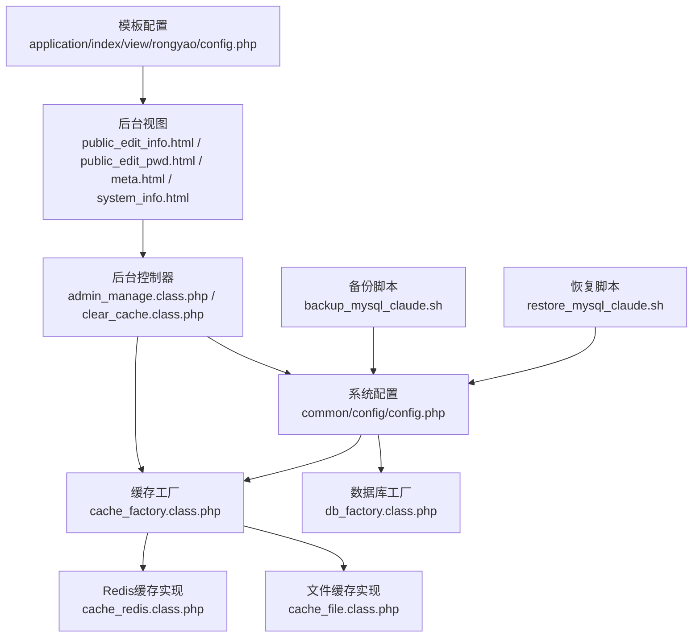
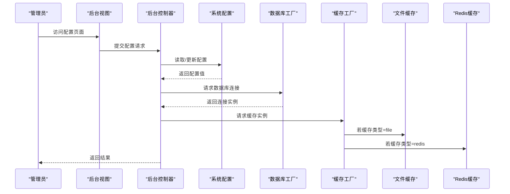
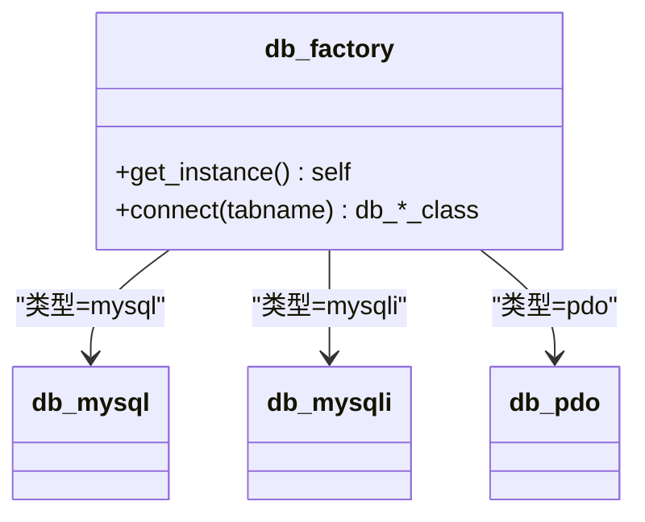
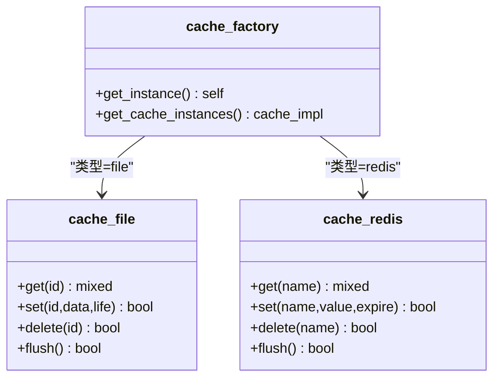
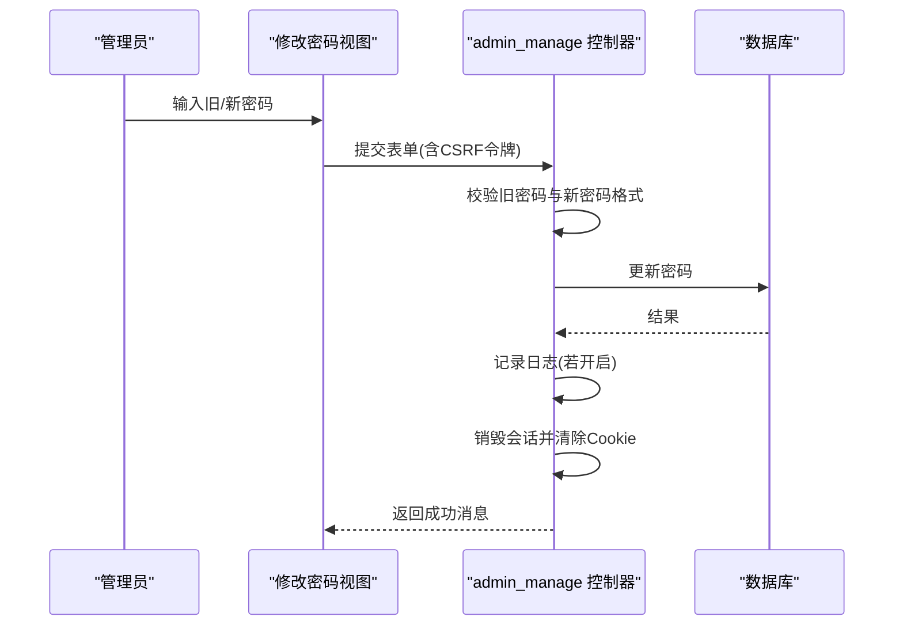
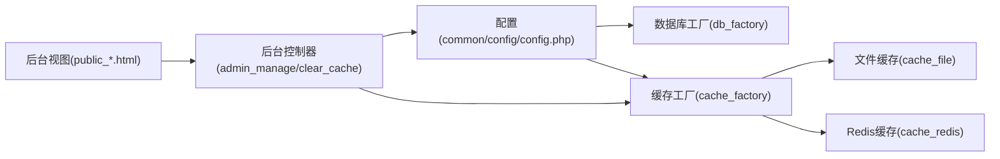

# 系统配置

<cite>
**本文引用的文件**
- [common/config/config.php](file://common/config/config.php)
- [cache_factory.class.php](file://ryphp/core/class/cache_factory.class.php)
- [db_factory.class.php](file://ryphp/core/class/db_factory.class.php)
- [cache_file.class.php](file://ryphp/core/class/cache_file.class.php)
- [cache_redis.class.php](file://ryphp/core/class/cache_redis.class.php)
- [clear_cache.class.php](file://application/lry_admin_center/controller/clear_cache.class.php)
- [admin_manage.class.php](file://application/lry_admin_center/controller/admin_manage.class.php)
- [public_edit_info.html](file://application/lry_admin_center/view/public_edit_info.html)
- [public_edit_pwd.html](file://application/lry_admin_center/view/public_edit_pwd.html)
- [meta.html](file://application/lry_admin_center/view/meta.html)
- [system_info.html](file://application/lry_admin_center/view/system_info.html)
- [config.php（模板）](file://application/index/view/rongyao/config.php)
- [backup_mysql_claude.sh](file://backup_mysql_claude.sh)
- [restore_mysql_claude.sh](file://restore_mysql_claude.sh)
</cite>

## 目录
1. [简介](#简介)
2. [项目结构](#项目结构)
3. [核心组件](#核心组件)
4. [架构总览](#架构总览)
5. [详细组件分析](#详细组件分析)
6. [依赖关系分析](#依赖关系分析)
7. [性能与运维配置](#性能与运维配置)
8. [故障排查指南](#故障排查指南)
9. [结论](#结论)
10. [附录](#附录)

## 简介
本文件面向系统管理员，提供 LRYBlog 系统配置功能的完整技术文档。内容涵盖系统基础配置（站点名称、描述、关键词等）、数据库配置、缓存配置、模板配置、安全配置、性能配置、系统维护（备份、日志清理、诊断）以及配置文件的备份与恢复机制。文档以代码为依据，结合架构图与流程图，帮助管理员快速理解并正确配置系统。

## 项目结构
LRYBlog 的配置主要集中在以下位置：
- 系统全局配置：common/config/config.php
- 缓存与数据库工厂：ryphp/core/class/cache_factory.class.php、ryphp/core/class/db_factory.class.php
- 缓存实现：ryphp/core/class/cache_file.class.php、ryphp/core/class/cache_redis.class.php
- 后台配置入口与维护：application/lry_admin_center/controller/*.class.php
- 后台视图：application/lry_admin_center/view/*.html
- 模板配置：application/index/view/rongyao/config.php
- 备份与恢复脚本：backup_mysql_claude.sh、restore_mysql_claude.sh

图表来源
- [common/config/config.php:1-88](file://common/config/config.php#L1-L88)
- [db_factory.class.php:1-50](file://ryphp/core/class/db_factory.class.php#L1-L50)
- [cache_factory.class.php:1-84](file://ryphp/core/class/cache_factory.class.php#L1-L84)
- [cache_file.class.php:1-130](file://ryphp/core/class/cache_file.class.php#L1-L130)
- [cache_redis.class.php:1-108](file://ryphp/core/class/cache_redis.class.php#L1-L108)
- [admin_manage.class.php:1-105](file://application/lry_admin_center/controller/admin_manage.class.php#L1-L105)
- [clear_cache.class.php:1-25](file://application/lry_admin_center/controller/clear_cache.class.php#L1-L25)
- [public_edit_info.html:1-50](file://application/lry_admin_center/view/public_edit_info.html#L1-L50)
- [public_edit_pwd.html:1-113](file://application/lry_admin_center/view/public_edit_pwd.html#L1-L113)
- [meta.html:1-39](file://application/lry_admin_center/view/meta.html#L1-L39)
- [system_info.html:1-40](file://application/lry_admin_center/view/system_info.html#L1-L40)
- [config.php（模板）:1-29](file://application/index/view/rongyao/config.php#L1-L29)
- [backup_mysql_claude.sh:1-392](file://backup_mysql_claude.sh#L1-L392)
- [restore_mysql_claude.sh:1-412](file://restore_mysql_claude.sh#L1-L412)

章节来源
- [common/config/config.php:1-88](file://common/config/config.php#L1-L88)

## 核心组件
- 系统配置中心：集中于 common/config/config.php，包含系统密钥、错误页面、主题、URL 伪静态、数据库、路由、Cookie、缓存、队列、语言、附件、安全开关等。
- 数据库工厂：根据配置动态加载 mysql/mysqli/pdo 实现，并统一提供连接参数。
- 缓存工厂：根据配置动态加载 file/redis/memcache 实现，支持懒加载与单例。
- 后台配置与维护：管理员信息修改、密码修改、缓存清理等。
- 模板配置：定义默认模板、分类/列表/内容页模板集合。
- 备份与恢复：提供 MySQL 备份与恢复脚本，支持压缩、事务、触发器/存储过程控制等。

章节来源
- [common/config/config.php:1-88](file://common/config/config.php#L1-L88)
- [db_factory.class.php:11-50](file://ryphp/core/class/db_factory.class.php#L11-L50)
- [cache_factory.class.php:36-84](file://ryphp/core/class/cache_factory.class.php#L36-L84)
- [admin_manage.class.php:49-105](file://application/lry_admin_center/controller/admin_manage.class.php#L49-L105)
- [clear_cache.class.php:9-24](file://application/lry_admin_center/controller/clear_cache.class.php#L9-L24)
- [config.php（模板）:1-29](file://application/index/view/rongyao/config.php#L1-L29)

## 架构总览
系统配置贯穿“配置读取—工厂选择—具体实现—后台维护—运维脚本”的链路。配置文件决定行为，工厂按需加载实现类，后台提供可视化维护入口，运维脚本保障数据安全。

图表来源
- [common/config/config.php:13-87](file://common/config/config.php#L13-L87)
- [db_factory.class.php:38-49](file://ryphp/core/class/db_factory.class.php#L38-L49)
- [cache_factory.class.php:36-82](file://ryphp/core/class/cache_factory.class.php#L36-L82)

## 详细组件分析

### 系统基础配置（站点名称、描述、关键词等）
- 关键点
  - 系统密钥、错误页面、错误日志开关、默认主题、URL 伪静态后缀、PATHINFO 支持等。
  - Cookie 作用域、路径、生命周期、前缀、安全与 HttpOnly。
  - 语言选择（简体中文/英文）。
- 配置项定位
  - 系统配置数组位于 common/config/config.php 的第 3-87 行。
- 管理入口
  - 后台“关于系统”页面展示系统版本与框架信息，便于核对部署环境。
- 建议
  - 更改站点主题时，确保模板目录存在且配置一致；启用 PATHINFO 时需配合 Web 服务器配置。

章节来源
- [common/config/config.php:3-87](file://common/config/config.php#L3-L87)
- [system_info.html:1-40](file://application/lry_admin_center/view/system_info.html#L1-L40)

### 数据库配置
- 支持类型
  - pdo、mysqli、mysql；默认 pdo。
- 连接参数
  - 主机、端口、数据库名、用户名、密码、字符集、表前缀。
- 工厂选择
  - db_factory 根据配置选择具体实现类，并在 connect 中注入参数。
- 建议
  - 生产环境优先使用 pdo；如需连接池或高并发，结合应用层连接复用策略。

图表来源
- [db_factory.class.php:11-50](file://ryphp/core/class/db_factory.class.php#L11-L50)

章节来源
- [common/config/config.php:13-21](file://common/config/config.php#L13-L21)
- [db_factory.class.php:14-49](file://ryphp/core/class/db_factory.class.php#L14-L49)

### 缓存配置与清理
- 缓存类型
  - file、redis、memcache；默认 file。
- 文件缓存
  - 缓存目录、文件后缀、序列化模式（1=serialize，2=可执行数组）。
- Redis 缓存
  - 主机、端口、密码、库选择、超时、有效期、长连接、前缀。
- 工厂与实现
  - cache_factory 根据配置加载对应实现；cache_file 提供 get/set/delete/flush；cache_redis 提供 set/get/delete/flush。
- 后台清理
  - clear_cache 控制器提供清理逻辑，调用 delcache 并遍历模板缓存文件删除。

图表来源
- [cache_factory.class.php:36-82](file://ryphp/core/class/cache_factory.class.php#L36-L82)
- [cache_file.class.php:17-128](file://ryphp/core/class/cache_file.class.php#L17-L128)
- [cache_redis.class.php:60-105](file://ryphp/core/class/cache_redis.class.php#L60-L105)

章节来源
- [common/config/config.php:39-66](file://common/config/config.php#L39-L66)
- [cache_factory.class.php:36-82](file://ryphp/core/class/cache_factory.class.php#L36-L82)
- [cache_file.class.php:17-128](file://ryphp/core/class/cache_file.class.php#L17-L128)
- [cache_redis.class.php:30-105](file://ryphp/core/class/cache_redis.class.php#L30-L105)
- [clear_cache.class.php:9-24](file://application/lry_admin_center/controller/clear_cache.class.php#L9-L24)

### 模板配置与切换
- 默认模板
  - 由系统配置中的 site_theme 指定。
- 模板集合
  - 模板目录下的 config.php 定义分类/列表/内容页模板清单。
- 切换机制
  - 通过修改 site_theme 并确保模板目录存在，即可实现模板切换；模板渲染由框架按配置加载。

章节来源
- [common/config/config.php:9](file://common/config/config.php#L9)
- [config.php（模板）:1-29](file://application/index/view/rongyao/config.php#L1-L29)

### 系统安全配置
- 登录验证码
  - 配置项 admin_login_code 控制是否启用验证码。
- 密码策略与修改
  - 后台“修改个人信息/密码”页面提供前端强度校验与后端密码格式校验；修改密码后销毁会话并要求重新登录。
- CSRF 令牌
  - 后台 meta 视图自动注入 lry_sey_token 并在表单中附加隐藏字段，配合控制器使用。

图表来源
- [public_edit_pwd.html:78-110](file://application/lry_admin_center/view/public_edit_pwd.html#L78-L110)
- [admin_manage.class.php:70-99](file://application/lry_admin_center/controller/admin_manage.class.php#L70-L99)
- [meta.html:23-38](file://application/lry_admin_center/view/meta.html#L23-L38)
- [common/config/config.php:85](file://common/config/config.php#L85)

章节来源
- [common/config/config.php:85](file://common/config/config.php#L85)
- [public_edit_pwd.html:14-110](file://application/lry_admin_center/view/public_edit_pwd.html#L14-L110)
- [admin_manage.class.php:70-99](file://application/lry_admin_center/controller/admin_manage.class.php#L70-L99)
- [meta.html:23-38](file://application/lry_admin_center/view/meta.html#L23-L38)

### 系统性能配置
- 缓存策略
  - 选择合适的缓存类型（file/redis/memcache），合理设置有效期与前缀；生产环境推荐 Redis。
- 压缩与传输
  - 通过 Web 服务器或 PHP 输出缓冲控制压缩；本系统未内置压缩开关，建议在服务器层配置。
- CDN 配置
  - 通过静态资源路径与上传类型配置对接 CDN；上传类型可在配置中选择 host/qiniu/aliyun/tencent。
- 模板缓存
  - 后台清理缓存接口会删除模板缓存文件并清空缓存目录，有助于在模板切换后刷新缓存。

章节来源
- [common/config/config.php:39-81](file://common/config/config.php#L39-L81)
- [clear_cache.class.php:9-24](file://application/lry_admin_center/controller/clear_cache.class.php#L9-L24)

### 系统维护功能
- 数据库备份
  - backup_mysql_claude.sh 支持单库/全库、压缩/非压缩、事务/锁表、扩展插入、存储过程/触发器控制、保留数量清理等。
- 数据库恢复
  - restore_mysql_claude.sh 支持压缩/非压缩恢复、数据库存在性处理、进度显示（可选）、日志记录。
- 日志清理
  - 系统错误日志保存开关由配置项控制；备份/恢复脚本自带日志文件。
- 系统诊断
  - “关于系统”页面展示版本与框架信息，辅助诊断部署环境。

章节来源
- [backup_mysql_claude.sh:1-392](file://backup_mysql_claude.sh#L1-L392)
- [restore_mysql_claude.sh:1-412](file://restore_mysql_claude.sh#L1-L412)
- [common/config/config.php:8](file://common/config/config.php#L8)
- [system_info.html:1-40](file://application/lry_admin_center/view/system_info.html#L1-L40)

## 依赖关系分析
- 配置到工厂
  - db_factory/cache_factory 依赖 C() 获取配置；配置变更即刻影响工厂选择。
- 工厂到实现
  - cache_factory 动态加载 cache_file/cache_redis；db_factory 动态加载 db_mysql/db_mysqli/db_pdo。
- 后台到配置
  - 后台控制器与视图通过配置项控制功能开关与行为（如验证码、模板编辑、SQL执行）。

图表来源
- [common/config/config.php:13-87](file://common/config/config.php#L13-L87)
- [db_factory.class.php:11-50](file://ryphp/core/class/db_factory.class.php#L11-L50)
- [cache_factory.class.php:36-82](file://ryphp/core/class/cache_factory.class.php#L36-L82)
- [admin_manage.class.php:1-105](file://application/lry_admin_center/controller/admin_manage.class.php#L1-L105)
- [clear_cache.class.php:1-25](file://application/lry_admin_center/controller/clear_cache.class.php#L1-L25)

## 性能与运维配置
- 缓存类型选择
  - file：简单易用，适合小规模；注意目录权限与序列化模式。
  - redis：高性能，适合高并发；关注连接参数与前缀隔离。
- 数据库连接
  - pdo 通常具备更佳的跨平台与扩展能力；结合连接池与超时设置提升稳定性。
- 备份策略
  - 建议定期全量+增量组合备份，开启压缩与事务一致性，保留最近 N 份。
- 模板与静态资源
  - 模板切换后及时清理缓存；静态资源可结合 CDN 与浏览器缓存策略。

[本节为通用建议，无需特定文件引用]

## 故障排查指南
- 缓存目录不可写
  - 后台清理缓存时若提示 cache 目录不可写，需检查目录权限与 SELinux/AppArmor 设置。
- Redis 扩展缺失
  - 使用 redis 缓存类型时需安装 php-redis 扩展，否则会报不支持。
- 数据库连接失败
  - 检查主机、端口、用户名、密码、字符集与防火墙；优先使用 PDO 并确认驱动可用。
- 备份/恢复失败
  - 检查 mysqldump/mysql 可用性、配置文件权限、压缩文件完整性；查看脚本日志定位问题。
- 修改密码后无法登录
  - 系统会销毁会话并清除 Cookie，需重新登录；确认密码格式与旧密码正确。

章节来源
- [clear_cache.class.php:10-12](file://application/lry_admin_center/controller/clear_cache.class.php#L10-L12)
- [cache_redis.class.php:31-33](file://ryphp/core/class/cache_redis.class.php#L31-L33)
- [admin_manage.class.php:75-77](file://application/lry_admin_center/controller/admin_manage.class.php#L75-L77)
- [backup_mysql_claude.sh:170-198](file://backup_mysql_claude.sh#L170-L198)
- [restore_mysql_claude.sh:210-238](file://restore_mysql_claude.sh#L210-L238)

## 结论
LRYBlog 的配置体系以配置文件为核心，通过工厂模式实现数据库与缓存的灵活切换；后台提供便捷的维护入口；运维脚本保障数据安全。管理员应结合业务规模与部署环境，合理选择缓存类型、数据库驱动与备份策略，并在模板切换、安全策略与性能优化方面持续优化。

[本节为总结，无需特定文件引用]

## 附录
- 配置文件备份与恢复建议
  - 备份：定期打包 common/config/config.php 与模板目录，结合数据库备份脚本生成完整快照。
  - 恢复：先恢复数据库，再恢复配置文件与模板，最后清理缓存并重启相关服务。
- 常用操作路径参考
  - 数据库配置：common/config/config.php（第 13-21 行）
  - 缓存配置：common/config/config.php（第 39-66 行）
  - 模板配置：application/index/view/rongyao/config.php
  - 后台维护：application/lry_admin_center/controller/clear_cache.class.php
  - 备份脚本：backup_mysql_claude.sh
  - 恢复脚本：restore_mysql_claude.sh

[本节为补充说明，无需特定文件引用]