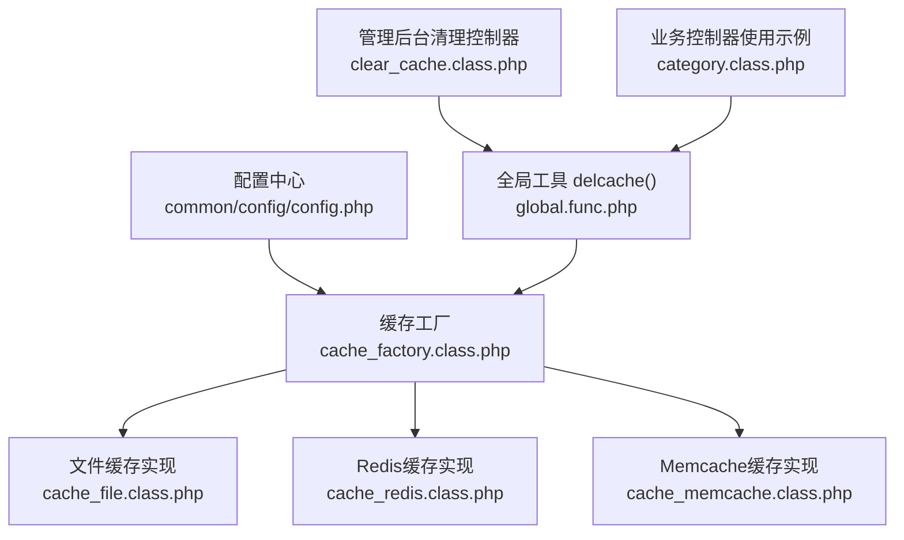
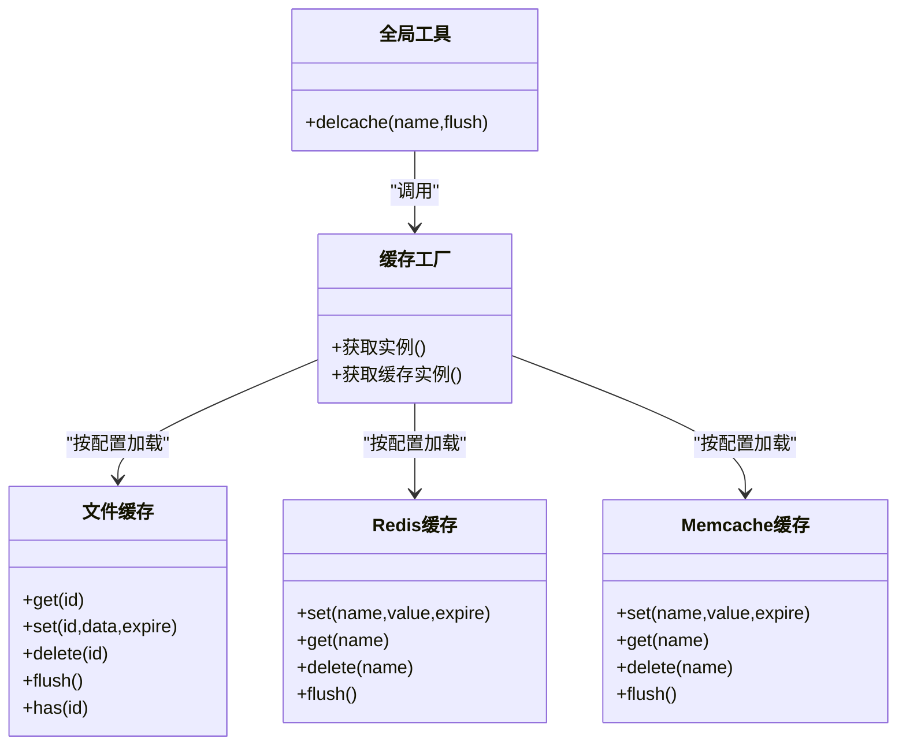
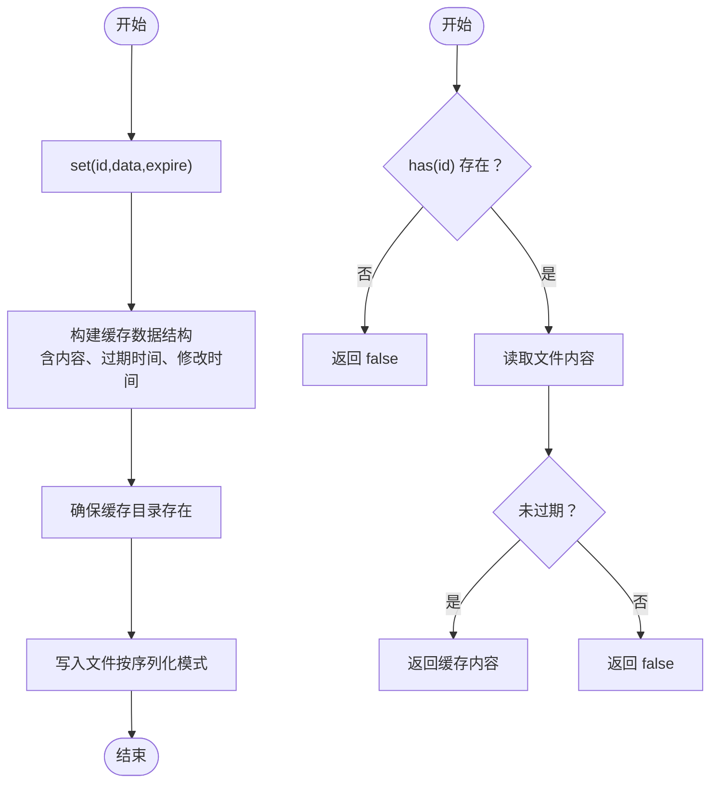
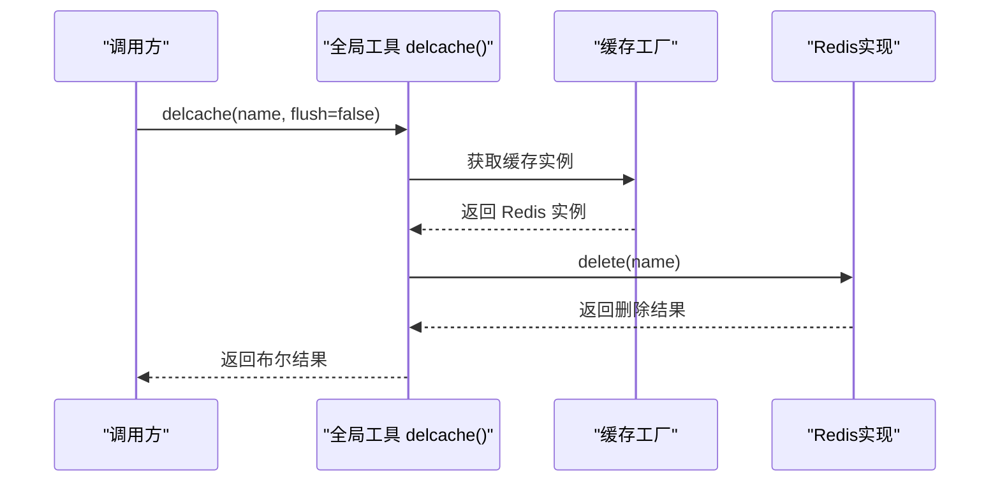
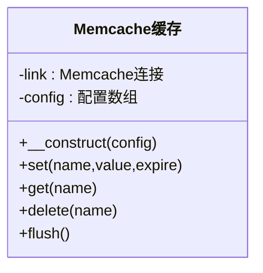
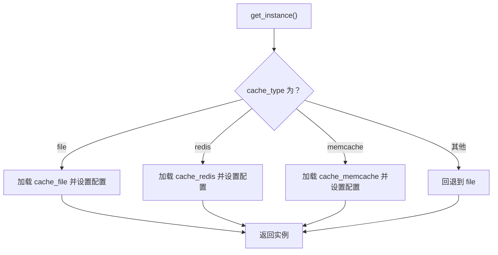
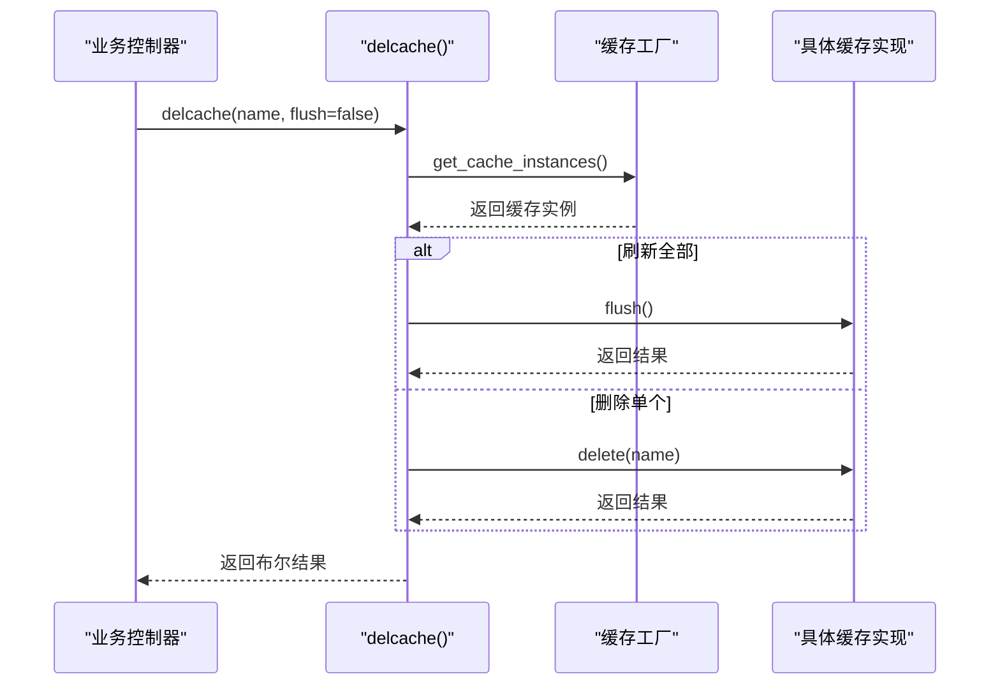
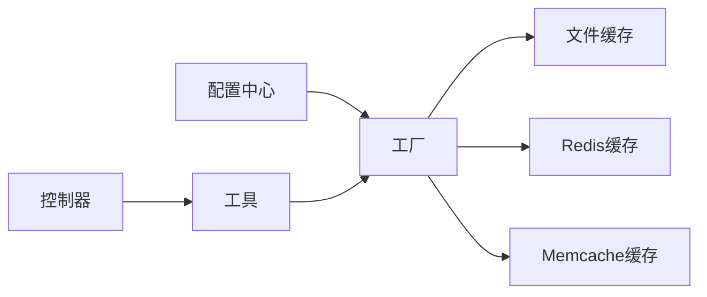

# 缓存配置

<cite>
**本文引用的文件**
- [config.php](file://common/config/config.php)
- [cache_factory.class.php](file://ryphp/core/class/cache_factory.class.php)
- [cache_file.class.php](file://ryphp/core/class/cache_file.class.php)
- [cache_redis.class.php](file://ryphp/core/class/cache_redis.class.php)
- [cache_memcache.class.php](file://ryphp/core/class/cache_memcache.class.php)
- [global.func.php](file://ryphp/core/function/global.func.php)
- [clear_cache.class.php](file://application/lry_admin_center/controller/clear_cache.class.php)
- [category.class.php](file://application/lry_admin_center/controller/category.class.php)
</cite>

## 目录
1. [简介](#简介)
2. [项目结构](#项目结构)
3. [核心组件](#核心组件)
4. [架构总览](#架构总览)
5. [详细组件分析](#详细组件分析)
6. [依赖关系分析](#依赖关系分析)
7. [性能考量](#性能考量)
8. [故障排查指南](#故障排查指南)
9. [结论](#结论)
10. [附录](#附录)

## 简介
本技术文档围绕 LRYBlog 的缓存配置功能展开，系统性介绍缓存类型选择与特性对比，涵盖文件缓存、Redis 缓存与 Memcache 缓存的配置要点、过期时间与持久化策略、缓存清理与监控建议，并提供不同应用场景下的优化建议。读者无需深厚的底层知识即可理解并正确配置缓存。

## 项目结构
缓存系统由配置中心、工厂类、具体缓存实现以及全局工具函数组成：
- 配置中心：在系统配置中集中定义缓存类型与各类型配置项
- 工厂类：根据配置动态加载并实例化对应缓存实现
- 具体实现：文件缓存、Redis 缓存、Memcache 缓存三类
- 全局工具：统一的缓存删除接口 delcache()

图表来源
- [config.php:39-66](file://common/config/config.php#L39-L66)
- [cache_factory.class.php:36-82](file://ryphp/core/class/cache_factory.class.php#L36-L82)
- [cache_file.class.php:1-130](file://ryphp/core/class/cache_file.class.php#L1-L130)
- [cache_redis.class.php:10-108](file://ryphp/core/class/cache_redis.class.php#L10-L108)
- [cache_memcache.class.php:10-91](file://ryphp/core/class/cache_memcache.class.php#L10-L91)
- [global.func.php:1518-1523](file://ryphp/core/function/global.func.php#L1518-L1523)
- [clear_cache.class.php:9-24](file://application/lry_admin_center/controller/clear_cache.class.php#L9-L24)
- [category.class.php:463-468](file://application/lry_admin_center/controller/category.class.php#L463-L468)

章节来源
- [config.php:39-66](file://common/config/config.php#L39-L66)
- [cache_factory.class.php:36-82](file://ryphp/core/class/cache_factory.class.php#L36-L82)
- [global.func.php:1518-1523](file://ryphp/core/function/global.func.php#L1518-L1523)

## 核心组件
- 缓存类型选择
  - file：基于文件系统的本地缓存，适合开发环境或小规模部署
  - redis：高性能内存数据库，适合高并发、需要过期控制与持久化的场景
  - memcache：轻量级内存缓存，适合简单快速的键值缓存需求
- 工厂模式：根据配置动态加载对应缓存实现，确保单一实例与延迟初始化
- 统一接口：通过全局函数 delcache() 实现缓存删除与清空

章节来源
- [config.php:39-66](file://common/config/config.php#L39-L66)
- [cache_factory.class.php:36-82](file://ryphp/core/class/cache_factory.class.php#L36-L82)
- [global.func.php:1518-1523](file://ryphp/core/function/global.func.php#L1518-L1523)

## 架构总览
缓存配置采用“配置驱动 + 工厂 + 具体实现”的分层设计，确保可插拔与可维护性。

图表来源
- [cache_factory.class.php:36-82](file://ryphp/core/class/cache_factory.class.php#L36-L82)
- [cache_file.class.php:17-128](file://ryphp/core/class/cache_file.class.php#L17-L128)
- [cache_redis.class.php:60-105](file://ryphp/core/class/cache_redis.class.php#L60-L105)
- [cache_memcache.class.php:47-89](file://ryphp/core/class/cache_memcache.class.php#L47-L89)
- [global.func.php:1518-1523](file://ryphp/core/function/global.func.php#L1518-L1523)

## 详细组件分析

### 文件缓存（cache_file）
- 特点
  - 以文件形式存储缓存内容，天然可跨进程共享
  - 支持两种序列化模式：PHP 序列化或可执行数组文件
  - 自带过期时间判断与文件生命周期管理
- 关键配置
  - 缓存目录：cache_dir
  - 文件后缀：suffix
  - 序列化模式：mode（1=serialize；2=可执行数组）
- 过期与持久化
  - set 时记录 expire 时间戳；get 时比较当前时间决定是否过期
  - flush 会遍历目录并逐个删除匹配后缀的文件
- 使用建议
  - 生产环境建议使用可执行数组模式（mode=2）以提升读取性能
  - 合理设置缓存目录权限，确保可写且有足够磁盘空间

图表来源
- [cache_file.class.php:34-46](file://ryphp/core/class/cache_file.class.php#L34-L46)
- [cache_file.class.php:75-82](file://ryphp/core/class/cache_file.class.php#L75-L82)
- [cache_file.class.php:103-112](file://ryphp/core/class/cache_file.class.php#L103-L112)
- [cache_file.class.php:116-128](file://ryphp/core/class/cache_file.class.php#L116-L128)

章节来源
- [cache_file.class.php:17-128](file://ryphp/core/class/cache_file.class.php#L17-L128)
- [config.php:42-46](file://common/config/config.php#L42-L46)

### Redis 缓存（cache_redis）
- 特点
  - 基于 Redis 客户端扩展，支持长连接、认证、库选择与过期控制
  - 写入时对数组进行 JSON 编码，读取时尝试 JSON 解码还原
  - 支持前缀命名空间隔离
- 关键配置
  - 主机 host、端口 port、密码 password、库 select、超时 timeout
  - 有效期 expire、是否长连接 persistent、键前缀 prefix
- 过期与持久化
  - expire=0 表示不过期；否则使用 EX 秒过期设置
  - flushall 清空整个数据库
- 使用建议
  - 在生产环境启用密码与库选择，避免与其他应用混淆
  - 对大对象优先考虑压缩或外部存储，减少网络往返

图表来源
- [global.func.php:1518-1523](file://ryphp/core/function/global.func.php#L1518-L1523)
- [cache_factory.class.php:77-82](file://ryphp/core/class/cache_factory.class.php#L77-L82)
- [cache_redis.class.php:94-97](file://ryphp/core/class/cache_redis.class.php#L94-L97)

章节来源
- [cache_redis.class.php:10-108](file://ryphp/core/class/cache_redis.class.php#L10-L108)
- [config.php:47-57](file://common/config/config.php#L47-L57)

### Memcache 缓存（cache_memcache）
- 特点
  - 基于 Memcache 扩展，支持长连接与超时设置
  - 数组类型自动 JSON 编码，读取时尝试 JSON 解码
  - 支持键前缀与过期时间
- 关键配置
  - 主机 host、端口 port、超时 timeout、有效期 expire、长连接 persistent、键前缀 prefix
- 过期与持久化
  - expire=0 表示不过期；flush 清空当前服务器上的所有键
- 使用建议
  - 在高并发场景下建议启用长连接以降低握手开销
  - 注意 Memcache 的内存回收策略，避免长时间占用导致碎片化

图表来源
- [cache_memcache.class.php:10-91](file://ryphp/core/class/cache_memcache.class.php#L10-L91)

章节来源
- [cache_memcache.class.php:10-91](file://ryphp/core/class/cache_memcache.class.php#L10-L91)
- [config.php:58-66](file://common/config/config.php#L58-L66)

### 缓存工厂（cache_factory）
- 职责
  - 根据配置选择具体缓存实现（file/redis/memcache）
  - 提供单例与延迟初始化，避免不必要的资源消耗
- 加载流程
  - 读取配置 cache_type
  - 动态加载对应实现类并注入配置
  - 通过 get_cache_instances 返回唯一实例

图表来源
- [cache_factory.class.php:36-62](file://ryphp/core/class/cache_factory.class.php#L36-L62)

章节来源
- [cache_factory.class.php:36-82](file://ryphp/core/class/cache_factory.class.php#L36-L82)

### 全局缓存工具（delcache）
- 接口
  - delcache(name, flush=false)：删除指定缓存或清空全部缓存
- 实现
  - 通过工厂获取缓存实例，调用对应实现的 delete 或 flush 方法
- 使用场景
  - 业务变更后主动清理相关缓存，保证数据一致性
  - 管理后台一键清理缓存

图表来源
- [global.func.php:1518-1523](file://ryphp/core/function/global.func.php#L1518-L1523)
- [cache_factory.class.php:77-82](file://ryphp/core/class/cache_factory.class.php#L77-L82)

章节来源
- [global.func.php:1518-1523](file://ryphp/core/function/global.func.php#L1518-L1523)

## 依赖关系分析
- 配置依赖：所有缓存实现均依赖配置中心提供的配置项
- 工厂依赖：工厂类依赖系统类加载机制加载具体实现类
- 工具依赖：全局工具依赖工厂类获取缓存实例
- 控制器依赖：业务控制器通过全局工具触发缓存清理

图表来源
- [config.php:39-66](file://common/config/config.php#L39-L66)
- [cache_factory.class.php:36-82](file://ryphp/core/class/cache_factory.class.php#L36-L82)
- [global.func.php:1518-1523](file://ryphp/core/function/global.func.php#L1518-L1523)

章节来源
- [config.php:39-66](file://common/config/config.php#L39-L66)
- [cache_factory.class.php:36-82](file://ryphp/core/class/cache_factory.class.php#L36-L82)
- [global.func.php:1518-1523](file://ryphp/core/function/global.func.php#L1518-L1523)

## 性能考量
- 文件缓存
  - 优点：零依赖、易迁移、可跨进程共享
  - 缺点：I/O 开销较大、并发竞争、序列化成本
  - 优化：使用可执行数组模式（mode=2），合理设置目录与权限，定期清理过期文件
- Redis 缓存
  - 优点：高性能、丰富的数据结构、过期控制、持久化选项
  - 缺点：需要额外服务与网络开销
  - 优化：启用长连接、合理设置过期时间、使用前缀隔离命名空间
- Memcache 缓存
  - 优点：轻量、低延迟
  - 缺点：无持久化、内存回收策略
  - 优化：启用长连接、关注内存使用与回收，避免大对象频繁更新

[本节为通用性能建议，不直接分析特定文件]

## 故障排查指南
- 缓存清理
  - 管理后台清理：检查缓存目录可写权限，确认清理接口返回成功
  - 业务清理：在关键操作后调用 delcache()，确保 flush 参数正确
- 常见问题
  - 缓存未生效：确认 cache_type 与配置项正确，检查实现类是否加载成功
  - 过期不生效：核对 expire 设置与当前时间戳比较逻辑
  - Redis/Memcache 连接失败：检查扩展是否启用、主机/端口/密码/超时配置

章节来源
- [clear_cache.class.php:9-24](file://application/lry_admin_center/controller/clear_cache.class.php#L9-L24)
- [category.class.php:463-468](file://application/lry_admin_center/controller/category.class.php#L463-L468)

## 结论
LRYBlog 的缓存体系通过配置驱动与工厂模式实现了灵活可插拔的设计，文件缓存适合小规模与开发环境，Redis 适合高并发与需要过期控制的生产环境，Memcache 适合轻量级键值缓存。结合全局工具 delcache()，可在业务层面实现精准的缓存清理与一致性保障。

[本节为总结性内容，不直接分析特定文件]

## 附录

### 缓存类型与配置要点
- 文件缓存
  - 配置项：cache_dir、suffix、mode
  - 适用场景：开发测试、小规模部署、需要跨进程共享
- Redis 缓存
  - 配置项：host、port、password、select、timeout、expire、persistent、prefix
  - 适用场景：高并发、需要过期控制与持久化
- Memcache 缓存
  - 配置项：host、port、timeout、expire、persistent、prefix
  - 适用场景：轻量级键值缓存、低延迟要求

章节来源
- [config.php:39-66](file://common/config/config.php#L39-L66)

### 缓存过期时间与持久化
- 文件缓存：set 时记录 expire，get 时比较当前时间；flush 清理目录
- Redis：expire=0 不过期；flushall 清空数据库
- Memcache：expire=0 不过期；flush 清空服务器上所有键

章节来源
- [cache_file.class.php:25-28](file://ryphp/core/class/cache_file.class.php#L25-L28)
- [cache_file.class.php:61-73](file://ryphp/core/class/cache_file.class.php#L61-L73)
- [cache_redis.class.php:66-71](file://ryphp/core/class/cache_redis.class.php#L66-L71)
- [cache_redis.class.php:103-105](file://ryphp/core/class/cache_redis.class.php#L103-L105)
- [cache_memcache.class.php:49-53](file://ryphp/core/class/cache_memcache.class.php#L49-L53)
- [cache_memcache.class.php:87-89](file://ryphp/core/class/cache_memcache.class.php#L87-L89)

### 缓存清理与使用方法
- 管理后台清理：public_clear() 调用 delcache('', true) 清空全部
- 业务清理：在关键操作后调用 delcache(name) 删除单个键
- 示例：分类管理中在排序等操作后清理相关缓存键

章节来源
- [clear_cache.class.php:9-24](file://application/lry_admin_center/controller/clear_cache.class.php#L9-L24)
- [category.class.php:463-468](file://application/lry_admin_center/controller/category.class.php#L463-L468)
- [global.func.php:1518-1523](file://ryphp/core/function/global.func.php#L1518-L1523)

### 缓存性能监控建议
- 文件缓存：监控磁盘 I/O 与文件数量增长趋势，定期清理过期文件
- Redis：关注连接数、内存使用率、命中率与慢查询日志
- Memcache：监控内存使用与回收情况，避免碎片化

[本节为通用监控建议，不直接分析特定文件]