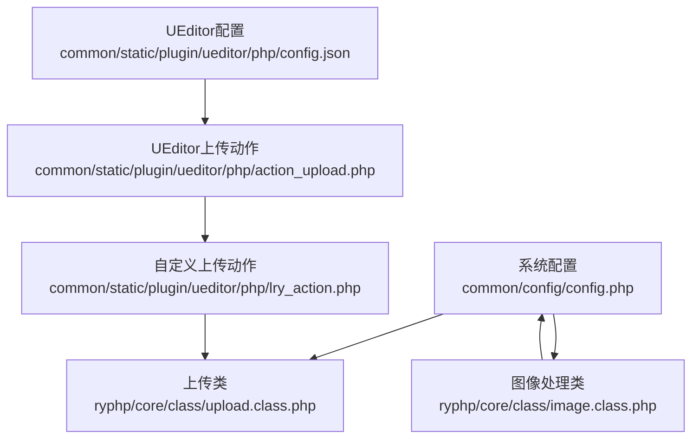
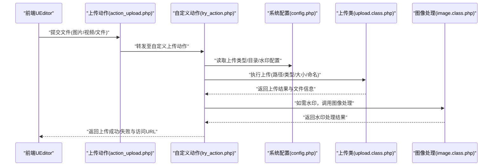
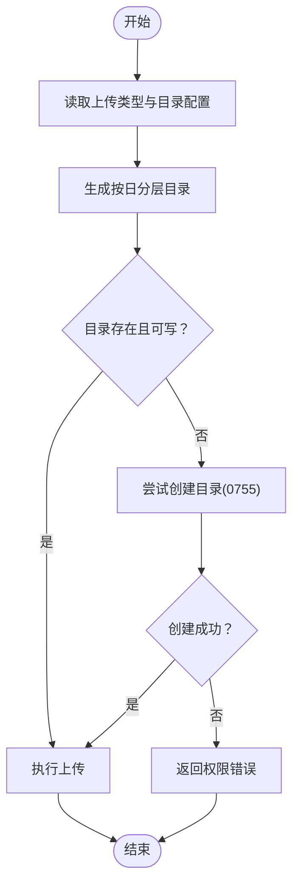
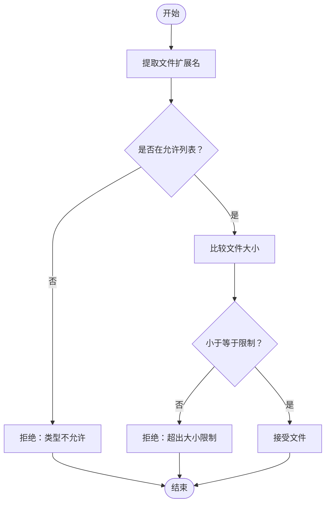
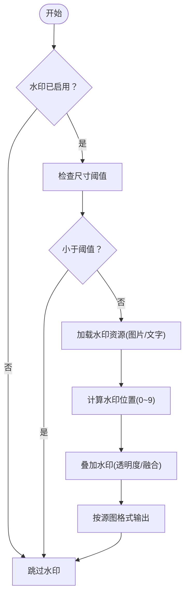
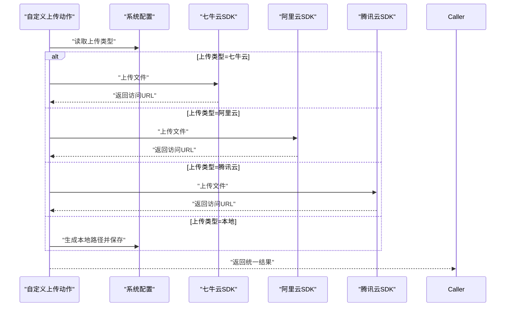
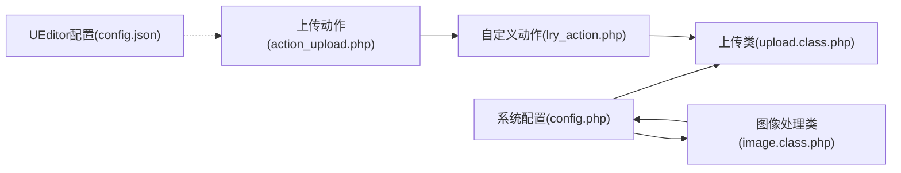

# 附件配置

<cite>
**本文引用的文件**
- [common/config/config.php](file://common/config/config.php)
- [ryphp/core/class/upload.class.php](file://ryphp/core/class/upload.class.php)
- [ryphp/core/class/image.class.php](file://ryphp/core/class/image.class.php)
- [common/static/plugin/ueditor/php/config.json](file://common/static/plugin/ueditor/php/config.json)
- [common/static/plugin/ueditor/php/action_upload.php](file://common/static/plugin/ueditor/php/action_upload.php)
- [common/static/plugin/ueditor/php/lry_action.php](file://common/static/plugin/ueditor/php/lry_action.php)
- [common/data/water/water.png](file://common/data/water/water.png)
- [common/data/font/elephant.ttf](file://common/data/font/elephant.ttf)
- [application/lry_admin_center/controller/common.class.php](file://application/lry_admin_center/controller/common.class.php)
</cite>

## 目录
1. [简介](#简介)
2. [项目结构](#项目结构)
3. [核心组件](#核心组件)
4. [架构总览](#架构总览)
5. [详细组件分析](#详细组件分析)
6. [依赖关系分析](#依赖关系分析)
7. [性能考虑](#性能考虑)
8. [故障排查指南](#故障排查指南)
9. [结论](#结论)
10. [附录](#附录)

## 简介
本技术文档围绕 LRYBlog 的附件配置能力展开，重点覆盖以下方面：
- 文件上传类型配置：本地上传、七牛云、阿里云、腾讯云等云存储服务的接入要点与差异。
- 上传目录配置：上传路径设置、目录权限管理与分卷存储思路。
- 图片水印配置：水印图片、位置、透明度、尺寸阈值、文字水印等参数。
- 附件安全管理：文件类型限制、大小限制、病毒扫描建议。
- 附件存储优化：分卷存储策略、存储空间管理与清理。
- 云存储配置示例与迁移指南：从本地到云存储的配置步骤与注意事项。

## 项目结构
与附件配置直接相关的模块分布如下：
- 系统配置：集中于系统配置文件，包含上传类型、上传目录、水印开关与位置等关键参数。
- 上传类：封装本地上传流程，负责路径校验、类型与大小检查、随机命名与移动文件。
- 图像处理类：封装水印与缩略图逻辑，支持图片格式检测、水印叠加与输出质量控制。
- UEditor 配置：前端富文本编辑器的上传行为、允许类型、路径格式与大小限制。
- 管理端通用控制器：提供后台访问控制与安全策略入口。

**图表来源**
- [common/config/config.php:75-81](file://common/config/config.php#L75-L81)
- [ryphp/core/class/upload.class.php:30-52](file://ryphp/core/class/upload.class.php#L30-L52)
- [ryphp/core/class/image.class.php:27-34](file://ryphp/core/class/image.class.php#L27-L34)
- [common/static/plugin/ueditor/php/config.json:1-94](file://common/static/plugin/ueditor/php/config.json#L1-L94)
- [common/static/plugin/ueditor/php/action_upload.php](file://common/static/plugin/ueditor/php/action_upload.php)
- [common/static/plugin/ueditor/php/lry_action.php](file://common/static/plugin/ueditor/php/lry_action.php)

**章节来源**
- [common/config/config.php:75-81](file://common/config/config.php#L75-L81)
- [ryphp/core/class/upload.class.php:30-52](file://ryphp/core/class/upload.class.php#L30-L52)
- [ryphp/core/class/image.class.php:27-34](file://ryphp/core/class/image.class.php#L27-L34)
- [common/static/plugin/ueditor/php/config.json:1-94](file://common/static/plugin/ueditor/php/config.json#L1-L94)

## 核心组件
- 系统配置
  - 上传类型：支持本地(host)与多家云存储标识，便于后续扩展。
  - 上传目录：统一的根目录与按日分层的子目录结构。
  - 水印：开关、水印图片名、水印位置、最小宽高阈值等。
- 上传类
  - 路径：基于配置生成年月/日两级目录，确保热点分散。
  - 类型与大小：内置白名单与最大值检查，结合系统配置。
  - 命名：默认随机命名，避免冲突与暴露原始文件名。
  - 错误：统一错误码与错误消息，便于定位问题。
- 图像处理类
  - 水印：支持图片水印与文字水印，位置枚举0~9，含随机。
  - 输出：根据源图格式选择对应输出函数，保持透明通道。
  - 条件：仅当源图尺寸大于阈值时才添加水印。
- UEditor 配置
  - 允许类型：图片、视频、文件三类分别配置。
  - 路径格式：支持 {yyyy}{mm}{dd}/{time}{rand:6} 等占位符。
  - 大小限制：针对图片、视频、文件分别设定上限。

**章节来源**
- [common/config/config.php:75-81](file://common/config/config.php#L75-L81)
- [ryphp/core/class/upload.class.php:10-241](file://ryphp/core/class/upload.class.php#L10-L241)
- [ryphp/core/class/image.class.php:10-362](file://ryphp/core/class/image.class.php#L10-L362)
- [common/static/plugin/ueditor/php/config.json:1-94](file://common/static/plugin/ueditor/php/config.json#L1-L94)

## 架构总览
下图展示从前端上传到后端处理再到存储的整体流程，以及与系统配置、上传类与图像处理类的关系。

**图表来源**
- [common/static/plugin/ueditor/php/action_upload.php](file://common/static/plugin/ueditor/php/action_upload.php)
- [common/static/plugin/ueditor/php/lry_action.php](file://common/static/plugin/ueditor/php/lry_action.php)
- [common/config/config.php:75-81](file://common/config/config.php#L75-L81)
- [ryphp/core/class/upload.class.php:189-241](file://ryphp/core/class/upload.class.php#L189-L241)
- [ryphp/core/class/image.class.php:221-356](file://ryphp/core/class/image.class.php#L221-L356)

## 详细组件分析

### 组件一：上传类型与目录配置
- 上传类型
  - 支持本地(host)与多家云存储标识，便于后续扩展。
  - 云存储接入建议：在自定义上传动作中根据类型分支，调用对应SDK完成上传，并返回统一的访问URL与元数据。
- 上传目录
  - 目录结构：基于配置生成“年/月/日”三级目录，提升磁盘I/O性能与管理便利性。
  - 权限管理：上传前检查目录存在与可写；若不存在则尝试创建，权限建议为 0755。
  - 分卷存储：可在生成路径时加入卷号字段，实现按卷分片存储与容量均衡。

**图表来源**
- [common/config/config.php:75-78](file://common/config/config.php#L75-L78)
- [ryphp/core/class/upload.class.php:47-94](file://ryphp/core/class/upload.class.php#L47-L94)

**章节来源**
- [common/config/config.php:75-78](file://common/config/config.php#L75-L78)
- [ryphp/core/class/upload.class.php:47-94](file://ryphp/core/class/upload.class.php#L47-L94)

### 组件二：文件类型与大小限制
- 类型限制
  - 上传类内置图片类型白名单，结合系统配置进行二次校验。
  - UEditor 配置对图片、视频、文件分别给出允许扩展名列表，前端先行过滤。
- 大小限制
  - 上传类以 KB 为单位读取系统配置的最大值，与 PHP 上传限制协同。
  - UEditor 配置对图片、视频、文件分别设置最大值，避免超大文件进入后端。

**图表来源**
- [ryphp/core/class/upload.class.php:113-120](file://ryphp/core/class/upload.class.php#L113-L120)
- [common/static/plugin/ueditor/php/config.json:6-71](file://common/static/plugin/ueditor/php/config.json#L6-L71)

**章节来源**
- [ryphp/core/class/upload.class.php:113-120](file://ryphp/core/class/upload.class.php#L113-L120)
- [common/static/plugin/ueditor/php/config.json:6-71](file://common/static/plugin/ueditor/php/config.json#L6-L71)

### 组件三：图片水印配置与处理
- 水印开关与位置
  - 开关：由系统配置决定是否启用。
  - 位置：0~9 枚举，0 表示随机；1~9 分别对应九宫格与右下角等固定位置。
- 水印资源
  - 图片水印：默认路径来自系统配置的水印名，位于公共数据目录。
  - 文字水印：使用字体文件渲染文字水印，支持颜色与字号。
- 尺寸阈值
  - 仅当源图宽度/高度均大于最小宽高阈值时才添加水印，避免对小图过度处理。
- 输出质量与透明度
  - JPEG 输出质量与透明度可配置，PNG/GIF 保留透明通道。

**图表来源**
- [ryphp/core/class/image.class.php:27-34](file://ryphp/core/class/image.class.php#L27-L34)
- [ryphp/core/class/image.class.php:221-356](file://ryphp/core/class/image.class.php#L221-L356)
- [common/data/water/water.png](file://common/data/water/water.png)
- [common/data/font/elephant.ttf](file://common/data/font/elephant.ttf)

**章节来源**
- [ryphp/core/class/image.class.php:27-34](file://ryphp/core/class/image.class.php#L27-L34)
- [ryphp/core/class/image.class.php:221-356](file://ryphp/core/class/image.class.php#L221-L356)
- [common/data/water/water.png](file://common/data/water/water.png)
- [common/data/font/elephant.ttf](file://common/data/font/elephant.ttf)

### 组件四：附件安全管理
- 文件类型限制
  - 后端与前端双重限制：上传类白名单 + UEditor 允许列表，减少恶意类型进入。
- 大小限制
  - 后端读取系统配置的最大值，前端 UEditor 亦有各自限制，形成前后端协同。
- 病毒扫描建议
  - 建议在上传完成后对文件进行病毒扫描（例如集成第三方扫描服务），并在扫描通过后再对外提供访问。
  - 对于图片水印处理，仅在确认安全的前提下进行，避免传播风险。

**章节来源**
- [ryphp/core/class/upload.class.php:113-120](file://ryphp/core/class/upload.class.php#L113-L120)
- [common/static/plugin/ueditor/php/config.json:6-71](file://common/static/plugin/ueditor/php/config.json#L6-L71)

### 组件五：附件存储优化
- 分卷存储
  - 可在生成路径时引入卷号字段，实现按卷分片，便于容量管理与迁移。
- 存储空间管理
  - 定期清理过期或重复文件，监控目录占用，必要时启用压缩或归档。
- 性能优化
  - 采用按日分层目录，降低单目录文件数量，提升 I/O 性能。

**章节来源**
- [ryphp/core/class/upload.class.php:47-52](file://ryphp/core/class/upload.class.php#L47-L52)

### 组件六：云存储配置示例与迁移指南
- 本地上传
  - 默认上传类型为本地，按系统配置的目录进行存储。
- 七牛云/阿里云/腾讯云
  - 在自定义上传动作中根据上传类型分支，调用对应云存储 SDK 完成上传。
  - 返回统一的访问URL与元数据，保证与本地上传接口一致。
  - 建议：
    - 在系统配置中新增云存储密钥、Bucket/容器、域名等参数。
    - 上传完成后可选地进行水印处理（云端或本地处理视业务而定）。
    - 建立迁移脚本，批量将历史文件从本地迁移到云存储，并更新访问URL。

**图表来源**
- [common/config/config.php:76](file://common/config/config.php#L76)
- [common/static/plugin/ueditor/php/lry_action.php](file://common/static/plugin/ueditor/php/lry_action.php)

**章节来源**
- [common/config/config.php:76](file://common/config/config.php#L76)
- [common/static/plugin/ueditor/php/lry_action.php](file://common/static/plugin/ueditor/php/lry_action.php)

## 依赖关系分析
- 上传类依赖系统配置中的上传目录与最大值配置。
- 图像处理类依赖系统配置中的水印开关、水印图片名与位置，以及字体与水印最小尺寸阈值。
- UEditor 配置独立于后端上传类，但两者在允许类型与路径格式上应保持一致，以避免跨端不兼容。

**图表来源**
- [common/config/config.php:75-81](file://common/config/config.php#L75-L81)
- [ryphp/core/class/upload.class.php:30-52](file://ryphp/core/class/upload.class.php#L30-L52)
- [ryphp/core/class/image.class.php:27-34](file://ryphp/core/class/image.class.php#L27-L34)
- [common/static/plugin/ueditor/php/config.json:1-94](file://common/static/plugin/ueditor/php/config.json#L1-L94)
- [common/static/plugin/ueditor/php/action_upload.php](file://common/static/plugin/ueditor/php/action_upload.php)
- [common/static/plugin/ueditor/php/lry_action.php](file://common/static/plugin/ueditor/php/lry_action.php)

**章节来源**
- [common/config/config.php:75-81](file://common/config/config.php#L75-L81)
- [ryphp/core/class/upload.class.php:30-52](file://ryphp/core/class/upload.class.php#L30-L52)
- [ryphp/core/class/image.class.php:27-34](file://ryphp/core/class/image.class.php#L27-L34)
- [common/static/plugin/ueditor/php/config.json:1-94](file://common/static/plugin/ueditor/php/config.json#L1-L94)

## 性能考虑
- 目录分层：按日分层可显著降低单目录文件数量，提升文件系统性能。
- 随机命名：避免文件名碰撞与目录排序开销。
- 水印条件：仅对超过阈值的图片添加水印，减少不必要的图像处理。
- 云存储：将热点文件缓存至CDN，降低源站压力；对大文件采用分片上传与断点续传。

## 故障排查指南
- 上传失败
  - 检查上传目录是否存在且可写；若不存在，确认自动创建权限与路径拼接逻辑。
  - 查看错误码与错误消息，定位是类型不被允许、大小超限还是移动失败。
- 水印无效
  - 确认水印开关已开启，水印图片路径正确，且源图尺寸超过最小宽高阈值。
  - 检查水印位置与透明度设置是否合理。
- UEditor 上传异常
  - 对比 UEditor 配置中的允许类型与大小限制，确保与后端一致。
  - 检查上传动作与自定义动作的路由与参数传递。

**章节来源**
- [ryphp/core/class/upload.class.php:57-75](file://ryphp/core/class/upload.class.php#L57-L75)
- [ryphp/core/class/upload.class.php:81-94](file://ryphp/core/class/upload.class.php#L81-L94)
- [ryphp/core/class/image.class.php:221-356](file://ryphp/core/class/image.class.php#L221-L356)
- [common/static/plugin/ueditor/php/config.json:1-94](file://common/static/plugin/ueditor/php/config.json#L1-L94)

## 结论
LRYBlog 的附件配置体系以系统配置为核心，结合上传类与图像处理类实现了本地上传与水印处理的基础能力；同时，UEditor 配置提供了前端层面的类型与大小约束。通过在自定义上传动作中扩展云存储类型，可平滑实现从本地到云存储的迁移。建议在生产环境中强化安全策略（类型限制、大小限制、病毒扫描），并结合分卷存储与CDN优化提升性能与可靠性。

## 附录
- 管理端访问控制
  - 管理端通用控制器提供登录校验、权限校验、IP限制、Token校验与锁屏等功能，保障附件管理操作的安全性。

**章节来源**
- [application/lry_admin_center/controller/common.class.php:32-106](file://application/lry_admin_center/controller/common.class.php#L32-L106)