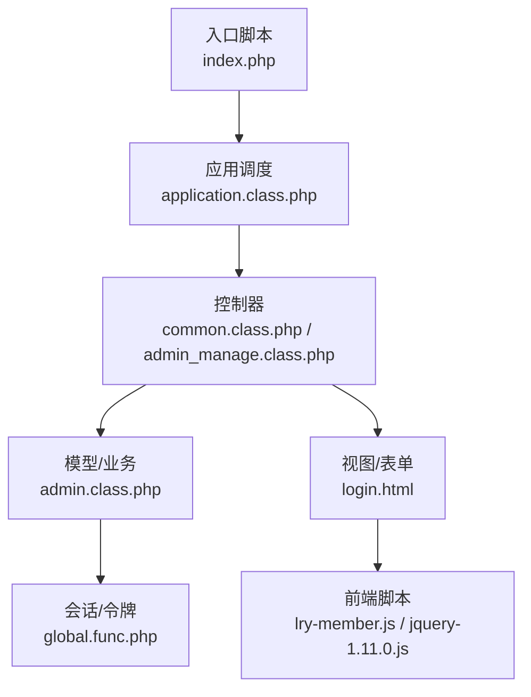
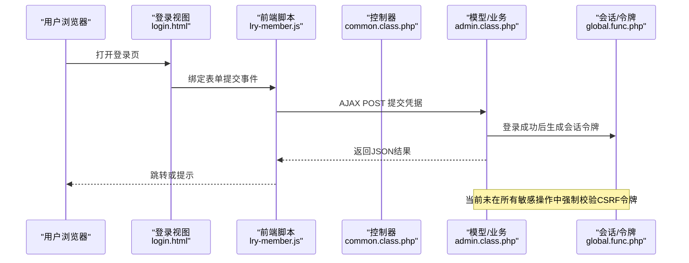
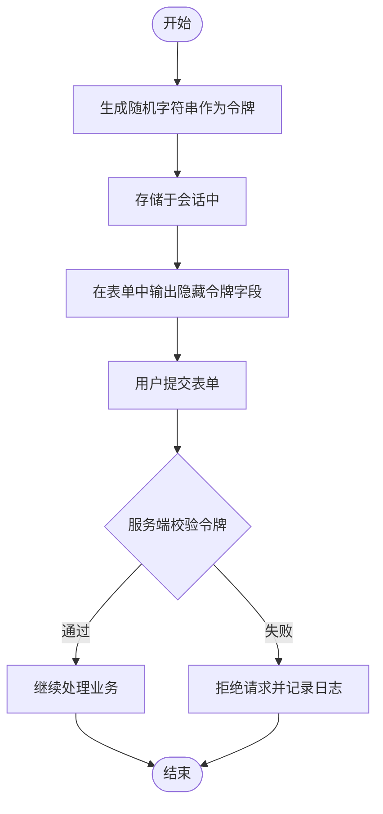
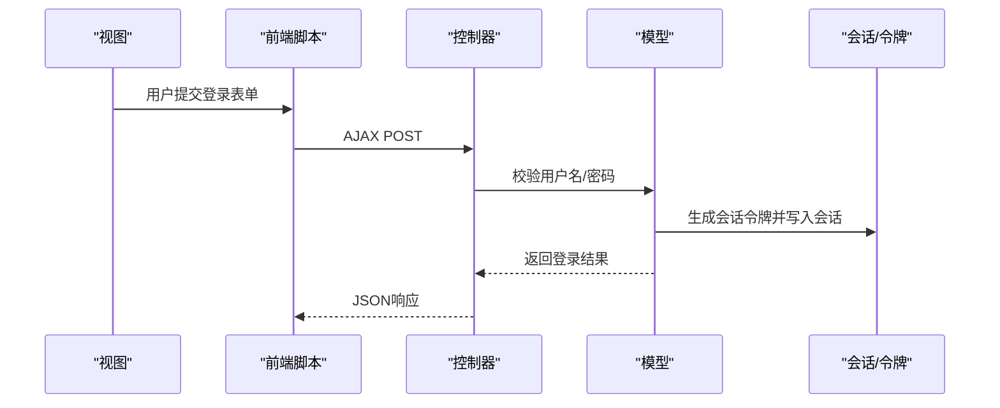
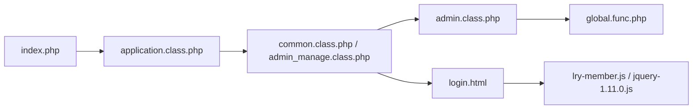

# CSRF攻击防护

<cite>
**本文引用的文件**
- [index.php](file://index.php)
- [config.php](file://common/config/config.php)
- [global.func.php](file://ryphp/core/function/global.func.php)
- [form.class.php](file://ryphp/core/class/form.class.php)
- [login.html](file://application/lry_admin_center/view/login.html)
- [admin.class.php](file://application/lry_admin_center/model/admin.class.php)
- [common.class.php](file://application/lry_admin_center/controller/common.class.php)
- [admin_manage.class.php](file://application/lry_admin_center/controller/admin_manage.class.php)
- [application.class.php](file://ryphp/core/class/application.class.php)
- [lry-member.js](file://common/static/js/lry-member.js)
- [jquery-1.11.0.js](file://common/static/vip/js/jquery-1.11.0.js)
</cite>

## 目录
1. [简介](#简介)
2. [项目结构](#项目结构)
3. [核心组件](#核心组件)
4. [架构总览](#架构总览)
5. [详细组件分析](#详细组件分析)
6. [依赖关系分析](#依赖关系分析)
7. [性能考量](#性能考量)
8. [故障排查指南](#故障排查指南)
9. [结论](#结论)
10. [附录](#附录)

## 简介
本文件面向LRYBlog系统，围绕跨站请求伪造（CSRF）攻击的原理与危害，结合系统现有实现，给出CSRF防护的技术文档。内容涵盖：
- CSRF威胁模型：请求劫持、状态变更攻击、敏感操作滥用
- 系统内CSRF令牌机制现状与不足
- 请求来源验证与同源策略的应用边界
- 表单与AJAX安全保护现状
- 会话级防护现状与改进建议
- 配置项与可扩展点
- 攻击检测与效果评估建议
- 开发者测试与漏洞验证指引

## 项目结构
LRYBlog采用MVC分层与模块化组织，CSRF相关能力主要分布在以下层次：
- 入口与路由：入口脚本初始化框架，路由解析到控制器
- 控制器层：权限校验与业务控制
- 模型层：登录与会话建立
- 视图层：表单渲染与前端交互
- 核心函数与类：会话、令牌、请求辅助函数

图表来源
- [index.php](file://index.php#L1-L18)
- [application.class.php](file://ryphp/core/class/application.class.php#L1-L118)
- [common.class.php](file://application/lry_admin_center/controller/common.class.php#L19-L50)
- [admin_manage.class.php](file://application/lry_admin_center/controller/admin_manage.class.php#L1-L105)
- [admin.class.php](file://application/lry_admin_center/model/admin.class.php#L1-L96)
- [login.html](file://application/lry_admin_center/view/login.html#L1-L98)
- [global.func.php](file://ryphp/core/function/global.func.php#L1693-L1731)
- [lry-member.js](file://common/static/js/lry-member.js#L1-L36)
- [jquery-1.11.0.js](file://common/static/vip/js/jquery-1.11.0.js#L9142-L9648)

章节来源
- [index.php](file://index.php#L1-L18)
- [application.class.php](file://ryphp/core/class/application.class.php#L1-L118)

## 核心组件
- 会话与Cookie配置：系统提供Cookie域、路径、生命周期、Secure/HttpOnly等配置项，但未启用HttpOnly与Secure的组合策略，存在风险。
- 令牌生成与校验：全局函数提供令牌生成与校验，但未在所有敏感操作中强制使用。
- 登录与会话建立：登录成功后生成会话令牌，但未对后续敏感操作进行统一拦截校验。
- 前端AJAX：部分登录页使用AJAX提交，但未携带CSRF令牌。

章节来源
- [config.php](file://common/config/config.php#L31-L38)
- [global.func.php](file://ryphp/core/function/global.func.php#L1693-L1731)
- [admin.class.php](file://application/lry_admin_center/model/admin.class.php#L67-L86)
- [login.html](file://application/lry_admin_center/view/login.html#L51-L95)

## 架构总览
CSRF防护在系统中的落地路径如下：

图表来源
- [login.html](file://application/lry_admin_center/view/login.html#L51-L95)
- [lry-member.js](file://common/static/js/lry-member.js#L7-L35)
- [common.class.php](file://application/lry_admin_center/controller/common.class.php#L32-L49)
- [admin.class.php](file://application/lry_admin_center/model/admin.class.php#L67-L86)
- [global.func.php](file://ryphp/core/function/global.func.php#L1693-L1731)

## 详细组件分析

### 会话与Cookie配置现状
- Cookie配置项包含域、路径、生命周期、Secure、HttpOnly等，但未启用Secure与HttpOnly的组合，可能使令牌在非HTTPS场景下暴露。
- 会话启动函数增强了HttpOnly策略，但未强制Secure标志，仍存在被窃取的风险。

章节来源
- [config.php](file://common/config/config.php#L31-L38)
- [global.func.php](file://ryphp/core/function/global.func.php#L1693-L1707)

### 令牌生成与校验
- 令牌生成：全局函数提供随机字符串生成，并在会话中维护一个令牌字段；表单渲染时可直接输出隐藏字段。
- 令牌校验：提供校验函数，支持一次性使用后销毁。

图表来源
- [global.func.php](file://ryphp/core/function/global.func.php#L1710-L1731)

章节来源
- [global.func.php](file://ryphp/core/function/global.func.php#L1710-L1731)
- [form.class.php](file://ryphp/core/class/form.class.php#L143-L145)

### 登录流程与会话建立
- 登录成功后，模型层设置会话关键字段并生成会话令牌，随后写入Cookie并返回成功结果。
- 登录失败会记录尝试日志，但未对CSRF令牌进行校验。

图表来源
- [login.html](file://application/lry_admin_center/view/login.html#L51-L95)
- [admin.class.php](file://application/lry_admin_center/model/admin.class.php#L67-L86)
- [global.func.php](file://ryphp/core/function/global.func.php#L1710-L1731)

章节来源
- [admin.class.php](file://application/lry_admin_center/model/admin.class.php#L67-L86)

### 权限校验与来源检查
- 管理端控制器在非登录页对会话与Cookie一致性进行检查，但未进行Referer/Origin校验或同源策略验证。
- 该机制可作为基础防护，但不足以抵御跨站请求伪造。

章节来源
- [common.class.php](file://application/lry_admin_center/controller/common.class.php#L32-L49)

### 前端AJAX与表单安全
- 登录页使用jQuery AJAX提交，但未携带CSRF令牌字段。
- 通用成员登录脚本同样未包含令牌字段，存在被利用风险。

章节来源
- [login.html](file://application/lry_admin_center/view/login.html#L51-L95)
- [lry-member.js](file://common/static/js/lry-member.js#L16-L35)
- [jquery-1.11.0.js](file://common/static/vip/js/jquery-1.11.0.js#L9614-L9648)

### 敏感操作与控制器
- 管理员列表与修改密码等敏感操作均通过控制器处理，但未在所有POST/DELETE/PUT等敏感动作中强制校验CSRF令牌。
- 建议在控制器基类或中间件层统一拦截并校验令牌。

章节来源
- [admin_manage.class.php](file://application/lry_admin_center/controller/admin_manage.class.php#L49-L104)

## 依赖关系分析
- 入口脚本负责初始化框架与路由，控制器负责业务调度，模型负责登录与会话建立，视图负责表单渲染，全局函数提供会话与令牌能力。
- 前端脚本与控制器交互，但未统一携带CSRF令牌，形成安全缺口。

图表来源
- [index.php](file://index.php#L1-L18)
- [application.class.php](file://ryphp/core/class/application.class.php#L1-L118)
- [common.class.php](file://application/lry_admin_center/controller/common.class.php#L1-L50)
- [admin_manage.class.php](file://application/lry_admin_center/controller/admin_manage.class.php#L1-L105)
- [admin.class.php](file://application/lry_admin_center/model/admin.class.php#L1-L96)
- [login.html](file://application/lry_admin_center/view/login.html#L1-L98)
- [global.func.php](file://ryphp/core/function/global.func.php#L1693-L1731)
- [lry-member.js](file://common/static/js/lry-member.js#L1-L36)
- [jquery-1.11.0.js](file://common/static/vip/js/jquery-1.11.0.js#L9142-L9648)

## 性能考量
- 令牌生成与校验为轻量操作，对性能影响可忽略。
- 若引入更严格的来源校验（如Origin/Referer），需考虑跨域场景与代理环境带来的额外判断成本。
- 建议将令牌校验下沉至中间件，减少重复逻辑，提升整体性能与一致性。

## 故障排查指南
- 令牌不匹配
  - 症状：提交表单后被拒绝
  - 排查：确认表单中是否包含隐藏令牌字段；检查会话是否正确启动；核对令牌生成与校验逻辑
  - 参考
    - [global.func.php](file://ryphp/core/function/global.func.php#L1710-L1731)
- 登录后仍被重定向至登录页
  - 症状：登录成功但被强制跳转
  - 排查：检查会话与Cookie一致性校验逻辑；确认Cookie域与路径配置
  - 参考
    - [common.class.php](file://application/lry_admin_center/controller/common.class.php#L32-L49)
- AJAX请求未携带令牌
  - 症状：登录页AJAX成功但存在CSRF风险
  - 排查：在前端脚本中增加令牌字段；在控制器中统一校验
  - 参考
    - [login.html](file://application/lry_admin_center/view/login.html#L51-L95)
    - [lry-member.js](file://common/static/js/lry-member.js#L16-L35)

章节来源
- [global.func.php](file://ryphp/core/function/global.func.php#L1710-L1731)
- [common.class.php](file://application/lry_admin_center/controller/common.class.php#L32-L49)
- [login.html](file://application/lry_admin_center/view/login.html#L51-L95)
- [lry-member.js](file://common/static/js/lry-member.js#L16-L35)

## 结论
LRYBlog系统具备基础的会话与令牌能力，但在CSRF防护方面存在明显短板：
- 未在所有敏感操作中强制校验CSRF令牌
- 未启用Cookie Secure/HttpOnly组合策略
- 前端AJAX未统一携带令牌
- 缺少统一的来源校验与同源策略应用

建议尽快引入统一的中间件/基类拦截、强制令牌校验、完善Cookie安全策略，并在前端统一注入与提交令牌，以形成闭环的CSRF防护体系。

## 附录

### CSRF攻击原理与危害
- 请求劫持：攻击者诱使用户在已登录状态下提交恶意请求
- 状态变更攻击：修改用户资料、密码、权限等
- 敏感操作滥用：删除资源、转账、发布内容等

### 现有实现与建议对比
- 现状
  - 会话令牌生成与校验存在，但未覆盖全部敏感操作
  - Cookie未启用Secure/HttpOnly组合
  - 前端AJAX未携带令牌
- 建议
  - 引入统一中间件/基类拦截，强制校验CSRF令牌
  - 启用Cookie Secure/HttpOnly，必要时启用SameSite
  - 在所有敏感操作中统一注入与校验令牌
  - 在控制器层补充来源校验（Referer/Origin/同源策略）

### 配置项与扩展点
- Cookie安全配置
  - cookie_secure：建议设为true（HTTPS）
  - cookie_httponly：建议设为true（防XSS）
  - cookie_samesite：建议设为Lax/Strict
  - 参考
    - [config.php](file://common/config/config.php#L31-L38)
- 令牌生成算法
  - 当前使用随机字符串生成，建议结合时间戳与用户上下文增强唯一性
  - 参考
    - [global.func.php](file://ryphp/core/function/global.func.php#L86-L88)
    - [global.func.php](file://ryphp/core/function/global.func.php#L1710-L1718)

### 攻击检测与效果评估
- 日志审计：记录所有敏感操作的请求来源、User-Agent、IP等
- 异常告警：对频繁失败、异常来源、跨域请求进行告警
- 效果评估：统计CSRF拦截率、误报率、响应时间等指标

### 测试与验证指引
- 手工测试
  - 在登录后构造跨站请求，验证是否被拦截
  - 修改令牌值或删除令牌，验证是否被拒绝
- 自动化测试
  - 使用自动化工具模拟跨站请求，覆盖常见场景
- 前端注入测试
  - 在表单中注入令牌字段，验证后端校验逻辑