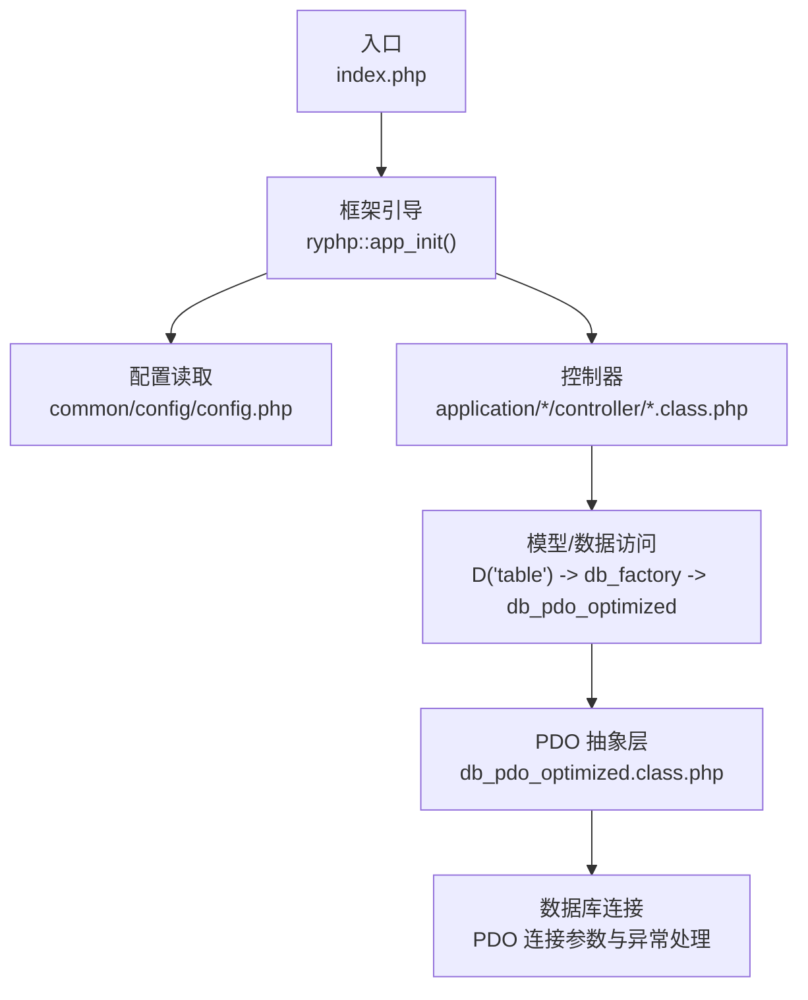
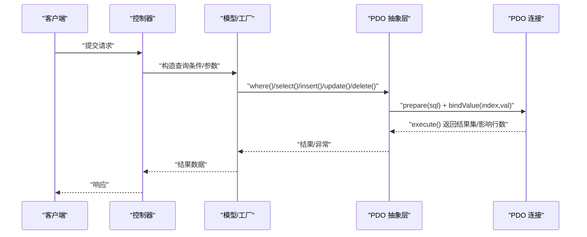
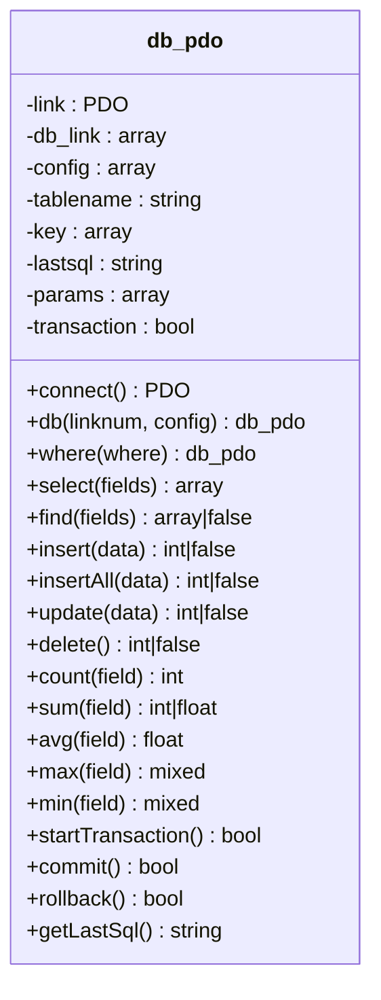
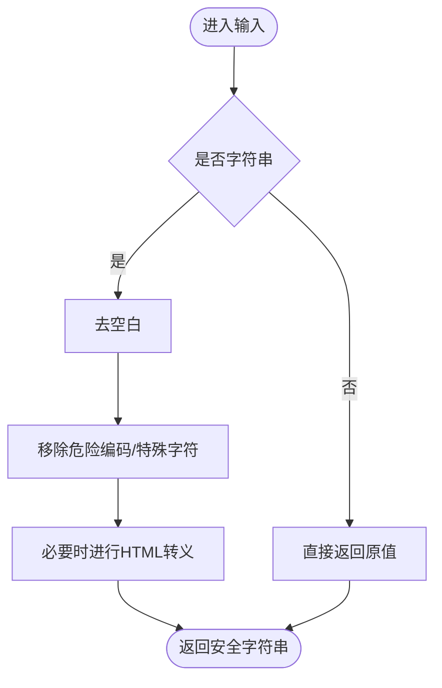
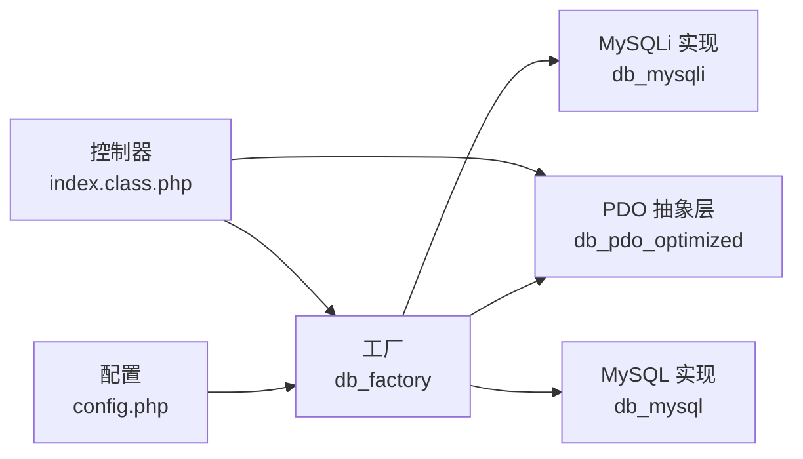

# SQL注入防护

<cite>
**本文引用的文件**
- [index.php](file://index.php)
- [config.php](file://common/config/config.php)
- [db_factory.class.php](file://ryphp/core/class/db_factory.class.php)
- [db_pdo_optimized.class.php](file://ryphp/core/class/db_pdo_optimized.class.php)
- [db_pdo.class.php](file://ryphp/core/class/db_pdo.class.php)
- [db_mysql.class.php](file://ryphp/core/class/db_mysql.class.php)
- [db_mysqli.class.php](file://ryphp/core/class/db_mysqli.class.php)
- [DbException.class.php](file://ryphp/core/class/DbException.class.php)
- [global.func.php](file://ryphp/core/function/global.func.php)
- [index.class.php](file://application/index/controller/index.class.php)
- [index.class.php](file://application/lry_admin_center/controller/index.class.php)
</cite>

## 目录
1. [简介](#简介)
2. [项目结构](#项目结构)
3. [核心组件](#核心组件)
4. [架构总览](#架构总览)
5. [详细组件分析](#详细组件分析)
6. [依赖关系分析](#依赖关系分析)
7. [性能考量](#性能考量)
8. [故障排查指南](#故障排查指南)
9. [结论](#结论)
10. [附录](#附录)

## 简介
本文件面向开发者与安全工程师，系统性梳理 LRYBlog 的数据库抽象层与 SQL 注入防护设计，覆盖 PDO 参数绑定、预处理语句、输入校验、错误与日志处理、以及部署与运维层面的安全配置要点。文档同时给出常见攻击类型与防护策略的对比说明，并提供测试与扫描建议，帮助在开发与维护阶段持续降低 SQL 注入风险。

## 项目结构
LRYBlog 采用 MVC 分层与轻量框架内核，数据库访问通过统一工厂与 PDO 抽象层实现，控制器负责接收用户输入并调用模型层进行查询。入口文件初始化应用，配置文件集中管理数据库连接参数与系统行为。

**图表来源**
- [index.php](file://index.php#L10-L18)
- [config.php](file://common/config/config.php#L13-L22)
- [db_factory.class.php](file://ryphp/core/class/db_factory.class.php#L11-L50)
- [db_pdo_optimized.class.php](file://ryphp/core/class/db_pdo_optimized.class.php#L87-L97)

**章节来源**
- [index.php](file://index.php#L10-L18)
- [config.php](file://common/config/config.php#L13-L22)

## 核心组件
- 数据库工厂与选择器：根据配置动态选择 PDO/MySQLi/MySQL 实现，统一对外接口。
- PDO 抽象层：封装连接、预处理、绑定、事务、元数据查询与错误处理。
- 全局函数与输入校验：提供安全替换、用户名/密码格式校验、URL 安全处理等辅助能力。
- 控制器：接收用户输入，调用模型层执行查询，输出结果。

**章节来源**
- [db_factory.class.php](file://ryphp/core/class/db_factory.class.php#L11-L50)
- [db_pdo_optimized.class.php](file://ryphp/core/class/db_pdo_optimized.class.php#L13-L80)
- [global.func.php](file://ryphp/core/function/global.func.php#L487-L516)
- [global.func.php](file://ryphp/core/function/global.func.php#L954-L1007)
- [index.class.php](file://application/index/controller/index.class.php#L14-L17)
- [index.class.php](file://application/lry_admin_center/controller/index.class.php#L19-L38)

## 架构总览
LRYBlog 的数据库访问链路如下：

**图表来源**
- [db_pdo_optimized.class.php](file://ryphp/core/class/db_pdo_optimized.class.php#L180-L208)
- [db_pdo_optimized.class.php](file://ryphp/core/class/db_pdo_optimized.class.php#L406-L435)
- [db_pdo_optimized.class.php](file://ryphp/core/class/db_pdo_optimized.class.php#L442-L463)
- [db_pdo_optimized.class.php](file://ryphp/core/class/db_pdo_optimized.class.php#L504-L538)
- [db_pdo_optimized.class.php](file://ryphp/core/class/db_pdo_optimized.class.php#L544-L567)

## 详细组件分析

### 数据库工厂与连接选择
- 工厂根据配置项选择具体实现，当前配置为 PDO，确保统一的预处理与绑定能力。
- 工厂负责将配置注入到具体数据库类实例，屏蔽上层差异。

**章节来源**
- [db_factory.class.php](file://ryphp/core/class/db_factory.class.php#L11-L50)
- [config.php](file://common/config/config.php#L13-L22)

### PDO 抽象层（db_pdo_optimized）
- 连接参数：启用严格错误模式、禁用模拟预处理、关闭字符串化抓取，确保绑定语义与真实 SQL 一致。
- 预处理与绑定：where 条件数组自动拼接 SQL 并通过占位符绑定；insert/update/batch insert 统一使用占位符与 bindValue。
- 事务：提供显式事务控制，配合业务一致性需求。
- 元数据：支持主键、字段列表、表存在性检测等，减少硬编码 SQL。
- 错误处理：捕获 PDOException，区分“连接断开”重连与“执行错误”抛出自定义异常；在非调试模式下隐藏底层细节，统一写入错误日志。

**图表来源**
- [db_pdo_optimized.class.php](file://ryphp/core/class/db_pdo_optimized.class.php#L13-L80)
- [db_pdo_optimized.class.php](file://ryphp/core/class/db_pdo_optimized.class.php#L180-L208)
- [db_pdo_optimized.class.php](file://ryphp/core/class/db_pdo_optimized.class.php#L406-L435)
- [db_pdo_optimized.class.php](file://ryphp/core/class/db_pdo_optimized.class.php#L442-L463)
- [db_pdo_optimized.class.php](file://ryphp/core/class/db_pdo_optimized.class.php#L504-L538)
- [db_pdo_optimized.class.php](file://ryphp/core/class/db_pdo_optimized.class.php#L708-L758)

**章节来源**
- [db_pdo_optimized.class.php](file://ryphp/core/class/db_pdo_optimized.class.php#L55-L61)
- [db_pdo_optimized.class.php](file://ryphp/core/class/db_pdo_optimized.class.php#L87-L97)
- [db_pdo_optimized.class.php](file://ryphp/core/class/db_pdo_optimized.class.php#L180-L208)
- [db_pdo_optimized.class.php](file://ryphp/core/class/db_pdo_optimized.class.php#L544-L567)

### 输入验证与清理
- 安全替换：对字符串进行 URL 编码与特殊字符清理、HTML 转义，降低 XSS 与注入风险。
- 用户名/密码格式：限定长度与字符集，拒绝包含危险字符的输入。
- URL 安全：对请求路径与查询串进行安全替换，避免路径穿越与注入。

**图表来源**
- [global.func.php](file://ryphp/core/function/global.func.php#L487-L516)
- [global.func.php](file://ryphp/core/function/global.func.php#L954-L1007)
- [global.func.php](file://ryphp/core/function/global.func.php#L180-L198)

**章节来源**
- [global.func.php](file://ryphp/core/function/global.func.php#L487-L516)
- [global.func.php](file://ryphp/core/function/global.func.php#L954-L1007)
- [global.func.php](file://ryphp/core/function/global.func.php#L180-L198)

### 控制器与查询调用
- 控制器从请求中提取参数，进行基础校验（如页码、验证码、用户名/密码格式），随后调用模型层执行查询。
- 模型层通过 D('table') 获取数据库对象，使用链式 API 组合 where/select/insert/update/delete 等操作，内部均走预处理与绑定。

**章节来源**
- [index.class.php](file://application/index/controller/index.class.php#L14-L17)
- [index.class.php](file://application/lry_admin_center/controller/index.class.php#L19-L38)
- [db_pdo_optimized.class.php](file://ryphp/core/class/db_pdo_optimized.class.php#L328-L357)

### 错误处理与日志
- 自定义异常：DbException 携带异常类型与 SQL 片段，便于定位与审计。
- 非调试模式：隐藏底层错误细节，统一输出通用错误信息并写入错误日志。
- 调试模式：输出 SQL 与耗时，便于开发期诊断。

**章节来源**
- [DbException.class.php](file://ryphp/core/class/DbException.class.php#L10-L73)
- [db_pdo_optimized.class.php](file://ryphp/core/class/db_pdo_optimized.class.php#L216-L233)
- [db_pdo_optimized.class.php](file://ryphp/core/class/db_pdo_optimized.class.php#L195-L198)

## 依赖关系分析
- 配置驱动：数据库类型、主机、端口、字符集、前缀等由配置文件集中管理，工厂按配置选择实现。
- 工厂耦合：上层仅依赖工厂接口，不直接感知 PDO/MySQLi/MySQL 差异。
- 抽象层内聚：PDO 抽象层内部封装连接、预处理、绑定、事务与元数据，对外暴露链式 API。

**图表来源**
- [config.php](file://common/config/config.php#L13-L22)
- [db_factory.class.php](file://ryphp/core/class/db_factory.class.php#L11-L50)
- [db_pdo_optimized.class.php](file://ryphp/core/class/db_pdo_optimized.class.php#L13-L80)
- [db_mysqli.class.php](file://ryphp/core/class/db_mysqli.class.php#L127-L150)
- [db_mysql.class.php](file://ryphp/core/class/db_mysql.class.php#L10-L50)
- [index.class.php](file://application/index/controller/index.class.php#L14-L17)

**章节来源**
- [config.php](file://common/config/config.php#L13-L22)
- [db_factory.class.php](file://ryphp/core/class/db_factory.class.php#L11-L50)

## 性能考量
- 预处理与绑定：减少 SQL 重解析与编译开销，提升批量插入与频繁查询场景下的吞吐。
- 事务批处理：合理使用事务可减少往返次数，但需注意锁与回滚成本。
- 调试日志：仅在调试模式输出 SQL 与耗时，避免生产环境额外 IO。

[本节为通用建议，无需列出具体文件来源]

## 故障排查指南
- 连接失败：检查配置项与网络权限；查看异常类型与 SQL 片段定位问题。
- 执行错误：在非调试模式下关注统一错误输出与错误日志；调试模式下结合 SQL 与耗时定位瓶颈。
- 误删保护：delete 必须带有 where 条件，否则抛出异常，避免全表清空风险。

**章节来源**
- [DbException.class.php](file://ryphp/core/class/DbException.class.php#L10-L73)
- [db_pdo_optimized.class.php](file://ryphp/core/class/db_pdo_optimized.class.php#L557-L567)
- [db_pdo_optimized.class.php](file://ryphp/core/class/db_pdo_optimized.class.php#L216-L233)

## 结论
LRYBlog 在数据库抽象层通过 PDO 预处理与严格参数绑定、严格的连接参数配置、完善的错误与日志处理，以及输入清洗与格式校验，形成了较为完整的 SQL 注入防护体系。配合控制器侧的输入校验与工厂化的实现选择，整体具备良好的安全性与可维护性。建议在生产环境中保持调试关闭、定期扫描与渗透测试，持续加固。

[本节为总结性内容，无需列出具体文件来源]

## 附录

### 常见 SQL 注入类型与危害
- 联合查询注入：利用 UNION 合并结果，绕过鉴权或读取敏感数据。
- 布尔盲注：基于真假条件的延时或页面差异推断数据。
- 时间盲注：通过可控延迟判断数据片段。
- 常见攻击载体：未过滤的用户输入、错误回显、不当的字符串拼接。

[本节为概念性说明，无需列出具体文件来源]

### 防护策略与最佳实践
- 参数化查询与预处理：优先使用占位符与绑定，避免字符串拼接。
- 输入过滤与白名单：对字段名、表名、排序与方向等进行白名单校验。
- 最小权限原则：数据库账号仅授予必要权限。
- 隐藏错误信息：生产环境不暴露底层错误细节。
- 安全配置：字符集、连接参数、事务隔离级别与超时设置。

[本节为通用实践建议，无需列出具体文件来源]

### 安全查询构建最佳实践（代码级）
- 使用链式 API 组合 where 条件，避免手写 SQL 字符串。
- 批量插入使用一次性多值插入与统一绑定。
- 对外暴露的排序与字段列表进行白名单校验。
- 删除与更新必须包含明确的 where 条件。

**章节来源**
- [db_pdo_optimized.class.php](file://ryphp/core/class/db_pdo_optimized.class.php#L328-L357)
- [db_pdo_optimized.class.php](file://ryphp/core/class/db_pdo_optimized.class.php#L442-L463)
- [db_pdo_optimized.class.php](file://ryphp/core/class/db_pdo_optimized.class.php#L504-L538)
- [db_pdo_optimized.class.php](file://ryphp/core/class/db_pdo_optimized.class.php#L544-L567)

### 错误处理与日志记录的安全考虑
- 非调试模式：统一错误输出，隐藏 SQL 与堆栈细节。
- 调试模式：保留 SQL 与耗时，便于定位问题。
- CLI 场景：单独处理命令行错误输出。

**章节来源**
- [db_pdo_optimized.class.php](file://ryphp/core/class/db_pdo_optimized.class.php#L216-L233)
- [db_pdo_optimized.class.php](file://ryphp/core/class/db_pdo_optimized.class.php#L195-L198)

### 测试方法与漏洞扫描指导
- 单元测试：针对 where/select/insert/update/delete 的边界与异常路径。
- 集成测试：模拟注入载荷（如单引号、分号、注释符）验证防护效果。
- 手工渗透：重点检查登录、搜索、筛选、分页等输入点。
- 自动化扫描：使用 SQLMap、OWASP ZAP 等工具进行自动化探测。
- 日志审计：定期检查错误日志与 SQL 记录，识别异常模式。

[本节为通用测试建议，无需列出具体文件来源]