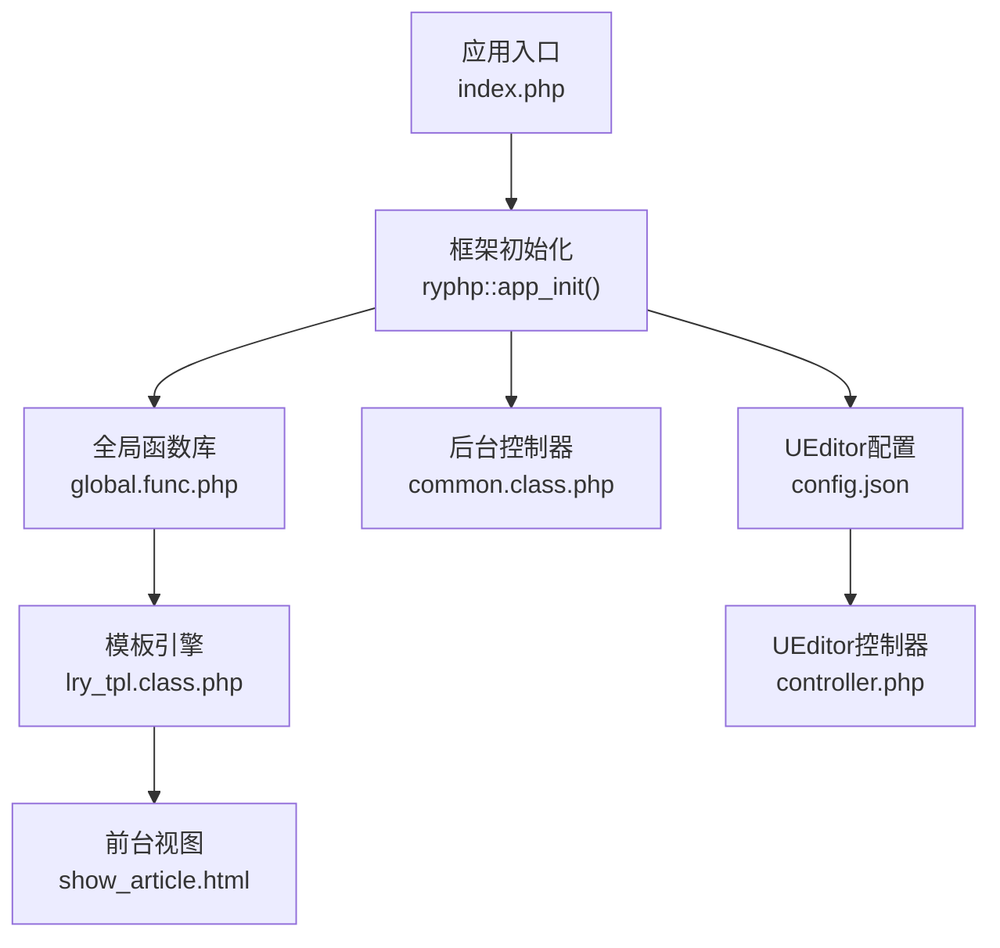
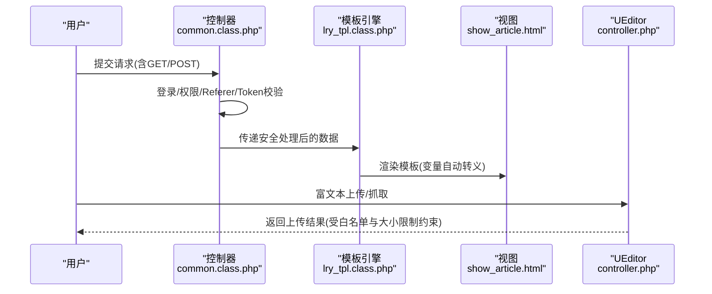
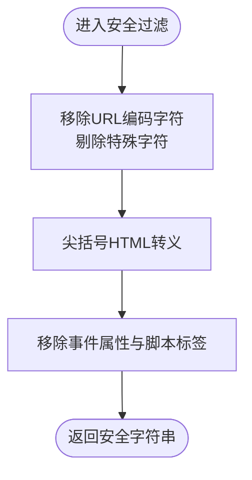
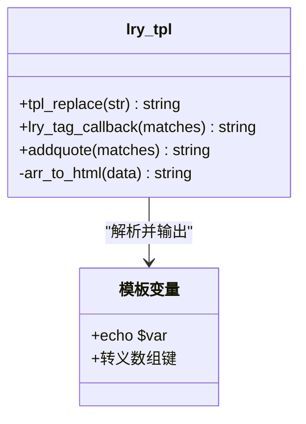
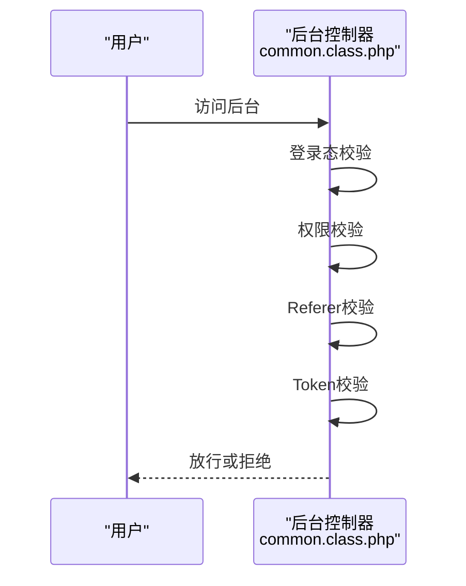
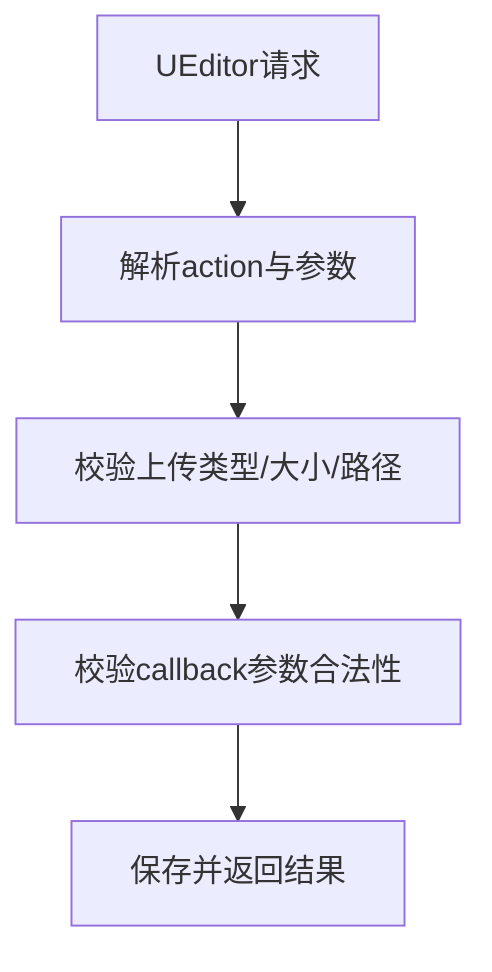
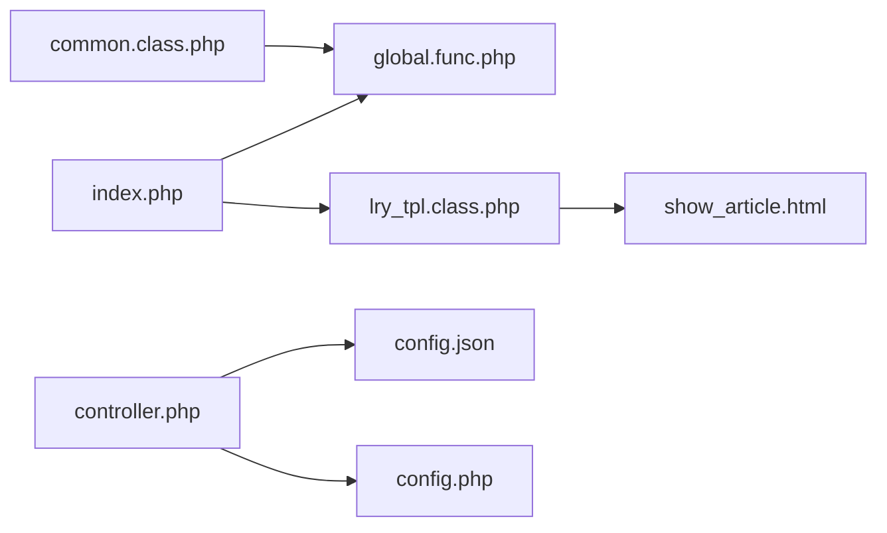

# XSS攻击防护

<cite>
**本文引用的文件**
- [index.php](file://index.php)
- [global.func.php](file://ryphp/core/function/global.func.php)
- [lry_tpl.class.php](file://ryphp/core/class/lry_tpl.class.php)
- [common.class.php](file://application/lry_admin_center/controller/common.class.php)
- [show_article.html](file://application/index/view/rongyao/show_article.html)
- [config.php](file://common/config/config.php)
- [config.json](file://common/static/plugin/ueditor/php/config.json)
- [controller.php](file://common/static/plugin/ueditor/php/controller.php)
</cite>

## 目录
1. [引言](#引言)
2. [项目结构](#项目结构)
3. [核心组件](#核心组件)
4. [架构总览](#架构总览)
5. [详细组件分析](#详细组件分析)
6. [依赖关系分析](#依赖关系分析)
7. [性能考量](#性能考量)
8. [故障排查指南](#故障排查指南)
9. [结论](#结论)
10. [附录](#附录)

## 引言
本文件面向LRYBlog系统的XSS（跨站脚本）攻击防护，系统性梳理输入过滤、输出编码、模板渲染、富文本编辑器安全配置与CSP策略实施现状，并给出可操作的加固建议与最佳实践。文档同时提供代码级流程图与架构图，帮助开发者快速定位风险点并落实防护措施。

## 项目结构
LRYBlog采用MVC分层与模板引擎结合的结构：
- 应用入口与框架初始化位于根目录入口文件
- 核心函数与安全过滤能力集中在全局函数库
- 模板引擎负责视图渲染与变量输出
- 后台控制器统一做权限校验与CSRF令牌校验
- 富文本编辑器UEditor提供上传与内容管理接口

图表来源
- [index.php](file://index.php#L10-L18)
- [global.func.php](file://ryphp/core/function/global.func.php#L487-L516)
- [lry_tpl.class.php](file://ryphp/core/class/lry_tpl.class.php#L31-L59)
- [common.class.php](file://application/lry_admin_center/controller/common.class.php#L1-L153)
- [config.json](file://common/static/plugin/ueditor/php/config.json#L1-L94)
- [controller.php](file://common/static/plugin/ueditor/php/controller.php#L1-L68)

章节来源
- [index.php](file://index.php#L10-L18)
- [global.func.php](file://ryphp/core/function/global.func.php#L487-L516)
- [lry_tpl.class.php](file://ryphp/core/class/lry_tpl.class.php#L31-L59)
- [common.class.php](file://application/lry_admin_center/controller/common.class.php#L1-L153)
- [config.json](file://common/static/plugin/ueditor/php/config.json#L1-L94)
- [controller.php](file://common/static/plugin/ueditor/php/controller.php#L1-L68)

## 核心组件
- 输入过滤与URL清洗：提供URL与参数清洗、特殊字符剔除、尖括号HTML转义等
- 输出编码：模板引擎对变量输出进行安全转义
- 后台安全：统一登录校验、权限校验、Referer校验、CSRF令牌校验
- 富文本编辑器：UEditor上传白名单、路径前缀、跨域与回调参数校验
- 配置中心：系统Cookie、缓存、上传等安全相关配置

章节来源
- [global.func.php](file://ryphp/core/function/global.func.php#L487-L516)
- [lry_tpl.class.php](file://ryphp/core/class/lry_tpl.class.php#L31-L59)
- [common.class.php](file://application/lry_admin_center/controller/common.class.php#L1-L153)
- [config.json](file://common/static/plugin/ueditor/php/config.json#L1-L94)
- [controller.php](file://common/static/plugin/ueditor/php/controller.php#L1-L68)
- [config.php](file://common/config/config.php#L1-L88)

## 架构总览
XSS防护贯穿“输入-处理-存储-渲染-输出”全链路，关键节点如下：
- 输入阶段：URL与参数清洗、特殊字符过滤、事件属性与脚本标签剔除
- 处理阶段：模板变量输出自动转义
- 输出阶段：后台统一校验与令牌校验，富文本上传严格白名单
- 配置阶段：Cookie与缓存安全参数

图表来源
- [common.class.php](file://application/lry_admin_center/controller/common.class.php#L1-L153)
- [lry_tpl.class.php](file://ryphp/core/class/lry_tpl.class.php#L31-L59)
- [show_article.html](file://application/index/view/rongyao/show_article.html#L68-L69)
- [controller.php](file://common/static/plugin/ueditor/php/controller.php#L20-L68)

## 详细组件分析

### 组件A：输入过滤与URL清洗
- 安全过滤函数对URL编码字符、特殊符号、尖括号进行处理
- 移除事件属性与脚本标签，降低反射型与DOM型XSS风险
- URL构造时对PATH_INFO、REQUEST_URI等进行清洗

图表来源
- [global.func.php](file://ryphp/core/function/global.func.php#L487-L516)
- [global.func.php](file://ryphp/core/function/global.func.php#L192-L198)

章节来源
- [global.func.php](file://ryphp/core/function/global.func.php#L487-L516)
- [global.func.php](file://ryphp/core/function/global.func.php#L192-L198)

### 组件B：模板系统安全渲染
- 模板引擎将变量输出转换为PHP输出语句，并对数组键进行转义处理
- 模板标签解析时对数组元素进行安全处理，避免直接输出未经转义的用户输入

图表来源
- [lry_tpl.class.php](file://ryphp/core/class/lry_tpl.class.php#L31-L59)
- [lry_tpl.class.php](file://ryphp/core/class/lry_tpl.class.php#L101-L104)
- [lry_tpl.class.php](file://ryphp/core/class/lry_tpl.class.php#L111-L132)

章节来源
- [lry_tpl.class.php](file://ryphp/core/class/lry_tpl.class.php#L31-L59)
- [lry_tpl.class.php](file://ryphp/core/class/lry_tpl.class.php#L101-L104)
- [lry_tpl.class.php](file://ryphp/core/class/lry_tpl.class.php#L111-L132)

### 组件C：后台安全控制（登录、权限、Referer、Token）
- 登录态校验与iframe跳转保护
- 权限判定与公开动作放行
- Referer来源校验与IP白黑名单
- CSRF令牌校验与POST请求保护

图表来源
- [common.class.php](file://application/lry_admin_center/controller/common.class.php#L32-L50)
- [common.class.php](file://application/lry_admin_center/controller/common.class.php#L56-L62)
- [common.class.php](file://application/lry_admin_center/controller/common.class.php#L111-L118)
- [common.class.php](file://application/lry_admin_center/controller/common.class.php#L126-L131)

章节来源
- [common.class.php](file://application/lry_admin_center/controller/common.class.php#L1-L153)

### 组件D：富文本编辑器（UEditor）安全配置
- 上传类型白名单与大小限制
- 路径格式化与访问前缀可控
- 控制器对回调参数进行合法性校验
- 抓取远程图片域名白名单

图表来源
- [config.json](file://common/static/plugin/ueditor/php/config.json#L1-L94)
- [controller.php](file://common/static/plugin/ueditor/php/controller.php#L20-L68)

章节来源
- [config.json](file://common/static/plugin/ueditor/php/config.json#L1-L94)
- [controller.php](file://common/static/plugin/ueditor/php/controller.php#L1-L68)

### 组件E：前台视图中的输出点
- 内容区直接输出变量，需确保上游已进行安全处理
- 链接与用户输入字段需配合模板转义与URL清洗

章节来源
- [show_article.html](file://application/index/view/rongyao/show_article.html#L68-L69)

## 依赖关系分析
- 入口文件引导框架初始化，随后调用全局函数库与模板引擎
- 后台控制器依赖全局函数库进行URL清洗与安全处理
- 模板引擎依赖全局函数库进行数组与变量转义
- UEditor控制器依赖配置文件与系统配置进行上传白名单与大小限制

图表来源
- [index.php](file://index.php#L10-L18)
- [global.func.php](file://ryphp/core/function/global.func.php#L487-L516)
- [lry_tpl.class.php](file://ryphp/core/class/lry_tpl.class.php#L31-L59)
- [show_article.html](file://application/index/view/rongyao/show_article.html#L68-L69)
- [common.class.php](file://application/lry_admin_center/controller/common.class.php#L1-L153)
- [controller.php](file://common/static/plugin/ueditor/php/controller.php#L1-L68)
- [config.json](file://common/static/plugin/ueditor/php/config.json#L1-L94)
- [config.php](file://common/config/config.php#L1-L88)

章节来源
- [index.php](file://index.php#L10-L18)
- [global.func.php](file://ryphp/core/function/global.func.php#L487-L516)
- [lry_tpl.class.php](file://ryphp/core/class/lry_tpl.class.php#L31-L59)
- [show_article.html](file://application/index/view/rongyao/show_article.html#L68-L69)
- [common.class.php](file://application/lry_admin_center/controller/common.class.php#L1-L153)
- [controller.php](file://common/static/plugin/ueditor/php/controller.php#L1-L68)
- [config.json](file://common/static/plugin/ueditor/php/config.json#L1-L94)
- [config.php](file://common/config/config.php#L1-L88)

## 性能考量
- 模板解析与变量转义在渲染阶段执行，建议结合缓存与页面静态化降低CPU开销
- UEditor上传白名单与大小限制可减少无效IO与磁盘占用
- URL清洗与事件属性剔除成本较低，建议在入口处统一处理

## 故障排查指南
- 模板变量未转义导致XSS：检查模板标签解析与变量输出路径
- 富文本上传异常：核对上传类型白名单、大小限制与路径格式化
- 后台访问被拦截：确认登录态、Referer来源与CSRF令牌是否匹配
- URL参数异常：检查URL构造与清洗逻辑

章节来源
- [lry_tpl.class.php](file://ryphp/core/class/lry_tpl.class.php#L31-L59)
- [controller.php](file://common/static/plugin/ueditor/php/controller.php#L20-L68)
- [common.class.php](file://application/lry_admin_center/controller/common.class.php#L111-L131)
- [global.func.php](file://ryphp/core/function/global.func.php#L192-L198)

## 结论
LRYBlog在输入过滤、模板转义、后台安全控制与富文本上传方面具备基础防护能力。建议进一步引入CSP策略、强化Cookie安全标志、完善内容安全策略与报告机制，并持续进行渗透测试与自动化扫描，以形成纵深防御体系。

## 附录

### XSS类型与防护策略
- 反射型XSS：通过URL参数注入脚本；建议在入口处进行URL清洗与事件属性剔除
- 存储型XSS：持久化存储用户输入；建议在富文本上传环节严格白名单与大小限制
- DOM型XSS：基于客户端脚本；建议在模板渲染与事件绑定阶段进行严格转义

章节来源
- [global.func.php](file://ryphp/core/function/global.func.php#L487-L516)
- [config.json](file://common/static/plugin/ueditor/php/config.json#L1-L94)

### 输出编码应用场景
- HTML实体编码：模板变量输出、表单回显
- JavaScript转义：动态脚本拼接、事件属性
- CSS转义：动态样式注入点

章节来源
- [lry_tpl.class.php](file://ryphp/core/class/lry_tpl.class.php#L31-L59)

### 内容安全策略（CSP）实施要点
- 设置策略头：建议在服务端统一添加CSP响应头
- 白名单配置：限定脚本、样式、图片、媒体来源
- 报告机制：启用报告模式收集违规事件

[本节为通用指导，无需特定文件引用]

### 富文本编辑器安全配置清单
- 上传类型白名单与大小限制
- 路径格式化与访问前缀
- 抓取远程图片域名白名单
- 回调参数合法性校验

章节来源
- [config.json](file://common/static/plugin/ueditor/php/config.json#L1-L94)
- [controller.php](file://common/static/plugin/ueditor/php/controller.php#L20-L68)

### 开发者最佳实践
- 输入：统一URL清洗与特殊字符过滤
- 处理：模板变量输出自动转义
- 输出：后台统一校验与令牌校验
- 配置：Cookie安全标志、缓存安全参数

章节来源
- [global.func.php](file://ryphp/core/function/global.func.php#L487-L516)
- [lry_tpl.class.php](file://ryphp/core/class/lry_tpl.class.php#L31-L59)
- [common.class.php](file://application/lry_admin_center/controller/common.class.php#L1-L153)
- [config.php](file://common/config/config.php#L31-L38)