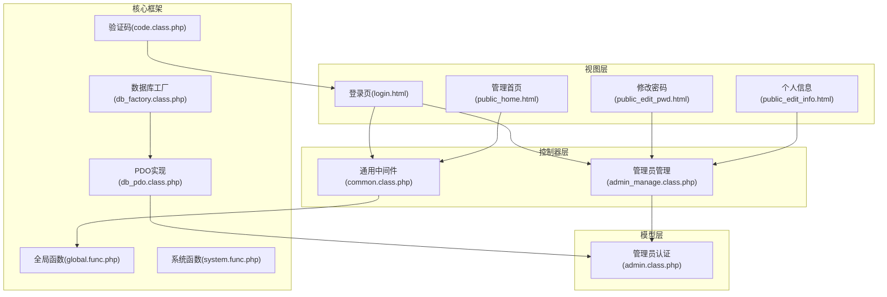
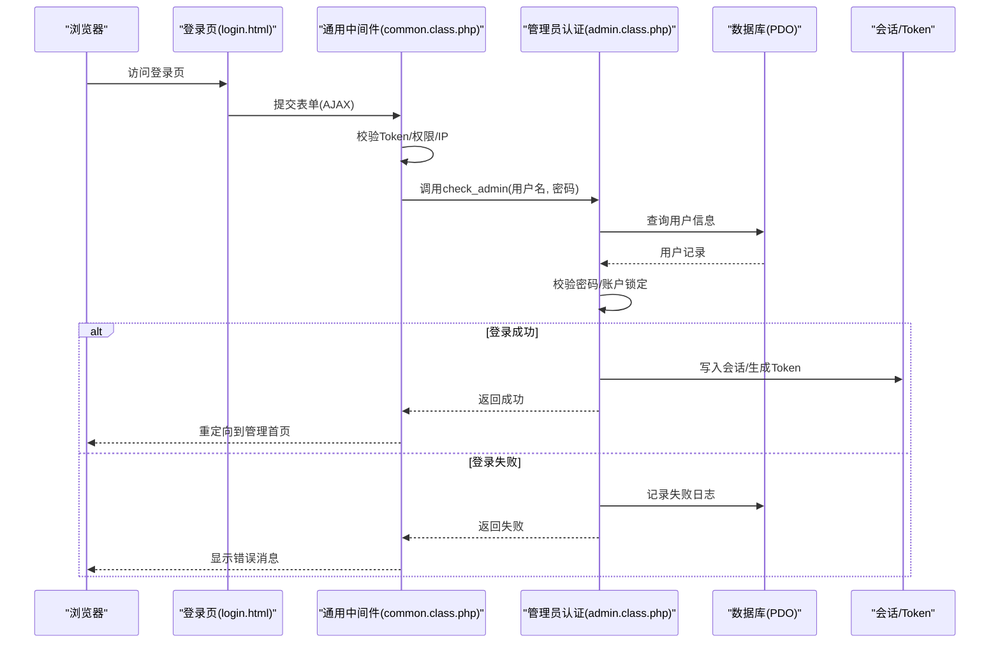
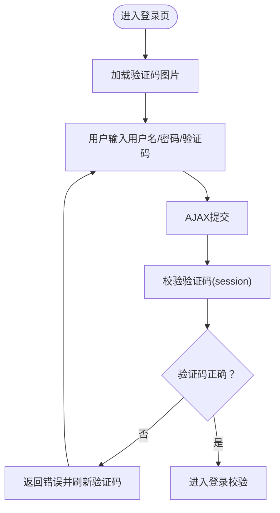
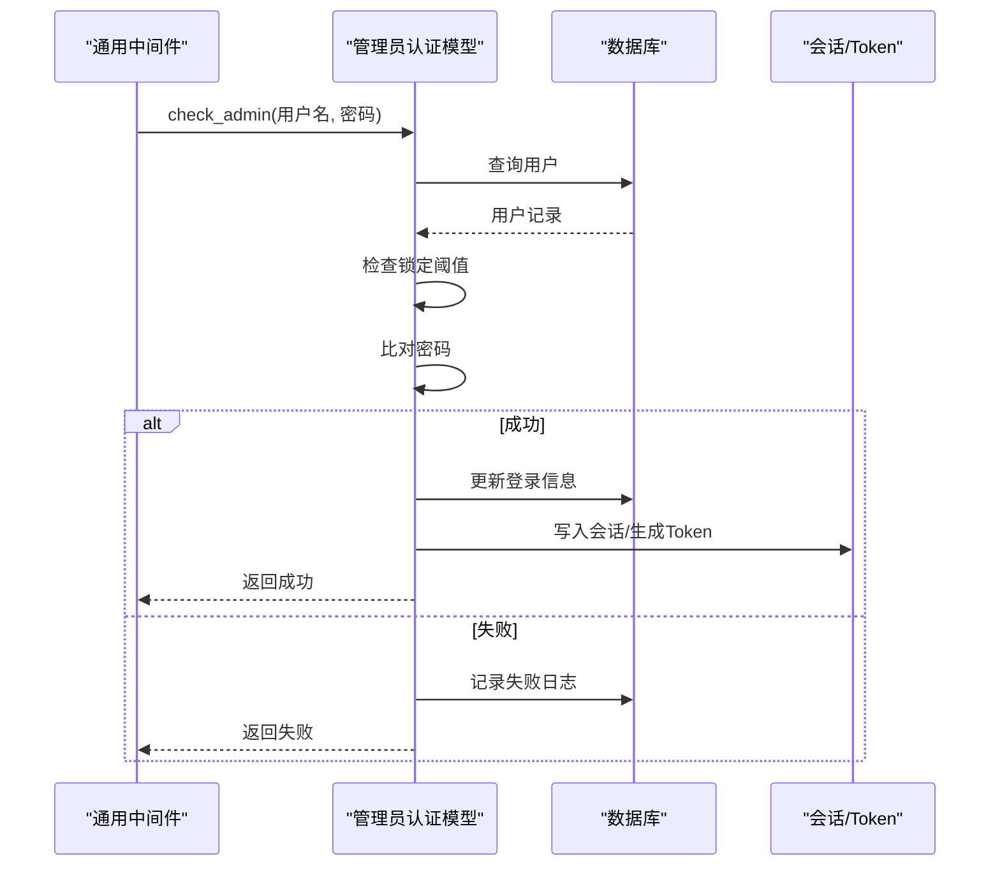
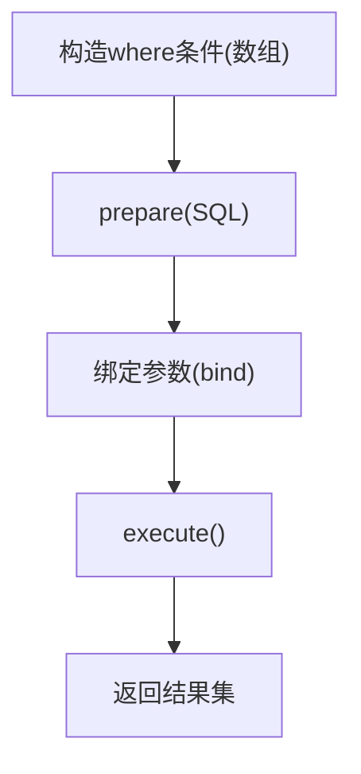
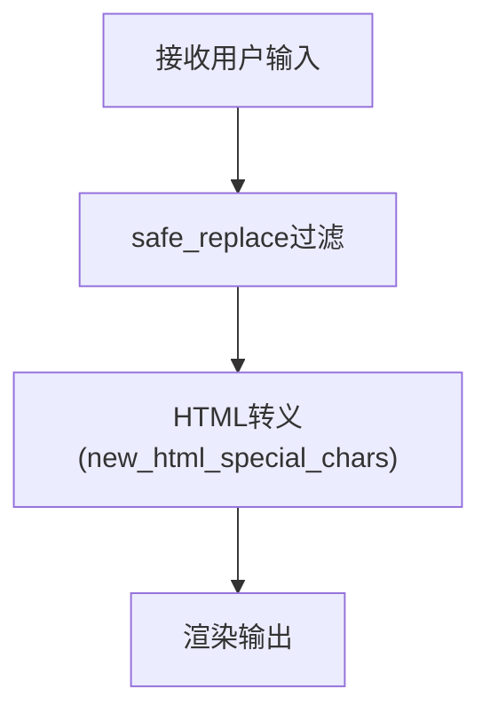
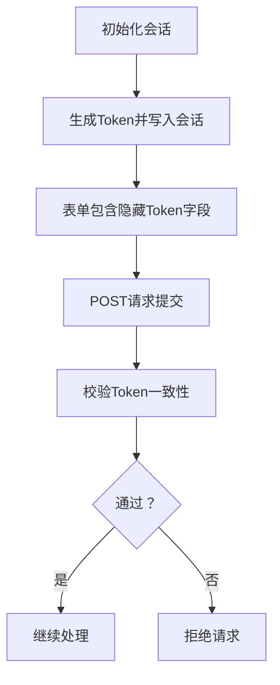
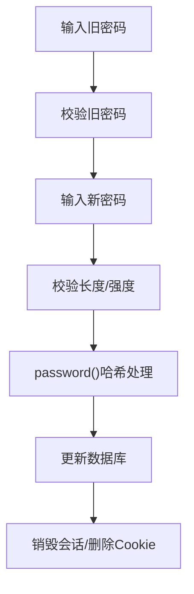
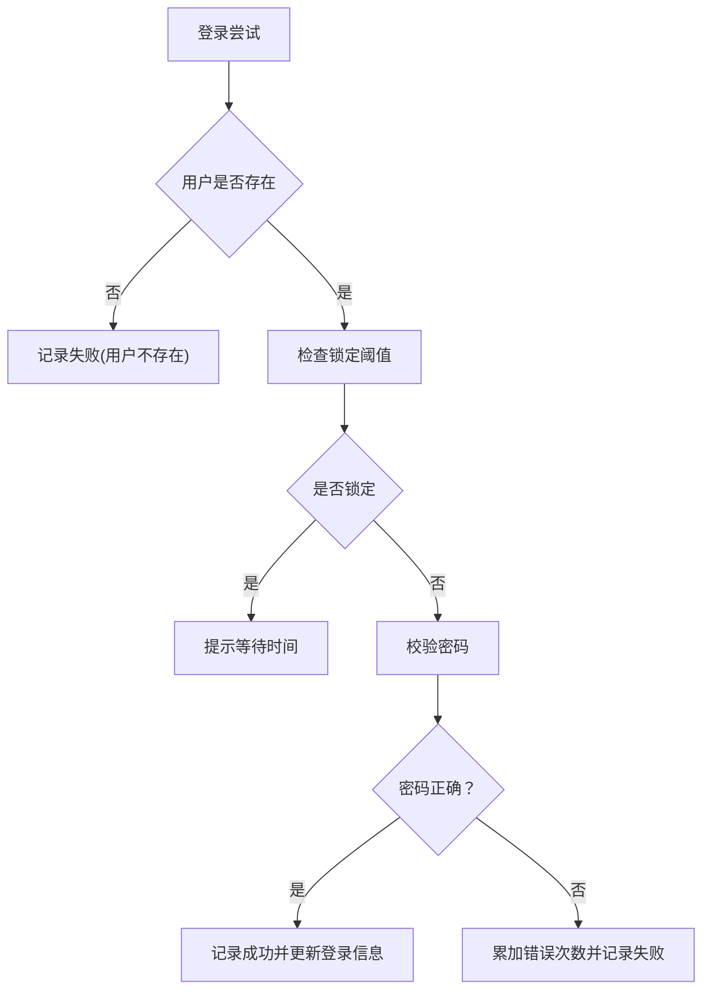
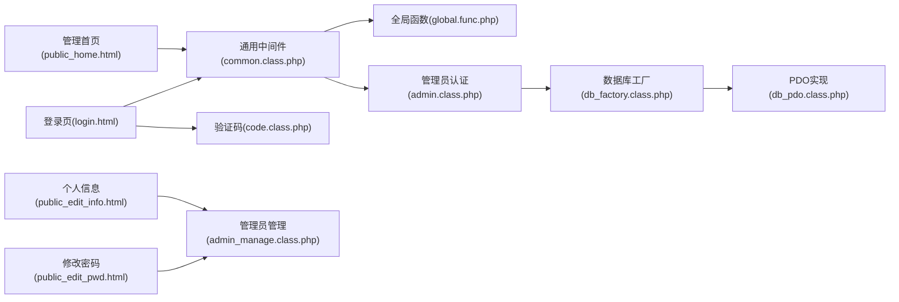

# 安全认证系统

<cite>
**本文档引用的文件**
- [application/lry_admin_center/view/login.html](file://application/lry_admin_center/view/login.html)
- [application/lry_admin_center/controller/admin_manage.class.php](file://application/lry_admin_center/controller/admin_manage.class.php)
- [application/lry_admin_center/model/admin.class.php](file://application/lry_admin_center/model/admin.class.php)
- [ryphp/core/class/code.class.php](file://ryphp/core/class/code.class.php)
- [common/function/system.func.php](file://common/function/system.func.php)
- [application/lry_admin_center/controller/common.class.php](file://application/lry_admin_center/controller/common.class.php)
- [ryphp/core/function/global.func.php](file://ryphp/core/function/global.func.php)
- [ryphp/core/class/db_pdo.class.php](file://ryphp/core/class/db_pdo.class.php)
- [ryphp/core/class/db_factory.class.php](file://ryphp/core/class/db_factory.class.php)
- [common/config/config.php](file://common/config/config.php)
- [application/lry_admin_center/view/public_edit_pwd.html](file://application/lry_admin_center/view/public_edit_pwd.html)
- [application/lry_admin_center/view/public_home.html](file://application/lry_admin_center/view/public_home.html)
- [application/lry_admin_center/view/admin_list.html](file://application/lry_admin_center/view/admin_list.html)
- [application/lry_admin_center/view/category_list.html](file://application/lry_admin_center/view/category_list.html)
- [application/lry_admin_center/view/public_edit_info.html](file://application/lry_admin_center/view/public_edit_info.html)
- [application/lry_admin_center/view/category_add.html](file://application/lry_admin_center/view/category_add.html)
- [application/lry_admin_center/view/category_edit.html](file://application/lry_admin_center/view/category_edit.html)
- [application/lry_admin_center/view/category_link.html](file://application/lry_admin_center/view/category_link.html)
- [application/lry_admin_center/view/category_link_edit.html](file://application/lry_admin_center/view/category_link_edit.html)
- [application/lry_admin_center/view/category_page.html](file://application/lry_admin_center/view/category_page.html)
- [application/lry_admin_center/view/category_page_edit.html](file://application/lry_admin_center/view/category_page_edit.html)
- [application/lry_admin_center/view/header.html](file://application/lry_admin_center/view/header.html)
- [application/lry_admin_center/view/menu.html](file://application/lry_admin_center/view/menu.html)
- [application/lry_admin_center/view/meta.html](file://application/lry_admin_center/view/meta.html)
- [application/lry_admin_center/view/public_home.html](file://application/lry_admin_center/view/public_home.html)
- [application/lry_admin_center/view/system_info.html](file://application/lry_admin_center/view/system_info.html)
- [application/lry_admin_center/view/footer.html](file://application/lry_admin_center/view/footer.html)
- [application/lry_admin_center/view/index.html](file://application/lry_admin_center/view/index.html)
- [application/lry_admin_center/view/list_article.html](file://application/lry_admin_center/view/list_article.html)
- [application/lry_admin_center/view/list_article_img.html](file://application/lry_admin_center/view/list_article_img.html)
- [application/lry_admin_center/view/list_time.html](file://application/lry_admin_center/view/list_time.html)
- [application/lry_admin_center/view/show_article.html](file://application/lry_admin_center/view/show_article.html)
- [application/lry_admin_center/view/category_article.html](file://application/lry_admin_center/view/category_article.html)
- [application/lry_admin_center/view/category_page.html](file://application/lry_admin_center/view/category_page.html)
- [application/lry_admin_center/view/category_page_edit.html](file://application/lry_admin_center/view/category_page_edit.html)
- [application/lry_admin_center/view/config.php](file://application/lry_admin_center/view/config.php)
- [application/lry_admin_center/view/rongyao/category_article.html](file://application/lry_admin_center/view/rongyao/category_article.html)
- [application/lry_admin_center/view/rongyao/category_page.html](file://application/lry_admin_center/view/rongyao/category_page.html)
- [application/lry_admin_center/view/rongyao/config.php](file://application/lry_admin_center/view/rongyao/config.php)
- [application/lry_admin_center/view/rongyao/list_article.html](file://application/lry_admin_center/view/rongyao/list_article.html)
- [application/lry_admin_center/view/rongyao/list_article_img.html](file://application/lry_admin_center/view/rongyao/list_article_img.html)
- [application/lry_admin_center/view/rongyao/list_time.html](file://application/lry_admin_center/view/rongyao/list_time.html)
- [application/lry_admin_center/view/rongyao/show_article.html](file://application/lry_admin_center/view/rongyao/show_article.html)
</cite>

## 目录
1. [引言](#引言)
2. [项目结构](#项目结构)
3. [核心组件](#核心组件)
4. [架构总览](#架构总览)
5. [详细组件分析](#详细组件分析)
6. [依赖关系分析](#依赖关系分析)
7. [性能考虑](#性能考虑)
8. [故障排查指南](#故障排查指南)
9. [结论](#结论)
10. [附录](#附录)

## 引言
本文件面向LRYBlog后台安全认证系统，围绕验证码生成与校验、会话与权限控制、SQL注入防护、XSS防护、CSRF防护、密码存储与强度策略、安全日志与异常检测等方面进行系统化技术说明，并提供针对开发与运维的安全配置与漏洞修复指导。

## 项目结构
后台安全相关代码主要分布在以下模块：
- 视图层：登录页、公共信息与密码修改页、管理首页等
- 控制器层：通用中间件（会话、权限、Token、IP白/黑名单、锁屏）、管理员管理控制器
- 模型层：管理员认证模型（登录尝试记录、账户锁定策略、会话写入）
- 核心框架：验证码类（GD库）、数据库抽象（PDO/MySQLi/MySQL）、全局函数（Token、Cookie、安全过滤）

**图表来源**
- [application/lry_admin_center/view/login.html](file://application/lry_admin_center/view/login.html#L1-L98)
- [application/lry_admin_center/controller/common.class.php](file://application/lry_admin_center/controller/common.class.php#L1-L153)
- [application/lry_admin_center/controller/admin_manage.class.php](file://application/lry_admin_center/controller/admin_manage.class.php#L1-L105)
- [application/lry_admin_center/model/admin.class.php](file://application/lry_admin_center/model/admin.class.php#L1-L96)
- [ryphp/core/class/code.class.php](file://ryphp/core/class/code.class.php#L1-L175)
- [ryphp/core/class/db_factory.class.php](file://ryphp/core/class/db_factory.class.php#L1-L50)
- [ryphp/core/class/db_pdo.class.php](file://ryphp/core/class/db_pdo.class.php#L100-L141)
- [ryphp/core/function/global.func.php](file://ryphp/core/function/global.func.php#L1693-L1731)
- [common/function/system.func.php](file://common/function/system.func.php#L487-L516)

**章节来源**
- [application/lry_admin_center/view/login.html](file://application/lry_admin_center/view/login.html#L1-L98)
- [application/lry_admin_center/controller/common.class.php](file://application/lry_admin_center/controller/common.class.php#L1-L153)
- [application/lry_admin_center/controller/admin_manage.class.php](file://application/lry_admin_center/controller/admin_manage.class.php#L1-L105)
- [application/lry_admin_center/model/admin.class.php](file://application/lry_admin_center/model/admin.class.php#L1-L96)
- [ryphp/core/class/code.class.php](file://ryphp/core/class/code.class.php#L1-L175)
- [ryphp/core/class/db_factory.class.php](file://ryphp/core/class/db_factory.class.php#L1-L50)
- [ryphp/core/class/db_pdo.class.php](file://ryphp/core/class/db_pdo.class.php#L100-L141)
- [ryphp/core/function/global.func.php](file://ryphp/core/function/global.func.php#L1693-L1731)
- [common/function/system.func.php](file://common/function/system.func.php#L487-L516)

## 核心组件
- 验证码系统：基于GD库生成图形验证码，前端AJAX提交并刷新验证码
- 会话与权限：统一会话启动、Token校验、IP黑白名单、角色权限、锁屏保护
- 登录认证：用户名密码校验、账户锁定阈值与等待时间、登录日志
- 数据库访问：PDO预处理绑定，避免SQL注入
- 输入与输出：安全过滤与HTML转义，降低XSS风险
- CSRF防护：服务端Token生成与校验
- 密码策略：密码强度校验与MD5哈希存储
- 安全日志：后台操作日志记录与异常检测

**章节来源**
- [ryphp/core/class/code.class.php](file://ryphp/core/class/code.class.php#L1-L175)
- [application/lry_admin_center/controller/common.class.php](file://application/lry_admin_center/controller/common.class.php#L1-L153)
- [application/lry_admin_center/model/admin.class.php](file://application/lry_admin_center/model/admin.class.php#L1-L96)
- [ryphp/core/class/db_pdo.class.php](file://ryphp/core/class/db_pdo.class.php#L100-L141)
- [common/function/system.func.php](file://common/function/system.func.php#L487-L516)
- [ryphp/core/function/global.func.php](file://ryphp/core/function/global.func.php#L1693-L1731)
- [common/function/system.func.php](file://common/function/system.func.php#L963-L964)

## 架构总览
后台安全认证的整体流程如下：

**图表来源**
- [application/lry_admin_center/view/login.html](file://application/lry_admin_center/view/login.html#L51-L95)
- [application/lry_admin_center/controller/common.class.php](file://application/lry_admin_center/controller/common.class.php#L32-L50)
- [application/lry_admin_center/model/admin.class.php](file://application/lry_admin_center/model/admin.class.php#L4-L27)
- [ryphp/core/class/db_pdo.class.php](file://ryphp/core/class/db_pdo.class.php#L100-L141)
- [ryphp/core/function/global.func.php](file://ryphp/core/function/global.func.php#L1715-L1731)

## 详细组件分析

### 验证码系统（GD库与图形生成）
- 图形生成：使用GD库创建画布、绘制网格线、随机像素点与弧线、TTF字形渲染，最终输出PNG图像
- 会话管理：验证码文本保存在会话中，提交时进行比对
- 前端交互：点击验证码图片触发随机参数刷新，避免缓存命中

**图表来源**
- [ryphp/core/class/code.class.php](file://ryphp/core/class/code.class.php#L76-L165)
- [application/lry_admin_center/view/login.html](file://application/lry_admin_center/view/login.html#L24-L28)

**章节来源**
- [ryphp/core/class/code.class.php](file://ryphp/core/class/code.class.php#L1-L175)
- [application/lry_admin_center/view/login.html](file://application/lry_admin_center/view/login.html#L1-L98)

### 管理员认证流程与会话管理
- 登录校验：查询用户、检查账户锁定阈值、比对密码
- 成功登录：更新登录IP/时间/错误次数清零；写入会话与持久化Cookie；生成一次性Token
- 失败登录：记录失败日志并累加错误次数
- 会话启动：启用HttpOnly Cookie，防XSS窃取；校验会话Cookie合法性
- Token防护：服务端生成隐藏字段，POST请求必须匹配

**图表来源**
- [application/lry_admin_center/model/admin.class.php](file://application/lry_admin_center/model/admin.class.php#L4-L95)
- [application/lry_admin_center/controller/common.class.php](file://application/lry_admin_center/controller/common.class.php#L1698-L1707)
- [ryphp/core/function/global.func.php](file://ryphp/core/function/global.func.php#L1715-L1731)

**章节来源**
- [application/lry_admin_center/model/admin.class.php](file://application/lry_admin_center/model/admin.class.php#L1-L96)
- [application/lry_admin_center/controller/common.class.php](file://application/lry_admin_center/controller/common.class.php#L1-L153)
- [ryphp/core/function/global.func.php](file://ryphp/core/function/global.func.php#L1693-L1731)

### SQL注入防护机制
- 预处理绑定：PDO实现中对where条件中的绑定参数使用预处理语句绑定，避免拼接导致的注入
- 查询构造：where方法支持数组条件，内部将数组转换为SQL并绑定参数
- 数据库工厂：根据配置选择PDO/MySQLi/MySQL驱动，默认使用PDO

**图表来源**
- [ryphp/core/class/db_pdo.class.php](file://ryphp/core/class/db_pdo.class.php#L100-L141)
- [ryphp/core/class/db_factory.class.php](file://ryphp/core/class/db_factory.class.php#L11-L34)

**章节来源**
- [ryphp/core/class/db_pdo.class.php](file://ryphp/core/class/db_pdo.class.php#L100-L141)
- [ryphp/core/class/db_factory.class.php](file://ryphp/core/class/db_factory.class.php#L1-L50)

### XSS攻击防护策略
- 输入过滤：safe_replace函数移除URL编码、特殊字符、尖括号等潜在危险字符
- 输出编码：模板中对GET参数进行HTML转义，防止反射型XSS
- 内容安全策略：前端脚本对表单输入进行基础校验（如密码长度、强度）

**图表来源**
- [common/function/system.func.php](file://common/function/system.func.php#L487-L516)
- [application/lry_admin_center/controller/common.class.php](file://application/lry_admin_center/controller/common.class.php#L16-L16)

**章节来源**
- [common/function/system.func.php](file://common/function/system.func.php#L487-L516)
- [application/lry_admin_center/controller/common.class.php](file://application/lry_admin_center/controller/common.class.php#L16-L16)

### CSRF攻击防护方案
- Token生成：服务端生成一次性Token并写入会话
- Token校验：POST请求必须携带Token并与会话一致才放行
- 表单集成：通过辅助函数生成隐藏字段

**图表来源**
- [ryphp/core/function/global.func.php](file://ryphp/core/function/global.func.php#L1715-L1731)
- [application/lry_admin_center/controller/common.class.php](file://application/lry_admin_center/controller/common.class.php#L126-L131)

**章节来源**
- [ryphp/core/function/global.func.php](file://ryphp/core/function/global.func.php#L1715-L1731)
- [application/lry_admin_center/controller/common.class.php](file://application/lry_admin_center/controller/common.class.php#L126-L131)

### 密码加密存储机制
- 存储算法：password函数对明文进行两层MD5截取处理，统一存储为固定长度摘要
- 修改流程：旧密码校验通过后，新密码经强度校验与MD5存储，同时销毁会话并清除Cookie以强制重新登录

**图表来源**
- [common/function/system.func.php](file://common/function/system.func.php#L963-L964)
- [application/lry_admin_center/controller/admin_manage.class.php](file://application/lry_admin_center/controller/admin_manage.class.php#L70-L99)

**章节来源**
- [common/function/system.func.php](file://common/function/system.func.php#L963-L964)
- [application/lry_admin_center/controller/admin_manage.class.php](file://application/lry_admin_center/controller/admin_manage.class.php#L70-L99)

### 安全日志与异常检测
- 登录日志：成功/失败均记录管理员名、时间、IP、原因
- 账户锁定：错误次数达到阈值后按阶梯规则限制登录等待时间
- 后台日志：根据配置记录非列表/非初始化页面的操作日志
- IP限制：支持后台禁止登录IP名单

**图表来源**
- [application/lry_admin_center/model/admin.class.php](file://application/lry_admin_center/model/admin.class.php#L29-L95)
- [application/lry_admin_center/controller/common.class.php](file://application/lry_admin_center/controller/common.class.php#L69-L82)
- [application/lry_admin_center/controller/common.class.php](file://application/lry_admin_center/controller/common.class.php#L86-L93)

**章节来源**
- [application/lry_admin_center/model/admin.class.php](file://application/lry_admin_center/model/admin.class.php#L1-L96)
- [application/lry_admin_center/controller/common.class.php](file://application/lry_admin_center/controller/common.class.php#L69-L93)

## 依赖关系分析

**图表来源**
- [application/lry_admin_center/view/login.html](file://application/lry_admin_center/view/login.html#L1-L98)
- [application/lry_admin_center/controller/common.class.php](file://application/lry_admin_center/controller/common.class.php#L1-L153)
- [ryphp/core/function/global.func.php](file://ryphp/core/function/global.func.php#L1693-L1731)
- [application/lry_admin_center/model/admin.class.php](file://application/lry_admin_center/model/admin.class.php#L1-L96)
- [ryphp/core/class/db_factory.class.php](file://ryphp/core/class/db_factory.class.php#L1-L50)
- [ryphp/core/class/db_pdo.class.php](file://ryphp/core/class/db_pdo.class.php#L100-L141)
- [ryphp/core/class/code.class.php](file://ryphp/core/class/code.class.php#L1-L175)
- [application/lry_admin_center/view/public_edit_pwd.html](file://application/lry_admin_center/view/public_edit_pwd.html#L78-L110)
- [application/lry_admin_center/view/public_edit_info.html](file://application/lry_admin_center/view/public_edit_info.html#L1-L34)
- [application/lry_admin_center/view/public_home.html](file://application/lry_admin_center/view/public_home.html#L50-L86)

**章节来源**
- [application/lry_admin_center/view/login.html](file://application/lry_admin_center/view/login.html#L1-L98)
- [application/lry_admin_center/controller/common.class.php](file://application/lry_admin_center/controller/common.class.php#L1-L153)
- [ryphp/core/function/global.func.php](file://ryphp/core/function/global.func.php#L1693-L1731)
- [application/lry_admin_center/model/admin.class.php](file://application/lry_admin_center/model/admin.class.php#L1-L96)
- [ryphp/core/class/db_factory.class.php](file://ryphp/core/class/db_factory.class.php#L1-L50)
- [ryphp/core/class/db_pdo.class.php](file://ryphp/core/class/db_pdo.class.php#L100-L141)
- [ryphp/core/class/code.class.php](file://ryphp/core/class/code.class.php#L1-L175)
- [application/lry_admin_center/view/public_edit_pwd.html](file://application/lry_admin_center/view/public_edit_pwd.html#L78-L110)
- [application/lry_admin_center/view/public_edit_info.html](file://application/lry_admin_center/view/public_edit_info.html#L1-L34)
- [application/lry_admin_center/view/public_home.html](file://application/lry_admin_center/view/public_home.html#L50-L86)

## 性能考虑
- 验证码生成：GD库渲染与PNG输出，建议在高并发场景下增加缓存层或CDN
- 会话存储：建议使用Redis/Memcache替代文件会话，提升并发性能
- 数据库查询：合理索引与参数绑定，避免全表扫描
- 日志写入：后台日志按需开启，避免频繁I/O影响性能

## 故障排查指南
- 验证码无法显示
  - 检查GD库扩展是否启用
  - 确认字体文件路径存在
- 登录失败/频繁被锁
  - 检查错误次数阈值与等待时间规则
  - 核对数据库中用户记录与登录日志
- CSRF校验失败
  - 确认表单包含隐藏Token字段
  - 检查POST请求是否携带Token
- XSS相关问题
  - 检查输入过滤与输出转义是否生效
  - 关注模板中对GET参数的转义

**章节来源**
- [ryphp/core/class/code.class.php](file://ryphp/core/class/code.class.php#L46-L50)
- [application/lry_admin_center/model/admin.class.php](file://application/lry_admin_center/model/admin.class.php#L40-L65)
- [application/lry_admin_center/controller/common.class.php](file://application/lry_admin_center/controller/common.class.php#L126-L131)
- [common/function/system.func.php](file://common/function/system.func.php#L487-L516)

## 结论
LRYBlog后台安全认证体系通过验证码、会话与Token、数据库预处理、输入过滤与输出转义、账户锁定与日志记录等多维度措施，形成较为完整的安全闭环。建议在生产环境中进一步强化会话存储、启用HTTPS与SameSite策略、完善审计与告警机制，并持续进行安全评估与渗透测试。

## 附录

### 安全配置清单
- 会话安全
  - 启用HttpOnly Cookie
  - 设置SameSite策略
  - 使用安全的会话存储（Redis/Memcache）
- 数据库安全
  - 使用PDO预处理绑定
  - 严格权限最小化
- 前端安全
  - 启用Content-Security-Policy
  - 对敏感操作二次确认
- 日志与监控
  - 开启后台操作日志
  - 异常与暴力破解告警

**章节来源**
- [common/config/config.php](file://common/config/config.php#L31-L38)
- [application/lry_admin_center/controller/common.class.php](file://application/lry_admin_center/controller/common.class.php#L1698-L1707)
- [ryphp/core/class/db_pdo.class.php](file://ryphp/core/class/db_pdo.class.php#L100-L141)