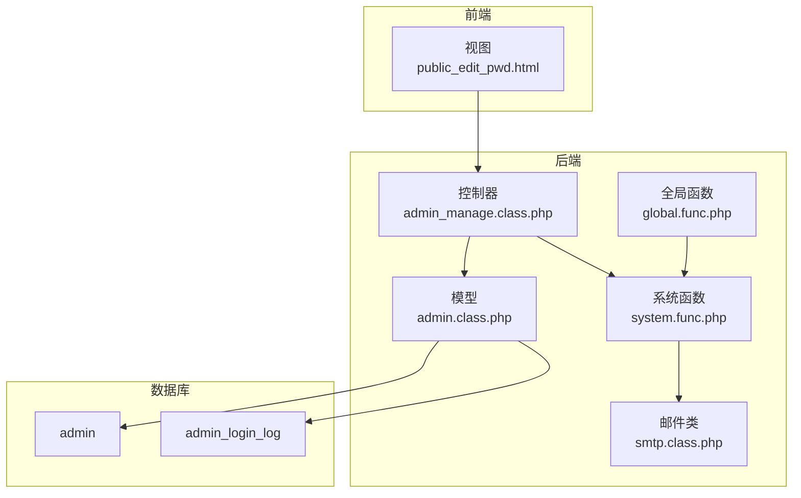
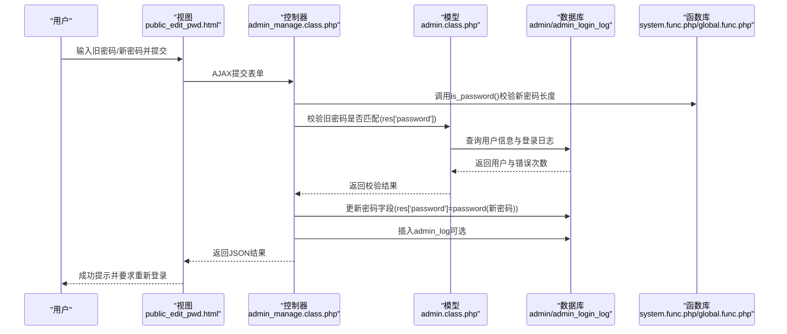
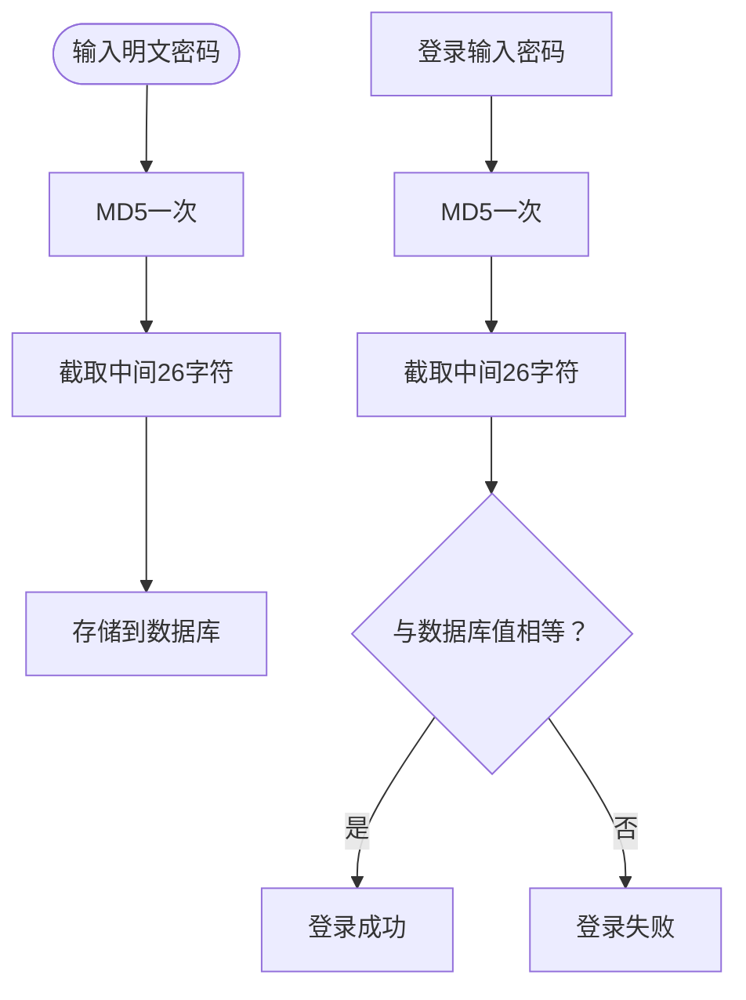
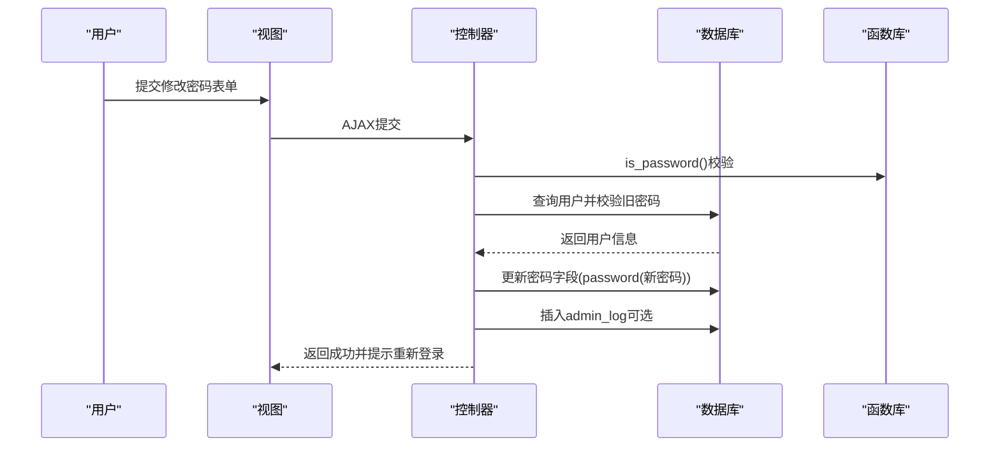
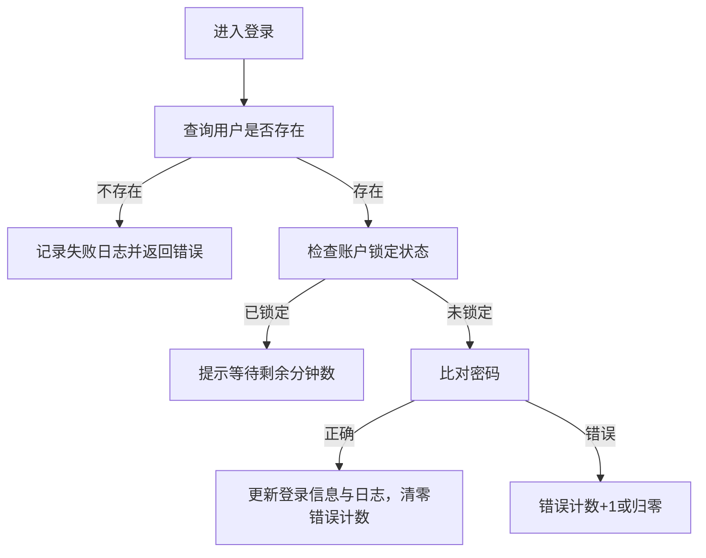
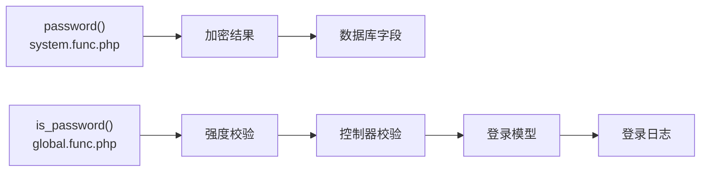

# 密码安全机制

<cite>
**本文引用的文件**
- [index.php](file://index.php)
- [admin_manage.class.php](file://application/lry_admin_center/controller/admin_manage.class.php)
- [admin.class.php](file://application/lry_admin_center/model/admin.class.php)
- [public_edit_pwd.html](file://application/lry_admin_center/view/public_edit_pwd.html)
- [global.func.php](file://ryphp/core/function/global.func.php)
- [system.func.php](file://common/function/system.func.php)
- [smtp.class.php](file://ryphp/core/class/smtp.class.php)
- [system.func.php](file://common/function/system.func.php)
</cite>

## 目录
1. [简介](#简介)
2. [项目结构](#项目结构)
3. [核心组件](#核心组件)
4. [架构总览](#架构总览)
5. [详细组件分析](#详细组件分析)
6. [依赖关系分析](#依赖关系分析)
7. [性能考量](#性能考量)
8. [故障排查指南](#故障排查指南)
9. [结论](#结论)
10. [附录](#附录)

## 简介
本文件面向LRYBlog系统的密码安全机制，基于仓库现有代码进行技术剖析，重点覆盖以下方面：
- 密码加密存储设计与实现现状
- 盐值管理与验证流程
- 密码强度校验规则
- 密码修改与重置流程（含邮件通知）
- 安全配置建议（过期策略、历史记录、强制更新）
- 泄露检测与安全审计能力现状
- 开发者最佳实践与合规性指导

说明：当前仓库中密码加密采用MD5二次截取方案，未使用现代抗暴力破解的密码哈希算法（如bcrypt、argon2、scrypt）。本文在“现状分析”基础上给出“改进建议”，帮助读者在不破坏现有业务的前提下逐步提升密码安全水平。

## 项目结构
围绕密码安全的关键文件分布如下：
- 控制器：负责接收请求、参数校验、触发业务流程
- 模型：负责登录验证、账户锁定策略、登录日志
- 视图：负责前端密码强度提示与提交交互
- 全局函数：提供密码加密、强度校验、通用工具
- 邮件类：提供邮件发送能力（可用于密码重置）

图表来源
- [admin_manage.class.php](file://application/lry_admin_center/controller/admin_manage.class.php#L70-L104)
- [admin.class.php](file://application/lry_admin_center/model/admin.class.php#L4-L95)
- [public_edit_pwd.html](file://application/lry_admin_center/view/public_edit_pwd.html#L14-L110)
- [global.func.php](file://ryphp/core/function/global.func.php#L1003-L1007)
- [system.func.php](file://common/function/system.func.php#L964-L966)
- [smtp.class.php](file://ryphp/core/class/smtp.class.php#L45-L89)

章节来源
- [index.php](file://index.php#L1-L18)
- [admin_manage.class.php](file://application/lry_admin_center/controller/admin_manage.class.php#L1-L105)
- [admin.class.php](file://application/lry_admin_center/model/admin.class.php#L1-L96)
- [public_edit_pwd.html](file://application/lry_admin_center/view/public_edit_pwd.html#L1-L113)
- [global.func.php](file://ryphp/core/function/global.func.php#L1003-L1007)
- [system.func.php](file://common/function/system.func.php#L964-L966)
- [smtp.class.php](file://ryphp/core/class/smtp.class.php#L1-L261)

## 核心组件
- 密码加密函数：对明文密码执行MD5二次截取，形成固定长度摘要
- 密码强度校验：限定长度范围（6-20位）
- 登录模型：负责用户存在性校验、账户锁定策略、登录日志记录
- 密码修改控制器：校验旧密码、验证新密码强度、更新数据库并记录日志
- 前端强度提示：基于字符类型统计计算强度等级
- 邮件发送：封装SMTP发送接口，可用于密码重置邮件

章节来源
- [system.func.php](file://common/function/system.func.php#L964-L966)
- [global.func.php](file://ryphp/core/function/global.func.php#L1003-L1007)
- [admin.class.php](file://application/lry_admin_center/model/admin.class.php#L4-L95)
- [admin_manage.class.php](file://application/lry_admin_center/controller/admin_manage.class.php#L70-L104)
- [public_edit_pwd.html](file://application/lry_admin_center/view/public_edit_pwd.html#L34-L76)
- [smtp.class.php](file://ryphp/core/class/smtp.class.php#L45-L89)

## 架构总览
密码安全相关流程由“前端校验 + 后端校验 + 存储加密 + 登录控制 + 审计日志”构成，整体流程如下：

图表来源
- [admin_manage.class.php](file://application/lry_admin_center/controller/admin_manage.class.php#L70-L104)
- [admin.class.php](file://application/lry_admin_center/model/admin.class.php#L4-L95)
- [system.func.php](file://common/function/system.func.php#L964-L966)
- [global.func.php](file://ryphp/core/function/global.func.php#L1003-L1007)

## 详细组件分析

### 密码加密与存储现状
- 加密函数：对明文密码先做MD5，再取中间26个字符，形成固定长度摘要
- 存储方式：将摘要直接写入数据库字段，未见盐值字段或单独存储
- 验证方式：登录时将输入密码再次经过相同算法并与数据库存储值比较

图表来源
- [system.func.php](file://common/function/system.func.php#L964-L966)

章节来源
- [system.func.php](file://common/function/system.func.php#L964-L966)

### 盐值管理与验证流程
- 现状：未使用独立盐值字段；加密过程未显式加入随机盐
- 影响：相同明文在不同时间点可能得到相同摘要，不利于抵御彩虹表与批量碰撞
- 建议：引入随机盐（每用户唯一），将盐与哈希共同存储；验证时从数据库读取盐参与计算

章节来源
- [system.func.php](file://common/function/system.func.php#L964-L966)

### 密码强度验证规则
- 长度要求：6-20位（is_password）
- 前端强度提示：按字符类型（数字、小写字母、大写字母、其他）统计，分为弱/中/强三级
- 建议增强：增加复杂度要求（必须包含大小写字母、数字、特殊字符至少两类）

章节来源
- [global.func.php](file://ryphp/core/function/global.func.php#L1003-L1007)
- [public_edit_pwd.html](file://application/lry_admin_center/view/public_edit_pwd.html#L34-L76)

### 密码修改流程
- 旧密码校验：通过数据库字段对比
- 新密码校验：长度校验与前后端一致性校验
- 更新与审计：成功后插入admin_log（若启用），并销毁会话与Cookie

图表来源
- [admin_manage.class.php](file://application/lry_admin_center/controller/admin_manage.class.php#L70-L104)
- [system.func.php](file://common/function/system.func.php#L964-L966)
- [global.func.php](file://ryphp/core/function/global.func.php#L1003-L1007)

章节来源
- [admin_manage.class.php](file://application/lry_admin_center/controller/admin_manage.class.php#L70-L104)

### 登录与账户锁定机制
- 用户不存在：记录登录尝试与原因
- 已锁定：根据错误次数映射等待时长（阶梯式锁定）
- 登录成功：清零错误计数并记录成功日志
- 登录失败：错误计数累加（超过阈值归零）

图表来源
- [admin.class.php](file://application/lry_admin_center/model/admin.class.php#L4-L95)

章节来源
- [admin.class.php](file://application/lry_admin_center/model/admin.class.php#L40-L95)

### 邮件通知与密码重置
- 邮件发送：封装SMTP类，支持HTML正文与可选抄送/密送
- 重置流程：当前仓库未发现密码重置控制器或令牌管理逻辑，建议结合邮件发送实现“重置链接+一次性令牌+过期时间”的标准流程

章节来源
- [smtp.class.php](file://ryphp/core/class/smtp.class.php#L45-L89)

## 依赖关系分析
- 密码加密依赖：system.func.php中的password函数
- 强度校验依赖：global.func.php中的is_password函数
- 登录与锁定依赖：admin.class.php中的check_admin与内部私有方法
- 修改流程依赖：admin_manage.class.php中的public_edit_pwd
- 前端交互依赖：public_edit_pwd.html中的JavaScript校验与AJAX提交

图表来源
- [system.func.php](file://common/function/system.func.php#L964-L966)
- [global.func.php](file://ryphp/core/function/global.func.php#L1003-L1007)
- [admin_manage.class.php](file://application/lry_admin_center/controller/admin_manage.class.php#L70-L104)
- [admin.class.php](file://application/lry_admin_center/model/admin.class.php#L4-L95)

章节来源
- [system.func.php](file://common/function/system.func.php#L964-L966)
- [global.func.php](file://ryphp/core/function/global.func.php#L1003-L1007)
- [admin_manage.class.php](file://application/lry_admin_center/controller/admin_manage.class.php#L70-L104)
- [admin.class.php](file://application/lry_admin_center/model/admin.class.php#L4-L95)

## 性能考量
- 密码加密：MD5二次截取计算开销极低，但安全性不足
- 登录锁定：基于错误计数与时间窗口的简单策略，避免暴力破解的同时需注意误伤
- 建议：在高并发场景下，登录尝试日志写入应考虑异步化与限流策略

## 故障排查指南
- 登录失败但账户未锁定：检查用户是否存在、密码是否一致、是否触发错误计数逻辑
- 修改密码失败：确认旧密码是否匹配、新密码长度是否符合要求、是否正确调用password函数
- 登录日志异常：核对admin_login_log表字段与记录逻辑
- 邮件发送失败：检查SMTP配置与网络连通性

章节来源
- [admin.class.php](file://application/lry_admin_center/model/admin.class.php#L29-L95)
- [admin_manage.class.php](file://application/lry_admin_center/controller/admin_manage.class.php#L70-L104)
- [smtp.class.php](file://ryphp/core/class/smtp.class.php#L45-L89)

## 结论
- 现状：采用MD5二次截取的密码存储方式，未使用现代抗暴力破解算法与独立盐值，存在安全风险
- 建议：引入bcrypt/argon2/scrypt等现代哈希算法，结合随机盐与自适应成本参数；完善密码重置流程（令牌+过期+防重放）；加强复杂度与字典攻击防护；建立密码泄露检测与审计机制

## 附录

### 密码安全配置建议（基于现有能力扩展）
- 过期策略：在用户表增加last_change_time字段，结合登录模型在登录成功后判断是否需要强制修改
- 历史记录：新增password_history表，记录最近N条历史密码摘要，禁止重复使用
- 强制更新：对高危操作（如敏感数据变更）强制要求重新验证密码
- 泄露检测：定期对登录日志中的异常IP、频繁尝试进行扫描与告警
- 审计日志：完善admin_log字段，记录操作模块、控制器、行为、IP、UA等

### 现代密码哈希迁移路线（建议）
- 第一步：在用户表新增salt与hash_algorithm字段，保留旧摘要用于兼容过渡
- 第二步：登录时检测hash_algorithm，未达标则在验证通过后重算并更新
- 第三步：逐步淘汰旧算法，统一为bcrypt/argon2/scrypt

### 开发者最佳实践与合规性指导
- 不在日志中记录明文密码或完整输入
- 使用HTTPS传输，避免密码在传输层被窃听
- 严格限制登录尝试频率与锁定策略，避免DDoS放大效应
- 对密码重置流程实施一次性令牌与过期控制
- 定期进行安全评估与渗透测试，持续改进