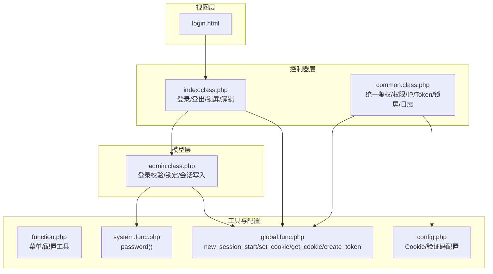
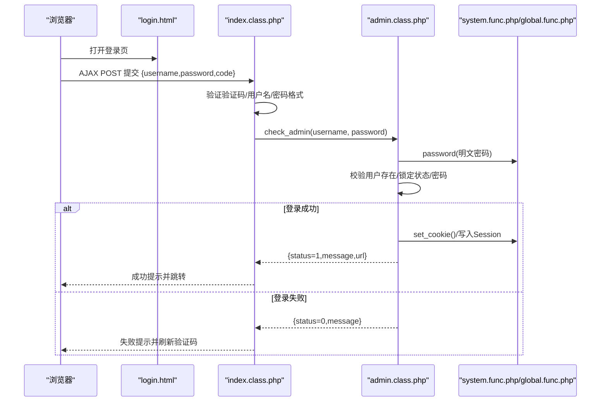
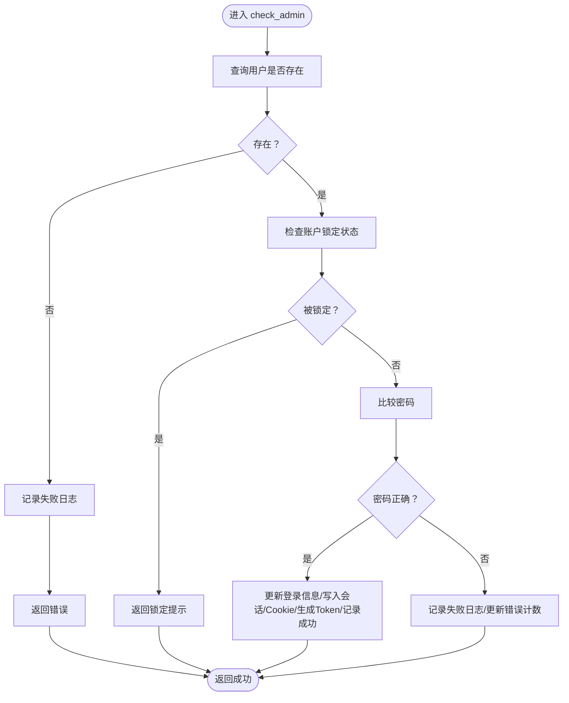
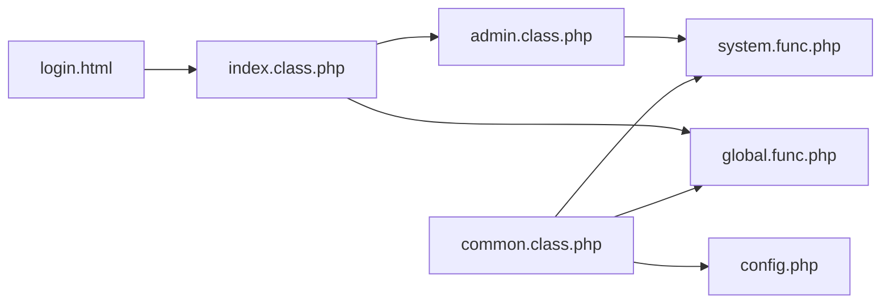
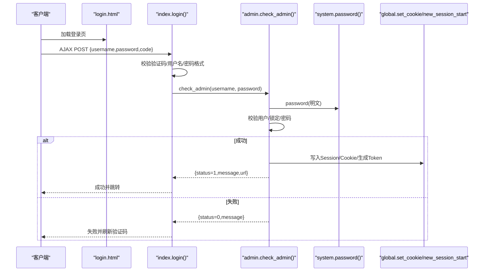

# 管理员认证

<cite>
**本文引用的文件**
- [application/lry_admin_center/view/login.html](file://application/lry_admin_center/view/login.html)
- [application/lry_admin_center/controller/index.class.php](file://application/lry_admin_center/controller/index.class.php)
- [application/lry_admin_center/controller/common.class.php](file://application/lry_admin_center/controller/common.class.php)
- [application/lry_admin_center/model/admin.class.php](file://application/lry_admin_center/model/admin.class.php)
- [application/lry_admin_center/common/function/function.php](file://application/lry_admin_center/common/function/function.php)
- [common/function/system.func.php](file://common/function/system.func.php)
- [common/config/config.php](file://common/config/config.php)
- [ryphp/core/function/global.func.php](file://ryphp/core/function/global.func.php)
</cite>

## 目录
1. [引言](#引言)
2. [项目结构](#项目结构)
3. [核心组件](#核心组件)
4. [架构总览](#架构总览)
5. [详细组件分析](#详细组件分析)
6. [依赖关系分析](#依赖关系分析)
7. [性能考量](#性能考量)
8. [故障排查指南](#故障排查指南)
9. [结论](#结论)
10. [附录](#附录)

## 引言
本文件面向开发者与运维人员，系统性梳理 LRYBlog 后台管理员认证体系，覆盖登录流程设计与实现、会话与 Cookie 管理、权限控制、密码存储与强度校验、登录状态检测与自动登出、暴力破解防护与 IP 限制等关键点，并提供扩展与定制建议。

## 项目结构
后台认证相关的核心文件分布于以下模块：
- 视图层：登录页面模板
- 控制器层：登录入口、登出、锁屏/解锁、公共主页等
- 公共控制器：统一鉴权、权限校验、IP 白黑名单、Token 校验、锁屏检测、管理日志
- 模型层：管理员登录校验、登录日志记录、账户锁定策略
- 工具函数：URL 构造、菜单生成、Cookie/Session 辅助、密码加密、用户名/密码格式校验
- 配置：Cookie/Session/验证码开关等系统配置

**图表来源**
- [application/lry_admin_center/view/login.html](file://application/lry_admin_center/view/login.html#L1-L98)
- [application/lry_admin_center/controller/index.class.php](file://application/lry_admin_center/controller/index.class.php#L1-L162)
- [application/lry_admin_center/controller/common.class.php](file://application/lry_admin_center/controller/common.class.php#L1-L153)
- [application/lry_admin_center/model/admin.class.php](file://application/lry_admin_center/model/admin.class.php#L1-L96)
- [application/lry_admin_center/common/function/function.php](file://application/lry_admin_center/common/function/function.php#L1-L162)
- [common/function/system.func.php](file://common/function/system.func.php#L960-L969)
- [ryphp/core/function/global.func.php](file://ryphp/core/function/global.func.php#L1380-L1731)
- [common/config/config.php](file://common/config/config.php#L1-L88)

**章节来源**
- [application/lry_admin_center/view/login.html](file://application/lry_admin_center/view/login.html#L1-L98)
- [application/lry_admin_center/controller/index.class.php](file://application/lry_admin_center/controller/index.class.php#L1-L162)
- [application/lry_admin_center/controller/common.class.php](file://application/lry_admin_center/controller/common.class.php#L1-L153)
- [application/lry_admin_center/model/admin.class.php](file://application/lry_admin_center/model/admin.class.php#L1-L96)
- [application/lry_admin_center/common/function/function.php](file://application/lry_admin_center/common/function/function.php#L1-L162)
- [common/function/system.func.php](file://common/function/system.func.php#L960-L969)
- [ryphp/core/function/global.func.php](file://ryphp/core/function/global.func.php#L1380-L1731)
- [common/config/config.php](file://common/config/config.php#L1-L88)

## 核心组件
- 登录表单与前端交互：负责用户名、密码、验证码输入与 AJAX 提交，返回状态消息与跳转地址
- 登录控制器：接收 POST 请求，进行验证码、用户名/密码格式校验，调用模型层执行登录
- 管理员模型：执行用户存在性检查、账户锁定判定、密码比对、成功/失败后的会话与日志处理
- 统一鉴权中间件：会话/Cookie 校验、权限矩阵、IP 白黑名单、Token 校验、锁屏拦截、管理日志
- 工具函数：密码加密、Cookie/Session 辅助、URL 构造、菜单生成
- 配置：Cookie 作用域/路径/生命周期、验证码开关等

**章节来源**
- [application/lry_admin_center/view/login.html](file://application/lry_admin_center/view/login.html#L14-L95)
- [application/lry_admin_center/controller/index.class.php](file://application/lry_admin_center/controller/index.class.php#L19-L38)
- [application/lry_admin_center/model/admin.class.php](file://application/lry_admin_center/model/admin.class.php#L4-L95)
- [application/lry_admin_center/controller/common.class.php](file://application/lry_admin_center/controller/common.class.php#L32-L131)
- [common/function/system.func.php](file://common/function/system.func.php#L960-L969)
- [ryphp/core/function/global.func.php](file://ryphp/core/function/global.func.php#L1380-L1731)
- [common/config/config.php](file://common/config/config.php#L82-L86)

## 架构总览
后台认证采用“视图-控制器-模型-工具函数-配置”的分层架构，登录流程通过 AJAX 完成，成功后写入 Session 与 Cookie，并生成一次性 Token；统一鉴权中间件在每个请求进入时执行，确保会话有效性、权限与安全策略。

**图表来源**
- [application/lry_admin_center/view/login.html](file://application/lry_admin_center/view/login.html#L57-L94)
- [application/lry_admin_center/controller/index.class.php](file://application/lry_admin_center/controller/index.class.php#L19-L38)
- [application/lry_admin_center/model/admin.class.php](file://application/lry_admin_center/model/admin.class.php#L4-L95)
- [common/function/system.func.php](file://common/function/system.func.php#L960-L969)
- [ryphp/core/function/global.func.php](file://ryphp/core/function/global.func.php#L1380-L1731)

## 详细组件分析

### 登录表单与前端交互
- 表单字段：用户名、密码、验证码
- 前端校验：用户名/密码/验证码非空校验
- AJAX 提交：序列化表单数据，POST 到登录接口，解析返回 JSON
- 成功回调：提示成功并跳转至后台首页
- 失败回调：提示失败并刷新验证码输入框

**章节来源**
- [application/lry_admin_center/view/login.html](file://application/lry_admin_center/view/login.html#L14-L95)

### 登录控制器（index.class.php）
- 登录入口：接收 POST，校验验证码、用户名/密码格式
- 调用模型：将明文密码经加密函数处理后传递给模型
- 返回结果：成功返回 {status=1,message,url}，失败返回 {status=0,message}

**章节来源**
- [application/lry_admin_center/controller/index.class.php](file://application/lry_admin_center/controller/index.class.php#L19-L38)

### 管理员模型（admin.class.php）
- 用户存在性检查：不存在则记录失败日志并返回错误
- 账户锁定策略：根据错误次数与最近失败时间计算冻结时长
- 密码校验：明文与数据库存储比较（注意：此处为明文比较，详见“安全考量”）
- 成功处理：更新登录信息、写入 Session/Cookie、生成 Token、记录成功日志
- 失败处理：记录失败日志、错误计数累加（超过阈值清零）

**图表来源**
- [application/lry_admin_center/model/admin.class.php](file://application/lry_admin_center/model/admin.class.php#L4-L95)

**章节来源**
- [application/lry_admin_center/model/admin.class.php](file://application/lry_admin_center/model/admin.class.php#L4-L95)

### 统一鉴权中间件（common.class.php）
- 会话/Cookie 校验：未登录或 Cookie 与 Session 不一致则重定向至登录页
- 权限矩阵：超级管理员放行；普通角色按 m/c/a 与 roleid 查询授权表
- IP 白黑名单：支持配置禁止登录的 IP 段，命中即拒绝
- Token 校验：POST 请求需携带与 Session 中一致的 Token
- 锁屏拦截：若处于锁屏状态，仅允许 public_* 或 login 动作
- 管理日志：按配置记录后台操作日志

**章节来源**
- [application/lry_admin_center/controller/common.class.php](file://application/lry_admin_center/controller/common.class.php#L32-L131)

### 工具函数与配置
- 密码加密：对明文做二次 MD5 截取处理
- Cookie/Session：封装 set_cookie/get_cookie/del_cookie/new_session_start/create_token/check_token
- URL 构造：支持多种 URL 模式拼接
- 菜单生成：基于角色动态生成菜单
- 配置：Cookie 作用域/路径/生命周期、验证码开关等

**章节来源**
- [common/function/system.func.php](file://common/function/system.func.php#L960-L969)
- [ryphp/core/function/global.func.php](file://ryphp/core/function/global.func.php#L1380-L1731)
- [application/lry_admin_center/common/function/function.php](file://application/lry_admin_center/common/function/function.php#L3-L80)
- [common/config/config.php](file://common/config/config.php#L31-L86)

## 依赖关系分析
- 登录流程依赖：view → controller → model → utils
- 鉴权依赖：common 控制器贯穿所有后台动作，依赖 utils 与配置
- 密码依赖：加密函数 password() 由 system.func.php 提供
- 会话依赖：new_session_start()、set_cookie()/get_cookie() 由 global.func.php 提供

**图表来源**
- [application/lry_admin_center/view/login.html](file://application/lry_admin_center/view/login.html#L1-L98)
- [application/lry_admin_center/controller/index.class.php](file://application/lry_admin_center/controller/index.class.php#L1-L162)
- [application/lry_admin_center/controller/common.class.php](file://application/lry_admin_center/controller/common.class.php#L1-L153)
- [application/lry_admin_center/model/admin.class.php](file://application/lry_admin_center/model/admin.class.php#L1-L96)
- [common/function/system.func.php](file://common/function/system.func.php#L960-L969)
- [ryphp/core/function/global.func.php](file://ryphp/core/function/global.func.php#L1380-L1731)
- [common/config/config.php](file://common/config/config.php#L1-L88)

**章节来源**
- [application/lry_admin_center/view/login.html](file://application/lry_admin_center/view/login.html#L1-L98)
- [application/lry_admin_center/controller/index.class.php](file://application/lry_admin_center/controller/index.class.php#L1-L162)
- [application/lry_admin_center/controller/common.class.php](file://application/lry_admin_center/controller/common.class.php#L1-L153)
- [application/lry_admin_center/model/admin.class.php](file://application/lry_admin_center/model/admin.class.php#L1-L96)
- [common/function/system.func.php](file://common/function/system.func.php#L960-L969)
- [ryphp/core/function/global.func.php](file://ryphp/core/function/global.func.php#L1380-L1731)
- [common/config/config.php](file://common/config/config.php#L1-L88)

## 性能考量
- 登录日志写入：每次登录均写入日志表，建议结合索引与归档策略降低写放大
- 菜单缓存：菜单生成结果按角色缓存，避免重复查询
- Cookie/Session：合理设置 Cookie 生命周期与 HttpOnly，平衡安全与性能
- 验证码：开启验证码可降低暴力破解风险，但需考虑生成成本与用户体验

[本节为通用建议，无需特定文件引用]

## 故障排查指南
- 登录失败无提示：检查控制器返回 JSON 的 message 字段与前端提示逻辑
- 验证码错误：确认验证码生成与校验流程，检查 Session 中验证码值
- 超级管理员无法访问：核对 common 控制器权限矩阵与角色 ID
- IP 被限制：检查配置中的禁止登录 IP 列表
- Token 校验失败：确认 POST 请求携带与 Session 一致的 Token
- 登录后仍被重定向：检查 Cookie 与 Session 的一致性以及 new_session_start() 初始化

**章节来源**
- [application/lry_admin_center/controller/index.class.php](file://application/lry_admin_center/controller/index.class.php#L19-L38)
- [application/lry_admin_center/controller/common.class.php](file://application/lry_admin_center/controller/common.class.php#L32-L131)
- [common/config/config.php](file://common/config/config.php#L82-L86)
- [ryphp/core/function/global.func.php](file://ryphp/core/function/global.func.php#L1693-L1731)

## 结论
该认证体系通过“表单校验-控制器-模型-中间件-工具函数-配置”的协同，实现了基本的登录、会话、权限与安全控制。建议在生产环境进一步强化密码存储与传输安全、完善会话超时与自动登出策略，并结合审计与监控持续优化安全与性能。

[本节为总结性内容，无需特定文件引用]

## 附录

### 登录流程时序图（代码级）

**图表来源**
- [application/lry_admin_center/view/login.html](file://application/lry_admin_center/view/login.html#L57-L94)
- [application/lry_admin_center/controller/index.class.php](file://application/lry_admin_center/controller/index.class.php#L19-L38)
- [application/lry_admin_center/model/admin.class.php](file://application/lry_admin_center/model/admin.class.php#L4-L95)
- [common/function/system.func.php](file://common/function/system.func.php#L960-L969)
- [ryphp/core/function/global.func.php](file://ryphp/core/function/global.func.php#L1380-L1731)

### 登录状态检测与自动登出
- 登录状态检测：统一鉴权中间件在构造函数中执行，检查 Cookie 与 Session 一致性，不一致则重定向登录
- 自动登出：登出接口清理 Session 与 Cookie，并提示安全退出
- 锁屏/解锁：支持锁屏状态下的最小化权限访问，解锁需再次凭密码验证

**章节来源**
- [application/lry_admin_center/controller/common.class.php](file://application/lry_admin_center/controller/common.class.php#L32-L49)
- [application/lry_admin_center/controller/index.class.php](file://application/lry_admin_center/controller/index.class.php#L56-L84)

### 权限体系与访问控制
- 角色定义：admin 表含 roleid 字段
- 权限分配：通过 m/c/a 与 roleid 的授权表进行细粒度控制
- 访问控制：超级管理员放行；普通角色按授权表校验；public_* 方法与登录动作放行

**章节来源**
- [application/lry_admin_center/controller/common.class.php](file://application/lry_admin_center/controller/common.class.php#L56-L62)
- [application/lry_admin_center/common/function/function.php](file://application/lry_admin_center/common/function/function.php#L35-L52)

### 密码存储与强度校验
- 存储安全：密码经 password() 处理后存储；当前模型层直接比较明文与存储值，存在安全风险
- 强度校验：用户名长度与字符规范、密码长度范围校验
- 建议：采用现代哈希算法（如 bcrypt/Argon2）与盐值，避免明文比较

**章节来源**
- [application/lry_admin_center/model/admin.class.php](file://application/lry_admin_center/model/admin.class.php#L21-L26)
- [common/function/system.func.php](file://common/function/system.func.php#L960-L969)
- [ryphp/core/function/global.func.php](file://ryphp/core/function/global.func.php#L970-L1007)

### 暴力破解防护与 IP 限制
- 验证码：登录页集成验证码，降低自动化尝试概率
- 账户锁定：根据错误次数与最近失败时间计算冻结时长
- IP 限制：支持配置禁止登录的 IP 段，命中即拒绝访问

**章节来源**
- [application/lry_admin_center/view/login.html](file://application/lry_admin_center/view/login.html#L24-L28)
- [application/lry_admin_center/model/admin.class.php](file://application/lry_admin_center/model/admin.class.php#L40-L65)
- [application/lry_admin_center/controller/common.class.php](file://application/lry_admin_center/controller/common.class.php#L86-L93)

### 扩展与定制建议
- 密码策略：引入更强的哈希算法与随机盐值，替换现有 password() 实现
- 会话安全：启用 HTTPS、HttpOnly、SameSite Cookie，设置更短的会话超时
- 登录审计：增加登录失败原因枚举与日志分级，便于追踪
- 多因子认证：在高安全场景引入短信/令牌等二次验证
- 权限模型：细化到字段级权限与资源授权，配合 RBAC/ABAC

[本节为通用建议，无需特定文件引用]