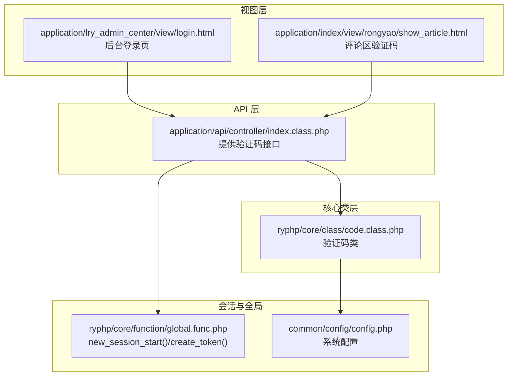
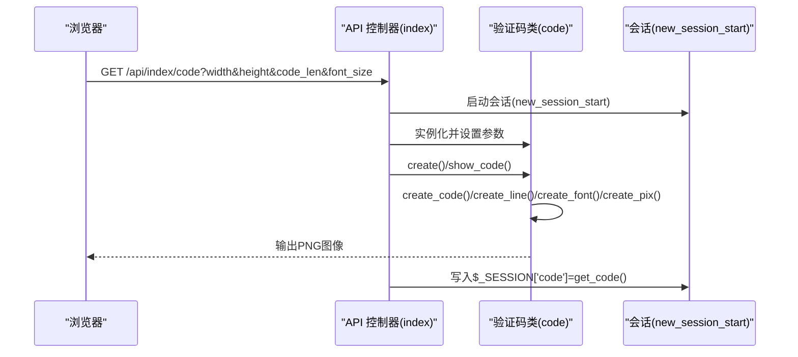
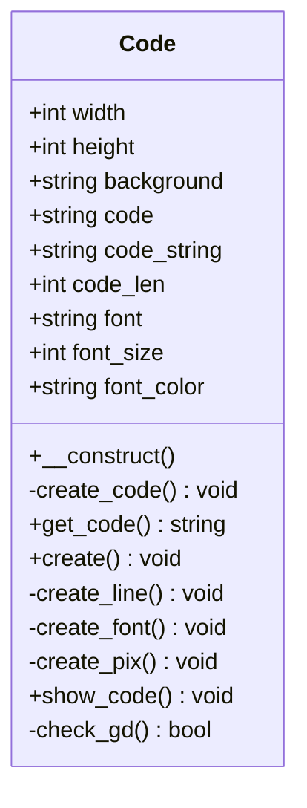
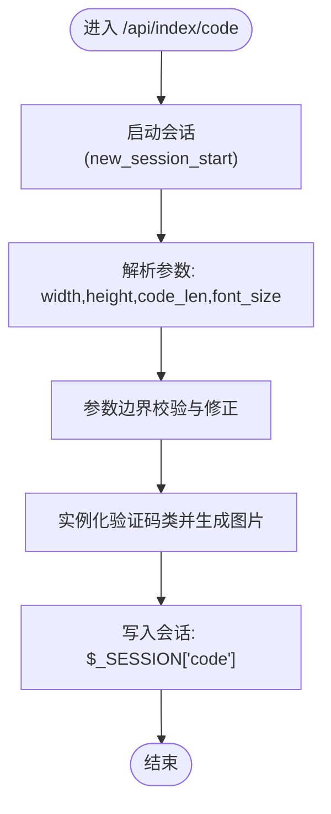
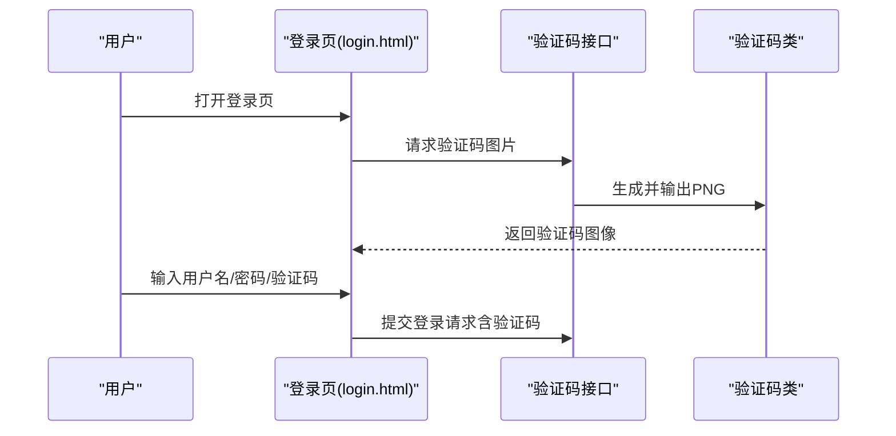
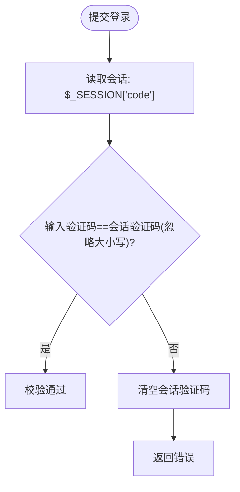
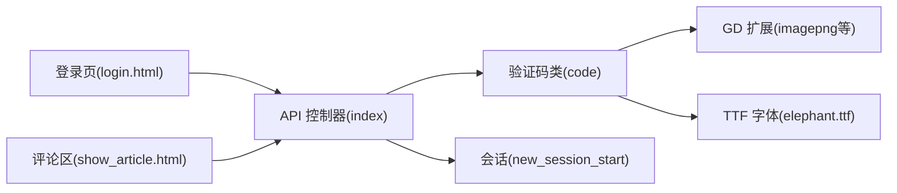

# 验证码系统

<cite>
**本文引用的文件**
- [code.class.php](file://ryphp/core/class/code.class.php)
- [index.class.php](file://application/api/controller/index.class.php)
- [login.html](file://application/lry_admin_center/view/login.html)
- [global.func.php](file://ryphp/core/function/global.func.php)
- [config.php](file://common/config/config.php)
- [show_article.html](file://application/index/view/rongyao/show_article.html)
- [admin.class.php](file://application/lry_admin_center/model/admin.class.php)
</cite>

## 目录
1. [简介](#简介)
2. [项目结构](#项目结构)
3. [核心组件](#核心组件)
4. [架构总览](#架构总览)
5. [详细组件分析](#详细组件分析)
6. [依赖关系分析](#依赖关系分析)
7. [性能考量](#性能考量)
8. [故障排查指南](#故障排查指南)
9. [结论](#结论)
10. [附录](#附录)

## 简介
本文件面向开发者与运维人员，系统性梳理 LRYBlog 的验证码系统，覆盖验证码类的设计架构、GD 库使用、图形生成算法与图像处理技术；详述从随机字符生成到图像绘制的完整流程；阐述安全机制（字符集、干扰元素、抗机器识别）；说明配置项（尺寸、字体、颜色、长度）；解释会话管理（存储、生命周期、安全）；给出 API 使用示例与最佳实践；并提供 GD 环境检测与错误处理机制说明及定制扩展指导。

## 项目结构
验证码系统由三层组成：
- API 层：对外提供验证码图片接口，负责参数校验与会话写入
- 核心类层：封装验证码生成逻辑与图像绘制
- 视图层：前端页面通过接口获取验证码图片，并在登录等场景进行校验

图表来源
- [index.class.php](file://application/api/controller/index.class.php#L5-L17)
- [code.class.php](file://ryphp/core/class/code.class.php#L10-L175)
- [login.html](file://application/lry_admin_center/view/login.html#L24-L28)
- [show_article.html](file://application/index/view/rongyao/show_article.html#L253-L300)
- [global.func.php](file://ryphp/core/function/global.func.php#L1693-L1731)
- [config.php](file://common/config/config.php#L82-L87)

章节来源
- [index.class.php](file://application/api/controller/index.class.php#L5-L17)
- [code.class.php](file://ryphp/core/class/code.class.php#L10-L175)
- [login.html](file://application/lry_admin_center/view/login.html#L24-L28)
- [show_article.html](file://application/index/view/rongyao/show_article.html#L253-L300)
- [global.func.php](file://ryphp/core/function/global.func.php#L1693-L1731)
- [config.php](file://common/config/config.php#L82-L87)

## 核心组件
- 验证码类（code）：负责生成随机验证码字符串、构建画布、绘制网格线、写字体、添加像素点与弧线、输出 PNG 图像、GD 环境检测
- API 控制器（index）：接收请求参数（宽、高、长度、字号），调用验证码类生成图片并写入会话
- 视图模板：在登录页与评论区通过接口渲染验证码图片
- 会话工具：统一的会话启动与 Token 管理，保障验证码校验的会话一致性

章节来源
- [code.class.php](file://ryphp/core/class/code.class.php#L10-L175)
- [index.class.php](file://application/api/controller/index.class.php#L5-L17)
- [login.html](file://application/lry_admin_center/view/login.html#L24-L28)
- [show_article.html](file://application/index/view/rongyao/show_article.html#L253-L300)
- [global.func.php](file://ryphp/core/function/global.func.php#L1693-L1731)

## 架构总览
验证码生成与校验的端到端流程如下：

图表来源
- [index.class.php](file://application/api/controller/index.class.php#L5-L17)
- [code.class.php](file://ryphp/core/class/code.class.php#L76-L165)
- [global.func.php](file://ryphp/core/function/global.func.php#L1693-L1707)

章节来源
- [index.class.php](file://application/api/controller/index.class.php#L5-L17)
- [code.class.php](file://ryphp/core/class/code.class.php#L76-L165)
- [global.func.php](file://ryphp/core/function/global.func.php#L1693-L1707)

## 详细组件分析

### 验证码类（code）
- 设计要点
  - 面向对象封装：构造函数初始化字体路径与 GD 环境检测；提供公开方法生成与输出验证码
  - 可配置参数：宽、高、背景色、字符集、长度、字体、字号、字体颜色
  - 绘图流程：创建真彩画布 → 填充背景 → 绘制网格线 → 写入验证码字符（带随机倾斜与位置偏移）→ 添加噪点与曲线 → 输出 PNG
- 关键方法与职责
  - 构造函数：校验字体文件存在性与 GD 扩展可用性
  - create_code：按长度与字符集生成随机字符串
  - create/create_line/create_font/create_pix：绘制网格、字符、噪点与弧线
  - show_code：设置响应头并输出 PNG，销毁图像资源
  - check_gd：检测 GD 与 imagepng 函数可用性
- 安全与抗识别
  - 字符集剔除易混淆字符，降低 OCR 成功率
  - 字符随机倾斜角度与随机纵坐标，增加识别难度
  - 添加网格线、像素点、随机线段与弧线作为干扰
- 性能与资源
  - 使用真彩画布与 PNG 输出；绘图后立即销毁资源，避免内存泄漏

图表来源
- [code.class.php](file://ryphp/core/class/code.class.php#L10-L175)

章节来源
- [code.class.php](file://ryphp/core/class/code.class.php#L10-L175)

### API 接口（application/api/controller/index.class.php）
- 功能概述
  - 接收宽、高、长度、字号等参数，进行边界校验与赋值
  - 调用验证码类生成图片并输出
  - 将生成的验证码字符串写入会话，供后续校验使用
- 参数与约束
  - 宽度范围：10~500，默认100
  - 高度范围：10~300，默认35
  - 长度范围：2~8，默认4
  - 字号范围：建议与尺寸匹配，避免过大导致字符重叠
- 会话管理
  - 在接口入口显式启动会话，保证验证码与校验在同一会话上下文中

图表来源
- [index.class.php](file://application/api/controller/index.class.php#L5-L17)
- [global.func.php](file://ryphp/core/function/global.func.php#L1693-L1707)

章节来源
- [index.class.php](file://application/api/controller/index.class.php#L5-L17)
- [global.func.php](file://ryphp/core/function/global.func.php#L1693-L1707)

### 视图集成（后台登录页与评论区）
- 登录页
  - 通过接口渲染验证码图片，点击图片刷新验证码
  - 提交表单时携带用户输入的验证码
- 评论区
  - 在文章详情页的评论区域同样集成验证码，提升反垃圾评论能力

图表来源
- [login.html](file://application/lry_admin_center/view/login.html#L24-L28)
- [index.class.php](file://application/api/controller/index.class.php#L5-L17)
- [code.class.php](file://ryphp/core/class/code.class.php#L158-L165)

章节来源
- [login.html](file://application/lry_admin_center/view/login.html#L24-L28)
- [show_article.html](file://application/index/view/rongyao/show_article.html#L253-L300)
- [index.class.php](file://application/api/controller/index.class.php#L5-L17)
- [code.class.php](file://ryphp/core/class/code.class.php#L158-L165)

### 校验流程（后台登录）
- 登录控制器在提交时读取会话中的验证码并与用户输入比对，忽略大小写
- 若不一致则清空会话中的验证码并返回错误信息

图表来源
- [index.class.php](file://application/lry_admin_center/controller/index.class.php#L20-L22)

章节来源
- [index.class.php](file://application/lry_admin_center/controller/index.class.php#L20-L22)

## 依赖关系分析
- 外部依赖
  - GD 扩展：用于图像生成与输出
  - TTF 字体：用于高质量文字渲染
- 内部依赖
  - API 控制器依赖验证码类
  - 验证码类依赖会话（通过 API 控制器启动）
  - 视图模板依赖 API 接口

图表来源
- [index.class.php](file://application/api/controller/index.class.php#L5-L17)
- [code.class.php](file://ryphp/core/class/code.class.php#L46-L50)
- [login.html](file://application/lry_admin_center/view/login.html#L24-L28)
- [show_article.html](file://application/index/view/rongyao/show_article.html#L253-L300)

章节来源
- [index.class.php](file://application/api/controller/index.class.php#L5-L17)
- [code.class.php](file://ryphp/core/class/code.class.php#L46-L50)
- [login.html](file://application/lry_admin_center/view/login.html#L24-L28)
- [show_article.html](file://application/index/view/rongyao/show_article.html#L253-L300)

## 性能考量
- 绘图复杂度
  - 网格线数量与像素点数量为常数级，整体复杂度 O(n)，n 为验证码长度
- 资源管理
  - 绘制完成后立即销毁图像资源，避免内存泄漏
- 输出优化
  - 使用 PNG 输出，清晰度高；若对体积敏感可考虑调整为 JPEG 并降低质量，但会牺牲清晰度
- 并发与缓存
  - 当前实现为即时生成，无服务端缓存；高并发场景可引入缓存层或限制生成频率

[本节为通用性能讨论，无需列出具体文件来源]

## 故障排查指南
- GD 扩展未启用
  - 现象：构造函数直接报错并终止
  - 处理：启用 GD 扩展并确保 imagepng 可用
- 字体文件缺失
  - 现象：构造函数提示字体文件不存在
  - 处理：确认字体路径正确且文件存在
- 会话无法启动
  - 现象：验证码接口无法写入会话
  - 处理：确保在接口入口调用会话启动函数
- 验证码不显示或乱码
  - 现象：浏览器显示空白或乱码
  - 处理：检查接口输出头、字体文件权限、GD 扩展版本兼容性
- 校验失败
  - 现象：登录或评论提交时报验证码错误
  - 处理：确认会话一致、忽略大小写比较、检查网络请求是否携带最新验证码

章节来源
- [code.class.php](file://ryphp/core/class/code.class.php#L46-L50)
- [code.class.php](file://ryphp/core/class/code.class.php#L171-L173)
- [index.class.php](file://application/api/controller/index.class.php#L5-L17)
- [global.func.php](file://ryphp/core/function/global.func.php#L1693-L1707)

## 结论
该验证码系统以简洁的类设计与 GD 图像处理实现了高可读性与可维护性。通过字符集筛选、随机倾斜与多重干扰元素，有效提升了抗机器识别能力。配合统一的会话管理与前端集成，满足后台登录与前台评论等典型场景的安全需求。建议在高并发场景引入缓存与限流策略，并持续关注字体与 GD 版本的兼容性。

[本节为总结性内容，无需列出具体文件来源]

## 附录

### 配置选项一览
- 尺寸设置
  - 宽度：10~500，默认100
  - 高度：10~300，默认35
- 字体与颜色
  - 字体：elephant.ttf（需存在）
  - 字体颜色：可选，未指定时随机分配
  - 背景色：十六进制，默认白色
- 长度控制
  - 验证码长度：2~8，默认4
- 字号
  - 字号：建议与尺寸匹配，避免字符重叠

章节来源
- [index.class.php](file://application/api/controller/index.class.php#L8-L14)
- [code.class.php](file://ryphp/core/class/code.class.php#L15-L40)

### API 使用示例与最佳实践
- 获取验证码图片
  - URL：/api/index/code?width=&height=&code_len=&font_size=
  - 注意：参数超出范围将被修正至默认值
- 前端使用
  - 登录页与评论区通过 img 标签加载接口，点击刷新验证码
  - 提交表单时携带用户输入的验证码
- 最佳实践
  - 严格忽略大小写进行校验
  - 在高并发场景限制刷新频率
  - 对验证码进行会话绑定，避免跨会话复用
  - 建议结合 Token 机制进一步强化防护

章节来源
- [login.html](file://application/lry_admin_center/view/login.html#L24-L28)
- [show_article.html](file://application/index/view/rongyao/show_article.html#L253-L300)
- [index.class.php](file://application/api/controller/index.class.php#L5-L17)
- [global.func.php](file://ryphp/core/function/global.func.php#L1715-L1731)

### 定制与扩展指导
- 自定义字符集
  - 修改字符集字符串以适应业务需求（如加入更多数字或字母）
- 自定义字体
  - 替换 elephant.ttf 或在构造函数中指向新字体路径
- 自定义干扰元素
  - 在绘图流程中增加更多几何图形或噪声
- 输出格式
  - 可在输出阶段调整为 JPEG 并设置质量，权衡清晰度与体积
- 安全加固
  - 引入 Token 校验、IP 限制、失败次数阈值与临时封禁策略

章节来源
- [code.class.php](file://ryphp/core/class/code.class.php#L27-L40)
- [code.class.php](file://ryphp/core/class/code.class.php#L118-L154)
- [global.func.php](file://ryphp/core/function/global.func.php#L1715-L1731)
- [admin.class.php](file://application/lry_admin_center/model/admin.class.php#L40-L65)