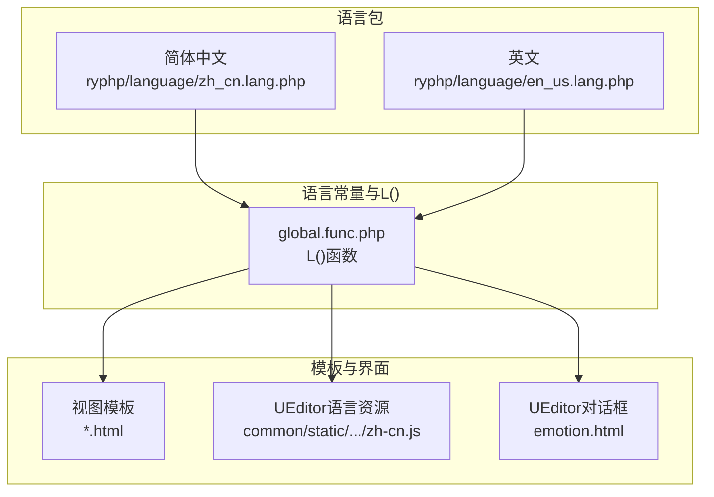
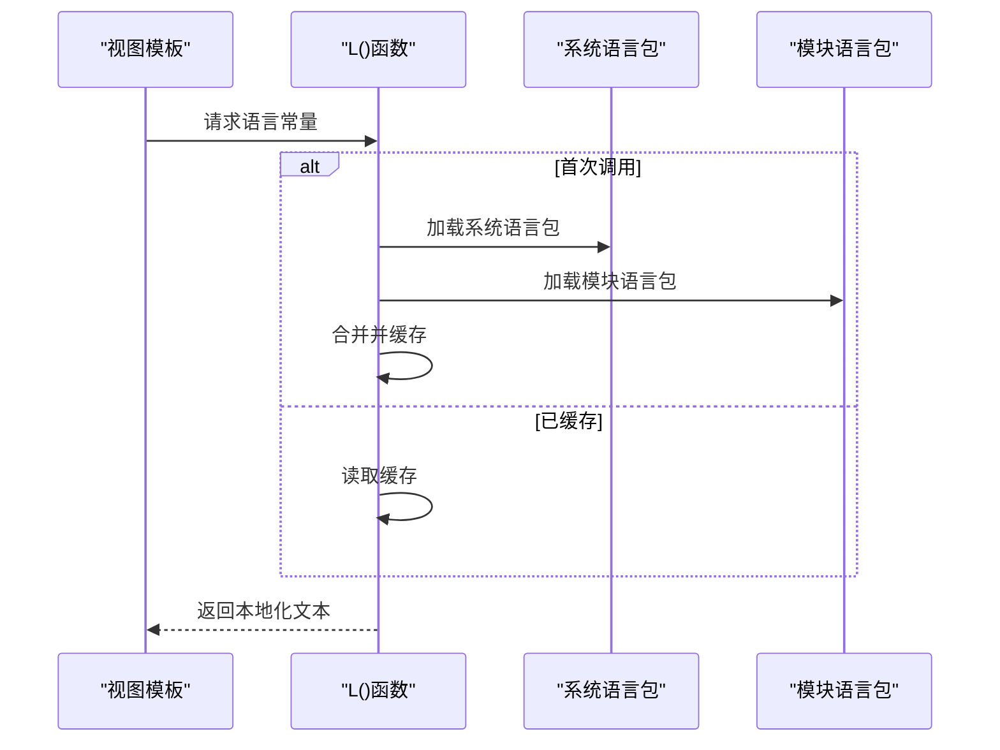
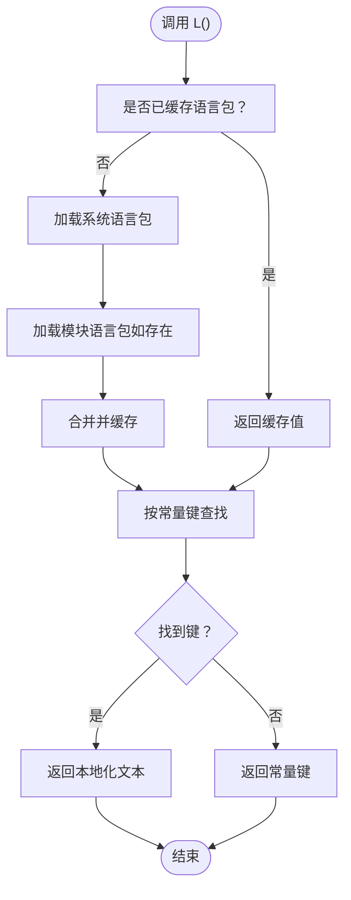
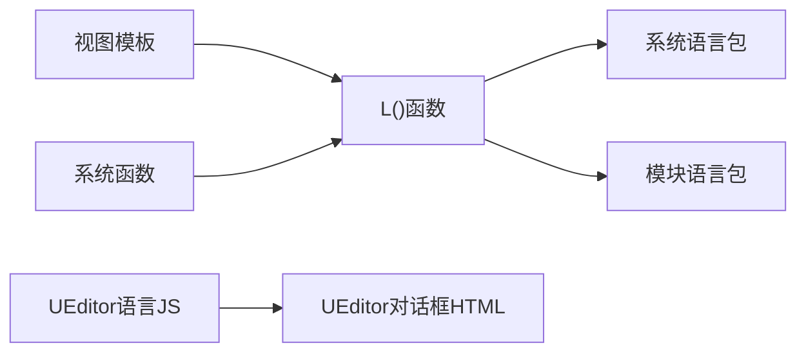

# 国际化支持

<cite>
**本文引用的文件**
- [ryphp/language/zh_cn.lang.php](file://ryphp/language/zh_cn.lang.php)
- [ryphp/language/en_us.lang.php](file://ryphp/language/en_us.lang.php)
- [ryphp/core/function/global.func.php](file://ryphp/core/function/global.func.php)
- [common/function/system.func.php](file://common/function/system.func.php)
- [application/lry_admin_center/view/header.html](file://application/lry_admin_center/view/header.html)
- [application/lry_admin_center/view/category_list.html](file://application/lry_admin_center/view/category_list.html)
- [application/index/view/rongyao/config.php](file://application/index/view/rongyao/config.php)
- [common/static/plugin/ueditor/dialogs/emotion/emotion.html](file://common/static/plugin/ueditor/dialogs/emotion/emotion.html)
- [common/static/plugin/ueditor/lang/zh-cn/zh-cn.js](file://common/static/plugin/ueditor/lang/zh-cn/zh-cn.js)
</cite>

## 目录
1. [引言](#引言)
2. [项目结构](#项目结构)
3. [核心组件](#核心组件)
4. [架构总览](#架构总览)
5. [详细组件分析](#详细组件分析)
6. [依赖关系分析](#依赖关系分析)
7. [性能考量](#性能考量)
8. [故障排查指南](#故障排查指南)
9. [结论](#结论)
10. [附录](#附录)

## 引言
本指南面向LRYBlog的国际化（i18n）能力，系统性阐述多语言文件组织、语言常量与L()函数使用、模板与界面文本处理、日期/时间/数字本地化、RTL语言支持、翻译工作流、语言切换与用户体验优化，以及多语言内容管理的最佳实践与常见问题。

## 项目结构
LRYBlog的国际化主要由三部分构成：
- 语言包：位于系统语言目录，按语言文件组织，键值对形式存储可翻译文本。
- 语言常量与L()函数：全局函数负责加载系统与模块语言包，提供统一的语言常量解析入口。
- 模板与界面：在视图层通过L()函数输出本地化文本；部分富文本编辑器也内置了语言资源。

**图表来源**
- [ryphp/language/zh_cn.lang.php](file://ryphp/language/zh_cn.lang.php#L1-L52)
- [ryphp/language/en_us.lang.php](file://ryphp/language/en_us.lang.php#L1-L52)
- [ryphp/core/function/global.func.php](file://ryphp/core/function/global.func.php#L335-L354)
- [common/static/plugin/ueditor/lang/zh-cn/zh-cn.js](file://common/static/plugin/ueditor/lang/zh-cn/zh-cn.js#L484-L669)
- [common/static/plugin/ueditor/dialogs/emotion/emotion.html](file://common/static/plugin/ueditor/dialogs/emotion/emotion.html#L1-L37)

**章节来源**
- [ryphp/language/zh_cn.lang.php](file://ryphp/language/zh_cn.lang.php#L1-L52)
- [ryphp/language/en_us.lang.php](file://ryphp/language/en_us.lang.php#L1-L52)
- [ryphp/core/function/global.func.php](file://ryphp/core/function/global.func.php#L335-L354)

## 核心组件
- 语言包文件：采用PHP返回数组的形式，键为语言常量标识，值为对应语言的文本。
- L()函数：负责加载系统语言包与模块语言包，合并后按常量键返回对应文本；若未找到，则回退为常量本身。
- 视图模板：在HTML中通过L()函数输出本地化文本。
- 富文本编辑器语言资源：UEditor提供语言包与对话框模板，内部通过var标签与语言键进行替换。

**章节来源**
- [ryphp/language/zh_cn.lang.php](file://ryphp/language/zh_cn.lang.php#L5-L52)
- [ryphp/language/en_us.lang.php](file://ryphp/language/en_us.lang.php#L5-L52)
- [ryphp/core/function/global.func.php](file://ryphp/core/function/global.func.php#L335-L354)
- [common/static/plugin/ueditor/lang/zh-cn/zh-cn.js](file://common/static/plugin/ueditor/lang/zh-cn/zh-cn.js#L484-L669)
- [common/static/plugin/ueditor/dialogs/emotion/emotion.html](file://common/static/plugin/ueditor/dialogs/emotion/emotion.html#L13-L20)

## 架构总览
L()函数在首次调用时加载系统语言包与当前模块语言包，合并后缓存于静态数组中，后续调用直接从缓存取值。模板与编辑器通过L()函数或语言资源键实现本地化输出。

**图表来源**
- [ryphp/core/function/global.func.php](file://ryphp/core/function/global.func.php#L335-L354)

## 详细组件分析

### 语言包组织与命名规范
- 目录位置：系统语言包位于系统语言目录，模块语言包建议放置在模块common/language目录下。
- 文件命名：语言包文件名为语言标识+.lang.php，例如zh_cn.lang.php、en_us.lang.php。
- 文件格式：返回键值对数组，键为语言常量标识，值为对应语言文本。
- 建议规范：
  - 常量键采用语义化命名，避免重复与歧义。
  - 文本尽量简洁，避免内嵌HTML；复杂文案建议在模板中拼接。
  - 保持键集合一致，便于翻译追踪与完整性校验。

**章节来源**
- [ryphp/language/zh_cn.lang.php](file://ryphp/language/zh_cn.lang.php#L1-L52)
- [ryphp/language/en_us.lang.php](file://ryphp/language/en_us.lang.php#L1-L52)

### L()函数：语言常量定义与使用
- 功能要点：
  - 读取配置语言标识，加载系统语言包。
  - 若存在模块语言包，加载并合并至系统语言包。
  - 缓存合并后的语言数组，提升后续访问性能。
  - 未命中时回退为常量本身，便于开发调试。
- 使用技巧：
  - 在模板中直接调用L('常量名')输出本地化文本。
  - 可传入模块参数覆盖默认模块，实现跨模块复用。
  - 动态语言替换：在运行时根据用户偏好或站点配置切换语言标识，重新加载语言包即可生效。

**图表来源**
- [ryphp/core/function/global.func.php](file://ryphp/core/function/global.func.php#L335-L354)

**章节来源**
- [ryphp/core/function/global.func.php](file://ryphp/core/function/global.func.php#L335-L354)

### 界面文本国际化：模板与动态内容
- 模板中的语言标签使用：
  - 在HTML模板中通过L('常量名')输出本地化文本，确保常量键在语言包中存在。
  - 对于动态内容（如导航位置、站点名称等），可在函数中调用L()，再在模板中输出。
- 示例参考：
  - 导航位置：在函数中调用L()输出“首页”等文案，模板中直接输出。
  - 站点配置：在函数中组合站点名称与分隔符，使用L()输出后缀文案。

**章节来源**
- [common/function/system.func.php](file://common/function/system.func.php#L701-L719)

### 日期、时间和数字格式的本地化
- 时区设置：建议在系统配置中统一设置时区，保证时间显示一致性。
- 格式化规则：
  - 日期/时间：在需要展示的函数中进行格式化，避免在模板中硬编码格式。
  - 数字：对于货币、百分比等，建议在输出前进行格式化处理，必要时结合语言环境进行千分位等处理。
- 实践建议：
  - 将格式化逻辑集中在函数层，模板仅负责展示，便于国际化时调整格式策略。

**章节来源**
- [common/function/system.func.php](file://common/function/system.func.php#L46-L57)

### RTL（从右到左）语言支持与CSS适配
- 结构适配：
  - 为RTL语言准备独立的CSS文件或在现有样式中增加方向切换类。
  - 使用方向相关的CSS属性（如text-align、margin/padding的start/end）替代左右定向属性。
- 模板适配：
  - 在页面根元素上设置dir="rtl"，并配合CSS类进行整体布局反转。
  - 图标与箭头方向需同步调整，确保视觉一致性。
- 与L()函数协作：
  - 通过L()函数输出的文案应支持从右到左排版，避免固定宽度与固定对齐导致的截断问题。

[本节为通用指导，无需特定文件引用]

### 翻译工作流程：任务分配、维护与版本更新
- 任务分配：
  - 明确翻译负责人与审校人员，建立分工与进度跟踪机制。
  - 将语言包按模块拆分，便于多人并行处理。
- 翻译维护：
  - 保持常量键集合一致，新增键需同步到所有语言包。
  - 建立术语库，统一专业词汇翻译。
- 版本更新：
  - 在版本发布前进行语言包完整性检查与回归测试。
  - 通过版本控制系统记录语言包变更，便于回滚与对比。

[本节为通用指导，无需特定文件引用]

### 语言切换的前端实现与用户体验优化
- 前端实现：
  - 在后台头部或侧边栏提供语言切换菜单，点击后通过AJAX或表单提交更新用户偏好。
  - 更新偏好后刷新页面或局部刷新，使L()函数加载新的语言包。
- 用户体验优化：
  - 记住用户上次选择的语言，自动应用到新访问的页面。
  - 提供即时预览与快速切换，减少切换成本。
  - 对于复杂页面，采用渐进式加载与骨架屏，降低切换时的感知延迟。

**章节来源**
- [application/lry_admin_center/view/header.html](file://application/lry_admin_center/view/header.html#L1-L51)
- [application/lry_admin_center/view/category_list.html](file://application/lry_admin_center/view/category_list.html#L48-L81)

### 多语言内容管理最佳实践与常见问题
- 最佳实践：
  - 将所有可读文本纳入语言包，避免硬编码。
  - 对模板中的文案进行统一管理，避免散落各处。
  - 为富文本编辑器提供语言资源，确保编辑器UI与内容一致。
- 常见问题与解决：
  - 常量键缺失：检查语言包是否包含对应键，或在模板中提供默认值。
  - 模块语言包未生效：确认模块路径与命名规范一致，L()函数加载顺序正确。
  - 富文本编辑器文案未本地化：检查UEditor语言包路径与var标签是否匹配。

**章节来源**
- [common/static/plugin/ueditor/lang/zh-cn/zh-cn.js](file://common/static/plugin/ueditor/lang/zh-cn/zh-cn.js#L484-L669)
- [common/static/plugin/ueditor/dialogs/emotion/emotion.html](file://common/static/plugin/ueditor/dialogs/emotion/emotion.html#L13-L20)

## 依赖关系分析
- L()函数依赖系统语言包与模块语言包，模板与编辑器依赖L()函数或语言资源键。
- 模板依赖系统函数（如位置导航）输出本地化文本。
- UEditor语言资源与对话框模板依赖语言键进行替换。

**图表来源**
- [ryphp/core/function/global.func.php](file://ryphp/core/function/global.func.php#L335-L354)
- [common/function/system.func.php](file://common/function/system.func.php#L701-L719)
- [common/static/plugin/ueditor/lang/zh-cn/zh-cn.js](file://common/static/plugin/ueditor/lang/zh-cn/zh-cn.js#L484-L669)
- [common/static/plugin/ueditor/dialogs/emotion/emotion.html](file://common/static/plugin/ueditor/dialogs/emotion/emotion.html#L13-L20)

**章节来源**
- [ryphp/core/function/global.func.php](file://ryphp/core/function/global.func.php#L335-L354)
- [common/function/system.func.php](file://common/function/system.func.php#L701-L719)

## 性能考量
- 语言包缓存：L()函数在首次调用时合并并缓存语言包，后续调用直接从缓存读取，显著降低I/O与数组合并开销。
- 模块语言包按需加载：仅当模块语言包存在时才加载，避免不必要的文件读取。
- 模板渲染：建议在控制器或服务层完成语言包加载与文本拼接，模板仅负责输出，减少模板层逻辑。

**章节来源**
- [ryphp/core/function/global.func.php](file://ryphp/core/function/global.func.php#L335-L354)

## 故障排查指南
- 语言包未生效：
  - 检查语言包文件是否存在且命名规范正确。
  - 确认L()函数加载顺序与模块路径一致。
- 文案未本地化：
  - 检查模板中是否正确调用L()函数。
  - 对于UEditor，检查语言JS与对话框HTML中的var标签是否与语言键匹配。
- 富文本编辑器UI未本地化：
  - 确认UEditor语言包路径与语言标识一致。
  - 检查var标签的id与语言键是否一一对应。

**章节来源**
- [ryphp/core/function/global.func.php](file://ryphp/core/function/global.func.php#L335-L354)
- [common/static/plugin/ueditor/lang/zh-cn/zh-cn.js](file://common/static/plugin/ueditor/lang/zh-cn/zh-cn.js#L484-L669)
- [common/static/plugin/ueditor/dialogs/emotion/emotion.html](file://common/static/plugin/ueditor/dialogs/emotion/emotion.html#L13-L20)

## 结论
LRYBlog的国际化能力基于统一的语言包与L()函数实现，通过清晰的命名规范与模块化组织，能够在模板与编辑器层面高效输出多语言文本。配合语言切换与性能优化策略，可为用户提供良好的多语言体验。建议在实际项目中持续完善语言包、规范常量键、加强测试与回归，确保国际化质量与稳定性。

## 附录
- 模板配置示例：主题模板配置文件展示了模板类型与文件映射，便于理解模板与语言包的协同关系。

**章节来源**
- [application/index/view/rongyao/config.php](file://application/index/view/rongyao/config.php#L1-L29)