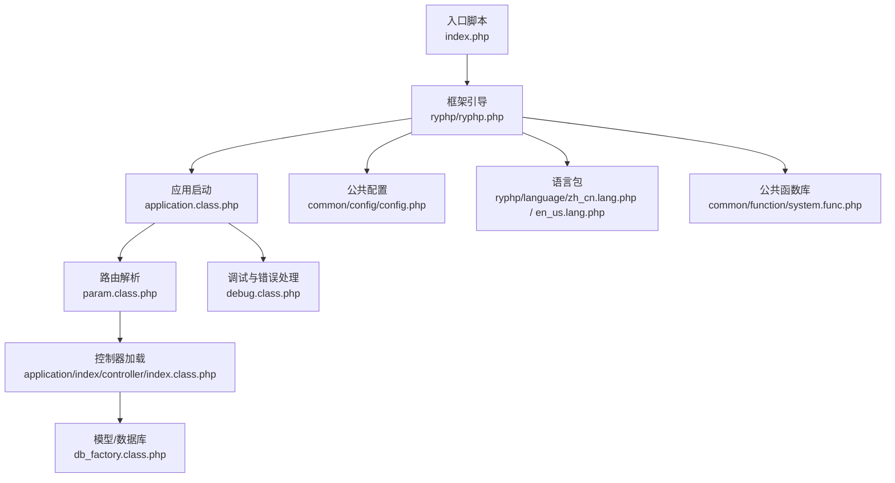
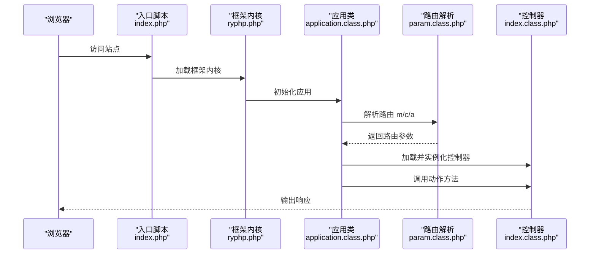
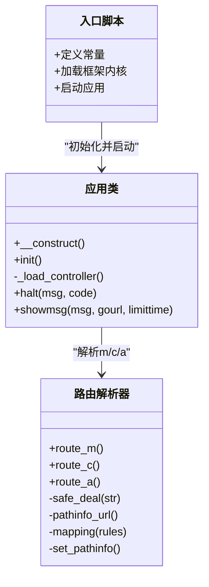
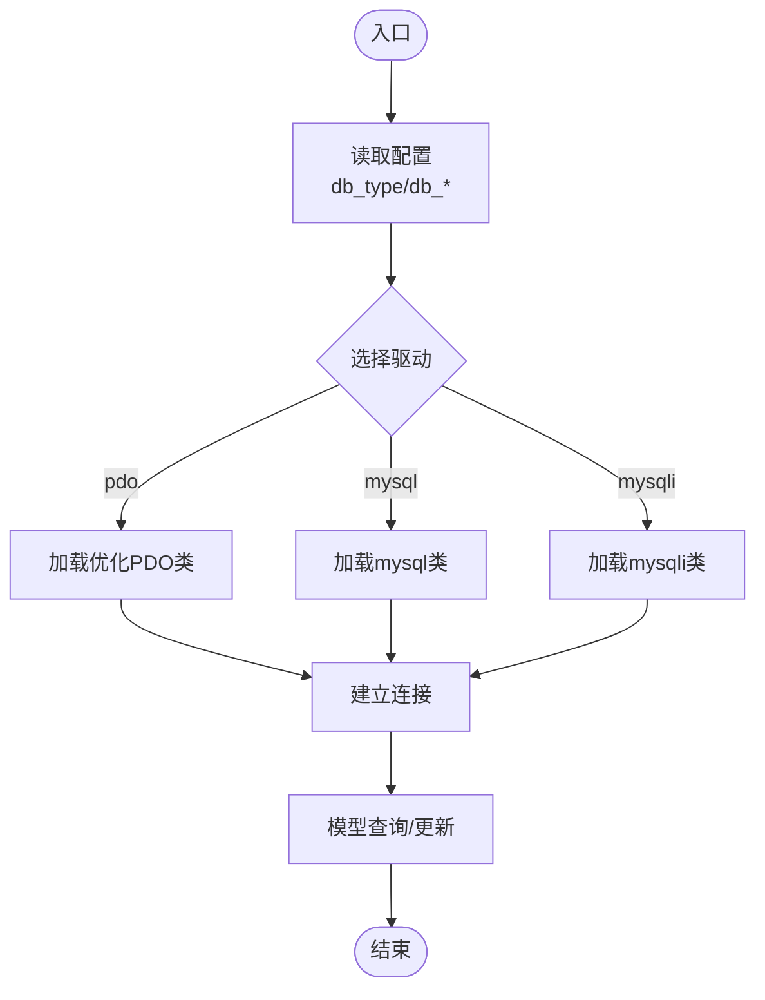
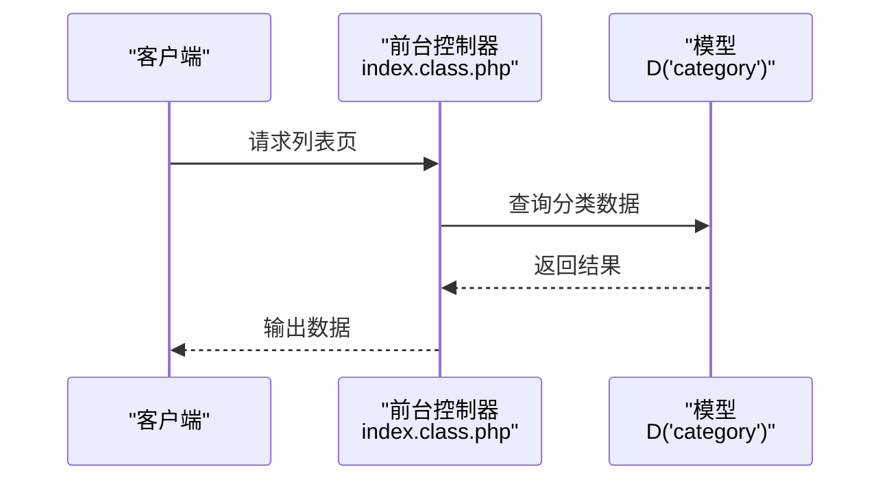
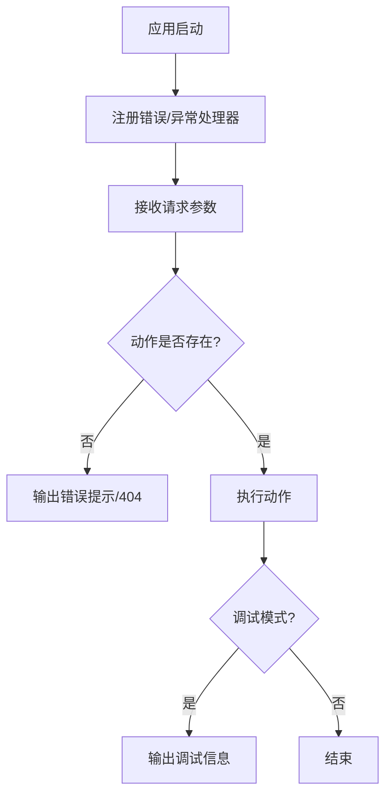
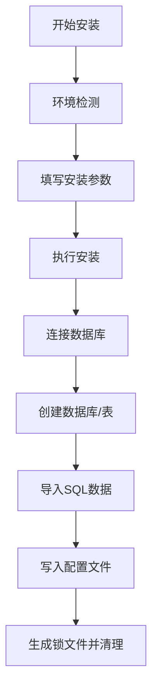
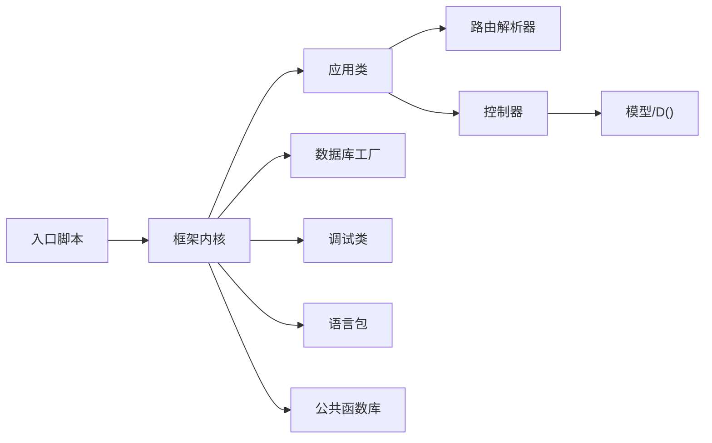

# 开发者指南

<cite>
**本文引用的文件**   
- [index.php](file://index.php)
- [ryphp.php](file://ryphp/ryphp.php)
- [application.class.php](file://ryphp/core/class/application.class.php)
- [param.class.php](file://ryphp/core/class/param.class.php)
- [db_factory.class.php](file://ryphp/core/class/db_factory.class.php)
- [debug.class.php](file://ryphp/core/class/debug.class.php)
- [config.php](file://common/config/config.php)
- [index.class.php（前台控制器）](file://application/index/controller/index.class.php)
- [index.class.php（API控制器）](file://application/api/controller/index.class.php)
- [admin_manage.class.php](file://application/lry_admin_center/controller/admin_manage.class.php)
- [index.php（安装程序）](file://application/install/index.php)
- [system.func.php](file://common/function/system.func.php)
- [zh_cn.lang.php](file://ryphp/language/zh_cn.lang.php)
- [en_us.lang.php](file://ryphp/language/en_us.lang.php)
- [README.md](file://README.md)
</cite>

## 目录
1. [引言](#引言)
2. [项目结构](#项目结构)
3. [核心组件](#核心组件)
4. [架构总览](#架构总览)
5. [详细组件分析](#详细组件分析)
6. [依赖关系分析](#依赖关系分析)
7. [性能考量](#性能考量)
8. [故障排查指南](#故障排查指南)
9. [结论](#结论)
10. [附录](#附录)

## 引言
本指南面向LRYBlog新开发者，帮助快速理解项目代码结构、文件组织原则、编码规范与最佳实践，并提供扩展开发、调试与性能分析、国际化支持、测试与版本控制、以及开源贡献流程的实用建议。文档以仓库现有实现为依据，结合架构图与流程图，帮助你高效参与项目开发与功能扩展。

## 项目结构
LRYBlog采用“单入口 + 自研框架内核”的结构：
- 单一入口：通过入口脚本加载框架内核并启动应用。
- 应用分层：application/ 下按模块划分（如 index、api、lry_admin_center），每个模块包含 controller、model、view 三层。
- 框架内核：ryphp/ 提供路由、类加载、数据库工厂、调试、消息模板等基础设施。
- 公共资源：common/ 提供配置、函数库、静态资源与插件。
- 安装程序：application/install/ 提供一键安装流程与数据库初始化。

图表来源
- [index.php](file://index.php#L1-L18)
- [ryphp.php](file://ryphp/ryphp.php#L1-L204)
- [application.class.php](file://ryphp/core/class/application.class.php#L1-L118)
- [param.class.php](file://ryphp/core/class/param.class.php#L1-L195)
- [db_factory.class.php](file://ryphp/core/class/db_factory.class.php#L1-L50)
- [debug.class.php](file://ryphp/core/class/debug.class.php#L1-L147)
- [config.php](file://common/config/config.php#L1-L88)
- [system.func.php](file://common/function/system.func.php#L1-L969)
- [zh_cn.lang.php](file://ryphp/language/zh_cn.lang.php#L1-L52)
- [en_us.lang.php](file://ryphp/language/en_us.lang.php#L1-L52)

章节来源
- [index.php](file://index.php#L1-L18)
- [ryphp.php](file://ryphp/ryphp.php#L1-L204)
- [config.php](file://common/config/config.php#L1-L88)

## 核心组件
- 入口与引导
  - 入口脚本定义调试开关、根路径、URL模式，并加载框架内核。
  - 框架内核定义系统常量、时区、静态资源URL、类加载与控制器/模型加载方法。
- 应用启动与路由
  - 应用类负责注册错误/异常处理器，解析路由参数（模块/控制器/动作），加载并执行控制器动作。
  - 路由参数解析器支持PATHINFO模式、URL映射、安全过滤与长度限制。
- 数据库与模型
  - 数据库工厂根据配置选择具体驱动（pdo/mysql/mysqli），统一连接与实例化。
- 调试与错误处理
  - 调试类收集信息、SQL、请求参数，支持致命错误捕获、错误回调与异常捕获。
- 国际化与公共函数
  - 语言包提供简体中文与英文词条；公共函数库提供模板主题、URL、SEO、站点信息、附件、邮件等工具函数。

章节来源
- [index.php](file://index.php#L1-L18)
- [ryphp.php](file://ryphp/ryphp.php#L1-L204)
- [application.class.php](file://ryphp/core/class/application.class.php#L1-L118)
- [param.class.php](file://ryphp/core/class/param.class.php#L1-L195)
- [db_factory.class.php](file://ryphp/core/class/db_factory.class.php#L1-L50)
- [debug.class.php](file://ryphp/core/class/debug.class.php#L1-L147)
- [zh_cn.lang.php](file://ryphp/language/zh_cn.lang.php#L1-L52)
- [en_us.lang.php](file://ryphp/language/en_us.lang.php#L1-L52)
- [system.func.php](file://common/function/system.func.php#L1-L969)

## 架构总览
下面的时序图展示了从入口到控制器执行的关键流程，包括路由解析、控制器加载与动作调用。

图表来源
- [index.php](file://index.php#L1-L18)
- [ryphp.php](file://ryphp/ryphp.php#L83-L202)
- [application.class.php](file://ryphp/core/class/application.class.php#L9-L40)
- [param.class.php](file://ryphp/core/class/param.class.php#L22-L46)
- [index.class.php（前台控制器）](file://application/index/controller/index.class.php#L1-L18)

## 详细组件分析

### 组件A：入口与应用启动
- 入口脚本职责
  - 定义调试与根路径常量，加载框架内核，设置URL模式，启动应用。
- 应用类职责
  - 注册错误/异常处理器，解析路由，加载控制器并执行动作；提供错误提示与致命错误处理。
- 路由解析器职责
  - 支持PATHINFO模式，安全过滤参数，解析URL映射规则，支持额外键值对传递。

图表来源
- [index.php](file://index.php#L1-L18)
- [application.class.php](file://ryphp/core/class/application.class.php#L9-L65)
- [param.class.php](file://ryphp/core/class/param.class.php#L22-L183)

章节来源
- [index.php](file://index.php#L1-L18)
- [application.class.php](file://ryphp/core/class/application.class.php#L1-L118)
- [param.class.php](file://ryphp/core/class/param.class.php#L1-L195)

### 组件B：数据库工厂与模型访问
- 数据库工厂
  - 根据配置选择驱动（pdo/mysql/mysqli），统一连接参数与实例化。
- 模型访问
  - 通过D()函数访问模型，配合ORM链式查询与缓存策略。

图表来源
- [db_factory.class.php](file://ryphp/core/class/db_factory.class.php#L11-L49)

章节来源
- [db_factory.class.php](file://ryphp/core/class/db_factory.class.php#L1-L50)

### 组件C：控制器与动作执行
- 前台控制器示例
  - 接收分页参数，查询分类数据并输出（用于演示与调试）。
- API控制器示例
  - 生成验证码图片并写入会话，演示简单API动作。
- 后台管理控制器示例
  - 继承通用控制器，实现管理员列表、信息编辑、密码修改等动作。

图表来源
- [index.class.php（前台控制器）](file://application/index/controller/index.class.php#L14-L17)

章节来源
- [index.class.php（前台控制器）](file://application/index/controller/index.class.php#L1-L18)
- [index.class.php（API控制器）](file://application/api/controller/index.class.php#L1-L22)
- [admin_manage.class.php](file://application/lry_admin_center/controller/admin_manage.class.php#L1-L105)

### 组件D：调试与错误处理
- 调试类
  - 收集信息、SQL与请求参数，计算耗时；捕获致命错误、错误回调与异常回调。
- 应用类错误处理
  - 非调试模式下输出错误页面或状态码，调试模式下输出详细信息。

图表来源
- [application.class.php](file://ryphp/core/class/application.class.php#L9-L40)
- [debug.class.php](file://ryphp/core/class/debug.class.php#L46-L112)

章节来源
- [debug.class.php](file://ryphp/core/class/debug.class.php#L1-L147)
- [application.class.php](file://ryphp/core/class/application.class.php#L1-L118)

### 组件E：安装程序与数据库初始化
- 安装流程
  - 步骤1-5：许可协议、环境检测、参数设置、安装执行、完成清理。
  - 环境检测：PHP版本、PDO/Mysqli、GD、Session、Curl、目录可写等。
  - 安装执行：连接数据库、创建库/表、导入数据、写入配置、生成锁文件。
- 关键点
  - 通过JSON反馈安装进度，支持引擎与字符集切换。
  - 写入配置文件时进行正则替换，保证安全性。

图表来源
- [index.php（安装程序）](file://application/install/index.php#L45-L275)

章节来源
- [index.php（安装程序）](file://application/install/index.php#L1-L373)

## 依赖关系分析
- 入口脚本依赖框架内核；框架内核定义常量并提供类加载与控制器/模型加载方法。
- 应用类依赖路由解析器与控制器；控制器依赖模型与公共函数库。
- 数据库工厂依赖配置与具体驱动类；调试类贯穿请求生命周期。
- 语言包与公共函数库为全局可用资源。

图表来源
- [index.php](file://index.php#L1-L18)
- [ryphp.php](file://ryphp/ryphp.php#L83-L202)
- [application.class.php](file://ryphp/core/class/application.class.php#L1-L118)
- [param.class.php](file://ryphp/core/class/param.class.php#L1-L195)
- [db_factory.class.php](file://ryphp/core/class/db_factory.class.php#L1-L50)
- [debug.class.php](file://ryphp/core/class/debug.class.php#L1-L147)
- [system.func.php](file://common/function/system.func.php#L1-L969)
- [zh_cn.lang.php](file://ryphp/language/zh_cn.lang.php#L1-L52)
- [en_us.lang.php](file://ryphp/language/en_us.lang.php#L1-L52)

章节来源
- [ryphp.php](file://ryphp/ryphp.php#L1-L204)
- [application.class.php](file://ryphp/core/class/application.class.php#L1-L118)
- [param.class.php](file://ryphp/core/class/param.class.php#L1-L195)
- [db_factory.class.php](file://ryphp/core/class/db_factory.class.php#L1-L50)
- [debug.class.php](file://ryphp/core/class/debug.class.php#L1-L147)
- [system.func.php](file://common/function/system.func.php#L1-L969)
- [config.php](file://common/config/config.php#L1-L88)

## 性能考量
- 路由与URL
  - 启用PATHINFO模式可提升URL可读性与SEO友好度；注意Nginx配置与set_pathinfo开关。
  - URL映射与规则合并可减少重复配置，提高解析效率。
- 缓存策略
  - 文件缓存、Redis、Memcache三选一；合理设置过期时间与前缀，避免键冲突。
- 数据库
  - 优先使用PDO驱动；批量导入SQL时注意事务与错误回滚。
- 调试与日志
  - 调试模式下输出详细信息，生产环境关闭调试并启用错误日志记录。
- 静态资源与上传
  - 图片水印、上传目录权限与CDN接入可显著影响性能与用户体验。

## 故障排查指南
- 常见问题定位
  - 路由错误：检查URL模式、PATHINFO参数、路由映射规则与动作名是否带下划线前缀（受保护动作）。
  - 控制器缺失：确认模块目录、控制器文件与类名一致。
  - 数据库连接失败：核对配置文件中的主机、端口、用户名、密码与字符集。
  - 安装失败：查看环境检测项、数据库权限、目录可写性与锁文件状态。
- 日志与调试
  - 非调试模式下错误会被记录到日志；调试模式下可在页面查看详细信息与SQL执行情况。
  - 使用调试类提供的耗时统计与SQL收集能力，定位慢查询与异常。

章节来源
- [application.class.php](file://ryphp/core/class/application.class.php#L24-L40)
- [debug.class.php](file://ryphp/core/class/debug.class.php#L46-L112)
- [index.php（安装程序）](file://application/install/index.php#L51-L114)

## 结论
LRYBlog以简洁清晰的单入口与自研框架为核心，采用模块化与分层设计，具备良好的可扩展性与可维护性。通过遵循本文档的结构理解、编码规范、扩展方法与调试流程，你可以高效地参与开发与功能扩展。

## 附录

### 编码规范与最佳实践
- 命名约定
  - 文件：类文件统一使用小写与下划线，类名与文件名一致。
  - 变量：使用小驼峰或下划线风格，保持一致性。
  - 常量：使用全大写与下划线，前缀统一。
- 注释标准
  - 函数/方法：说明用途、参数、返回值与注意事项。
  - 类：说明职责与关键方法。
  - 关键配置：在配置文件中添加注释说明用途与取值范围。
- 代码风格
  - 缩进与换行：统一使用空格缩进，保持一致的换行与空行。
  - 安全性：输入参数严格校验与过滤，避免SQL注入与XSS。
  - 可读性：拆分复杂逻辑，使用有意义的变量名与函数名。

### 扩展开发方法
- 自定义模块
  - 在 application/ 下新建模块目录，按需创建 controller/model/view。
  - 在公共配置中新增路由规则或映射，确保URL可访问。
- 插件机制
  - 可在 common/plugin/ 或模块 common/ 下扩展功能，通过公共函数库或钩子接口集成。
- 钩子系统
  - 当前代码未显式提供钩子类，可在公共函数库中引入事件触发与订阅机制，或在控制器/模型中增加前置/后置处理点。

### 调试技巧与开发工具
- 错误日志分析
  - 生产环境启用错误日志保存，定期检查日志文件定位问题。
- 性能分析
  - 使用调试类统计耗时与SQL执行次数，结合数据库索引优化与缓存策略。
- 开发环境配置
  - 开启调试模式便于开发；部署时关闭调试并配置错误页面与日志。

### 国际化支持指南
- 语言包管理
  - 语言包位于 ryphp/language/，分别提供简体中文与英文词条。
  - 在公共函数库中统一使用L()函数获取对应语言词条。
- 本地化开发
  - 新增词条时同步更新各语言包，避免硬编码文本。
  - 页面输出统一通过L()函数与模板变量，确保切换语言时一致呈现。

章节来源
- [system.func.php](file://common/function/system.func.php#L1-L969)
- [zh_cn.lang.php](file://ryphp/language/zh_cn.lang.php#L1-L52)
- [en_us.lang.php](file://ryphp/language/en_us.lang.php#L1-L52)

### 测试与版本控制
- 单元测试与集成测试
  - 建议为关键业务逻辑（如模型查询、公共函数）编写单元测试；为控制器动作编写集成测试，覆盖正常与异常分支。
- 版本控制最佳实践
  - 使用Git进行版本管理，遵循分支策略（如主干保护、特性分支、热修复分支）。
  - 提交信息规范：类型 + 模块 + 简要描述，必要时补充变更原因与影响范围。
- 团队协作流程
  - 代码评审：每次合并前至少一次评审，关注安全性、可读性与性能。
  - 文档同步：新增功能需同步更新README与内部文档。

章节来源
- [README.md](file://README.md#L1-L6)

### 开源贡献流程
- 提交规范
  - 分支命名：feature/xxx、fix/xxx、docs/xxx、chore/xxx。
  - 提交信息：type(module): brief description；引用相关Issue或PR。
- 文档编写
  - 新增功能需提供使用说明与示例；变更配置需更新配置说明与迁移指南。
- 贡献方式
  - Fork仓库 → 创建分支 → 提交代码 → 发起Pull Request → 评审与合并。