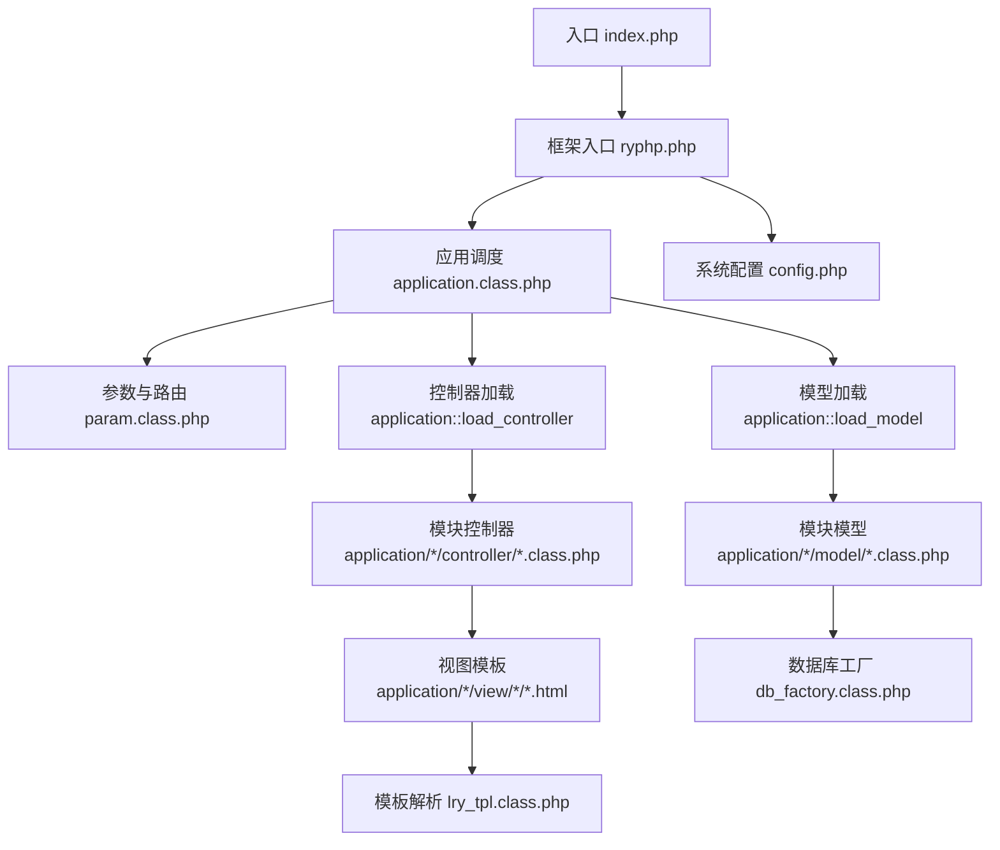
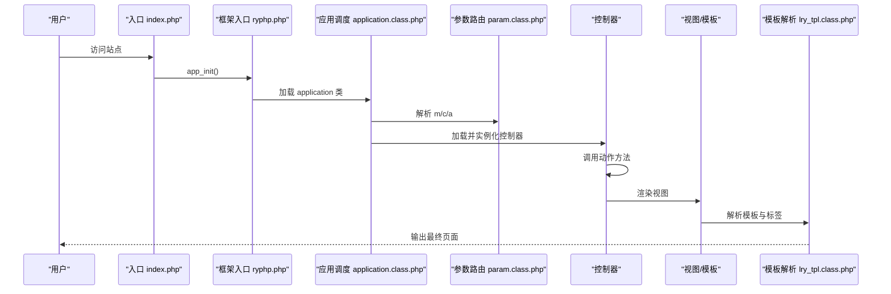
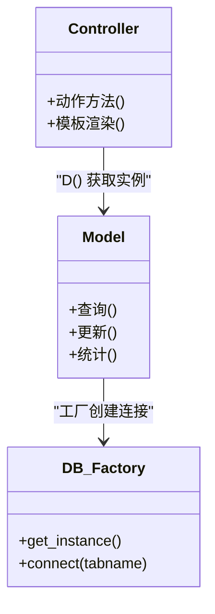
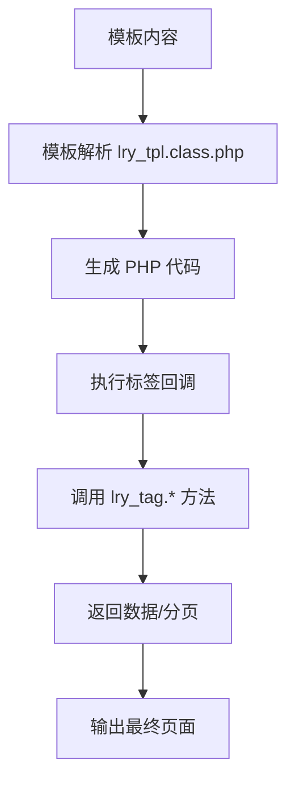
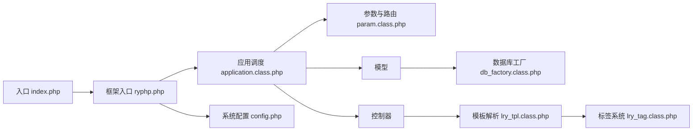

# 扩展开发

<cite>
**本文引用的文件**
- [入口文件 index.php](file://index.php)
- [框架入口 ryphp.php](file://ryphp/ryphp.php)
- [应用调度 application.class.php](file://ryphp/core/class/application.class.php)
- [参数与路由 param.class.php](file://ryphp/core/class/param.class.php)
- [数据库工厂 db_factory.class.php](file://ryphp/core/class/db_factory.class.php)
- [模板解析 lry_tpl.class.php](file://ryphp/core/class/lry_tpl.class.php)
- [标签系统 lry_tag.class.php](file://ryphp/core/class/lry_tag.class.php)
- [系统配置 config.php](file://common/config/config.php)
- [后台通用函数 function.php](file://application/lry_admin_center/common/function/function.php)
- [后台控制器 admin_manage.class.php](file://application/lry_admin_center/controller/admin_manage.class.php)
- [前台控制器 index.class.php](file://application/index/controller/index.class.php)
- [主题配置 rongyao/config.php](file://application/index/view/rongyao/config.php)
</cite>

## 目录
1. [简介](#简介)
2. [项目结构](#项目结构)
3. [核心组件](#核心组件)
4. [架构总览](#架构总览)
5. [组件详解](#组件详解)
6. [依赖关系分析](#依赖关系分析)
7. [性能考量](#性能考量)
8. [故障排查指南](#故障排查指南)
9. [结论](#结论)
10. [附录](#附录)

## 简介
本指南面向希望在 LRYBlog（基于 RYPHP 框架）上进行扩展开发的工程师，覆盖自定义模块开发、插件机制（钩子/事件/生命周期）、自定义控制器与模型、模板扩展、数据库扩展、打包分发与版本管理，以及完整的工作流程与最佳实践。文档以仓库现有代码为依据，结合架构与实现细节，帮助开发者从零开始构建从简单到企业级的扩展。

## 项目结构
LRYBlog 采用“模块化 + 主题化”的组织方式：
- 应用层按模块划分，如前台 index 与后台 lry_admin_center，每个模块包含 common、controller、model、view 子目录
- 框架层位于 ryp hp 目录，提供入口、调度、路由、模板、数据库等基础设施
- 公共配置与资源位于 common 目录
- 入口文件负责初始化框架与应用

图表来源
- [入口文件 index.php](file://index.php#L1-L18)
- [框架入口 ryphp.php](file://ryphp/ryphp.php#L83-L202)
- [应用调度 application.class.php](file://ryphp/core/class/application.class.php#L4-L118)
- [参数与路由 param.class.php](file://ryphp/core/class/param.class.php#L3-L195)
- [系统配置 config.php](file://common/config/config.php#L1-L88)

章节来源
- [入口文件 index.php](file://index.php#L1-L18)
- [框架入口 ryphp.php](file://ryphp/ryphp.php#L83-L202)
- [应用调度 application.class.php](file://ryphp/core/class/application.class.php#L4-L118)
- [参数与路由 param.class.php](file://ryphp/core/class/param.class.php#L3-L195)
- [系统配置 config.php](file://common/config/config.php#L1-L88)

## 核心组件
- 应用入口与初始化：入口文件定义常量并调用框架初始化
- 框架入口：集中加载系统函数、公共文件、定义站点常量，提供类加载与模块加载能力
- 应用调度：解析路由、加载控制器、反射调用动作方法、错误处理
- 参数与路由：解析 m/c/a 与 PATHINFO，支持路由映射与规则
- 数据库工厂：按配置选择 PDO/MySQLi/MySQL 实现，统一连接与实例化
- 模板解析：将自定义标签语法转换为 PHP 代码，支持标签缓存与分页
- 标签系统：内置多种内容标签（列表、分页、搜索、评论等），支持自定义 SQL
- 主题与视图：主题通过 config.php 声明模板映射，模板使用自定义标签语法

章节来源
- [框架入口 ryphp.php](file://ryphp/ryphp.php#L83-L202)
- [应用调度 application.class.php](file://ryphp/core/class/application.class.php#L4-L118)
- [参数与路由 param.class.php](file://ryphp/core/class/param.class.php#L3-L195)
- [数据库工厂 db_factory.class.php](file://ryphp/core/class/db_factory.class.php#L1-L50)
- [模板解析 lry_tpl.class.php](file://ryphp/core/class/lry_tpl.class.php#L1-L134)
- [标签系统 lry_tag.class.php](file://ryphp/core/class/lry_tag.class.php#L1-L492)

## 架构总览
LRYBlog 的请求生命周期如下：
- 入口初始化 → 框架加载 → 路由解析 → 控制器加载与实例化 → 动作方法执行 → 视图渲染 → 模板解析与标签执行 → 输出结果

图表来源
- [入口文件 index.php](file://index.php#L10-L18)
- [框架入口 ryphp.php](file://ryphp/ryphp.php#L83-L202)
- [应用调度 application.class.php](file://ryphp/core/class/application.class.php#L24-L65)
- [参数与路由 param.class.php](file://ryphp/core/class/param.class.php#L95-L116)
- [模板解析 lry_tpl.class.php](file://ryphp/core/class/lry_tpl.class.php#L31-L59)

## 组件详解

### 自定义模块开发（目录结构、配置与路由）
- 模块目录结构
  - 前台模块：application/index/{common,controller,model,view}
  - 后台模块：application/lry_admin_center/{common,controller,model,view}
  - 每个模块均包含 controller、model、view 三层，common 用于共享资源
- 路由与入口
  - URL 通过 m/c/a 或 PATHINFO 形式传递，框架据此定位模块与控制器
  - 默认路由可在系统配置中设置
- 控制器与动作
  - 控制器类名与文件名一致，动作方法即为公开方法（不以下划线开头）
  - 控制器可继承通用基类以复用逻辑
- 示例参考
  - 前台控制器：[前台控制器 index.class.php](file://application/index/controller/index.class.php#L1-L18)
  - 后台控制器：[后台控制器 admin_manage.class.php](file://application/lry_admin_center/controller/admin_manage.class.php#L1-L105)

章节来源
- [参数与路由 param.class.php](file://ryphp/core/class/param.class.php#L22-L46)
- [应用调度 application.class.php](file://ryphp/core/class/application.class.php#L48-L65)
- [系统配置 config.php](file://common/config/config.php#L24-L29)
- [前台控制器 index.class.php](file://application/index/controller/index.class.php#L1-L18)
- [后台控制器 admin_manage.class.php](file://application/lry_admin_center/controller/admin_manage.class.php#L1-L105)

### 插件机制与事件监听（钩子/生命周期）
- 当前代码未发现显式的“钩子系统”或“事件总线”实现
- 可通过以下方式模拟插件机制：
  - 在控制器/模型加载前后插入拦截逻辑（建议在模块 common 层封装统一入口）
  - 使用配置开关控制功能启用/禁用
  - 通过模板标签扩展点注入业务逻辑（标签系统已提供扩展点）
- 生命周期管理
  - 模块初始化：在 common 层的初始化函数中完成
  - 请求期：控制器动作执行期间
  - 结束期：可利用框架的错误处理与调试消息输出

章节来源
- [应用调度 application.class.php](file://ryphp/core/class/application.class.php#L9-L19)
- [模板解析 lry_tpl.class.php](file://ryphp/core/class/lry_tpl.class.php#L62-L92)
- [标签系统 lry_tag.class.php](file://ryphp/core/class/lry_tag.class.php#L18-L65)

### 自定义控制器与模型开发（继承、重写与数据交互）
- 控制器
  - 继承通用基类（如后台 common），在动作方法中调用模型与模板
  - 使用分页类与输入过滤工具，注意 SQL 注入防护
- 模型
  - 通过 D() 工厂获取模型实例，使用链式 API 查询与更新
  - 数据库连接由工厂按配置选择具体驱动
- 示例参考
  - 控制器动作与模板渲染：[后台控制器 admin_manage.class.php](file://application/lry_admin_center/controller/admin_manage.class.php#L11-L44)
  - 数据库工厂与驱动选择：[数据库工厂 db_factory.class.php](file://ryphp/core/class/db_factory.class.php#L11-L49)

图表来源
- [后台控制器 admin_manage.class.php](file://application/lry_admin_center/controller/admin_manage.class.php#L37-L43)
- [数据库工厂 db_factory.class.php](file://ryphp/core/class/db_factory.class.php#L11-L49)

章节来源
- [后台控制器 admin_manage.class.php](file://application/lry_admin_center/controller/admin_manage.class.php#L11-L105)
- [数据库工厂 db_factory.class.php](file://ryphp/core/class/db_factory.class.php#L1-L50)

### 模板扩展（自定义标签、模板函数与主题定制）
- 自定义标签
  - 模板中使用 {m:标签 参数} 语法，解析器将其转换为 PHP 调用
  - 标签系统提供列表、分页、搜索、评论等内置标签，支持缓存与分页
- 模板函数
  - 模板解析器支持 PHP 代码片段与循环、条件等语法
- 主题定制
  - 主题通过 config.php 声明模板映射，便于切换不同布局
- 示例参考
  - 标签解析回调：[模板解析 lry_tpl.class.php](file://ryphp/core/class/lry_tpl.class.php#L62-L92)
  - 标签系统实现：[标签系统 lry_tag.class.php](file://ryphp/core/class/lry_tag.class.php#L18-L65)
  - 主题配置：[主题配置 rongyao/config.php](file://application/index/view/rongyao/config.php#L1-L29)

图表来源
- [模板解析 lry_tpl.class.php](file://ryphp/core/class/lry_tpl.class.php#L31-L92)
- [标签系统 lry_tag.class.php](file://ryphp/core/class/lry_tag.class.php#L18-L65)

章节来源
- [模板解析 lry_tpl.class.php](file://ryphp/core/class/lry_tpl.class.php#L1-L134)
- [标签系统 lry_tag.class.php](file://ryphp/core/class/lry_tag.class.php#L1-L492)
- [主题配置 rongyao/config.php](file://application/index/view/rongyao/config.php#L1-L29)

### 数据库扩展（新表设计、模型类与迁移）
- 新表设计
  - 使用统一表前缀与字符集，遵循现有命名规范
- 模型类创建
  - 在模块 model 目录下创建模型类，继承框架提供的模型基类（若存在）
  - 使用工厂 D() 获取实例，链式调用查询与更新
- 数据迁移
  - 可在模块安装/升级流程中执行 SQL 脚本
  - 参考后台通用函数中的升级包下载与解压流程，作为迁移脚本执行的参考
- 示例参考
  - 数据库工厂与驱动选择：[数据库工厂 db_factory.class.php](file://ryphp/core/class/db_factory.class.php#L11-L49)
  - 升级包下载与解压：[后台通用函数 function.php](file://application/lry_admin_center/common/function/function.php#L109-L162)

章节来源
- [数据库工厂 db_factory.class.php](file://ryphp/core/class/db_factory.class.php#L1-L50)
- [后台通用函数 function.php](file://application/lry_admin_center/common/function/function.php#L109-L162)

### 扩展示例（从简单到企业级）
- 简单功能模块
  - 创建模块目录与基础控制器/模型
  - 在系统配置中设置默认路由，或通过路由映射实现友好 URL
  - 使用模板标签快速输出数据
- 复杂企业级扩展
  - 引入权限控制、审计日志、缓存策略
  - 通过主题配置与模板扩展满足多站点/多风格需求
  - 使用数据库工厂与模型抽象实现跨库/多实例支持

章节来源
- [系统配置 config.php](file://common/config/config.php#L24-L29)
- [参数与路由 param.class.php](file://ryphp/core/class/param.class.php#L138-L151)
- [模板解析 lry_tpl.class.php](file://ryphp/core/class/lry_tpl.class.php#L31-L59)

### 扩展打包、分发与版本管理
- 打包
  - 将模块目录与主题配置打包为 zip
- 分发
  - 提供升级包下载与校验（参考升级包下载与 MD5 校验流程）
- 版本管理
  - 在主题配置中维护版本号；在模块内记录版本信息以便升级脚本判断
- 示例参考
  - 下载与解压升级包：[后台通用函数 function.php](file://application/lry_admin_center/common/function/function.php#L109-L162)

章节来源
- [后台通用函数 function.php](file://application/lry_admin_center/common/function/function.php#L109-L162)
- [主题配置 rongyao/config.php](file://application/index/view/rongyao/config.php#L6-L6)

## 依赖关系分析
- 入口依赖框架入口；框架入口依赖系统函数与配置；应用调度依赖参数路由与类加载；控制器依赖模型与模板；模型依赖数据库工厂；模板依赖解析器与标签系统
- 路由配置与 URL 模型影响控制器与动作的解析

图表来源
- [入口文件 index.php](file://index.php#L10-L18)
- [框架入口 ryphp.php](file://ryphp/ryphp.php#L83-L202)
- [应用调度 application.class.php](file://ryphp/core/class/application.class.php#L4-L118)
- [参数与路由 param.class.php](file://ryphp/core/class/param.class.php#L3-L195)
- [数据库工厂 db_factory.class.php](file://ryphp/core/class/db_factory.class.php#L1-L50)
- [模板解析 lry_tpl.class.php](file://ryphp/core/class/lry_tpl.class.php#L1-L134)
- [标签系统 lry_tag.class.php](file://ryphp/core/class/lry_tag.class.php#L1-L492)
- [系统配置 config.php](file://common/config/config.php#L1-L88)

章节来源
- [入口文件 index.php](file://index.php#L1-L18)
- [框架入口 ryphp.php](file://ryphp/ryphp.php#L83-L202)
- [应用调度 application.class.php](file://ryphp/core/class/application.class.php#L4-L118)
- [参数与路由 param.class.php](file://ryphp/core/class/param.class.php#L3-L195)
- [系统配置 config.php](file://common/config/config.php#L1-L88)

## 性能考量
- 模板标签缓存：合理使用标签缓存参数减少重复查询
- 分页与 LIMIT：列表页使用分页类限制查询数量
- 数据库连接：通过工厂按配置选择合适驱动，避免不必要的连接开销
- 路由映射：启用路由映射可简化 URL，减少解析成本

章节来源
- [模板解析 lry_tpl.class.php](file://ryphp/core/class/lry_tpl.class.php#L76-L90)
- [标签系统 lry_tag.class.php](file://ryphp/core/class/lry_tag.class.php#L58-L64)
- [数据库工厂 db_factory.class.php](file://ryphp/core/class/db_factory.class.php#L11-L49)

## 故障排查指南
- 控制器/动作不存在
  - 检查路由参数与控制器文件是否存在，确认动作方法不以下划线开头
- 模板解析错误
  - 检查标签语法与缓存配置，确认模板文件可读
- 数据库连接失败
  - 核对系统配置中的数据库参数与表前缀
- URL 路由异常
  - 检查 URL 模型与路由映射配置，确认 PATHINFO 设置

章节来源
- [应用调度 application.class.php](file://ryphp/core/class/application.class.php#L52-L64)
- [模板解析 lry_tpl.class.php](file://ryphp/core/class/lry_tpl.class.php#L31-L59)
- [系统配置 config.php](file://common/config/config.php#L14-L21)
- [参数与路由 param.class.php](file://ryphp/core/class/param.class.php#L95-L116)

## 结论
LRYBlog 提供了清晰的模块化结构与完善的基础设施，开发者可基于现有框架快速扩展功能。通过模块化目录、路由与模板标签系统，结合数据库工厂与模型抽象，能够高效构建从简单到复杂的企业级扩展。建议在扩展开发中重视配置管理、模板缓存与路由映射，以获得更佳的性能与可维护性。

## 附录
- 快速清单
  - 创建模块目录与基础文件
  - 在系统配置中设置默认路由或路由映射
  - 在控制器中调用模型与模板
  - 使用标签系统与模板解析器输出数据
  - 通过主题配置切换视图风格
  - 使用升级包下载与解压流程进行分发与升级