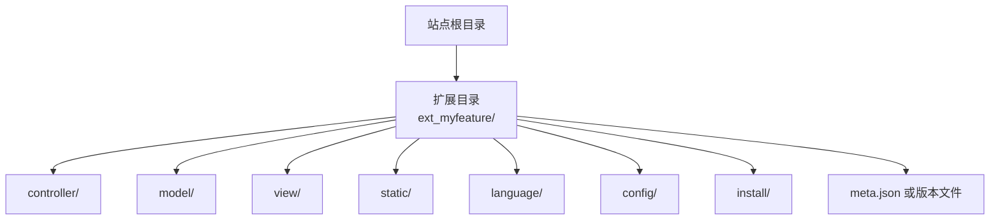
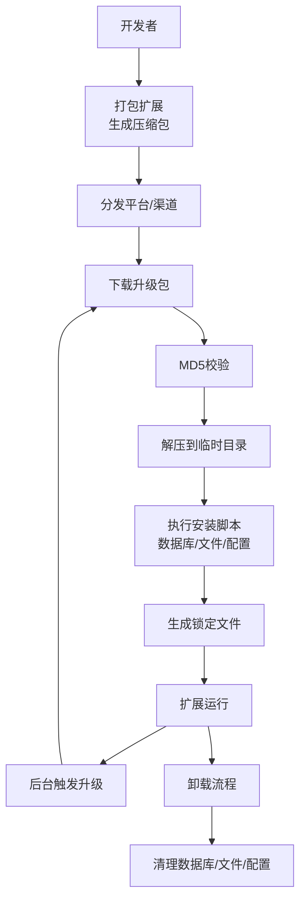
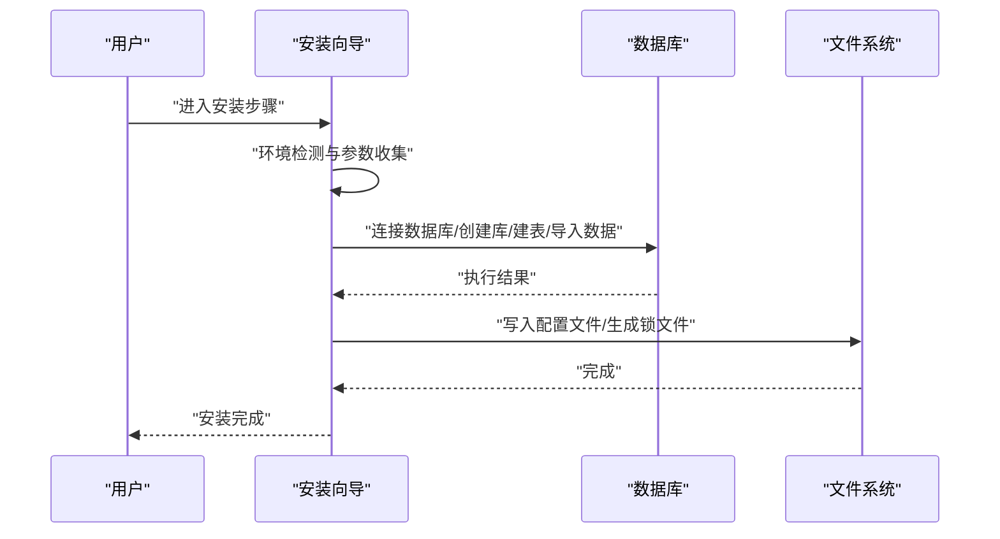
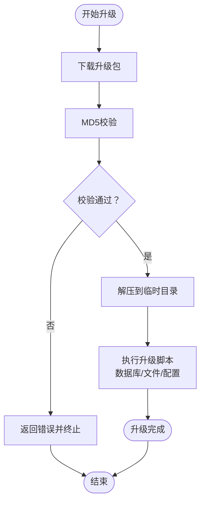
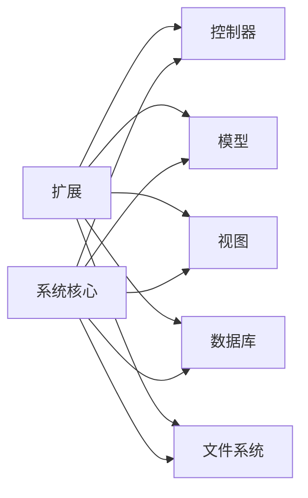

# 扩展打包与分发

<cite>
**本文引用的文件**
- [README.md](file://README.md)
- [common/data/version.php](file://common/data/version.php)
- [application/install/index.php](file://application/install/index.php)
- [application/install/templates/s2.php](file://application/install/templates/s2.php)
- [application/install/templates/s3.php](file://application/install/templates/s3.php)
- [application/install/templates/s4.php](file://application/install/templates/s4.php)
- [application/install/templates/s5.php](file://application/install/templates/s5.php)
- [application/lry_admin_center/common/function/function.php](file://application/lry_admin_center/common/function/function.php)
- [common/function/extention.func.php](file://common/function/extention.func.php)
</cite>

## 目录
1. [引言](#引言)
2. [项目结构](#项目结构)
3. [核心组件](#核心组件)
4. [架构总览](#架构总览)
5. [详细组件分析](#详细组件分析)
6. [依赖关系分析](#依赖关系分析)
7. [性能考虑](#性能考虑)
8. [故障排查指南](#故障排查指南)
9. [结论](#结论)
10. [附录](#附录)

## 引言
本指南面向LRYBlog扩展开发者，提供从目录结构、元数据、打包、安装/卸载、分发与兼容性测试到文档编写的全流程规范，帮助你在不同环境下稳定交付扩展。

## 项目结构
LRYBlog采用模块化的应用结构，扩展开发应遵循以下约定：
- 扩展根目录建议放置于站点根目录下，命名以“ext_”前缀区分（例如：ext_myfeature），避免与核心模块冲突。
- 扩展内部推荐按“控制器/模型/视图/静态资源/语言包/配置/安装脚本”等子目录组织，便于安装与卸载时的定位与清理。
- 扩展元数据与版本信息建议集中管理，便于升级与兼容性检查。

[无图表来源；该图为概念性结构示意]

## 核心组件
- 版本与元数据管理：通过版本文件集中声明扩展版本号与更新时间，便于升级与兼容性校验。
- 安装流程：基于安装向导的步骤化流程，包含环境检测、参数配置、数据库初始化、配置写入与锁文件生成。
- 升级与下载：后台提供下载与解压能力，支持MD5校验与目录权限检查，保障升级包完整性与可部署性。
- 开发辅助：提供调试打印工具，便于扩展开发与问题定位。

章节来源
- [common/data/version.php:1-4](file://common/data/version.php#L1-L4)
- [application/install/index.php:13-37](file://application/install/index.php#L13-L37)
- [application/lry_admin_center/common/function/function.php:109-162](file://application/lry_admin_center/common/function/function.php#L109-L162)
- [common/function/extention.func.php:25-95](file://common/function/extention.func.php#L25-L95)

## 架构总览
扩展生命周期涉及“打包—分发—安装—运行—升级—卸载”，下图展示关键节点与交互：

[无图表来源；该图为概念性流程示意]

## 详细组件分析

### 目录结构与文件组织规范
- 必需文件清单
  - 控制器：用于扩展入口与业务路由（建议按功能划分子目录）。
  - 模型：封装数据访问与业务规则。
  - 视图：模板文件，支持主题切换与覆盖。
  - 静态资源：CSS/JS/图片等，按模块分目录存放。
  - 语言包：多语言支持，建议与模块同名。
  - 配置：扩展运行期配置项，建议提供默认值与迁移脚本。
  - 安装脚本：安装/升级/卸载阶段的数据库与文件操作。
- 可选资源管理
  - 插件式资源（如第三方库）建议独立目录，避免与核心资源混淆。
  - 资源版本控制：通过构建工具或版本号后缀管理缓存失效。

[无章节来源；本节为通用规范总结]

### 扩展元数据与版本管理
- 元数据文件建议包含：名称、版本、作者、依赖、兼容范围、更新日志、安装说明。
- 版本号与更新时间：建议与系统版本策略一致，便于统一升级与回滚。
- 兼容性声明：明确支持的系统版本、PHP版本、数据库版本与依赖扩展。

章节来源
- [common/data/version.php:1-4](file://common/data/version.php#L1-L4)

### 压缩打包流程
- 压缩包命名：建议采用“ext_扩展名_v版本号.zip”的命名规范，便于识别与排序。
- 压缩策略：
  - 排除开发文件与临时文件（如.git、*.log、~*）。
  - 保持目录层级清晰，避免根目录混杂。
  - 提供安装说明与变更记录。
- 分发渠道：官方插件库、社区平台、私有仓库，均需提供版本索引与校验信息。

[无章节来源；本节为通用流程总结]

### 安装与卸载机制
- 安装流程（基于系统安装向导模式）
  - 环境检测：PHP版本、扩展（如PDO/MySQLi）、文件夹可写性、CURL可用性等。
  - 参数配置：数据库连接、表前缀、字符集、管理员账号等。
  - 数据库初始化：创建表、导入初始数据、写入配置文件。
  - 锁定安装：生成安装锁文件，保护系统不再重复安装。
- 卸载流程
  - 清理数据库：删除扩展相关表与配置项。
  - 清理文件：移除扩展新增的静态资源与模板覆盖。
  - 恢复配置：还原被覆盖的系统配置。

图表来源
- [application/install/index.php:45-94](file://application/install/index.php#L45-L94)
- [application/install/index.php:132-275](file://application/install/index.php#L132-L275)
- [application/install/templates/s2.php:1-114](file://application/install/templates/s2.php#L1-L114)
- [application/install/templates/s3.php:1-160](file://application/install/templates/s3.php#L1-L160)
- [application/install/templates/s4.php:1-120](file://application/install/templates/s4.php#L1-L120)
- [application/install/templates/s5.php:1-60](file://application/install/templates/s5.php#L1-L60)

章节来源
- [application/install/index.php:45-94](file://application/install/index.php#L45-L94)
- [application/install/index.php:132-275](file://application/install/index.php#L132-L275)
- [application/install/templates/s2.php:1-114](file://application/install/templates/s2.php#L1-L114)
- [application/install/templates/s3.php:1-160](file://application/install/templates/s3.php#L1-L160)
- [application/install/templates/s4.php:1-120](file://application/install/templates/s4.php#L1-L120)
- [application/install/templates/s5.php:1-60](file://application/install/templates/s5.php#L1-L60)

### 升级与下载机制
- 下载与校验
  - 支持通过CURL或文件读取方式下载升级包。
  - 创建专用下载目录，写入文件后进行MD5校验，确保完整性。
- 解压与部署
  - 使用ZipArchive解压至临时目录，校验目录权限。
  - 执行安装脚本中的升级逻辑（数据库迁移、文件替换、配置更新）。
- 回滚策略
  - 升级前备份关键文件与数据库。
  - 失败时恢复备份并提示用户。

图表来源
- [application/lry_admin_center/common/function/function.php:109-162](file://application/lry_admin_center/common/function/function.php#L109-L162)

章节来源
- [application/lry_admin_center/common/function/function.php:109-162](file://application/lry_admin_center/common/function/function.php#L109-L162)

### 分发平台使用指南
- 版本发布
  - 在平台提交扩展元数据、版本号、下载链接与校验值。
  - 提供更新日志与兼容性说明。
- 更新通知
  - 系统可通过后台检查最新版本并提示升级。
  - 扩展可在元数据中声明更新接口，由系统定期拉取。
- 用户反馈
  - 平台提供评分、评论与问题反馈入口。
  - 建议在扩展中内置反馈入口或引导至平台页面。

[无章节来源；本节为通用流程总结]

### 兼容性检查与测试流程
- 环境检测
  - PHP版本与扩展：参考安装向导中的检测逻辑，确保PDO/MySQLi/CURL/GD等可用。
  - 文件夹权限：缓存、上传、扩展目录具备写权限。
- 功能回归测试
  - 安装/升级/卸载全流程验证。
  - 数据库迁移前后一致性检查。
  - 模板覆盖与静态资源加载验证。
- 自动化测试建议
  - 使用CI对不同PHP版本与数据库版本进行矩阵测试。
  - 对关键流程（安装、升级、卸载）编写端到端测试用例。

章节来源
- [application/install/index.php:55-114](file://application/install/index.php#L55-L114)

### 文档编写规范与模板
- 扩展文档建议包含：
  - 快速开始：安装、配置、首次使用。
  - 元数据说明：版本、依赖、兼容性。
  - 安装/升级/卸载步骤详解。
  - 常见问题与排障。
  - 开发者指南：目录结构、钩子/事件、扩展点。
- 示例与模板
  - 参考系统提供的安装模板与版本文件，形成标准化文档结构。

章节来源
- [README.md:1-6](file://README.md#L1-L6)
- [application/install/templates/s2.php:1-114](file://application/install/templates/s2.php#L1-L114)
- [application/install/templates/s3.php:1-160](file://application/install/templates/s3.php#L1-L160)
- [application/install/templates/s4.php:1-120](file://application/install/templates/s4.php#L1-L120)
- [application/install/templates/s5.php:1-60](file://application/install/templates/s5.php#L1-L60)
- [common/data/version.php:1-4](file://common/data/version.php#L1-L4)

## 依赖关系分析
- 扩展与系统核心
  - 扩展通过控制器/模型/视图与系统交互，遵循系统的URL模型与配置体系。
  - 安装/升级/卸载依赖系统提供的安装向导与后台函数。
- 扩展与数据库
  - 安装阶段创建表结构，升级阶段执行迁移脚本，卸载阶段清理数据。
- 扩展与文件系统
  - 静态资源与模板覆盖需遵循目录约定，避免冲突。

[无图表来源；该图为概念性依赖示意]

## 性能考虑
- 安装/升级阶段
  - 分步执行SQL，避免长时间阻塞；对大文件写入与解压增加进度反馈。
- 静态资源
  - 合理拆分与合并，启用缓存与CDN，减少首屏加载时间。
- 日志与调试
  - 使用系统提供的调试工具输出关键路径，便于定位性能瓶颈。

[无章节来源；本节为通用指导]

## 故障排查指南
- 安装失败
  - 检查数据库连接参数与权限，确认字符集与引擎设置。
  - 查看安装向导的环境检测结果，逐项修复缺失的扩展或权限。
- 升级异常
  - 校验升级包MD5，确认下载目录可写。
  - 回滚到上一版本，核对数据库迁移脚本与文件替换逻辑。
- 卸载残留
  - 检查数据库表与配置项是否清理干净，确认静态资源覆盖是否移除。

章节来源
- [application/install/index.php:132-275](file://application/install/index.php#L132-L275)
- [application/lry_admin_center/common/function/function.php:109-162](file://application/lry_admin_center/common/function/function.php#L109-L162)

## 结论
通过规范的目录结构、完善的元数据与版本管理、严谨的打包与安装流程、可靠的升级与卸载机制，以及全面的兼容性测试与文档规范，LRYBlog扩展可以在多环境下稳定交付并持续演进。建议开发者在每次发布前进行完整的回归测试，并在分发平台提供清晰的更新日志与用户反馈渠道。

## 附录
- 开发辅助函数
  - 提供美化打印数组的工具，便于调试与日志输出。
- 参考实现路径
  - 安装向导：[application/install/index.php:1-373](file://application/install/index.php#L1-L373)
  - 升级下载与解压：[application/lry_admin_center/common/function/function.php:109-162](file://application/lry_admin_center/common/function/function.php#L109-L162)
  - 版本信息：[common/data/version.php:1-4](file://common/data/version.php#L1-L4)
  - 调试打印：[common/function/extention.func.php:25-95](file://common/function/extention.func.php#L25-L95)