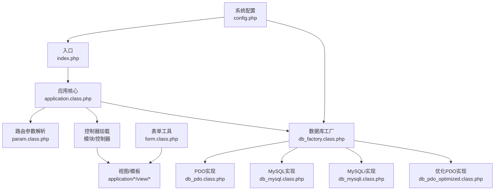
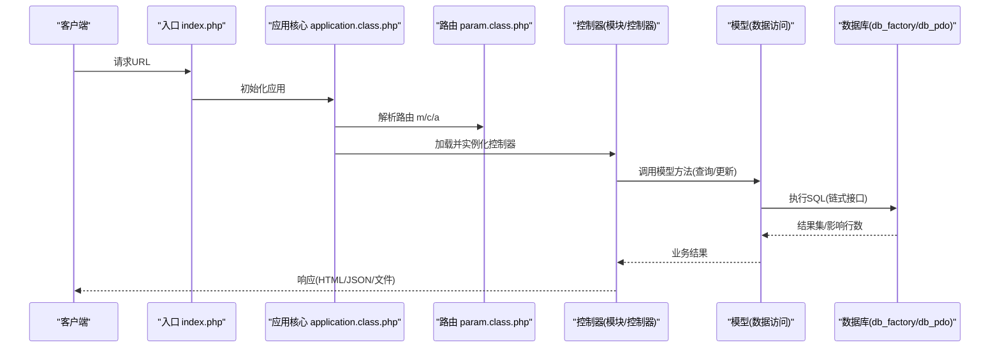
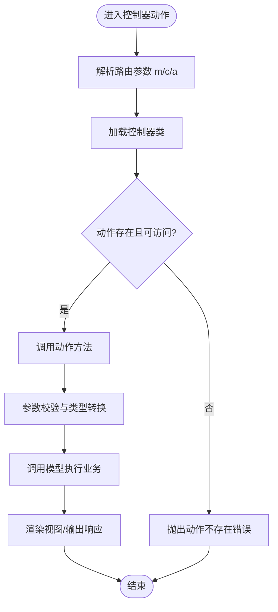
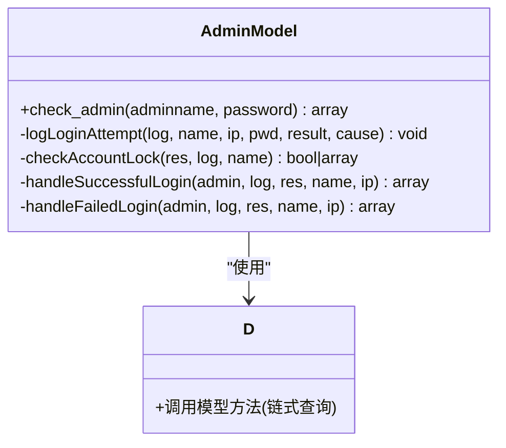
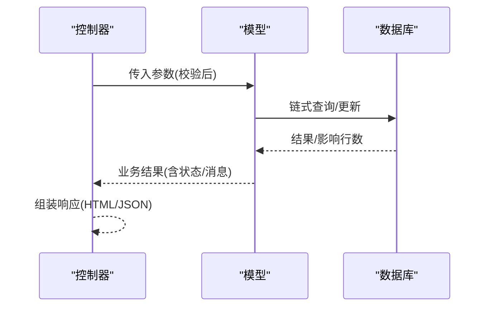
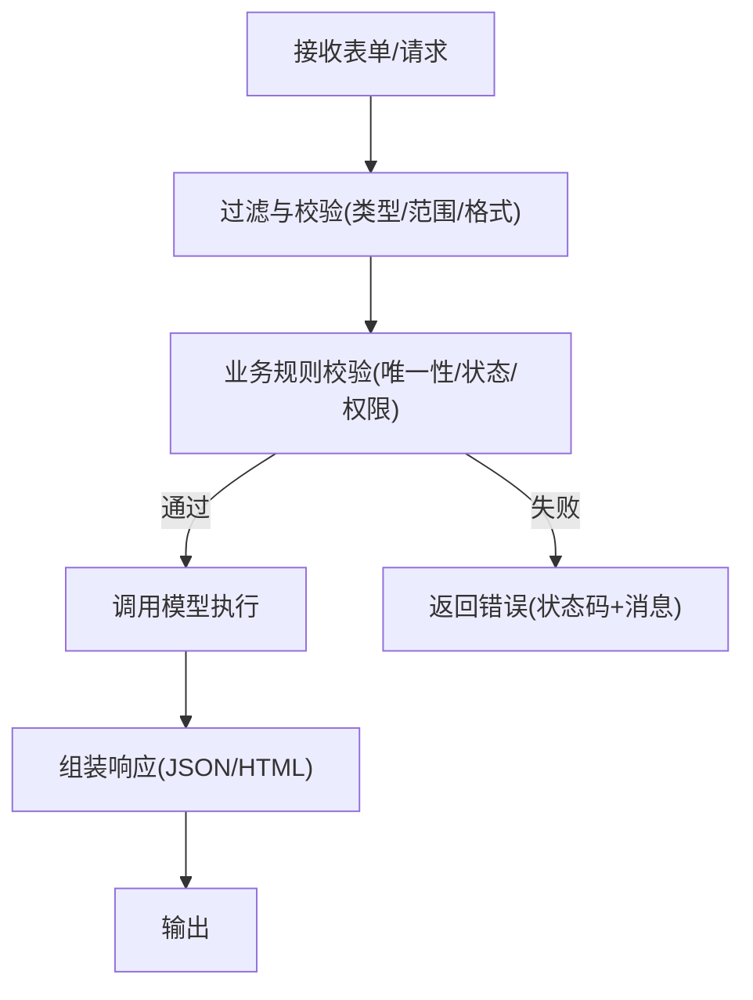
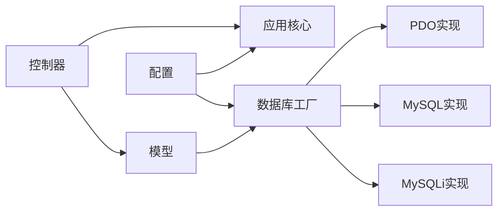

# 控制器与模型开发

<cite>
**本文引用的文件**   
- [index.php](file://index.php)
- [application.class.php](file://ryphp/core/class/application.class.php)
- [param.class.php](file://ryphp/core/class/param.class.php)
- [db_factory.class.php](file://ryphp/core/class/db_factory.class.php)
- [db_pdo.class.php](file://ryphp/core/class/db_pdo.class.php)
- [db_mysql.class.php](file://ryphp/core/class/db_mysql.class.php)
- [db_mysqli.class.php](file://ryphp/core/class/db_mysqli.class.php)
- [db_pdo_optimized.class.php](file://ryphp/core/class/db_pdo_optimized.class.php)
- [form.class.php](file://ryphp/core/class/form.class.php)
- [config.php](file://common/config/config.php)
- [index.class.php](file://application/index/controller/index.class.php)
- [index.class.php](file://application/api/controller/index.class.php)
- [admin_manage.class.php](file://application/lry_admin_center/controller/admin_manage.class.php)
- [common.class.php](file://application/lry_admin_center/controller/common.class.php)
- [admin.class.php](file://application/lry_admin_center/model/admin.class.php)
- [system.func.php](file://common/function/system.func.php)
</cite>

## 目录
1. [引言](#引言)
2. [项目结构](#项目结构)
3. [核心组件](#核心组件)
4. [架构总览](#架构总览)
5. [详细组件分析](#详细组件分析)
6. [依赖关系分析](#依赖关系分析)
7. [性能考量](#性能考量)
8. [故障排查指南](#故障排查指南)
9. [结论](#结论)
10. [附录](#附录)

## 引言
本指南面向LRYBlog控制器与模型开发，围绕以下目标展开：
- 自定义控制器开发：继承与初始化、方法重写、参数处理与路由。
- 模型类设计：数据封装、业务逻辑分离、数据校验与安全。
- 控制器与模型交互：数据传递、错误处理、响应格式。
- RESTful API设计：HTTP方法、状态码、序列化。
- 表单处理与验证：输入过滤、安全检查、错误反馈。
- 单元测试、性能监控与调试技巧。
- 开发流程、编码规范与最佳实践。

## 项目结构
LRYBlog采用模块化控制器与模型组织方式，入口文件负责应用初始化，路由参数解析后由应用核心加载对应模块的控制器与动作，数据库访问通过统一工厂与ORM风格接口完成。

**图表来源**
- [index.php:1-18](file://index.php#L1-L18)
- [application.class.php:1-118](file://ryphp/core/class/application.class.php#L1-L118)
- [param.class.php:1-195](file://ryphp/core/class/param.class.php#L1-L195)
- [db_factory.class.php:1-50](file://ryphp/core/class/db_factory.class.php#L1-L50)
- [db_pdo.class.php:1-646](file://ryphp/core/class/db_pdo.class.php#L1-L646)
- [db_mysql.class.php:1-667](file://ryphp/core/class/db_mysql.class.php#L1-L667)
- [db_mysqli.class.php:1-667](file://ryphp/core/class/db_mysqli.class.php#L1-L667)
- [db_pdo_optimized.class.php:1-646](file://ryphp/core/class/db_pdo_optimized.class.php#L1-L646)
- [form.class.php:1-325](file://ryphp/core/class/form.class.php#L1-L325)
- [config.php:1-88](file://common/config/config.php#L1-L88)

**章节来源**
- [index.php:1-18](file://index.php#L1-L18)
- [application.class.php:1-118](file://ryphp/core/class/application.class.php#L1-L118)
- [param.class.php:1-195](file://ryphp/core/class/param.class.php#L1-L195)
- [config.php:1-88](file://common/config/config.php#L1-L88)

## 核心组件
- 应用核心与路由
  - 应用核心负责错误处理、路由常量定义、控制器加载与动作调度。
  - 路由参数解析负责从URL或PATH_INFO提取模块(m)、控制器(c)、动作(a)，并对参数进行安全处理。
- 数据库层
  - 工厂模式按配置选择具体数据库实现（PDO/MySQL/MySQLi），提供统一的链式查询接口（where、field、order、limit、join、select/find/one、update/delete/insert、事务等）。
- 表单与UI
  - 表单类提供常用输入控件生成，简化后台管理界面构建。
- 配置与全局函数
  - 配置文件集中管理数据库、路由、缓存、Cookie等；系统函数提供URL生成、站点信息、栏目与模型查询等通用能力。

**章节来源**
- [application.class.php:1-118](file://ryphp/core/class/application.class.php#L1-L118)
- [param.class.php:1-195](file://ryphp/core/class/param.class.php#L1-L195)
- [db_factory.class.php:1-50](file://ryphp/core/class/db_factory.class.php#L1-L50)
- [db_pdo.class.php:1-646](file://ryphp/core/class/db_pdo.class.php#L1-L646)
- [form.class.php:1-325](file://ryphp/core/class/form.class.php#L1-L325)
- [config.php:1-88](file://common/config/config.php#L1-L88)

## 架构总览
LRYBlog遵循“入口->路由->控制器->模型/服务->响应”的典型MVC流程。控制器负责参数接收与校验、调用模型执行业务、组装响应；模型负责数据访问与业务规则；数据库层提供统一抽象。

**图表来源**
- [index.php:1-18](file://index.php#L1-L18)
- [application.class.php:1-118](file://ryphp/core/class/application.class.php#L1-L118)
- [param.class.php:1-195](file://ryphp/core/class/param.class.php#L1-L195)
- [db_factory.class.php:1-50](file://ryphp/core/class/db_factory.class.php#L1-L50)
- [db_pdo.class.php:1-646](file://ryphp/core/class/db_pdo.class.php#L1-L646)

## 详细组件分析

### 控制器开发指南
- 继承与初始化
  - 控制器类名即路由c，动作名即路由a。应用核心通过反射或类存在性加载控制器并调用动作方法。
  - 控制器可在构造函数中初始化公共逻辑（如分页参数、权限校验等）。
- 方法重写与动作
  - 动作方法通常命名为init或其他业务动作名，内部可调用模型、分页、模板等。
  - 私有/受保护动作以“_”开头会被拦截，避免直接访问。
- 参数处理
  - 路由参数经安全处理，去除危险字符，长度限制；控制器中可进一步做类型转换与范围校验。
  - 示例：分页参数从GET中读取并转换为整型，避免注入与越界。

**图表来源**
- [application.class.php:24-40](file://ryphp/core/class/application.class.php#L24-L40)
- [param.class.php:54-60](file://ryphp/core/class/param.class.php#L54-L60)

**章节来源**
- [application.class.php:1-118](file://ryphp/core/class/application.class.php#L1-L118)
- [param.class.php:1-195](file://ryphp/core/class/param.class.php#L1-L195)
- [index.class.php:1-18](file://application/index/controller/index.class.php#L1-L18)
- [index.class.php:1-22](file://application/api/controller/index.class.php#L1-L22)

### 模型设计原则
- 数据封装
  - 模型类封装对某张表或业务域的操作，对外暴露清晰的方法（如登录校验、列表查询、更新等）。
  - 使用统一的链式查询接口（where/field/order/limit/join/select/find/one/update/delete/insert）。
- 业务逻辑分离
  - 将纯数据操作与业务规则解耦，模型专注数据与规则，控制器负责参数与流程编排。
- 数据验证
  - 输入参数在控制器层进行基础校验（类型、范围、格式），模型层进行业务规则校验（唯一性、状态、权限等）。
  - 使用安全函数与预处理绑定，避免注入。

**图表来源**
- [admin.class.php:1-96](file://application/lry_admin_center/model/admin.class.php#L1-L96)

**章节来源**
- [admin.class.php:1-96](file://application/lry_admin_center/model/admin.class.php#L1-L96)
- [db_pdo.class.php:134-221](file://ryphp/core/class/db_pdo.class.php#L134-L221)
- [db_mysql.class.php:161-244](file://ryphp/core/class/db_mysql.class.php#L161-L244)

### 控制器与模型交互模式
- 数据传递
  - 控制器接收请求参数，进行校验后调用模型方法；模型返回结果或异常，控制器再组装响应。
- 错误处理
  - 应用核心提供统一错误/致命错误处理；模型层通过异常或返回状态码向上反馈。
- 响应格式
  - 管理端常见为HTML模板渲染；API端可返回JSON（如验证码接口）。

**图表来源**
- [admin_manage.class.php:11-44](file://application/lry_admin_center/controller/admin_manage.class.php#L11-L44)
- [admin.class.php:1-96](file://application/lry_admin_center/model/admin.class.php#L1-L96)
- [db_pdo.class.php:365-396](file://ryphp/core/class/db_pdo.class.php#L365-L396)

**章节来源**
- [admin_manage.class.php:1-105](file://application/lry_admin_center/controller/admin_manage.class.php#L1-L105)
- [admin.class.php:1-96](file://application/lry_admin_center/model/admin.class.php#L1-L96)

### RESTful API 设计要点
- HTTP方法使用
  - GET：查询列表/详情；POST：新增；PUT/PATCH：更新；DELETE：删除。
- 状态码管理
  - 成功：200；无内容：204；参数错误：400；未授权：401；禁止：403；未找到：404；服务器错误：500。
- 数据序列化
  - JSON作为主要序列化格式；响应包含状态码、消息与数据主体，便于前端统一处理。

[本节为概念性指导，不直接分析具体文件]

### 表单处理与数据验证
- 输入过滤
  - 路由参数安全处理；控制器中对输入进行类型转换与范围校验。
- 安全检查
  - 登录/管理端具备权限校验、Token校验、Referer校验、IP白黑名单等。
- 错误反馈
  - 统一返回结构（状态码+消息），便于前端展示。

**图表来源**
- [common.class.php:56-62](file://application/lry_admin_center/controller/common.class.php#L56-L62)
- [common.class.php:126-131](file://application/lry_admin_center/controller/common.class.php#L126-L131)
- [admin_manage.class.php:49-64](file://application/lry_admin_center/controller/admin_manage.class.php#L49-L64)

**章节来源**
- [common.class.php:1-153](file://application/lry_admin_center/controller/common.class.php#L1-L153)
- [admin_manage.class.php:1-105](file://application/lry_admin_center/controller/admin_manage.class.php#L1-L105)

### 开发示例与最佳实践
- 简单CRUD
  - 列表：控制器读取分页参数，调用模型where/limit/order/select，模板渲染。
  - 新增/更新：表单提交后控制器校验，模型insert/update，返回JSON状态。
- 复杂流程
  - 登录：模型校验用户与密码、账户锁定策略、登录日志记录；成功后写入会话与Cookie。
- 最佳实践
  - 控制器只做编排，模型只做数据与规则，避免在控制器中写业务逻辑。
  - 统一错误处理与响应格式，便于前后端协作。
  - 使用链式查询接口，避免手写SQL，提升安全性与可维护性。

**章节来源**
- [admin_manage.class.php:11-44](file://application/lry_admin_center/controller/admin_manage.class.php#L11-L44)
- [admin.class.php:1-96](file://application/lry_admin_center/model/admin.class.php#L1-L96)

## 依赖关系分析
- 控制器依赖
  - 应用核心提供路由与加载；模型通过D函数访问；视图通过模板路径加载。
- 模型依赖
  - 数据库工厂按配置选择具体实现；链式查询接口统一。
- 配置依赖
  - 数据库类型、表前缀、路由规则、缓存类型等集中配置。

**图表来源**
- [application.class.php:1-118](file://ryphp/core/class/application.class.php#L1-L118)
- [db_factory.class.php:1-50](file://ryphp/core/class/db_factory.class.php#L1-L50)
- [db_pdo.class.php:1-646](file://ryphp/core/class/db_pdo.class.php#L1-L646)
- [db_mysql.class.php:1-667](file://ryphp/core/class/db_mysql.class.php#L1-L667)
- [db_mysqli.class.php:1-667](file://ryphp/core/class/db_mysqli.class.php#L1-L667)
- [config.php:1-88](file://common/config/config.php#L1-L88)

**章节来源**
- [application.class.php:1-118](file://ryphp/core/class/application.class.php#L1-L118)
- [db_factory.class.php:1-50](file://ryphp/core/class/db_factory.class.php#L1-L50)
- [config.php:1-88](file://common/config/config.php#L1-L88)

## 性能考量
- 数据库访问
  - 使用链式查询接口，避免全表扫描；合理使用索引字段参与where与join。
  - 分页查询使用limit与order，避免一次性加载大量数据。
- 缓存
  - 配置文件提供多种缓存类型（文件/Redis/Memcache），可针对热点数据启用缓存。
- 调试与监控
  - 开启调试模式可输出SQL与耗时；生产环境建议关闭调试并记录错误日志。

[本节为通用指导，不直接分析具体文件]

## 故障排查指南
- 路由错误
  - 检查URL模式与路由映射配置；确认m/c/a参数合法且未被过滤。
- 控制器错误
  - 确认控制器类与动作存在；避免以“_”开头的动作被直接访问。
- 数据库错误
  - 查看错误日志与调试输出；核对表前缀、连接参数与SQL语法。
- 权限与Token
  - 管理端需登录态与Token一致；Referer校验失败将被拒绝。

**章节来源**
- [application.class.php:108-115](file://ryphp/core/class/application.class.php#L108-L115)
- [common.class.php:32-49](file://application/lry_admin_center/controller/common.class.php#L32-L49)
- [common.class.php:126-131](file://application/lry_admin_center/controller/common.class.php#L126-L131)

## 结论
通过统一的应用核心、路由解析、数据库抽象与表单工具，LRYBlog提供了清晰的控制器与模型开发框架。遵循本文的开发流程、编码规范与最佳实践，可高效构建稳定、可维护的业务系统。

## 附录
- 常用函数参考
  - URL生成、站点信息、栏目与模型查询等函数位于系统函数文件中，便于在控制器与模板中复用。
- 配置项参考
  - 数据库、路由、缓存、Cookie、上传等配置集中在配置文件，按需调整。

**章节来源**
- [system.func.php:1-969](file://common/function/system.func.php#L1-L969)
- [config.php:1-88](file://common/config/config.php#L1-L88)