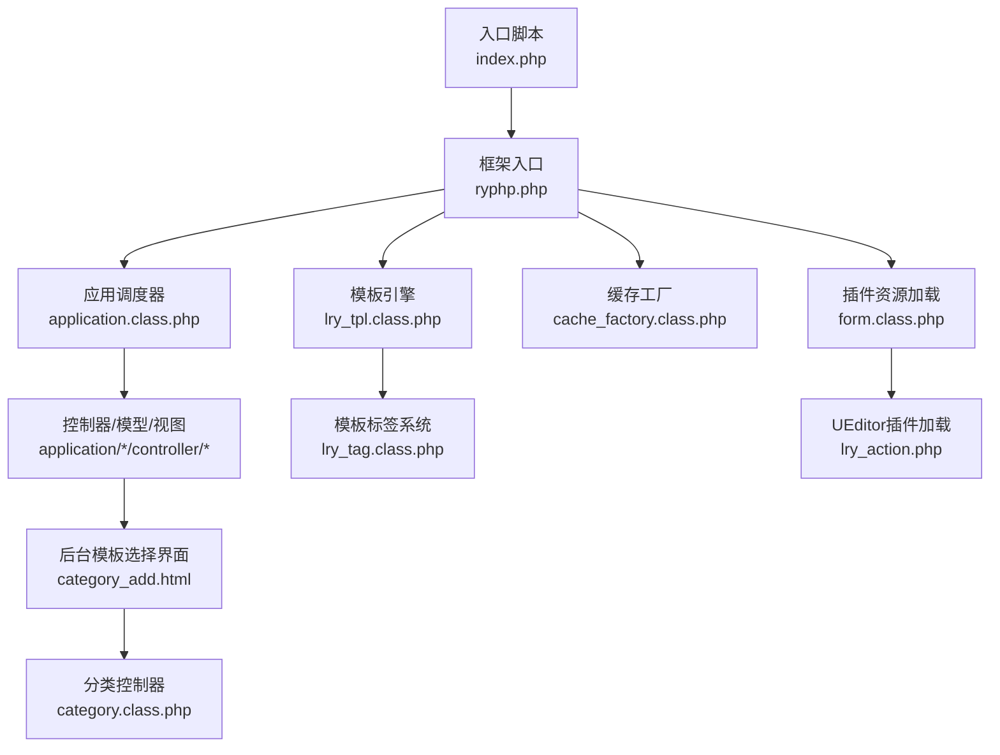
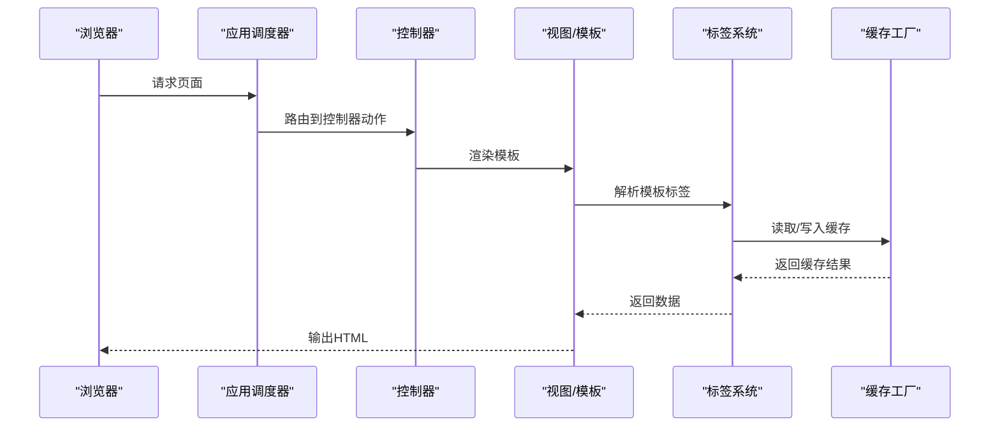
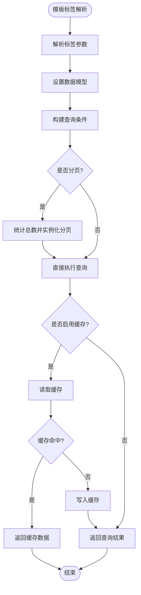
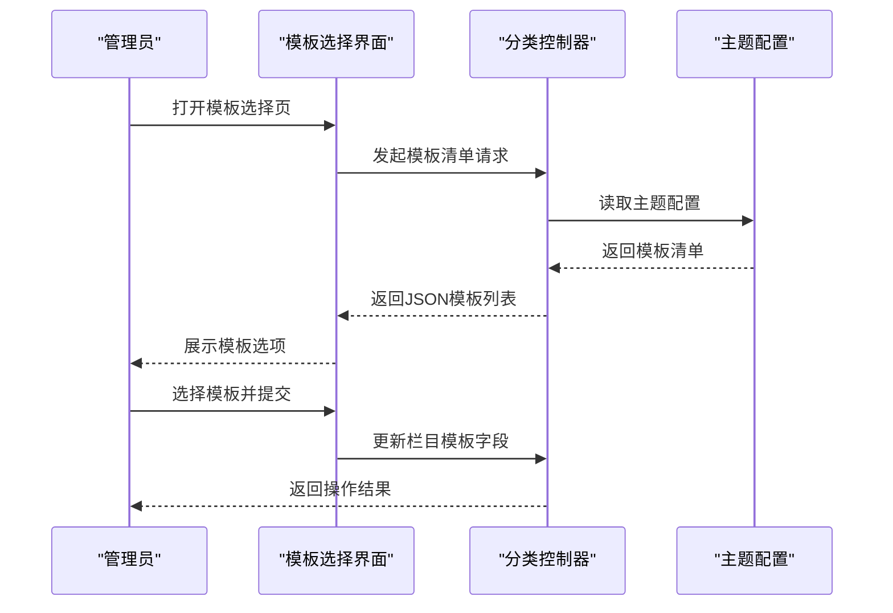
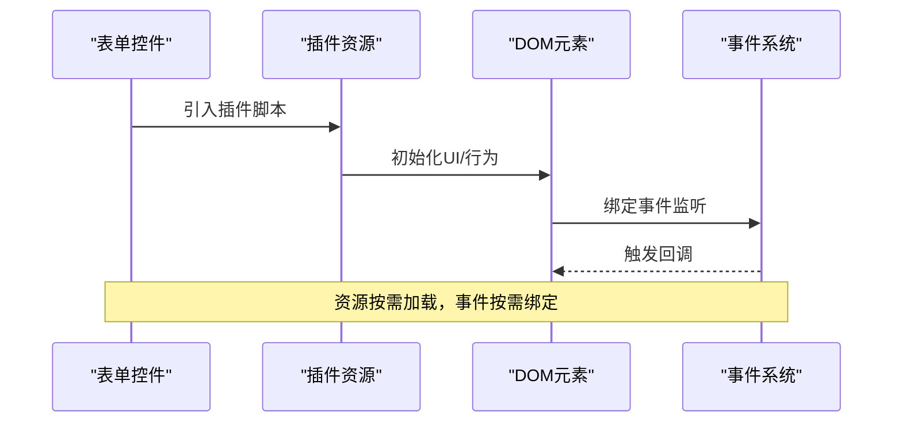
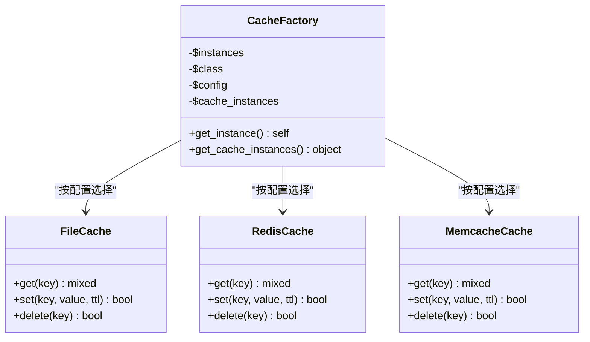
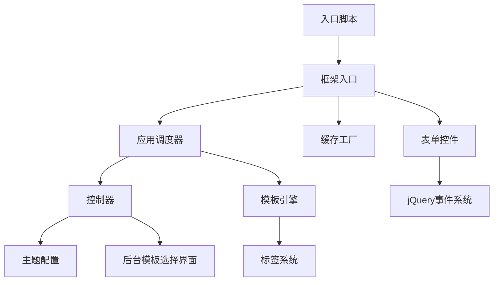

# 插件机制

<cite>
**本文引用的文件**
- [index.php](file://index.php)
- [ryphp.php](file://ryphp/ryphp.php)
- [application.class.php](file://ryphp/core/class/application.class.php)
- [lry_tpl.class.php](file://ryphp/core/class/lry_tpl.class.php)
- [lry_tag.class.php](file://ryphp/core/class/lry_tag.class.php)
- [cache_factory.class.php](file://ryphp/core/class/cache_factory.class.php)
- [form.class.php](file://ryphp/core/class/form.class.php)
- [config.php](file://application/index/view/rongyao/config.php)
- [category_add.html](file://application/lry_admin_center/view/category_add.html)
- [category.class.php](file://application/lry_admin_center/controller/category.class.php)
- [version.php](file://common/data/version.php)
- [jquery-1.11.0.js](file://common/static/vip/js/jquery-1.11.0.js)
- [lry_action.php](file://common/static/plugin/ueditor/php/lry_action.php)
</cite>

## 目录
1. [简介](#简介)
2. [项目结构](#项目结构)
3. [核心组件](#核心组件)
4. [架构总览](#架构总览)
5. [详细组件分析](#详细组件分析)
6. [依赖分析](#依赖分析)
7. [性能考量](#性能考量)
8. [故障排查指南](#故障排查指南)
9. [结论](#结论)
10. [附录](#附录)

## 简介
本文件面向LRYBlog（基于RYPHP框架）的插件与扩展体系，系统化梳理其“插件机制”的设计原理、架构模式与实现路径。重点覆盖以下方面：
- 插件系统与钩子/事件监听的映射关系
- 插件生命周期与注册加载顺序
- 插件与核心系统的交互方式（模板标签、表单控件、缓存工厂等）
- 不同类型插件的开发方法：系统钩子插件、模板插件、数据处理插件
- 完整开发示例（从简单到复杂）
- 插件配置管理、版本兼容性与依赖检查
- 调试技巧、性能优化与安全注意事项
- 开发工作流程与最佳实践

## 项目结构
LRYBlog以RYPHP为核心框架，入口通过单一入口脚本引导应用初始化；模板系统支持自定义主题与模板标签；后台管理界面提供模板选择与绑定能力；插件资源通过静态目录集中管理。

**图表来源**
- [index.php:1-18](file://index.php#L1-L18)
- [ryphp.php:83-204](file://ryphp/ryphp.php#L83-L204)
- [application.class.php:1-118](file://ryphp/core/class/application.class.php#L1-L118)
- [lry_tpl.class.php:1-134](file://ryphp/core/class/lry_tpl.class.php#L1-L134)
- [lry_tag.class.php:1-492](file://ryphp/core/class/lry_tag.class.php#L1-L492)
- [cache_factory.class.php:1-84](file://ryphp/core/class/cache_factory.class.php#L1-L84)
- [category_add.html:229-265](file://application/lry_admin_center/view/category_add.html#L229-L265)
- [category.class.php:236-332](file://application/lry_admin_center/controller/category.class.php#L236-L332)
- [form.class.php:160](file://ryphp/core/class/form.class.php#L160)
- [lry_action.php:56-94](file://common/static/plugin/ueditor/php/lry_action.php#L56-L94)

**章节来源**
- [index.php:1-18](file://index.php#L1-L18)
- [ryphp.php:34-81](file://ryphp/ryphp.php#L34-L81)

## 核心组件
- 应用入口与初始化
  - 单一入口引导框架初始化，定义基础常量与静态资源URL，随后委派给应用调度器。
- 应用调度器
  - 负责路由参数解析、控制器加载与动作执行，并在调试模式下输出调试信息。
- 模板引擎与标签系统
  - 模板引擎负责将模板语法转换为可执行PHP代码；标签系统提供数据聚合与分页能力。
- 缓存工厂
  - 基于配置动态选择缓存实现（文件/Redis/Memcache），统一对外提供缓存接口。
- 表单控件与插件资源
  - 表单控件在渲染时按需引入第三方插件（如编辑器、日期控件），体现插件资源的集成方式。
- 后台模板选择
  - 后台界面通过AJAX获取主题模板清单并进行选择绑定，体现模板插件的注册与使用。

**章节来源**
- [application.class.php:9-40](file://ryphp/core/class/application.class.php#L9-L40)
- [lry_tpl.class.php:31-92](file://ryphp/core/class/lry_tpl.class.php#L31-L92)
- [lry_tag.class.php:18-65](file://ryphp/core/class/lry_tag.class.php#L18-L65)
- [cache_factory.class.php:36-82](file://ryphp/core/class/cache_factory.class.php#L36-L82)
- [form.class.php:160](file://ryphp/core/class/form.class.php#L160)
- [category_add.html:229-265](file://application/lry_admin_center/view/category_add.html#L229-L265)

## 架构总览
LRYBlog的插件机制并非传统意义上的“钩子/事件系统”，而是通过以下方式实现扩展：
- 模板标签系统：通过模板语法触发标签方法，实现数据层扩展。
- 主题模板：通过主题目录与配置文件注册模板集合，实现视图层扩展。
- 插件资源：通过表单控件按需加载第三方插件（如编辑器），实现前端/富文本扩展。
- 缓存策略：通过缓存工厂抽象不同后端，实现数据层扩展。

**图表来源**
- [application.class.php:24-40](file://ryphp/core/class/application.class.php#L24-L40)
- [lry_tpl.class.php:31-92](file://ryphp/core/class/lry_tpl.class.php#L31-L92)
- [lry_tag.class.php:18-65](file://ryphp/core/class/lry_tag.class.php#L18-L65)
- [cache_factory.class.php:77-82](file://ryphp/core/class/cache_factory.class.php#L77-L82)

## 详细组件分析

### 组件A：模板标签系统（数据处理插件）
- 设计要点
  - 模板标签语法解析：模板引擎将标签语法转换为对标签系统的调用。
  - 标签方法职责：封装数据查询、聚合、分页等逻辑，统一返回数组或对象。
  - 缓存集成：标签系统可结合缓存工厂实现数据缓存。
- 关键流程
  - 模板解析 → 标签回调 → 数据查询 → 分页计算 → 结果返回。
- 复杂度与性能
  - 查询复杂度取决于标签参数与数据库索引；建议合理使用分页与缓存。
- 安全与健壮性
  - 对输入参数进行校验与转义；避免SQL注入；对空结果进行判空处理。

**图表来源**
- [lry_tpl.class.php:70-92](file://ryphp/core/class/lry_tpl.class.php#L70-L92)
- [lry_tag.class.php:18-65](file://ryphp/core/class/lry_tag.class.php#L18-L65)
- [cache_factory.class.php:36-82](file://ryphp/core/class/cache_factory.class.php#L36-L82)

**章节来源**
- [lry_tpl.class.php:31-92](file://ryphp/core/class/lry_tpl.class.php#L31-L92)
- [lry_tag.class.php:18-65](file://ryphp/core/class/lry_tag.class.php#L18-L65)

### 组件B：主题模板系统（模板插件）
- 注册方式
  - 在主题目录下提供配置文件，声明各类模板（分类、列表、内容）。
- 使用方式
  - 后台界面通过AJAX获取模板清单，供管理员选择绑定至栏目。
- 生命周期
  - 安装/启用：配置文件生效；禁用：模板不可选。
- 交互方式
  - 前端通过模板选择界面与控制器交互，控制器根据选择更新栏目模板字段。

**图表来源**
- [config.php:1-29](file://application/index/view/rongyao/config.php#L1-L29)
- [category_add.html:229-265](file://application/lry_admin_center/view/category_add.html#L229-L265)
- [category.class.php:236-332](file://application/lry_admin_center/controller/category.class.php#L236-L332)

**章节来源**
- [config.php:1-29](file://application/index/view/rongyao/config.php#L1-L29)
- [category_add.html:229-265](file://application/lry_admin_center/view/category_add.html#L229-L265)
- [category.class.php:236-332](file://application/lry_admin_center/controller/category.class.php#L236-L332)

### 组件C：插件资源加载（系统钩子/事件插件）
- 资源加载
  - 表单控件在渲染时按需引入第三方插件（如编辑器、日期控件），体现“钩子”式资源注入。
- 事件监听
  - 前端可通过jQuery事件系统（回调列表）实现事件监听与处理。
- 生命周期
  - 页面渲染前注入；页面销毁时清理（如移除事件监听）。

**图表来源**
- [form.class.php:160](file://ryphp/core/class/form.class.php#L160)
- [jquery-1.11.0.js:3066-3228](file://common/static/vip/js/jquery-1.11.0.js#L3066-L3228)
- [lry_action.php:56-94](file://common/static/plugin/ueditor/php/lry_action.php#L56-L94)

**章节来源**
- [form.class.php:160](file://ryphp/core/class/form.class.php#L160)
- [jquery-1.11.0.js:3066-3228](file://common/static/vip/js/jquery-1.11.0.js#L3066-L3228)
- [lry_action.php:56-94](file://common/static/plugin/ueditor/php/lry_action.php#L56-L94)

### 组件D：缓存工厂（数据处理插件）
- 设计要点
  - 工厂模式按配置选择具体缓存实现（文件/Redis/Memcache）。
  - 单例持有缓存实例，延迟初始化。
- 生命周期
  - 应用启动时初始化；按需获取实例；随应用结束释放。
- 性能影响
  - 合理选择缓存介质；注意序列化/反序列化成本；设置过期策略。

**图表来源**
- [cache_factory.class.php:36-82](file://ryphp/core/class/cache_factory.class.php#L36-L82)

**章节来源**
- [cache_factory.class.php:36-82](file://ryphp/core/class/cache_factory.class.php#L36-L82)

## 依赖分析
- 入口与框架
  - 入口脚本依赖框架入口；框架入口加载公共函数与版本信息，定义全局常量。
- 应用调度与模板
  - 应用调度器依赖参数解析与控制器加载；模板引擎依赖标签系统与缓存工厂。
- 后台与模板
  - 后台模板选择依赖主题配置；控制器负责模板字段更新。
- 插件资源
  - 表单控件依赖静态资源URL；前端事件系统依赖jQuery回调机制。

**图表来源**
- [index.php:10-18](file://index.php#L10-L18)
- [ryphp.php:34-81](file://ryphp/ryphp.php#L34-L81)
- [application.class.php:9-40](file://ryphp/core/class/application.class.php#L9-L40)
- [lry_tpl.class.php:31-92](file://ryphp/core/class/lry_tpl.class.php#L31-L92)
- [lry_tag.class.php:18-65](file://ryphp/core/class/lry_tag.class.php#L18-L65)
- [cache_factory.class.php:36-82](file://ryphp/core/class/cache_factory.class.php#L36-L82)
- [category_add.html:229-265](file://application/lry_admin_center/view/category_add.html#L229-L265)
- [category.class.php:236-332](file://application/lry_admin_center/controller/category.class.php#L236-L332)
- [form.class.php:160](file://ryphp/core/class/form.class.php#L160)
- [jquery-1.11.0.js:3066-3228](file://common/static/vip/js/jquery-1.11.0.js#L3066-L3228)

**章节来源**
- [ryphp.php:34-81](file://ryphp/ryphp.php#L34-L81)
- [application.class.php:9-40](file://ryphp/core/class/application.class.php#L9-L40)

## 性能考量
- 模板标签
  - 合理使用分页与缓存；避免N+1查询；对高频标签设置合适TTL。
- 缓存策略
  - 选择合适的缓存介质；批量读写；注意键命名规范与过期策略。
- 插件资源
  - 按需加载，避免不必要的脚本引入；减少DOM事件绑定数量。
- 前端事件
  - 使用事件委托；及时解绑；避免重复绑定。

## 故障排查指南
- 调试模式
  - 应用调度器在调试模式下输出详细错误信息，便于定位问题。
- 版本与兼容
  - 通过版本文件确认系统版本；确保插件与系统版本匹配。
- 常见问题
  - 模板标签未生效：检查标签语法与参数；确认缓存状态。
  - 插件资源未加载：检查静态URL与路径；确认引入顺序。
  - 后台模板选择异常：检查主题配置文件与控制器逻辑。

**章节来源**
- [application.class.php:93-115](file://ryphp/core/class/application.class.php#L93-L115)
- [version.php:1-4](file://common/data/version.php#L1-L4)

## 结论
LRYBlog的插件机制以“模板标签 + 主题模板 + 插件资源 + 缓存工厂”为核心，形成从视图到数据的多层扩展能力。虽然未提供显式的钩子/事件系统，但通过上述组件的协作，已能满足大多数扩展需求。建议在实际开发中遵循配置驱动、按需加载、缓存优先与安全可控的原则，确保插件的稳定性与可维护性。

## 附录

### 开发工作流程与最佳实践
- 模板插件
  - 在主题目录提供配置文件，声明模板集合；在后台界面展示并绑定。
- 数据处理插件
  - 在标签系统中新增标签方法；合理使用分页与缓存；做好参数校验。
- 系统钩子/事件插件
  - 在表单控件中按需引入插件；利用前端事件系统实现交互；注意资源加载时机。
- 配置管理
  - 使用配置文件集中管理插件元信息；版本号与兼容性检查纳入CI流程。
- 调试与测试
  - 开启调试模式定位问题；对关键路径增加日志；对插件进行单元测试与集成测试。
- 安全与合规
  - 输入参数严格校验；防止XSS与SQL注入；遵守开源许可与版权要求。