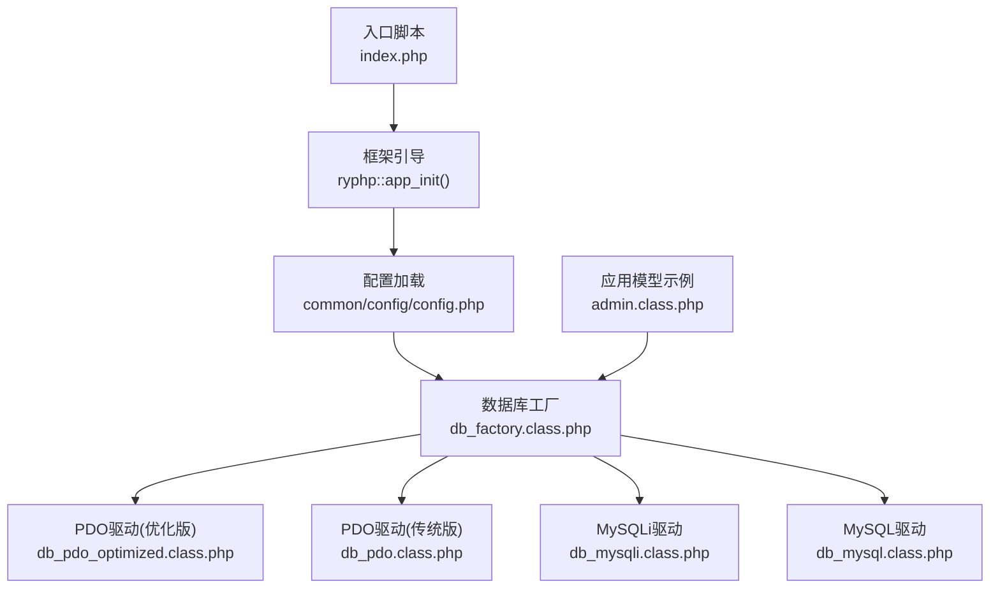
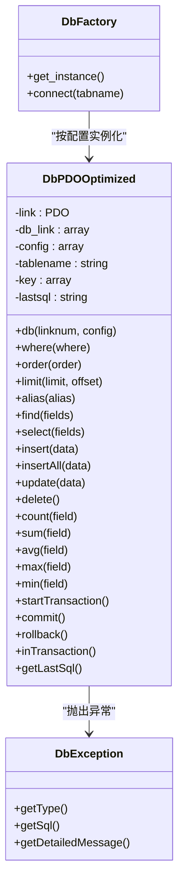
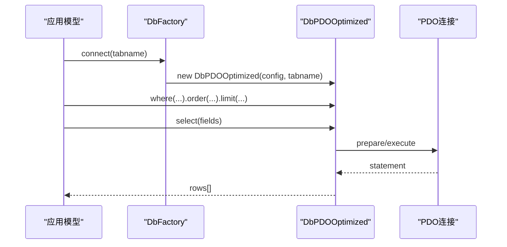
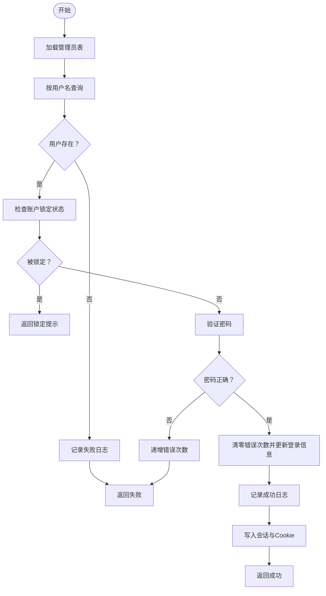
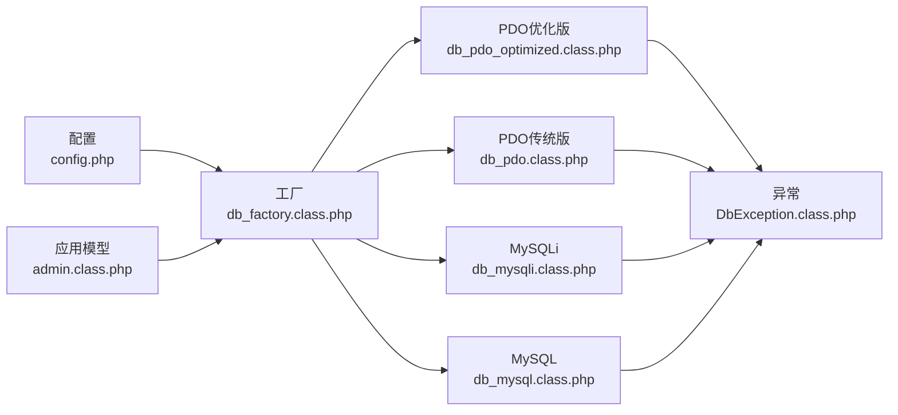

# 数据库扩展

<cite>
**本文引用的文件列表**
- [common/config/config.php](file://common/config/config.php)
- [ryphp/core/class/db_factory.class.php](file://ryphp/core/class/db_factory.class.php)
- [ryphp/core/class/db_mysql.class.php](file://ryphp/core/class/db_mysql.class.php)
- [ryphp/core/class/db_mysqli.class.php](file://ryphp/core/class/db_mysqli.class.php)
- [ryphp/core/class/db_pdo.class.php](file://ryphp/core/class/db_pdo.class.php)
- [ryphp/core/class/db_pdo_optimized.class.php](file://ryphp/core/class/db_pdo_optimized.class.php)
- [ryphp/core/class/DbException.class.php](file://ryphp/core/class/DbException.class.php)
- [application/lry_admin_center/model/admin.class.php](file://application/lry_admin_center/model/admin.class.php)
- [application/install/index.php](file://application/install/index.php)
- [index.php](file://index.php)
</cite>

## 目录
1. [简介](#简介)
2. [项目结构](#项目结构)
3. [核心组件](#核心组件)
4. [架构总览](#架构总览)
5. [详细组件分析](#详细组件分析)
6. [依赖分析](#依赖分析)
7. [性能考量](#性能考量)
8. [故障排查指南](#故障排查指南)
9. [结论](#结论)
10. [附录](#附录)

## 简介
本指南面向LRYBlog数据库扩展开发，围绕以下目标展开：
- 新表结构设计最佳实践：字段定义、索引设计、约束设置
- 自定义模型类开发流程：继承关系、方法重写、数据验证规则
- 数据库迁移机制：版本升级与结构变更处理
- 多数据库支持扩展：新驱动集成与配置管理
- 完整扩展示例：从简单表扩展到复杂关系查询优化
- 连接池管理、事务处理与并发控制
- 性能优化：查询缓存与索引策略
- 测试方法与部署注意事项

## 项目结构
LRYBlog采用“框架内核 + 应用层”的分层架构。数据库层由统一工厂类按配置选择具体驱动实现，应用层通过D函数便捷访问数据表。

图示来源
- [index.php:10-18](file://index.php#L10-L18)
- [common/config/config.php:13-22](file://common/config/config.php#L13-L22)
- [ryphp/core/class/db_factory.class.php:11-50](file://ryphp/core/class/db_factory.class.php#L11-L50)
- [ryphp/core/class/db_pdo_optimized.class.php:13-80](file://ryphp/core/class/db_pdo_optimized.class.php#L13-L80)
- [ryphp/core/class/db_pdo.class.php:26-42](file://ryphp/core/class/db_pdo.class.php#L26-L42)
- [ryphp/core/class/db_mysqli.class.php:23-46](file://ryphp/core/class/db_mysqli.class.php#L23-L46)
- [ryphp/core/class/db_mysql.class.php:23-49](file://ryphp/core/class/db_mysql.class.php#L23-L49)
- [application/lry_admin_center/model/admin.class.php:4-27](file://application/lry_admin_center/model/admin.class.php#L4-L27)

章节来源
- [index.php:10-18](file://index.php#L10-L18)
- [common/config/config.php:13-22](file://common/config/config.php#L13-L22)
- [ryphp/core/class/db_factory.class.php:11-50](file://ryphp/core/class/db_factory.class.php#L11-L50)

## 核心组件
- 数据库配置中心：集中管理数据库类型、主机、账号、字符集、表前缀等
- 工厂类：根据配置动态加载并实例化具体驱动
- 驱动实现：PDO(含优化版)、MySQLi、MySQL三大驱动，均支持连接池、事务、元数据查询
- 异常体系：DbException统一捕获与上报
- 应用模型：以admin模型为例，展示如何封装业务逻辑与数据访问

章节来源
- [common/config/config.php:13-22](file://common/config/config.php#L13-L22)
- [ryphp/core/class/db_factory.class.php:11-50](file://ryphp/core/class/db_factory.class.php#L11-L50)
- [ryphp/core/class/db_pdo_optimized.class.php:13-80](file://ryphp/core/class/db_pdo_optimized.class.php#L13-L80)
- [ryphp/core/class/DbException.class.php:10-73](file://ryphp/core/class/DbException.class.php#L10-L73)
- [application/lry_admin_center/model/admin.class.php:4-27](file://application/lry_admin_center/model/admin.class.php#L4-L27)

## 架构总览
数据库层通过工厂类按配置选择驱动，驱动内部维护连接池与事务状态，应用层通过D函数访问表级接口，实现链式构建SQL与执行。

图示来源
- [ryphp/core/class/db_factory.class.php:11-50](file://ryphp/core/class/db_factory.class.php#L11-L50)
- [ryphp/core/class/db_pdo_optimized.class.php:13-80](file://ryphp/core/class/db_pdo_optimized.class.php#L13-L80)
- [ryphp/core/class/DbException.class.php:10-73](file://ryphp/core/class/DbException.class.php#L10-L73)

## 详细组件分析

### 数据库配置与工厂
- 配置项要点：db_type、db_host、db_user、db_pwd、db_name、db_port、db_charset、db_prefix
- 工厂选择：根据db_type加载对应驱动类；默认回退到mysql
- 连接池：db_link按连接号维护连接与配置快照

章节来源
- [common/config/config.php:13-22](file://common/config/config.php#L13-L22)
- [ryphp/core/class/db_factory.class.php:14-31](file://ryphp/core/class/db_factory.class.php#L14-L31)
- [ryphp/core/class/db_factory.class.php:38-49](file://ryphp/core/class/db_factory.class.php#L38-L49)

### PDO驱动(优化版)核心能力
- 连接与池化：构造时懒加载，db方法支持多连接号；断线自动重连
- 链式构建：where/order/limit/alias/select/find/update/delete/count/聚合等
- 事务：startTransaction/commit/rollback/inTransaction
- 元数据：get_primary/list_tables/get_fields/table_exists/field_exists/version/close
- 异常：统一DbException，支持类型与SQL上下文

图示来源
- [ryphp/core/class/db_factory.class.php:38-49](file://ryphp/core/class/db_factory.class.php#L38-L49)
- [ryphp/core/class/db_pdo_optimized.class.php:406-435](file://ryphp/core/class/db_pdo_optimized.class.php#L406-L435)
- [ryphp/core/class/db_pdo_optimized.class.php:180-208](file://ryphp/core/class/db_pdo_optimized.class.php#L180-L208)

章节来源
- [ryphp/core/class/db_pdo_optimized.class.php:13-80](file://ryphp/core/class/db_pdo_optimized.class.php#L13-L80)
- [ryphp/core/class/db_pdo_optimized.class.php:406-435](file://ryphp/core/class/db_pdo_optimized.class.php#L406-L435)
- [ryphp/core/class/db_pdo_optimized.class.php:504-538](file://ryphp/core/class/db_pdo_optimized.class.php#L504-L538)
- [ryphp/core/class/db_pdo_optimized.class.php:544-567](file://ryphp/core/class/db_pdo_optimized.class.php#L544-L567)
- [ryphp/core/class/db_pdo_optimized.class.php:574-594](file://ryphp/core/class/db_pdo_optimized.class.php#L574-L594)
- [ryphp/core/class/db_pdo_optimized.class.php:708-758](file://ryphp/core/class/db_pdo_optimized.class.php#L708-L758)

### 传统PDO与MySQLi驱动对比
- 共同点：均支持连接池、事务、元数据查询、链式构建
- 差异点：
  - MySQLi：更贴近MySQL特性，支持原生属性与方法
  - 传统PDO：兼容性更强，但功能相对简化
  - 优化版PDO：增强型API、异常体系、绑定参数、事务状态跟踪

章节来源
- [ryphp/core/class/db_pdo.class.php:26-42](file://ryphp/core/class/db_pdo.class.php#L26-L42)
- [ryphp/core/class/db_mysqli.class.php:23-46](file://ryphp/core/class/db_mysqli.class.php#L23-L46)
- [ryphp/core/class/db_mysql.class.php:23-49](file://ryphp/core/class/db_mysql.class.php#L23-L49)

### 应用模型示例：登录校验
admin模型展示了典型的数据访问与业务封装：
- 通过D函数获取表对象
- 使用where/find/field/order/one等链式方法
- 在成功/失败场景中分别更新与记录日志

图示来源
- [application/lry_admin_center/model/admin.class.php:4-27](file://application/lry_admin_center/model/admin.class.php#L4-L27)
- [application/lry_admin_center/model/admin.class.php:29-38](file://application/lry_admin_center/model/admin.class.php#L29-L38)
- [application/lry_admin_center/model/admin.class.php:40-65](file://application/lry_admin_center/model/admin.class.php#L40-L65)
- [application/lry_admin_center/model/admin.class.php:67-95](file://application/lry_admin_center/model/admin.class.php#L67-L95)

章节来源
- [application/lry_admin_center/model/admin.class.php:4-27](file://application/lry_admin_center/model/admin.class.php#L4-L27)
- [application/lry_admin_center/model/admin.class.php:29-38](file://application/lry_admin_center/model/admin.class.php#L29-L38)
- [application/lry_admin_center/model/admin.class.php:40-65](file://application/lry_admin_center/model/admin.class.php#L40-L65)
- [application/lry_admin_center/model/admin.class.php:67-95](file://application/lry_admin_center/model/admin.class.php#L67-L95)

### 数据库迁移机制
- 安装流程：安装脚本通过PDO连接数据库，检测/创建数据库，按顺序执行SQL语句，支持引擎与字符集适配
- 迁移策略：建议采用“版本化SQL脚本 + 记录版本号”的方式，确保可重复执行与幂等

章节来源
- [application/install/index.php:162-222](file://application/install/index.php#L162-L222)

## 依赖分析
- 配置依赖：db_type决定驱动加载；db_prefix贯穿所有表名拼接
- 工厂依赖：工厂类对驱动类的静态加载与实例化
- 驱动依赖：PDO/MySQLi底层扩展；异常类提供统一错误处理
- 应用依赖：模型通过D函数间接依赖工厂与驱动

图示来源
- [common/config/config.php:13-22](file://common/config/config.php#L13-L22)
- [ryphp/core/class/db_factory.class.php:11-50](file://ryphp/core/class/db_factory.class.php#L11-L50)
- [ryphp/core/class/db_pdo_optimized.class.php:13-80](file://ryphp/core/class/db_pdo_optimized.class.php#L13-L80)
- [ryphp/core/class/db_pdo.class.php:26-42](file://ryphp/core/class/db_pdo.class.php#L26-L42)
- [ryphp/core/class/db_mysqli.class.php:23-46](file://ryphp/core/class/db_mysqli.class.php#L23-L46)
- [ryphp/core/class/db_mysql.class.php:23-49](file://ryphp/core/class/db_mysql.class.php#L23-L49)
- [ryphp/core/class/DbException.class.php:10-73](file://ryphp/core/class/DbException.class.php#L10-L73)
- [application/lry_admin_center/model/admin.class.php:4-27](file://application/lry_admin_center/model/admin.class.php#L4-L27)

## 性能考量
- 连接池与复用：驱动内部维护db_link，避免重复建立连接
- 预处理与绑定：优化版PDO支持绑定参数，减少SQL注入风险与解析开销
- 事务批处理：合理使用事务减少提交次数；批量插入使用insertAll
- 索引与查询：遵循“覆盖索引 + 最左匹配 + 避免函数运算在索引上”原则；必要时使用EXPLAIN分析
- 缓存策略：结合系统缓存配置，对热点查询结果进行缓存

## 故障排查指南
- 连接失败：检查db_host/db_port/db_user/db_pwd/db_name/db_charset；确认db_type与PHP扩展匹配
- 断线重连：驱动内置“server has gone away”自动重连逻辑
- 异常定位：DbException提供类型与SQL上下文，便于快速定位问题
- 安装/迁移失败：查看安装脚本的错误日志与JSON反馈，逐条SQL排查

章节来源
- [ryphp/core/class/db_pdo_optimized.class.php:180-208](file://ryphp/core/class/db_pdo_optimized.class.php#L180-L208)
- [ryphp/core/class/DbException.class.php:10-73](file://ryphp/core/class/DbException.class.php#L10-L73)
- [application/install/index.php:162-222](file://application/install/index.php#L162-L222)

## 结论
LRYBlog数据库层提供了清晰的工厂-驱动架构与完善的异常体系，既保证了易用性也兼顾了扩展性。开发者可在现有基础上：
- 规范表结构设计与索引策略
- 通过优化版PDO驱动提升查询与事务性能
- 以admin模型为模板封装业务逻辑
- 采用版本化SQL脚本进行数据库迁移
- 结合缓存与监控工具持续优化

## 附录

### 新表结构设计最佳实践
- 字段定义
  - 主键：自增整型，命名统一为id
  - 时间戳：created_at/updated_at，使用TIMESTAMP或DATETIME
  - 状态位：tinyint枚举，预留扩展空间
  - 文本字段：大文本使用TEXT，短文本使用VARCHAR并设置合理长度
- 索引设计
  - 唯一键：UNIQUE KEY覆盖高频唯一查询
  - 聚簇索引：优先考虑主键与常用过滤字段组合
  - 复合索引：遵循最左匹配原则，避免过多冗余索引
- 约束设置
  - NOT NULL + 默认值，减少空值歧义
  - ENUM/SET限定取值范围
  - 外键约束配合合适索引，保证参照完整性

### 自定义模型类开发流程
- 继承关系：直接使用D函数获取表对象，无需显式继承
- 方法重写：通过链式方法where/order/limit等组合查询；必要时封装复合查询为方法
- 数据验证：在业务层对输入参数进行校验，再交给驱动执行

章节来源
- [application/lry_admin_center/model/admin.class.php:4-27](file://application/lry_admin_center/model/admin.class.php#L4-L27)

### 数据库迁移机制
- 版本化脚本：按版本号命名SQL文件，记录已执行版本
- 幂等执行：先检测表/字段是否存在，再决定CREATE/ALTER
- 回滚策略：保留备份与回滚脚本，确保可逆

章节来源
- [application/install/index.php:162-222](file://application/install/index.php#L162-L222)

### 多数据库支持扩展方法
- 新驱动集成：仿照db_pdo_optimized.class.php实现db方法、execute、事务、元数据等核心接口
- 配置管理：在配置中新增db_type选项，工厂类中新增case分支
- 兼容性测试：覆盖连接、查询、事务、异常等场景

章节来源
- [ryphp/core/class/db_factory.class.php:14-31](file://ryphp/core/class/db_factory.class.php#L14-L31)
- [ryphp/core/class/db_pdo_optimized.class.php:106-119](file://ryphp/core/class/db_pdo_optimized.class.php#L106-L119)

### 数据库连接池管理、事务处理与并发控制
- 连接池：利用db方法按连接号管理多连接
- 事务：startTransaction/commit/rollback成对使用，避免长事务
- 并发控制：使用SELECT ... FOR UPDATE或悲观锁；或基于业务重试与补偿

章节来源
- [ryphp/core/class/db_pdo_optimized.class.php:708-758](file://ryphp/core/class/db_pdo_optimized.class.php#L708-L758)

### 数据库性能优化、查询缓存与索引策略
- 查询缓存：结合系统缓存配置，对热点数据进行缓存
- 索引策略：覆盖查询字段、避免全表扫描；定期分析慢查询日志
- 批量操作：使用insertAll与事务合并提交

章节来源
- [common/config/config.php:39-66](file://common/config/config.php#L39-L66)
- [ryphp/core/class/db_pdo_optimized.class.php:470-497](file://ryphp/core/class/db_pdo_optimized.class.php#L470-L497)
- [ryphp/core/class/db_pdo_optimized.class.php:504-538](file://ryphp/core/class/db_pdo_optimized.class.php#L504-L538)

### 测试方法与部署注意事项
- 测试方法：单元测试覆盖关键查询与事务；压力测试评估连接池与索引效果
- 部署注意事项：生产环境关闭调试模式；严格管理数据库凭据；定期备份与演练恢复