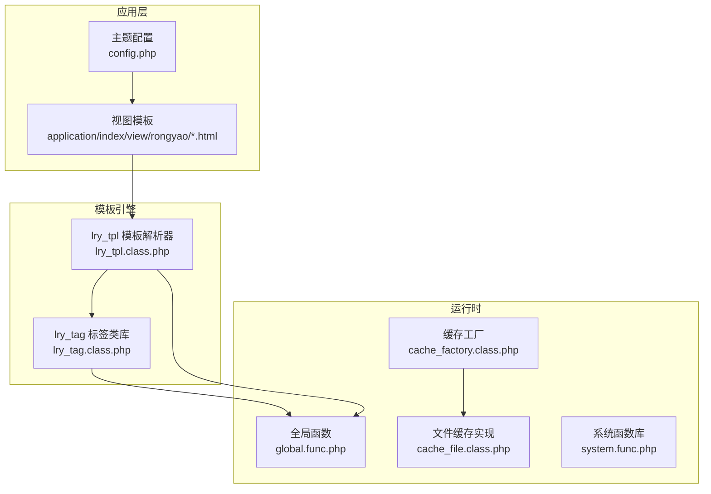
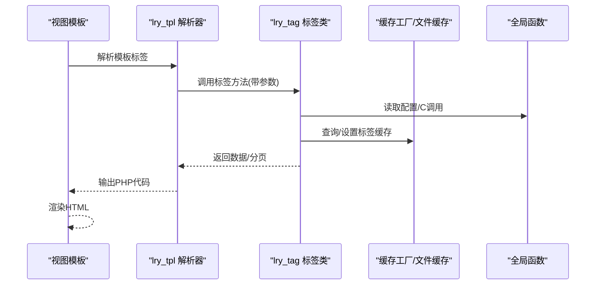
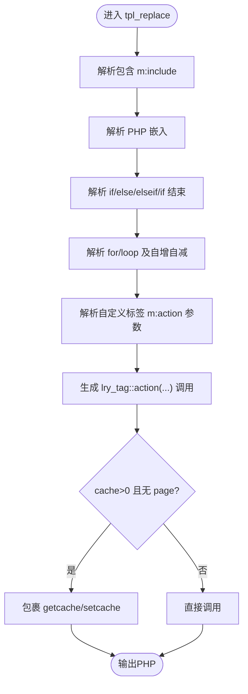
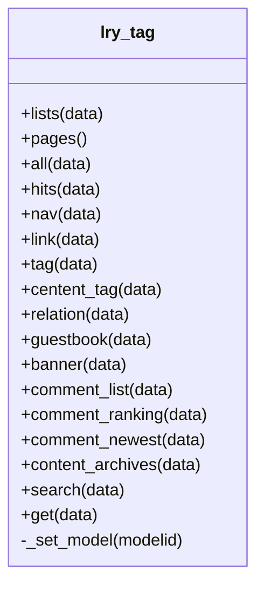
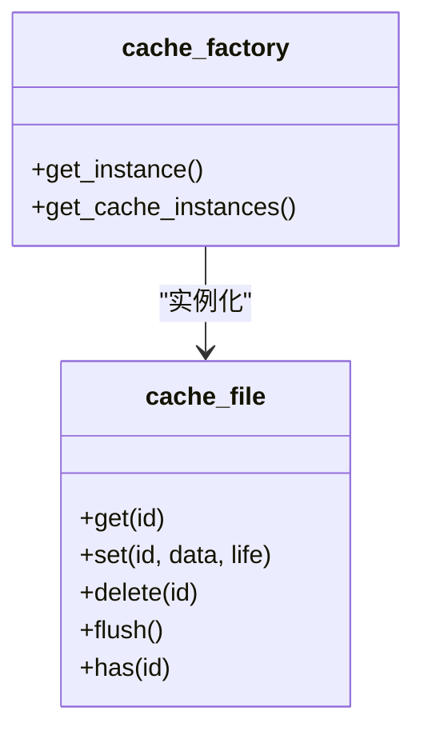
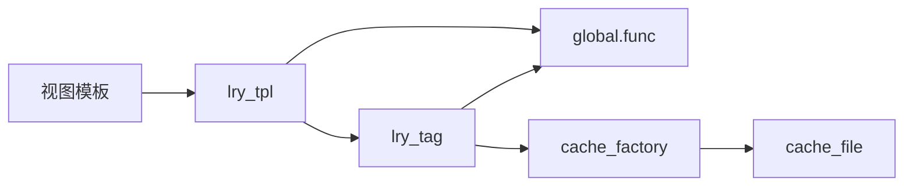

# 模板扩展

<cite>
**本文引用的文件**
- [lry_tpl.class.php](file://ryphp/core/class/lry_tpl.class.php)
- [lry_tag.class.php](file://ryphp/core/class/lry_tag.class.php)
- [cache_file.class.php](file://ryphp/core/class/cache_file.class.php)
- [cache_factory.class.php](file://ryphp/core/class/cache_factory.class.php)
- [global.func.php](file://ryphp/core/function/global.func.php)
- [system.func.php](file://common/function/system.func.php)
- [config.php](file://application/index/view/rongyao/config.php)
- [show_article.html](file://application/index/view/rongyao/show_article.html)
- [list_article.html](file://application/index/view/rongyao/list_article.html)
- [category_article.html](file://application/index/view/rongyao/category_article.html)
- [extention.func.php](file://common/function/extention.func.php)
</cite>

## 目录
1. [引言](#引言)
2. [项目结构](#项目结构)
3. [核心组件](#核心组件)
4. [架构总览](#架构总览)
5. [详细组件分析](#详细组件分析)
6. [依赖关系分析](#依赖关系分析)
7. [性能考虑](#性能考虑)
8. [故障排查指南](#故障排查指南)
9. [结论](#结论)
10. [附录](#附录)

## 引言
本指南面向LRYBlog模板扩展开发者，系统讲解模板标签开发、模板函数使用、模板继承与包含、主题定制（CSS/JS/响应式）、模板缓存与性能优化、调试与错误处理以及完整示例。读者将掌握从简单自定义标签到复杂内容组件的全栈开发流程。

## 项目结构
LRYBlog采用模块化视图目录，主题位于 application/index/view/{主题名}，模板通过自定义标签系统与业务标签类交互，配合全局函数与缓存工厂实现高性能渲染。



**图表来源**
- [lry_tpl.class.php:1-134](file://ryphp/core/class/lry_tpl.class.php#L1-L134)
- [lry_tag.class.php:1-492](file://ryphp/core/class/lry_tag.class.php#L1-L492)
- [cache_factory.class.php:1-84](file://ryphp/core/class/cache_factory.class.php#L1-L84)
- [cache_file.class.php:1-130](file://ryphp/core/class/cache_file.class.php#L1-L130)
- [global.func.php:1-200](file://ryphp/core/function/global.func.php#L1-L200)
- [system.func.php:1-200](file://common/function/system.func.php#L1-L200)
- [config.php:1-29](file://application/index/view/rongyao/config.php#L1-L29)

**章节来源**
- [config.php:1-29](file://application/index/view/rongyao/config.php#L1-L29)
- [show_article.html:1-518](file://application/index/view/rongyao/show_article.html#L1-L518)
- [list_article.html:1-150](file://application/index/view/rongyao/list_article.html#L1-L150)
- [category_article.html:1-53](file://application/index/view/rongyao/category_article.html#L1-L53)

## 核心组件
- 模板解析器：负责将模板中的自定义标签语法转换为PHP可执行代码，支持包含、条件、循环、PHP嵌入、变量输出与自定义标签回调。
- 标签类库：提供内容列表、分页、导航、链接、标签、评论、搜索、自定义SQL等标签能力，统一数据查询与分页逻辑。
- 缓存系统：通过工厂模式选择文件/Redis/Memcache实现，提供get/set/delete/flush能力，支持标签缓存。
- 全局函数：提供C配置读取、URL生成、缓存读写、字符串截取、安全过滤等常用工具。
- 主题配置：声明主题名称、作者、版本及可用模板映射，供后台选择与渲染。

**章节来源**
- [lry_tpl.class.php:1-134](file://ryphp/core/class/lry_tpl.class.php#L1-L134)
- [lry_tag.class.php:1-492](file://ryphp/core/class/lry_tag.class.php#L1-L492)
- [cache_factory.class.php:1-84](file://ryphp/core/class/cache_factory.class.php#L1-L84)
- [cache_file.class.php:1-130](file://ryphp/core/class/cache_file.class.php#L1-L130)
- [global.func.php:147-151](file://ryphp/core/function/global.func.php#L147-L151)
- [global.func.php:585-589](file://ryphp/core/function/global.func.php#L585-L589)
- [system.func.php:8-17](file://common/function/system.func.php#L8-L17)

## 架构总览
模板渲染从视图文件开始，经由模板解析器转换为PHP，再调用标签类库获取数据，最终输出HTML。缓存贯穿标签查询与静态资源，提升性能。



**图表来源**
- [lry_tpl.class.php:31-92](file://ryphp/core/class/lry_tpl.class.php#L31-L92)
- [lry_tag.class.php:18-65](file://ryphp/core/class/lry_tag.class.php#L18-L65)
- [cache_factory.class.php:36-82](file://ryphp/core/class/cache_factory.class.php#L36-L82)
- [cache_file.class.php:17-46](file://ryphp/core/class/cache_file.class.php#L17-L46)
- [global.func.php:4-26](file://ryphp/core/function/global.func.php#L4-L26)

## 详细组件分析

### 组件A：模板解析器（lry_tpl）
- 功能要点
  - 支持模板包含、PHP嵌入、条件/循环/自增自减、foreach loop、变量输出与对象属性访问。
  - 自定义标签解析：m:action 参数解析、cache返回值控制、分页支持、缓存封装。
  - 参数转义与数组HTML化，保证安全与可执行性。
- 关键流程
  - 标签替换：将m:include/php/if/for/loop/echo等转换为PHP片段。
  - 自定义标签回调：解析action与参数，生成调用lry_tag::action(...)的PHP代码。
  - 缓存注入：当cache>0且未指定page时，包裹getcache/setcache逻辑。
- 复杂度与性能
  - 正则替换O(n)扫描，参数解析与数组序列化为O(k)，整体受模板大小与标签数量影响。
  - 缓存命中可显著降低数据库压力。



**图表来源**
- [lry_tpl.class.php:31-92](file://ryphp/core/class/lry_tpl.class.php#L31-L92)
- [lry_tpl.class.php:111-132](file://ryphp/core/class/lry_tpl.class.php#L111-L132)

**章节来源**
- [lry_tpl.class.php:31-92](file://ryphp/core/class/lry_tpl.class.php#L31-L92)
- [lry_tpl.class.php:111-132](file://ryphp/core/class/lry_tpl.class.php#L111-L132)

### 组件B：标签类库（lry_tag）
- 功能要点
  - 内容列表、分页、全站最近更新、点击排行、栏目导航、友情链接、标签列表、相关内容、评论列表/排行/最新、内容归档、搜索、自定义SQL等。
  - 统一分页：支持page参数，自动计算总数与分页HTML。
  - 模型切换：按modelid动态切换数据表，确保跨模型查询正确。
- 数据流
  - 输入参数解析（catid/modelid/id/field/order/limit/where/page等）。
  - 构建where与排序，必要时调用分页类计算limit。
  - 返回数据集或分页HTML。
- 性能与安全
  - 严格where拼接与字段白名单，避免SQL注入。
  - 分页查询先count再limit，避免大表全量扫描。



**图表来源**
- [lry_tag.class.php:18-492](file://ryphp/core/class/lry_tag.class.php#L18-L492)

**章节来源**
- [lry_tag.class.php:18-492](file://ryphp/core/class/lry_tag.class.php#L18-L492)

### 组件C：缓存系统（cache_factory + cache_file）
- 功能要点
  - 工厂模式：根据配置选择文件/Redis/Memcache实现。
  - 文件缓存：基于目录与后缀的KV存储，支持过期时间与序列化。
  - 接口：get/set/delete/flush/has。
- 使用场景
  - 标签缓存：模板解析器在m:action中注入getcache/setcache。
  - 系统缓存：模型信息、站点配置等通过全局函数setcache/getcache使用。



**图表来源**
- [cache_factory.class.php:36-82](file://ryphp/core/class/cache_factory.class.php#L36-L82)
- [cache_file.class.php:17-128](file://ryphp/core/class/cache_file.class.php#L17-L128)

**章节来源**
- [cache_factory.class.php:36-82](file://ryphp/core/class/cache_factory.class.php#L36-L82)
- [cache_file.class.php:17-128](file://ryphp/core/class/cache_file.class.php#L17-L128)
- [global.func.php:147-151](file://ryphp/core/function/global.func.php#L147-L151)
- [global.func.php:585-589](file://ryphp/core/function/global.func.php#L585-L589)

### 组件D：模板函数与全局工具
- 全局函数
  - C()：读取配置；setcache/getcache/delcache：缓存读写；U()：URL生成；str_cut：字符串截断。
- 系统函数
  - get_theme_list()：获取主题目录列表；get_site_modelinfo()：获取站点模型信息并缓存。
- 扩展建议
  - 在extention.func.php中新增业务函数，遵循现有风格，便于模板直接调用。

**章节来源**
- [global.func.php:4-26](file://ryphp/core/function/global.func.php#L4-L26)
- [global.func.php:147-151](file://ryphp/core/function/global.func.php#L147-L151)
- [global.func.php:585-589](file://ryphp/core/function/global.func.php#L585-L589)
- [global.func.php:645-696](file://ryphp/core/function/global.func.php#L645-L696)
- [system.func.php:8-17](file://common/function/system.func.php#L8-L17)
- [system.func.php:119-128](file://common/function/system.func.php#L119-L128)
- [extention.func.php:25-95](file://common/function/extention.func.php#L25-L95)

### 组件E：主题配置与模板继承/包含
- 主题配置
  - 主题名、作者、版本、分类/列表/内容页模板映射，供后台选择。
- 模板包含
  - m:include "模块","模板名" 转换为PHP include template(...)，实现头部/底部等公共部分复用。
- 模板继承
  - 通过包含机制实现“父模板”与“子模板”的组合，子模板仅覆盖差异区块。

```mermaid
sequenceDiagram
participant T as "模板"
participant P as "lry_tpl"
participant F as "模板函数"
T->>P : m : include "index","header"
P-->>T : <?php include template("index","header"); ?>
T->>F : 调用PHP函数/模板函数
F-->>T : 输出变量/HTML片段
```

**图表来源**
- [lry_tpl.class.php:32-32](file://ryphp/core/class/lry_tpl.class.php#L32-L32)
- [config.php:1-29](file://application/index/view/rongyao/config.php#L1-L29)

**章节来源**
- [config.php:1-29](file://application/index/view/rongyao/config.php#L1-L29)
- [show_article.html:50-518](file://application/index/view/rongyao/show_article.html#L50-L518)
- [list_article.html:48-150](file://application/index/view/rongyao/list_article.html#L48-L150)
- [category_article.html:21-53](file://application/index/view/rongyao/category_article.html#L21-L53)

## 依赖关系分析
- lry_tpl 依赖 lry_tag 与全局函数（C、U、setcache/getcache等）。
- lry_tag 依赖 D() 数据工厂与分页类，间接依赖缓存。
- 缓存工厂依赖具体缓存实现（文件/Redis/Memcache）。
- 视图模板依赖模板包含与标签类库。



**图表来源**
- [lry_tpl.class.php:82-86](file://ryphp/core/class/lry_tpl.class.php#L82-L86)
- [lry_tag.class.php:59-63](file://ryphp/core/class/lry_tag.class.php#L59-L63)
- [cache_factory.class.php:36-82](file://ryphp/core/class/cache_factory.class.php#L36-L82)
- [cache_file.class.php:17-46](file://ryphp/core/class/cache_file.class.php#L17-L46)
- [global.func.php:147-151](file://ryphp/core/function/global.func.php#L147-L151)

**章节来源**
- [lry_tpl.class.php:82-86](file://ryphp/core/class/lry_tpl.class.php#L82-L86)
- [lry_tag.class.php:59-63](file://ryphp/core/class/lry_tag.class.php#L59-L63)
- [cache_factory.class.php:36-82](file://ryphp/core/class/cache_factory.class.php#L36-L82)
- [cache_file.class.php:17-46](file://ryphp/core/class/cache_file.class.php#L17-L46)
- [global.func.php:147-151](file://ryphp/core/function/global.func.php#L147-L151)

## 性能考虑
- 标签缓存
  - 在模板中为耗时标签设置cache秒数，解析器会自动注入缓存读写逻辑。
  - 对频繁访问的列表/排行/标签云等启用缓存，减少数据库压力。
- 分页优化
  - 使用page参数触发分页，先count后limit，避免全表扫描。
- 静态资源优化
  - 关键CSS/JS预加载，非关键资源延迟加载，减少首屏阻塞。
- 缓存刷新策略
  - 内容变更时调用delcache或flush清理相关缓存，确保一致性。

**章节来源**
- [lry_tpl.class.php:76-91](file://ryphp/core/class/lry_tpl.class.php#L76-L91)
- [lry_tag.class.php:58-63](file://ryphp/core/class/lry_tag.class.php#L58-L63)
- [cache_file.class.php:61-73](file://ryphp/core/class/cache_file.class.php#L61-L73)
- [show_article.html:18-43](file://application/index/view/rongyao/show_article.html#L18-L43)
- [list_article.html:11-30](file://application/index/view/rongyao/list_article.html#L11-L30)

## 故障排查指南
- 模板无法解析
  - 检查自定义标签语法是否正确，确认左右定界符与参数格式。
  - 查看解析后生成的PHP片段，定位正则替换问题。
- 标签无输出
  - 确认参数（catid/modelid/limit/page等）是否有效。
  - 检查缓存是否命中或过期，必要时清空缓存。
- 分页异常
  - 确认page参数传递与总数计算逻辑，检查分页HTML输出。
- 调试工具
  - 使用系统提供的打印函数或浏览器开发者工具检查DOM与网络请求。
  - 在模板中插入简单输出验证变量值。

**章节来源**
- [lry_tpl.class.php:31-59](file://ryphp/core/class/lry_tpl.class.php#L31-L59)
- [lry_tag.class.php:67-77](file://ryphp/core/class/lry_tag.class.php#L67-L77)
- [cache_file.class.php:17-29](file://ryphp/core/class/cache_file.class.php#L17-L29)
- [extention.func.php:25-95](file://common/function/extention.func.php#L25-L95)

## 结论
通过模板解析器、标签类库与缓存系统的协同，LRYBlog实现了灵活高效的模板扩展能力。开发者可基于m:action标签快速构建复杂内容组件，结合缓存与静态资源优化实现高性能站点。

## 附录

### A. 自定义模板标签开发步骤
- 定义标签方法
  - 在lry_tag中新增方法，接收参数并返回数据或分页HTML。
- 模板中使用
  - 使用m:action 参数调用，支持cache与page参数。
- 缓存策略
  - 为高开销查询设置cache秒数，解析器自动注入缓存逻辑。
- 分页支持
  - 方法内计算总数并返回分页HTML，模板中输出$pages。

**章节来源**
- [lry_tag.class.php:18-65](file://ryphp/core/class/lry_tag.class.php#L18-L65)
- [lry_tpl.class.php:76-91](file://ryphp/core/class/lry_tpl.class.php#L76-L91)

### B. 模板函数创建与使用
- 新增函数
  - 在extention.func.php中添加业务函数，遵循现有命名与注释规范。
- 模板调用
  - 在模板中直接使用函数名与参数，解析器将其转换为PHP调用。
- 注意事项
  - 避免在模板中进行复杂逻辑，尽量封装为函数。

**章节来源**
- [extention.func.php:25-95](file://common/function/extention.func.php#L25-L95)
- [lry_tpl.class.php:49-55](file://ryphp/core/class/lry_tpl.class.php#L49-L55)

### C. 主题定制与响应式适配
- CSS扩展
  - 在主题目录下新增样式文件，按需引入。
- JavaScript增强
  - 关键脚本预加载，非关键脚本延迟加载，避免阻塞。
- 响应式设计
  - 使用媒体查询与弹性布局，适配移动端与平板设备。

**章节来源**
- [show_article.html:10-43](file://application/index/view/rongyao/show_article.html#L10-L43)
- [list_article.html:9-30](file://application/index/view/rongyao/list_article.html#L9-L30)

### D. 模板缓存机制与失效处理
- 缓存注入
  - 解析器在cache>0时自动包裹getcache/setcache。
- 失效策略
  - 内容更新后调用delcache或flush清理，确保新数据及时生效。
- 监控与维护
  - 定期检查缓存目录与过期策略，平衡内存与CPU。

**章节来源**
- [lry_tpl.class.php:76-91](file://ryphp/core/class/lry_tpl.class.php#L76-L91)
- [cache_file.class.php:50-73](file://ryphp/core/class/cache_file.class.php#L50-L73)

### E. 完整示例：内容页模板
- 包含公共头部/底部
  - 使用m:include包含header/footer。
- 标签调用
  - 列表、评论、相关推荐、标签云等通过m:action实现。
- 分页与导航
  - 列表页使用page参数，输出$pages；文章页使用上一篇/下一篇导航。
- 资源加载
  - 关键CSS/JS预加载，非关键资源延迟加载。

**章节来源**
- [show_article.html:50-518](file://application/index/view/rongyao/show_article.html#L50-L518)
- [list_article.html:54-73](file://application/index/view/rongyao/list_article.html#L54-L73)
- [category_article.html:24-46](file://application/index/view/rongyao/category_article.html#L24-L46)