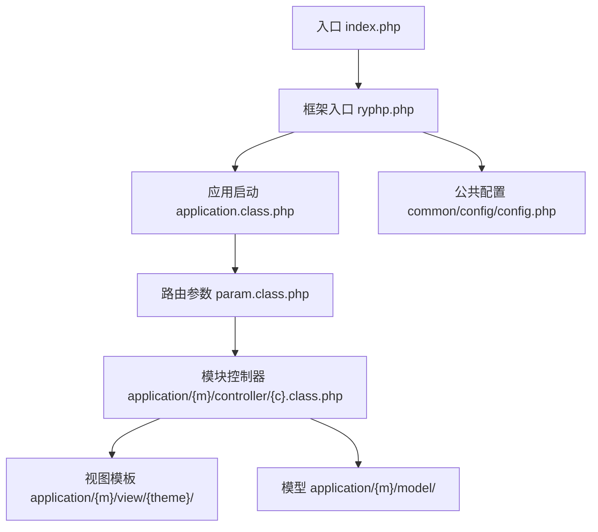
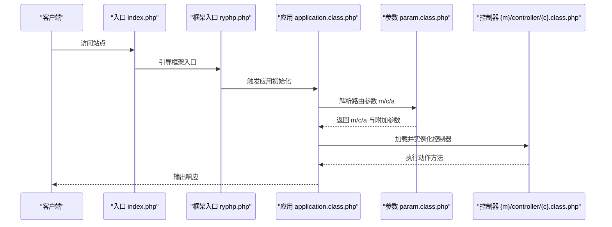
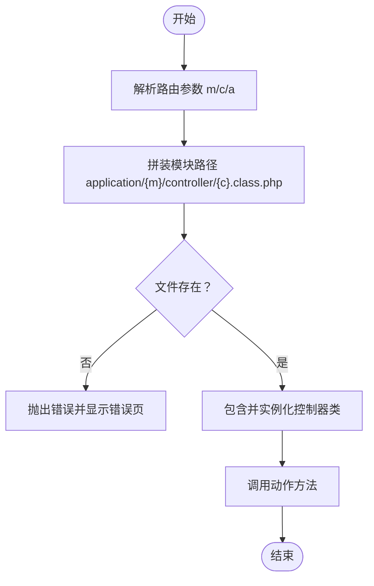
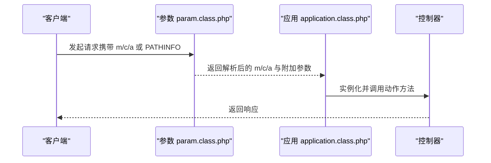
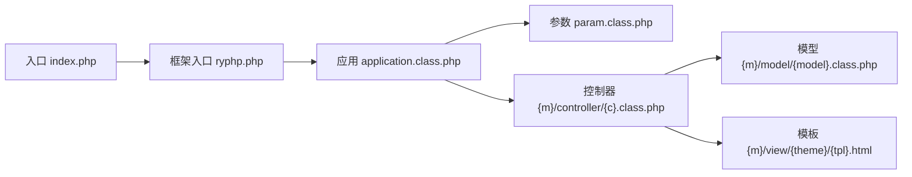

# 自定义模块开发

<cite>
**本文引用的文件**
- [index.php](file://index.php)
- [ryphp.php](file://ryphp/ryphp.php)
- [application.class.php](file://ryphp/core/class/application.class.php)
- [param.class.php](file://ryphp/core/class/param.class.php)
- [global.func.php](file://ryphp/core/function/global.func.php)
- [config.php](file://common/config/config.php)
- [index.class.php](file://application/index/controller/index.class.php)
- [index.class.php](file://application/lry_admin_center/controller/index.class.php)
- [common.class.php](file://application/lry_admin_center/controller/common.class.php)
- [index.class.php](file://application/api/controller/index.class.php)
- [config.php](file://application/index/view/rongyao/config.php)
- [index.php](file://application/install/index.php)
</cite>

## 目录
1. [简介](#简介)
2. [项目结构](#项目结构)
3. [核心组件](#核心组件)
4. [架构总览](#架构总览)
5. [详细组件分析](#详细组件分析)
6. [依赖关系分析](#依赖关系分析)
7. [性能考量](#性能考量)
8. [故障排查指南](#故障排查指南)
9. [结论](#结论)
10. [附录](#附录)

## 简介
本指南面向希望在 LRYBlog 平台上开发自定义模块的开发者，系统讲解模块目录结构规范、配置文件编写、模块注册与自动加载机制、路由参数驱动的模块间通信、生命周期管理、最佳实践与常见问题。文档结合仓库现有实现，提供从入门到进阶的完整开发路径。

## 项目结构
LRYBlog 采用“模块化 + MVC”的组织方式：
- 应用入口统一在根目录入口文件，框架入口位于 ryphp/ryphp.php
- 每个模块位于 application/{模块名}/ 下，包含 controller、model、view 三层目录
- 公共配置位于 common/config/config.php
- 模板元数据配置位于 application/{模块名}/view/{主题名}/config.php

图表来源
- [index.php](file://index.php#L1-L18)
- [ryphp.php](file://ryphp/ryphp.php#L83-L90)
- [application.class.php](file://ryphp/core/class/application.class.php#L24-L65)
- [param.class.php](file://ryphp/core/class/param.class.php#L19-L46)
- [config.php](file://common/config/config.php#L23-L30)

章节来源
- [index.php](file://index.php#L1-L18)
- [ryphp.php](file://ryphp/ryphp.php#L83-L90)
- [application.class.php](file://ryphp/core/class/application.class.php#L24-L65)
- [param.class.php](file://ryphp/core/class/param.class.php#L19-L46)
- [config.php](file://common/config/config.php#L23-L30)

## 核心组件
- 入口与框架
  - 入口文件负责常量定义、引入框架入口并触发应用初始化
  - 框架入口负责加载系统函数库、定义站点常量、暴露静态加载接口
- 应用层
  - 应用类负责路由参数解析、控制器加载与调度、错误处理与消息展示
- 路由层
  - 参数类负责从 GET/POST、PATHINFO 中解析 m/c/a 以及附加键值参数
- 配置层
  - 公共配置集中于 common/config/config.php，包含路由、缓存、上传等系统级配置
- 模块层
  - 每个模块独立目录，遵循 controller/model/view 三层结构；模板元数据通过 view/{theme}/config.php 声明

章节来源
- [index.php](file://index.php#L10-L18)
- [ryphp.php](file://ryphp/ryphp.php#L83-L90)
- [application.class.php](file://ryphp/core/class/application.class.php#L9-L40)
- [param.class.php](file://ryphp/core/class/param.class.php#L19-L46)
- [config.php](file://common/config/config.php#L23-L30)

## 架构总览
LRYBlog 的模块化请求处理链路如下：

图表来源
- [index.php](file://index.php#L10-L18)
- [ryphp.php](file://ryphp/ryphp.php#L88-L90)
- [application.class.php](file://ryphp/core/class/application.class.php#L14-L40)
- [param.class.php](file://ryphp/core/class/param.class.php#L19-L46)

## 详细组件分析

### 模块目录结构规范
- 必备目录
  - controller：存放控制器类文件，文件名规则为 {控制器名}.class.php
  - model：存放模型类文件，按框架约定加载
  - view：存放模板与主题元数据，主题元数据通过 {theme}/config.php 声明
- 结构示例
  - application/{模块名}/controller/{控制器名}.class.php
  - application/{模块名}/model/{模型名}.class.php
  - application/{模块名}/view/{主题名}/config.php
- 命名约定
  - 控制器类名与文件名一致，遵循大小写敏感的类名规则
  - 模块名、控制器名、动作名均受安全处理限制（长度与非法字符过滤）

章节来源
- [application.class.php](file://ryphp/core/class/application.class.php#L48-L65)
- [config.php](file://application/index/view/rongyao/config.php#L1-L29)

### 模块配置文件编写
- 公共配置
  - 路由配置：在 common/config/config.php 的 route_config 中定义默认路由与按域名覆盖
  - URL 模式：通过 URL_MODEL 与 url_html_suffix 控制 URL 形态
- 模板元数据
  - 在 application/{模块名}/view/{主题名}/config.php 中声明模板集合（分类、列表、内容页）
- 配置加载
  - C() 与 config() 提供全局与模块级配置读取能力，支持缓存与静态变量优化

章节来源
- [config.php](file://common/config/config.php#L23-L30)
- [config.php](file://application/index/view/rongyao/config.php#L1-L29)
- [global.func.php](file://ryphp/core/function/global.func.php#L4-L26)
- [global.func.php](file://ryphp/core/function/global.func.php#L67-L79)

### 模块注册机制与自动加载原理
- 控制器加载
  - 应用类根据 ROUTE_M/ROUTE_C 组合定位模块与控制器文件，校验存在性后 include 并实例化
- 类加载
  - 框架提供 load_sys_class/load_controller/load_model 等静态方法，内部通过静态缓存避免重复加载
- 模块存在性校验
  - 若模块目录不存在或控制器文件不存在，应用类会终止并输出错误页面

图表来源
- [application.class.php](file://ryphp/core/class/application.class.php#L48-L65)

章节来源
- [application.class.php](file://ryphp/core/class/application.class.php#L48-L65)
- [ryphp.php](file://ryphp/ryphp.php#L108-L140)

### 路由参数驱动的模块间通信
- 参数来源
  - 支持通过 GET/POST 的 m/c/a 传递模块、控制器与动作
  - 支持 PATHINFO 模式，通过 URL 路径与附加键值参数传递复杂参数
- 参数安全
  - 对 m/c/a 进行长度与非法字符过滤，防止注入与越界
- URL 生成
  - U() 函数根据 URL_MODEL 生成兼容的绝对/相对 URL，支持附加参数键值对

图表来源
- [param.class.php](file://ryphp/core/class/param.class.php#L19-L46)
- [param.class.php](file://ryphp/core/class/param.class.php#L95-L115)
- [global.func.php](file://ryphp/core/function/global.func.php#L764-L809)

章节来源
- [param.class.php](file://ryphp/core/class/param.class.php#L19-L46)
- [param.class.php](file://ryphp/core/class/param.class.php#L95-L115)
- [global.func.php](file://ryphp/core/function/global.func.php#L764-L809)

### 模块开发示例

#### 示例一：Hello World 控制器
- 目标：在 application/index/ 下创建一个最简控制器，输出“Hello World”
- 步骤
  - 新建 application/index/controller/hello.class.php，定义类与 init 方法
  - 通过 URL 访问时，m=index, c=hello, a=init
  - 框架自动加载并执行该动作

章节来源
- [index.class.php](file://application/index/controller/index.class.php#L14-L17)

#### 示例二：API 验证码模块
- 目标：提供验证码生成与校验的简单 API
- 步骤
  - 在 application/api/controller/ 下创建验证码控制器
  - 通过 GET 参数 width/height/code_len/font_size 调整验证码样式
  - 生成验证码并写入 SESSION，用于后续校验

章节来源
- [index.class.php](file://application/api/controller/index.class.php#L6-L17)

#### 示例三：后台登录模块
- 目标：演示控制器继承与模板渲染、权限校验与会话管理
- 步骤
  - 控制器继承 common 基类，实现登录与登出逻辑
  - 使用 admin_tpl() 获取模板路径并渲染
  - 通过权限校验与 Token 校验保障安全

章节来源
- [index.class.php](file://application/lry_admin_center/controller/index.class.php#L6-L38)
- [common.class.php](file://application/lry_admin_center/controller/common.class.php#L32-L50)
- [common.class.php](file://application/lry_admin_center/controller/common.class.php#L139-L144)

### 模块间依赖管理与命名空间规范
- 依赖声明
  - 通过控制器内显式加载所需模型与服务（如 D()、M()、ryphp::load_*）
- 命名空间
  - 采用类名与文件名一一对应的传统 PHP 方式，无需额外命名空间
- 文件命名约定
  - 控制器：{控制器名}.class.php
  - 模型：{模型名}.class.php
  - 模板：{模板名}.html

章节来源
- [ryphp.php](file://ryphp/ryphp.php#L171-L189)
- [global.func.php](file://ryphp/core/function/global.func.php#L100-L108)

### 模块生命周期管理
- 初始化
  - 入口引导框架，框架加载系统函数与公共配置
- 运行时处理
  - 应用类解析路由，加载控制器，执行动作方法
- 销毁/收尾
  - 调试模式下输出调试信息；非调试模式根据错误日志策略输出错误页

章节来源
- [index.php](file://index.php#L10-L18)
- [ryphp.php](file://ryphp/ryphp.php#L88-L90)
- [application.class.php](file://ryphp/core/class/application.class.php#L24-L40)
- [global.func.php](file://ryphp/core/function/global.func.php#L835-L858)

## 依赖关系分析
- 入口依赖框架入口
- 框架入口依赖应用类与系统函数库
- 应用类依赖参数类解析路由
- 控制器依赖模型与视图（通过模板路径与数据渲染）

图表来源
- [index.php](file://index.php#L10-L18)
- [ryphp.php](file://ryphp/ryphp.php#L88-L90)
- [application.class.php](file://ryphp/core/class/application.class.php#L24-L40)
- [param.class.php](file://ryphp/core/class/param.class.php#L19-L46)

章节来源
- [index.php](file://index.php#L10-L18)
- [ryphp.php](file://ryphp/ryphp.php#L88-L90)
- [application.class.php](file://ryphp/core/class/application.class.php#L24-L40)
- [param.class.php](file://ryphp/core/class/param.class.php#L19-L46)

## 性能考量
- 静态类缓存
  - 框架通过静态数组缓存已加载类，避免重复 include
- 配置缓存
  - C() 与 config() 使用静态变量缓存配置，减少文件 IO
- 路由解析
  - PATHINFO 模式下建议合理设置 route_mapping 与规则，避免过度正则匹配
- 模板与输出
  - 后台模块使用输出缓冲与模板路径拼接，注意模板文件存在性检查

章节来源
- [ryphp.php](file://ryphp/ryphp.php#L118-L140)
- [global.func.php](file://ryphp/core/function/global.func.php#L4-L26)
- [param.class.php](file://ryphp/core/class/param.class.php#L138-L151)
- [index.class.php](file://application/lry_admin_center/controller/index.class.php#L42-L48)

## 故障排查指南
- 模块不存在
  - 现象：提示模块目录不存在
  - 排查：确认 application/{m}/ 存在且可读
- 控制器类不存在
  - 现象：提示控制器类不存在
  - 排查：确认 {c}.class.php 存在且类名与文件名一致
- 路由参数异常
  - 现象：参数长度超限或包含非法字符导致被过滤
  - 排查：检查 m/c/a 长度与内容，必要时调整 URL 模式
- 错误页与日志
  - 非调试模式下错误页由 C('error_page') 指定；可启用错误日志写入定位问题

章节来源
- [application.class.php](file://ryphp/core/class/application.class.php#L52-L64)
- [application.class.php](file://ryphp/core/class/application.class.php#L108-L115)
- [global.func.php](file://ryphp/core/function/global.func.php#L835-L858)
- [param.class.php](file://ryphp/core/class/param.class.php#L54-L60)

## 结论
LRYBlog 的模块化开发以清晰的目录结构、稳定的路由与配置体系为基础，配合框架提供的自动加载与安全处理，能够快速构建从简单到复杂的业务模块。遵循本文档的目录规范、配置方法与最佳实践，可显著提升开发效率与系统稳定性。

## 附录
- 安装与初始化
  - 安装程序位于 application/install/，可参考其流程理解系统初始化要点
- URL 生成与模式
  - U() 支持多种 URL 模式与后缀控制，便于前后端协作与 SEO

章节来源
- [index.php](file://application/install/index.php#L15-L17)
- [global.func.php](file://ryphp/core/function/global.func.php#L764-L809)