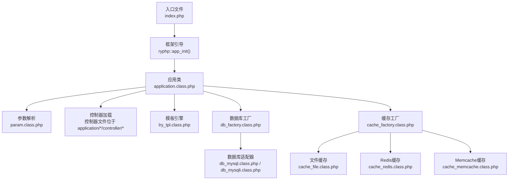
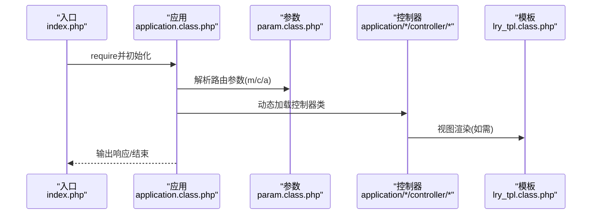
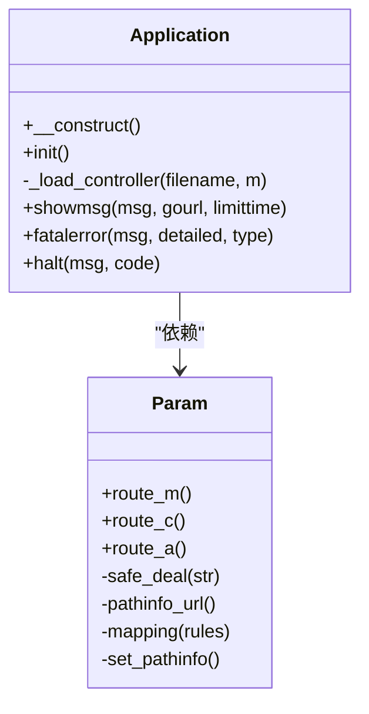
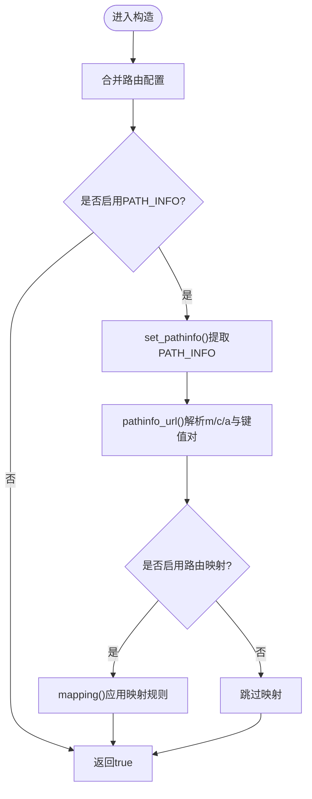
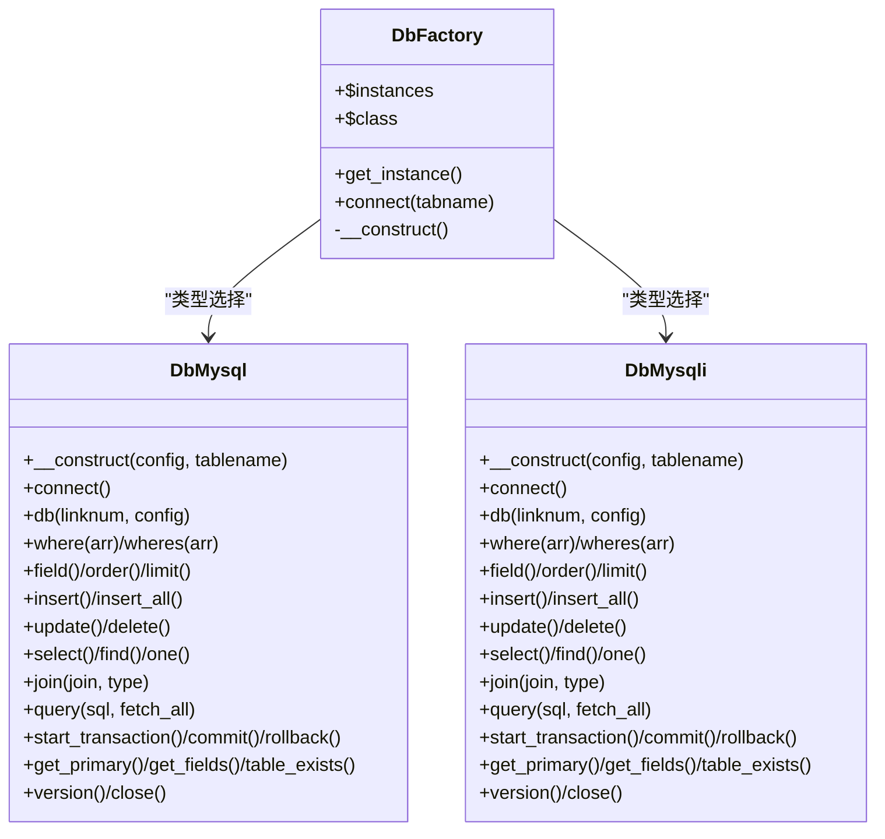
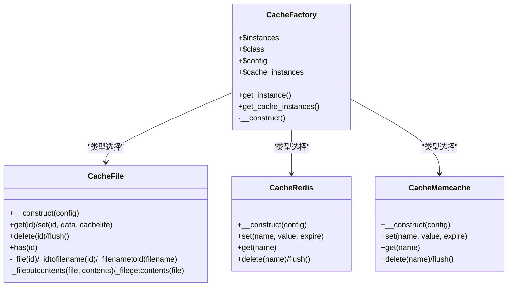
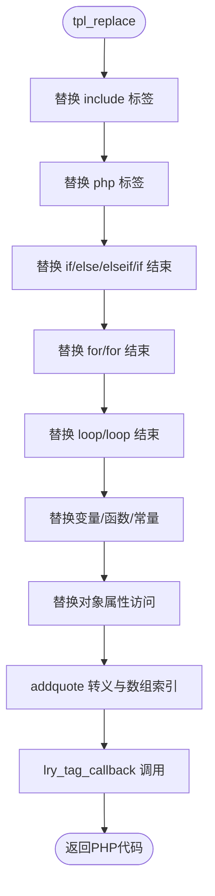
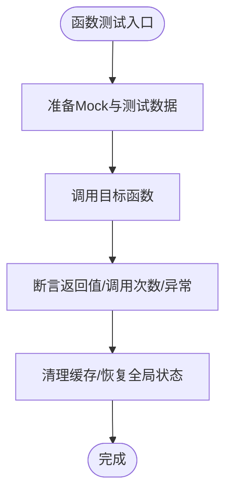
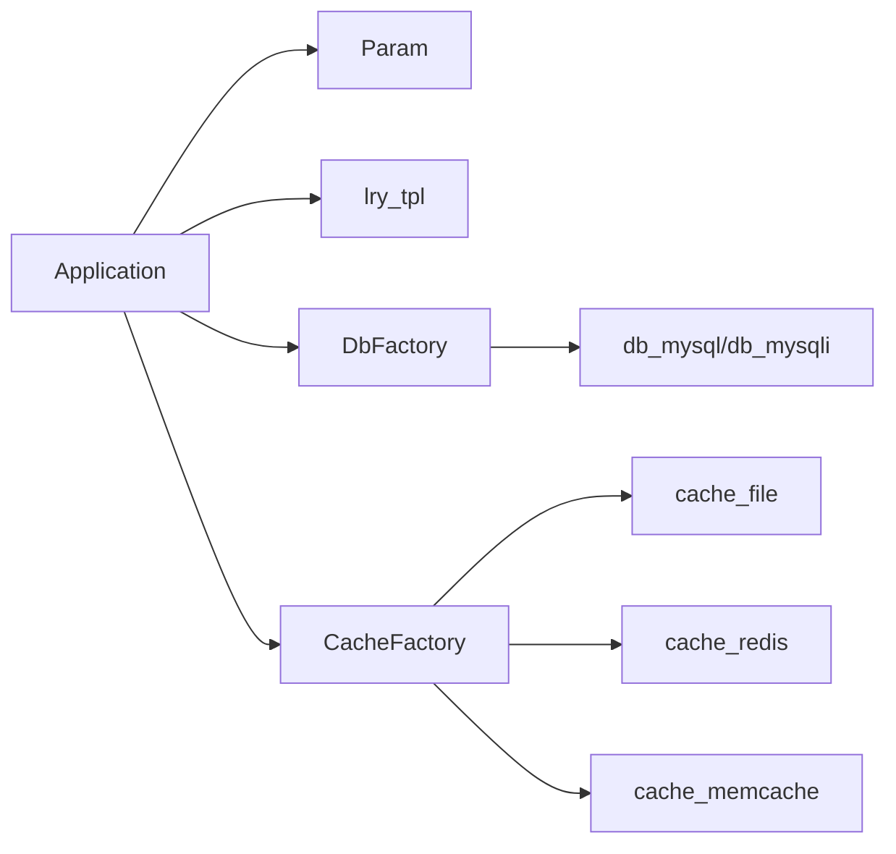

# 单元测试

<cite>
**本文引用的文件**   
- [index.php](file://index.php)
- [application.class.php](file://ryphp/core/class/application.class.php)
- [param.class.php](file://ryphp/core/class/param.class.php)
- [db_factory.class.php](file://ryphp/core/class/db_factory.class.php)
- [cache_factory.class.php](file://ryphp/core/class/cache_factory.class.php)
- [cache_file.class.php](file://ryphp/core/class/cache_file.class.php)
- [cache_redis.class.php](file://ryphp/core/class/cache_redis.class.php)
- [cache_memcache.class.php](file://ryphp/core/class/cache_memcache.class.php)
- [lry_tpl.class.php](file://ryphp/core/class/lry_tpl.class.php)
- [db_mysql.class.php](file://ryphp/core/class/db_mysql.class.php)
- [db_mysqli.class.php](file://ryphp/core/class/db_mysqli.class.php)
- [system.func.php](file://common/function/system.func.php)
</cite>

## 目录
1. [引言](#引言)
2. [项目结构](#项目结构)
3. [核心组件](#核心组件)
4. [架构总览](#架构总览)
5. [详细组件分析](#详细组件分析)
6. [依赖关系分析](#依赖关系分析)
7. [性能考量](#性能考量)
8. [故障排查指南](#故障排查指南)
9. [结论](#结论)
10. [附录](#附录)

## 引言
本文件面向LRYBlog项目的开发者，提供基于PHPUnit的单元测试编写指南与最佳实践。内容覆盖测试环境搭建、测试用例规范、断言方法、核心类（Application、Param、DbFactory等）的测试策略、函数级别测试方法、测试数据准备与清理、Mock对象创建与使用、覆盖率分析与报告生成，以及调试技巧。目标是帮助团队建立稳定、可维护、可扩展的单元测试体系。

## 项目结构
LRYBlog采用“入口文件 + 框架内核 + 应用层”的分层结构。入口文件负责常量定义与框架初始化；框架内核提供路由、数据库、缓存、模板等基础设施；应用层包含前台、后台、安装器等模块。

图表来源
- [index.php](file://index.php#L1-L18)
- [application.class.php](file://ryphp/core/class/application.class.php#L1-L118)
- [param.class.php](file://ryphp/core/class/param.class.php#L1-L195)
- [db_factory.class.php](file://ryphp/core/class/db_factory.class.php#L1-L50)
- [cache_factory.class.php](file://ryphp/core/class/cache_factory.class.php#L1-L84)
- [cache_file.class.php](file://ryphp/core/class/cache_file.class.php#L1-L130)
- [cache_redis.class.php](file://ryphp/core/class/cache_redis.class.php#L1-L108)
- [cache_memcache.class.php](file://ryphp/core/class/cache_memcache.class.php#L1-L91)
- [lry_tpl.class.php](file://ryphp/core/class/lry_tpl.class.php#L1-L134)
- [db_mysql.class.php](file://ryphp/core/class/db_mysql.class.php#L1-L667)
- [db_mysqli.class.php](file://ryphp/core/class/db_mysqli.class.php#L1-L660)

章节来源
- [index.php](file://index.php#L1-L18)

## 核心组件
- Application：应用启动与路由调度的核心类，负责初始化调试、错误处理、路由参数解析、控制器加载与动作执行。
- Param：URL路由参数解析与安全处理，支持PATH_INFO模式、路由映射、键值对解析。
- DbFactory：数据库连接工厂，依据配置动态选择mysql/mysqli/pdo适配器并返回连接实例。
- CacheFactory：缓存工厂，依据配置选择file/redis/memcache实现，提供缓存实例。
- CacheFile/CacheRedis/CacheMemcache：具体缓存实现，提供get/set/delete/flush等接口。
- lry_tpl：模板解析引擎，将自定义标签语法转换为PHP代码。
- db_mysql/db_mysqli：数据库适配器，提供链式查询构建、CRUD、事务、字段/表检测等能力。

章节来源
- [application.class.php](file://ryphp/core/class/application.class.php#L1-L118)
- [param.class.php](file://ryphp/core/class/param.class.php#L1-L195)
- [db_factory.class.php](file://ryphp/core/class/db_factory.class.php#L1-L50)
- [cache_factory.class.php](file://ryphp/core/class/cache_factory.class.php#L1-L84)
- [cache_file.class.php](file://ryphp/core/class/cache_file.class.php#L1-L130)
- [cache_redis.class.php](file://ryphp/core/class/cache_redis.class.php#L1-L108)
- [cache_memcache.class.php](file://ryphp/core/class/cache_memcache.class.php#L1-L91)
- [lry_tpl.class.php](file://ryphp/core/class/lry_tpl.class.php#L1-L134)
- [db_mysql.class.php](file://ryphp/core/class/db_mysql.class.php#L1-L667)
- [db_mysqli.class.php](file://ryphp/core/class/db_mysqli.class.php#L1-L660)

## 架构总览
下面的序列图展示了从入口到控制器动作执行的关键流程，便于理解测试切入点与依赖注入位置。

图表来源
- [index.php](file://index.php#L1-L18)
- [application.class.php](file://ryphp/core/class/application.class.php#L1-L118)
- [param.class.php](file://ryphp/core/class/param.class.php#L1-L195)
- [lry_tpl.class.php](file://ryphp/core/class/lry_tpl.class.php#L1-L134)

## 详细组件分析

### Application 类测试策略
- 测试目标
  - 路由参数正确解析（m/c/a）。
  - 控制器文件存在性与类存在性校验。
  - 动作方法可见性与存在性检查。
  - 调试开关下的计时与消息输出。
  - 错误处理与终止页面渲染。
- 依赖注入与Mock
  - 使用Mock替换全局状态（如路由常量、错误处理器注册）。
  - Mock控制器类，验证其动作方法被调用。
  - 使用Stub替换模板渲染，避免真实视图文件依赖。
- 断言要点
  - assertSame/assertInstanceOf用于类型与实例校验。
  - expectOutputString/expectOutputRegex用于输出断言。
  - 断言异常抛出或特定终止行为。
- 测试数据
  - 构造合法/非法路由参数组合，覆盖默认值与覆盖值。
  - 准备不存在的控制器/动作文件，验证错误分支。
- 清理
  - 恢复全局错误处理器与shutdown回调。
  - 清理可能产生的调试输出缓冲。

图表来源
- [application.class.php](file://ryphp/core/class/application.class.php#L1-L118)
- [param.class.php](file://ryphp/core/class/param.class.php#L1-L195)

章节来源
- [application.class.php](file://ryphp/core/class/application.class.php#L1-L118)
- [param.class.php](file://ryphp/core/class/param.class.php#L1-L195)

### Param 类测试策略
- 测试目标
  - GET/POST参数安全处理（长度限制、非法字符剔除）。
  - PATH_INFO模式解析与键值对提取。
  - 路由映射规则应用与PATH_INFO重写。
  - set_pathinfo对URL路径的提取与清理。
- Mock与断言
  - 使用数据供给器覆盖多种URL模式与路由规则。
  - 断言$_GET/$_SERVER被正确填充。
  - 断言安全处理函数移除非法字符与截断超长参数。
- 测试数据
  - 正常路径、带查询串、带HTML后缀、带特殊字符的URL。
  - 路由映射规则数组（正则匹配与替换）。
- 清理
  - 恢复$_GET/$_SERVER原始状态。

图表来源
- [param.class.php](file://ryphp/core/class/param.class.php#L1-L195)

章节来源
- [param.class.php](file://ryphp/core/class/param.class.php#L1-L195)

### DbFactory 与数据库适配器测试策略
- 测试目标
  - 工厂单例与类型选择（mysql/mysqli/pdo）。
  - 连接参数传递与实例化。
  - 适配器方法链式调用（where/field/order/limit/join）与CRUD。
  - 事务控制（start_transaction/commit/rollback）。
  - 错误处理与异常路径。
- Mock与断言
  - 使用Mock替换底层数据库扩展（mysql/mysqli），断言SQL执行与返回。
  - 断言where/wheres生成的WHERE子句符合预期。
  - 断言事务方法调用顺序与影响行数。
- 测试数据
  - 构造不同where条件（数组/字符串/表达式数组）。
  - 插入/更新/删除数据集，断言影响行数。
- 清理
  - 回滚未提交事务，关闭连接。
  - 清理静态连接池状态（如需）。

图表来源
- [db_factory.class.php](file://ryphp/core/class/db_factory.class.php#L1-L50)
- [db_mysql.class.php](file://ryphp/core/class/db_mysql.class.php#L1-L667)
- [db_mysqli.class.php](file://ryphp/core/class/db_mysqli.class.php#L1-L660)

章节来源
- [db_factory.class.php](file://ryphp/core/class/db_factory.class.php#L1-L50)
- [db_mysql.class.php](file://ryphp/core/class/db_mysql.class.php#L1-L667)
- [db_mysqli.class.php](file://ryphp/core/class/db_mysqli.class.php#L1-L660)

### CacheFactory 与缓存实现测试策略
- 测试目标
  - 工厂单例与类型选择（file/redis/memcache）。
  - 缓存实例懒加载与配置合并。
  - get/set/delete/flush行为与过期策略。
- Mock与断言
  - 使用Mock替换Redis/Memcache扩展，断言set/get/delete/flush调用。
  - 断言文件缓存的序列化/反序列化与过期判断。
- 测试数据
  - 不同类型数据（字符串/数组）与过期时间。
  - flush后缓存项不存在。
- 清理
  - 清空缓存目录或清空Redis/Memcache。

图表来源
- [cache_factory.class.php](file://ryphp/core/class/cache_factory.class.php#L1-L84)
- [cache_file.class.php](file://ryphp/core/class/cache_file.class.php#L1-L130)
- [cache_redis.class.php](file://ryphp/core/class/cache_redis.class.php#L1-L108)
- [cache_memcache.class.php](file://ryphp/core/class/cache_memcache.class.php#L1-L91)

章节来源
- [cache_factory.class.php](file://ryphp/core/class/cache_factory.class.php#L1-L84)
- [cache_file.class.php](file://ryphp/core/class/cache_file.class.php#L1-L130)
- [cache_redis.class.php](file://ryphp/core/class/cache_redis.class.php#L1-L108)
- [cache_memcache.class.php](file://ryphp/core/class/cache_memcache.class.php#L1-L91)

### 模板引擎 lry_tpl 测试策略
- 测试目标
  - 标签解析（include/php/if/for/loop/变量/函数调用）。
  - 缓存标签与分页标签的生成逻辑。
  - 特殊字符转义与数组索引处理。
- Mock与断言
  - 使用Stub替换lry_tag回调，断言生成的PHP代码片段。
  - 断言模板标签被正确替换为PHP代码。
- 测试数据
  - 含嵌套标签与复杂表达式的模板字符串。
- 清理
  - 无需清理。

图表来源
- [lry_tpl.class.php](file://ryphp/core/class/lry_tpl.class.php#L1-L134)

章节来源
- [lry_tpl.class.php](file://ryphp/core/class/lry_tpl.class.php#L1-L134)

### 函数级别测试（system.func.php）
- 测试目标
  - 系统函数的业务逻辑：主题列表获取、SEO后缀、站点URL、站点SEO、内容URL、分页摘要、站点ID、来源、模型信息、邮件发送、移动端判断、附件图标、登录/退出跳转、广告调用、Tag URL、内容列表Tag、移动端URL、标题着色、缩略图、栏目select、远程图片下载、配置读取、URL规则、站点映射、附件更新/删除、站点信息、栏目信息、当前位置、模型信息、关键词、评论数、组别信息等。
- Mock与断言
  - 使用Mock替换D()、getcache/setcache、C()、U()、get_category等依赖，断言返回值与调用次数。
  - 对涉及数据库/缓存/配置的函数，分别断言缓存命中/未命中与数据库查询。
- 测试数据
  - 构造不同站点/栏目/模型/用户上下文，覆盖正常与边界情况。
- 清理
  - 清空/恢复缓存，释放全局变量。

图表来源
- [system.func.php](file://common/function/system.func.php#L1-L969)

章节来源
- [system.func.php](file://common/function/system.func.php#L1-L969)

## 依赖关系分析
- 组件耦合
  - Application依赖Param进行路由解析，依赖lry_tpl进行视图渲染。
  - DbFactory与CacheFactory均为单例工厂，分别管理数据库与缓存实例。
  - 数据库适配器与缓存实现均依赖配置中心（C函数）与全局常量。
- 外部依赖
  - 数据库扩展（mysql/mysqli）、Redis扩展、Memcache扩展。
  - 文件系统（缓存文件写入/读取）。
- 循环依赖
  - 未发现直接循环依赖；工厂类通过配置选择具体实现，避免耦合。

图表来源
- [application.class.php](file://ryphp/core/class/application.class.php#L1-L118)
- [param.class.php](file://ryphp/core/class/param.class.php#L1-L195)
- [db_factory.class.php](file://ryphp/core/class/db_factory.class.php#L1-L50)
- [cache_factory.class.php](file://ryphp/core/class/cache_factory.class.php#L1-L84)
- [cache_file.class.php](file://ryphp/core/class/cache_file.class.php#L1-L130)
- [cache_redis.class.php](file://ryphp/core/class/cache_redis.class.php#L1-L108)
- [cache_memcache.class.php](file://ryphp/core/class/cache_memcache.class.php#L1-L91)
- [db_mysql.class.php](file://ryphp/core/class/db_mysql.class.php#L1-L667)
- [db_mysqli.class.php](file://ryphp/core/class/db_mysqli.class.php#L1-L660)

章节来源
- [application.class.php](file://ryphp/core/class/application.class.php#L1-L118)
- [param.class.php](file://ryphp/core/class/param.class.php#L1-L195)
- [db_factory.class.php](file://ryphp/core/class/db_factory.class.php#L1-L50)
- [cache_factory.class.php](file://ryphp/core/class/cache_factory.class.php#L1-L84)
- [cache_file.class.php](file://ryphp/core/class/cache_file.class.php#L1-L130)
- [cache_redis.class.php](file://ryphp/core/class/cache_redis.class.php#L1-L108)
- [cache_memcache.class.php](file://ryphp/core/class/cache_memcache.class.php#L1-L91)
- [db_mysql.class.php](file://ryphp/core/class/db_mysql.class.php#L1-L667)
- [db_mysqli.class.php](file://ryphp/core/class/db_mysqli.class.php#L1-L660)

## 性能考量
- 缓存优先：对频繁读取的配置、模型、栏目、URL规则等使用缓存，减少数据库压力。
- 查询优化：合理使用where/wheres、field/order/limit，避免全表扫描。
- 事务批处理：批量插入/更新时使用insert_all/update，减少往返。
- Mock替代真实IO：数据库/缓存/模板渲染使用Mock，提升测试速度与稳定性。
- 覆盖率与回归：保持高覆盖率，关注热点路径与异常分支。

## 故障排查指南
- 路由错误
  - 症状：控制器类不存在或动作不可访问。
  - 排查：确认路由参数与文件路径映射，检查类名与文件名一致性。
- 数据库错误
  - 症状：连接失败、SQL执行异常。
  - 排查：检查配置、连接池状态、异常捕获与日志输出。
- 缓存问题
  - 症状：缓存未命中或过期异常。
  - 排查：检查缓存键、过期时间、序列化/反序列化。
- 模板解析异常
  - 症状：标签未替换或语法错误。
  - 排查：检查标签语法与回调函数，确保生成的PHP代码可执行。

章节来源
- [application.class.php](file://ryphp/core/class/application.class.php#L1-L118)
- [db_mysql.class.php](file://ryphp/core/class/db_mysql.class.php#L514-L528)
- [db_mysqli.class.php](file://ryphp/core/class/db_mysqli.class.php#L514-L526)
- [cache_file.class.php](file://ryphp/core/class/cache_file.class.php#L116-L128)
- [lry_tpl.class.php](file://ryphp/core/class/lry_tpl.class.php#L1-L134)

## 结论
通过为Application、Param、DbFactory、CacheFactory、模板引擎与系统函数建立完善的单元测试，可以显著提升代码质量与可维护性。建议以Mock为核心，围绕依赖注入与工厂模式设计测试，配合覆盖率分析与持续集成，形成稳定的测试闭环。

## 附录
- 测试环境搭建
  - 安装PHPUnit并配置bootstrap文件，加载入口与框架初始化。
  - 配置测试数据库与缓存服务（Redis/Memcache），确保可重复使用。
- 测试用例编写规范
  - 每个类/函数至少覆盖正常路径、边界条件与异常路径。
  - 使用DataProvider组织相似测试数据，提高可读性与可维护性。
- 断言方法使用
  - 使用assertSame/assertTrue/assertFalse/assertNull等精确断言。
  - 使用expectOutputString/expectOutputRegex断言输出。
  - 使用expectException断言异常抛出。
- 测试数据准备与清理
  - 使用setUp/tearDown准备/清理Mock与临时数据。
  - 对缓存与数据库使用独立命名空间或前缀，避免污染。
- Mock对象创建与使用
  - 使用框架提供的Mock Builder或第三方Mock库。
  - 替换全局函数（如D()、getcache/setcache、C()）时，注意作用域与生命周期。
- 覆盖率分析与报告生成
  - 使用PHPUnit内置覆盖率工具，生成HTML/XML报告。
  - 关注未覆盖的分支与死代码，持续改进测试矩阵。