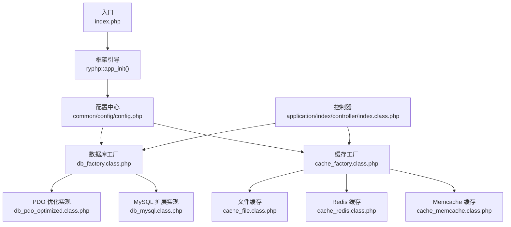
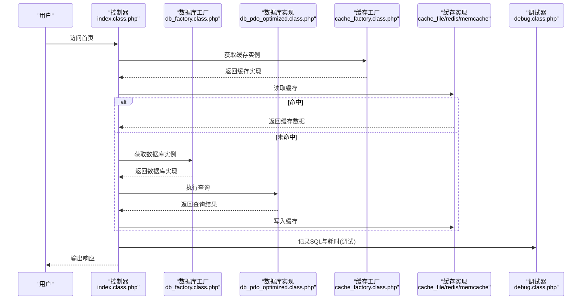
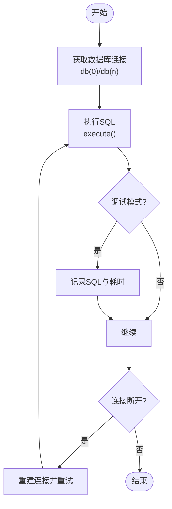
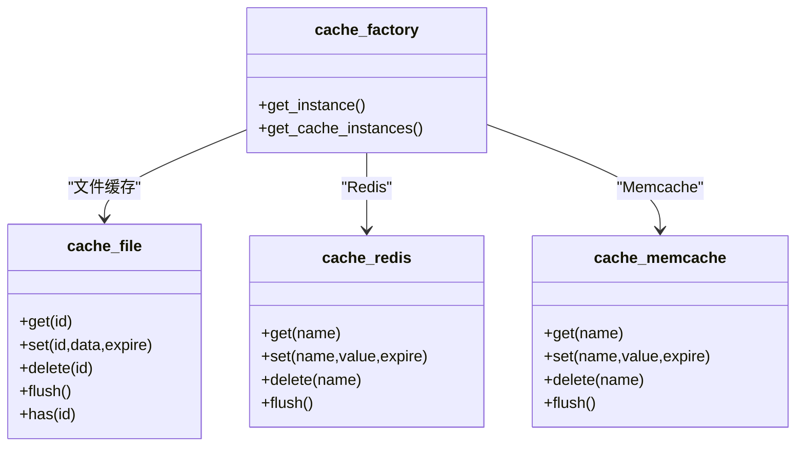
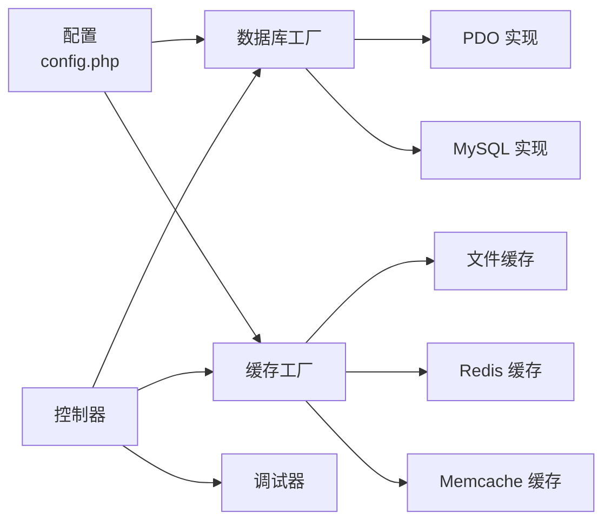

# 性能测试

<cite>
**本文引用的文件**
- [index.php](file://index.php)
- [config.php](file://common/config/config.php)
- [db_factory.class.php](file://ryphp/core/class/db_factory.class.php)
- [cache_factory.class.php](file://ryphp/core/class/cache_factory.class.php)
- [db_mysql.class.php](file://ryphp/core/class/db_mysql.class.php)
- [db_pdo_optimized.class.php](file://ryphp/core/class/db_pdo_optimized.class.php)
- [cache_file.class.php](file://ryphp/core/class/cache_file.class.php)
- [cache_redis.class.php](file://ryphp/core/class/cache_redis.class.php)
- [cache_memcache.class.php](file://ryphp/core/class/cache_memcache.class.php)
- [debug.class.php](file://ryphp/core/class/debug.class.php)
- [index.class.php](file://application/index/controller/index.class.php)
</cite>

## 目录
1. [简介](#简介)
2. [项目结构](#项目结构)
3. [核心组件](#核心组件)
4. [架构总览](#架构总览)
5. [详细组件分析](#详细组件分析)
6. [依赖关系分析](#依赖关系分析)
7. [性能考量](#性能考量)
8. [故障排查指南](#故障排查指南)
9. [结论](#结论)
10. [附录](#附录)

## 简介
本文件面向开发者与测试工程师，围绕 LRYBlog 的数据库层、缓存层、前端资源与运行时环境，系统性地给出性能测试方法论与实操步骤，覆盖以下方面：
- 负载测试：并发用户模拟、请求频率控制、响应时间监控
- 数据库性能测试：查询优化测试、连接池测试、慢查询与重连机制验证
- 缓存系统性能测试：文件缓存、Redis、Memcache 的吞吐与延迟对比
- 前端性能测试：页面加载时间、JS 执行性能、图片资源优化
- 内存使用测试：PHP 进程内存监控、数据库连接内存管理
- 网络性能测试：带宽与延迟测试
- 性能瓶颈识别与优化建议：基于现有代码实现的可测点与潜在优化方向
- 性能基线与回归测试：建立基线、持续集成中的回归策略

## 项目结构
LRYBlog 采用 MVC 分层与轻量框架内核，入口文件负责初始化系统，配置文件集中管理数据库、缓存、路由等全局参数；数据库与缓存通过工厂类按配置动态选择具体实现；控制器负责业务入口。

图示来源
- [index.php:1-18](file://index.php#L1-L18)
- [config.php:1-88](file://common/config/config.php#L1-L88)
- [db_factory.class.php:1-50](file://ryphp/core/class/db_factory.class.php#L1-L50)
- [cache_factory.class.php:1-84](file://ryphp/core/class/cache_factory.class.php#L1-L84)
- [db_mysql.class.php:1-667](file://ryphp/core/class/db_mysql.class.php#L1-L667)
- [db_pdo_optimized.class.php:1-767](file://ryphp/core/class/db_pdo_optimized.class.php#L1-L767)
- [cache_file.class.php:1-130](file://ryphp/core/class/cache_file.class.php#L1-L130)
- [cache_redis.class.php:1-108](file://ryphp/core/class/cache_redis.class.php#L1-L108)
- [cache_memcache.class.php:1-91](file://ryphp/core/class/cache_memcache.class.php#L1-L91)
- [index.class.php:1-18](file://application/index/controller/index.class.php#L1-L18)

章节来源
- [index.php:1-18](file://index.php#L1-L18)
- [config.php:1-88](file://common/config/config.php#L1-L88)
- [index.class.php:1-18](file://application/index/controller/index.class.php#L1-L18)

## 核心组件
- 入口与初始化：统一入口文件定义调试开关与根路径，随后调用框架初始化，进入路由与控制器分发。
- 配置中心：集中管理数据库类型与连接参数、缓存类型与各实现配置、Cookie、上传等系统级参数。
- 数据库工厂：根据配置动态加载 PDO 或 MySQL 扩展实现，支持连接池与重连逻辑。
- 缓存工厂：根据配置动态加载文件、Redis 或 Memcache 实现，提供统一的 get/set/delete/flush 接口。
- 调试与统计：在调试模式下记录 SQL 与耗时，提供脚本总耗时统计，辅助性能分析。

章节来源
- [index.php:10-18](file://index.php#L10-L18)
- [config.php:13-86](file://common/config/config.php#L13-L86)
- [db_factory.class.php:11-50](file://ryphp/core/class/db_factory.class.php#L11-L50)
- [cache_factory.class.php:36-84](file://ryphp/core/class/cache_factory.class.php#L36-L84)
- [debug.class.php:30-41](file://ryphp/core/class/debug.class.php#L30-L41)

## 架构总览
下图展示从请求到数据库/缓存的关键交互路径，以及可进行性能测试的关键节点。

图示来源
- [index.class.php:14-17](file://application/index/controller/index.class.php#L14-L17)
- [db_factory.class.php:38-49](file://ryphp/core/class/db_factory.class.php#L38-L49)
- [db_pdo_optimized.class.php:180-208](file://ryphp/core/class/db_pdo_optimized.class.php#L180-L208)
- [cache_factory.class.php:77-82](file://ryphp/core/class/cache_factory.class.php#L77-L82)
- [cache_file.class.php:17-46](file://ryphp/core/class/cache_file.class.php#L17-L46)
- [cache_redis.class.php:79-87](file://ryphp/core/class/cache_redis.class.php#L79-L87)
- [cache_memcache.class.php:62-69](file://ryphp/core/class/cache_memcache.class.php#L62-L69)
- [debug.class.php:116-128](file://ryphp/core/class/debug.class.php#L116-L128)

## 详细组件分析

### 数据库层性能测试
- 连接池与重连
  - PDO 实现支持连接池与“服务端断开重连”逻辑，适合高并发场景下的稳定性验证。
  - MySQL 扩展实现同样维护连接池，但已标注为较旧实现，建议优先使用 PDO。
- 查询执行与调试
  - 调试模式下，SQL 与执行耗时会被记录，可用于定位慢查询与热点路径。
- 测试要点
  - 并发连接上限与超时设置
  - 预处理语句与绑定参数对性能的影响
  - 事务开启/提交/回滚的开销
  - 慢查询阈值与重连触发频率

图示来源
- [db_pdo_optimized.class.php:106-119](file://ryphp/core/class/db_pdo_optimized.class.php#L106-L119)
- [db_pdo_optimized.class.php:180-208](file://ryphp/core/class/db_pdo_optimized.class.php#L180-L208)
- [db_mysql.class.php:67-78](file://ryphp/core/class/db_mysql.class.php#L67-L78)
- [db_mysql.class.php:146-152](file://ryphp/core/class/db_mysql.class.php#L146-L152)
- [debug.class.php:116-128](file://ryphp/core/class/debug.class.php#L116-L128)

章节来源
- [db_pdo_optimized.class.php:87-97](file://ryphp/core/class/db_pdo_optimized.class.php#L87-L97)
- [db_pdo_optimized.class.php:106-119](file://ryphp/core/class/db_pdo_optimized.class.php#L106-L119)
- [db_pdo_optimized.class.php:180-208](file://ryphp/core/class/db_pdo_optimized.class.php#L180-L208)
- [db_mysql.class.php:36-49](file://ryphp/core/class/db_mysql.class.php#L36-L49)
- [db_mysql.class.php:67-78](file://ryphp/core/class/db_mysql.class.php#L67-L78)
- [db_mysql.class.php:146-152](file://ryphp/core/class/db_mysql.class.php#L146-L152)
- [debug.class.php:116-128](file://ryphp/core/class/debug.class.php#L116-L128)

### 缓存层性能测试
- 工厂模式与多实现
  - 文件缓存：基于磁盘文件，适合小规模、低频写入场景；注意序列化/可执行文件两种存储模式差异。
  - Redis：支持长连接、过期时间、前缀；适合高并发读写与分布式共享。
  - Memcache：支持长连接、过期时间、前缀；适合高吞吐场景。
- 测试要点
  - 命中率与延迟：不同实现的 get/set/delete/flush 吞吐与 P95/P99 延迟
  - 过期策略与内存占用：不同 expire 配置下的内存压力
  - 并发一致性：多进程/多线程下的并发读写一致性

图示来源
- [cache_factory.class.php:36-84](file://ryphp/core/class/cache_factory.class.php#L36-L84)
- [cache_file.class.php:17-128](file://ryphp/core/class/cache_file.class.php#L17-L128)
- [cache_redis.class.php:60-105](file://ryphp/core/class/cache_redis.class.php#L60-L105)
- [cache_memcache.class.php:47-89](file://ryphp/core/class/cache_memcache.class.php#L47-L89)

章节来源
- [cache_factory.class.php:36-84](file://ryphp/core/class/cache_factory.class.php#L36-L84)
- [cache_file.class.php:17-128](file://ryphp/core/class/cache_file.class.php#L17-L128)
- [cache_redis.class.php:60-105](file://ryphp/core/class/cache_redis.class.php#L60-L105)
- [cache_memcache.class.php:47-89](file://ryphp/core/class/cache_memcache.class.php#L47-L89)

### 前端性能测试
- 页面加载时间：关注首屏渲染、关键资源加载、阻塞与异步加载策略
- JavaScript 执行性能：评估脚本解析与执行时间，避免长任务阻塞主线程
- 图片资源优化：压缩、懒加载、CDN 与格式选择（WebP/JPEG2000）对加载时间的影响
- 工具建议：浏览器开发者工具 Performance/Network 面板、Lighthouse、PageSpeed Insights

[本节为通用实践说明，不直接分析具体源码文件]

### 内存使用测试
- PHP 进程内存监控：使用系统工具观察进程 RSS/堆栈变化，结合业务峰值流量时段
- 数据库连接内存管理：检查连接池大小、长连接与短连接的内存占用差异
- 缓存内存占用：文件缓存的磁盘占用与 inode 数量，Redis/Memcache 的内存碎片与淘汰策略

[本节为通用实践说明，不直接分析具体源码文件]

### 网络性能测试
- 带宽测试：模拟真实并发请求下的吞吐与丢包率
- 延迟测试：Ping/Traceroute、HTTP 请求往返时间（RTT），区分内网与跨地域链路
- CDN 与静态资源：边缘节点命中率与回源比例

[本节为通用实践说明，不直接分析具体源码文件]

## 依赖关系分析
- 配置驱动：数据库与缓存实现由配置决定，便于在不同环境快速切换
- 工厂解耦：控制器仅依赖工厂接口，降低对具体实现的耦合度
- 调试集成：调试器在执行路径中埋点，便于性能数据采集

图示来源
- [config.php:13-86](file://common/config/config.php#L13-L86)
- [db_factory.class.php:11-50](file://ryphp/core/class/db_factory.class.php#L11-L50)
- [cache_factory.class.php:36-84](file://ryphp/core/class/cache_factory.class.php#L36-L84)
- [debug.class.php:116-128](file://ryphp/core/class/debug.class.php#L116-L128)

章节来源
- [config.php:13-86](file://common/config/config.php#L13-L86)
- [db_factory.class.php:11-50](file://ryphp/core/class/db_factory.class.php#L11-L50)
- [cache_factory.class.php:36-84](file://ryphp/core/class/cache_factory.class.php#L36-L84)
- [debug.class.php:116-128](file://ryphp/core/class/debug.class.php#L116-L128)

## 性能考量
- 数据库
  - 优先使用 PDO 优化实现，利用预处理与绑定参数减少 SQL 注入与编译开销
  - 合理设置连接池与超时，避免连接泄漏导致的性能退化
  - 利用调试日志定位慢查询，配合索引与查询计划优化
- 缓存
  - 高并发场景优先 Redis/Memcache，文件缓存适合低频场景
  - 控制过期时间与前缀，避免命名冲突与清理困难
- 前端
  - 资源压缩与懒加载、关键路径最小化、合理缓存策略
- 内存与网络
  - 监控进程内存与连接内存，优化长连接与连接复用
  - 网络层面优化 RTT 与带宽利用率

[本节为通用指导，不直接分析具体源码文件]

## 故障排查指南
- 调试模式启用
  - 入口文件开启调试常量，便于收集 SQL 与耗时信息
- 错误捕获与日志
  - 调试器提供错误捕获与异常处理，结合错误日志定位问题
- 常见问题
  - 数据库连接断开：PDO 实现具备重连逻辑，需关注重连频率与业务影响
  - 缓存不可用：检查扩展是否加载、目标服务可达性与认证配置

章节来源
- [index.php:10](file://index.php#L10)
- [debug.class.php:75-112](file://ryphp/core/class/debug.class.php#L75-L112)
- [db_pdo_optimized.class.php:202-207](file://ryphp/core/class/db_pdo_optimized.class.php#L202-L207)

## 结论
通过对数据库与缓存工厂的统一抽象、调试器的埋点能力，以及配置驱动的灵活性，LRYBlog 为性能测试提供了清晰的切入点。建议以“基线—压测—定位—优化—回归”的闭环流程推进，结合本文提供的测试方法与工具建议，逐步提升系统在高并发与复杂业务场景下的稳定性与性能表现。

[本节为总结性内容，不直接分析具体源码文件]

## 附录

### 性能测试工具与方法速查
- 负载测试
  - Apache Bench（ab）、wrk、JMeter、Locust
  - 关注并发数、RPS、P95/P99 响应时间、错误率
- 数据库测试
  - 慢查询日志、EXPLAIN 分析、连接池监控
  - 建议分别测试 PDO 与 MySQL 扩展实现的差异
- 缓存测试
  - Redis/Memcache 官方 benchmark 工具
  - 命中率、延迟、内存占用、持久化策略
- 前端测试
  - Lighthouse、WebPageTest、Browser devtools
  - 关注 TTFB、FCP、LCP、CLS 等指标
- 内存与网络
  - top/htop、valgrind、strace
  - iperf3、pingtraceroute、抓包分析

[本节为通用实践说明，不直接分析具体源码文件]