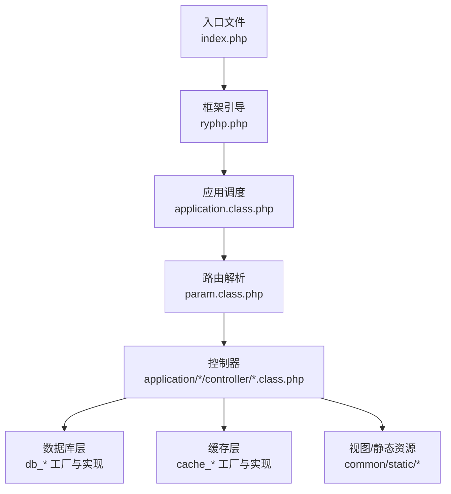
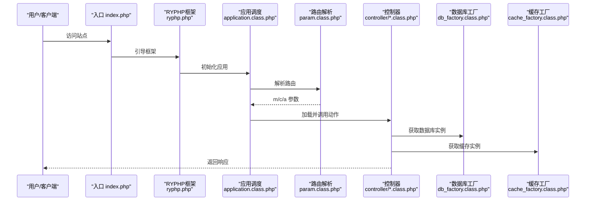
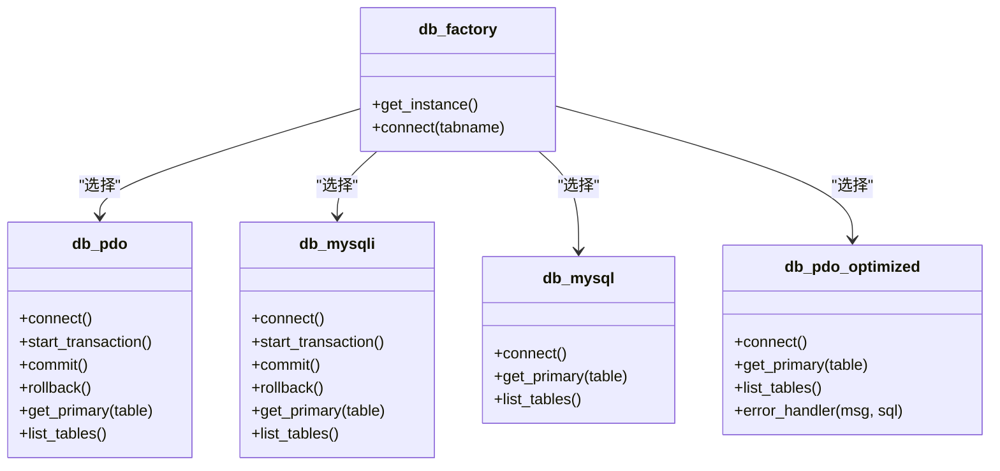
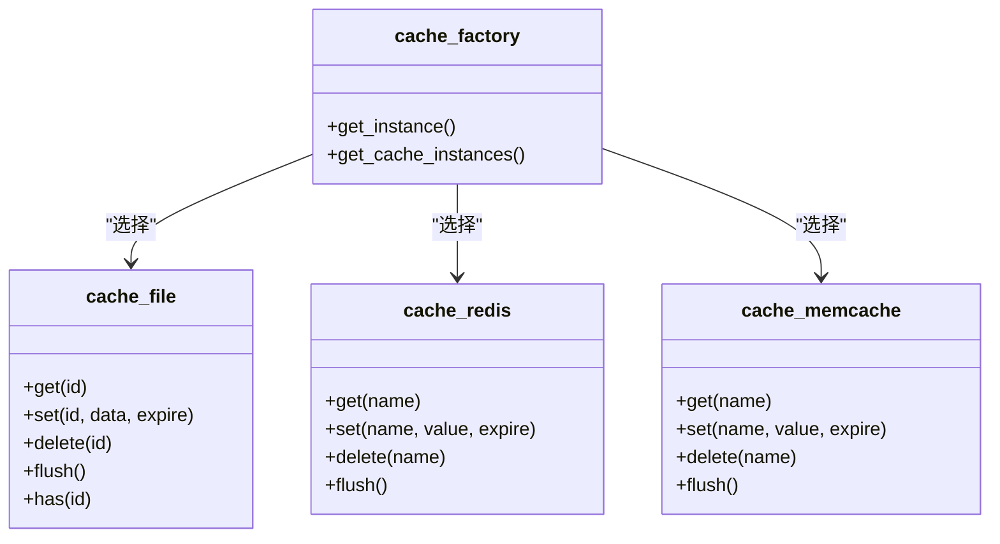
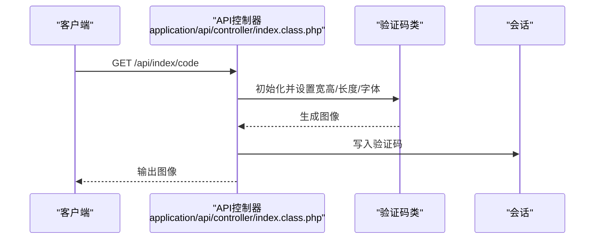
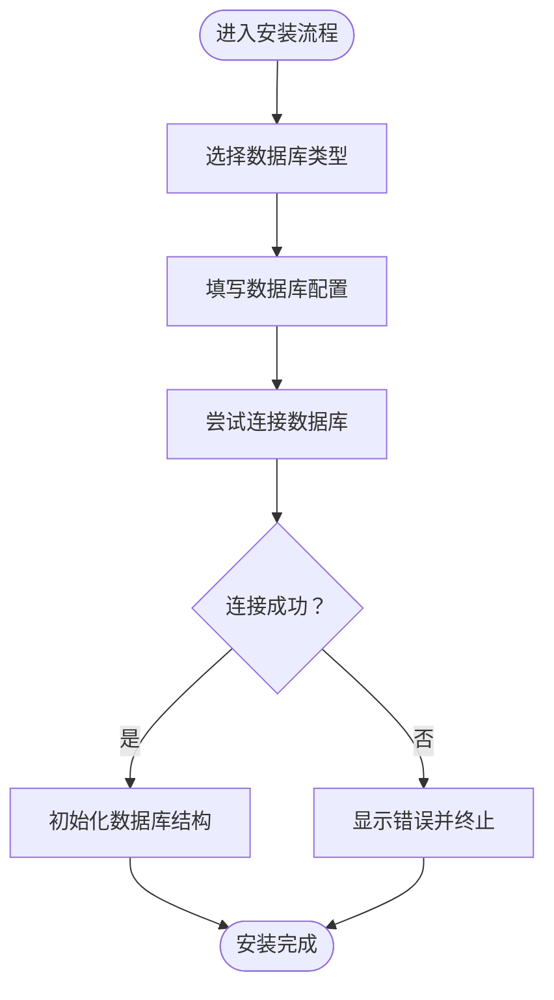
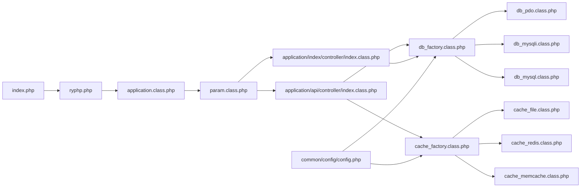

# 测试指南

<cite>
**本文引用的文件**
- [README.md](file://README.md)
- [index.php](file://index.php)
- [ryphp.php](file://ryphp/ryphp.php)
- [application.class.php](file://ryphp/core/class/application.class.php)
- [param.class.php](file://ryphp/core/class/param.class.php)
- [db_factory.class.php](file://ryphp/core/class/db_factory.class.php)
- [db_pdo.class.php](file://ryphp/core/class/db_pdo.class.php)
- [db_pdo_optimized.class.php](file://ryphp/core/class/db_pdo_optimized.class.php)
- [db_mysqli.class.php](file://ryphp/core/class/db_mysqli.class.php)
- [db_mysql.class.php](file://ryphp/core/class/db_mysql.class.php)
- [cache_factory.class.php](file://ryphp/core/class/cache_factory.class.php)
- [cache_file.class.php](file://ryphp/core/class/cache_file.class.php)
- [cache_redis.class.php](file://ryphp/core/class/cache_redis.class.php)
- [cache_memcache.class.php](file://ryphp/core/class/cache_memcache.class.php)
- [config.php](file://common/config/config.php)
- [index.class.php](file://application/api/controller/index.class.php)
- [index.class.php](file://application/index/controller/index.class.php)
- [index.html](file://index.html)
- [install/index.php](file://application/install/index.php)
- [s3.php](file://application/install/templates/s3.php)
- [controller.php](file://common/static/plugin/ueditor/php/controller.php)
- [lry_common.js](file://common/static/js/lry_common.js)
</cite>

## 目录
1. [引言](#引言)
2. [项目结构](#项目结构)
3. [核心组件](#核心组件)
4. [架构总览](#架构总览)
5. [详细组件分析](#详细组件分析)
6. [依赖关系分析](#依赖关系分析)
7. [性能考量](#性能考量)
8. [故障排查指南](#故障排查指南)
9. [结论](#结论)
10. [附录](#附录)

## 引言
本测试指南面向LRYBlog项目，目标是帮助开发者建立完善的测试体系，覆盖单元测试、集成测试、覆盖率分析、自动化测试流程、测试数据管理、性能与压力测试，以及TDD实践与代码重构技巧。文档以仓库现有代码为基础，结合框架层、数据库层、缓存层与业务控制器，给出可落地的测试策略与最佳实践。

## 项目结构
LRYBlog采用自研轻量框架RYPHP，前端通过入口文件加载框架并路由到控制器；数据库与缓存通过工厂类按配置选择实现；安装流程与UEditor上传接口位于安装模块与插件目录中。

图表来源
- [index.php](file://index.php#L1-L200)
- [ryphp.php](file://ryphp/ryphp.php#L80-L120)
- [application.class.php](file://ryphp/core/class/application.class.php#L1-L40)
- [param.class.php](file://ryphp/core/class/param.class.php#L63-L99)

章节来源
- [README.md](file://README.md#L1-L6)
- [index.php](file://index.php#L1-L200)
- [ryphp.php](file://ryphp/ryphp.php#L80-L120)

## 核心组件
- 入口与框架引导：负责常量定义、时区设置、静态资源URL计算、类加载与应用启动。
- 应用调度：初始化调试、错误处理，解析路由，加载控制器并调用动作。
- 路由解析：支持PATHINFO模式，解析模块/控制器/动作及附加参数。
- 数据库层：工厂类根据配置选择PDO/Mysqli/原生MySQL实现，统一提供连接、事务、表元信息等能力。
- 缓存层：工厂类根据配置选择File/Redis/Memcache实现，提供get/set/delete/flush等基础能力。
- 业务控制器：示例包含API验证码控制器与首页控制器，分别演示验证码生成与列表查询逻辑。

章节来源
- [ryphp.php](file://ryphp/ryphp.php#L1-L204)
- [application.class.php](file://ryphp/core/class/application.class.php#L1-L40)
- [param.class.php](file://ryphp/core/class/param.class.php#L63-L99)
- [db_factory.class.php](file://ryphp/core/class/db_factory.class.php#L1-L50)
- [cache_factory.class.php](file://ryphp/core/class/cache_factory.class.php#L1-L84)
- [index.class.php](file://application/api/controller/index.class.php#L1-L22)
- [index.class.php](file://application/index/controller/index.class.php#L1-L18)

## 架构总览
下图展示从入口到控制器、再到数据库与缓存的关键交互路径。

图表来源
- [index.php](file://index.php#L1-L200)
- [ryphp.php](file://ryphp/ryphp.php#L80-L120)
- [application.class.php](file://ryphp/core/class/application.class.php#L1-L40)
- [param.class.php](file://ryphp/core/class/param.class.php#L63-L99)
- [db_factory.class.php](file://ryphp/core/class/db_factory.class.php#L1-L50)
- [cache_factory.class.php](file://ryphp/core/class/cache_factory.class.php#L1-L84)

## 详细组件分析

### 数据库层（PDO/Mysqli/MySQL）
- 工厂选择：根据配置选择具体实现，统一对外接口。
- 连接与异常：不同实现封装连接与异常处理，便于上层无感切换。
- 事务与元信息：提供事务控制与表主键、表清单等元信息查询能力。
- 优化实现：存在优化版PDO实现，增强错误处理与一致性。

图表来源
- [db_factory.class.php](file://ryphp/core/class/db_factory.class.php#L1-L50)
- [db_pdo.class.php](file://ryphp/core/class/db_pdo.class.php#L1-L42)
- [db_mysqli.class.php](file://ryphp/core/class/db_mysqli.class.php#L1-L60)
- [db_mysql.class.php](file://ryphp/core/class/db_mysql.class.php#L1-L50)
- [db_pdo_optimized.class.php](file://ryphp/core/class/db_pdo_optimized.class.php#L75-L111)

章节来源
- [db_factory.class.php](file://ryphp/core/class/db_factory.class.php#L1-L50)
- [db_pdo.class.php](file://ryphp/core/class/db_pdo.class.php#L1-L42)
- [db_pdo_optimized.class.php](file://ryphp/core/class/db_pdo_optimized.class.php#L75-L111)
- [db_mysqli.class.php](file://ryphp/core/class/db_mysqli.class.php#L1-L60)
- [db_mysql.class.php](file://ryphp/core/class/db_mysql.class.php#L1-L50)

### 缓存层（File/Redis/Memcache）
- 工厂选择：根据配置动态加载对应缓存实现。
- 统一接口：提供get/set/delete/flush等常用方法。
- 文件缓存：支持序列化与可执行数组两种存储模式。
- Redis/Memcache：支持前缀、过期、持久连接等配置。

图表来源
- [cache_factory.class.php](file://ryphp/core/class/cache_factory.class.php#L1-L84)
- [cache_file.class.php](file://ryphp/core/class/cache_file.class.php#L1-L130)
- [cache_redis.class.php](file://ryphp/core/class/cache_redis.class.php#L1-L108)
- [cache_memcache.class.php](file://ryphp/core/class/cache_memcache.class.php#L1-L91)

章节来源
- [cache_factory.class.php](file://ryphp/core/class/cache_factory.class.php#L1-L84)
- [cache_file.class.php](file://ryphp/core/class/cache_file.class.php#L1-L130)
- [cache_redis.class.php](file://ryphp/core/class/cache_redis.class.php#L1-L108)
- [cache_memcache.class.php](file://ryphp/core/class/cache_memcache.class.php#L1-L91)

### 业务控制器（示例）
- API验证码控制器：根据参数生成验证码并写入会话。
- 首页控制器：接收分页参数，查询分类列表并输出。

图表来源
- [index.class.php](file://application/api/controller/index.class.php#L1-L22)

章节来源
- [index.class.php](file://application/api/controller/index.class.php#L1-L22)
- [index.class.php](file://application/index/controller/index.class.php#L1-L18)

### 安装与上传接口（集成测试切入点）
- 安装流程：安装页面模板与后端安装脚本，支持数据库类型选择与连接校验。
- UEditor上传：后端控制器聚合上传、列出、配置等功能，受站点配置影响。

图表来源
- [install/index.php](file://application/install/index.php#L150-L160)
- [s3.php](file://application/install/templates/s3.php#L31-L51)

章节来源
- [install/index.php](file://application/install/index.php#L150-L160)
- [s3.php](file://application/install/templates/s3.php#L31-L51)
- [controller.php](file://common/static/plugin/ueditor/php/controller.php#L1-L43)

## 依赖关系分析
- 入口依赖框架引导，框架引导依赖应用调度与路由解析。
- 控制器依赖数据库与缓存工厂，工厂再依赖具体实现类。
- 配置文件贯穿全局，决定数据库类型、缓存类型、上传策略等。

图表来源
- [index.php](file://index.php#L1-L200)
- [ryphp.php](file://ryphp/ryphp.php#L80-L120)
- [application.class.php](file://ryphp/core/class/application.class.php#L1-L40)
- [param.class.php](file://ryphp/core/class/param.class.php#L63-L99)
- [index.class.php](file://application/api/controller/index.class.php#L1-L22)
- [index.class.php](file://application/index/controller/index.class.php#L1-L18)
- [db_factory.class.php](file://ryphp/core/class/db_factory.class.php#L1-L50)
- [cache_factory.class.php](file://ryphp/core/class/cache_factory.class.php#L1-L84)
- [config.php](file://common/config/config.php#L1-L88)

章节来源
- [config.php](file://common/config/config.php#L1-L88)

## 性能考量
- 数据库连接与事务：优先使用PDO/Mysqli以获得更好的异常与性能表现；在高并发场景建议启用连接池与只读事务分离。
- 缓存策略：热点数据走Redis，静态配置走文件缓存；合理设置过期时间与前缀，避免键冲突。
- 路由与静态资源：确保PATHINFO配置正确，减少不必要的重定向与重复请求。
- 上传与图片：结合站点配置限制上传大小与类型，避免大文件拖慢服务。

## 故障排查指南
- 数据库连接失败：检查配置文件中的主机、端口、用户名、密码与字符集；查看工厂类选择的数据库类型是否匹配。
- 缓存不可用：确认扩展已安装且配置正确；检查缓存目录权限（文件缓存）或服务连通性（Redis/Memcache）。
- 路由异常：核对路由映射与规则，确保PATHINFO模式与服务器配置一致。
- 安装阶段报错：关注安装脚本的异常抛出与提示信息，优先验证数据库连通性与权限。
- 上传接口问题：检查UEditor后端控制器与站点配置，确认允许的文件类型与大小。

章节来源
- [config.php](file://common/config/config.php#L13-L21)
- [db_factory.class.php](file://ryphp/core/class/db_factory.class.php#L14-L31)
- [cache_factory.class.php](file://ryphp/core/class/cache_factory.class.php#L39-L58)
- [install/index.php](file://application/install/index.php#L150-L160)
- [controller.php](file://common/static/plugin/ueditor/php/controller.php#L1-L43)

## 结论
通过明确的测试边界与分层策略，LRYBlog可在单元测试、集成测试、覆盖率分析与自动化流水线方面形成闭环。建议以控制器与数据库/缓存工厂为核心测试对象，结合安装与上传接口进行端到端验证，并逐步完善性能与压力测试，最终实现高质量、可持续演进的测试体系。

## 附录

### 单元测试编写要点（基于现有组件）
- PHPUnit框架：在项目根目录新增tests目录，按模块划分命名空间，使用断言验证控制器输出、数据库查询结果与缓存读写。
- 测试用例设计：针对控制器动作输入参数、异常分支与边界值；针对数据库层的事务、主键与表清单；针对缓存层的序列化/反序列化与过期策略。
- 模拟对象：使用Mock替换真实数据库与缓存连接，确保测试可重复且不依赖外部服务。

### 集成测试实施策略
- 数据库测试：使用独立测试数据库，迁移最小化schema，在事务中回滚，保证数据隔离。
- API接口测试：构造HTTP请求，验证状态码、响应结构与会话写入（如验证码）。
- 用户界面测试：结合前端脚本与静态页面，验证交互行为（如删除确认弹窗）。

### 代码覆盖率分析
- 工具：Xdebug或PCOV收集覆盖率，生成HTML报告，定位未覆盖路径。
- 报告解读：关注控制器分支、数据库事务与缓存异常处理路径，补充关键分支测试。

### 自动化测试流程与CI
- CI配置：在CI中执行单元测试与覆盖率统计，失败即阻断合并。
- 测试环境：容器化部署测试数据库与缓存，确保环境一致性。

### 测试数据准备与清理
- 数据库：使用迁移脚本初始化测试数据，测试结束后清空或回滚。
- 缓存：测试前flush缓存，避免脏数据影响结果。
- 会话：在测试中显式管理会话生命周期，避免跨用例污染。

### 性能与压力测试
- 负载测试：使用工具对首页与API接口施压，观察响应时间与错误率。
- 并发测试：模拟高并发请求，验证数据库连接池与缓存命中率。

### TDD与重构实践
- TDD：先写失败用例，再实现最小逻辑，最后重构提升可测试性与可维护性。
- 重构技巧：拆分控制器职责、抽象数据库与缓存访问、引入仓储模式以降低耦合。