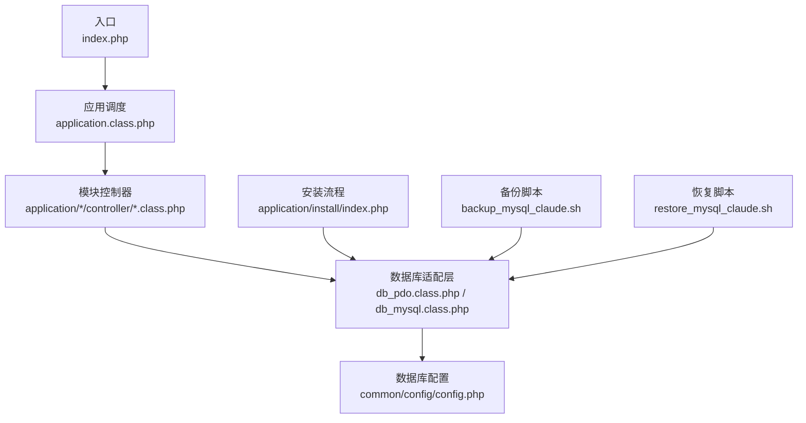
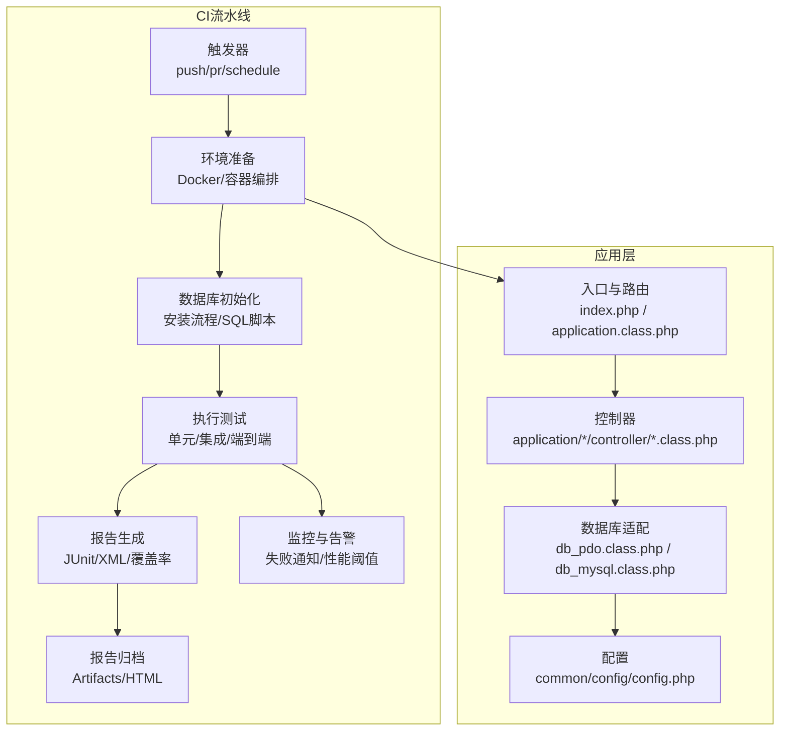
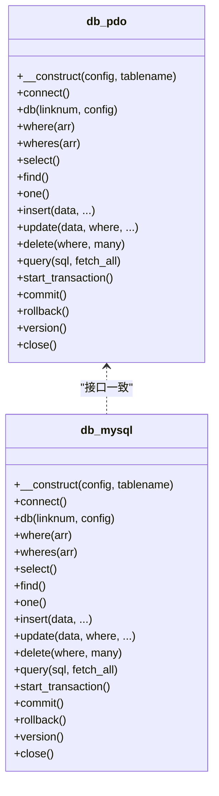
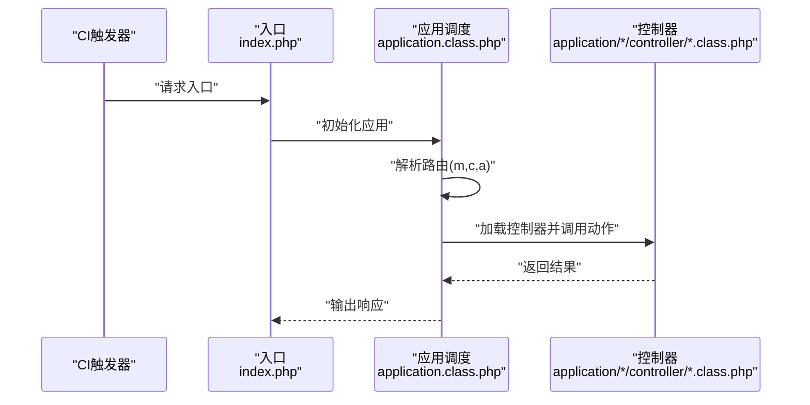
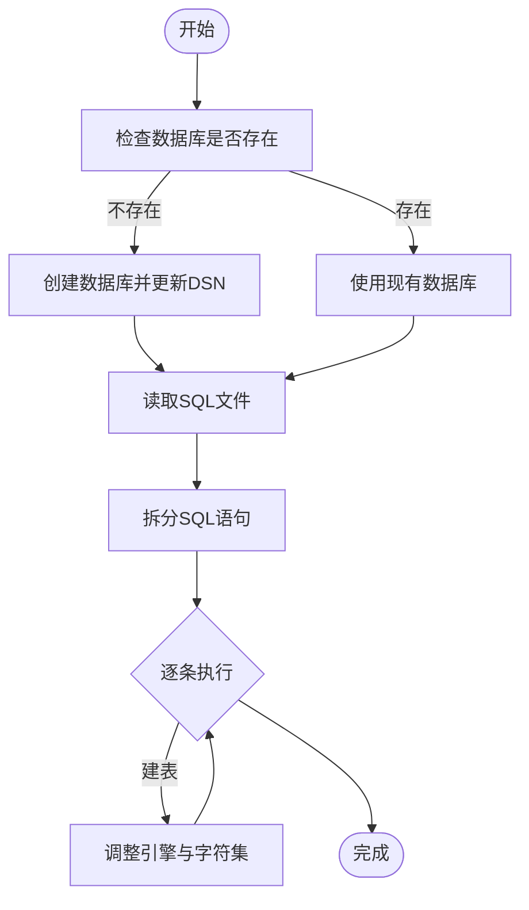
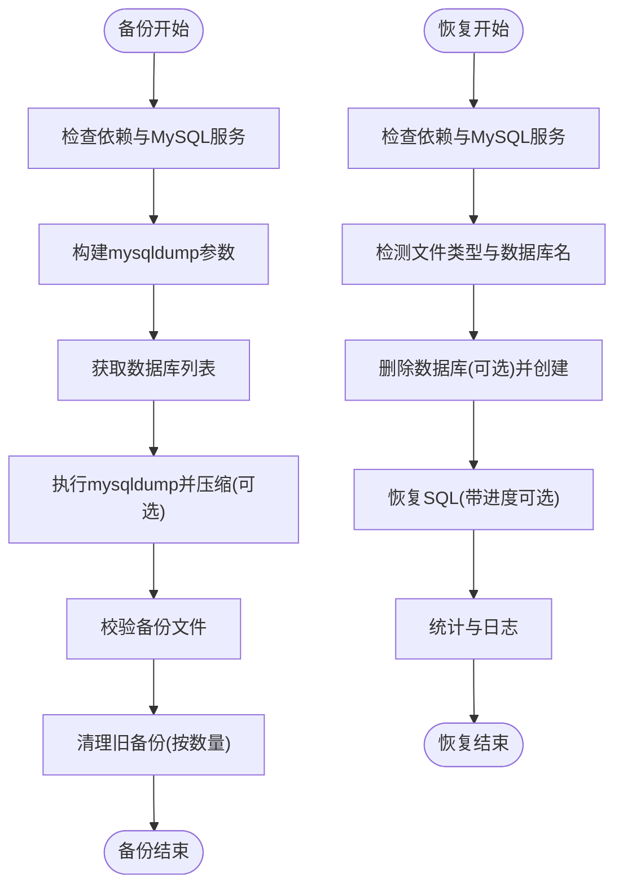
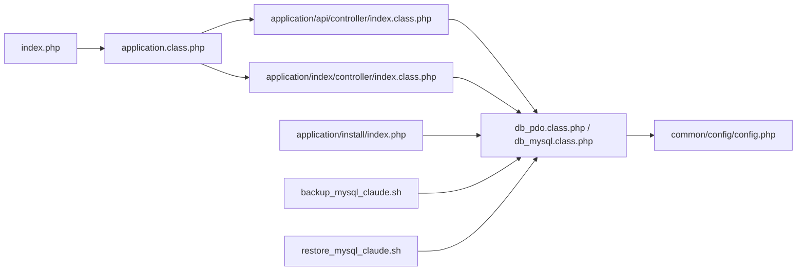

# 测试自动化

<cite>
**本文引用的文件**
- [README.md](file://README.md)
- [index.php](file://index.php)
- [common/config/config.php](file://common/config/config.php)
- [backup_mysql_claude.sh](file://backup_mysql_claude.sh)
- [restore_mysql_claude.sh](file://restore_mysql_claude.sh)
- [ryphp/core/class/db_mysql.class.php](file://ryphp/core/class/db_mysql.class.php)
- [ryphp/core/class/db_pdo.class.php](file://ryphp/core/class/db_pdo.class.php)
- [ryphp/core/class/application.class.php](file://ryphp/core/class/application.class.php)
- [application/api/controller/index.class.php](file://application/api/controller/index.class.php)
- [application/index/controller/index.class.php](file://application/index/controller/index.class.php)
- [application/install/index.php](file://application/install/index.php)
- [ryphp/core/function/global.func.php](file://ryphp/core/function/global.func.php)
</cite>

## 目录
1. [简介](#简介)
2. [项目结构](#项目结构)
3. [核心组件](#核心组件)
4. [架构总览](#架构总览)
5. [详细组件分析](#详细组件分析)
6. [依赖分析](#依赖分析)
7. [性能考量](#性能考量)
8. [故障排查指南](#故障排查指南)
9. [结论](#结论)
10. [附录](#附录)

## 简介
本文件面向LRYBlog项目的测试自动化体系建设，围绕持续集成（CI）、测试环境自动部署、自动化测试脚本、测试数据准备与清理、测试报告生成、监控与告警、并行测试与流程优化等方面，提供可落地的实施指南与最佳实践。文档以仓库现有文件为基础，结合PHP应用与数据库交互特性，给出与实际代码结构相匹配的实施方案。

## 项目结构
LRYBlog采用模块化与MVC架构，入口文件负责框架初始化，配置集中于系统配置文件，数据库访问通过PDO或MySQL扩展实现，控制器位于application目录下的各模块中。安装流程包含数据库初始化逻辑，便于自动化部署时复用。

**图表来源**
- [index.php:1-18](file://index.php#L1-L18)
- [ryphp/core/class/application.class.php:1-118](file://ryphp/core/class/application.class.php#L1-L118)
- [application/api/controller/index.class.php:1-22](file://application/api/controller/index.class.php#L1-L22)
- [application/index/controller/index.class.php:1-18](file://application/index/controller/index.class.php#L1-L18)
- [ryphp/core/class/db_pdo.class.php:1-646](file://ryphp/core/class/db_pdo.class.php#L1-L646)
- [ryphp/core/class/db_mysql.class.php:1-667](file://ryphp/core/class/db_mysql.class.php#L1-L667)
- [common/config/config.php:1-88](file://common/config/config.php#L1-L88)
- [application/install/index.php:162-222](file://application/install/index.php#L162-L222)
- [backup_mysql_claude.sh:1-392](file://backup_mysql_claude.sh#L1-L392)
- [restore_mysql_claude.sh:1-412](file://restore_mysql_claude.sh#L1-L412)

**章节来源**
- [README.md:1-6](file://README.md#L1-L6)
- [index.php:1-18](file://index.php#L1-L18)
- [ryphp/core/class/application.class.php:1-118](file://ryphp/core/class/application.class.php#L1-L118)
- [common/config/config.php:1-88](file://common/config/config.php#L1-L88)

## 核心组件
- 应用入口与框架初始化：入口文件定义调试开关与根路径，加载核心框架并初始化应用。
- 应用调度与路由：应用类负责加载控制器、执行动作方法，并在调试模式下输出调试信息。
- 数据库适配层：提供PDO与MySQL两种数据库访问实现，统一查询接口与事务控制。
- 配置中心：集中管理数据库、缓存、Cookie、上传等系统配置。
- 安装与数据库初始化：安装流程包含数据库创建、表结构创建与数据导入。
- 备份与恢复：提供MySQL备份与恢复脚本，支持压缩、校验与日志记录。

**章节来源**
- [index.php:1-18](file://index.php#L1-L18)
- [ryphp/core/class/application.class.php:1-118](file://ryphp/core/class/application.class.php#L1-L118)
- [ryphp/core/class/db_pdo.class.php:1-646](file://ryphp/core/class/db_pdo.class.php#L1-L646)
- [ryphp/core/class/db_mysql.class.php:1-667](file://ryphp/core/class/db_mysql.class.php#L1-L667)
- [common/config/config.php:1-88](file://common/config/config.php#L1-L88)
- [application/install/index.php:162-222](file://application/install/index.php#L162-L222)
- [backup_mysql_claude.sh:1-392](file://backup_mysql_claude.sh#L1-L392)
- [restore_mysql_claude.sh:1-412](file://restore_mysql_claude.sh#L1-L412)

## 架构总览
下图展示测试自动化涉及的关键流程：CI触发、测试环境准备、数据库初始化、测试执行、报告生成与归档、监控与告警。

**图表来源**
- [index.php:1-18](file://index.php#L1-L18)
- [ryphp/core/class/application.class.php:1-118](file://ryphp/core/class/application.class.php#L1-L118)
- [application/api/controller/index.class.php:1-22](file://application/api/controller/index.class.php#L1-L22)
- [application/index/controller/index.class.php:1-18](file://application/index/controller/index.class.php#L1-L18)
- [ryphp/core/class/db_pdo.class.php:1-646](file://ryphp/core/class/db_pdo.class.php#L1-L646)
- [ryphp/core/class/db_mysql.class.php:1-667](file://ryphp/core/class/db_mysql.class.php#L1-L667)
- [common/config/config.php:1-88](file://common/config/config.php#L1-L88)
- [application/install/index.php:162-222](file://application/install/index.php#L162-L222)

## 详细组件分析

### 组件A：数据库适配层（PDO与MySQL）
- 设计要点
  - 统一查询接口：where、wheres、select、find、one、insert、update、delete、query等。
  - 事务支持：start_transaction、commit、rollback。
  - 安全性：PDO预处理绑定、MySQL扩展安全过滤。
  - 可扩展性：支持多连接池与表前缀替换。
- 测试关注点
  - 连接与配置：确保db_host、db_name、db_user、db_pwd、db_prefix正确。
  - 事务一致性：覆盖正常提交、回滚与异常场景。
  - SQL注入防护：wheres/where绑定参数与特殊字符处理。
  - 多连接切换：db(1,...)切换与连接池复用。

**图表来源**
- [ryphp/core/class/db_pdo.class.php:1-646](file://ryphp/core/class/db_pdo.class.php#L1-L646)
- [ryphp/core/class/db_mysql.class.php:1-667](file://ryphp/core/class/db_mysql.class.php#L1-L667)

**章节来源**
- [ryphp/core/class/db_pdo.class.php:1-646](file://ryphp/core/class/db_pdo.class.php#L1-L646)
- [ryphp/core/class/db_mysql.class.php:1-667](file://ryphp/core/class/db_mysql.class.php#L1-L667)
- [common/config/config.php:13-21](file://common/config/config.php#L13-L21)

### 组件B：应用入口与路由（CI触发与测试入口）
- 设计要点
  - 入口文件定义调试开关与根路径，加载核心框架并初始化应用。
  - 应用类负责路由解析、控制器加载与动作执行。
- 测试关注点
  - 调试模式对错误输出的影响。
  - 控制器加载与动作方法可见性（以下划线开头的动作不可访问）。
  - 路由参数传递与动作方法签名。

**图表来源**
- [index.php:1-18](file://index.php#L1-L18)
- [ryphp/core/class/application.class.php:1-118](file://ryphp/core/class/application.class.php#L1-L118)
- [application/api/controller/index.class.php:1-22](file://application/api/controller/index.class.php#L1-L22)
- [application/index/controller/index.class.php:1-18](file://application/index/controller/index.class.php#L1-L18)

**章节来源**
- [index.php:1-18](file://index.php#L1-L18)
- [ryphp/core/class/application.class.php:1-118](file://ryphp/core/class/application.class.php#L1-L118)
- [application/api/controller/index.class.php:1-22](file://application/api/controller/index.class.php#L1-L22)
- [application/index/controller/index.class.php:1-18](file://application/index/controller/index.class.php#L1-L18)

### 组件C：安装与数据库初始化（测试环境部署）
- 设计要点
  - 通过PDO连接数据库，若数据库不存在则创建。
  - 读取SQL文件并拆分执行，支持引擎与字符集调整。
- 测试关注点
  - 数据库连接参数与字符集配置。
  - SQL拆分与逐条执行的健壮性。
  - 引擎转换（MyISAM→InnoDB）与字符集（utf8→utf8mb4）。

**图表来源**
- [application/install/index.php:162-222](file://application/install/index.php#L162-L222)

**章节来源**
- [application/install/index.php:162-222](file://application/install/index.php#L162-L222)

### 组件D：备份与恢复（测试数据准备与清理）
- 设计要点
  - 备份：mysqldump参数组合、压缩、单事务、扩展插入、DROP TABLE等可配置；支持全库与单库备份；保留N份最新备份。
  - 恢复：自动识别压缩/非压缩、提取数据库名、创建数据库、可选删除覆盖、进度与统计输出。
- 测试关注点
  - 备份文件完整性校验与日志记录。
  - 恢复前确认与覆盖策略。
  - 权限与配置文件安全（600/400）。

**图表来源**
- [backup_mysql_claude.sh:1-392](file://backup_mysql_claude.sh#L1-L392)
- [restore_mysql_claude.sh:1-412](file://restore_mysql_claude.sh#L1-L412)

**章节来源**
- [backup_mysql_claude.sh:1-392](file://backup_mysql_claude.sh#L1-L392)
- [restore_mysql_claude.sh:1-412](file://restore_mysql_claude.sh#L1-L412)

## 依赖分析
- 入口与框架
  - 入口文件依赖核心框架初始化与URL模式常量定义。
- 路由与控制器
  - 应用类根据路由参数动态加载控制器与动作方法。
- 数据库访问
  - 控制器通过D()工厂加载模型，底层依赖PDO或MySQL扩展。
- 配置
  - 数据库连接参数、表前缀、字符集等集中于配置文件。
- 安装流程
  - 依赖PDO与INFORMATION_SCHEMA查询，执行SQL文件。

**图表来源**
- [index.php:1-18](file://index.php#L1-L18)
- [ryphp/core/class/application.class.php:1-118](file://ryphp/core/class/application.class.php#L1-L118)
- [application/api/controller/index.class.php:1-22](file://application/api/controller/index.class.php#L1-L22)
- [application/index/controller/index.class.php:1-18](file://application/index/controller/index.class.php#L1-L18)
- [ryphp/core/class/db_pdo.class.php:1-646](file://ryphp/core/class/db_pdo.class.php#L1-L646)
- [ryphp/core/class/db_mysql.class.php:1-667](file://ryphp/core/class/db_mysql.class.php#L1-L667)
- [common/config/config.php:1-88](file://common/config/config.php#L1-L88)
- [application/install/index.php:162-222](file://application/install/index.php#L162-L222)
- [backup_mysql_claude.sh:1-392](file://backup_mysql_claude.sh#L1-L392)
- [restore_mysql_claude.sh:1-412](file://restore_mysql_claude.sh#L1-L412)

**章节来源**
- [index.php:1-18](file://index.php#L1-L18)
- [ryphp/core/class/application.class.php:1-118](file://ryphp/core/class/application.class.php#L1-L118)
- [common/config/config.php:1-88](file://common/config/config.php#L1-L88)

## 性能考量
- 数据库连接与事务
  - 使用PDO预处理与绑定参数，减少SQL注入风险与解析开销。
  - 事务批处理与一次性提交，降低频繁提交带来的开销。
- 备份与恢复
  - 单事务备份保证一致性；压缩备份节省空间；按数量清理旧备份避免磁盘压力。
- 调试与日志
  - 调试模式下输出调试信息，生产关闭以减少I/O与响应时间。
- 并发与隔离
  - 测试环境使用独立数据库与表前缀，避免并发写入干扰。

[本节为通用指导，无需特定文件引用]

## 故障排查指南
- 数据库连接失败
  - 检查配置文件db_host、db_name、db_user、db_pwd与端口。
  - 确认MySQL服务状态与配置文件权限。
- 安装流程报错
  - 核对SQL文件路径与拆分逻辑；检查引擎与字符集转换是否生效。
- 备份/恢复异常
  - 校验mysqldump依赖与压缩文件完整性；查看日志文件定位问题。
- 路由与控制器
  - 确认动作方法可见性（以下划线开头不可访问）；检查路由参数传递。

**章节来源**
- [common/config/config.php:13-21](file://common/config/config.php#L13-L21)
- [application/install/index.php:162-222](file://application/install/index.php#L162-L222)
- [backup_mysql_claude.sh:170-198](file://backup_mysql_claude.sh#L170-L198)
- [restore_mysql_claude.sh:210-238](file://restore_mysql_claude.sh#L210-L238)
- [ryphp/core/class/application.class.php:26-40](file://ryphp/core/class/application.class.php#L26-L40)

## 结论
通过将现有入口、路由、数据库适配层与安装流程整合进CI流水线，配合备份/恢复脚本实现测试数据的快速准备与清理，可构建稳定高效的测试自动化体系。建议在CI中引入并行任务、报告归档与监控告警，持续提升测试效率与质量。

[本节为总结，无需特定文件引用]

## 附录

### A. 持续集成（CI）流程搭建建议
- 触发器
  - push、pull_request、schedule等事件触发。
- 环境准备
  - Docker镜像或容器编排，预装PHP、MySQL、Composer等依赖。
- 测试执行
  - 单元/集成/端到端测试分阶段执行，支持并行。
- 报告与归档
  - JUnit XML、覆盖率报告、性能报告生成与归档。
- 监控与告警
  - 失败通知、性能异常阈值告警。

[本节为通用指导，无需特定文件引用]

### B. 测试环境自动部署方法
- 容器化
  - 使用Docker Compose编排Web、MySQL、Redis/缓存服务。
- 数据库初始化
  - 复用安装流程或SQL脚本，确保字符集与引擎配置。
- 配置文件
  - 通过环境变量注入配置，避免硬编码。

[本节为通用指导，无需特定文件引用]

### C. 自动化测试脚本编写
- Shell脚本
  - 备份/恢复脚本可直接复用，注意权限与日志。
- Python脚本
  - 用于复杂测试编排、报告生成与数据准备。

[本节为通用指导，无需特定文件引用]

### D. 测试数据自动准备与清理
- 准备
  - 使用备份脚本生成测试快照，或通过安装流程初始化。
- 清理
  - 恢复至快照或重建数据库，确保隔离与一致性。

**章节来源**
- [backup_mysql_claude.sh:1-392](file://backup_mysql_claude.sh#L1-L392)
- [restore_mysql_claude.sh:1-412](file://restore_mysql_claude.sh#L1-L412)

### E. 测试报告自动化生成
- JUnit XML
  - 使用测试框架生成XML报告并归档。
- 覆盖率报告
  - PHP覆盖率工具生成报告并与CI集成。
- 性能测试报告
  - 基准测试与压力测试报告生成与趋势对比。

[本节为通用指导，无需特定文件引用]

### F. 测试环境监控与告警
- 失败通知
  - CI失败邮件/消息推送。
- 性能异常告警
  - 响应时间、吞吐量、错误率阈值告警。

[本节为通用指导，无需特定文件引用]

### G. 测试流程优化与并行测试
- 并行策略
  - 按模块或功能拆分测试任务，避免共享资源竞争。
- 优化建议
  - 使用独立测试数据库、缓存隔离、异步队列模拟。

[本节为通用指导，无需特定文件引用]